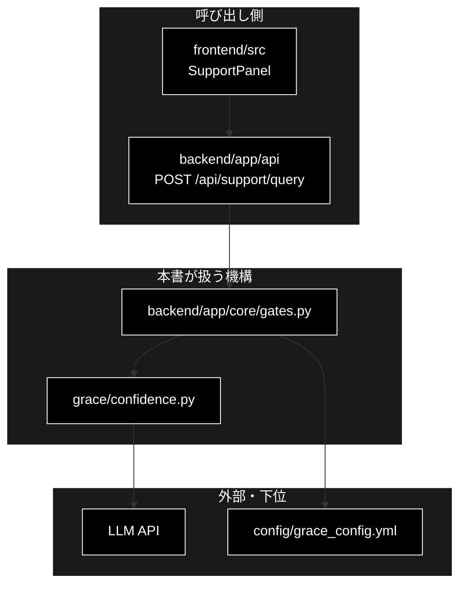

# 横断文書（直下 `docs/`）ドキュメント フォーマット仕様書

**Version 1.2** | 最終更新: 2026-09-24

---

## 目次

1. [概要](#概要)
2. [文書の種別と適用範囲](#1-文書の種別と適用範囲)
3. [横断文書（種別 A）の必須セクション構成](#2-横断文書種別-aの必須セクション構成)
4. [概要セクション（共通骨格）](#3-概要セクション共通骨格)
5. [アーキテクチャ構成図](#4-アーキテクチャ構成図)
6. [本文と関連ドキュメント](#5-本文と関連ドキュメント)
7. [調査メモ・設計案（種別 B）](#6-調査メモ設計案種別-b)
8. [TODO・棚卸し索引（種別 C）と資材（種別 D）](#7-todo棚卸し索引種別-cと資材種別-d)
9. [変更履歴とバージョン](#8-変更履歴とバージョン)
10. [Mermaid 記法](#9-mermaid-記法)
11. [検証](#10-検証)
12. [チェックリスト](#11-チェックリスト)
13. [付録: 基本フォーマットとの対応表](#付録-基本フォーマットとの対応表)
14. [変更履歴（本仕様書）](#変更履歴本仕様書)

---

## 概要

本仕様書は、リポジトリ直下 `docs/` に置く**横断文書**（2 つ以上の領域にまたがる設計・機構の説明）と、
同じ場所に置かれる調査メモ・TODO・資材の書き方を定める。

**各領域の `docs/`（`backend/docs/` / `grace/docs/` / `<package>/docs/` 等）にある IPO 以外の文書**
（その領域の設計・処理フロー・API 契約・手順・索引）にも本書を適用する。1 つの領域に閉じていても、
モジュール単体の IPO ではない文書は、書き方としては横断文書と同じ問題（複数モジュールにまたがる説明）を持つためである。
領域内の React コンポーネント文書は `a_react_page_md_format.md`、モジュール単体の IPO は `a_class_method_md_format.md` を使う。

本書は基本フォーマット `a_class_method_md_format.md` の**派生**である。同書 §1.4 の**共通骨格**
（タイトル＋Version・目次・概要〔主な責務／各責務対応のモジュール〕・アーキテクチャ構成図〔3 層〕・
変更履歴・Mermaid 黒背景）を保持し、IPO 詳細の代わりに**論点ごとの本文**を置く。

横断文書が IPO を持たないのは、関数・クラスの仕様の**正本が各領域の `docs/`**
（`backend/docs/` / `grace/docs/` / `<package>/docs/` 等）にあるためである。
同じ IPO を横断文書にも書くと二重管理になり、必ず片方だけ腐る（直下 `docs/README.md` §4 の重複禁止ルール）。

**図表の記述方法**: Mermaid v9（PyCharm Pro 対応）。黒背景・白文字は必須（§9）。

---

## 1. 文書の種別と適用範囲

直下 `docs/` と各領域の `docs/` の文書は、まず次の種別を決めてから書く。**種別はその場所の索引（`docs/README.md` / `backend/docs/README.md` 等）の文書一覧に明記する。**

| 種別 | 内容 | 例 | 使う仕様 |
|---|---|---|---|
| **A 横断文書** | 2 領域以上にまたがる機構・設計の説明（現行実装の正を述べる） | `pipelines.md` / `guardrails.md` / `reasoning_flow.md` | **本書 §2〜§5** |
| **B 調査メモ・設計案** | 調査結果・計測・提案・移行計画。結論と根拠を残す | `local_llm_timeout_budget.md` / `multi_question_handling.md` | 本書 §6 |
| **C TODO・棚卸し索引** | 進行中のタスク、`docs/README.md` のような索引 | `doc_modernization_todo.md` / `README.md` | 本書 §7 |
| **D 資材** | 実行ログ・スクリーンショット・外部レビュー原文 | `LLM/` / `images/` | 本書 §7（書式は問わない） |
| **E モジュール IPO** | トップレベル `.py` の IPO（パッケージに属さないため直下に置く） | `agent_parallel_search.md` | **`a_class_method_md_format.md`** |

> ⚠️ 1 つの領域（`backend/` だけ、`grace/` だけ等）で説明しきれる文書は直下に置かない。
> 判定は `docs/README.md` §2.1 に従う。

---

## 2. 横断文書（種別 A）の必須セクション構成

```
# {テーマ} - {説明}                    ← H1 は 1 行目に 1 つだけ
**Version X.X** | 最終更新: YYYY-MM-DD

---

## 目次
## 概要
### 主な責務
### 各責務対応のモジュール
### アーキテクチャ構成図              ← 3 層の Mermaid ＋ データフロー（§4）
## 1. {論点 1}                        ← 本文（論点ごと・自由構成）
## 2. {論点 2}
...
## N. 関連ドキュメント
## N+1. 変更履歴
```

| セクション | 必須 | 説明 |
|---|:---:|---|
| タイトル＋Version | ✅ | H1 は 1 行目。`##` をタイトルに使わない |
| 目次 | ✅ | 番号付き章へのリンク |
| 概要 → 主な責務 → 各責務対応のモジュール | ✅ | §3。共通骨格 |
| 概要 → アーキテクチャ構成図 | ✅ | §4。共通骨格。本文に同等の図があればリンクで代替可 |
| 本文 | ✅ | 論点ごとの番号付き章。構成は自由 |
| 関連ドキュメント | ⚪ | 正本へのリンク集（§5.2） |
| 変更履歴 | ✅ | §8 |

### 2.1 共通骨格を「番号なしの概要」に置く理由

横断文書の章番号は、**コード・テスト・他文書から `§` 番号で参照されている**
（例: テストの docstring に `docs/performance_levers.md §3 P-04`）。
共通骨格を番号付き章として足すと本文の番号がずれ、参照がすべて壊れる。

そのため共通骨格（主な責務・各責務対応のモジュール・アーキテクチャ構成図）は、
基本フォーマットでも番号を持たない `## 概要` の中に `###` で置く。
**本文の章番号は、既存文書を本書に合わせるときも変えない。**

---

## 3. 概要セクション（共通骨格）

```markdown
## 概要

{この文書が扱う機構を 2〜4 行で。どの領域にまたがるか・何を正本として持つかを書く}

### 主な責務

- {機構が担う責務 1}
- {機構が担う責務 2}
- {機構が担う責務 3}

### 各責務対応のモジュール

| # | 責務 | 対応モジュール | 説明 |
|---|------|--------------|------|
| 1 | {責務 1} | `backend/app/core/gates.py` | {そのモジュールが担う部分} |
| 2 | {責務 2} | `grace/confidence.py` | {…} |
| 3 | {責務 3} | `frontend/src/state/jobReducer.ts` | {…} |
```

**記述規則:**

- 「主な責務」は**文書ではなく、文書が扱う機構の責務**を書く（「〜を説明する」ではなく「〜を判定する」）。
  3〜7 項目、動詞で終える。
- 「各責務対応のモジュール」は主な責務と **1 対 1**（行数を一致させる）。
- 対応モジュールは**リポジトリルートからのパス**で書く（横断文書は複数領域を指すため、ファイル名だけでは曖昧）。
  1 責務が複数モジュールにまたがるときは主要なものを書き、説明列で補う。
- 基本フォーマットの「主要機能一覧」は横断文書では**任意**（関数の一覧は各領域の IPO 文書が正本）。

---

## 4. アーキテクチャ構成図

横断文書の機構が**システム全体のどこにあるか**を 1 枚で示す。基本フォーマット §3.1 と同じ 3 層構造を使う。

| 層 | 置くもの |
|---|---|
| 呼び出し側 | 画面（`frontend/`）・Web API（`backend/app/api/`）・CLI など、機構を起動する入口 |
| 本書が扱う機構 | 横断する複数モジュール（領域ごとにサブグラフを分けてよい） |
| 外部・下位 | LLM API・Embedding・Qdrant・設定ファイルなど |

```markdown
### アーキテクチャ構成図



**データフロー**:

1. {入口から機構へ何が渡るか}
2. {機構の中で何が起きるか}
3. {外部・下位から何が返り、どこへ出るか}
```

**記述規則:**

- 3 層のサブグラフ（呼び出し側 / 本書が扱う機構 / 外部・下位）を必ず置く。
- 図の直後に**データフロー**（番号付きリスト 3〜6 行）を置く。
- **本文にすでに同等の全体図がある場合は、重複させずにリンクで代替してよい**
  （例: 「[§1 ガードレール全体図](#1-ガードレール全体図) を参照」）。ただしその図が 3 層を満たすこと。
  満たさない場合は、概要側に 3 層図を置き、本文の図は詳細図として残す。
- 同じ図を別の文書にコピーしない。他文書の正本の図を使いたいときはリンクする。
- **同じ領域に構成図の正本を持つ文書がある場合**（例: `grace/docs/grace_core.md` §1.1）は、その節へのリンクと
  データフローで代替してよい。概要には「どの図が正本か」を 1 行で明記する。

---

## 5. 本文と関連ドキュメント

### 5.1 本文

- 論点ごとに番号付きの `##` 章を立てる。構成は自由。
- 関数・クラスの**シグネチャや IPO は書かない**（各領域の `docs/` へリンクする）。
  書いてよいのは、横断して初めて見える情報（対照表・機構 → 実装の対応・失敗時の既定・数値の根拠）。
- 実装の場所は `ファイル::シンボル` で書く。**行番号は書かない**（すぐにずれる）。

### 5.2 関連ドキュメント

```markdown
## N. 関連ドキュメント

| 文書 | 何の正本か |
|---|---|
| [`backend/docs/core_gates.md`](../backend/docs/core_gates.md) | `gates.py` の関数 IPO |
| [`pipelines.md`](pipelines.md) §2 | 3 モードのステップ対照表 |
```

---

## 6. 調査メモ・設計案（種別 B）

結論と根拠を残すための文書。現行実装の説明（種別 A）とは目的が違うため、骨格を軽くする。

```
# {テーマ} - {説明}
**Version X.X** | 最終更新: YYYY-MM-DD

## 目次                        ← H2 が 5 個以上なら必須
## 概要
### 結論                       ← 箇条書き 3〜5 行。何が分かり、何を決めたか
### 対象モジュール              ← 調査・変更の対象（表：# / モジュール / 関係）
## 1. ... 本文（調査項目・案ごと）
## N. 変更履歴
```

- **状態を明記する**（提案段階 / 実装済み / 却下）。実装済みになったら、現行の正本
  （種別 A の文書や各領域の `docs/`）へのリンクを概要の冒頭に置く。
- 図は任意。置くなら Mermaid 黒背景規約に従う。
- 実装が変わっても調査当時の数値は書き換えない（日付を付けて追記する）。

---

## 7. TODO・棚卸し索引（種別 C）と資材（種別 D）

### 7.1 種別 C

| 項目 | 規則 |
|---|---|
| タイトル＋Version | 必須 |
| 目次 | H2 が 5 個以上なら必須 |
| 変更履歴 | 必須 |
| 完了した TODO | `docs/archive/` へ `git mv` する（削除しない）。索引の「アーカイブ」欄へ移す |
| `docs/archive/` 配下 | **凍結**。書式是正の対象外（当時の記録として残すため、Version ヘッダー等を後から足さない） |

### 7.2 種別 D

- 書式は問わない（ログ・原文をそのまま残すため）。
- ただし次は守る:
  - **空ファイルを置かない**（作りかけは置かない。置くなら 1 行でも目的を書く）。
  - **ファイル名に空白を含めない**（リンク・シェルで壊れる）。
  - ディレクトリ単位で `docs/README.md` の資材一覧に載せる。

---

## 8. 変更履歴とバージョン

```markdown
## N. 変更履歴

| バージョン | 変更内容 |
|-----------|---------|
| 1.0 | 初版作成（YYYY-MM-DD） |
| 1.1 | … |
```

- ヘッダーの `**Version X.X**` は、変更履歴表の**最新版と一致させる**（全種別共通）。
- 表の並び（昇順 / 降順）は文書内で統一する。
- 日付は変更内容の中に `（YYYY-MM-DD）` で書く。

---

## 9. Mermaid 記法

基本フォーマット `a_class_method_md_format.md` §16.5 に従う（黒背景・白文字）。要点のみ再掲する。

- flowchart / graph: ブロック末尾に `classDef default fill:#000,stroke:#fff,color:#fff` と
  `classDef subgraphStyle fill:#1a1a1a,stroke:#fff,color:#fff`、全ノードに `class <ids> default`、
  全サブグラフに `style <name> fill:#1a1a1a,stroke:#fff,color:#fff`。
- sequenceDiagram: 先頭に `%%{ init: ... }%%`（Note 背景は **`noteBkgColor`**）。`classDef` は使わない。
- stateDiagram-v2: スタイル指定を付けない。

---

## 10. 検証

リポジトリ直下で実行する。共通骨格の有無・Version の一致・Mermaid 規約をまとめて見る。

```bash
python3 - <<'EOF'
import re, pathlib
for md in sorted(pathlib.Path('docs').glob('*.md')):
    t = md.read_text(encoding='utf-8')
    if not t.strip():
        print(f'{md}: 空ファイル'); continue
    ng = []
    if not t.startswith('# '): ng.append('H1 が 1 行目に無い')
    v = re.search(r'\*\*Version\s+([\d.]+)\*\*', t[:600])
    if not v: ng.append('Version 無し')
    hs = [m.start() for m in re.finditer(r'^##.*変更履歴', t, re.M)]
    if not hs: ng.append('変更履歴 無し')
    elif v:
        vs = re.findall(r'^\|\s*(\d+\.\d+)\s*\|', t[hs[-1]:], re.M)
        top = max(vs, key=lambda s: tuple(map(int, s.split('.')))) if vs else None
        if top and top != v.group(1): ng.append(f'Version 不一致 {v.group(1)}/{top}')
    for b in re.findall(r'```mermaid\n(.*?)```', t, re.S):
        head = [l for l in b.splitlines() if l.strip() and not l.strip().startswith('%%')][0]
        if head.split()[0] in ('flowchart', 'graph') and 'classDef default fill:#000' not in b:
            ng.append('flowchart の黒背景無し')
        if head.startswith('sequenceDiagram') and 'noteBkgColor' not in b:
            ng.append('sequenceDiagram の init 無し')
    print(f'{md}: ' + (', '.join(ng) if ng else 'OK'))
EOF
```

種別 A はさらに `### 主な責務` / `### 各責務対応のモジュール` / `### アーキテクチャ構成図` の 3 見出しを目視で確認する。

---

## 11. チェックリスト

- [ ] 種別（A〜E）を決め、`docs/README.md` の文書一覧に書いた
- [ ] H1 が 1 行目に 1 つだけある
- [ ] Version ヘッダーがあり、変更履歴の最新版と一致している
- [ ] 目次がある（種別 B・C は H2 が 5 個以上のとき）
- [ ] **種別 A**: 概要に「主な責務」と「各責務対応のモジュール」があり、1 対 1 で対応している
- [ ] **種別 A**: 概要に 3 層のアーキテクチャ構成図とデータフローがある（または本文の 3 層図へのリンク）
- [ ] 本文の既存の章番号を変えていない（`§` 参照が壊れていない）
- [ ] 関数・クラスの IPO を書いていない（各領域の `docs/` へリンクしている）
- [ ] 他の文書と同じ表・図を重複させていない（`docs/README.md` §4・§5）
- [ ] 全 Mermaid 図が黒背景・白文字規約を満たしている

---

## 付録: 基本フォーマットとの対応表

| `a_class_method_md_format.md` | 本書（種別 A） | 備考 |
|---|---|---|
| タイトル・Version・目次 | 同じ | 共通骨格 |
| 概要 → 主な責務 | 同じ | 共通骨格。**文書が扱う機構の責務**を書く |
| 概要 → 各責務対応のモジュール | 同じ | 共通骨格。パスはリポジトリルートから |
| 概要 → 主要機能一覧 | 任意 | 関数一覧の正本は各領域の IPO 文書 |
| 1. アーキテクチャ構成図（3 層）＋データフロー | 概要 → アーキテクチャ構成図 | 共通骨格。**番号なしの概要内**に置く（§2.1） |
| 2. モジュール構成図 | 本文（任意） | 必要なら論点の章に置く |
| 3. 一覧表 ／ 4. IPO詳細 ／ 5. 設定・定数 ／ 7. エクスポート | 持たない | 各領域の `docs/` が正本。関連ドキュメントでリンク |
| 6. 使用例 | 本文（任意） | 手順・検証方法として書く |
| 8. 変更履歴 | 同じ | 共通骨格 |
| 付録: 依存関係図 | 持たない | アーキテクチャ構成図で代替 |

---

## 変更履歴（本仕様書）

| バージョン | 変更内容 |
|-----------|---------|
| 1.0 | 初版作成（2026-09-24）。それまで横断文書の規定は `SKILL.md` の 1 文（「アーキテクチャ＋データフロー＋リンク集に徹してよい」）しかなく、直下 `docs/` の文書ごとに骨格がばらばらだった。種別 A〜E の区分、種別 A の必須構成（共通骨格を番号なしの概要に置き、本文の `§` 番号を守る）、種別 B〜D の軽量規則、Version 一致の検証スクリプトを定めた |
| 1.1 | 適用範囲を**各領域の `docs/` にある IPO 以外の文書**（設計・フロー・API 契約・手順・索引）へ広げた（2026-09-24）。`backend/docs/` の非 IPO 文書を本書の種別 A〜C で整えるため |
| 1.2 | §4 に「同じ領域に構成図の正本を持つ文書があれば、その節へのリンクで代替してよい」を追加（2026-09-24）。`grace/docs/` の概説書・実行時リファレンスが、構成図の正本 `grace_core.md` §1.1 を重複させずに参照できるようにするため |
