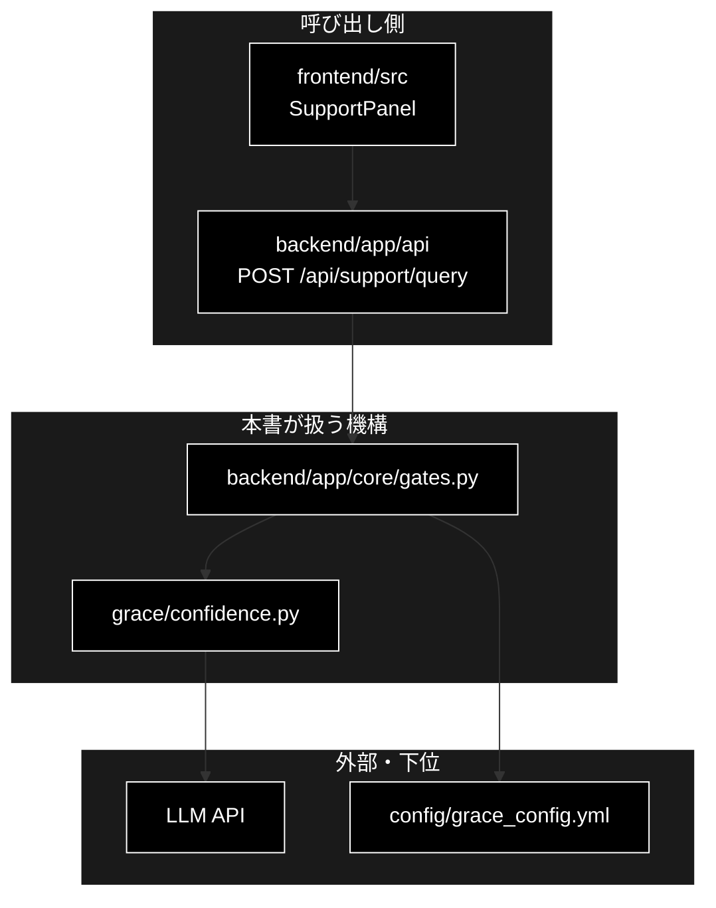

# 横断文書（直下 `docs/`）ドキュメント フォーマット仕様書

**Version 1.8** | 最終更新: 2026-10-10

---

## 目次

1. [概要](#概要)
2. [文書の種別と適用範囲](#1-文書の種別と適用範囲)
   - [ディレクトリ単位の文書構成（Python のディレクトリ）](#11-ディレクトリ単位の文書構成python-のディレクトリ)
     - [ディレクトリの区分と文書の置き場所](#111-ディレクトリの区分と文書の置き場所)
     - [`backend/` の扱い](#112-backend-の扱い)
   - [ディレクトリ概要 `README_<dir>.md` の構成](#12-ディレクトリ概要-readme_dirmd-の構成)
   - [`<dir>_process_flow.md` / `<dir>_data_flow.md` の構成](#13-dir_process_flowmd--dir_data_flowmd-の構成)
   - [既存文書の寄せ先（統合の手順）](#14-既存文書の寄せ先統合の手順)
3. [横断文書（種別 A）の必須セクション構成](#2-横断文書種別-aの必須セクション構成)
4. [概要セクション（共通骨格）](#3-概要セクション共通骨格)
5. [アーキテクチャ構成図](#4-アーキテクチャ構成図)
6. [本文と関連ドキュメント](#5-本文と関連ドキュメント)
7. [調査メモ・設計案・手順書（種別 B）](#6-調査メモ設計案手順書種別-b)
8. [TODO・棚卸し索引（種別 C）と資材（種別 D）](#7-todo棚卸し索引種別-cと資材種別-d)
9. [変更履歴とバージョン](#8-変更履歴とバージョン)
10. [Mermaid 記法](#9-mermaid-記法)
11. [検証](#10-検証)
12. [チェックリスト](#11-チェックリスト)
13. [付録: 基本フォーマットとの対応表](#付録-基本フォーマットとの対応表)
14. [変更履歴（本仕様書）](#変更履歴本仕様書)

---

## 概要

本仕様書は、リポジトリ直下 `docs/` に置く**横断文書**（2 つ以上の領域にまたがる設計・機構の説明）と、
同じ場所に置かれる調査メモ・TODO・資材の書き方を定める。

**各領域の `docs/`（`backend/docs/` / `grace/docs/` / `<package>/docs/` 等）にある IPO 以外の文書**
（その領域の設計・処理フロー・API 契約・手順・索引）にも本書を適用する。1 つの領域に閉じていても、
モジュール単体の IPO ではない文書は、書き方としては横断文書と同じ問題（複数モジュールにまたがる説明）を持つためである。
領域内の React コンポーネント文書は `a_react_page_md_format.md`、モジュール単体の IPO は `a_class_method_md_format.md` を使う。
Python のディレクトリごとの文書の並べ方（`README_<dir>.md` / `<module>.md` / `<dir>_process_flow.md` / `<dir>_data_flow.md`）も本書 §1.1 で定める。

本書は基本フォーマット `a_class_method_md_format.md` の**派生**である。同書 §1.4 の**共通骨格**
（タイトル＋Version・目次・概要〔主な責務／各責務対応のモジュール〕・アーキテクチャ構成図〔3 層〕・
変更履歴・Mermaid 黒背景）を保持し、IPO 詳細の代わりに**論点ごとの本文**を置く。

横断文書が IPO を持たないのは、関数・クラスの仕様の**正本が各領域の `docs/`**
（`backend/docs/` / `grace/docs/` / `<package>/docs/` 等）にあるためである。
同じ IPO を横断文書にも書くと二重管理になり、必ず片方だけ腐る（直下 `docs/README.md` §4 の重複禁止ルール）。

**図表の記述方法**: Mermaid v9（PyCharm Pro 対応）。黒背景・白文字は必須（§9）。

---

## 1. 文書の種別と適用範囲

直下 `docs/` と各領域の `docs/` の文書は、まず次の種別を決めてから書く。**種別はその場所の索引（`docs/README.md` / `backend/docs/README.md` 等）の文書一覧に明記する。**

| 種別 | 内容 | 例 | 使う仕様 |
|---|---|---|---|
| **A 横断文書** | 2 領域以上にまたがる機構・設計の説明（現行実装の正を述べる）。各領域の `docs/` では、その領域の設計・処理フロー・API 契約 | `docs/pipelines.md` / `docs/guardrails.md` / `backend/docs/api_contract.md` | **本書 §2〜§5** |
| **B 調査メモ・設計案・手順書** | 調査結果・計測・提案・移行計画、および手順書・運用ガイド（環境構築・テストの流し方・落とし穴集）。結論と根拠を残す | `backend/docs/install_and_setup.md` / `backend/docs/pitfalls.md` / `docs/local_llm_timeout_budget.md`（local のみ） | 本書 §6 |
| **C TODO・棚卸し索引** | 進行中のタスク、各領域の `README.md` のような索引 | 各 `docs/README.md` / `docs/doc_modernization_todo.md`（grace_v2 のみ）/ `docs/port_from_grace_v2_todo.md`（local のみ） | 本書 §7 |
| **D 資材** | 実行ログ・スクリーンショット・外部レビュー原文 | `docs/LLM/` / `docs/images/` | 本書 §7（書式は問わない） |
| **E モジュール IPO** | 1 モジュールの IPO。直下 `docs/` ではトップレベル `.py`（パッケージに属さない）のもの | `backend/docs/reference/*.md`（直下 `*.py` の文書は現在無い） | **`a_class_method_md_format.md`** |

> 本書は grace_v2 と grace_v2_local で**同じ内容**を持つ。例の「（local のみ）」「（grace_v2 のみ）」は
> 片方のリポジトリにしか無い文書を示す。各文書の種別の正は、その場所の索引の「種別」列である。

> `<dir>/docs/README_<dir>.md` は種別 C、`<dir>_process_flow.md` / `<dir>_data_flow.md` は種別 A、`<dir>/docs/<module>.md` は種別 E（§1.1）。

> ⚠️ 1 つの領域（`backend/` だけ、`grace/` だけ等）で説明しきれる文書は直下に置かない。
> 判定は `docs/README.md` §2.1 に従う。

### 1.1 ディレクトリ単位の文書構成（Python のディレクトリ）

`*.py`（`__init__.py` 以外）を持つディレクトリの文書は、**そのディレクトリの `docs/` に次の形で置く**。
これ以外の文書は作らず、§1.4 の寄せ先へ統合する。対象のディレクトリは §1.1.1 の表のとおり。

```
<dir>/
├── a.py
├── b.py
├── __init__.py                 ← 文書を作らない（公開 API は README_<dir>.md §3 に書く）
└── docs/
    ├── README_<dir>.md         ← 必須。ディレクトリ概要＋モジュール索引（§1.2）
    ├── a.md                    ← 必須。a.py の IPO（a_class_method_md_format.md・種別 E）
    ├── b.md                    ← 必須。b.py の IPO
    ├── <dir>_process_flow.md   ← 任意。処理フロー（§1.3）
    ├── <dir>_data_flow.md      ← 任意。データフロー（§1.3）
    ├── images/                 ← 任意。上の文書が参照する画像
    └── archive/                ← 凍結した過去文書（§7.1）
```

| 規則 | 内容 |
|---|---|
| `<dir>` の名前 | ディレクトリ名の最後の 1 段。`qa_qdrant/command/` なら `README_command.md` / `command_process_flow.md` |
| モジュール文書 | `<dir>/*.py`（`__init__.py`・テストを除く）と **1 対 1**。ファイル名はモジュール名そのもの（`executor.py` → `executor.md`） |
| `README_<dir>.md` | 必須。ディレクトリの概要・構成図・**モジュール索引**・使い方・公開 API を持つ。従来の `<dir>/docs/README.md`（索引）の役目を引き継ぐ |
| 処理フロー・データフロー | **必要なときだけ**作る。目安: 処理が 3 モジュール以上をまたぐ／CLI・Web から多段の処理が走る → `process_flow`。ファイル・DB・外部 API のあいだでデータの形が変わる → `data_flow`。`README_<dir>.md` の構成図とデータフロー（数行）で足りるなら作らない |
| 1 モジュールに閉じた解説 | 並列処理・状態機械などの解説は、そのモジュールの文書の固有解説章（`a_class_method_md_format.md` §1.3）に書く。別文書にしない |
| 対応する `.py` が無い文書 | モジュールを削除・改名したら、文書も `git mv` で改名するか `archive/` へ移す |
| ファイル名 | 空白を含めない。`.md` 以外（画像）は `images/` へ |

#### 1.1.1 ディレクトリの区分と文書の置き場所

リポジトリ直下を除くディレクトリは、次のように区分する（2026-10-10 実測。両リポジトリで同じ）。

| 区分 | ディレクトリ | 中身 | 文書の置き場所 |
|---|---|---|---|
| **画面・Web API** | `frontend/` | Vite + React 18 + TypeScript（`.py` なし） | `frontend/docs/<Component>.md`（`a_react_page_md_format.md`）。本節の対象外 |
| | `backend/app/` | FastAPI の本体（`main.py`）とスキーマ（`schemas.py`） | `backend/app/docs/`（§1.1 の本則） |
| | `backend/app/api/` | エンドポイント（`data` / `meta` / `qdrant` / `review` / `support`） | `backend/app/api/docs/`（本則） |
| | `backend/app/core/` | GRACE-Support / GRACE-Review のコア・ゲート・ジョブ管理 | `backend/app/core/docs/`（本則） |
| | `backend/docs/` | backend 全体にまたがる文書（処理フロー・API 契約・手順・索引） | §1.1.2 |
| **設定** | `config/` | `grace_config.yml` だけ（`.py` なし） | 文書を作らない。設定項目は読み手の文書（`grace/docs/config.md`）に書く |
| **データ準備**（チャンク・Q/A 作成・Qdrant） | `chunking/` / `qa_generation/` / `qa_qdrant/` / `qa_qdrant/command/` | チャンク化・Q/A 生成・Qdrant 登録とコレクション管理。`qa_qdrant/command/` は CLI のコマンド（`list_collections.py`） | 本則 |
| **コア** | `grace/` / `services/` / `helper/` | エージェント基盤・サービス層・共通ヘルパー（LLM・Embedding・RAG） | 本則 |
| **運用・計測ツール** | `scripts/` | しきい値の計測・Qdrant スナップショット・ルールセットの CSV 書き出し（**テストではない**） | 本則 |
| **テスト** | `backend/tests/`（`integration/` / `e2e/` を含む） | pytest。**リポジトリ直下に `tests/` は無い** | 本節の対象外（テスト仕様は grace-agent-tests スキル） |
| **環境・入出力**（必須。削除しない） | `docker-compose/` | Qdrant・Redis などの Docker 環境の定義（`docker-compose.yml`） | `.py` が無いので `docs/` は作らない。起動手順は `backend/docs/install_and_setup.md` に書く |
| | `OUTPUT/` / `qa_output/`（grace_v2 のみ） | 入出力ファイルの置き場（チャンク化の入力・Q/A の出力など） | `.py` が無いので `docs/` は作らない。ファイルの形式・命名は使う側（`chunking/` / `qa_qdrant/` 等）の文書に書く |
| （直下） | リポジトリ直下の `*.py` | `config.py` / `agent_tools.py` / `support_actions.py` など | 直下 `docs/<module>.md`（種別 E）。概要は直下 `README.md`、索引は `docs/README.md`。直下 `docs/` は横断文書（種別 A〜D）の置き場を兼ねる |

- サブディレクトリ（`qa_qdrant/command/` / `backend/app/api/` など）は、**それぞれが 1 つのディレクトリ**として
  自分の `docs/` を持つ（親の `docs/` に混ぜない）。
- `__init__.py` しか無いディレクトリ（`backend/` 直下など）は対象外。

#### 1.1.2 `backend/` の扱い

`backend/` は 3 つのディレクトリ（`app/` / `app/api/` / `app/core/`）に分かれるので、モジュール文書はそれぞれの `docs/` に置き、
**backend 全体にまたがる文書だけ**を `backend/docs/` に残す。

```
backend/
├── docs/                         ← backend 全体の横断文書（種別 A〜D）と索引 README.md
│   ├── README.md                 ← backend の索引（3 つの README_<dir>.md へのリンクを含む）
│   ├── support_flow.md / review_flow.md / data_pipeline.md / api_contract.md / testing.md など
│   └── archive/
└── app/
    ├── docs/       README_app.md  / main.md / schemas.md
    ├── api/docs/   README_api.md  / data.md / meta.md / qdrant.md / review.md / support.md
    └── core/docs/  README_core.md / support_agent.md / review_agent.md / gates.md / jobs.md など
```

- 現在の `backend/docs/reference/<サブパッケージ>_<module>.md` は、接頭辞を外して各 `docs/` へ移す
  （例: `reference/api_meta.md` → `backend/app/api/docs/meta.md`、`reference/core_gates.md` → `backend/app/core/docs/gates.md`、
  `reference/main.md` → `backend/app/docs/main.md`）。移し終えたら `reference/` は無くなる。
- `backend/docs/` の文書（Support / Review の処理フローなど）は、`api/` と `core/` の**両方にまたがる**ので、
  `core_process_flow.md` などへ分割せずにそのまま残す。`api/` だけ・`core/` だけで閉じる流れが新たに要るときは、
  そのディレクトリの `<dir>_process_flow.md` に書く。

> 構成の検査は §10 の `--layout`。移行前のディレクトリは「要対応」と出る（§1.4 の手順で寄せていく）。

### 1.2 ディレクトリ概要 `README_<dir>.md` の構成

種別 C（索引）に当たるが、**共通骨格（主な責務・各責務対応のモジュール・3 層構成図）を必ず持つ**。

```
# README_<dir>.md - <dir>/ ディレクトリ概要
**Version X.X** | 最終更新: YYYY-MM-DD

---

## 目次
## 概要                              ← このディレクトリが何をするかを 2〜4 行
### 主な責務
### 各責務対応のモジュール            ← 対応モジュールは <dir>/ の .py（1 対 1）
### アーキテクチャ構成図              ← 3 層（呼び出し側 → <dir>/ → 外部・下位）＋データフロー（§4）
## 1. モジュール一覧（索引）
## 2. 使い方（代表的なワークフロー）
## 3. 公開 API（__init__.py）
## 4. 処理フロー・データフロー
## 5. 既知の制約・残課題              ← 任意
## 6. 変更履歴
```

| 章 | 書くこと |
|---|---|
| 1. モジュール一覧 | `\| モジュール \| 文書 \| 種別 \| 行数 \| Ver \| 概要 \|`。`*.py`（`__init__.py` を除く）を**全部** 1 行ずつ。文書が無いものは文書列を ❌ にして残す。`process_flow` / `data_flow` もここに載せる。行数・Ver は実測 |
| 2. 使い方 | **モジュールを組み合わせる**典型的な流れ（例: `grace/` なら `create_planner` → `create_executor` → 結果の確認）。処理パターンが複数あれば主要なパターンごとに例を書き（`a_class_method_md_format.md` §6.1.1・§9.4）、単独で動く・動かして確かめる（同 §9.5）。各モジュールの `4.1 使用例` と同じコードは載せず、リンクする |
| 3. 公開 API | `__init__.py` の `__all__`（`\| 名前 \| 定義元 \| 用途 \|`）。空なら「公開 API なし（各モジュールを直接 import する）」と書く |
| 4. 処理フロー・データフロー | 別文書があればリンクと 2〜3 行の要約。無ければ要点をここに書く |

### 1.3 `<dir>_process_flow.md` / `<dir>_data_flow.md` の構成

いずれも種別 A（§2〜§5 の骨格）。本文は次の章立てを基本にする。IPO（シグネチャ・引数表）は書かず、各モジュール文書へリンクする。

**処理フロー（`<dir>_process_flow.md`）**

```
## 1. 全体フロー          ← flowchart（入口 → 各段 → 出口）
## 2. ステップ詳細        ← 表: # / ステップ / 実装（ファイル::シンボル）/ 入力 / 出力 / 失敗時の既定
## 3. 分岐・例外・中断    ← 条件分岐・エラー時の既定・再試行・一時停止と再開
## 4. シーケンス          ← 任意。sequenceDiagram（呼び出しの往復が要点のとき）
## 5. 関連ドキュメント
## 6. 変更履歴
```

**データフロー（`<dir>_data_flow.md`）**

```
## 1. データの流れ全体    ← flowchart（入力ファイル → 中間データ → 出力・DB）
## 2. データ項目と形式    ← 表: データ / 形式（CSV の列・JSON のキー・型）/ 作る側 / 使う側 / 置き場所
## 3. 変換の詳細          ← 段ごとの入出力の例（実データの抜粋 2〜3 行）
## 4. 保存先・命名・上書き ← 出力ファイル名・上書きの有無・Qdrant のコレクション名など
## 5. 関連ドキュメント
## 6. 変更履歴
```

### 1.4 既存文書の寄せ先（統合の手順）

| 既存の文書 | 寄せ先 |
|---|---|
| `<dir>/docs/README.md`（索引） | `README_<dir>.md` §1 モジュール一覧 |
| ディレクトリの概説（例: `grace/docs/grace.md` / `grace_core.md` / `qa_qdrant/docs/qa_qdrant_architecture.md`） | `README_<dir>.md` の概要・構成図 |
| 処理の流れの説明（例: `grace_core_flow.md`） | `<dir>_process_flow.md` |
| データの形・変換の説明 | `<dir>_data_flow.md` |
| 使い方・手順・学習メモ（例: `usage.md` / `celery_quick_start.md` / `00_learning.md`） | `README_<dir>.md` §2 使い方。ディレクトリをまたぐ環境構築は直下 `docs/` の種別 B |
| `__init__.md` | `README_<dir>.md` §3 公開 API |
| 1 モジュールについての重複・補足文書（例: `*_ipo.md`・比較メモ・改修メモ） | そのモジュールの `<module>.md`（固有解説章・使用例・変更履歴） |
| 別のディレクトリのモジュールの文書 | そのモジュールがあるディレクトリの `docs/`（直下 `*.py` なら直下 `docs/`） |
| `backend/docs/reference/<サブパッケージ>_<module>.md` | 接頭辞を外して `backend/app/docs/` / `backend/app/api/docs/` / `backend/app/core/docs/` へ（§1.1.2） |
| 役目を終えたメモ・計測ログ | `archive/` へ `git mv`（削除しない） |

- 統合するときは、**移す内容を実装と突き合わせてから**書く（古い文書をそのまま移さない）。
- 移した元の文書は残さない（二重管理になる）。移した先は変更履歴に「`foo.md` を統合」と書く。
- 文書名を変えたら、リンクしている文書を `grep` で探して直す。

---

## 2. 横断文書（種別 A）の必須セクション構成

```
# {テーマ} - {説明}                    ← H1 は 1 行目に 1 つだけ
**Version X.X** | 最終更新: YYYY-MM-DD

---

## 目次
## 概要
### 主な責務
### 各責務対応のモジュール
### アーキテクチャ構成図              ← 3 層の Mermaid ＋ データフロー（§4）
## 1. {論点 1}                        ← 本文（論点ごと・自由構成）
## 2. {論点 2}
...
## N. 関連ドキュメント
## N+1. 変更履歴
```

| セクション | 必須 | 説明 |
|---|:---:|---|
| タイトル＋Version | ✅ | H1 は 1 行目。`##` をタイトルに使わない |
| 目次 | ✅ | 番号付き章へのリンク |
| 概要 → 主な責務 → 各責務対応のモジュール | ✅ | §3。共通骨格 |
| 概要 → アーキテクチャ構成図 | ✅ | §4。共通骨格。本文に同等の図があればリンクで代替可 |
| 本文 | ✅ | 論点ごとの番号付き章。構成は自由 |
| 関連ドキュメント | ⚪ | 正本へのリンク集（§5.2） |
| 変更履歴 | ✅ | §8 |

### 2.1 共通骨格を「番号なしの概要」に置く理由

横断文書の章番号は、**コード・テスト・他文書から `§` 番号で参照されている**
（例: テストの docstring に `docs/performance_levers.md §3 P-04`）。
共通骨格を番号付き章として足すと本文の番号がずれ、参照がすべて壊れる。

そのため共通骨格（主な責務・各責務対応のモジュール・アーキテクチャ構成図）は、
基本フォーマットでも番号を持たない `## 概要` の中に `###` で置く。
**本文の章番号は、既存文書を本書に合わせるときも変えない。**

---

## 3. 概要セクション（共通骨格）

```markdown
## 概要

{この文書が扱う機構を 2〜4 行で。どの領域にまたがるか・何を正本として持つかを書く}

### 主な責務

- {機構が担う責務 1}
- {機構が担う責務 2}
- {機構が担う責務 3}

### 各責務対応のモジュール

| # | 責務 | 対応モジュール | 説明 |
|---|------|--------------|------|
| 1 | {責務 1} | `backend/app/core/gates.py` | {そのモジュールが担う部分} |
| 2 | {責務 2} | `grace/confidence.py` | {…} |
| 3 | {責務 3} | `frontend/src/state/jobReducer.ts` | {…} |
```

**記述規則:**

- 「主な責務」は**文書ではなく、文書が扱う機構の責務**を書く（「〜を説明する」ではなく「〜を判定する」）。
  3〜7 項目、動詞で終える。
- 「各責務対応のモジュール」は主な責務と **1 対 1**（行数を一致させる）。
- 対応モジュールは**リポジトリルートからのパス**で書く（横断文書は複数領域を指すため、ファイル名だけでは曖昧）。
  1 責務が複数モジュールにまたがるときは主要なものを書き、説明列で補う。
- 基本フォーマットの「主要機能一覧」は横断文書では**任意**（関数の一覧は各領域の IPO 文書が正本）。

---

## 4. アーキテクチャ構成図

横断文書の機構が**システム全体のどこにあるか**を 1 枚で示す。基本フォーマット §3.1 と同じ 3 層構造を使う。

| 層 | 置くもの |
|---|---|
| 呼び出し側 | 画面（`frontend/`）・Web API（`backend/app/api/`）・CLI など、機構を起動する入口 |
| 本書が扱う機構 | 横断する複数モジュール（領域ごとにサブグラフを分けてよい） |
| 外部・下位 | LLM API・Embedding・Qdrant・設定ファイルなど |

```markdown
### アーキテクチャ構成図


```mermaid
flowchart TB
    subgraph CALLER["呼び出し側"]
        UI["frontend/src<br>SupportPanel"]
        API["backend/app/api<br>POST /api/support/query"]
    end
    subgraph MECH["本書が扱う機構"]
        CORE["backend/app/core/gates.py"]
        CONF["grace/confidence.py"]
    end
    subgraph EXTERNAL["外部・下位"]
        LLM["LLM API"]
        CFG["config/grace_config.yml"]
    end
    UI --> API
    API --> CORE
    CORE --> CONF
    CONF --> LLM
    CORE --> CFG
classDef default fill:#000,stroke:#fff,color:#fff
classDef subgraphStyle fill:#1a1a1a,stroke:#fff,color:#fff
class UI,API,CORE,CONF,LLM,CFG default
style CALLER fill:#1a1a1a,stroke:#fff,color:#fff
style MECH fill:#1a1a1a,stroke:#fff,color:#fff
style EXTERNAL fill:#1a1a1a,stroke:#fff,color:#fff
```

**データフロー**:

1. {入口から機構へ何が渡るか}
2. {機構の中で何が起きるか}
3. {外部・下位から何が返り、どこへ出るか}
```

**記述規則:**

- 3 層のサブグラフ（呼び出し側 / 本書が扱う機構 / 外部・下位）を必ず置く。
- 図の直後に**データフロー**（番号付きリスト 3〜6 行）を置く。
- **本文にすでに同等の全体図がある場合は、重複させずにリンクで代替してよい**
  （例: 「[§1 ガードレール全体図](#1-ガードレール全体図) を参照」）。ただしその図が 3 層を満たすこと。
  満たさない場合は、概要側に 3 層図を置き、本文の図は詳細図として残す。
- 同じ図を別の文書にコピーしない。他文書の正本の図を使いたいときはリンクする。
- **同じ領域に構成図の正本を持つ文書がある場合**（例: `grace/docs/grace_core.md` §1.1）は、その節へのリンクと
  データフローで代替してよい。概要には「どの図が正本か」を 1 行で明記する。

---

## 5. 本文と関連ドキュメント

### 5.1 本文

- 論点ごとに番号付きの `##` 章を立てる。構成は自由。
- 関数・クラスの**シグネチャや IPO は書かない**（各領域の `docs/` へリンクする）。
  書いてよいのは、横断して初めて見える情報（対照表・機構 → 実装の対応・失敗時の既定・数値の根拠）。
- 実装の場所は `ファイル::シンボル` で書く。**行番号は書かない**（すぐにずれる）。

### 5.2 関連ドキュメント

```markdown
## N. 関連ドキュメント

| 文書 | 何の正本か |
|---|---|
| [`backend/docs/support_flow.md`](../backend/docs/support_flow.md) | Support パイプラインの各ステップ |
| [`pipelines.md`](pipelines.md) §2 | 3 モードのステップ対照表 |
```

---

## 6. 調査メモ・設計案・手順書（種別 B）

結論と根拠を残すための文書。現行実装の説明（種別 A）とは目的が違うため、骨格を軽くする。
手順書（環境構築・テストの流し方・落とし穴集など「どう動かすか・何を避けるか」を述べる文書）も種別 B とし、
「結論」に要点（最短の手順・最重要の注意）を、「対象モジュール」に手順が触れるファイルを書く。

> 種別 B は「主な責務」「各責務対応のモジュール」を**持たない**（代わりに「結論」「対象モジュール」）。
> 機械検証（§10）で「主な責務」が無いと出ても、`### 結論` があれば正しい。

```
# {テーマ} - {説明}
**Version X.X** | 最終更新: YYYY-MM-DD

## 目次                        ← H2 が 5 個以上なら必須
## 概要
### 結論                       ← 箇条書き 3〜5 行。何が分かり、何を決めたか
### 対象モジュール              ← 調査・変更の対象（表：# / モジュール / 関係）
## 1. ... 本文（調査項目・案ごと）
## N. 変更履歴
```

- **状態を明記する**（提案段階 / 実装済み / 却下）。実装済みになったら、現行の正本
  （種別 A の文書や各領域の `docs/`）へのリンクを概要の冒頭に置く。
- 図は任意。置くなら Mermaid 黒背景規約に従う。
- 実装が変わっても調査当時の数値は書き換えない（日付を付けて追記する）。

---

## 7. TODO・棚卸し索引（種別 C）と資材（種別 D）

### 7.1 種別 C

| 項目 | 規則 |
|---|---|
| タイトル＋Version | 必須 |
| 目次 | H2 が 5 個以上なら必須 |
| 変更履歴 | 必須 |
| 完了した TODO | 同じ領域の `docs/archive/`（例: `docs/archive/` / `backend/docs/archive/`）へ `git mv` する（削除しない）。無ければ作る。索引の「アーカイブ」欄へ移す |
| `<領域>/docs/archive/` 配下 | **凍結**。書式是正の対象外（当時の記録として残すため、Version ヘッダー等を後から足さない） |

### 7.2 種別 D

- 書式は問わない（ログ・原文をそのまま残すため）。
- ただし次は守る:
  - **空ファイルを置かない**（作りかけは置かない。置くなら 1 行でも目的を書く）。
  - **ファイル名に空白を含めない**（リンク・シェルで壊れる）。
  - ディレクトリ単位で `docs/README.md` の資材一覧に載せる。

---

## 8. 変更履歴とバージョン

```markdown
## N. 変更履歴

| バージョン | 日付 | 変更内容 |
|-----------|------|---------|
| 1.0 | YYYY-MM-DD | 初版作成 |
| 1.1 | YYYY-MM-DD | … |
```

- 列は `バージョン | 日付 | 変更内容` の 3 列（全フォーマット共通。`a_class_method_md_format.md` §14）。
  記録の無い過去の版は日付を `—` とする。
- ヘッダーの `**Version X.X**` と `最終更新` は、変更履歴表の**最新行と一致させる**（全種別共通）。
- 並びは**昇順**（古い版が上）とする。
- 見出しは `バージョン` / `日付` / `変更内容` の語をそのまま使う（`版`・`Version`・`内容` などにしない）。
- 2026-10-10 に両リポジトリの全文書（`archive/` を除く）を一括でこの形へ移した。日付列は、本文中の日付
  （「（YYYY-MM-DD）」など）から写したもので、記録の無い版は `—` である（本文中の日付はそのまま残している）。
  §10 の検証スクリプトは、見出しが違う表・昇順でない表を NG にする。

---

## 9. Mermaid 記法

基本フォーマット `a_class_method_md_format.md` §16.5 に従う（黒背景・白文字）。要点のみ再掲する。

- flowchart / graph: ブロック末尾に `classDef default fill:#000,stroke:#fff,color:#fff` と
  `classDef subgraphStyle fill:#1a1a1a,stroke:#fff,color:#fff`、全ノードに `class <ids> default`、
  全サブグラフに `style <name> fill:#1a1a1a,stroke:#fff,color:#fff`。
- sequenceDiagram: 先頭に `%%{ init: ... }%%`（Note 背景は **`noteBkgColor`**）。`classDef` は使わない。
- stateDiagram-v2: スタイル指定を付けない。

---

## 10. 検証

リポジトリ直下で実行する。**全領域の `docs/`**（直下 `docs/` と `<領域>/docs/`）を対象に、
共通骨格の有無・Version の一致・変更履歴の形（3 列の見出し・昇順）・Mermaid 規約をまとめて見る。スクリプトを `check_docs.py` として保存し、
`python3 check_docs.py`（全体）または `python3 check_docs.py backend/docs foo.md`（指定分だけ）で実行する。ディレクトリ構成（§1.1）は `python3 check_docs.py --layout` で見る。
`archive/` 配下（凍結）と資材ディレクトリ（種別 D）は対象外。

```python
import re, sys, pathlib, subprocess
SKIP = ('/archive/', '/LLM/', '/LLM_design/', '/images/', 'node_modules', '/.venv/')


def check_files(args):
    files = []
    for a in args or [pathlib.Path('.')]:
        files += [a] if a.is_file() else sorted(a.glob('**/docs/**/*.md')) + sorted(a.glob('docs/*.md'))
    for md in sorted(set(files)):
        s = '/' + str(md)
        if any(x in s for x in SKIP): continue
        t = md.read_text(encoding='utf-8')
        if not t.strip():
            print(f'{md}: 空ファイル'); continue
        ng, warn = [], []
        if not t.startswith('# '): ng.append('H1 が 1 行目に無い')
        v = re.search(r'\*\*Version\s+([\d.]+)\*\*', t[:600])
        if not v: ng.append('Version 無し')
        hs = [m.start() for m in re.finditer(r'^##.*変更履歴', t, re.M)]
        if not hs: ng.append('変更履歴 無し')
        else:
            seg = t[hs[-1]:]
            vs = re.findall(r'^\|\s*v?(\d+\.\d+)\s*\|', seg, re.M)
            top = max(vs, key=lambda s: tuple(map(int, s.split('.')))) if vs else None
            if v and top and top != v.group(1): ng.append(f'Version 不一致 {v.group(1)}/{top}')
            hdr = re.search(r'^\|(.*)\|\s*$', seg, re.M)
            if hdr and [c.strip() for c in hdr.group(1).split('|')] != ['バージョン', '日付', '変更内容']:
                ng.append('変更履歴の見出しが「バージョン | 日付 | 変更内容」でない')
            keys = [tuple(map(int, re.findall(r'\d+', x)[:3])) for x in re.findall(r'^\|\s*\**v?(\d+(?:\.\d+)+)', seg, re.M)]
            if keys != sorted(keys): ng.append('変更履歴が昇順でない')
        for b in re.findall(r'```mermaid\n(.*?)```', t, re.S):
            lines = [l for l in b.splitlines() if l.strip() and not l.strip().startswith('%%')]
            if not lines: continue
            head = lines[0].split()[0]
            if head in ('flowchart', 'graph') and 'classDef default fill:#000' not in b:
                ng.append('flowchart の黒背景無し')
            if head == 'sequenceDiagram' and 'noteBkgColor' not in b:
                ng.append('sequenceDiagram の init 無し')
        if md.name != 'README.md' and '### 主な責務' not in t and '### 結論' not in t:
            warn.append('概要に「主な責務」（種別 B は「結論」）が無い')
        if re.match(r'# \S+\.py - ', t) and not re.search(r'^### \d+\.1 使用例', t, re.M):
            warn.append('IPO 詳細の冒頭に「使用例」（### N.1 使用例）が無い')
        msg = ', '.join(ng) if ng else 'OK'
        print(f'{md}: {msg}' + (f'  [注意] {"; ".join(warn)}' if warn else ''))


# §1.1 の構成検査。frontend/・テスト・リポジトリ直下は §1.1.1 の表に従うので見ない（backend/app 配下は本則）
LAYOUT_SKIP = ('frontend', 'tests', 'docs', 'archive', 'node_modules', '.venv', '__pycache__')


def check_layout():
    py = subprocess.run(['git', 'ls-files', '*.py'], capture_output=True, text=True).stdout.split()
    dirs = {}
    for f in map(pathlib.Path, py):
        if f.parent == pathlib.Path('.') or any(x in f.parts for x in LAYOUT_SKIP):
            continue
        if f.name == '__init__.py' or f.name.startswith('test_') or f.name == 'conftest.py':
            dirs.setdefault(f.parent, set()); continue
        dirs.setdefault(f.parent, set()).add(f.stem)
    bad = 0
    dirs = {d: m for d, m in dirs.items() if m}   # __init__.py しか無いディレクトリは対象外
    for d in sorted(dirs):
        name, docs, mods = d.name, d / 'docs', dirs[d]
        allowed = {f'README_{name}.md', f'{name}_process_flow.md', f'{name}_data_flow.md'} | {f'{m}.md' for m in mods}
        have = {p.name for p in docs.iterdir()} if docs.is_dir() else set()
        msgs = []
        if not docs.is_dir(): msgs.append('docs/ が無い')
        if docs.is_dir() and f'README_{name}.md' not in have: msgs.append(f'README_{name}.md が無い')
        miss = sorted(m for m in mods if f'{m}.md' not in have)
        if miss: msgs.append('モジュール文書が無い: ' + ', '.join(miss))
        extra = sorted(h for h in have if h not in allowed and h not in ('images', 'archive'))
        if extra: msgs.append('寄せ先が未定の文書（§1.4）: ' + ', '.join(extra))
        bad += bool(msgs)
        print(f'[構成] {d}/: ' + ('; '.join(msgs) if msgs else 'OK'))
    print(f'[構成] 対象 {len(dirs)} ディレクトリ・要対応 {bad}')


if __name__ == '__main__':
    if '--layout' in sys.argv:
        check_layout()
    else:
        check_files([pathlib.Path(a) for a in sys.argv[1:]])
```

- `python3 check_docs.py --layout` は §1.1 の**ディレクトリ構成**を見る（`README_<dir>.md` の有無・モジュール文書の欠け・寄せ先が未定の文書）。§1.1.1 で対象外の場所（リポジトリ直下・`frontend/`・テスト）は見ない。`backend/app/` 配下は見る。
- IPO 文書（タイトルが `# xxx.py - `）に `### N.1 使用例` が無いと `[注意]` を出す（`a_class_method_md_format.md` §6.1）。
- `OK` 以外（NG）は必ず直す。`[注意]` は種別によっては正しい（種別 C・D に「主な責務」は要らない）ので、
  索引の種別列と見比べて判断する。
- 種別 A はさらに `### 主な責務` / `### 各責務対応のモジュール` / `### アーキテクチャ構成図` の 3 見出しを目視で確認する。

---

## 11. チェックリスト

- [ ] 種別（A〜E）を決め、その場所の索引（`docs/README.md` / `backend/docs/README.md` 等）の文書一覧に書いた
- [ ] Python のディレクトリの文書は §1.1 の形（`README_<dir>.md` / `<module>.md` / `<dir>_process_flow.md` / `<dir>_data_flow.md`）に収め、`README_<dir>.md` のモジュール一覧に行を足した（`check_docs.py --layout`）
- [ ] `README_<dir>.md` の「使い方」は、処理パターンが複数あれば主要なパターンごとに例を書き、動かして確かめた
- [ ] H1 が 1 行目に 1 つだけある
- [ ] Version ヘッダーがあり、変更履歴（`バージョン | 日付 | 変更内容` の 3 列）の最新行と一致している
- [ ] §10 の検証スクリプトが `OK` になる
- [ ] 目次がある（種別 B・C は H2 が 5 個以上のとき）
- [ ] **種別 A**: 概要に「主な責務」と「各責務対応のモジュール」があり、1 対 1 で対応している
- [ ] **種別 A**: 概要に 3 層のアーキテクチャ構成図とデータフローがある（または本文の 3 層図へのリンク）
- [ ] 本文の既存の章番号を変えていない（`§` 参照が壊れていない）
- [ ] 関数・クラスの IPO を書いていない（各領域の `docs/` へリンクしている）
- [ ] 他の文書と同じ表・図を重複させていない（`docs/README.md` §4・§5）
- [ ] 全 Mermaid 図が黒背景・白文字規約を満たしている

---

## 付録: 基本フォーマットとの対応表

| `a_class_method_md_format.md` | 本書（種別 A） | 備考 |
|---|---|---|
| タイトル・Version・目次 | 同じ | 共通骨格 |
| 概要 → 主な責務 | 同じ | 共通骨格。**文書が扱う機構の責務**を書く |
| 概要 → 各責務対応のモジュール | 同じ | 共通骨格。パスはリポジトリルートから |
| 概要 → 主要機能一覧 | 任意 | 関数一覧の正本は各領域の IPO 文書 |
| 1. アーキテクチャ構成図（3 層）＋データフロー | 概要 → アーキテクチャ構成図 | 共通骨格。**番号なしの概要内**に置く（§2.1） |
| 2. モジュール構成図 | 本文（任意） | 必要なら論点の章に置く |
| 3. 一覧表 ／ 4. IPO詳細 ／ 5. 設定・定数 ／ 7. エクスポート | 持たない | 各領域の `docs/` が正本。関連ドキュメントでリンク |
| 6. 使用例 | 本文（任意） | 手順・検証方法として書く |
| 8. 変更履歴 | 同じ | 共通骨格 |
| 付録: 依存関係図 | 持たない | アーキテクチャ構成図で代替 |

---

## 変更履歴（本仕様書）

| バージョン | 日付 | 変更内容 |
|---|---|---|
| 1.0 | 2026-09-24 | 初版作成。それまで横断文書の規定は `SKILL.md` の 1 文（「アーキテクチャ＋データフロー＋リンク集に徹してよい」）しかなく、直下 `docs/` の文書ごとに骨格がばらばらだった。種別 A〜E の区分、種別 A の必須構成（共通骨格を番号なしの概要に置き、本文の `§` 番号を守る）、種別 B〜D の軽量規則、Version 一致の検証スクリプトを定めた |
| 1.1 | 2026-09-24 | 適用範囲を**各領域の `docs/` にある IPO 以外の文書**（設計・フロー・API 契約・手順・索引）へ広げた。`backend/docs/` の非 IPO 文書を本書の種別 A〜C で整えるため |
| 1.2 | 2026-09-24 | §4 に「同じ領域に構成図の正本を持つ文書があれば、その節へのリンクで代替してよい」を追加。`grace/docs/` の概説書・実行時リファレンスが、構成図の正本 `grace_core.md` §1.1 を重複させずに参照できるようにするため |
| 1.3 | 2026-10-10 | §1 の例を両リポジトリに実在する文書へ直し、片方にしか無いものに「（local のみ）」等を付けた（本書は両リポジトリで共通）。§5.2 の見本リンクを実在しない `backend/docs/core_gates.md` から `support_flow.md` へ。§7.1 のアーカイブ規則を `<領域>/docs/archive/` へ一般化。§8 の変更履歴を全フォーマット共通の 3 列（`バージョン \| 日付 \| 変更内容`）・昇順へ統一し、既存文書は次の版上げで移す規則を追加。種別 B に手順書・運用ガイドを含めることを明記した（各索引ですでに手順書を B としていた実態に合わせた）。§10 の検証スクリプトを全領域の `docs/` へ広げ（引数で対象を絞れる）、日付列の有無と「主な責務」の有無を `[注意]` として出すようにした |
| 1.4 | 2026-10-10 | 既存文書の変更履歴を両リポジトリで一括移行したので、§8 の「次の版上げで 3 列へ移す」経過措置を外し、見出しの語（`版`・`Version`・`内容` にしない）を明記した。§10 の検証スクリプトで、見出しの違う表・昇順でない表を `[注意]` ではなく NG にした |
| 1.5 | 2026-10-10 | **Python のディレクトリごとの文書構成を定めた**（§1.1〜§1.4 を新設）。`<dir>/docs/` には `README_<dir>.md`（必須。概要＋モジュール索引＋使い方＋公開 API）・`<module>.md`（`*.py` と 1 対 1。`__init__.py` は除く）・必要なときだけ `<dir>_process_flow.md` / `<dir>_data_flow.md` を置き、それ以外の文書は寄せ先（§1.4）へ統合する。リポジトリ直下・`backend/`・`frontend/`・テストは従来の構成を続ける例外とした。§10 の検証スクリプトに `--layout`（構成の検査）と、IPO 文書に冒頭の使用例が無いときの `[注意]` を追加。チェックリストを追随 |
| 1.6 | 2026-10-10 | §1.1.1 にディレクトリの区分（画面・Web API / 設定 / データ準備 / コア / 運用・計測ツール / テスト / 資材）と文書の置き場所の表を追加（リポジトリ直下に `tests/` は無く、テストは `backend/tests/`。`scripts/` はテストではなく運用・計測ツール。`config/` は `.py` を持たない）。**`backend/` を例外から外し**、`backend/app/` / `backend/app/api/` / `backend/app/core/` がそれぞれ `docs/` を持つ形にした（§1.1.2）。`backend/docs/` は backend 全体にまたがる文書と索引だけを残し、`reference/` のモジュール文書は接頭辞を外して各 `docs/` へ移す。§10 の `--layout` を `backend/app/` 配下まで見るように変え、`__init__.py` しか無いディレクトリを対象から外した |
| 1.7 | 2026-10-10 | `grace/step_trace/` の削除に合わせ、§1.1・§1.1.1 の例と区分表から外した（ディレクトリ名の例は `qa_qdrant/command/` に）。§1.1.1 の「資材」を「環境・入出力（必須。削除しない）」に改め、`docker-compose/`（Docker 環境の定義）と `OUTPUT/` / `qa_output/`（入出力ファイルの置き場）の役割と、説明を書く先を明記。`qa_qdrant/command/` が CLI のコマンドであることを明記 |
| 1.8 | 2026-10-10 | §1 の種別 E の例から `docs/agent_parallel_search.md` を外した（対象の `agent_parallel_search.py` を Legacy ReAct 経路とともに削除し、文書は `docs/archive/` へ移したため） |
