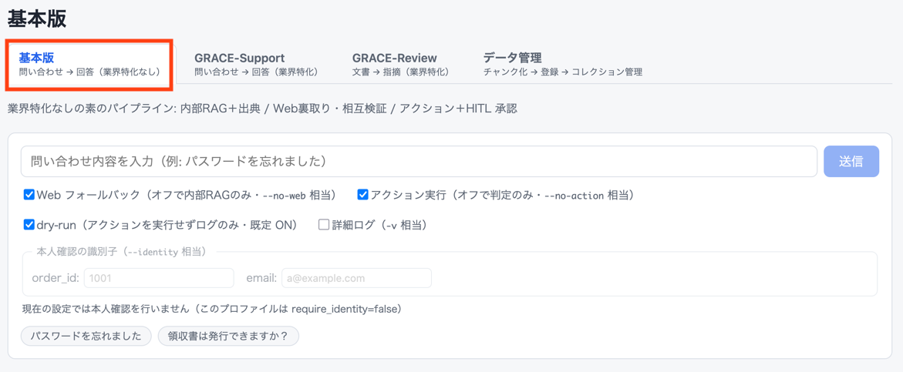
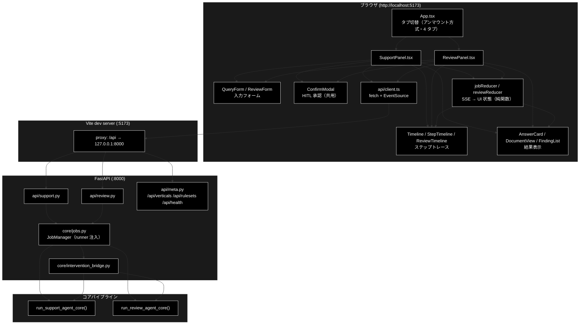
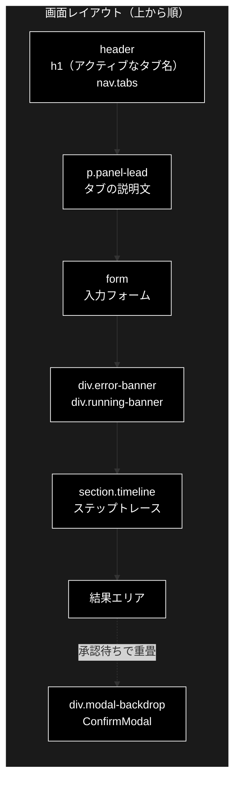
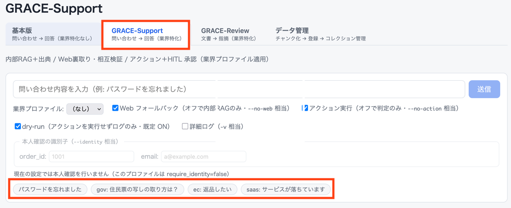
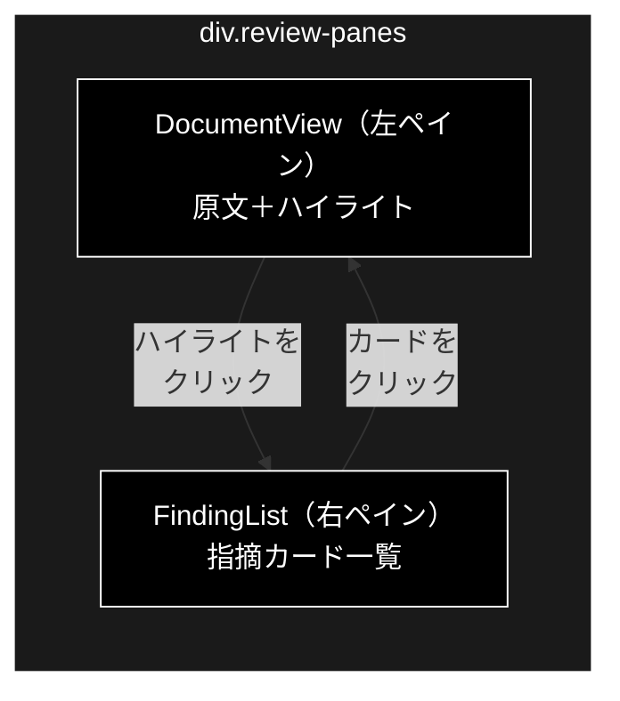
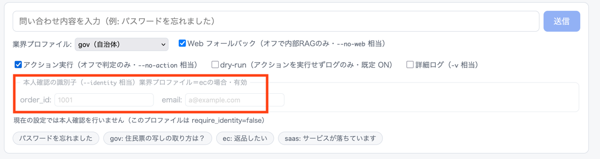
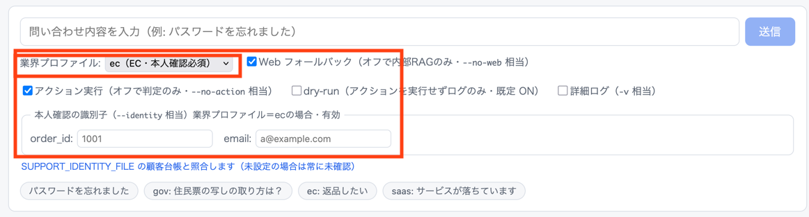
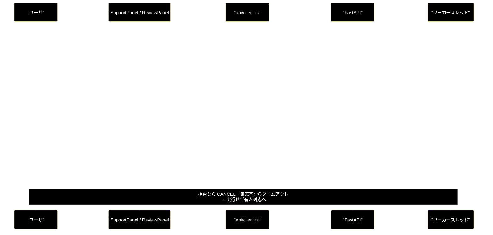
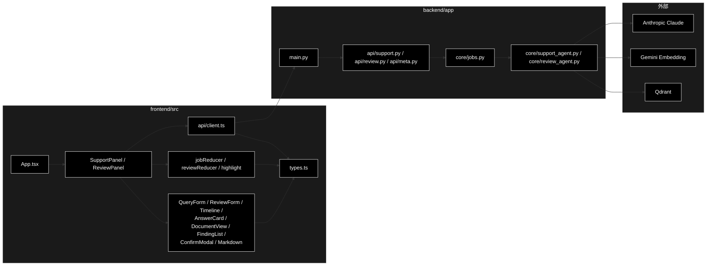

# GRACE アプリ（`./run_dev.sh`）- 画面・操作・プログラム対応 ドキュメント

**Version 2.5** | 最終更新: 2026-08-08

---

## 目次

1. [概要](#概要)
   - [主な責務](#主な責務)
   - [各責務対応のモジュール](#各責務対応のモジュール)
   - [エージェント別の責務](#エージェント別の責務)
   - [主要機能一覧](#主要機能一覧)
2. [アーキテクチャ構成図](#1-アーキテクチャ構成図)
3. [モジュール構成図（画面構成）](#2-モジュール構成図画面構成)
4. [画面・操作とプログラムの対応表](#3-画面操作とプログラムの対応表)
5. [画面別 IPO詳細](#4-画面別-ipo詳細)
   - [4.1 共通ヘッダ（タブ切替）](#41-共通ヘッダタブ切替)
   - [4.2 基本版 / GRACE-Support 画面](#42-基本版--grace-support-画面)
   - [4.3 GRACE-Review 画面](#43-grace-review-画面)
   - [4.4 HITL CONFIRM モーダル（共通）](#44-hitl-confirm-モーダル共通)
   - [4.5 データ管理画面](#45-データ管理画面)
6. [設定・定数](#5-設定定数)
7. [使用例（操作シナリオ）](#6-使用例操作シナリオ)
8. [エクスポート](#7-エクスポート)
9. [変更履歴](#8-変更履歴)
10. [付録: 依存関係図](#付録-依存関係図)

---
## grace_v2 で実装した機構
| 軸 | 実装 | 状態 |
|---|---|---|
| 計画→実行→検証→ゲート | planner / executor / confidence / gates | ✅ |
| 根拠検証 | support_rate（neutral 除外）、GroundednessVerifier | ✅ |
| HITL 介入 | intervention.py（CONFIRM・タイムアウトで安全側） | ✅ |
| RAG + Web 裏取り | Qdrant / agent_parallel_search | ✅ |
| 動的リプラン | replan.py（失敗・低信頼・フィードバックの 3 トリガー） | ✅ |
| 実行メモリ | memory.py（JSONL、コレクション優先度の事前分布） | ✅ |
| 信頼度較正 | calibration.py（温度スケーリング、ECE） | ✅ |
| タスク型の抽象化 | Support（問い→答え）／ Review（文書→指摘）の同型 | |

## 概要

`./run_dev.sh` は、**FastAPI（:8000）＋ Vite + React（:5173）** の 2 プロセスを同時起動する
ローカル開発用スクリプト。ブラウザで開くのは **http://localhost:5173** の 1 画面だけで、
そこから**タブ切替**で 4 つのメニューを使い分ける（前 3 つが「エージェントを使う」側、
最後の「データ管理」が「データを準備する」側）。

| メニュー | 業界特化 | コア | ルータ |
|---|---|---|---|
| **基本版**（問い合わせ → 回答） | **なし** | `core/support_agent.py` | `/api/support/*` |
| **GRACE-Support**（問い合わせ → 回答） | `VerticalProfile`（gov / saas / ec） | `core/support_agent.py` | `/api/support/*` |
| **GRACE-Review**（文書 → 指摘） | `RuleSet`（ec_ad） | `core/review_agent.py` | `/api/review/*` |

タブの並びは「**業界特化を足していく順**」である。基本版が素のパイプラインで、
Support は `VerticalProfile`、Review は `RuleSet` を差し替えたもの。

> 📌 **基本版と GRACE-Support は同一のパイプライン**（`run_support_agent_core`）を通る。
> 違いは業界プロファイルを適用するかどうかだけなので、画面も
> `SupportPanel` 1 つを `variant`（`basic` / `vertical`）で振り分けて共用する。
> CLI（`agent_support_example.py`）が公開している操作は、この基本版タブで一通り行える。

### 業界定義の 2 つはほぼ同型

Support の `VerticalProfile` と Review の `RuleSet` は、**9 フィールド中 6 つが同名・同役**である。
「共通パイプライン ＋ 差し替え可能な業界定義」がこのアプリの設計の芯にあたる。

| 概念 | Support: `VerticalProfile` | Review: `RuleSet` |
|---|---|---|
| 表示名 | `name` | `name` |
| 検索スコープ | `collections` | `collections` |
| 危険語 | `escalate_keywords` | `critical_keywords` |
| アクション対応 | `action_map` | `action_map` |
| しきい値 | `notify_th` / `confirm_th` | `notify_th` / `confirm_th` |
| 方針注入 | `prompt_addendum` | `prompt_addendum` |
| 固有 | `require_identity` / `preferred_domains` | `rules` / `always_check_rules` |

どのタブも**操作の型は同じ**である。

```
入力フォームに書く → 実行ボタン → ステップトレースが逐次流れる
  → （必要なら）承認モーダルが出る → 承認/拒否 → 結果が表示される
```

違うのは「入力が短文か長文か」「結果が回答カードか指摘リストか」だけで、
進捗表示（SSE）・承認（HITL）・エラー表示の仕組みは共通コンポーネントである。

### 主な責務

本アプリが担う役割・責任。**画面の配線ではなく、アプリとして何を引き受けるか**を挙げる。

- 問い合わせに対する回答を、社内ナレッジを根拠として生成する（GRACE-Support）
- 文書を規程に照らして点検し、根拠条文つきの指摘を生成する（GRACE-Review）
- 生成した回答・指摘が出典で裏付けられるかを検証し、確度を数値化する
- 確度が足りない・誤検知の疑いがある結果を、抑止または有人対応へ倒す
- 副作用のあるアクションを、人間の承認を得るまで実行しない
- 処理の進捗を隠さず、ステップ単位で逐次可視化する
- 結果を根拠まで辿れる形で提示する

### 各責務対応のモジュール

上記「主な責務」の各項目が**どこで実現されているか**の対応表（責務と 1:1）。

| # | 責務 | 対応モジュール | 説明 |
|---|------|--------------|------|
| 1 | 問い合わせに対する回答を、社内ナレッジを根拠として生成する（GRACE-Support） | `backend/app/core/support_agent.py` | `run_support_agent_core()` が ①Plan → ②Execute（内部RAG → reasoning）を統括。検索は `grace` の executor + tools |
| 2 | 文書を規程に照らして点検し、根拠条文つきの指摘を生成する（GRACE-Review） | `backend/app/core/review_agent.py` | `run_review_agent_core()` が ①Segment → ②Retrieve → ③Detect を統括。ルールは `core/rulesets.py`（`ec_ad`・21 ルール） |
| 3 | 生成した回答・指摘が出典で裏付けられるかを検証し、確度を数値化する | `grace/confidence.py` | `GroundednessVerifier` を両エージェントで共用。`support_rate = supported / (supported + contradicted)` |
| 4 | 確度が足りない・誤検知の疑いがある結果を、抑止または有人対応へ倒す | `backend/app/core/gates.py` / `core/review_gates.py` | Support=回答ゲート・強制エスカレ・情報なし検知・救済／Review=指摘ゲート・誤検知抑止・救済（いずれも純関数） |
| 5 | 副作用のあるアクションを、人間の承認を得るまで実行しない | `backend/app/core/intervention_bridge.py` ＋ `components/ConfirmModal.tsx` | HITL 承認の同期⇔非同期変換とモーダル。**タイムアウト時は実行せず有人へ**（安全側） |
| 6 | 処理の進捗を隠さず、ステップ単位で逐次可視化する | `backend/app/core/jobs.py` ＋ `state/jobReducer.ts` / `reviewReducer.ts` | SSE でイベント配信 → 純 reducer が UI 状態へ畳み込み → `Timeline` が描画 |
| 7 | 結果を根拠まで辿れる形で提示する | `components/AnswerCard.tsx` / `DocumentView.tsx` / `FindingList.tsx` | 出典リスト（社内/Web）・原文ハイライト・指摘カードの根拠条文 |

### エージェント別の責務

上表のうち #1・#2 は各エージェント固有である。それぞれが**何を引き受け、何を引き受けないか**を分けて示す。

#### GRACE-Support の責務

| 引き受けること | 実装 |
|---|---|
| 問い合わせを実行計画に分解する | `grace` planner（① Plan） |
| 社内ナレッジ（Qdrant）を検索し、回答を生成する | `grace` executor + tools（② Execute） |
| 業界プロファイルに応じて検索スコープ・しきい値・方針を切り替える | `core/verticals.py`（`gov` / `saas` / `ec`） |
| 回答の主張ごとに出典で裏付けを検証する | `GroundednessVerifier`（③ Confidence） |
| 支持率・出典数から answer / escalate を判定する | `gates._answer_gate`（④ 回答ゲート） |
| エスカレ語を検知したら二段判定で有人へ倒す | `gates._should_force_escalate` |
| 内部で答えられないとき Web で裏取りする | ⑤ Web フォールバック |
| 「情報なし回答」を検知して有人へ倒す | `gates._detect_no_info_answer`（④'） |
| 本人確認 → HITL 承認 → 起票・返信を実行する | `_decide_action` / `_perform_action`（⑥ Action） |

**引き受けないこと**: 担当範囲外の話題への回答（`SCOPE_POLICY` で断り、窓口を案内する）。

#### GRACE-Review の責務

| 引き受けること | 実装 |
|---|---|
| 文書を検査単位へ分割する（**原文オフセットを保持**） | `split_segments()`（① Segment） |
| セグメントごとに規程を検索する | `_retrieve_evidence()`（② Retrieve） |
| 二段判定で違反候補を検出する | `select_candidate_rules` + `create_violation_detector`（③ Detect） |
| 指摘そのものが規程で裏付けられるかを検証する | `GroundednessVerifier`（④ Ground） |
| 根拠不足・実質性なしの指摘を抑止し、惜しいものは救済する | `decide_finding_status` / `should_rescue_finding`（④'） |
| 重大度を確定し、重大リスク語は強制的に high にする | `adjust_severity` / `should_force_high`（⑤ Severity） |
| 指摘レポートを作り、HITL 承認を経て起票・引き継ぎする | `_decide_review_action` / `_build_report`（⑦ Action） |

**引き受けないこと**: Web を根拠にした新規の指摘（出典の信頼性を担保できないため、
⑥ Web 裏取りは**法改正の確認のみで判定を変えない**）。文書の自動修正（修正案の提示までに留める）。

### 主要機能一覧

| 機能 | 説明 |
|------|------|
| タブ切替 | `基本版` / `GRACE-Support` / `GRACE-Review` / `データ管理` を上部タブで切り替え |
| 例文チップ | ワンクリックで入力欄に例を流し込む（Support 4 種・Review 2 種） |
| 業界プロファイル選択 | Support: `gov` / `saas` / `ec`（`/api/verticals` から取得） |
| ルールセット選択 | Review: `ec_ad`（`/api/rulesets` から取得） |
| dry-run トグル | 既定 ON。アクションを実行せずログのみ |
| ステップトレース | SSE で逐次更新。ステップごとにログを折りたたみ表示 |
| HITL CONFIRM | 承認するまでアクションは実行されない |
| 原文ハイライト連動 | Review: 原文の色付き箇所 ⇄ 指摘カードを相互ジャンプ |

---

## 画面ショット挿入位置について

本ドキュメントには**画面ショットの挿入位置**を先に確保してある。以下の記法で
埋め込み位置と撮影内容を明示しているので、撮影後に**コメントを外して**差し替える。

```markdown
> 📷 **[X-00] スロット名** — 撮影内容の説明

```

差し替え後（コメントを外した状態）:

```markdown
> 📷 **[X-00] スロット名** — 撮影内容の説明
> 
```

- 画像の置き場所: **`docs/images/`**（ディレクトリごと新規作成してよい）
- ファイル名: **スロット ID を先頭に付ける**（例 `s-01-support-initial.png`）
- 一覧は §6.4「画面ショット一覧」を参照（全 23 枚）

---

## 1. アーキテクチャ構成図



**要点**:

- フロントの `/api/*` は **Vite の proxy** で :8000 へ中継される。ブラウザから見ると
  同一オリジンなので CORS を意識せずに済む（バックエンドの CORS 設定は :5173 を許可済み）。
- **タブはアンマウントで切り替える**（4 タブの条件レンダリング）。各パネルが自分の
  reducer・SSE 購読・承認状態を持つため、離れた側の `EventSource` が
  `useEffect` のクリーンアップで確実に閉じる。
- **判断を含むロジックは純関数へ出し、それだけを vitest でテストする**（副作用ゼロ）。
  コンポーネントのテストは持たない代わりに、壊れると困る分岐を関数側で押さえる。

| テスト | 件数 | 対象 |
|---|---:|---|
| `state/jobReducer.test.ts` | 7 | Support の SSE → UI 状態 |
| `state/reviewReducer.test.ts` | 13 | Review の SSE → UI 状態 |
| `state/highlight.test.ts` | 13 | 原文の分割・重なり解消 |
| `state/queryParams.test.ts` | 19 | 送信ペイロードの組み立て（基本版の `vertical` 固定・識別子の有無・状態メッセージ） |
| `markdown/parseMarkdown.test.ts` | 10 | Markdown パーサ |
| **計** | **62** | |

---

## 2. モジュール構成図（画面構成）



各領域の中身（図を細くするため本文へ出す）:

| 領域 | Support | Review |
|---|---|---|
| `header` | `基本版` / `GRACE-Support` / `GRACE-Review` / `データ管理` の 4 タブ（共通） | 同左 |
| `p.panel-lead` | 「内部RAG＋出典 / Web裏取り・相互検証 / アクション＋HITL 承認」 | 「規程 RAG＋根拠検証（groundedness）で広告表示を点検し、条文つきの指摘を出します」 |
| `form` | `QueryForm`（問い合わせ 1 行 + プロファイル + トグル） | `ReviewForm`（文書 textarea + ルールセット + トグル） |
| バナー | `error-banner`（エラー）／`running-banner`「実行中…」 | 同左（文言は「点検中…」） |
| `section.timeline` | `StepTimeline`（8 ステップ） | `ReviewTimeline`（9 ステップ） |
| 結果エリア | `AnswerCard` | `FindingSummaryBar` ＋ 左右ペイン ＋ KPI 行 |
| モーダル | `ConfirmModal`（**両エージェント共用**・承認待ちのときだけ最前面に出る） | 同左 |

> 📷 **[B-01] 起動直後（基本版タブ 初期表示）** — 既定で開くタブ。ヘッダに**タブ 4 つ**、
> 説明文、空の入力フォーム、4 つのトグル、識別子欄（**disabled** で理由が出ている状態）、
> 例文チップ 2 つまでが入るように全体を撮影。**業界プロファイル セレクタが無い**ことが
> 分かるように。タイムラインと結果は未表示。


> 📷 **[S-01] GRACE-Support タブ 初期表示** — タブを Support に切り替えた直後。
> B-01 との差分（**業界プロファイル セレクタが増える**・例文チップが 4 つになる）が
> 分かるように、同じ縮尺で撮影。


### 2.1 Review タブの左右ペイン

Review だけ、結果エリアが**左右 2 ペイン**（`div.review-panes`）になる。



> 📝 図は縦に並べているが、**実際の画面では左右に並ぶ**（`div.review-panes`）。

| ペイン | コンポーネント | 表示 | 並び順 |
|---|---|---|---|
| 左 | `DocumentView` | 原文＋指摘箇所のハイライト（`mark.hl-{severity}`） | 原文のまま |
| 右 | `FindingList` | 指摘カード一覧 | severity 降順 → 原文の出現順 |

**連動の動き**:

| 操作 | 結果 |
|---|---|
| 左のハイライトをクリック | 右の該当カードへ自動スクロール（`scrollIntoView`） |
| 右のカードをクリック | 左の該当ハイライトを強調（`hl-selected`） |
| 選択中の要素を再クリック | 選択解除 |

選択状態は `ReviewJobState.selectedFindingId` の**1 個の状態**を左右で共有しているため、
どちらをクリックしても相互に連動する。

---

## 3. 画面・操作とプログラムの対応表

### 3.1 基本版タブ / GRACE-Support タブ

**両タブは同じ表**である（`SupportPanel` を `variant` で共用しているため）。
違いは業界プロファイル関連の 2 行（#2・#4）だけで、**基本版ではこの 2 行が存在しない**
（`vertical` は常に `null` で送られる）。

| # | 画面上の操作 | UI コンポーネント | フロント処理 | API | バックエンド関数 |
|---|---|---|---|---|---|
| 1 | タブを押す | `App.tsx` `nav.tabs` | `setTab('basic'\|'support')` → `SupportPanel variant` | — | — |
| 2 | 画面表示時（自動）**※Support のみ** | `SupportPanel` | `useEffect` → `fetchVerticals()` | `GET /api/verticals` | `api/meta.py::list_verticals` |
| 3 | 問い合わせを入力 | `QueryForm` `input[type=text]` | `setQuery` | — | — |
| 4 | 業界プロファイルを選ぶ **※Support のみ** | `QueryForm` `select` | `setVertical` | — | `PROFILES`（表示元） |
| 5 | **Web フォールバックを切り替え** | `QueryForm` `checkbox` | `setUseWeb`（`--no-web` 相当） | — | `run_support_agent_core(use_web=…)` |
| 6 | **アクション実行を切り替え** | `QueryForm` `checkbox` | `setDoAction`（`--no-action` 相当） | — | `run_support_agent_core(do_action=…)` |
| 7 | dry-run を切り替え | `QueryForm` `checkbox` | `setDryRun` | — | — |
| 8 | 詳細ログを切り替え | `QueryForm` `checkbox` | `setVerbose` | — | — |
| 9 | **本人確認の識別子を入力** | `QueryForm` `fieldset.identity-fields` | `setOrderId` / `setEmail`（`--identity` 相当） | — | `support_actions.IdentityVerifier.verify` |
| 10 | 例文チップを押す | `QueryForm` `button.example-chip` | `setQuery`（+ Support なら `setVertical`） | — | — |
| 11 | **「送信」を押す** | `QueryForm` `button[type=submit]` | `onSubmit` → `SupportPanel.submit` → `startQuery()` | `POST /api/support/query` | `api/support.py::start_query` → `JobManager.start(JobParams)` |
| 12 | （自動）進捗を受信 | `StepTimeline` | `subscribeStream()` → `dispatch({type:'event'})` | `GET /api/support/stream/{job_id}`（SSE） | `api/support.py::stream_events` → `Job.stream_events` |
| 13 | ステップのログを開く | `Timeline` `details.step-logs` | （ブラウザ標準） | — | — |
| 14 | **承認 / 拒否を押す** | `ConfirmModal` `button.approve` / `.reject` | `respond()` → `confirmIntervention()` | `POST /api/support/confirm/{job_id}` | `api/support.py::confirm_intervention` → `JobManager.confirm` |
| 15 | 結果を読む | `AnswerCard` | `state.result` を描画 | （`result` イベント） | `run_support_agent_core` の戻り |

#### CLI（`agent_support_example.py`）との対応

基本版タブは CLI の引数を**すべて**画面から操作できる。

| CLI 引数 | 画面の操作 | 送信されるフィールド |
|---|---|---|
| `query` | 問い合わせ入力 | `query` |
| `--vertical` | 業界プロファイル セレクタ（**Support タブのみ**） | `vertical` |
| `--no-web` | Web フォールバック トグルをオフ | `use_web: false` |
| `--no-action` | アクション実行 トグルをオフ | `do_action: false` |
| `--dry-run` / `--no-dry-run` | dry-run トグル | `dry_run` |
| `-v` / `--verbose` | 詳細ログ トグル | `verbose` |
| `--identity KEY=VALUE` | 識別子欄（`order_id` / `email`） | `identity` |

> ⚠️ **CLI と Web で HITL の扱いだけが違う。** CLI は非対話なので
> `confirm=lambda _req: _AUTO_PROCEED`（自動承認・既定ドライランのため安全）だが、
> Web は必ず `InterventionBridge.resolver` を通し、**人が承認するまで実行しない**。
> 自動承認は CLI 限定であり Web 側へは持ち込まない。

### 3.2 GRACE-Review タブ

| # | 画面上の操作 | UI コンポーネント | フロント処理 | API | バックエンド関数 |
|---|---|---|---|---|---|
| 1 | タブ「GRACE-Review」を押す | `App.tsx` `nav.tabs` | `setTab('review')` | — | — |
| 2 | 画面表示時（自動） | `ReviewPanel` | `useEffect` → `fetchRuleSets()` | `GET /api/rulesets` | `api/meta.py::list_rulesets` |
| 3 | 文書タイトルを入力 | `ReviewForm` `input[type=text]` | `setTitle` | — | — |
| 4 | 文書を貼り付け | `ReviewForm` `textarea.review-document` | `setDocument` | — | — |
| 5 | （自動）文字数カウント | `ReviewForm` `div.review-counter` | `document.length > 50000` で `over` | — | `MAX_DOCUMENT_CHARS`（同値） |
| 6 | ルールセットを選ぶ | `ReviewForm` `select` | `setRuleset` | — | `RULESETS`（表示元） |
| 7 | Web 裏取りを切り替え | `ReviewForm` `checkbox` | `setUseWeb`（既定 OFF） | — | — |
| 8 | 例文チップを押す | `ReviewForm` `button.example-chip` | `setDocument` + `setTitle` | — | — |
| 9 | **「表示チェックを実行」を押す** | `ReviewForm` `button[type=submit]` | `onSubmit` → `ReviewPanel.submit` → `startReview()` | `POST /api/review/submit` | `api/review.py::submit_document` → `JobManager.start(ReviewParams)` |
| 10 | （自動）進捗を受信 | `ReviewTimeline` | `subscribeStream(..., 'review')` | `GET /api/review/stream/{job_id}`（SSE） | `api/review.py::stream_events` |
| 11 | 原文のハイライトを押す | `DocumentView` `mark.hl` | `onSelect(findingId)` | — | — |
| 12 | 指摘カードを押す | `FindingList` `li.finding-card` | `onSelect(findingId)` | — | — |
| 13 | 根拠を開く | `FindingList` `details.finding-citations` | （ブラウザ標準） | — | `ReviewFinding.citations` |
| 14 | **承認 / 拒否を押す** | `ConfirmModal` | `respond()` → `confirmReviewIntervention()` | `POST /api/review/confirm/{job_id}` | `api/review.py::confirm_intervention` |

### 3.3 ステップトレースの表示とバックエンドの対応

タイムラインの各行は、バックエンドが発行する `step` イベントと **1:1** で対応する。

**Support**（`STEP_IDS` / `jobReducer.ts` ⇄ `support_agent.py`）:

| 表示ラベル | ステップ ID | バックエンドの実装 |
|---|---|---|
| 業界プロファイル適用 | `profile` | `PROFILES` 適用・config へ注入 |
| ① Plan（planner） | `plan` | `grace` planner |
| ② Execute（内部RAG → reasoning） | `execute` | `grace` executor + tools |
| ③ Groundedness（根拠検証） | `confidence` | `GroundednessVerifier` |
| ④ 回答ゲート＋強制エスカレ＋救済 | `gate` | `_answer_gate` / `_should_force_escalate` / `_should_rescue_unaffirmed` |
| ⑤ Web フォールバック | `web` | `run_support_agent_core` 内 |
| ④' 情報なし回答検知 | `no_info` | `_detect_no_info_answer` |
| ⑥ Action（本人確認 → HITL → 実行） | `action` | `_decide_action` / `_perform_action` |

**Review**（`REVIEW_STEP_IDS` / `reviewReducer.ts` ⇄ `review_agent.py`）:

| 表示ラベル | ステップ ID | バックエンドの実装 |
|---|---|---|
| S1 ルールセット適用 | `ruleset` | `get_ruleset`・config へ注入 |
| ① Segment（文書を検査単位へ分割） | `segment` | `split_segments` |
| ② Retrieve（規程を RAG 検索） | `retrieve` | `_retrieve_evidence` |
| ③ Detect（二段判定で違反候補を検出） | `detect` | `select_candidate_rules` + `create_violation_detector` |
| ④ Ground（指摘の根拠を検証） | `ground` | `GroundednessVerifier.verify` |
| ④' Suppress（誤検知抑止 + 救済） | `suppress` | `decide_finding_status` / `should_rescue_finding` |
| ⑥ Web 裏取り | `web` | `_web_crosscheck` |
| ⑤ Severity（重大度の確定＋強制 high） | `severity` | `adjust_severity` / `should_force_high` |
| ⑦ Action（レポート → HITL → 実行） | `action` | `_decide_review_action` / `_perform_action` |

> ⚠️ **Review はラベルの番号順に並んでいない。** 画面の並び（＝配列 `REVIEW_STEP_IDS` の順）が
> **実行順**で、⑥ Web 裏取りが ⑤ Severity より**先**に来る。番号は Support との対応を
> 示す呼称にすぎない。

---

## 4. 画面別 IPO詳細

### 4.1 共通ヘッダ（タブ切替）

**概要**: 画面最上部。`h1` にアクティブなタブ名、その下にタブボタン 3 つ。

```tsx
// frontend/src/App.tsx
const TABS = [
  { id: 'basic',   label: '基本版',        description: '問い合わせ → 回答（業界特化なし）' },
  { id: 'support', label: 'GRACE-Support', description: '問い合わせ → 回答（業界特化）' },
  { id: 'review',  label: 'GRACE-Review',  description: '文書 → 指摘（業界特化）' },
];

{tab === 'review'
  ? <ReviewPanel />
  : <SupportPanel key={tab} variant={tab === 'basic' ? 'basic' : 'vertical'} />}
```

| 項目 | 内容 |
|------|------|
| **Input** | タブボタンのクリック |
| **Process** | `setTab(id)` → 条件レンダリングで**非アクティブ側をアンマウント**。基本版 / Support は同じ `SupportPanel` を `variant` で振り分ける |
| **Output** | 選択したパネルの描画。副作用: 離れた側の `EventSource` が `useEffect` のクリーンアップで閉じる |

> ⚠️ **表示切替（CSS の hide）ではなくアンマウント**にしているのは、SSE 接続を
> 確実に閉じるため。タブを離れた側のジョブは**サーバ側では走り続ける**が、
> ブラウザは購読をやめる（再度そのタブへ戻っても購読は復元されない）。

> ⚠️ **`key={tab}` は必須。** これが無いと基本版 ⇄ Support の切替で React が
> `SupportPanel` のインスタンスを再利用してしまい、前のタブの reducer 状態と
> SSE 購読が残る。`key` を変えることで**別コンポーネント扱いになり確実に作り直される**。

> 📝 **基本版と Support を別コンポーネントに複製しない。** 両者は同一の
> `run_support_agent_core` を通り、違いは業界プロファイルの有無だけ。複製すると
> §3.1 の操作対応表もテストも二重管理になる。

---

### 4.2 基本版 / GRACE-Support 画面

**この節は 2 タブ共通**である（`SupportPanel` を `variant` で共用）。
基本版との差分は業界プロファイル セレクタと例文チップの内容だけで、明示的に記す。

#### 4.2.1 入力フォーム（`QueryForm`）

**概要**: 問い合わせ 1 行入力＋実行オプション＋本人確認の識別子＋例文チップ。
**CLI の全引数がここに揃っている**（§3.1 の対応表を参照）。

> 📷 **[S-02] Support 入力フォーム（プロファイル選択）** — 業界プロファイルのセレクタを
> 開いた状態で、`gov（自治体）` `saas（SaaS）` `ec（EC・本人確認必須）` の 3 件が見えるように撮影。
> **4 つのトグル（Web フォールバック / アクション実行 / dry-run / 詳細ログ）**も
> 同じ画面に入るように。


> 📷 **[S-06] 識別子欄の状態（2 枚 1 組）** — §4.2.2 の表の裏付け。
> **(a)** `ec` **以外**を選んだ状態: 欄が **disabled** で「`gov` は本人確認を行いません
> （`require_identity=false`）／本人確認を行うプロファイル: `ec`」。
> **(b)** `ec` ＋ dry-run **ON**: 欄が有効で「dry-run 中はデモ照合のため、入力値は照合に
> 使われません」。識別子欄と直下の `p.identity-note` が両方入るように拡大して撮影。
 


| UI 要素 | 種類 | 既定 | 説明 |
|---|---|---|---|
| 問い合わせ入力 | `input[type=text]` | 空 | プレースホルダ「問い合わせ内容を入力（例: パスワードを忘れました）」 |
| 送信ボタン | `button[type=submit]` | — | 実行中は「実行中…」になり **disabled**。空入力でも disabled |
| 業界プロファイル **※Support のみ** | `select` | `（なし）` | `/api/verticals` の一覧。`require_identity` なら「・本人確認必須」を併記 |
| Web フォールバック | `checkbox` | **ON** | オフで内部 RAG のみ（`--no-web` 相当） |
| アクション実行 | `checkbox` | **ON** | オフで判定のみ（`--no-action` 相当） |
| dry-run | `checkbox` | **ON** | アクションを実行せずログのみ |
| 詳細ログ | `checkbox` | OFF | `-v` 相当 |
| 本人確認の識別子 | `fieldset` `order_id` / `email` | 空 | `--identity` 相当。**常時表示**だが、本人確認が起動しない設定では disabled（下記） |
| 例文チップ | `button.example-chip` | — | 基本版 2 件 / Support 4 件 |

**例文チップの中身**（`QueryForm.tsx`）:

| タブ | 定数 | 中身 |
|---|---|---|
| 基本版 | `BASIC_EXAMPLES` | 「パスワードを忘れました」「領収書は発行できますか？」（vertical なし） |
| Support | `VERTICAL_EXAMPLES` | 上記＋`gov:` 住民票 / `ec:` 返品 / `saas:` 障害（押すとプロファイルも同時に切替） |

| 項目 | 内容 |
|------|------|
| **Input** | `query`（必須・空白のみ不可）、`vertical`（Support のみ）、`use_web`、`do_action`、`dry_run`、`verbose`、`order_id` / `email` |
| **Process** | `submit()` が `trim()` して `QueryParams` を組み立てる。基本版は `vertical` を**常に `null`** にする。識別子は `order_id` / `email` のどちらかが入っていれば `identity` として送り、両方空なら `null` |
| **Output** | `onSubmit(QueryParams)` → `SupportPanel.submit()` |

```ts
// 実際に送られる JSON（Support タブで ec を選び、識別子を入れた例）
{
  query: "返品したい", vertical: "ec",
  use_web: true, do_action: true, dry_run: true, verbose: false,
  identity: { order_id: "1001", email: "a@example.com" }
}
```

#### 4.2.2 本人確認の識別子が「効く条件」

識別子欄は**常時表示**するが、実際に照合される経路は狭い。誤解を防ぐため
`p.identity-note` に状態を必ず出す。

| 状態 | 欄 | 表示されるメッセージ |
|---|:--:|---|
| 基本版タブ | **disabled** | 基本版は業界プロファイルを使わないため本人確認を行いません |
| プロファイル未選択 | **disabled** | 業界プロファイルが未選択のため本人確認を行いません |
| `gov` / `saas`（`require_identity=false`） | **disabled** | `gov` は本人確認を行いません（`require_identity=false`）／本人確認を行うプロファイル: `ec` |
| `ec` ＋ dry-run **ON** | 有効 | dry-run 中はデモ照合のため、入力値は照合に使われません |
| `ec` ＋ dry-run **OFF** | 有効 | `SUPPORT_IDENTITY_FILE` の顧客台帳と照合します（未設定の場合は常に未確認） |

> **欄が disabled のときは識別子を送らない。** `buildQueryParams` は DOM ではなく
> state からペイロードを組むので、`fieldset disabled` による HTML の保護が効かない。
> `ec` で入力してから `gov` へ切り替えると欄に値が残るため、明示的に `null` へ落とす。

**根拠となる実装**:

```python
# core/support_agent.py — プロファイルが require_identity でなければ検証器を作らない
require_identity = bool(profile and profile.require_identity)
identity_verifier = create_identity_verifier(dry_run=dry_run) if require_identity else None
```

```python
# support_actions.py — dry_run=True はデモ照合（required_fields=() で入力値を見ない）
if dry_run:
    return IdentityVerifier(checker=_demo_checker, method="demo", required_fields=())
path = identity_file if identity_file is not None else os.environ.get(ENV_IDENTITY_FILE, "")
if path:
    return IdentityVerifier(checker=CsvIdentityChecker(path), method="csv")
return IdentityVerifier(checker=None, method="none")   # 常に未確認（安全側）
```

つまり入力値が本当に使われるのは **`ec` ＋ `dry_run=false` ＋ `SUPPORT_IDENTITY_FILE` 設定**
の 1 経路だけである。照合フィールドは `support_actions.IDENTITY_FIELDS`（`order_id` / `email`）
と一致させること。

#### 4.2.3 ステップトレース（`StepTimeline`）

**概要**: 8 ステップを縦に並べ、SSE の到着に合わせて状態アイコンとバッジを更新する。

> 📷 **[S-03] Support 実行中のタイムライン** — 一部が `▶`（実行中）、上の方が `✓`（完了）に
> なっている途中経過。1 ステップのログを開いた状態が望ましい。
> <!--  -->

| 状態 | アイコン | 意味 |
|---|:--:|---|
| `pending` | `○` | 未到達 |
| `running` | `▶` | 実行中（ログが**自動で開く**） |
| `done` | `✓` | 完了 |
| `skipped` | `−` | スキップ（バッジに理由） |

**Support 固有のバッジ**（`StepTimeline.tsx::stepBadges`）:

| ステップ | 条件 | 表示 |
|---|---|---|
| `confidence` | `data.support_rate` あり | `支持率 0.75` |
| `gate` | `forced_escalate` | `強制エスカレ（'返金'）` |
| `gate` | `rescued` | `④救済（出典付き・矛盾なし回答を維持）` |
| `gate` | `decision` あり | `判定: answer` |
| `web` | `web_reused` | `Web再利用（重複推論を省略）` |
| `web` | skipped | `スキップ: <理由>` |
| `no_info` | `no_info` | `情報なし回答を検知 → escalate` |
| `action` | done | `create_ticket（dry-run）` |

| 項目 | 内容 |
|------|------|
| **Input** | `JobState`（`steps` / `logs` / `phase`） |
| **Process** | `phase === 'idle'` なら**何も描画しない**。それ以外は `STEP_IDS` の順に行を作り、`stepBadges()` の結果を並べる |
| **Output** | ステップ一覧の描画。ステップに紐づかないログは末尾の「その他のログ」に集約 |

#### 4.2.4 回答カード（`AnswerCard`）

**概要**: 結果の最終表示。`decision` によって**見た目と中身が変わる**。

> 📷 **[S-04] Support 回答カード（answer）** — 緑の `answer（回答）` バッジ、本文、
> 出典リスト（`社内` と `Web` のラベルが混在していると良い）、下部の指標まで。
> <!--  -->

> 📷 **[S-05] Support 回答カード（escalate）** — 赤の `escalate（有人対応へ）` バッジと
> 「理由: …」が見える状態。`ec: 返品したい` などで再現しやすい。
> <!--  -->

| 表示部品 | 条件 | 内容 |
|---|---|---|
| decision バッジ | 常時 | `answer（回答）` 緑 / `escalate（有人対応へ）` 赤 |
| 補助バッジ | 該当時 | `vertical: ec` / `Web 使用` / `Web 再利用` |
| 本文 | `answer` 時 | Markdown 描画（`Markdown.tsx`） |
| 未確認注記 | `warning` | 「⚠️ この回答は出典による裏付けが十分ではありません」 |
| 矛盾注記 | `used_web && contradiction` | 「⚠️ 社内ナレッジと Web 情報で食い違いの可能性」 |
| 出典 | `citations.length > 0` | `[Web]` 始まりは `Web` ラベル、それ以外は `社内` ラベル |
| アクション | `action` あり | 種別・本人確認の有無・結果メッセージ |
| 指標 | 常時 | 支持率（判定可能主張数つき）／全体信頼度／内部×Web 一致度／意図分類 |

**escalate 時の分岐**（誤って有用な回答を捨てないための作り）:

| 条件 | 表示 |
|---|---|
| `answer` があり、かつ（`forced_escalate` または出典あり） | 「以下は社内ナレッジに基づく**参考情報**です」＋本文＋出典 |
| それ以外 | 「十分な根拠が見つかりませんでした」→ 有人対応へ<br>（`used_web` が false なら「Web 検索にも」とは**言わない**） |

**エスカレ理由の判定**（`escalateReason()`）:

| 条件 | 理由の文言 |
|---|---|
| `forced_escalate` | `エスカレ語を検知（意図分類: <intent>）による強制エスカレ` |
| `no_info_detected` | `「情報なし回答」を検知（④' ゲート）` |
| それ以外 | `出典・支持率がしきい値未達（回答ゲート）` |

| 項目 | 内容 |
|------|------|
| **Input** | `SupportResult`（`result` イベントの `data`） |
| **Process** | `decision` で分岐し、フラグに応じて注記・出典・アクション・指標を組み立てる |
| **Output** | `section.answer-card`（`answer` / `escalate` クラス付き） |

> 📝 支持率は `groundedness_decided === 0` のとき数値を出さず
> **「判定不能（判定可能 0 主張）」**と表示する。0.00 と出すと「根拠ゼロ」と誤読されるため。

---

### 4.3 GRACE-Review 画面

#### 4.3.1 入力フォーム（`ReviewForm`）

**概要**: 文書を貼り付けて点検を実行する。Support と違い**複数行の textarea**が主役。

> 📷 **[R-01] Review タブ 初期表示** — タブを Review に切り替えた直後。空の textarea、
> ルールセットのセレクタ、対象法令の注記、例文チップ 2 つが見える状態。
> <!--  -->

> 📷 **[R-02] Review 入力フォーム（文書貼付後）** — 例文チップ「NG 例（優良誤認・薬機法）」を
> 押した直後。textarea に本文、下に文字数カウンタが出ている状態。
> <!--  -->

| UI 要素 | 種類 | 説明 |
|---|---|---|
| 文書タイトル | `input[type=text]` | 未入力なら `無題` が送られる |
| 実行ボタン | `button[type=submit]` | 実行中は「点検中…」。空・上限超過・実行中は disabled |
| 文書 | `textarea` `rows=12` | 「点検したい広告文・LP・バナー原稿を貼り付けてください」 |
| 文字数カウンタ | `div.review-counter` | `12,345 / 50,000 文字`。超過で `over` クラス＋警告文 |
| ルールセット | `select` | `/api/rulesets` の一覧。`ec_ad（EC広告表示チェック・21 ルール）` |
| Web 裏取り | `checkbox` | **既定 OFF**（条文が一次情報のため） |
| dry-run | `checkbox` | **既定 ON**（起票せずログのみ） |
| 詳細ログ | `checkbox` | 既定 OFF |
| ルールセット注記 | `p.review-ruleset-note` | 対象法令・常時チェック件数・自動確定のしきい値 |
| 例文チップ | `button.example-chip` × 2 | `NG 例（優良誤認・薬機法）` / `OK 例（特商法表記あり）` |

| 項目 | 内容 |
|------|------|
| **Input** | `document`（必須）、`title`、`ruleset`、`use_web`、`dry_run`、`verbose` |
| **Process** | `tooLong = document.length > 50000` を判定。`canSubmit` が false なら送信しない。`title` 空なら `無題` を補う |
| **Output** | `onSubmit(ReviewParams)` → `ReviewPanel.submit()` |

> ⚠️ **文字数上限はフロントとバックエンドの二重チェック**。`ReviewForm.tsx` の
> `MAX_DOCUMENT_CHARS = 50000` は `backend/app/schemas.py` の同名定数と**一致させる**
> 必要がある（フロントを緩めると API が 422 を返す）。

#### 4.3.2 ステップトレース（`ReviewTimeline`）

**概要**: 9 ステップ。表示の仕組みは Support と同一（`Timeline` を共用）で、バッジだけ別。

> 📷 **[R-03] Review 実行中のタイムライン** — `③ Detect` あたりが `▶` で、
> `① Segment` に `18 セグメント` バッジが付いている途中経過。
> <!--  -->

**Review 固有のバッジ**（`ReviewTimeline.tsx::stepBadges`）:

| ステップ | 表示例 |
|---|---|
| `ruleset` | `EC広告表示チェック` / `ルール 21 件` |
| `segment` | `18 セグメント` / `⚠️ 上限で打ち切り` |
| `detect` | `判定 54 回` / `検出 5 件` / `⚠️ 呼び出し上限で打ち切り` |
| `suppress` | `抑止 2 件` / `救済 1 件` / `採用 3 件` |
| `web` | `裏取り 2 件` |
| `severity` | `重大リスク語で high 1 件` |
| `action` | `create_ticket（dry-run）` |
| （全ステップ共通） | skipped 時 `スキップ: <理由>` |

#### 4.3.3 指摘サマリバー（`FindingSummaryBar`）

> 📷 **[R-04] 指摘サマリバー** — `指摘 3 件` `重大 1` `中 2` `軽微 0` `確定 1` `要確認 2` `抑止 2`
> が横一列に並んだ帯。
> <!--  -->

| 表示 | 元データ | 備考 |
|---|---|---|
| 指摘 N 件 | `high + medium + low` | 抑止は**含まない** |
| 重大 / 中 / 軽微 | `summary.high/medium/low` | severity 別 |
| 確定 / 要確認 | `summary.confirmed/review_required` | status 別 |
| 抑止 | `summary.suppressed` | ツールチップ「根拠不足・実質性なしとして除外した指摘」 |

#### 4.3.4 原文ハイライト（`DocumentView`）

**概要**: 原文をそのまま表示し、指摘箇所を `<mark>` で色付けする。

> 📷 **[R-05] 原文ハイライト＋指摘カード（左右ペイン）** — 画面を広めに撮り、
> 左に色付きハイライト、右に指摘カードが並ぶ全体像。1 件を選択して**両側が強調**
> されている状態が理想。
> <!--  -->

| 項目 | 内容 |
|------|------|
| **Input** | `document`（原文）、`findings`、`selectedFindingId` |
| **Process** | `buildHighlights()` が原文を断片列へ分割 → 断片ごとに `span`（通常）/ `mark`（指摘）を組み立てる |
| **Output** | `section.document-view`。見出しは `原文（N 箇所を指摘）` |

**ハイライトが成立する理由**: `ReviewFinding.start` / `.end` は**原文の文字オフセット**で、
バックエンドの `split_segments()` が分割時に**正規化を一切していない**ため、
`document.slice(start, end)` がそのまま該当箇所になる。

**重なりの解消**（`highlight.ts::resolveOverlaps`）: 同じ文言が複数ルールに触れることは
普通に起きる（例:「業界No.1」は優良誤認と打消し表示の両方で拾われうる）。その場合は
**severity の高い方を残す**。同値なら先に来た方（先勝ち）。

> ⚠️ **`dangerouslySetInnerHTML` は使わない。** `highlight.ts` は**データだけ**を返し、
> React 要素の組み立ては `DocumentView` 側で行う（XSS 回避）。
> オフセットが原文の範囲外を指していた場合はその指摘を**無視して本文を欠落させない**。

#### 4.3.5 指摘カード一覧（`FindingList`）

> 📷 **[R-06] 指摘カードの詳細** — 1 枚のカードを拡大。severity バッジ・ルール名・
> 法令条文・状態・`重大リスク語` バッジ・引用・指摘文・修正案・根拠（開いた状態）・
> 確信度まで入るように。
> <!--  -->

**並び順**: `severity` 降順（重大 → 中 → 軽微）→ 同値なら原文の**出現順**（`start` 昇順）。
重大な指摘から読める並びにしている。

| カード内の表示 | 元データ | 備考 |
|---|---|---|
| severity バッジ | `severity` | `重大` / `中` / `軽微` |
| ルール名 | `rule_title` | |
| 法令 | `law` + `article` | 例「景品表示法 第5条第1号」 |
| 状態 | `status` | `確定` / `要確認` / `抑止` |
| `重大リスク語` バッジ | `forced` | ツールチップ「重大リスク語を検知したため必ず人が確認します」 |
| `Web 裏取り済み` バッジ | `web_checked` | |
| 引用 | `excerpt` | `blockquote` |
| 指摘 | `message` | |
| 修正案 | `suggestion` | |
| 根拠 | `citations` | `details` で折りたたみ |
| メタ | `confidence` / `category` / `rule_id` | 確信度は小数 2 桁 |

**指摘 0 件のとき**: 「指摘はありませんでした（ルールに抵触する記述が見つかりませんでした）。」

| 項目 | 内容 |
|------|------|
| **Input** | `findings`、`selectedFindingId` |
| **Process** | `sortFindings()` で整列。選択中カードには `useEffect` + `scrollIntoView({behavior:'smooth'})` で**自動スクロール** |
| **Output** | `section.finding-list`。クリックで `onSelect`（同じものを再クリックで解除） |

#### 4.3.6 KPI 行と打ち切り警告

結果エリアの最下部に 1 行で出る（`ReviewPanel`）:

```
18 セグメント / 判定 54 回 / 検出 5 件 → 採用 3 件（抑止 2 / 救済 1 / 強制 high 1）
```

`result.truncated` が true のときは、その上に警告バナーが出る:

> ⚠️ 文書が大きいため途中で打ち切りました（セグメントまたは判定回数の上限）。分割して再実行してください。

---

### 4.4 HITL CONFIRM モーダル（共通）

**概要**: 副作用のあるアクションの直前に最前面へ出る。**承認するまで実行されない。**
Support と Review で**同じコンポーネント**を使う。

> 📷 **[C-01] HITL CONFIRM モーダル** — アクション種別・引数（JSON）・バックエンド
> （dry-run 表示）・タイムアウト秒・承認/拒否ボタンが入るように撮影。
> <!--  -->

| 表示行 | 元データ | 備考 |
|---|---|---|
| メッセージ | `intervention.message` | |
| アクション種別 | `actionStep.data.action_type` | `code` 表示 |
| 引数 | `actionStep.data.args` | `JSON.stringify(..., 2)` の整形表示 |
| バックエンド | `actionStep.data.backend` + `dry_run` | `（dry-run: 実行せずログのみ）` or `（実行モード）` |
| 本人確認 | `actionStep.logs` から「本人確認」を含む行 | Support のみ実際に出る |
| 理由 | `intervention.reason` | あるときだけ |
| タイムアウト | `intervention.timeout_seconds` | 「超過時は実行せず有人対応へエスカレーション」 |

| 項目 | 内容 |
|------|------|
| **Input** | `intervention`（`intervention` イベントの `data`）、`actionStep`（`action` ステップの started データ） |
| **Process** | ボタン押下で `onRespond(approve)` → `confirmIntervention()` / `confirmReviewIntervention()` |
| **Output** | `POST /api/{support\|review}/confirm/{job_id}`。送信中は両ボタンが disabled |

**両エージェントで共用できる理由**: `ActionStepView` として
`{ data: Record<string, unknown>; logs: string[] }` だけを構造的に受けるため、
Support の `StepState` と Review の `ReviewStepState` の**両方が当てはまる**。

> ⚠️ **Web 側に自動承認は無い。** CLI は `confirm=None` で自動承認（既定ドライランのため安全）
> だが、Web からは必ず `InterventionBridge.resolver` が渡る。タイムアウト時は
> バックエンドが**実行せず有人対応へ**倒す（安全側）。

#### 4.4.1 承認の流れ



---

### 4.5 データ管理画面

**概要**: エージェント 3 タブが「エージェントを**使う**」側なのに対し、ここは
「データを**準備する**」側である。パイプラインの流れ順に 3 つのサブタブを持つ
（`DataPanel.tsx`）。

    ① チャンキング → ② Qdrant 登録 → ③ コレクション管理

> ⚠️ **Q/A 生成は画面に無い**（CLI のみ）。② の入力は「**既に作られた Q/A CSV**」である。

#### 4.5.1 サブタブ共通

> 📷 **[D-01] データ管理タブ 初期表示** — タブを「データ管理」に切り替えた直後。
> ヘッダに**タブ 4 つ**、その下に**サブタブ 3 つ**（① チャンキングが選択状態）が
> 入るように撮影。エージェント 3 タブとの階層の違いが分かる構図にする。
> <!--  -->

| 要素 | 実装 | 備考 |
|---|---|---|
| サブタブ | `nav.sub-tabs`（`DataPanel.tsx`） | `role="tablist"` / 矢印キー移動（`state/tabKeys.ts`） |
| 切替方式 | **アンマウント**（`key={sub}`） | 離れたサブタブの reducer 状態と SSE 購読を残さない |
| 進捗表示 | `Timeline`（Support / Review と共通） | イベント形式が 3 種で同一のため流用 |
| 承認 | `ConfirmModal`（同上） | 破壊的操作のみ |

#### 4.5.2 ① チャンキング

**入力 → 出力**: CSV / テキスト → セマンティックチャンク CSV。
**非破壊なので承認は無い。**

> 📷 **[D-02] チャンキング フォーム** — 入力ディレクトリ（`OUTPUT`）とファイル
> セレクタ、モデル・ワーカー数・ブロックサイズの入力欄が入るように撮影。
> **モデル欄の既定値**が見えること（このプロジェクトの LLM が何かを示す箇所）。
> <!--  -->

> 📷 **[D-03] チャンキング 実行中** — タイムラインが
> `① 入力読み込み → ② セマンティックチャンク化 → ③ CSV 出力` と進む様子。
> ログ行（既存モジュールの `logging` を `job_logs.py` が横取りしたもの）を
> 1 つ展開した状態で撮る。
> <!--  -->

#### 4.5.3 ② Qdrant 登録

**入力 → 出力**: Q/A CSV → Qdrant コレクション（Embedding 生成つき）。
`recreate=ON`（既存を作り直す）の**ときだけ**承認を求める。

> 📷 **[D-04] Qdrant 登録 フォーム** — 入力ファイル（`qa_output`）とコレクション名、
> `recreate` トグルが入るように撮影。ファイル選択でコレクション名が**自動補完**
> される挙動が分かるとなお良い。
> <!--  -->

> 📷 **[D-05] 登録の CONFIRM（recreate）** — `recreate=ON` かつ既存コレクションが
> あるときだけ出るモーダル。**既存の件数と「失われます」の文言**が読めるように撮る。
> `recreate=OFF` では出ないことが対比できると良い。
> <!--  -->

#### 4.5.4 ③ コレクション管理

**一覧・詳細・ポイントプレビュー・削除。削除は必ず承認を通る。**

> 📷 **[D-06] コレクション一覧** — 名前・件数・ステータスの一覧。
> Qdrant 稼働状況のバッジが見えるように撮影。
> <!--  -->

> 📷 **[D-07] コレクション詳細＋ポイントプレビュー** — 1 件選択した状態。
> ベクトル設定（次元・距離）とポイントのテーブルが入るように撮る。
> **列はコレクションごとに変わる**（payload のキーが可変）ことが分かる構図が良い。
> <!--  -->

> 📷 **[D-08] 削除の CONFIRM** — **常に**出るモーダル。対象名・合計件数・
> 「元に戻せません」の文言が読めるように撮影。承認するまで削除されない。
> <!--  -->

| 操作 | エンドポイント | 承認 |
|---|---|---|
| チャンク化 | `POST /api/chunking/run` | なし（非破壊） |
| 登録 | `POST /api/qdrant/register` | `recreate=true` のときだけ |
| 削除 | `POST /api/qdrant/delete` | **常に** |
| 一覧・詳細・プレビュー | `GET /api/qdrant/collections[...]` | — |
| 入力ファイル一覧 | `GET /api/files?dir=...` | — |
| 進捗 SSE / 承認応答 | `/api/data/stream/{job_id}` / `/api/data/confirm/{job_id}` | — |

> 削除を HTTP の `DELETE` にしていないのは、**承認を経ずに消える経路を作らない**ため。
> 設計の詳細は `backend/docs/data_pipeline.md` を参照。

---

## 5. 設定・定数

### 5.1 起動の前提

| 前提 | 内容 |
|---|---|
| `.env`（リポジトリルート） | `ANTHROPIC_API_KEY`（LLM）／`GOOGLE_API_KEY`（Embedding） |
| Qdrant | `docker-compose -f docker-compose/docker-compose.yml up -d` |
| ツール | `uv` / Node.js（npm） |

`run_dev.sh` は起動時に Qdrant へ疎通チェックを行い、**繋がらなくても警告を出して続行**する。

### 5.2 ポート

| 用途 | URL | 備考 |
|---|---|---|
| **UI** | http://localhost:5173 | **ブラウザで開くのはこちら** |
| API | http://localhost:8000 | `/docs` で自動ドキュメント。`/` は 404 が正常 |
| Qdrant | http://localhost:6333 | `QDRANT_URL` で変更可 |

バックエンドのポートは `BACKEND_PORT` 環境変数で変更できる（既定 8000）。

### 5.3 フロントエンドの主要定数

| 定数 | 値 | 定義場所 | 備考 |
|---|---|---|---|
| `STEP_IDS` | 8 個 | `state/jobReducer.ts` | `support_agent.py::STEP_IDS` と一致必須 |
| `REVIEW_STEP_IDS` | 9 個 | `state/reviewReducer.ts` | `review_agent.py::REVIEW_STEP_IDS` と一致必須 |
| `MAX_DOCUMENT_CHARS` | 50,000 | `components/ReviewForm.tsx` | `backend/app/schemas.py` と一致必須 |
| `SEVERITY_RANK` | high=3 / medium=2 / low=1 | `state/highlight.ts`・`FindingList.tsx` | 並び順・重なり解消 |

### 5.4 UI に出ないが固定で送られる値

| エージェント | 項目 | 値 | 理由 |
|---|---|---|---|
| Support | `use_web` | `true` 固定 | Web フォールバックは常に有効 |
| Support | `do_action` | `true` 固定 | アクション判定は常に行う（実行は dry-run と HITL で制御） |
| Review | `do_action` | `true` 固定 | 同上 |

---

## 6. 使用例（操作シナリオ）

### 6.1 起動

```bash
# 1) Qdrant（別ターミナル・初回/停止後のみ）
docker-compose -f docker-compose/docker-compose.yml up -d

# 2) アプリ起動（backend + frontend）
./run_dev.sh
#   ==> [1/3] uv sync --extra dev（バックエンド依存）
#   ==> [2/3] frontend 依存の確認
#   ==> [3/3] 開発サーバを起動します（停止は Ctrl+C）
#       backend : http://localhost:8000  (docs: /docs)
#       frontend: http://localhost:5173  ← ブラウザで開くのはこちら
```

停止は **Ctrl+C**（backend / frontend の両方が止まる）。

### 6.2 シナリオ A: 基本版 → Support で「業界特化の差」を見る

**エージェント 3 タブの並びは「業界特化を足していく順」**なので、同じ問い合わせを基本版と Support で
続けて実行すると、プロファイルが何を変えるのかが 1 往復で分かる。

**A-1. 基本版（業界特化なし）**

1. ブラウザで http://localhost:5173 を開く（既定で **基本版** タブ）→ 📷 **[B-01]**
   - 業界プロファイル セレクタは**無い**。識別子欄は **disabled**（`require_identity=false`）
2. 例文チップ **`パスワードを忘れました`** を押す
3. **「送信」** を押す
4. ステップトレースが進む。**`業界プロファイル適用` は skipped** になる（`vertical=null` のため）
5. 回答カードに `vertical:` バッジが**付かない**ことを確認

**A-2. GRACE-Support（業界特化あり・EC の返品）**

6. タブ **GRACE-Support** を押す → 📷 **[S-01]**
   - B-01 との差分（プロファイル セレクタが増える・例文チップが 4 つになる）
7. 例文チップ **`ec: 返品したい`** を押す（入力欄とプロファイルが同時に埋まる）→ 📷 **[S-02]**
   - `ec` を選ぶと**識別子欄が有効化**される → 📷 **[S-06]**（(a) 無効 / (b) 有効の 2 枚）
8. `dry-run` が **ON** であることを確認（既定 ON）
9. **「送信」** を押す
10. ステップトレースが上から順に進む（`業界プロファイル適用` → `① Plan` → …）→ 📷 **[S-03]**
    - 基本版と違い `業界プロファイル適用` が **finished** になり、検索スコープ・しきい値が出る
11. ⑥ Action に到達すると **CONFIRM モーダル**が出る → 📷 **[C-01]**
    - `ec` は `require_identity=true` なので、本人確認の行が出る
12. **「承認して実行」** を押す
13. 回答カードが表示される → 📷 **[S-04]** または 📷 **[S-05]**

> 📝 **CLI と突き合わせるなら**: 手順 7〜9 は
> `uv run python agent_support_example.py --vertical ec "返品したい"` と同じ設定である
> （HITL だけが自動承認 ⇄ 画面承認で異なる。§3.1 の対応表を参照）。

### 6.3 シナリオ B: Review で広告文を点検する

1. タブ **GRACE-Review** を押す → 📷 **[R-01]**
2. 例文チップ **`NG 例（優良誤認・薬機法）`** を押す → 📷 **[R-02]**
   - 「業界No.1」「シミが治る」「副作用がない」など、意図的に違反を含む文面
3. ルールセットが `ec_ad（EC広告表示チェック・21 ルール）` であることを確認
4. **「表示チェックを実行」** を押す
5. ステップトレースが進む（`S1` → `① Segment` → `② Retrieve` → …）→ 📷 **[R-03]**
6. 結果が出る
   - サマリバー → 📷 **[R-04]**
   - 左右ペイン（原文ハイライト＋指摘カード）→ 📷 **[R-05]**
   - カードの「根拠」を開くと条文が見える → 📷 **[R-06]**
7. 原文のハイライトをクリック → 右の該当カードへ自動スクロール
8. 高 severity の指摘があれば `escalate_to_human`（**承認不要**）、無ければ
   `create_ticket` で CONFIRM モーダルが出る

比較用に **`OK 例（特商法表記あり）`** も実行すると、指摘が出ない／少ない状態を確認できる。

### 6.4 画面ショット一覧

**撮影は改修が一段落してから**まとめて行う。撮った画像を `docs/images/` に置き、
本文中のコメントアウトを外す。**全 23 枚**（S-06 のみ 2 枚 1 組）。

| スロット | ファイル名（推奨） | 撮影内容 | 記載セクション |
|:--:|---|---|---|
| **B-01** | `b-01-basic-initial.png` | 起動直後の**基本版**タブ全体（プロファイル セレクタ無し・識別子欄 disabled） | §2 |
| **S-01** | `s-01-support-initial.png` | **Support** タブ初期表示（B-01 との差分が分かる同縮尺） | §2 |
| **S-02** | `s-02-support-form.png` | 入力フォーム（プロファイル選択を開く＋トグル 4 つ） | §4.2.1 |
| **S-06a** | `s-06a-identity-disabled.png` | 識別子欄が **disabled**（`ec` 以外） | §4.2.1 / §4.2.2 |
| **S-06b** | `s-06b-identity-enabled.png` | 識別子欄が**有効**（`ec` ＋ dry-run ON の注記） | §4.2.1 / §4.2.2 |
| **S-03** | `s-03-support-running.png` | 実行中のタイムライン（ログを 1 つ開く） | §4.2.3 |
| **S-04** | `s-04-support-answer.png` | 回答カード（answer・出典あり） | §4.2.4 |
| **S-05** | `s-05-support-escalate.png` | 回答カード（escalate・理由表示） | §4.2.4 |
| **R-01** | `r-01-review-initial.png` | Review タブ初期表示 | §4.3.1 |
| **R-02** | `r-02-review-form.png` | 文書貼付後（文字数カウンタ表示） | §4.3.1 |
| **R-03** | `r-03-review-running.png` | 実行中のタイムライン（バッジ付き） | §4.3.2 |
| **R-04** | `r-04-finding-summary.png` | 指摘サマリバー | §4.3.3 |
| **R-05** | `r-05-review-panes.png` | 左右ペイン全体（1 件選択状態） | §4.3.4 |
| **R-06** | `r-06-finding-card.png` | 指摘カード拡大（根拠を開く） | §4.3.5 |
| **C-01** | `c-01-confirm-modal.png` | HITL CONFIRM モーダル | §4.4 |
| **D-01** | `d-01-data-initial.png` | **データ管理**タブ初期表示（タブ 4 つ＋サブタブ 3 つ） | §4.5.1 |
| **D-02** | `d-02-chunking-form.png` | チャンキング フォーム（モデル既定値が見えること） | §4.5.2 |
| **D-03** | `d-03-chunking-running.png` | チャンキング 実行中のタイムライン（ログを 1 つ開く） | §4.5.2 |
| **D-04** | `d-04-register-form.png` | Qdrant 登録 フォーム（コレクション名の自動補完） | §4.5.3 |
| **D-05** | `d-05-register-confirm.png` | 登録の CONFIRM（`recreate=ON` のときだけ出る） | §4.5.3 |
| **D-06** | `d-06-collection-list.png` | コレクション一覧（件数・ステータス） | §4.5.4 |
| **D-07** | `d-07-collection-detail.png` | コレクション詳細＋ポイントプレビュー | §4.5.4 |
| **D-08** | `d-08-delete-confirm.png` | 削除の CONFIRM（**常に**出る・不可逆の警告） | §4.5.4 |
| **E-01** | `e-01-error-banner.png` | エラーバナー（APIキー未設定など） | §6.5 |

> 📝 **撮影順は §6.2 → §6.3 のシナリオをなぞるのが早い。** B-01 → S-01 → S-02 → S-06 →
> S-03 → C-01 → S-04/S-05 → R-01 …の順で自然に出てくる。

### 6.5 うまく動かないとき

> 📷 **[E-01] エラーバナー** — `div.error-banner` が赤く出ている状態。
> `.env` の APIキーを外して実行すると再現できる。
> <!--  -->

| 症状 | 原因 | 対処 |
|---|---|---|
| 画面は出るが実行するとエラーバナー | `ANTHROPIC_API_KEY` 未設定 | `.env` に設定して backend を再起動。`GET /api/health` で確認できる |
| 「進捗ストリームが切断されました」 | backend が落ちた／再起動中 | ターミナルの uvicorn ログを確認 |
| 検索結果が空・情報なし回答が続く | Qdrant 未起動 or データ未登録 | `docker-compose ... up -d` ＋ データ準備（下記） |
| Review で 422 が返る | 文書が 50,000 字超 | 分割して実行（フロントの文字数カウンタが赤くなる） |
| `:8000` を開いても 404 | 仕様 | UI は **:5173**。:8000 は API 専用（`/docs` は開ける） |

データ準備（3 段階）:

```bash
python -m chunking.csv_text_to_chunks_text_csv   # 1. チャンク化
python qa_qdrant/make_qa_register_qdrant.py      # 2-3. Q/A 生成 + Qdrant 登録
```

---

## 7. エクスポート

### 7.1 画面から呼ばれる API クライアント（`frontend/src/api/client.ts`）

```ts
startQuery(params)                                   // POST /api/support/query
confirmIntervention(jobId, interventionId, approve)  // POST /api/support/confirm/{job_id}
fetchVerticals()                                     // GET  /api/verticals
startReview(params)                                  // POST /api/review/submit
confirmReviewIntervention(jobId, iid, approve)       // POST /api/review/confirm/{job_id}
fetchRuleSets()                                      // GET  /api/rulesets
subscribeStream(jobId, onEvent, onError, kind)       // GET  /api/{kind}/stream/{job_id}（SSE）
```

`subscribeStream` は **Support / Review で 1 本を共用**する（SSE のイベント形式が同一のため）。
戻り値は購読解除関数で、`done` イベントで自動クローズする。

### 7.2 バックエンドの入口

```python
from backend.app.main import app                               # ASGI アプリ
from backend.app.core.support_agent import run_support_agent_core
from backend.app.core.review_agent import run_review_agent_core
from backend.app.core.jobs import job_manager, JobParams
```

### 7.3 関連ドキュメント

| 知りたいこと | 参照先 |
|---|---|
| backend のモジュール仕様（IPO） | [`backend/docs/`](./backend/docs/) — `main` / `schemas` / `api_*` / `core_*` |
| Support の処理ステップ詳細 | [`backend/docs/backend_flow.md`](./backend/docs/backend_flow.md) |
| Review の処理ステップ詳細 | [`backend/docs/review_flow.md`](./backend/docs/review_flow.md) |
| Review の設計判断 | [`backend/docs/review_agent_spec.md`](./backend/docs/review_agent_spec.md) |
| インストール・環境構築 | [`backend/docs/install_and_setup.md`](./backend/docs/install_and_setup.md) |
| React コンポーネント仕様 | [`frontend/docs/`](./frontend/docs/) — [`App.md`](./frontend/docs/App.md)（3タブのルート）/ [`SupportPanel.md`](./frontend/docs/SupportPanel.md)（基本版・Support 共用）/ [`QueryForm.md`](./frontend/docs/QueryForm.md)（入力フォーム）/ [`AnswerCard.md`](./frontend/docs/AnswerCard.md)（回答カード）/ [`DocumentView.md`](./frontend/docs/DocumentView.md)（原文＋ハイライト）/ [`FindingList.md`](./frontend/docs/FindingList.md)（指摘カード一覧）/ [`ConfirmModal.md`](./frontend/docs/ConfirmModal.md)（HITL CONFIRM・Support/Review 共用）/ [`Timeline.md`](./frontend/docs/Timeline.md)（ステップトレース・Support/Review 共用）/ [`StepTimeline.md`](./frontend/docs/StepTimeline.md)（Support アダプタ）/ [`ReviewTimeline.md`](./frontend/docs/ReviewTimeline.md)（Review アダプタ）/ [`Markdown.md`](./frontend/docs/Markdown.md)（Markdown レンダラ＋パーサ）/ [`review_ui.md`](./frontend/docs/review_ui.md)（Review UI） |
| 自律エージェント基盤 | [`grace/docs/`](./grace/docs/) |
| データ準備 | [`chunking/docs/`](./chunking/docs/) / [`qa_generation/docs/`](./qa_generation/docs/) / [`qa_qdrant/docs/`](./qa_qdrant/docs/) |

### 7.4 CLI（参考）

Support のみ CLI がある。**Web と同じコア関数**を通るので、挙動確認に使える。

```bash
uv run python agent_support_example.py --vertical gov -v "住民票の写しの取り方は？"
```

> ⚠️ **Review に CLI は無い。** 動作確認は :5173 の Review タブか
> `POST /api/review/submit` を使う。

---

## 8. 変更履歴

| バージョン | 変更内容 |
|-----------|---------|
| 1.0 | 初版作成。当時の `backend/docs/README.md` v1.6 をベースに、リポジトリ全体のルート README として IPO 形式で構成（同ファイルはその後 `c1669ff` で削除された） |
| 2.0 | **`./run_dev.sh` アプリの README として全面改訂。** 対象をリポジトリ全体からアプリ（画面・操作）へ移し、実装（`frontend/src/` 全 13 コンポーネント・2 reducer・API クライアント）を読み直して構成。§3 に「画面上の操作 → UI コンポーネント → フロント処理 → API → バックエンド関数」の対応表を Support / Review 別に新設し、ステップトレースの表示ラベルとバックエンド実装の 1:1 対応表も追加。§4 を画面別 IPO 詳細（共通ヘッダ／Support／Review／CONFIRM モーダル）へ再構成し、各 UI 要素・バッジ・分岐条件を実装から起こして記載。§6 に操作シナリオ 2 本とトラブルシュートを追加。**画面ショット挿入位置を 13 スロット（S-01〜S-05 / R-01〜R-06 / C-01 / E-01）確保**し、§6.4 に一覧表を用意 |
| 2.1 | **「責務」の記述をフォーマット仕様に適合させた。** 2.0 では「主な責務」がアプリの責務ではなく UI の配線（タブ切替・パラメータ組み立て等）を並べたものになっており、かつ「各責務対応のモジュール」が 12 行と箇条書き 5 項目に対応していなかった（`a_class_method_md_format.md` §2.5「責務の数（行数）は主な責務の項目数と一致させる」「責務列は主な責務の箇条書きと 1 対 1 で対応させる」に違反）。主な責務を**アプリが引き受ける役割**として 7 項目に書き直し、対応表を同じ文言の 7 行へ揃えて 1 対 1 を回復。さらに「エージェント別の責務」を新設し、GRACE-Support / GRACE-Review それぞれの**引き受けること・引き受けないこと**を実装（関数名）と対応づけて明示。責務が長い前置きに埋もれていたため「画面ショット挿入位置について」を概要の後ろへ移動し、目次に責務の各節を掲載 |
| 2.2 | **§2 モジュール構成図（画面構成）の 2 図を縦積みに変更。** 図が横に広がって描画時に文字が縮み、読めなくなっていたため。(1) 画面レイアウト図は `MODALL` が `RESULT` から横へ枝分かれしていたのを単一の縦チェーンへ直し、長いノードラベル（`header: h1（アクティブなタブ名）+ nav.tabs（GRACE-Support / GRACE-Review）` 等）を短縮。図から外した各領域の中身は Support / Review 対比表として本文へ移した。(2) 左右ペイン図は `flowchart LR`（横並び）＋長いエッジラベルが原因で最も横長だったため `flowchart TB` へ変更し、エッジラベルを「ハイライトをクリック」等へ短縮。ペインの内容と連動の動きは表として本文へ移し、「図は縦だが実画面では左右に並ぶ」旨を注記 |
| 2.3 | **§2 の 2 図に `direction TB` を追加し、実際に縦積みになることを描画して確認した。** 2.2 で `flowchart TB` にしたが**表示は横並びのままだった**（Mermaid はサブグラフ内の並びに外側の `flowchart TB` を適用しないため）。Mermaid 9.4.3 ＋ ヘッドレス Chromium で描画してノード座標を実測し、修正候補を比較して確定: エッジをサブグラフ内へ移すだけでは変化なし（1457×158 のまま）、**サブグラフ内の `direction TB` の 1 行だけが効く**。適用後は画面レイアウト図が 1457×158 → **298×759**（7 ノードすべて x=149 で同一列）、左右ペイン図が 623×183 → **324×272** となり、いずれも同じ行に複数ノードが並ばないことを確認 |
| 2.4 | **メニューを 3 つに拡張し、`agent_support_example.py`（CLI）と同等の操作を画面に載せた。** タブを「基本版（業界特化なし）／ GRACE-Support（`VerticalProfile`）／ GRACE-Review（`RuleSet`）」の 3 つにし、**業界特化を足していく順**に並べた。基本版と Support は同一パイプラインのため `SupportPanel` を `variant` で共用する（複製しない・`key={tab}` で確実に作り直す）。CLI 引数のうち画面に無かった **`--no-web` / `--no-action` をトグルとして追加**し、**`--identity` を API → `JobParams` → コアまで新規に通した**（従来は `identity=None` 直書きで画面から渡せなかった）。識別子欄は常時表示しつつ、本人確認が起動しない設定では disabled にして理由を表示する（§4.2.2）。§概要に `VerticalProfile` と `RuleSet` がほぼ同型である旨の対比表、§3.1 に CLI 引数との対応表を追加 |
| 2.5 | **画面ショットスロットを 3 タブ構成へ更新し、送信ペイロードの組み立てにテストを追加。** スロットは 2 タブ時代のままだったため、`B-01`（基本版タブ初期表示）と `S-06a/b`（識別子欄の disabled / 有効）を追加し、`S-01` を「Support タブ初期表示（B-01 との差分）」へ振り直して 16 枚に整理。§6.2 のシナリオを「基本版 → Support で業界特化の差を見る」構成に書き換え、CLI との対応も注記した。あわせて §4.2 の小節番号の重複（4.2.2 が 2 つ）と目次の見出しずれを修正。コード側は `QueryForm` の判断ロジック（基本版の `vertical` 固定・識別子を送るかどうか・状態メッセージ）を `state/queryParams.ts` の純関数へ切り出し、vitest 19 件を追加（frontend 計 43 → 62 件）。React テストライブラリは導入せず、既存の「純関数だけテストする」方針に揃えた |

---

## 付録: 依存関係図


