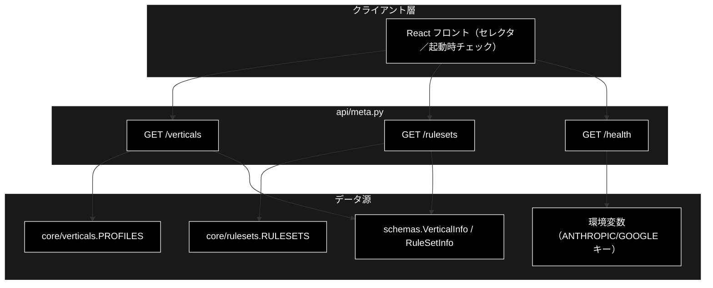
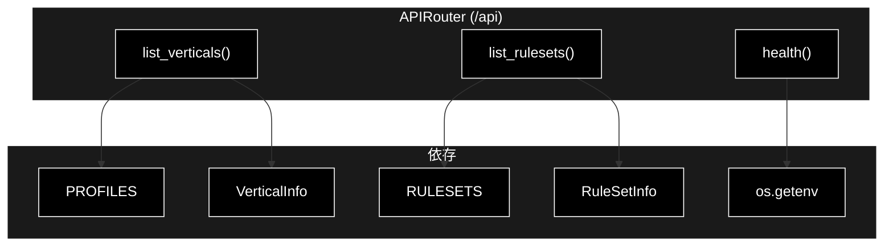
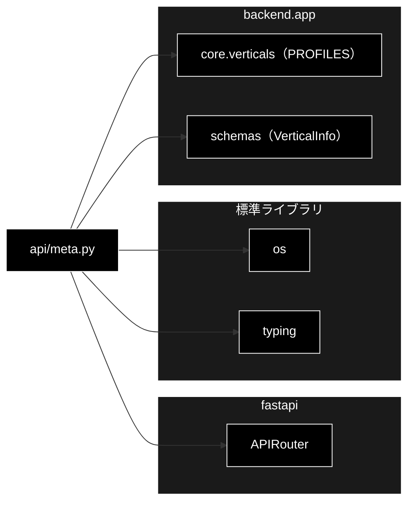

# api/meta.py - メタ情報 API ドキュメント

**Version 1.1** | 最終更新: 2026-07-29

---

## 目次

1. [概要](#概要)
2. [アーキテクチャ構成図](#1-アーキテクチャ構成図)
3. [モジュール構成図](#2-モジュール構成図)
4. [クラス・関数一覧表](#3-クラス関数一覧表)
5. [クラス・関数 IPO詳細](#4-クラス関数-ipo詳細)
6. [使用例](#5-使用例)
7. [エクスポート](#6-エクスポート)
8. [変更履歴](#7-変更履歴)
9. [付録: 依存関係図](#付録-依存関係図)

---

## 概要

`backend/app/api/meta.py` は、GRACE-Support の**メタ情報 API**（業界プロファイル一覧・
ヘルスチェック）を提供する FastAPI ルーターモジュール。UI のプロファイルセレクタ用に
組み込み業界プロファイル（`PROFILES`）を返す `GET /api/verticals`、組み込みルールセット
（`RULESETS`）を返す `GET /api/rulesets`、稼働確認・実行前提（APIキー設定有無）を返す
`GET /api/health` の 3 エンドポイントを定義する。

LLM は Anthropic Claude（`ANTHROPIC_API_KEY`）、Embedding は Gemini（`GOOGLE_API_KEY`）を
使うため、health は両キーの設定有無を返す。

### 主な責務

- 組み込み業界プロファイル一覧の提供（`GET /api/verticals`）
- 組み込みルールセット一覧の提供（`GET /api/rulesets`）
- 稼働確認と API キー設定有無の可視化（`GET /api/health`）

### 各責務対応のモジュール

| # | 責務 | 対応モジュール | 説明 |
|---|------|--------------|------|
| 1 | プロファイル一覧 | `api/meta.py` → `core/verticals.py` | `PROFILES` を `VerticalInfo` へ整形 |
| 1b | ルールセット一覧 | `api/meta.py` → `core/rulesets.py` | `RULESETS` を `RuleSetInfo` へ整形 |
| 2 | ヘルスチェック | `api/meta.py` | `os.getenv` でキー設定有無を返す |
| 3 | 出力スキーマ | `backend/app/schemas.py` | `VerticalInfo` |

### 主要機能一覧

| 機能 | 説明 |
|------|------|
| `router` | `APIRouter(prefix="/api")` |
| `list_verticals()` | GET /verticals（業界プロファイル一覧） |
| `list_rulesets()` | GET /rulesets（ルールセット一覧） |
| `health()` | GET /health（稼働確認＋APIキー有無） |

---

## 1. アーキテクチャ構成図

### 1.1 システム全体構成



### 1.2 データフロー

1. フロント（Support タブ）が起動時に `GET /api/verticals` でプロファイル一覧を取得しセレクタを構築
1b. フロント（Review タブ）が起動時に `GET /api/rulesets` でルールセット一覧を取得しセレクタを構築
2. `GET /api/health` で稼働確認と APIキー設定有無を確認（未設定なら注意表示）

---

## 2. モジュール構成図

### 2.1 内部モジュール構成



### 2.2 外部依存関係

| ライブラリ | バージョン | 用途 |
|-----------|-----------|------|
| `fastapi` | >=0.115.6 | `APIRouter` |
| `os` | 標準 | 環境変数（APIキー）の参照 |
| `typing` | 標準 | `Dict` / `List` |

### 2.3 内部依存モジュール

| モジュール | 用途 |
|-----------|------|
| `backend.app.core.verticals` | `PROFILES`（業界プロファイル辞書） |
| `backend.app.core.rulesets` | `RULESETS`（ルールセット辞書） |
| `backend.app.schemas` | `VerticalInfo` / `RuleSetInfo`（出力スキーマ） |

---

## 3. クラス・関数一覧表

### 3.1 クラス一覧

本モジュールにクラス定義はない（`router` はモジュールレベルの `APIRouter`）。

### 3.2 関数一覧（エンドポイント）

| 関数名 | メソッド/パス | 概要 |
|-------|--------------|------|
| `list_verticals()` | GET /verticals | 組み込み業界プロファイルを返す |
| `list_rulesets()` | GET /rulesets | 組み込みルールセットを返す |
| `health()` | GET /health | 稼働確認とAPIキー設定有無を返す |

---

## 4. クラス・関数 IPO詳細

### 4.1 エンドポイント関数

#### `list_verticals`

**概要**: UI のプロファイルセレクタ用に、組み込み業界プロファイル（`PROFILES`）を `VerticalInfo`
のリストで返す。

```python
@router.get("/verticals", response_model=List[VerticalInfo])
def list_verticals() -> List[VerticalInfo]
```

| パラメータ | 型 | デフォルト | 説明 |
|------------|------|-----------|------|
| （なし） | - | - | 引数なし |

| 項目 | 内容 |
|------|------|
| **Input** | なし |
| **Process** | `PROFILES.items()` を走査し、各 `VerticalProfile` を `VerticalInfo`（id/name/collections/escalate_keywords/action_map/require_identity/notify_th/confirm_th/prompt_addendum）へ整形 |
| **Output** | `List[VerticalInfo]`: 業界プロファイル一覧 |

**戻り値例**:
```python
[
    {"id": "gov", "name": "自治体",
     "collections": ["gov_faq_anthropic", "gov_laws_anthropic", "wikipedia_ja"],
     "escalate_keywords": ["法的", "訴訟", "減免", "個別", "例外", "不服"],
     "action_map": {"申請": "send_reply"}, "require_identity": false,
     "notify_th": 0.8, "confirm_th": 0.5, "prompt_addendum": "条例・公式案内に基づき…"},
    {"id": "saas", "name": "SaaS", ...},
    {"id": "ec", "name": "EC", "require_identity": true, ...}
]
```

```python
# 使用例
GET /api/verticals
# → [{"id": "gov", ...}, {"id": "saas", ...}, {"id": "ec", ...}]
```

#### `list_rulesets`

**概要**: UI のルールセットセレクタ用に、組み込みルールセットを返す。

```python
@router.get("/rulesets", response_model=List[RuleSetInfo])
def list_rulesets() -> List[RuleSetInfo]
```

| パラメータ | 型 | デフォルト | 説明 |
|------------|------|-----------|------|
| （なし） | - | - | 引数なし |

| 項目 | 内容 |
|------|------|
| **Input** | なし |
| **Process** | 1. `RULESETS` を走査<br>2. ルール件数・`always_check` 件数・対象法令（重複排除してソート）を集計<br>3. `RuleSetInfo` へ整形 |
| **Output** | `List[RuleSetInfo]` |

**戻り値例**:
```python
[
    {
        "id": "ec_ad",
        "name": "EC広告表示",
        "collections": ["ec_ad_rules_anthropic", "ec_policy_anthropic"],
        "rule_count": 21,
        "always_check_count": 6,
        "laws": ["医薬品医療機器等法", "景品表示法", "特定商取引法"],
        "critical_keywords": ["No.1", "NO.1", "ナンバーワン", "日本一", "世界一", "..."],
        "action_map": {"修正": "create_ticket", "差し戻し": "send_reply"},
        "notify_th": 0.85,
        "confirm_th": 0.6,
        "prompt_addendum": "景品表示法・特定商取引法・医薬品医療機器等法の条文に基づいて判定し、…"
    }
]
```

```python
# 使用例
GET /api/rulesets
# → [{"id": "ec_ad", "rule_count": 21, ...}]
```

> **`RuleItem.description`（判定基準の本文）は返さない。** LLM プロンプト用で UI では
> 使わないため、件数と対象法令だけを出して選択の判断に足りる情報にとどめている。
> `rules` キー自体がレスポンスに存在しないことは `test_review_api.py` が固定している。

#### `health`

**概要**: 稼働確認と実行前提（APIキー設定有無）を可視化する。

```python
@router.get("/health")
def health() -> Dict[str, object]
```

| パラメータ | 型 | デフォルト | 説明 |
|------------|------|-----------|------|
| （なし） | - | - | 引数なし |

| 項目 | 内容 |
|------|------|
| **Input** | なし |
| **Process** | `os.getenv("ANTHROPIC_API_KEY")` / `os.getenv("GOOGLE_API_KEY")` の有無を bool 化して返す |
| **Output** | `Dict[str, object]`: `{status, anthropic_api_key, google_api_key}` |

**戻り値例**:
```python
{"status": "ok", "anthropic_api_key": true, "google_api_key": false}
```

```python
# 使用例
GET /api/health
# → {"status": "ok", "anthropic_api_key": true, "google_api_key": true}
```

---

## 5. 使用例

### 5.1 基本的なワークフロー（フロント起動時）

```text
1. GET /api/health
   → {"status": "ok", "anthropic_api_key": true, "google_api_key": true}
   （いずれか false なら「.env にキー未設定」を UI で警告）

2. GET /api/verticals（Support タブ）
   → [{"id": "gov", ...}, {"id": "saas", ...}, {"id": "ec", ...}]
   （プロファイルセレクタの選択肢に反映）

3. GET /api/rulesets（Review タブ）
   → [{"id": "ec_ad", "name": "EC広告表示", "rule_count": 21, ...}]
   （ルールセットセレクタの選択肢に反映）
```

---

## 6. エクスポート

`__all__` 定義はない。`main.py` が `meta.router` を `include_router()` する。

```python
router  # APIRouter(prefix="/api", tags=["meta"])
```

---

## 7. 変更履歴

| バージョン | 日付 | 変更内容 |
|-----------|------|---------|
| 1.0 | 2026-07-15 | 初版作成（GET /verticals・GET /health の IPO ドキュメント） |
| 1.1 | 2026-07-29 | `GET /api/rulesets` を追加（PR #41）。既存 2 エンドポイントは無変更 |

---

## 付録: 依存関係図


