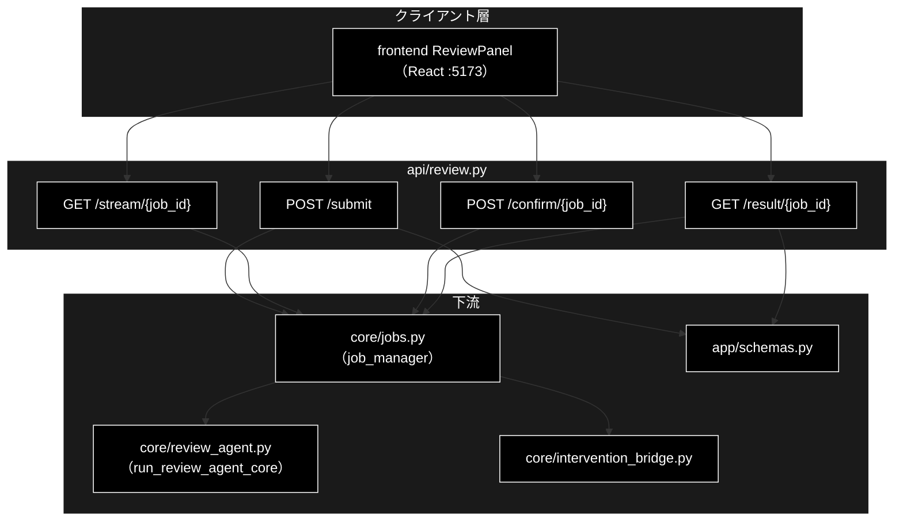
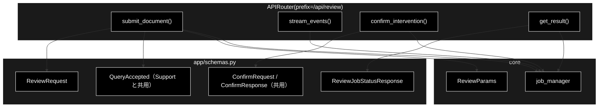
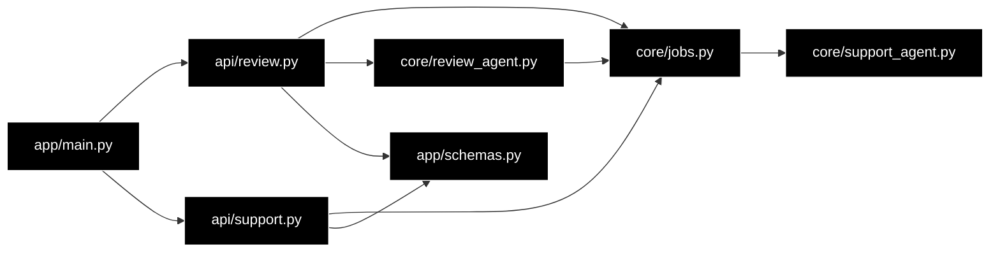

# api/review.py - 文書レビュー API ドキュメント

**Version 1.0** | 最終更新: 2026-07-29

---

## 目次

1. [概要](#概要)
2. [アーキテクチャ構成図](#1-アーキテクチャ構成図)
3. [モジュール構成図](#2-モジュール構成図)
4. [クラス・関数一覧表](#3-クラス関数一覧表)
5. [クラス・関数 IPO詳細](#4-クラス関数-ipo詳細)
6. [使用例](#5-使用例)
7. [エクスポート](#6-エクスポート)
8. [変更履歴](#7-変更履歴)
9. [付録: 依存関係図](#付録-依存関係図)

---

## 概要

`backend/app/api/review.py` は、GRACE-Review の**文書レビュー API**（`/api/review/*`）を
提供する FastAPI ルーターモジュール。

`api/support.py` と**構造は同一**で、違うのはジョブのパラメータ型（`ReviewParams`）と
結果の型（`ReviewResultModel`）だけ。ジョブ基盤・SSE・HITL ブリッジは汎用化済みの
`core/jobs.py` をそのまま使う（`job_manager.start(ReviewParams(...))` で runner が
型解決される）。SSE の形式も Support と完全に同一なので、フロントは同じパーサを使える。

### 主な責務

- レビュージョブの起動（`POST /api/review/submit`）
- ステップ進捗の SSE 配信（`GET /api/review/stream/{job_id}`）
- HITL CONFIRM 応答の注入（`POST /api/review/confirm/{job_id}`）
- ジョブ状態・最終結果の取得（`GET /api/review/result/{job_id}`）
- 存在しないジョブへの 404 応答

### 各責務対応のモジュール

| # | 責務 | 対応モジュール | 説明 |
|---|------|--------------|------|
| 1 | ジョブ起動 | `api/review.py` → `core/jobs.py` | `job_manager.start(ReviewParams)` |
| 2 | SSE 進捗配信 | `api/review.py` → `core/jobs.py` | `job.stream_events()` を SSE 整形 |
| 3 | HITL 応答注入 | `api/review.py` → `core/jobs.py` | `job_manager.confirm(...)` |
| 4 | 結果取得 | `api/review.py` → `core/jobs.py` | `job_manager.get(job_id)` |
| 5 | 入出力スキーマ | `backend/app/schemas.py` | `ReviewRequest` / `ReviewJobStatusResponse` |
| 6 | パイプライン実行 | `core/review_agent.py` | `run_review_agent_core` |

### 主要機能一覧

| 機能 | 説明 |
|------|------|
| `router` | `APIRouter(prefix="/api/review")` |
| `submit_document()` | POST /submit（ジョブ起動、202 Accepted） |
| `stream_events()` | GET /stream/{job_id}（SSE 進捗配信） |
| `confirm_intervention()` | POST /confirm/{job_id}（HITL 応答） |
| `get_result()` | GET /result/{job_id}（結果取得） |

### エンドポイント一覧

| メソッド | パス | ステータス | 内容 |
|---|---|:---:|---|
| `POST` | `/api/review/submit` | 202 | 文書を投入しジョブ起動 |
| `GET` | `/api/review/stream/{job_id}` | 200 | SSE で進捗配信 |
| `POST` | `/api/review/confirm/{job_id}` | 200 | HITL CONFIRM への応答 |
| `GET` | `/api/review/result/{job_id}` | 200 | 状態と `ReviewResult` |

関連: `GET /api/rulesets`（ルールセット一覧）は `api/meta.py` にある。

---

## 1. アーキテクチャ構成図

### 1.1 システム全体構成



### 1.2 データフロー

1. フロントが `POST /submit` で文書を投入し、`{job_id, stream_url}` を受け取る
2. `job_manager.start(ReviewParams(...))` がワーカースレッドで `run_review_agent_core` を実行する
3. フロントが `stream_url` を `EventSource` で購読し、ステップ進捗を受け取る
4. ⑦ で承認が必要なら `intervention`（`status=waiting`）イベントが届く
5. フロントが `POST /confirm/{job_id}` で承認/拒否を返し、`InterventionBridge` が解決する
6. 完了時に `result` イベント → `done` 番兵の順で届く。`GET /result/{job_id}` でも取れる

### 1.3 HITL を含む往復（sequenceDiagram）


---

## 2. モジュール構成図

### 2.1 内部モジュール構成



### 2.2 外部依存関係

| ライブラリ | バージョン | 用途 |
|-----------|-----------|------|
| `fastapi` | >=0.116 | `APIRouter` / `HTTPException` |
| `starlette`（fastapi 同梱） | — | `StreamingResponse`（SSE） |

### 2.3 内部依存モジュール

| モジュール | 用途 |
|-----------|------|
| `backend.app.core.jobs` | `job_manager`（起動・参照・HITL 注入） |
| `backend.app.core.review_agent` | `ReviewParams`（**import に副作用あり**・後述） |
| `backend.app.schemas` | リクエスト/レスポンスモデル |

> ⚠️ **`review_agent` の import には副作用がある。** import 時に
> `register_runner(ReviewParams, _review_runner, "review")` が走る。`ReviewParams` を
> 使う以上この import は必ず発生するので、**登録漏れは構造的に起きない**。

---

## 3. クラス・関数一覧表

### 3.1 クラス一覧

本モジュールにクラスは無い（ルーター関数のみ）。スキーマは `app/schemas.py` にある。

### 3.2 関数一覧（カテゴリ別）

#### エンドポイント

| 関数名 | 概要 |
|-------|------|
| `submit_document(request)` | レビュージョブを起動する（202） |
| `stream_events(job_id)` | SSE で進捗を配信する |
| `confirm_intervention(job_id, request)` | HITL 応答を注入する |
| `get_result(job_id)` | 状態と結果を返す |

---

## 4. クラス・関数 IPO詳細

### 4.1 エンドポイント関数

#### `submit_document`

**概要**: レビュージョブを起動する。進捗は `stream_url` の SSE で配信される。

```python
@router.post("/submit", response_model=QueryAccepted, status_code=202)
def submit_document(request: ReviewRequest) -> QueryAccepted
```

| パラメータ | 型 | デフォルト | 説明 |
|------------|------|-----------|------|
| `request` | ReviewRequest | - | 文書とオプション（`app/schemas.py`） |

| 項目 | 内容 |
|------|------|
| **Input** | `request: ReviewRequest`（`document` / `document_title` / `ruleset` / `use_web` / `do_action` / `dry_run` / `verbose`） |
| **Process** | 1. Pydantic が `document` の長さ（1〜50,000）と `ruleset` の値域を検証（違反は 422）<br>2. `ReviewParams` へ詰め替える<br>3. `job_manager.start()` でワーカースレッドを起動する |
| **Output** | `QueryAccepted`: `{job_id, stream_url}`（HTTP 202） |

**戻り値例**:
```python
{
    "job_id": "a1b2c3d4e5f6",
    "stream_url": "/api/review/stream/a1b2c3d4e5f6"
}
```

```bash
# 使用例
curl -s -X POST http://127.0.0.1:8000/api/review/submit \
  -H 'Content-Type: application/json' \
  -d '{"document":"当社の化粧品は業界No.1の実力です。","document_title":"LP案"}'
# {"job_id":"a1b2c3d4e5f6","stream_url":"/api/review/stream/a1b2c3d4e5f6"}
```

**エラー**:

| 状況 | ステータス | 備考 |
|---|:---:|---|
| `document` が空 | 422 | `min_length=1` |
| `document` が 50,000 文字超 | 422 | `MAX_DOCUMENT_CHARS`。組合せ爆発を入力段で止める |
| `ruleset` が未知の値 | 422 | `Literal["ec_ad"]` |

#### `stream_events`

**概要**: ステップ進捗（S1・①〜⑦）を SSE で逐次配信する。

```python
@router.get("/stream/{job_id}")
def stream_events(job_id: str) -> StreamingResponse
```

| パラメータ | 型 | デフォルト | 説明 |
|------------|------|-----------|------|
| `job_id` | str | - | `submit` が返したジョブ ID |

| 項目 | 内容 |
|------|------|
| **Input** | `job_id: str` |
| **Process** | 1. ジョブを引く（無ければ 404）<br>2. `job.stream_events()` を `data: {JSON}\n\n` へ整形<br>3. `None`（タイムアウト）は `: keepalive` コメントを送る<br>4. 終端に `done` 番兵を送る |
| **Output** | `StreamingResponse`（`text/event-stream`） |

**配信例**:
```
data: {"seq":0,"ts":1753800000.1,"type":"step","step":"ruleset","status":"started","title":"S1 ルールセット: EC広告表示（--ruleset ec_ad）","message":"","data":{...}}

data: {"seq":1,"ts":1753800000.2,"type":"log","step":"ruleset","message":"  ルール数: 21（常時チェック 6） / しきい値: notify=0.85 confirm=0.6","data":{}}

data: {"seq":42,"ts":1753800012.9,"type":"result","data":{"document_title":"LP案","findings":[...]}}

data: {"type":"done","status":"completed"}
```

> **イベントは常に先頭からリプレイされる。** 完了後に購読しても全イベントが取れるため、
> 再接続・途中購読で取りこぼさない。`seq` は 0 起点の通し番号で、欠番の検知に使える。

#### `confirm_intervention`

**概要**: HITL CONFIRM への応答（承認 / 拒否）を注入する。

```python
@router.post("/confirm/{job_id}", response_model=ConfirmResponse)
def confirm_intervention(job_id: str, request: ConfirmRequest) -> ConfirmResponse
```

| パラメータ | 型 | デフォルト | 説明 |
|------------|------|-----------|------|
| `job_id` | str | - | ジョブ ID |
| `request` | ConfirmRequest | - | `{intervention_id, approve}` |

| 項目 | 内容 |
|------|------|
| **Input** | `job_id: str`, `request: ConfirmRequest` |
| **Process** | `job_manager.confirm()` へ委譲。`not_found` は 404 へ変換する |
| **Output** | `ConfirmResponse`: `{"status": "resolved" \| "not_waiting"}` |

**戻り値例**:
```python
{"status": "resolved"}      # 承認/拒否が反映された
{"status": "not_waiting"}   # 承認待ちが無い（タイムアウト済み・完了後など）
```

> `approve=True` で PROCEED（起票・差し戻しの実行）、`False` で CANCEL。
> タイムアウト時はバックエンドが安全側（実行せず有人対応へ）に倒す。

#### `get_result`

**概要**: ジョブの状態と最終結果（`ReviewResult`）を返す。SSE が使えない環境のフォールバック。

```python
@router.get("/result/{job_id}", response_model=ReviewJobStatusResponse)
def get_result(job_id: str) -> ReviewJobStatusResponse
```

| 項目 | 内容 |
|------|------|
| **Input** | `job_id: str` |
| **Process** | ジョブを引き（無ければ 404）、状態と `result` を返す |
| **Output** | `ReviewJobStatusResponse`: `{job_id, status, result}` |

**戻り値例**:
```python
{
    "job_id": "a1b2c3d4e5f6",
    "status": "completed",
    "result": {
        "document_title": "LP案",
        "ruleset": "ec_ad",
        "findings": [
            {
                "finding_id": "f001",
                "segment_id": "s001",
                "excerpt": "業界No.1",
                "start": 6,
                "end": 12,
                "rule_id": "keihyo-03",
                "rule_title": "No.1表示の根拠",
                "law": "景品表示法",
                "article": "第5条第1号",
                "message": "出典の併記がない No.1 表示は不当表示に該当するおそれがあります",
                "suggestion": "調査主体・調査期間・調査対象を併記してください",
                "severity": "high",
                "confidence": 0.92,
                "citations": ["[規程] 景品表示法 優良誤認"],
                "status": "review_required",
                "forced": True,
                "suppress_reason": None,
                "web_checked": False
            }
        ],
        "summary": {
            "high": 1, "medium": 0, "low": 0,
            "confirmed": 0, "review_required": 1, "suppressed": 2
        },
        "segments_total": 3,
        "rules_evaluated": 9,
        "detected_raw": 3,
        "rescued": 0,
        "forced_high": 1,
        "truncated": False
    }
}
```

---

## 5. 使用例

### 5.1 基本ワークフロー（curl）

```bash
# 1. 投入
JOB=$(curl -s -X POST http://127.0.0.1:8000/api/review/submit \
  -H 'Content-Type: application/json' \
  -d '{"document":"当社の化粧品は業界No.1の実力。使えばシミが治ると評判です。","document_title":"LP案"}' \
  | python -c 'import json,sys; print(json.load(sys.stdin)["job_id"])')

# 2. 進捗（SSE）
curl -N http://127.0.0.1:8000/api/review/stream/$JOB

# 3. 結果
curl -s http://127.0.0.1:8000/api/review/result/$JOB | python -m json.tool
```

### 5.2 応用ワークフロー（フロントの購読）

```typescript
import { startReview, subscribeStream, confirmReviewIntervention } from './api/client';

const { job_id } = await startReview({
  document, document_title: 'LP案', ruleset: 'ec_ad',
  use_web: false, do_action: true, dry_run: true, verbose: false,
});

const unsubscribe = subscribeStream(
  job_id,
  (event) => dispatch({ type: 'event', event }),
  (message) => dispatch({ type: 'failed', message }),
  'review',            // ← Support / Review の切り替えはこの引数だけ
);
```

---

## 6. エクスポート

| 要素 | 種別 | 参照元 |
|---|---|---|
| `router` | `APIRouter` | `backend/app/main.py`（`app.include_router(review.router)`） |

エンドポイント関数は FastAPI のデコレータ経由でのみ呼ばれる。

---

## 7. 変更履歴

| バージョン | 日付 | 変更内容 |
|-----------|------|---------|
| 1.0 | 2026-07-29 | 初版作成（GRACE-Review STEP5・PR #41 に対応） |

---

## 付録: 依存関係図



`api/review.py` と `api/support.py` は**互いに依存しない**。共有しているのは
`core/jobs.py`（ジョブ基盤）と `app/schemas.py`（`QueryAccepted` / `ConfirmRequest` /
`ConfirmResponse`）だけである。
