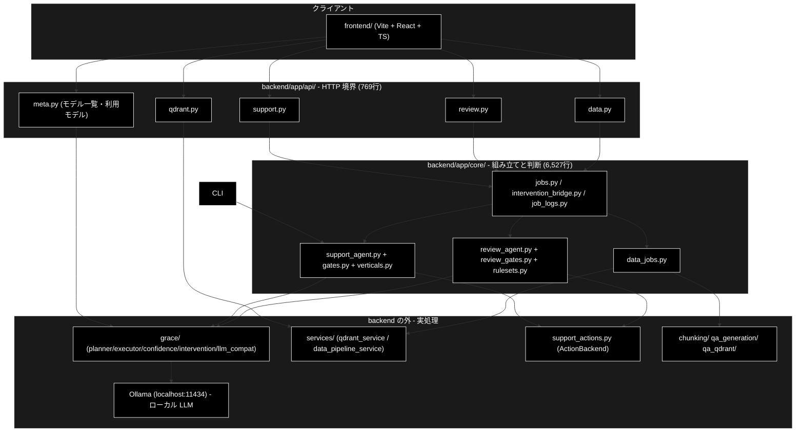
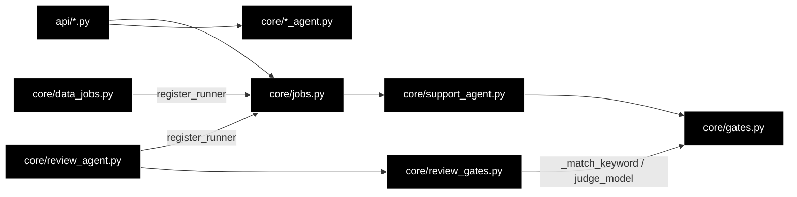
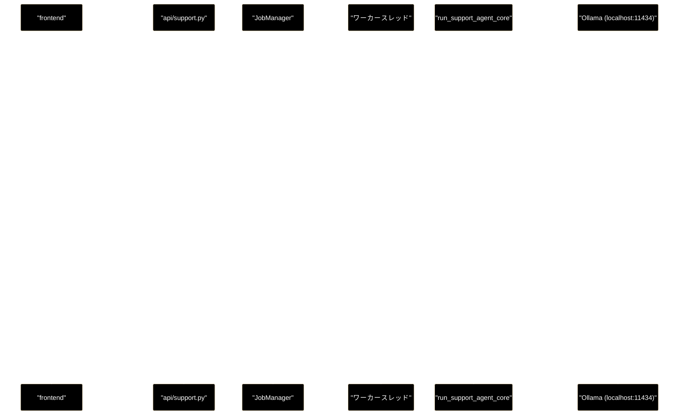

# backend アーキテクチャ ドキュメント

**Version 1.1** | 最終更新: 2026-09-24

> **本書の位置づけ**: `backend/` を理解するときに**最初に読む 1 枚**。
> 層構造・モジュールの責務・外側のパッケージとの境界・依存の向きを示す。
> 各段の判断ロジックは系統別文書、共有基盤は [`job_runtime.md`](./job_runtime.md) に分ける。

> **関連ドキュメント**
> - [`job_runtime.md`](./job_runtime.md) — ジョブ・SSE・HITL の共有基盤（本書の次に読む）
> - [`api_contract.md`](./api_contract.md) — エンドポイント一覧と SSE のワイヤ形式
> - [`config_and_providers.md`](./config_and_providers.md) — ローカル LLM のモデル解決経路
> - [`pitfalls.md`](./pitfalls.md) — 触る前に知っておく落とし穴（Ollama 固有を含む）

---

## 目次

- [概要](#概要)
- [1. 層構造](#1-層構造)
- [2. モジュール一覧](#2-モジュール一覧)
- [3. 3 系統 × 1 共有基盤](#3-3-系統--1-共有基盤)
- [4. backend が持たないもの（外部境界）](#4-backend-が持たないもの外部境界)
- [5. 依存の向き](#5-依存の向き)
- [6. リクエストが通る経路（Support の例）](#6-リクエストが通る経路support-の例)
- [7. 読む順路](#7-読む順路)
- [8. 変更履歴](#8-変更履歴)

---

## 概要

`backend/app/` は **FastAPI の薄い層**である。17 モジュール・約 7,800 行のうち、
API 層（`api/*.py` + `main.py`）は合計 769 行しかなく、やっていることは

1. Pydantic でリクエストを検証し（**モデル名の検証を含む**）、
2. ジョブを起動し（`core/jobs.py`）、
3. 進捗を SSE に変換して流す

の 3 つだけである。**実処理は `backend/` の外**（`grace/` の planner / executor /
confidence / intervention、`services/`、`chunking/` `qa_generation/` `qa_qdrant/`、
`support_actions.py`）にある。

`backend/app/core/` が担うのは、その外側の部品を**業務手順として組み立てる**ことと、
**判断（ゲート）**である。行数の上位が `gates.py`（1,498 行）・`review_agent.py`
（1,106 行）・`support_agent.py`（983 行）・`data_jobs.py`（857 行）であることが、そのまま
「backend の難所は API ではなく判定ロジックである」ことを示している。

> **LLM はローカル（Ollama）で動く。** LLM 用途の API キーは不要で、必要なのは
> Embedding（検索）用の `GOOGLE_API_KEY` だけである（[`config_and_providers.md`](./config_and_providers.md)）。
> そのぶん「**モデルが pull 済みか**」「**tool calling に対応しているか**」という、
> クラウド API には無い前提チェックが backend 側に入っている。

### 主な責務

- HTTP 境界でリクエストを検証し、エンドポイントを公開する
- ジョブを起動し、進捗を SSE で配信する（イベントのリプレイを含む）
- HITL の承認待ちをワーカースレッドと API のあいだで橋渡しする
- `grace/` ・`services/` ・データ準備パッケージの部品を業務手順（Support / Review / データ準備）として組み立てる
- 回答・指摘の採否を判断する（ゲート・業界プロファイル・ルールセット）
- 既存パッケージのログをジョブの進捗イベントへ転送する

### 各責務対応のモジュール

| # | 責務 | 対応モジュール | 説明 |
|---|------|--------------|------|
| 1 | 検証と公開 | `backend/app/main.py` / `backend/app/api/*.py` / `backend/app/schemas.py` | Pydantic で検証し、ルータを束ねる（§2.1） |
| 2 | ジョブ起動と SSE 配信 | `backend/app/core/jobs.py` | `JobManager`・イベントのリプレイ（[`job_runtime.md`](./job_runtime.md)） |
| 3 | HITL の橋渡し | `backend/app/core/intervention_bridge.py` | `InterventionBridge` がワーカーを待たせ、`POST /confirm` で再開させる |
| 4 | 業務手順の組み立て | `backend/app/core/support_agent.py` / `review_agent.py` / `data_jobs.py` | 3 系統のコア（§3） |
| 5 | 採否の判断 | `backend/app/core/gates.py` / `review_gates.py` / `verticals.py` / `rulesets.py` | 判定の純関数と業界別の設定 |
| 6 | ログの転送 | `backend/app/core/job_logs.py` | `capture_logs()` で `logging` を横取りする |

### アーキテクチャ構成図

層構造（クライアント → API 層 → core 層 → backend の外）の図は [§1 層構造](#1-層構造) にある。
呼び出し側（`frontend/`）→ 本書が扱う機構（`backend/app/api/` と `core/`）→ 外部・下位（`grace/` ・`services/` ・データ準備パッケージ・`support_actions.py`）の 3 層に対応する。

**データフロー**:

1. フロントエンドが `POST` でジョブを起動し、API 層がリクエストを検証して `JobManager` に渡す
2. ワーカースレッドで core のコア関数が走り、`grace/` などの部品を順に呼ぶ
3. 各段の進捗は `SupportEvent` として emit され、`GET /stream/{job_id}` の SSE で返る
4. 承認が要る段では `InterventionBridge` がワーカーを止め、`POST /confirm/{job_id}` で再開する

---

## 1. 層構造



> ⚠️ **エージェント実行の CLI 入口は無い（2026-09-20 以降）。** Support / Review とも
> Web API 専用である。かつて Support には `agent_support_example.py` があり
> `run_support_agent_core` を直接呼んでいたが、機能確認用の薄いラッパだったため削除した。
> データ準備は `chunking/` 等の**パッケージ側**に別の CLI がある（こちらは現役）。

---

## 2. モジュール一覧

行数は 2026-09-16 の `wc -l` 実測値。

### 2.1 API 層（`backend/app/`）

| モジュール | 行数 | 責務 | prefix |
|---|---:|---|---|
| `main.py` | 68 | FastAPI 組み立て・CORS・ルータ登録・`.env` 読み込み | — |
| `schemas.py` | 552 | 全リクエスト / レスポンス / イベントの Pydantic モデル（**モデル名の検証を含む**） | — |
| `api/support.py` | 90 | Support のジョブ起動 / SSE / HITL 応答 / 結果取得 | `/api/support` |
| `api/review.py` | 105 | Review の同上（構造は support.py と同一） | `/api/review` |
| `api/data.py` | 197 | データ準備 4 ジョブの起動 + 共通 SSE / HITL / 結果 | `/api` |
| `api/qdrant.py` | 200 | Qdrant 参照系（読み取り専用）・入力ファイル一覧 | `/api` |
| `api/meta.py` | 109 | **モデル一覧 / 利用モデル**・業界プロファイル・ルールセット・ヘルスチェック | `/api` |

### 2.2 core 層（`backend/app/core/`）

| モジュール | 行数 | 系統 | 責務 |
|---|---:|---|---|
| `jobs.py` | 305 | 共有 | ジョブ管理・runner 注入・イベント蓄積とリプレイ |
| `intervention_bridge.py` | 139 | 共有 | HITL の同期コールバック ↔ 非同期 API の橋渡し |
| `job_logs.py` | 193 | 共有 | 既存パッケージの `logging` を進捗イベントへ転送 |
| `support_agent.py` | 983 | Support | `run_support_agent_core`（0-(A)〜⑥ の 1 周） |
| `gates.py` | 1,498 | Support | 質問分析・回答ゲート・救済・スコープ判定・情報なし検知 |
| `verticals.py` | 282 | Support | `VerticalProfile`（gov / saas / ec） |
| `review_agent.py` | 1,106 | Review | `run_review_agent_core`（S1・①〜⑦ の 1 周） |
| `review_gates.py` | 521 | Review | 二段判定・誤検知抑止・救済・重大度調整 |
| `rulesets.py` | 643 | Review | `RuleSet` / `RuleItem`（EC 広告ルール） |
| `data_jobs.py` | 857 | データ準備 | 4 種の runner（chunking / qa / register / delete） |

---

## 3. 3 系統 × 1 共有基盤

backend には**性格の違う 3 系統**が載っているが、実行基盤は 1 つを共有する。

| | GRACE-Support | GRACE-Review | データ準備 |
|---|---|---|---|
| 情報の流れ | 問い合わせ → 回答 | 文書 → 指摘 | ファイル → Qdrant |
| 起動 | `POST /api/support/query` | `POST /api/review/submit` | `POST /api/chunking/run` ほか 3 種 |
| params 型 | `JobParams` | `ReviewParams` | `ChunkingParams` ほか 3 種 |
| 結果型 | `SupportResultModel` | `ReviewResultModel` | `DataJobStatusResponse` |
| ステップ | `STEP_IDS`（9 段） | `REVIEW_STEP_IDS`（9 段） | 種別ごとに 3〜4 段 |
| **使用モデルの指定** | `model`（任意） | `model`（任意） | `model`（任意） |
| HITL CONFIRM | ⑥ Action で条件付き | ⑦ Action で条件付き | 削除は常に / 登録は `recreate` 時のみ |
| **ジョブ基盤・SSE・HITL** | **共通（`core/jobs.py`）** | **共通** | **共通** |

3 系統とも **params に `model` を持ち**、画面のモデルセレクタ（`GET /api/models`）で
選んだローカル LLM をジョブ単位で切り替えられる。未指定なら既定へ倒れる
（解決は 1 箇所。[`config_and_providers.md` §3](./config_and_providers.md)）。

したがって

- **共通部の説明は [`job_runtime.md`](./job_runtime.md) に一本化する**
- 系統別文書は「この系統に固有な params / 結果 / ステップ / CONFIRM の要否」だけを書く

という分担にする。これは `jobs.py` が runner 注入で汎用化されているという
**実装の構造をそのまま写した**ものである。

---

## 4. backend が持たないもの（外部境界）

`backend/app/` が import している**リポジトリ内の外部モジュール**は以下がすべてである
（標準ライブラリ・FastAPI・Pydantic を除く）。

| 外部モジュール | 使う側 | 何を委ねているか |
|---|---|---|
| `grace`（`create_intervention_handler` / `create_tool_registry` / `get_config`） | `support_agent.py` / `review_agent.py` | エージェント基盤の生成・設定解決 |
| `grace.confidence.create_groundedness_verifier` | `support_agent.py` / `review_agent.py` | ③④ 根拠検証（**Support / Review 共用**） |
| `grace.intervention`（`InterventionRequest` / `InterventionResponse` / `InterventionAction`） | `intervention_bridge.py` | HITL の型とアクション |
| `grace.llm_compat.create_chat_client` | `gates.py` / `review_gates.py` / `data_jobs.py` | **ローカル LLM（Ollama）の呼び出し** |
| `grace.config.get_config` | `api/meta.py` / 各コア | 解決済みのモデル名・しきい値 |
| `support_actions`（`create_action_backend` / `create_identity_verifier`） | `support_agent.py` / `review_agent.py` | ⑥⑦ アクション実行・本人確認（**共用**） |
| `services.qdrant_service` | `api/qdrant.py` / `data_jobs.py` | Qdrant の参照 |
| `services.data_pipeline_service` | `api/qdrant.py` / `data_jobs.py` | 入力ファイル解決・コレクション操作・**Ollama 到達性 / pull 済み判定** |
| `chunking.csv_text_to_chunks_text_csv` / `chunking.async_api_client` | `data_jobs.py` | チャンク化本体 |
| `qa_qdrant.register_to_qdrant` | `data_jobs.py` | Qdrant 登録本体 |
| `qdrant_client_wrapper.get_qdrant_client` | `api/qdrant.py` / `data_jobs.py` | Qdrant クライアント生成 |
| `config`（`get_default_ollama_model` / `get_selectable_ollama_models` / `get_default_chunking_workers` / `OllamaConfig`） | `api/meta.py` / `schemas.py` / `data_jobs.py` / `verticals.py` | ローカル LLM の既定・選択可能モデル・並列数 |

**この表の裏返しが「backend を読むだけでは分からないこと」**である。
RAG 検索の実装・planner のプロンプト・Ollama クライアントの互換処理を追うときは、
`grace/docs/` `services/docs/` `chunking/docs/` 側の文書へ移る。

> ⚠️ **共用部品は Support と Review の両方に効く。** `GroundednessVerifier` /
> `InterventionBridge` / `support_actions.py` を触った変更は、Support のつもりでも
> Review を壊す。`backend/tests` の 92 ファイル中 18 ファイルが Review 系である。

---

## 5. 依存の向き

守られている規律は 3 つ。**ここを崩すと循環 import になる。**

1. **`core/` は `api/` を知らない。** 逆向きの import は存在しない。
2. **`jobs.py` は Review・データ準備を知らない。**
   Support の runner だけを自分で登録し、Review / データ準備の runner は
   `review_agent.py` / `data_jobs.py` が**自分の import 時に**
   `register_runner()` で登録する（[`job_runtime.md` §3](./job_runtime.md)）。
3. **判定ロジックは `*_gates.py` に集める。**
   `review_gates.py` は `gates.py` から `_match_keyword` / `judge_model` を再利用する
   （Review → Support の一方向）。



---

## 6. リクエストが通る経路（Support の例）



**ポイント**: HTTP 応答は 202 で即返り、実体はワーカースレッドで走る。
HITL は「SSE で聞き、別の POST で答える」という**2 本の HTTP を跨ぐ**やり取りになる。
この橋渡しが `InterventionBridge` である（[`job_runtime.md` §4](./job_runtime.md)）。

> ⚠️ **ローカル LLM では受付から最初のイベントまでに十数秒かかる**ことがある
> （ツール・planner・executor の生成）。所要時間はこの待ちを含めて数えるため、
> `done` 番兵の `started_at` は**POST を受け付けた時刻**である。

Review・データ準備も**まったく同じ形**で、違うのは params 型・結果型・
CONFIRM を出す条件だけである。

---

## 7. 読む順路

```
architecture.md（本書）
  └ job_runtime.md          ジョブ・SSE・HITL の共有基盤（必読）
      ├ support_flow.md     担当する系統だけ読む
      ├ review_flow.md
      └ data_pipeline.md
api_contract.md             フロント / API 利用者はここから
config_and_providers.md     モデル・プロバイダを触る前に
pitfalls.md                 コードを触る前に
reference/*.md              引く（通読しない）
```

---

## 8. 変更履歴

| Version | 日付 | 変更内容 |
|---|---|---|
| 1.0 | 2026-09-16 | 新規作成。層構造・モジュール一覧・外部境界・依存の向きを**本リポジトリの実装から**書き起こした（姉妹リポジトリ `grace_v2` の同名文書とは、モデルセレクタと Ollama 前提の扱いが異なる） |
| 1.1 | 2026-09-24 | `a_cross_doc_md_format.md` v1.1（種別 A）に準拠（2026-09-24）。概要に主な責務・各責務対応のモジュール・アーキテクチャ構成図（§1 へのリンクとデータフロー）を追加。本文の章番号は変えていない |
