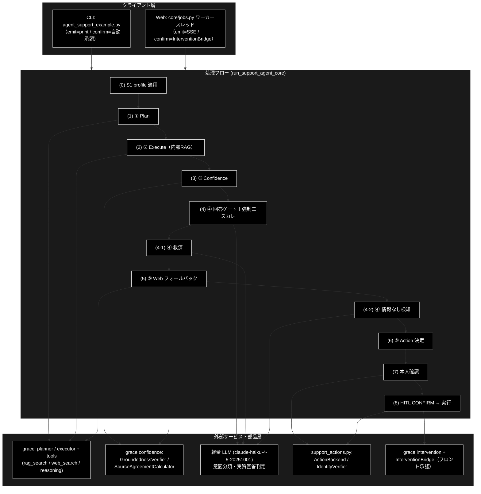
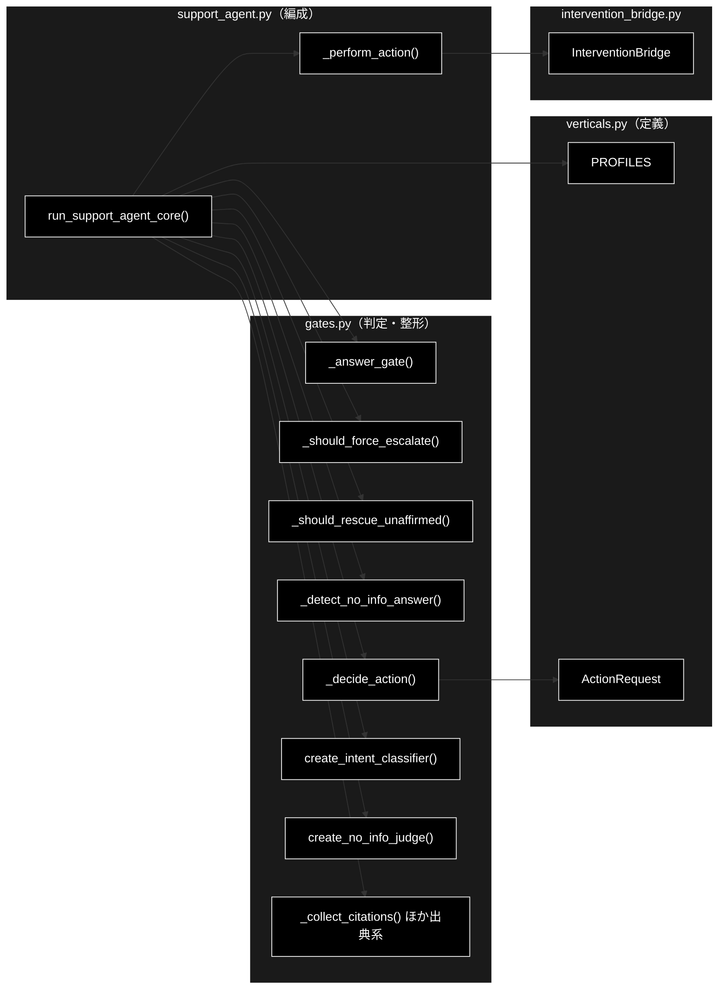
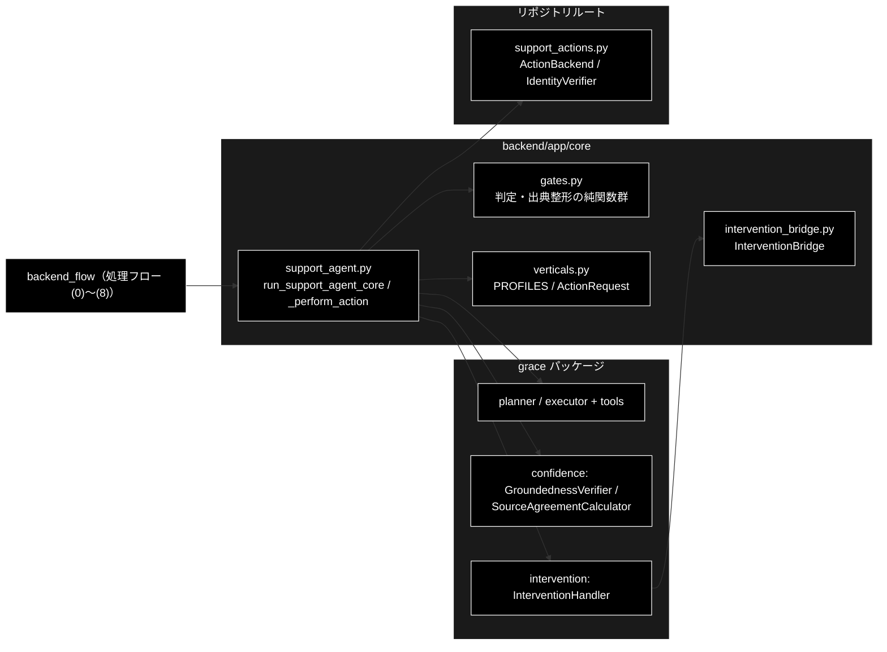

# backend_flow.md - GRACE-Support 処理フロー ステップ詳細（(0)〜(8)）ドキュメント

**Version 1.1** | 最終更新: 2026-08-01

> 📌 GRACE-**Review** 側の対応ドキュメントは [`review_flow.md`](./review_flow.md)（S1・①〜⑦）。

---

## 目次

1. [概要](#概要)
2. [アーキテクチャ構成図](#1-アーキテクチャ構成図)
3. [モジュール構成図](#2-モジュール構成図)
4. [クラス・関数一覧表](#3-クラス関数一覧表)
5. [処理ステップ IPO詳細（(0)〜(8)）](#4-処理ステップ-ipo詳細08)
6. [設定・定数](#5-設定定数)
7. [使用例](#6-使用例)
8. [エクスポート](#7-エクスポート)
9. [変更履歴](#8-変更履歴)
10. [付録: 依存関係図](#付録-依存関係図)

---

## 概要

本ドキュメントは、GRACE-Support パイプライン（`backend/app/core/support_agent.py` の
`run_support_agent_core()`）が実行する **処理フローの各ステップ (0)〜(8)** を、
実装関数・シグネチャ・IPO（Input-Process-Output）・戻り値例・使用例つきで記述する。
全体像（アーキテクチャ・データフロー）はリポジトリルートの [`README.md`](../../README.md) §1〜§2 を参照。

> 📝 **注意（実行順）**: 本ドキュメントの番号はルート `README.md` §2-1 の
> フロー図の並びに従う。パイプラインの**実際の実行順**は
> **(0) → (1) → (2) → (3) → (4) → (4-1) → (5) → (4-2) → (6) → (7) → (8)** であり、
> ④'（(4-2) 情報なし回答検知）は ⑤（(5) Web フォールバック）の**後**に、
> `decision == "answer"` の場合のみ実行される。

### 主な責務

- 業界プロファイル（gov / saas / ec）による検索スコープ・しきい値・エスカレ語・本人確認の切替
- クエリの実行計画への分解（Plan）と内部 RAG → reasoning による回答生成（Execute）
- 回答の主張ごとの裏付け検証（Groundedness）と支持率・出典数に基づく回答可否判定（回答ゲート）
- 誤エスカレ・誤回答の抑止（強制エスカレの二段判定・④-救済・④' 情報なし回答検知）
- 内部根拠不足時の Web フォールバック（回答再利用による重複推論の省略・内部×Web 相互検証）
- 副作用のあるアクションの安全な実行（本人確認 → HITL CONFIRM → バックエンド実行）

### 各責務対応のモジュール

| # | 責務 | 対応モジュール | 説明 |
|---|------|--------------|------|
| 1 | 業界プロファイルの切替 | `backend/app/core/verticals.py` | `PROFILES`（VerticalProfile 定義）。適用は `support_agent.py` 内 |
| 2 | Plan / Execute | `grace`（planner / executor + tools） | `support_agent.py` から呼び出し。出典整形は `gates.py` |
| 3 | Groundedness と回答ゲート | `grace.confidence` / `backend/app/core/gates.py` | 検証は `GroundednessVerifier`、判定は `_answer_gate` |
| 4 | 誤エスカレ・誤回答の抑止 | `backend/app/core/gates.py` | `_should_force_escalate` / `_should_rescue_unaffirmed` / `_detect_no_info_answer` |
| 5 | Web フォールバック | `backend/app/core/support_agent.py` | tools（web_search / reasoning）と相互検証の編成。補助関数は `gates.py` |
| 6 | アクションの安全な実行 | `support_actions.py` / `backend/app/core/intervention_bridge.py` | 本人確認・バックエンド実行・HITL 承認待ち |

### 主要機能一覧

| 機能 | 説明 |
|------|------|
| `run_support_agent_core()` | パイプライン全体の編成（(0)〜(8) の実行主体・イベント発行型） |
| `PROFILES` | (0) 業界プロファイル定義（gov / saas / ec） |
| `_collect_citations()` | (2) step_results から出典リストを作成（[社内]/[Web] ラベル付け） |
| `_answer_gate()` | (4) 支持率・出典数から answer / escalate を判定する純関数 |
| `_should_force_escalate()` | (4) エスカレ語の二段判定（キーワード → 意図分類） |
| `create_intent_classifier()` | (4)(6) 意図分類器（question / request / incident。軽量 LLM） |
| `_should_rescue_unaffirmed()` | (4-1) 出典付き・矛盾なしの内部回答を escalate から救済するか判定 |
| `_detect_no_info_answer()` | (4-2) 「情報なし回答」の二段判定（定型句候補 → 実質回答判定） |
| `create_no_info_judge()` | (4-2) 実質回答判定器（answered / no_info。軽量 LLM） |
| `_pick_groundedness()` / `_merge_citations()` | (5) 内部×Web の検証結果・出典の統合 |
| `_decide_action()` | (6) 回答判定と問い合わせ内容から実行アクションを決定（二段判定） |
| `_perform_action()` | (7)(8) 本人確認 → HITL CONFIRM → バックエンド実行の編成 |
| `InterventionBridge` | (8) HITL 承認の同期⇔非同期変換（Web のフロント承認待ち） |

---

## 1. アーキテクチャ構成図

### 1.1 システム全体構成



### 1.2 データフロー

1. クライアント（CLI / Web ジョブ）が `run_support_agent_core(query, vertical, ..., emit, confirm)` を呼び出す
2. (0) プロファイルを解決し、検索スコープ（`config.qdrant.allowed_collections`）と方針（`config.llm.prompt_addendum`）を config へ注入する
3. (1)〜(3) Plan → Execute → Groundedness 検証で内部回答・出典・支持率を得る
4. (4)〜(4-1) 回答ゲート・強制エスカレ・救済で `decision`（answer / escalate）を確定する
5. (5) escalate かつ非強制エスカレなら Web で裏取りし、検証結果・出典を統合する
6. (4-2) answer の場合のみ「情報なし回答」を検知し、該当すれば escalate に倒す
7. (6)〜(8) アクションを決定し、本人確認 → HITL CONFIRM → バックエンド実行を経て結果メッセージを得る
8. 各ステップの進捗は `emit(SupportEvent)` で通知され、最終的に `SupportResult` が `result` イベントと戻り値で返る

---

## 2. モジュール構成図

### 2.1 内部モジュール構成



### 2.2 外部依存関係

| ライブラリ / パッケージ | バージョン | 用途 |
|-----------|-----------|------|
| `grace`（リポジトリ内） | - | planner / executor + tools / GroundednessVerifier / SourceAgreementCalculator / InterventionHandler |
| `support_actions`（リポジトリ内） | - | ActionBackend（dry-run / webhook / pseudo）・IdentityVerifier |
| Anthropic Claude API | `claude-sonnet-4-6`（既定）/ `claude-haiku-4-5-20251001`（軽量判定） | Plan / reasoning / 検証・分類・判定 |
| Gemini Embedding API | `gemini-embedding-001`（3072次元） | RAG 検索の埋め込み |
| Qdrant | - | 内部ナレッジのベクトル検索（コレクション `*_anthropic`） |

### 2.3 内部依存モジュール

| モジュール | 用途 |
|-----------|------|
| `backend.app.core.support_agent` | パイプライン編成（(0)〜(8) の実行主体） |
| `backend.app.core.gates` | 回答ゲート・二段判定・救済・出典整形（純関数群） |
| `backend.app.core.verticals` | `PROFILES` / `ActionRequest` / `Intent` / `INTENT_MODEL` |
| `backend.app.core.intervention_bridge` | (8) HITL 承認のフロント連携（Web のみ） |

---

## 3. クラス・関数一覧表

### 3.1 ステップ ↔ 実装対応表

| ステップ | 内容 | 主実装 | 定義元 |
|---|---|---|---|
| (0) | S1 profile: 業界プロファイル適用 | `run_support_agent_core` 内 + `PROFILES` | `support_agent.py` / `verticals.py` |
| (1) | ① Plan | `planner.create_plan()` | `grace`（呼び出しは `support_agent.py`） |
| (2) | ② Execute | `executor.execute()` + `_collect_citations()` | `grace` / `gates.py` |
| (3) | ③ Confidence | `verifier.verify()` + `_citation_text()` | `grace.confidence` / `gates.py` |
| (4) | ④ 回答ゲート＋強制エスカレ | `_answer_gate()` + `_should_force_escalate()` + `create_intent_classifier()` | `gates.py` |
| (4-1) | ④-救済 | `_should_rescue_unaffirmed()` | `gates.py` |
| (4-2) | ④' 情報なし回答検知 | `_detect_no_info_answer()` + `create_no_info_judge()` | `gates.py` |
| (5) | ⑤ Web フォールバック | `run_support_agent_core` 内 + `_web_citations()` / `_web_source_texts()` / `_merge_citations()` / `_pick_groundedness()` | `support_agent.py` / `gates.py` |
| (6) | ⑥ Action 決定 | `_decide_action()` | `gates.py` |
| (7) | 本人確認 | `create_identity_verifier()` + `_perform_action()` 内 | `support_actions.py` / `support_agent.py` |
| (8) | HITL CONFIRM | `_perform_action()` 内 + `InterventionBridge` | `support_agent.py` / `intervention_bridge.py` |

### 3.2 関数一覧（カテゴリ別）

#### 判定（純関数）

| 関数名 | 概要 |
|-------|------|
| `_answer_gate(support_rate, verified, citation_count, notify_th, confirm_th)` | 支持率・出典数から (decision, warning) を返す |
| `_should_force_escalate(query, profile, classify)` | エスカレ語の二段判定。(forced, matched_keyword, intent) を返す |
| `_should_rescue_unaffirmed(decision, forced_escalate, has_contradiction, citation_count, answer, query, no_info_judge)` | 救済可否を返す |
| `_detect_no_info_answer(query, answer, judge, force_judge)` | (no_info, matched_marker) を返す |
| `_decide_action(query, decision, profile, classify)` | `Optional[ActionRequest]` を返す |
| `_pick_groundedness(*results)` | 複数の検証結果から (支持率, 判定主張数) を選ぶ |

#### LLM 判定器ファクトリ（軽量モデル）

| 関数名 | 概要 |
|-------|------|
| `create_intent_classifier(config)` | query → question / request / incident / None の分類関数を返す |
| `create_no_info_judge(config)` | (query, answer) → answered(False) / no_info(True) / None の判定関数を返す |

#### 出典整形

| 関数名 | 概要 |
|-------|------|
| `_collect_citations(step_results)` | sources を重複排除し [社内]/[Web] ラベル付きの出典リストへ |
| `_citation_text(citation)` | ラベルを外して出典の中身を返す |
| `_merge_citations(internal, web)` | 内部出典と Web 出典を URL 包含で重複排除して結合 |
| `_web_citations(web_output)` / `_web_source_texts(web_output)` | Web 検索結果から出典表示 / 検証用本文を抽出 |

#### 編成・アクション

| 関数名 | 概要 |
|-------|------|
| `run_support_agent_core(query, ..., emit, confirm)` | パイプライン全体の編成。`Optional[SupportResult]` を返す |
| `_perform_action(action, handler, backend, identity_verifier, identity, emit_log)` | 本人確認 → HITL → 実行。結果メッセージ str を返す |
| `InterventionBridge.resolver(request)` / `.resolve(intervention_id, approve)` | (8) 承認待ちのブロック / 応答注入 |

---

## 4. 処理ステップ IPO詳細（(0)〜(8)）

### 4.0 （0）S1 profile: 業界プロファイル適用（--vertical 指定時のみ）

**概要**: `vertical`（gov / saas / ec）に応じて検索スコープ・しきい値・エスカレ語・本人確認を
切り替える。`config` へ検索スコープと業界方針を注入することで、後続の tools（rag_search）と
reasoning に効かせる。未指定時は `step_skipped("profile")` としてスキップされる。

```python
# run_support_agent_core 内（support_agent.py）
profile = PROFILES.get(vertical) if vertical else None
notify_th = profile.notify_th if (profile and profile.notify_th is not None) else th.notify
confirm_th = profile.confirm_th if (profile and profile.confirm_th is not None) else th.confirm
config.qdrant.allowed_collections = list(profile.collections) if profile else []
config.llm.prompt_addendum = profile.prompt_addendum if profile else ""
```

| パラメータ | 型 | デフォルト | 説明 |
|------------|------|-----------|------|
| `vertical` | Optional[str] | None | 業界プロファイル ID（`gov` / `saas` / `ec`） |

| 項目 | 内容 |
|------|------|
| **Input** | `vertical: Optional[str]`, `PROFILES: Dict[str, VerticalProfile]`, `config`（grace 設定） |
| **Process** | 1. `PROFILES.get(vertical)` でプロファイル解決（None なら全設定を既定のまま）<br>2. `notify_th` / `confirm_th` をプロファイル値で上書き（None は config 既定を維持）<br>3. `config.qdrant.allowed_collections` に検索スコープを注入（未登録コレクションは自動無視）<br>4. `config.llm.prompt_addendum` に業界方針を注入（reasoning のプロンプトへ）<br>5. `step` イベント（started / finished、未指定時は skipped）を emit |
| **Output** | `profile: Optional[VerticalProfile]`, `notify_th: float`, `confirm_th: float`（後続ステップが参照） |

**戻り値例**:
```python
# step_finished("profile", ...) の data（SSE で配信される）
{
    "vertical": "ec",
    "name": "EC",
    "collections": ["ec_policy_anthropic", "ec_faq_anthropic"],
    "notify_th": 0.7,
    "confirm_th": 0.4,
    "require_identity": True,
    "prompt_addendum": "注文情報の照会・変更は本人確認必須。返品・交換は規定の版に基づいて回答。"
}
```

```python
# 使用例
from backend.app.core.verticals import PROFILES

profile = PROFILES.get("ec")
print(profile.name, profile.require_identity)
# 出力: EC True
```

### 4.1 （1）① Plan（planner）— クエリを実行計画に分解

**概要**: grace の planner がクエリを複雑度つきの実行計画（ステップ列）へ分解する。
計画の各ステップは (2) の executor が tools（rag_search 等）で実行する。

```python
plan = planner.create_plan(query)   # planner = create_planner(config)
```

| パラメータ | 型 | デフォルト | 説明 |
|------------|------|-----------|------|
| `query` | str | - | 問い合わせ内容（チャット入力） |

| 項目 | 内容 |
|------|------|
| **Input** | `query: str` |
| **Process** | 1. LLM（Anthropic Claude）でクエリを分析し実行計画を生成<br>2. 複雑度（complexity）を推定<br>3. `step` イベントで進捗（ステップ数・複雑度）を emit |
| **Output** | `Plan`: `steps`（実行ステップ列）と `complexity: float` を持つ計画オブジェクト |

**戻り値例**:
```python
# step_finished("plan", ...) の data
{
    "steps": 2,
    "complexity": 0.35
}
```

```python
# 使用例
plan = planner.create_plan("返品したい")
print(f"{len(plan.steps)} ステップ (complexity={plan.complexity:.2f})")
# 出力: 2 ステップ (complexity=0.35)
```

### 4.2 （2）② Execute（executor + tools）— 内部RAG検索 → reasoning

**概要**: executor が計画を実行し、内部 RAG 検索（Qdrant）→ reasoning で回答を生成する。
RAG スコア不足時は executor が `web_search` を**動的挿入**するため、出典に Web 由来が混ざる
（`[Web]` プレフィックスで検知し `used_dynamic_web` として (5) の再利用判定に使う）。

```python
result = executor.execute(plan)
internal_answer = result.final_answer or ""
internal_citations = _collect_citations(result.step_results)
used_dynamic_web = any(c.startswith("[Web]") for c in internal_citations)
```

#### `_collect_citations`

```python
def _collect_citations(step_results) -> List[str]
```

| パラメータ | 型 | デフォルト | 説明 |
|------------|------|-----------|------|
| `step_results` | list | - | executor の各ステップ結果（`sources` を持つ） |

| 項目 | 内容 |
|------|------|
| **Input** | `plan: Plan`（executor へ）、`result.step_results`（_collect_citations へ） |
| **Process** | 1. executor が計画の各ステップを tools で実行（rag_search → reasoning）<br>2. RAG スコア不足時は web_search を動的挿入<br>3. 各ステップの sources を重複排除し、URL は `[Web]`・それ以外は `[社内]` とラベル付け<br>4. `[Web]` の有無で動的 Web 検索の使用を検知 |
| **Output** | `internal_answer: str`（内部回答）, `internal_citations: List[str]`, `used_dynamic_web: bool` |

**戻り値例**:
```python
# internal_citations
[
    "[社内] ec_policy_anthropic: 返品ポリシー.md",
    "[Web] https://example.com/returns-guide"
]
```

```python
# 使用例
citations = _collect_citations(result.step_results)
print(any(c.startswith("[Web]") for c in citations))
# 出力: True（RAG スコア不足で web_search が動的挿入された場合）
```

### 4.3 （3）③ Confidence（GroundednessVerifier）— 支持率 support_rate

**概要**: 回答を主張（claim）単位に分解し、各主張が出典で裏付けられるかを検証する。
支持率 `support_rate = supported / (supported + contradicted)` と矛盾の有無が (4) の入力になる。

```python
gres = verifier.verify(query, internal_answer, [_citation_text(c) for c in internal_citations])
```

| パラメータ | 型 | デフォルト | 説明 |
|------------|------|-----------|------|
| `query` | str | - | 問い合わせ内容 |
| `answer` | str | - | 検証対象の回答（内部回答） |
| `sources` | List[str] | - | 出典テキスト（`_citation_text` でラベルを外した中身） |

| 項目 | 内容 |
|------|------|
| **Input** | `query: str`, `internal_answer: str`, `sources: List[str]` |
| **Process** | 1. 回答を主張単位に分解（LLM）<br>2. 各主張を出典と突き合わせ supported / contradicted / neutral に判定<br>3. 支持率・矛盾有無・検証成否を集計 |
| **Output** | `GroundednessResult`: `support_rate: float`, `supported: int`, `contradicted: int`, `total: int`, `verified: bool`, `has_contradiction: bool` |

**戻り値例**:
```python
# step_finished("confidence", ...) の data
{
    "support_rate": 0.75,
    "supported": 3, "contradicted": 1, "total": 5,
    "verified": True, "has_contradiction": True,
    "citations": 2
}
```

```python
# 使用例
gres = verifier.verify(query, answer, source_texts)
print(f"支持率={gres.support_rate:.2f}（判定可能 {gres.supported + gres.contradicted}/{gres.total} 主張）")
# 出力: 支持率=0.75（判定可能 4/5 主張）
```

### 4.4 （4）④ 回答ゲート（_answer_gate）＋ 強制エスカレ

**概要**: 支持率と出典数から回答可否を判定する。さらにプロファイルのエスカレ語に一致した場合は
二段判定（キーワード → 意図分類）で強制エスカレする（FAQ 質問は誤検知として抑止）。

#### `_answer_gate`

```python
def _answer_gate(
    support_rate: float,
    verified: bool,
    citation_count: int,
    notify_th: float,
    confirm_th: float,
) -> tuple[Decision, bool]
```

| パラメータ | 型 | デフォルト | 説明 |
|------------|------|-----------|------|
| `support_rate` | float | - | (3) の支持率 |
| `verified` | bool | - | 検証が成立したか（JSON 崩れ等は False） |
| `citation_count` | int | - | 出典数 |
| `notify_th` | float | - | 高信頼しきい値（プロファイルで上書き可） |
| `confirm_th` | float | - | 中信頼しきい値（同上） |

| 項目 | 内容 |
|------|------|
| **Input** | `support_rate: float`, `verified: bool`, `citation_count: int`, `notify_th: float`, `confirm_th: float` |
| **Process** | 1. 未検証 or 出典 0 → escalate<br>2. 支持率 ≥ notify_th → answer（高信頼）<br>3. confirm_th ≤ 支持率 < notify_th → answer ＋ 未確認注記（warning=True）<br>4. それ未満 → escalate |
| **Output** | `tuple[Decision, bool]`: (decision, warning)。decision は `"answer"` / `"escalate"` |

**戻り値例**:
```python
("answer", True)   # 中信頼: 回答するが「未確認」の注意書きを付ける
```

#### `_should_force_escalate`

```python
def _should_force_escalate(
    query: str,
    profile: Optional[VerticalProfile],
    classify: Optional[Callable[[str], Optional[Intent]]] = None,
) -> tuple[bool, Optional[str], Optional[Intent]]
```

| パラメータ | 型 | デフォルト | 説明 |
|------------|------|-----------|------|
| `query` | str | - | 問い合わせ内容 |
| `profile` | Optional[VerticalProfile] | - | (0) で解決したプロファイル（None なら常に不発動） |
| `classify` | Optional[Callable] | None | 意図分類器（`create_intent_classifier` の戻り値・メモ化済み） |

| 項目 | 内容 |
|------|------|
| **Input** | `query: str`, `profile: Optional[VerticalProfile]`, `classify: Optional[Callable]` |
| **Process** | 1. 第 1 段: `escalate_keywords` の部分一致（不一致なら不発動・LLM 呼び出しなし）<br>2. 第 2 段: 意図分類。`question`（FAQ 質問）なら誤検知として不発動<br>3. `request` / `incident` / 分類失敗（None）は安全側＝強制エスカレ |
| **Output** | `tuple[bool, Optional[str], Optional[Intent]]`: (forced, matched_keyword, intent) |

**戻り値例**:
```python
(False, "課金", "question")   # saas「課金プランの違いを教えて」→ FAQ 質問なので誤検知抑止
(True, "減免", "request")     # gov「減免を個別に判断してほしい」→ 設計どおり有人へ
```

```python
# 使用例
decision, warning = _answer_gate(0.75, True, 2, notify_th=0.8, confirm_th=0.5)
forced, kw, intent = _should_force_escalate("障害が発生しています", profile, classify)
if forced:
    decision, warning = "escalate", False
print(decision, forced, kw, intent)
# 出力: escalate True 障害 incident
```

### 4.5 （4-1）④-救済（_should_rescue_unaffirmed）

**概要**: 「肯定の裏付けが弱いだけで**矛盾は検出されていない**」出典付きの内部回答を
escalate から救済し、answer（未確認注記付き）として維持する。放置すると (5) の Web 二次生成で
「情報なし」回答に化けて (4-2) で誤エスカレする（ec「返金ポリシー」等で顕在化）ことへの対策。

```python
def _should_rescue_unaffirmed(
    decision: Decision,
    forced_escalate: bool,
    has_contradiction: bool,
    citation_count: int,
    answer: str,
    query: str,
    no_info_judge: Optional[Callable[[str, str], Optional[bool]]] = None,
) -> bool
```

| パラメータ | 型 | デフォルト | 説明 |
|------------|------|-----------|------|
| `decision` | Decision | - | (4) の判定結果 |
| `forced_escalate` | bool | - | 強制エスカレ発動有無（発動時は救済しない） |
| `has_contradiction` | bool | - | (3) の矛盾検出有無 |
| `citation_count` | int | - | 出典数 |
| `answer` | str | - | 内部回答本文 |
| `query` | str | - | 問い合わせ内容 |
| `no_info_judge` | Optional[Callable] | None | 実質回答判定器（(4-2) と共用） |

| 項目 | 内容 |
|------|------|
| **Input** | `decision`, `forced_escalate`, `has_contradiction`, `citation_count`, `answer`, `query`, `no_info_judge` |
| **Process** | 1. escalate 以外・強制エスカレ時は救済対象外<br>2. 矛盾あり・出典 0・回答空は救済対象外（安全側）<br>3. `_detect_no_info_answer` で実質回答かを確認（「情報なし」回答は救済せず従来どおり escalate） |
| **Output** | `bool`: True なら answer（未確認注記付き）へ救済 |

**戻り値例**:
```python
True   # 矛盾なし・出典 2 件・実質回答 → answer（warning=True）として維持
```

```python
# 使用例
if _should_rescue_unaffirmed(decision, forced, gres.has_contradiction,
                             len(citations), answer, query, no_info_judge):
    decision, warning = "answer", True   # ⑤ の無駄な Web 二次生成・誤エスカレを回避
```

### 4.6 （4-2）④' 情報なし回答検知（_detect_no_info_answer）

**概要**: 誠実な「見つかりませんでした」型の回答は出典・支持率を伴ってゲートを answer で
通過してしまうため、二段判定（定型句候補 → 実質回答判定 Haiku）で検知し escalate に倒す。
出典が Web のみ（社内根拠ゼロ）の回答は候補句がなくても第 2 段判定を必須にする
（`force_judge=True`。out-of-scope × 動的 Web 検索対策）。**実行位置は (5) の後・
`decision == "answer"` の場合のみ**。

```python
def _detect_no_info_answer(
    query: str,
    answer: str,
    judge: Optional[Callable[[str, str], Optional[bool]]] = None,
    force_judge: bool = False,
) -> tuple[bool, Optional[str]]
```

| パラメータ | 型 | デフォルト | 説明 |
|------------|------|-----------|------|
| `query` | str | - | 問い合わせ内容 |
| `answer` | str | - | 判定対象の回答 |
| `judge` | Optional[Callable] | None | 実質回答判定器（`create_no_info_judge` の戻り値） |
| `force_judge` | bool | False | True なら候補句不一致でも第 2 段判定を実施（出典 Web のみの回答） |

| 項目 | 内容 |
|------|------|
| **Input** | `query: str`, `answer: str`, `judge: Optional[Callable]`, `force_judge: bool` |
| **Process** | 1. 第 1 段: `NO_INFO_MARKERS`（「見当たりません」等 6 句・語幹照合）の部分一致<br>2. 不一致かつ force_judge=False → (False, None)（LLM 呼び出しなし）<br>3. 第 2 段: 軽量 LLM が実質回答（answered）か情報なし（no_info）かを判定<br>4. 判定失敗（None）は安全側＝True（escalate）に倒す |
| **Output** | `tuple[bool, Optional[str]]`: (no_info, matched_marker) |

**戻り値例**:
```python
(True, "見当たりません")    # 情報なし回答 → escalate（no_info_detected=True）
(False, "見当たりません")   # 候補句はあるが実質回答（例: 一般ルール提示＋断り書き）→ answer 維持
(True, None)               # 出典 Web のみ・候補句なしだが実質情報ゼロ → escalate
```

```python
# 使用例
web_only = bool(citations) and all(c.startswith("[Web]") for c in citations)
no_info, marker = _detect_no_info_answer(query, answer, no_info_judge, force_judge=web_only)
if no_info:
    support.decision, support.no_info_detected = "escalate", True
```

### 4.7 （5）⑤ Web フォールバック

**概要**: 内部判定が escalate（かつ強制エスカレでない・`use_web=True`）の場合のみ Web で
裏取りする。(2) で executor が**同一クエリの Web 検索を使用済み**なら、回答を作り直さず
内部回答を本文スニペットで**再検証だけ**行う（重複推論の省略。1 ケース十数秒〜の短縮）。
未使用なら `web_search → reasoning` で Web 回答を生成し、内部×Web の相互検証を行う。

```python
# run_support_agent_core 内（support_agent.py）。主な補助関数:
def _web_citations(web_output: list) -> List[str]
def _web_source_texts(web_output: list) -> List[str]
def _merge_citations(internal: List[str], web: List[str]) -> List[str]
def _pick_groundedness(*results) -> tuple[float, int]
```

| パラメータ | 型 | デフォルト | 説明 |
|------------|------|-----------|------|
| `decision` | Decision | - | (4)〜(4-1) 確定後の判定（escalate のときのみ実行） |
| `use_web` | bool | True | Web フォールバックの有効化（`--no-web` 相当の逆） |
| `used_dynamic_web` | bool | - | (2) の動的 Web 検索使用有無（再利用判定） |

| 項目 | 内容 |
|------|------|
| **Input** | `query`, `internal_answer`, `internal_citations`, `used_dynamic_web`, `notify_th`, `confirm_th` |
| **Process** | 1. `web_search` を実行（結果なしなら used_web=True のみ記録して終了）<br>2. 再利用時: `web_answer = internal_answer`（reasoning 省略）／ 非再利用時: `reasoning` で Web 回答を生成<br>3. Web 出典・本文スニペットで再検証（GroundednessVerifier）<br>4. 非再利用時のみ内部×Web の意味的一致度を算出（`agreement < confirm_th` なら矛盾扱い。再利用時は同一回答の比較になるためスキップ）<br>5. `_answer_gate` で Web 側判定 → `_pick_groundedness` / `_merge_citations` で結果を統合し `SupportResult` を再構築 |
| **Output** | `SupportResult`（更新）: `answer`（w_decision=answer なら Web 回答）, `citations`（統合済み）, `used_web=True`, `web_reused`, `source_agreement`, `contradiction` |

**戻り値例**:
```python
# step_finished("web", ...) の data
{
    "web_reused": True,          # 内部回答を再利用（重複推論を省略）
    "citations": 3,
    "decision": "answer", "warning": True,
    "support_rate": 0.67,
    "agreement": None,           # 再利用時は相互検証をスキップ
    "contradiction": False
}
```

```python
# 使用例（結果の統合）
g_rate, g_decided = _pick_groundedness(gres, gres_web)       # 支持率が最大の検証結果を採用
citations = _merge_citations(internal_citations, web_citations)  # URL 包含で重複排除
```

### 4.8 （6）⑥ Action（_decide_action）— do_action 時

**概要**: 回答判定と問い合わせ内容から実行アクションを決める。escalate 時は常に
`escalate_to_human`（**承認不要**・直接実行。タイムアウトで引き継ぎが宙に浮くのを防ぐ）。
answer 時は action_map の二段判定（キーワード → 意図分類）で起票／返信を決め、
FAQ 質問（intent=question）ならアクションなし（回答のみ）とする。

```python
def _decide_action(
    query: str,
    decision: Decision,
    profile: Optional[VerticalProfile] = None,
    classify: Optional[Callable[[str], Optional[Intent]]] = None,
) -> Optional[ActionRequest]
```

| パラメータ | 型 | デフォルト | 説明 |
|------------|------|-----------|------|
| `query` | str | - | 問い合わせ内容 |
| `decision` | Decision | - | 確定済みの回答判定 |
| `profile` | Optional[VerticalProfile] | None | プロファイル（`action_map` を使用。None は既定マッピング） |
| `classify` | Optional[Callable] | None | 意図分類器（(4) とメモ化を共有） |

| 項目 | 内容 |
|------|------|
| **Input** | `query: str`, `decision: Decision`, `profile: Optional[VerticalProfile]`, `classify: Optional[Callable]` |
| **Process** | 1. escalate → `ActionRequest("escalate_to_human", requires_confirmation=False)` を即返す<br>2. 第 1 段: `profile.action_map`（未指定時は既定マッピング）のキーワード一致で候補検出<br>3. 第 2 段: 意図分類。`question` なら None（回答のみ）。分類失敗は従来どおり起票（副作用は (8) の CONFIRM でも守られる） |
| **Output** | `Optional[ActionRequest]`: `action_type`（create_ticket / send_reply / escalate_to_human）・`args`・`requires_confirmation` |

**戻り値例**:
```python
ActionRequest(
    action_type="create_ticket",
    args={"query": "返品したい", "matched": "返品"},
    requires_confirmation=True,
)
```

```python
# 使用例
action = _decide_action("解約方法を教えて", "answer", profile, classify)
print(action)
# 出力: None（intent=question → FAQ 回答のみ。起票しない）
```

### 4.9 （7）本人確認（require_identity）

**概要**: プロファイルが `require_identity=True`（例: ec）の場合、アクション実行前に
`IdentityVerifier` で提示識別子を照合する。**未確認ならアクションを実行せず有人対応へ
引き継ぐ**（安全側）。`_perform_action` の最初の段で行われる。

```python
# support_actions.py
def create_identity_verifier(dry_run: bool = True) -> IdentityVerifier
class IdentityVerifier:
    def verify(self, provided: Optional[Dict[str, str]]) -> IdentityResult
```

| パラメータ | 型 | デフォルト | 説明 |
|------------|------|-----------|------|
| `provided` | Optional[Dict[str, str]] | None | 提示された識別子（注文番号・メール等。Web 版は現状 None） |

| 項目 | 内容 |
|------|------|
| **Input** | `identity: Optional[Dict[str, str]]`, `require_identity: bool`（プロファイル由来） |
| **Process** | 1. `require_identity=False` なら本ステップをスキップ<br>2. `identity_verifier.verify(identity)` で照合（方式・詳細つきの結果）<br>3. 未確認（verified=False）→ アクション中断・有人対応への引き継ぎメッセージを返す<br>4. 確認済み → (8) HITL CONFIRM へ進む |
| **Output** | `IdentityResult`: `verified: bool`, `method: str`, `detail: str`。未確認時は `_perform_action` が中断メッセージ str を返す |

**戻り値例**:
```python
# 未確認時に _perform_action が返すメッセージ
"本人確認が完了しないため 'create_ticket' は実行せず、有人対応へ引き継ぎます"
```

```python
# 使用例（_perform_action 内の流れ）
identity_verifier = create_identity_verifier(dry_run=True) if require_identity else None
result = identity_verifier.verify(identity)   # identity=None → 未確認（安全側）
print("確認済み" if result.verified else "未確認")
# 出力: 未確認
```

### 4.10 （8）HITL CONFIRM（フロント承認待ち／タイムアウト → 実行せず有人へ）

**概要**: 副作用のあるアクション（`requires_confirmation=True`。create_ticket / send_reply）は
実行前に必ず人間の承認を経由する。Web では `InterventionBridge` が `intervention` イベントを
SSE へ流してフロントの CONFIRM モーダル応答（`POST /api/support/confirm/{job_id}`）を待ち、
**タイムアウト時は安全側＝実行せずエスカレーション**する。CLI は自動承認（`AUTO_PROCEED`）
だが、**Web 側に自動承認は持ち込まない**（受け入れ条件 §5-2）。

```python
# intervention_bridge.py
class InterventionBridge:
    def resolver(self, request: InterventionRequest) -> InterventionResponse  # ワーカー側（ブロック）
    def resolve(self, intervention_id: str, approve: bool) -> bool            # API 側（応答注入）
```

| パラメータ | 型 | デフォルト | 説明 |
|------------|------|-----------|------|
| `request` | InterventionRequest | - | CONFIRM/ESCALATE 要求（message / reason / timeout_seconds 等） |
| `intervention_id` | str | - | 承認対象 ID（`intervention` イベントで配信済み） |
| `approve` | bool | - | True=承認（PROCEED・実行） / False=拒否（CANCEL） |

| 項目 | 内容 |
|------|------|
| **Input** | `ActionRequest`（requires_confirmation=True）、フロントの承認応答（approve: bool） |
| **Process** | 1. `handler.handle(decision)` → `InterventionBridge.resolver` が呼ばれる<br>2. `intervention` イベント（status=waiting, intervention_id, timeout_seconds）を emit<br>3. `threading.Event` で応答を待機（タイムアウト既定 300 秒）<br>4. 応答あり → PROCEED なら `backend.execute(action_type, args)` を実行 / CANCEL なら中止<br>5. タイムアウト → `CANCEL + timeout_reached=True` を返し、実行せず有人対応へエスカレーション |
| **Output** | `str`: アクション結果メッセージ（`SupportResult.action_result`。実行成功／キャンセル／タイムアウト引き継ぎ） |

**戻り値例**:
```python
# タイムアウト時（安全側）
"承認待ちがタイムアウトしたため 'create_ticket' は実行せず、有人対応へエスカレーションします"
# 拒否時
"アクション 'create_ticket' はキャンセルされました"
# 承認時（dry-run バックエンド実行後の ActionOutcome.message 例）
"[dry-run] create_ticket は実行されませんでした（引数: {'query': '返品したい', 'matched': '返品'}）"
```

```python
# 使用例（API 側からの承認注入。core/jobs.py の confirm 経由）
status = job_manager.confirm(job_id, intervention_id, approve=True)
print(status)
# 出力: resolved（待機中でなければ not_waiting、ジョブ不在なら not_found）
```

---

## 5. 設定・定数

### 5.1 パイプラインのステップ ID（STEP_IDS）

UI のタイムライン表示と 1:1 対応。各ステップは `step` イベント（started / finished / skipped）で配信される。

```python
STEP_IDS = (
    "profile",     # (0) S1 業界プロファイル適用
    "plan",        # (1) ① Plan
    "execute",     # (2) ② Execute（内部RAG → reasoning）
    "confidence",  # (3) ③ Groundedness
    "gate",        # (4)(4-1) ④ 回答ゲート＋強制エスカレ＋④-救済
    "web",         # (5) ⑤ Web フォールバック
    "no_info",     # (4-2) ④' 情報なし回答検知
    "action",      # (6)(7)(8) ⑥ Action（本人確認 → HITL CONFIRM → 実行）
)
```

### 5.2 しきい値・モデル・タイムアウト

| キー | デフォルト値 | 説明 |
|-----|-------------|------|
| `notify_th` / `confirm_th` | config 既定（gov のみ 0.8 / 0.5 に上書き） | (4) 回答ゲートのしきい値 |
| `INTENT_MODEL` | `"claude-haiku-4-5-20251001"` | (4)(4-2)(6) の二段判定に使う軽量モデル |
| `NO_INFO_MARKERS` | 「見当たりません」等 6 句 | (4-2) 第 1 段の候補検出（語幹照合） |
| `DEFAULT_CONFIRM_TIMEOUT` | 300（秒） | (8) 承認待ちのフォールバックタイムアウト |
| `dry_run` | True | (8) アクションバックエンドの既定（実行せず記録のみ） |

---

## 6. 使用例

### 6.1 基本的なワークフロー（CLI 相当・自動承認）

```python
from backend.app.core.support_agent import run_support_agent_core

# emit/confirm を渡さない場合: 通知なし・自動承認（既定 dry_run のため安全）
result = run_support_agent_core(
    query="返品したい",
    vertical="ec",
)
print(result.decision, result.action.action_type if result.action else None)
# 出力: answer create_ticket
```

### 6.2 応用: イベント購読と HITL 承認（Web 相当）

```python
from backend.app.core.jobs import JobParams, job_manager

# (0)〜(8) をワーカースレッドで実行し、進捗イベントを蓄積する
job = job_manager.start(JobParams(query="返品したい", vertical="ec"))

for event in job.stream_events():
    if event is None:
        continue  # keepalive
    if event["type"] == "intervention" and event["status"] == "waiting":
        # (8) フロントの CONFIRM モーダル相当: 承認を注入
        job_manager.confirm(job.job_id, event["data"]["intervention_id"], approve=True)
    if event["type"] == "result":
        print(event["data"]["decision"], event["data"]["action_result"])
        # 出力例: answer [dry-run] create_ticket は実行されませんでした（...）
```

---

## 7. エクスポート

本ドキュメントが対象とする各モジュールに `__all__` 定義はない。外部から参照される
実質的な公開シンボルは以下のとおり。

```python
# backend.app.core.support_agent
run_support_agent_core   # パイプライン本体（(0)〜(8) の実行主体）
SupportEvent / SupportResult / result_to_dict / STEP_IDS

# backend.app.core.gates（agent_support_example が後方互換のため再エクスポート）
_answer_gate / _should_force_escalate / _should_rescue_unaffirmed
_detect_no_info_answer / _decide_action / create_intent_classifier / create_no_info_judge

# backend.app.core.verticals
PROFILES / VerticalProfile / ActionRequest / Intent / INTENT_MODEL

# backend.app.core.intervention_bridge
InterventionBridge
```

---

## 8. 変更履歴

| バージョン | 変更内容 |
|-----------|---------|
| 1.0 | 初版作成（`backend/docs/README.md` §2 処理フローの (0)〜(8) を IPO 形式でステップ別に詳細化。実装関数・シグネチャ・戻り値例・使用例・実行順の注記を記載） |
| 1.1 | 配置を `backend/app/backend_flow.md` → **`backend/docs/backend_flow.md`** へ移設（CLAUDE.md §7.1「backend のドキュメントは `backend/docs/`」準拠）。README への相対リンクを `./README.md` に修正し、README §6 の補足ドキュメント一覧へ掲載。Review 版の対応ドキュメントとして [`review_flow.md`](./review_flow.md) を新設 |

---

## 付録: 依存関係図


