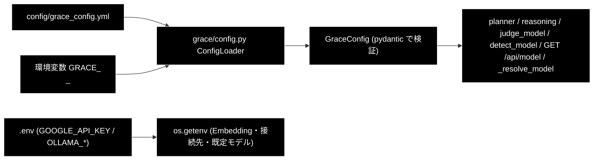

# 設定・モデル・プロバイダの解決経路 ドキュメント

**Version 1.0** | 最終更新: 2026-09-16

> **本書の位置づけ**: 「**どのモデルが、どこで決まるのか**」を backend 視点で 1 枚にする。
> 既定モデルを変える・モデルセレクタの挙動を確認する・プロバイダを取り違えていないか
> 検証するときに読む。恒久ルールの正本は `CLAUDE.md` §3。

> **関連ドキュメント**
> - [`install_and_setup.md`](./install_and_setup.md) — `ollama serve` / `.env` / 起動手順
> - [`pitfalls.md`](./pitfalls.md) — Ollama 固有の落とし穴
> - [`api_contract.md` §1.5](./api_contract.md) — `GET /api/models` / `GET /api/model`

---

## 目次

- [1. プロバイダ方針（恒久ルール）](#1-プロバイダ方針恒久ルール)
- [2. モデル名の解決経路](#2-モデル名の解決経路)
- [3. ジョブごとのモデル指定（モデルセレクタ）](#3-ジョブごとのモデル指定モデルセレクタ)
- [4. backend の各所が使うモデル](#4-backend-の各所が使うモデル)
- [5. API キーと前提チェック](#5-api-キーと前提チェック)
- [6. 設定の読み込み順](#6-設定の読み込み順)
- [7. 既定モデルを変えるときの手順](#7-既定モデルを変えるときの手順)
- [8. 変更履歴](#8-変更履歴)

---

## 1. プロバイダ方針（恒久ルール）

| 用途 | プロバイダ | 既定 | API キー |
|---|---|---|---|
| **Embedding（検索）のみ** | **Gemini** | `gemini-embedding-001`（3072 次元） | `GOOGLE_API_KEY` |
| **それ以外の全 LLM 用途** | **ローカル LLM（Ollama）** | `config.py::get_default_ollama_model()`（現在 `gemma4:12b-mlx`） | **不要** |

- **LLM 用途**: Plan / Execute / Reasoning / Confidence / Replan / ReAct、意図分類・
  情報なし判定・違反検出、Q/A 生成、チャンク化
- **Embedding 用途**: Qdrant への登録と検索クエリのベクトル化

> ⚠️ **Embedding を Ollama にしない。** `RegisterParams.provider` の既定 `"gemini"` は
> **正しい**。`nomic-embed-text`（768 次元）へ変えると既存 Qdrant コレクション
> （3072 次元）の**再作成＋全件再登録**が必要になる。
>
> ⚠️ **`ANTHROPIC_API_KEY` は不要。** Anthropic 経路は `provider="anthropic"` を
> 明示したときだけ動く後方互換として残してある（姉妹リポジトリ `grace_v2` との A/B 用）。

---

## 2. モデル名の解決経路

**経路は 2 本ある。1 箇所だけ直すと取り残しが出る。**

| # | 経路 | 実体 | 誰が読むか |
|---|---|---|---|
| 1 | **設定ファイル（正）** | `config/grace_config.yml` の `llm.model` / `llm.light_model` | `grace/config.py` 経由で planner / reasoning / groundedness / ReAct、`GET /api/model`、データジョブの既定 |
| 2 | モジュール定数 | `backend/app/core/verticals.py::INTENT_MODEL`（= `get_default_ollama_model()` を **import 時に畳み込んだ値**） | 判定系のフォールバックのみ |

`config.py::get_default_ollama_model()` は環境変数 `OLLAMA_DEFAULT_MODEL`（無ければ
固定文字列）を返す関数で、**yml を見ない**。`ModelConfig.DEFAULT_MODEL` /
`OllamaConfig.DEFAULT_MODEL` はこの関数を参照するだけなので、実質この 1 本にまとまっている。

### 経路 1 を正にする 3 つの解決関数

**新しいコードはこの 3 つを使う。定数を直接参照しない。**

```python
# backend/app/core/gates.py — 軽量モデル（意図分類・情報なし判定）
def judge_model(config) -> str:
    llm = getattr(config, "llm", None)
    return getattr(llm, "light_model", None) or INTENT_MODEL

# backend/app/core/review_gates.py — 本モデル（③ Detect の第2段）
def detect_model(config) -> str: ...

# backend/app/core/data_jobs.py — データ準備ジョブの既定
def _resolve_model(explicit: Optional[str]) -> str:
    # フォーム指定 → get_config().llm.model → get_default_ollama_model()
```

> **これは机上の懸念ではない。**
> - 実測 2026-08-17 02:12: planner / 検証器が `gemma4-e4b-ctx8k` で動いているのに、
>   判定系のログだけ `gemma4:e4b` を表示していた。派生元は `num_ctx` が 4096 で、
>   8192 へ広げた派生モデルとは**別物**である。判定系のプロンプトは回答本文を丸ごと
>   含むため、ここが 4096 だと枠を使い切って**空応答**になりうる。
> - `_resolve_model()` が無かった頃は、`.env` の `OLLAMA_DEFAULT_MODEL` と
>   `grace_config.yml` の `llm.model` が食い違うと「**ヘッダーは A・実行は B**」になり、
>   チャンク化が 404 を 3 回リトライしてフォールバック分割へ落ちるため、
>   **止まらずにゴミを作り続けた**（実測: 1,229 ブロックで 404 が 3,687 回）。

---

## 3. ジョブごとのモデル指定（モデルセレクタ）

本リポジトリは**画面からモデルを選べる**（姉妹リポジトリ `grace_v2` には無い機能）。

```
GET /api/models   → 選択肢（id / supports_tool_calls / notes）
POST /api/support/query { "model": "gemma4:26b-mlx", ... }
GET /api/model    → 現在の既定（解決済み）
```

| 層 | 役割 |
|---|---|
| `config.py::get_selectable_ollama_models()` | **選択肢の正本**。Anthropic 系（`NON_SELECTABLE_MODELS`）と **tool calling 非対応**を除外する |
| `schemas.py::_validate_model_choice` | リクエスト受付時に検証（一覧に無ければ **422**） |
| `JobParams.model` / `ReviewParams.model` / データ準備の各 params | ジョブ単位で持ち回る |
| `_resolve_model()`（データ準備）/ 各コア | 未指定なら**経路 1 の既定**へ倒す |

> ⚠️ **tool calling 非対応モデルを選ばせない。** ReAct（`rag_search` / `web_search` /
> `reasoning`）は `tool_calls` 形式の応答を前提にしており、非対応モデルでは
> **ツールが一切発火しない、または無応答になる**。`OllamaConfig.supports_tool_calls()`
> がこの判定を持つ。
>
> ⚠️ **params の既定値を dataclass のデフォルトで評価しない。** `model: Optional[str] = None`
> のまま持ち回り、**`_resolve_model()` の 1 箇所**で解決する（[`pitfalls.md`](./pitfalls.md)）。

---

## 4. backend の各所が使うモデル

| 使う場所 | 解決 | 既定 |
|---|---|---|
| planner / executor / reasoning / groundedness（`grace/`） | 経路 1 | `llm.model` |
| 意図分類・情報なし判定（`gates.py`） | `judge_model()` | `llm.light_model` |
| 言及分類・空疎判定（`review_gates.py`） | `judge_model()` | 同上 |
| ③ Detect 第2段（`review_gates.py`） | `detect_model()` | `llm.model` |
| チャンク化・Q/A 生成（`data_jobs.py`） | `_resolve_model()` | フォーム指定 → `llm.model` → `get_default_ollama_model()` |
| Qdrant 登録の Embedding（`RegisterParams.provider`） | リクエスト既定 | `gemini` |
| 画面ヘッダー（`GET /api/model`） | `get_config().llm` | 同上 |

---

## 5. API キーと前提チェック

`.env`（リポジトリルート）を `main.py` が `load_dotenv()` で読む（未導入でも起動は続行）。

| 変数 | 必須 | 用途 |
|---|---|---|
| `GOOGLE_API_KEY` | **必須** | Embedding（検索・登録） |
| `OLLAMA_BASE_URL` | 任意 | 既定 `http://localhost:11434/v1` |
| `OLLAMA_DEFAULT_MODEL` | 任意 | `get_default_ollama_model()` のフォールバックを上書き |
| `SERPAPI_KEY` | 任意 | ⑤ Web フォールバック |
| `QDRANT_URL` | 任意 | 既定 `http://localhost:6333` |

### LLM の前提はキーではなく「サーバとモデル」

クラウド API の「キーが無い」に相当するのが、ローカルでは次の 2 つである。
どちらも **LLM ループへ入る前に**チェックしてエラーイベントで返す。

| 前提 | 判定 | 失敗時 |
|---|---|---|
| Ollama が起動しているか | `services.data_pipeline_service.ollama_unreachable_message()` | 起動方法を含むメッセージを出してジョブを `failed` に |
| モデルが pull 済みか | `services.data_pipeline_service.model_not_pulled_message()` | **pull 済み一覧を添えて**返す（`gemma4:e4b` と `gemma4:e4b-mlx` のような 1 語違いが実際の事故） |

`GET /api/health` が返すのは `google_api_key` の有無だけである（LLM 用のキーは存在しない）。

---

## 6. 設定の読み込み順



- 環境変数の接頭辞は `GRACE_`。**セクション名は先頭 1 語のみ**なので、
  `GRACE_WEB_SEARCH_*` は効かない（yml で直す）。
- **`GOOGLE_API_KEY` は yml に書かない。** `.env` / 環境変数を使う。

> ⚠️ トップレベルの **`config.py`（モジュール）** と **`config/`（ディレクトリ）** は別物。

---

## 7. 既定モデルを変えるときの手順

1. **`ollama pull <モデル名>` を先に済ませる**（未取得のまま起動すると実行時 404。
   モデル名が間違っているわけではない）
2. `config/grace_config.yml` の `llm.model` / `llm.light_model` を変える（**経路 1 が正**）
3. プロジェクト全体の既定も変えるなら `config.py::get_default_ollama_model()` の
   **フォールバック文字列 1 箇所**を書き換える
4. そのモデルが `ModelConfig.AVAILABLE_MODELS` にあり、`OllamaConfig.MODEL_CONSTRAINTS` に
   **tool calling 対応**が登録されているか確認する（無いとセレクタに出ない）
5. `GET /api/model` と `GET /api/models` を叩いて、**画面表示と実挙動が一致する**ことを確認する
6. `judge_model()` / `detect_model()` / `_resolve_model()` を経由しない直接参照を
   新たに書いていないか grep する

---

## 8. 変更履歴

| Version | 日付 | 変更内容 |
|---|---|---|
| 1.0 | 2026-09-16 | 新規作成。2 本の解決経路・3 つの解決関数・モデルセレクタ・ローカル LLM の前提チェックを実装から整理した |
