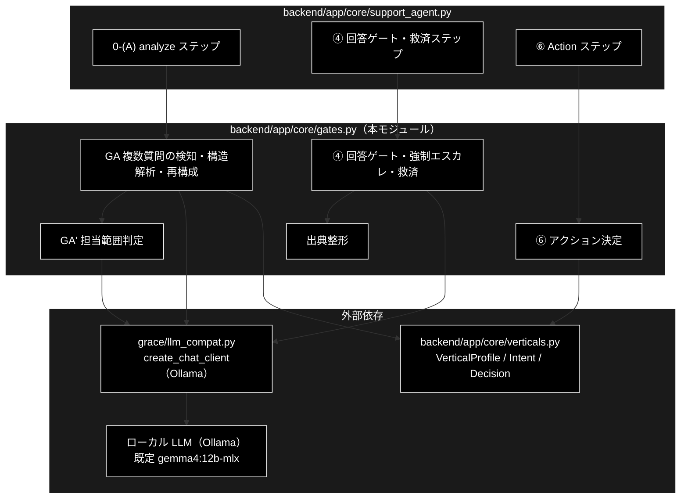
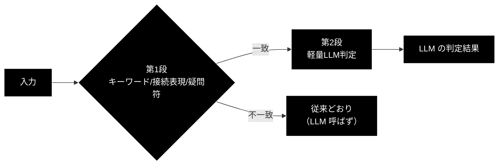
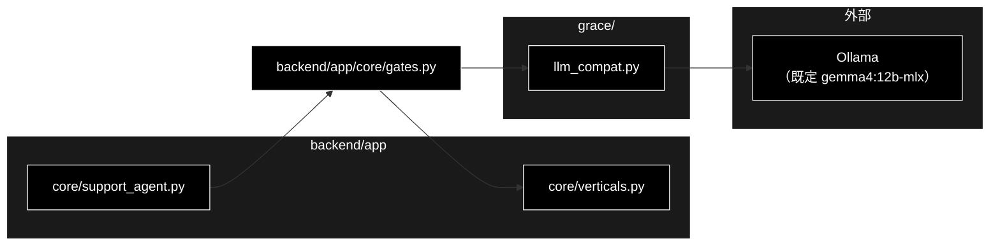

# core/gates.py - 回答ゲート・複数質問分析・担当範囲判定 ドキュメント

**Version 2.0** | 最終更新: 2026-09-03

---

## 目次

1. [概要](#概要)
   - [主な責務](#主な責務)
   - [各責務対応のモジュール](#各責務対応のモジュール)
   - [主要機能一覧](#主要機能一覧)
2. [アーキテクチャ構成図](#1-アーキテクチャ構成図)
3. [モジュール構成図](#2-モジュール構成図)
4. [クラス・関数一覧表](#3-クラス関数一覧表)
5. [クラス・関数 IPO詳細](#4-クラス関数-ipo詳細)
   - [4.1 判定系モデル解決・スイッチ](#41-判定系モデル解決スイッチ)
   - [4.2 意図分類（二段判定・第2段）](#42-意図分類二段判定第2段)
   - [4.3 情報なし回答検知（④・二段判定）](#43-情報なし回答検知④二段判定)
   - [4.4 強制エスカレ（④・二段判定）](#44-強制エスカレ④二段判定)
   - [4.5 回答ゲート・救済（④）](#45-回答ゲート救済④)
   - [4.6 アクション決定（⑥）](#46-アクション決定⑥)
   - [4.7 出典整形](#47-出典整形)
   - [4.8 複数質問クエリの検知・構造解析・再構成（0-(A) GA）](#48-複数質問クエリの検知構造解析再構成0-a-ga)
   - [4.9 担当範囲判定（0-(A) GA'）](#49-担当範囲判定0-a-ga)
   - [4.10 出典整合・担当範囲外の断り担保](#410-出典整合担当範囲外の断り担保)
6. [設定・定数](#5-設定定数)
7. [使用例](#6-使用例)
8. [エクスポート](#7-エクスポート)
9. [変更履歴](#8-変更履歴)
10. [付録: 依存関係図](#付録-依存関係図)

---

## 概要

`backend/app/core/gates.py`（1498行）は、GRACE-Support の**判定ロジックを集めた副作用のない
純関数群**である。`agent_support_example.py`（CLI）から移設したもので、判定結果が CLI 版と
同一になるようロジックは一切変更していない（後方互換のため `agent_support_example` が
再エクスポートする）。

⚠️ **本モジュールが直接呼ぶ LLM はローカル LLM（Ollama）である。** `grace/llm_compat.py`
の `create_chat_client(config)` を経由し、モデル名は `judge_model(config)` が解決する
（既定 `gemma4:12b-mlx`。`config.py::get_default_ollama_model()` 参照）。Anthropic /
OpenAI / Gemini を LLM 用途として呼ぶ経路は無い（Gemini は Embedding 専用）。

大半が二段判定（第 1 段=キーワード／接続表現／疑問符などの**候補検出**、第 2 段=軽量
LLM 判定）で構成される。ローカル LLM は 1 判定に 90〜250 秒かかるため、`judges.enabled`
（既定 `false`）で補助 LLM 判定を丸ごと止められる。**例外は複数質問の構造解析
（GA・GA'）で、専用フラグ `judges.multi_question`（既定 `true`）を見る**（§5参照）。
LLM 判定に失敗した場合は常に安全側へ倒すが、**「安全側」の向きは 2 通りある**（§概要の
表を参照）。

### 主な責務

- 支持率・出典数からの回答可否判定（`_answer_gate`）
- 強制エスカレの二段判定（`_should_force_escalate` ＋ 意図分類器）
- 「情報なし回答」の二段判定（`_detect_no_info_answer` ＋ 実質回答判定器）
- 出典付き・矛盾なし内部回答／検証器障害時の回答の救済（`_should_rescue_unaffirmed` /
  `_should_rescue_unverified`）
- アクション種別の決定（`_decide_action`）
- 出典の収集・整形・重複排除（`_collect_citations` 他）
- 複数質問クエリの検知・構造解析・再構成（0-(A) GA・`looks_like_multi_question` 他）
- 主質問の担当範囲判定・担当範囲外の断り担保（0-(A) GA'・`create_scope_classifier` 他）

### 各責務対応のモジュール

| # | 責務 | 対応関数・定数 | 説明 |
|---|------|--------------|------|
| 1 | 回答可否判定 | `_answer_gate` / `_pick_groundedness` | 支持率・出典数の閾値判定 |
| 2 | 強制エスカレ | `_should_force_escalate` / `create_intent_classifier` | キーワード＋intent の二段判定 |
| 3 | 情報なし検知 | `_detect_no_info_answer` / `create_no_info_judge` | マーカー＋LLM の二段判定 |
| 4 | 回答の救済 | `_should_rescue_unaffirmed` / `_should_rescue_unverified` | escalate からの生還条件 |
| 5 | アクション決定 | `_decide_action` | キーワード＋intent でアクション種別を決定 |
| 6 | 出典の収集・整形 | `_collect_citations` 他 7 関数 | 表示・検証それぞれの用途に整形 |
| 7 | 複数質問の検知・構造解析・再構成 | `looks_like_multi_question` 〜 `deferred_main_questions` | 0-(A) 前半（GA） |
| 8 | 担当範囲判定 | `create_scope_classifier` 〜 `split_by_scope` | 0-(A) 後半（GA'） |

### 主要機能一覧

| 機能 | 説明 |
|------|------|
| `judge_model()` / `judges_enabled()` / `multi_question_enabled()` | 判定系の設定解決 |
| `create_intent_classifier()` | 意図分類器（question/request/incident） |
| `create_no_info_judge()` / `_detect_no_info_answer()` | 「情報なし回答」の二段判定 |
| `_should_force_escalate()` | 強制エスカレの二段判定 |
| `_answer_gate()` | 支持率・出典数からの回答可否判定 |
| `_should_rescue_unaffirmed()` / `_should_rescue_unverified()` | escalate からの救済 |
| `_decide_action()` | アクション種別の決定 |
| `looks_like_multi_question()` / `create_question_analyzer()` / `analyze_questions()` | 複数質問の検知・構造解析＋担当範囲（1回のLLM呼び出し） |
| `reconstruct_query()` / `fallback_reconstruct()` | 採用クラスタの1文再構成 |
| `deferred_main_questions()` | 保留した主質問の列挙（必ず提示） |
| `create_scope_classifier()` / `split_by_scope()` | 担当範囲の判定・分割 |
| `ensure_out_of_scope_notice()` / `_append_missing_links()` | 担当範囲外の断り・案内URLの担保 |

---

## 1. アーキテクチャ構成図



### 1.1 二段判定の型（本モジュール共通の設計）



**安全側の向きは判定器によって異なる**:

| 判定器 | 判定できない/失敗したとき |
|---|---|
| `_should_force_escalate` / `_detect_no_info_answer` | **escalate**（答えない方が安全） |
| **複数質問の構造解析（GA）** / **担当範囲判定（GA'）** | **「単一質問」「全件範囲内」**（＝現行動作を維持。誤って分解・除外する方が害が大きい） |

---

## 2. モジュール構成図

### 2.1 内部モジュール構成（テーマ別グルーピング）

```mermaid
flowchart TB
    subgraph CONFIG["判定系の設定解決"]
        JM["judge_model()"]
        JE["judges_enabled()"]
        MQE["multi_question_enabled()"]
    end

    subgraph GATE4["④ 回答ゲート系"]
        AG["_answer_gate()"]
        PG["_pick_groundedness()"]
        RU1["_should_rescue_unaffirmed()"]
        RU2["_should_rescue_unverified()"]
        FE["_should_force_escalate()"]
        IC["create_intent_classifier()"]
    end

    subgraph GATE4P["④' 情報なし検知系"]
        NIJ["create_no_info_judge()"]
        DNI["_detect_no_info_answer()"]
    end

    subgraph GATE6["⑥ アクション系"]
        DA["_decide_action()"]
    end

    subgraph CITE["出典整形系（7関数）"]
        CC["_collect_citations() 他"]
    end

    subgraph GA_["0-(A) GA: 検知・構造解析・再構成"]
        LMQ["looks_like_multi_question()"]
        CQA["create_question_analyzer()"]
        AQ["analyze_questions()"]
        RQ["reconstruct_query()"]
        DMQ["deferred_main_questions()"]
    end

    subgraph GAP_["0-(A) GA': 担当範囲判定"]
        CSC["create_scope_classifier()"]
        SBS["split_by_scope()"]
        SCF["scope_classifier_for()"]
    end

    subgraph NOTICE["担当範囲外の断り担保"]
        EOSN["ensure_out_of_scope_notice()"]
        AML["_append_missing_links()"]
    end

    JM --> IC
    JM --> NIJ
    JM --> CQA
    JM --> CSC
    JE --> IC
    JE --> NIJ
    MQE --> RQ
    MQE --> CSC
    FE --> IC
    AG --> PG
    DNI --> NIJ
    AQ --> CQA
    AQ --> LMQ
    RQ --> AQ
    SBS --> SCF
classDef default fill:#000,stroke:#fff,color:#fff
classDef subgraphStyle fill:#1a1a1a,stroke:#fff,color:#fff
class JM,JE,MQE,AG,PG,RU1,RU2,FE,IC,NIJ,DNI,DA,CC,LMQ,CQA,AQ,RQ,DMQ,CSC,SBS,SCF,EOSN,AML default
style CONFIG fill:#1a1a1a,stroke:#fff,color:#fff
style GATE4 fill:#1a1a1a,stroke:#fff,color:#fff
style GATE4P fill:#1a1a1a,stroke:#fff,color:#fff
style GATE6 fill:#1a1a1a,stroke:#fff,color:#fff
style CITE fill:#1a1a1a,stroke:#fff,color:#fff
style GA_ fill:#1a1a1a,stroke:#fff,color:#fff
style GAP_ fill:#1a1a1a,stroke:#fff,color:#fff
style NOTICE fill:#1a1a1a,stroke:#fff,color:#fff
```



### 2.2 外部依存関係

| ライブラリ | 用途 |
|-----------|------|
| `re`（標準） | 担当範囲ラベル（`IN:`/`OUT:`）の解析 |
| `grace.llm_compat.create_chat_client` | Ollama チャットクライアント生成（判定・構造解析・再構成で使用） |

### 2.3 内部依存モジュール

| モジュール | 用途 |
|-----------|------|
| `backend.app.core.verticals` | `VerticalProfile` / `Decision` / `Intent` / `ActionRequest` / `INTENT_MODEL` / `JUDGE_MAX_OUTPUT_TOKENS` / `MULTI_QUESTION_MAX_OUTPUT_TOKENS` |
| `config.get_default_ollama_model` | `verticals.py` 経由で `INTENT_MODEL` の既定値に使われる |

### 2.4 呼び出し元（`backend/app/core/support_agent.py`）

`support_agent.py` は本モジュールから 29 個のシンボルを import する（`create_cluster_analyzer` /
`detect_question_clusters` は import されない — §3.2 参照）。

| ステップ | 呼び出す主な関数 |
|---|---|
| `analyze`（0-(A)） | `looks_like_multi_question` → `create_question_analyzer` → `analyze_questions` → `scope_classifier_for` / `create_scope_classifier` → `split_by_scope` → `reconstruct_query` → `deferred_main_questions` |
| `gate`（④） | `_answer_gate` / `_pick_groundedness` / `_should_force_escalate` / `create_intent_classifier` / `_should_rescue_unaffirmed` / `_should_rescue_unverified` |
| `no_info`（④'） | `_detect_no_info_answer` / `create_no_info_judge` / `JUDGE_DISABLED` |
| `action`（⑥） | `_decide_action` |
| 出典整形 | `_collect_citations` / `_collect_source_texts` / `_merge_citations` / `_web_citations` / `_web_source_texts` / `_citation_text` / `_contradicted_claims` |
| 回答本文の後処理 | `answer_cites_sources` / `ensure_out_of_scope_notice` |

---

## 3. クラス・関数一覧表

### 3.1 クラス一覧

#### QuestionAnalysis（`NamedTuple`・:799）

0-(A) 第 2 段の結果。`clusters: Optional[List[Tuple[str, List[str]]]]`（分解結果。単一・
判定不能なら None）、`verdicts: Optional[List[bool]]`（主質問ごとの担当範囲内判定。
未判定・怪しいときは None）。

### 3.2 関数一覧（カテゴリ別）

#### 判定系の設定解決

| 関数名 | 概要 |
|-------|------|
| `judge_model(config)` | 判定系（意図分類・情報なし判定・0-(A)）が使うモデル名を解決 |
| `judges_enabled(config)` | 補助 LLM 判定（意図分類・情報なし判定）を呼んでよいか |
| `multi_question_enabled(config)` | 複数質問の構造解析を呼んでよいか（`judges_enabled` とは独立） |

#### 意図分類（二段判定・第2段、④/⑥共用）

| 関数名 | 概要 |
|-------|------|
| `create_intent_classifier(config)` | 意図分類器（question/request/incident）を返す |
| `_match_keyword(query, keywords)` | キーワード候補の部分一致（第1段の共通実装） |

#### 情報なし回答検知（④'・二段判定）

| 関数名 | 概要 |
|-------|------|
| `create_no_info_judge(config, on_failure=None)` | 「情報なし回答」のLLM判定器を返す |
| `_detect_no_info_answer(query, answer, judge=None, force_judge=False)` | 二段判定の実行 |
| `_abbreviate_reason(text, limit=120)` | 判定失敗理由をログ1行に縮める |

#### 強制エスカレ（④・二段判定）

| 関数名 | 概要 |
|-------|------|
| `_should_force_escalate(query, profile, classify=None)` | エスカレ語＋intentの二段判定 |

#### 回答ゲート・救済（④）

| 関数名 | 概要 |
|-------|------|
| `_answer_gate(support_rate, verified, citation_count, notify_th, confirm_th)` | 支持率・出典数からの回答可否判定 |
| `_pick_groundedness(*results)` | 複数のGroundednessResultから最良の(支持率, 判定数)を選ぶ |
| `_should_rescue_unaffirmed(...)` | 出典付き・矛盾なし内部回答の救済判定 |
| `_should_rescue_unverified(...)` | 検証器障害時の救済判定 |

#### アクション決定（⑥）

| 関数名 | 概要 |
|-------|------|
| `_decide_action(query, decision, profile=None, classify=None)` | アクション種別の二段判定 |

#### 出典整形（7関数）

| 関数名 | 概要 |
|-------|------|
| `_collect_citations(step_results)` | 表示用の出典リスト（`[社内]`/`[Web]` ラベル付き） |
| `_contradicted_claims(gres, limit=5, max_chars=160)` | 矛盾と判定された主張の本文を抽出 |
| `_collect_source_texts(step_results)` | groundedness検証用の出典本文を集約 |
| `_citation_text(citation)` | 出典表示文字列からラベルを外す |
| `_merge_citations(internal, web)` | 内部出典とWeb出典を重複なく結合 |
| `_web_citations(web_output)` | Web検索結果から出典表示文字列を作る |
| `_web_source_texts(web_output)` | Web検索結果の本文をgroundedness検証用に抽出 |

#### 複数質問の検知・構造解析・再構成（0-(A) GA）

| 関数名 | 概要 |
|-------|------|
| `_count_question_marks(query)` | 全角・半角の疑問符を数える |
| `looks_like_multi_question(query)` | 第1段: 複数質問の候補か（LLM呼び出しゼロ） |
| `_is_explicit_single(text)` | モデルが「単一質問」と明示したか |
| `_char_bigrams(text)` | 空白除去した文字2-gramの集合 |
| `_derives_from_query(line, query)` | 行が元の問い合わせに由来するか（散文の混入防止） |
| `_parse_cluster_output(text, query)` | 第2段LLM出力を `[(main, [related...]), ...]` へ解析 |
| `_split_scope_prefix(text)` | `IN:`/`OUT:` ラベル付き出力をラベルなし本文と判定へ分離 |
| `create_question_analyzer(config, profile=None)` | 構造解析＋担当範囲判定を1回のLLM呼び出しで行う解析器 |
| `create_cluster_analyzer(config)` | `create_question_analyzer` の薄い別名（構造解析のみ・テスト用） |
| `detect_question_clusters(query, analyzer=None)` | 複数質問の二段判定（構造解析のみ・テスト用） |
| `analyze_questions(query, analyzer=None)` | 複数質問の二段判定（構造解析＋担当範囲・**本線**） |
| `fallback_reconstruct(main, related)` | 再構成の素朴なフォールバック（LLM不要・単純連結） |
| `reconstruct_query(main, related, config=None)` | 採用クラスタを自然言語の1文へ再構成 |
| `deferred_main_questions(clusters, adopted_index)` | 採用しなかったクラスタの主質問を列挙 |

#### 担当範囲判定（0-(A) GA'）

| 関数名 | 概要 |
|-------|------|
| `_parse_scope_output(text, count)` | スコープ判定のLLM出力を `[範囲内か, ...]` へ解析 |
| `create_scope_classifier(config, profile=None)` | 主質問が担当範囲内かを判定する分類器を返す |
| `scope_classifier_for(analysis, fallback)` | `split_by_scope` へ渡す分類器を選ぶ（1回で済めば追加LLM呼び出しを省略） |
| `split_by_scope(clusters, classify=None)` | クラスタを担当範囲内/外の添字へ分ける |

#### 出典整合・担当範囲外の断り担保

| 関数名 | 概要 |
|-------|------|
| `answer_cites_sources(answer, citations)` | 回答本文が出典に触れているか（観測用・ゲートではない） |
| `_append_missing_links(answer, links)` | モデルが自分で断ったが案内URLを書かなかった場合に補う |
| `ensure_out_of_scope_notice(answer, questions, guidance="", links=None)` | 担当範囲外への断りが本文に無ければ追記する |

---

## 4. クラス・関数 IPO詳細

### 4.1 判定系モデル解決・スイッチ

#### `judge_model`

**概要**: 判定系（意図分類・情報なし判定・0-(A) 構造解析）が使うモデル名を解決する。
**`INTENT_MODEL` を直接使ってはいけない** — それは `config.py::get_default_ollama_model()`
を import 時に畳み込んだ定数で `config/grace_config.yml` を見ないため、planner/executor
が読む `llm.light_model`（yml 経由）と解決経路が食い違いうる。設定（yml）を正とし、
config から解決できないときだけ `INTENT_MODEL` へフォールバックする。

```python
def judge_model(config) -> str
```

| パラメータ | 型 | デフォルト | 説明 |
|------------|------|-----------|------|
| `config` | Any | - | `config.llm.light_model` を参照するオブジェクト |

| 項目 | 内容 |
|------|------|
| **Input** | `config: Any` |
| **Process** | 1. `config.llm.light_model` を取得<br>2. 無ければ `INTENT_MODEL`（`get_default_ollama_model()`）にフォールバック |
| **Output** | `str`: モデル名 |

**戻り値例**: `"gemma4:12b-mlx"`

```python
# 使用例
model_name = judge_model(get_config())
```

#### `judges_enabled`

**概要**: 補助 LLM 判定（意図分類・情報なし判定）を呼んでよいか（`judges.enabled`）。
無効時は各判定器が LLM を呼ばずに `None` を返し、呼び出し側は安全側（キーワード判定）
へ倒す。config スタブに `judges` が無ければ「有効」とみなす（既存テストの挙動を変えない）。

```python
def judges_enabled(config) -> bool
```

| パラメータ | 型 | デフォルト | 説明 |
|------------|------|-----------|------|
| `config` | Any | - | `config.judges.enabled` を参照するオブジェクト |

| 項目 | 内容 |
|------|------|
| **Input** | `config: Any` |
| **Process** | `config.judges` が無ければ True。あれば `judges.enabled`（既定 True） |
| **Output** | `bool` |

**戻り値例**: `False`（本リポジトリの既定値 — `config/grace_config.yml` の `judges.enabled: false`）

```python
# 使用例
if not judges_enabled(config):
    return lambda _query: None  # LLM を呼ばず None
```

#### `multi_question_enabled`

**概要**: 複数質問の構造解析（0-(A)）を呼んでよいか（`judges.multi_question`）。
**`judges_enabled` とは独立の専用フラグ。** 他の補助判定はキーワード判定という
同等の代替に倒れるが、複数質問の構造解析には代替が無く、切ると複数質問クエリの
片方が**無言で落ちたまま高信頼として提示される**（`docs/multi_question_handling.md`
が最も危険とした事故）。そのためローカル LLM の既定（`judges.enabled=false`）でも
こちらは有効（既定 `true`）。

```python
def multi_question_enabled(config) -> bool
```

| パラメータ | 型 | デフォルト | 説明 |
|------------|------|-----------|------|
| `config` | Any | - | `config.judges.multi_question` を参照するオブジェクト |

| 項目 | 内容 |
|------|------|
| **Input** | `config: Any` |
| **Process** | `config.judges` が無ければ True。あれば `judges.multi_question`（既定 True） |
| **Output** | `bool` |

**戻り値例**: `True`（本リポジトリの既定値）

```python
# 使用例
if config is None or not multi_question_enabled(config):
    return fallback_reconstruct(main, parts)
```

---

### 4.2 意図分類（二段判定・第2段）

#### `create_intent_classifier`

**概要**: 問い合わせ意図の LLM 分類器（二段判定の第2段）を返す。`question`（FAQ質問）/
`request`（操作依頼）/ `incident`（障害・被害報告）のいずれかへ分類する。分類できない
場合（API エラー・想定外の出力）は `None` を返し、呼び出し側は安全側（従来のキーワード
判定どおり）に倒す。`judges_enabled(config)` が false なら LLM を呼ばず常に `None`。

```python
def create_intent_classifier(config) -> Callable[[str], Optional[Intent]]
```

| パラメータ | 型 | デフォルト | 説明 |
|------------|------|-----------|------|
| `config` | Any | - | `judges_enabled` / `judge_model` / `create_chat_client` へ渡す設定 |

| 項目 | 内容 |
|------|------|
| **Input** | `config: Any` |
| **Process** | 1. `judges_enabled(config)` が False なら `lambda _query: None` を返す<br>2. Ollama チャットクライアントを生成<br>3. `classify(query)` を返す。プロンプトで question/request/incident の1語分類を要求し、`temperature=0.0` で呼び出し、応答に含まれるラベルを抽出。例外・想定外出力は None |
| **Output** | `Callable[[str], Optional[Intent]]`: 分類関数 |

**戻り値例**: `classify("課金プランの違いを教えて")` → `"question"`

```python
# 使用例
classify = create_intent_classifier(config)
intent = classify("返品したい")   # "request"
```

#### `_match_keyword`

**概要**: キーワード候補の部分一致（本モジュール共通の第1段実装）。最初に一致した語を返す。

```python
def _match_keyword(query: str, keywords) -> Optional[str]
```

| 項目 | 内容 |
|------|------|
| **Input** | `query: str`, `keywords: Iterable[str]` |
| **Process** | `keywords` を順に走査し `keyword in query` が真になった最初の語を返す |
| **Output** | `Optional[str]`: 一致した語。無ければ None |

```python
# 使用例
matched = _match_keyword("返品したい", profile.action_map)  # "返品"
```

---

### 4.3 情報なし回答検知（④'・二段判定）

#### `create_no_info_judge`

**概要**: 「情報なし回答」の LLM 判定器（二段判定の第2段）を返す。回答が質問の中心的な
事柄に実質的に答えていれば `False`（answered）、「見つからない・お問い合わせください」に
留まるなら `True`（no_info）。判定できない場合は `None`（安全側=escalate へ）。
`judges_enabled(config)` が false なら LLM を呼ばず常に `None`（マーカー一致のみで判定）。

⚠️ **このゲートが見るのは「実質的な内容があるか」だけ。** 不確実性の有無は判定材料
ではない（天気予報のような「予測＋確定でない旨の注記」は、予測の中身を示していれば
answered）。

```python
def create_no_info_judge(
    config,
    on_failure: Optional[Callable[[str, str], None]] = None
) -> Callable[[str, str], Optional[bool]]
```

| パラメータ | 型 | デフォルト | 説明 |
|------------|------|-----------|------|
| `config` | Any | - | 判定器の設定 |
| `on_failure` | Optional[Callable[[str, str], None]] | None | 判定できなかった理由 `(kind, detail)` を受けるコールバック。`kind` は `JUDGE_DISABLED` / `JUDGE_UNEXPECTED_OUTPUT` / `JUDGE_EXCEPTION`。None なら stderr へ出力 |

| 項目 | 内容 |
|------|------|
| **Input** | `config: Any`, `on_failure: Optional[Callable] = None` |
| **Process** | 1. `judges_enabled` が False なら「無効」を `on_failure` へ通知しつつ常に None を返す判定器を返す<br>2. Ollama チャットクライアント生成<br>3. `judge(query, answer)` を返す。判定プロンプトで answered/no_info の1語出力を要求し、`no_info` を含めば True、`answered` を含めば False<br>4. 想定外出力・例外は `on_failure` へ理由を通知して None |
| **Output** | `Callable[[str, str], Optional[bool]]`: 判定関数 |

**戻り値例**: `judge("送料はいくら？", "一般的な料金の目安は…")` → `False`（answered）

```python
# 使用例
judge = create_no_info_judge(config, on_failure=lambda k, d: log(d, step="no_info"))
no_info = judge(query, answer)
```

#### `_detect_no_info_answer`

**概要**: 「情報なし回答」の二段判定本体。第1段は `NO_INFO_MARKERS` の部分一致。
不一致（かつ `force_judge` でない）なら LLM を呼ばず `(False, None)`。`force_judge=True`
（出典が Web のみ＝社内根拠ゼロの回答）の場合は、候補句が一致しなくても第2段の判定を
必ず実施する。

⚠️ **`force_judge` は「判定せよ」というトリガであって判定結果ではない。** 判定が
得られず（`None`）候補句も無ければ escalate しない（`force_judge` を足した設計意図
からの逸脱を防ぐ）。候補句が一致している場合は従来どおり判定不能を escalate に倒す。

```python
def _detect_no_info_answer(
    query: str,
    answer: str,
    judge: Optional[Callable[[str, str], Optional[bool]]] = None,
    force_judge: bool = False
) -> tuple[bool, Optional[str]]
```

| パラメータ | 型 | デフォルト | 説明 |
|------------|------|-----------|------|
| `query` | str | - | 元の質問 |
| `answer` | str | - | 生成された回答本文 |
| `judge` | Optional[Callable] | None | `create_no_info_judge` が返す判定関数 |
| `force_judge` | bool | False | 出典が Web のみのとき True |

| 項目 | 内容 |
|------|------|
| **Input** | `query: str`, `answer: str`, `judge=None`, `force_judge=False` |
| **Process** | 1. `NO_INFO_MARKERS` と部分一致するか調べる<br>2. 不一致かつ非force_judgeなら `(False, None)`<br>3. `judge` が無ければ `(False, marker)`<br>4. `judge(query, answer)` を呼ぶ<br>5. `False`（answered）なら `(False, marker)`<br>6. `None` かつマーカーも無ければ `(False, None)`（force_judgeのみで呼ばれ判定不能）<br>7. それ以外（True または マーカーありでNone）は `(True, marker)` |
| **Output** | `tuple[bool, Optional[str]]`: `(no_info, matched_marker)` |

**戻り値例**: `(True, "見当たりません")`

```python
# 使用例
no_info, marker = _detect_no_info_answer(query, answer, judge, force_judge=(citation_count == 0))
```

#### `_abbreviate_reason`

**概要**: 判定失敗の理由をログ1行に収まる長さへ縮める（空白正規化＋省略記号）。

```python
def _abbreviate_reason(text: str, limit: int = 120) -> str
```

| 項目 | 内容 |
|------|------|
| **Input** | `text: str`, `limit: int = 120` |
| **Process** | 空白で分割・再結合して圧縮し、`limit` を超えれば切り詰めて `…` を付与 |
| **Output** | `str` |

```python
# 使用例
_abbreviate_reason("応答が空でした" * 30)  # "...応答が空でした…"
```

---

### 4.4 強制エスカレ（④・二段判定）

#### `_should_force_escalate`

**概要**: 強制エスカレの二段判定。第1段は `escalate_keywords` の部分一致。第2段は
意図分類。intent が `"question"`（FAQ質問。例: SaaS「課金プランの違いを教えて」）なら
誤検知とみなして強制エスカレしない。`request`/`incident` は設計どおり有人へ倒す
（例: gov「減免を個別に判断してほしい」）。分類器が無い・分類失敗（None）の場合は
安全側＝従来どおり強制エスカレする。

```python
def _should_force_escalate(
    query: str,
    profile: Optional[VerticalProfile],
    classify: Optional[Callable[[str], Optional[Intent]]] = None
) -> tuple[bool, Optional[str], Optional[Intent]]
```

| パラメータ | 型 | デフォルト | 説明 |
|------------|------|-----------|------|
| `query` | str | - | 問い合わせ本文 |
| `profile` | Optional[VerticalProfile] | - | 業界プロファイル。None なら常に False |
| `classify` | Optional[Callable] | None | `create_intent_classifier` が返す関数 |

| 項目 | 内容 |
|------|------|
| **Input** | `query: str`, `profile: Optional[VerticalProfile]`, `classify=None` |
| **Process** | 1. `profile` が None なら `(False, None, None)`<br>2. `escalate_keywords` と部分一致を調べる<br>3. 不一致なら `(False, None, None)`<br>4. `classify(query)` を呼ぶ（無ければ None）<br>5. `intent == "question"` なら `(False, matched, intent)`<br>6. それ以外は `(True, matched, intent)` |
| **Output** | `tuple[bool, Optional[str], Optional[Intent]]`: `(forced, matched_keyword, intent)` |

**戻り値例**: `(True, "減免", "request")`

```python
# 使用例
forced, keyword, intent = _should_force_escalate(query, profile, classify)
```

---

### 4.5 回答ゲート・救済（④）

#### `_answer_gate`

**概要**: 支持率・出典数から回答可否を判定する純関数。`verified=False` または
出典 0 件なら常に escalate。支持率が `notify_th` 以上なら高信頼で answer（注記なし）、
`confirm_th` 以上 `notify_th` 未満なら中信頼で answer（未確認注記あり）、それ未満は escalate。

```python
def _answer_gate(
    support_rate: float,
    verified: bool,
    citation_count: int,
    notify_th: float,
    confirm_th: float
) -> tuple[Decision, bool]
```

| パラメータ | 型 | デフォルト | 説明 |
|------------|------|-----------|------|
| `support_rate` | float | - | `supported / (supported + contradicted)` |
| `verified` | bool | - | 検証器が判定を完了したか |
| `citation_count` | int | - | 出典件数 |
| `notify_th` | float | - | 注記なしで answer にする閾値（既定 0.7） |
| `confirm_th` | float | - | 未確認注記つき answer の下限（既定 0.4） |

| 項目 | 内容 |
|------|------|
| **Input** | `support_rate, verified, citation_count, notify_th, confirm_th` |
| **Process** | 1. `not verified or citation_count == 0` → `("escalate", False)`<br>2. `support_rate >= notify_th` → `("answer", False)`<br>3. `support_rate >= confirm_th` → `("answer", True)`<br>4. それ以外 → `("escalate", False)` |
| **Output** | `tuple[Decision, bool]`: `(decision, warning)` |

**戻り値例**: `("answer", True)`

```python
# 使用例
decision, warning = _answer_gate(0.55, True, 3, notify_th=0.7, confirm_th=0.4)
```

#### `_pick_groundedness`

**概要**: 複数の `GroundednessResult` から `(支持率, 判定できた主張数)` を選ぶ純関数。
支持率が最大の結果を採用し、同率なら `decided`（supported+contradicted）が多い方を選ぶ
（KPI 側で「支持率が低い」と「判定不能（decided=0）」を区別するため）。

```python
def _pick_groundedness(*results) -> tuple[float, int]
```

| 項目 | 内容 |
|------|------|
| **Input** | `*results: GroundednessResult`（可変長） |
| **Process** | `max((g.support_rate, g.supported + g.contradicted) for g in results)` |
| **Output** | `tuple[float, int]`: `(support_rate, decided)` |

```python
# 使用例
support_rate, decided = _pick_groundedness(internal_gres, web_gres)
```

#### `_should_rescue_unaffirmed`

**概要**: 出典付き・「情報なし」でない・矛盾なしの内部回答を escalate から救うか。
`_answer_gate` の支持率は `supported/decided` で算出されるため、根拠検証器の出力ぶれ
（全 neutral・JSON崩れ・一部だけ肯定）で良質な内部RAG回答でも escalate に倒れることが
ある。矛盾が検出されておらず、出典があり、実質回答であれば、未確認注記つきの answer
として維持する。

```python
def _should_rescue_unaffirmed(
    decision: Decision,
    forced_escalate: bool,
    has_contradiction: bool,
    citation_count: int,
    answer: str,
    query: str,
    no_info_judge: Optional[Callable[[str, str], Optional[bool]]] = None
) -> bool
```

| パラメータ | 型 | デフォルト | 説明 |
|------------|------|-----------|------|
| `decision` | Decision | - | `_answer_gate` の判定 |
| `forced_escalate` | bool | - | `_should_force_escalate` の結果 |
| `has_contradiction` | bool | - | 矛盾が検出されたか |
| `citation_count` | int | - | 出典件数 |
| `answer` | str | - | 回答本文 |
| `query` | str | - | 元の質問 |
| `no_info_judge` | Optional[Callable] | None | 実質回答判定器 |

| 項目 | 内容 |
|------|------|
| **Input** | `decision, forced_escalate, has_contradiction, citation_count, answer, query, no_info_judge=None` |
| **Process** | 1. `decision != "escalate"` または `forced_escalate` なら False<br>2. 矛盾あり／出典0／回答空 のいずれかなら False<br>3. `_detect_no_info_answer` で実質回答かを判定し、実質回答なら True |
| **Output** | `bool` |

```python
# 使用例
if _should_rescue_unaffirmed(decision, forced, has_contra, len(citations), answer, query, judge):
    decision, warning = "answer", True
```

#### `_should_rescue_unverified`

**概要**: **検証器そのものが落ちた**ときに、生成済みの回答を escalate から救うか。
`verified=False` には「検証は動いたが肯定できなかった」（escalateで正しい）と
「検証LLMが例外・タイムアウト・空応答で判定できなかった」（インフラ障害）の2種類が
混ざる。後者に限り、矛盾なし・出典あり・回答非空なら未確認注記つきで維持する。

⚠️ 「情報なし回答」の除外はここでは行わない。救済後も後段の ④' ゲート
（`_detect_no_info_answer`）を必ず通るため、そこで捕捉される。

```python
def _should_rescue_unverified(
    decision: Decision,
    verification_failed: bool,
    has_contradiction: bool,
    citation_count: int,
    answer: str
) -> bool
```

| パラメータ | 型 | デフォルト | 説明 |
|------------|------|-----------|------|
| `decision` | Decision | - | `_answer_gate` の判定 |
| `verification_failed` | bool | - | 検証器が例外・タイムアウト等で落ちたか |
| `has_contradiction` | bool | - | 矛盾が検出されたか |
| `citation_count` | int | - | 出典件数 |
| `answer` | str | - | 回答本文 |

| 項目 | 内容 |
|------|------|
| **Input** | `decision, verification_failed, has_contradiction, citation_count, answer` |
| **Process** | 1. `decision != "escalate"` または `not verification_failed` なら False<br>2. 矛盾あり／出典0／回答空 のいずれもなければ True |
| **Output** | `bool` |

```python
# 使用例
if _should_rescue_unverified(decision, gres.verification_failed, has_contra, len(citations), answer):
    decision, warning = "answer", True
```

---

### 4.6 アクション決定（⑥）

#### `_decide_action`

**概要**: 問い合わせ内容と回答判定から必要なアクションを決める（二段判定）。第1段は
キーワード一致（プロファイル指定時は `action_map`、未指定時はデモ用の既定マッピング）。
第2段は意図分類。`intent == "question"` ならアクションは起票せず回答のみとする。
`decision == "escalate"` なら常に `escalate_to_human`（承認不要・直接実行）。

```python
def _decide_action(
    query: str,
    decision: Decision,
    profile: Optional[VerticalProfile] = None,
    classify: Optional[Callable[[str], Optional[Intent]]] = None
) -> Optional[ActionRequest]
```

| パラメータ | 型 | デフォルト | 説明 |
|------------|------|-----------|------|
| `query` | str | - | 問い合わせ本文 |
| `decision` | Decision | - | `_answer_gate`（または救済後）の判定 |
| `profile` | Optional[VerticalProfile] | None | 業界プロファイル |
| `classify` | Optional[Callable] | None | 意図分類器 |

| 項目 | 内容 |
|------|------|
| **Input** | `query, decision, profile=None, classify=None` |
| **Process** | 1. `decision == "escalate"` なら `ActionRequest("escalate_to_human", ..., requires_confirmation=False)` を返す<br>2. `profile` があれば `action_map` で一致を探す。無ければ既定マッピング（解約/パスワード）<br>3. 一致が無ければ None<br>4. `classify(query) == "question"` なら None（起票しない）<br>5. それ以外は `ActionRequest` を返す |
| **Output** | `Optional[ActionRequest]` |

**戻り値例**: `ActionRequest("create_ticket", {"subject": "解約希望", "query": "..."}, requires_confirmation=True)`

```python
# 使用例
action = _decide_action(query, decision, profile, classify)
```

---

### 4.7 出典整形

#### `_collect_citations`

**概要**: 各ステップの `sources` を重複排除して表示用出典リストにする。executor が
RAG スコア不足時に web_search を動的挿入するため、URL は `[Web]`、それ以外
（社内ナレッジのファイル名等）は `[社内]` とラベル付けする。

```python
def _collect_citations(step_results) -> List[str]
```

| 項目 | 内容 |
|------|------|
| **Input** | `step_results: Iterable[ステップ結果]`（`.sources` を持つ） |
| **Process** | 各ステップの `sources` を走査し、`http(s)://` 始まりなら `[Web]`、それ以外は `[社内]` を付けて重複排除 |
| **Output** | `List[str]` |

```python
# 使用例
citations = _collect_citations(state.step_results)  # ["[社内] gov_faq.csv", "[Web] https://..."]
```

#### `_contradicted_claims`

**概要**: groundedness 結果から「矛盾」と判定された主張の本文を取り出す。件数だけでは
誤検知を切り分けられない（矛盾1件で `answer_conf` が 0.30 に cap されるため）ので、
どの主張が矛盾扱いされたかをログ・イベントに残す。

```python
def _contradicted_claims(gres, limit: int = 5, max_chars: int = 160) -> List[str]
```

| 項目 | 内容 |
|------|------|
| **Input** | `gres: GroundednessResult`, `limit: int = 5`, `max_chars: int = 160` |
| **Process** | `gres.claims` から `verdict == "contradicted"` の本文を抽出し、件数・文字数で切り詰める |
| **Output** | `List[str]` |

```python
# 使用例
contradicted = _contradicted_claims(gres)
```

#### `_collect_source_texts`

**概要**: 各ステップの `source_texts`（出典本文）を重複排除して集約する。groundedness
検証用。識別子（ファイル名）だけを渡すとどの主張も裏付けられず全 neutral になるため、
本文を集めて渡す。

```python
def _collect_source_texts(step_results) -> List[str]
```

| 項目 | 内容 |
|------|------|
| **Input** | `step_results` |
| **Process** | 各ステップの `source_texts` を重複排除して連結 |
| **Output** | `List[str]` |

#### `_citation_text`

**概要**: 出典表示文字列（`"[社内] xxx"` / `"[Web] xxx"`）からラベルを外して中身を返す。

```python
def _citation_text(citation: str) -> str
```

```python
# 使用例
_citation_text("[社内] gov_faq.csv")  # "gov_faq.csv"
```

#### `_merge_citations`

**概要**: 内部出典と ⑤ の Web 出典を重複なく結合する。同じ URL が内部側
（`"[Web] URL"`）と ⑤ 側（`"[Web] タイトル（URL）"`）の両形式で並びうるため、
URL の包含で重複排除する。

```python
def _merge_citations(internal: List[str], web: List[str]) -> List[str]
```

#### `_web_citations`

**概要**: Web 検索結果（`rag_search` 互換 dict）から出典表示文字列を作る。
`"[Web] タイトル（URL）"` 形式。

```python
def _web_citations(web_output: list) -> List[str]
```

#### `_web_source_texts`

**概要**: Web 検索結果の本文（`payload.answer`）を groundedness 検証用に抽出する。

```python
def _web_source_texts(web_output: list) -> List[str]
```

---

### 4.8 複数質問クエリの検知・構造解析・再構成（0-(A) GA）

設計: `docs/multi_question_handling.md` §13。1 つの入力に複数の質問が含まれるとき、
主質問を 1 つ選んで答え、採用しなかった主質問は明示して返す（**絞り込み方式**）。
本節は検知・構造解析・再構成の純ロジックを提供し、**選択そのもの（HITL）とパイプラインへの
組み込みは `support_agent.py` の責務**とする。

⚠️ **安全側の向きが、このファイルの他の判定器と逆である**（§1参照）。誤って分解する
方が害が大きいため、判定できないときは「単一とみなす」（＝現行動作を維持）。

#### `looks_like_multi_question`

**概要**: 第1段: 複数質問の**候補**か（LLM 呼び出しゼロ）。False なら第2段は呼ばれない。
「？」の数だけでは判定しない（「A と B の違いは？」は疑問符1つの単一質問）ため、
接続表現（`MULTI_QUESTION_MARKERS`）の一致、または疑問符が `MULTI_QUESTION_MIN_MARKS`
（=2）以上あるかで候補検出する。最終的な構造判断は第2段に任せる。

```python
def looks_like_multi_question(query: str) -> bool
```

| 項目 | 内容 |
|------|------|
| **Input** | `query: str` |
| **Process** | 1. 空文字なら False<br>2. `MULTI_QUESTION_MARKERS` と部分一致すれば True<br>3. 全角・半角の疑問符が2個以上なら True<br>4. それ以外は False |
| **Output** | `bool` |

**戻り値例**: `looks_like_multi_question("住民票の写しの取り方は？ また、明日の天気は？")` → `True`

```python
# 使用例
if looks_like_multi_question(query):
    analysis = analyze_questions(query, create_question_analyzer(config, profile))
```

#### `create_question_analyzer`

**概要**: 0-(A) 第2段の解析器を返す（**分解と担当範囲判定を1回のLLM呼び出しで**）。
プロファイルを渡すと、分解＋スコープ判定が1往復で済む（実測 2026-08-30: 従来2回
16.3秒+2.2秒 → 1回に短縮）。応答が形式に従わない場合は**1回だけ**厳格な再要求
（`strict=True`）を行う。判定（`verdicts`）が取れなければ `verdicts=None` を返す
（呼び出し側は `create_scope_classifier` へフォールバック、または全件範囲内扱い）。

⚠️ `config` が `None` のときは LLM を呼ばず常に `QuestionAnalysis(None, None)` を返す
（テストの config スタブや、LLM を使わせたくない経路でも単一質問の挙動を保証）。

```python
def create_question_analyzer(
    config,
    profile: Optional[VerticalProfile] = None
) -> Callable[[str], QuestionAnalysis]
```

| パラメータ | 型 | デフォルト | 説明 |
|------------|------|-----------|------|
| `config` | Any | - | LLM 設定。None なら常に空の解析結果を返す |
| `profile` | Optional[VerticalProfile] | None | 担当範囲の説明（`scope_description`）を持つプロファイル |

| 項目 | 内容 |
|------|------|
| **Input** | `config: Any`, `profile: Optional[VerticalProfile] = None` |
| **Process** | 1. `config is None` なら空の解析器を返す<br>2. Ollama クライアント生成<br>3. `analyze(query)` を返す: プロンプトを構築（`profile` があれば IN/OUT ラベルも同時に要求）→ LLM 呼び出し → `_split_scope_prefix` でラベルを分離 → `_parse_cluster_output` で分解<br>4. 形式違反（散文・空）なら 1 回だけ `strict=True` で再要求<br>5. `clusters` と `verdicts` の要素数が合わなければ `verdicts=None`<br>6. 例外時は `QuestionAnalysis(None, None)` |
| **Output** | `Callable[[str], QuestionAnalysis]`: 解析関数 |

**戻り値例**:
```python
QuestionAnalysis(
    clusters=[("住民票の写しの取り方は？", []), ("明日の東京の天気は？", [])],
    verdicts=[True, False],   # gov プロファイルなら住民票=IN、天気=OUT
)
```

```python
# 使用例
analyzer = create_question_analyzer(config, profile=PROFILES["gov"])
analysis = analyzer("住民票の写しの取り方は？ また、明日の東京の天気は？")
```

#### `create_cluster_analyzer` / `detect_question_clusters`

**概要**: `create_question_analyzer` / `analyze_questions` の**構造解析のみ**を行う
薄い別名。担当範囲を判定しない経路（基本版タブ・プロファイル未指定）と、分解だけを
見たい呼び出し向け。⚠️ **`support_agent.py` の本線パイプラインは使っていない**
（`analyze_questions` を直接使う）。`backend/tests/test_multi_question.py` /
`conftest.py` からのみ参照される。

```python
def create_cluster_analyzer(config) -> Callable[[str], Optional[List[Tuple[str, List[str]]]]]
def detect_question_clusters(
    query: str,
    analyzer: Optional[Callable] = None
) -> List[Tuple[str, List[str]]]
```

| 項目 | 内容 |
|------|------|
| **Input** | `config` / `query, analyzer=None` |
| **Process** | `create_question_analyzer(config).clusters` を取り出すだけの薄いラッパー |
| **Output** | `Optional[List[Tuple[str, List[str]]]]` / `List[Tuple[str, List[str]]]`（空リスト=単一質問） |

```python
# 使用例（テストコードでの利用）
analyzer = create_cluster_analyzer(config)
clusters = detect_question_clusters(query, analyzer)
```

#### `analyze_questions`

**概要**: 複数質問の二段判定（**分解＋担当範囲・本線**）。第1段は
`looks_like_multi_question`。不一致なら LLM を呼ばず `QuestionAnalysis(None, None)`。
第2段は `analyzer`（1回の呼び出しで分解と IN/OUT を得る）。`detect_question_clusters`
の上位互換。

```python
def analyze_questions(
    query: str,
    analyzer: Optional[Callable[[str], QuestionAnalysis]] = None
) -> QuestionAnalysis
```

| 項目 | 内容 |
|------|------|
| **Input** | `query: str`, `analyzer: Optional[Callable] = None` |
| **Process** | `looks_like_multi_question(query)` が False または `analyzer is None` なら `QuestionAnalysis(None, None)`。それ以外は `analyzer(query)` |
| **Output** | `QuestionAnalysis` |

```python
# 使用例（support_agent.py の実際の呼び出し）
analysis = (
    analyze_questions(query, create_question_analyzer(config, profile))
    if looks_like_multi_question(query)
    else QuestionAnalysis(None, None)
)
```

#### `reconstruct_query`

**概要**: 採用クラスタ（主質問＋関連質問）を、自然言語の1文へ再構成する。指示語
（「その手数料は？」の「その」）を解決し、採用しなかった主質問の文字列が検索の
意味の重心をボケさせないようにする。`planner.py` の「完全一致でコピー」規則と
衝突しない（再構成は前処理として行われ、`run_support_agent_core` へは再構成後の
文が「ユーザーの元の質問文」として渡る。planner・executor・gates の判定ロジック
自体は改変しない）。

```python
def reconstruct_query(main: str, related: List[str], config=None) -> str
```

| パラメータ | 型 | デフォルト | 説明 |
|------------|------|-----------|------|
| `main` | str | - | 主質問 |
| `related` | List[str] | - | 関連質問（空なら LLM を呼ばずそのまま返す） |
| `config` | Any | None | LLM 設定。None なら `fallback_reconstruct` |

| 項目 | 内容 |
|------|------|
| **Input** | `main: str`, `related: List[str]`, `config=None` |
| **Process** | 1. `related` が空なら `main` をそのまま返す（LLM 呼び出しゼロ）<br>2. `config is None` または `multi_question_enabled(config)` が False なら `fallback_reconstruct`<br>3. Ollama で自然文への統合を要求<br>4. 空応答・例外時は `fallback_reconstruct` へフォールバック |
| **Output** | `str`: 再構成後の質問文 |

**戻り値例**: `reconstruct_query("住民票の写しの取り方は？", ["その手数料は？"], config)` →
`"住民票の写しの取り方と、その手数料を教えてください"`

```python
# 使用例
query = reconstruct_query(main, related, config)
```

#### `fallback_reconstruct`

**概要**: 再構成の素朴なフォールバック（LLM 不要）。主質問と関連質問を素直に連結する
だけで、指示語は解決されない。単語の羅列にはしない（スペース区切りで自然言語の文脈を
維持し、ベクトル検索の精度低下を防ぐ）。

```python
def fallback_reconstruct(main: str, related: List[str]) -> str
```

**戻り値例**: `fallback_reconstruct("住民票の写しの取り方は？", ["その手数料は？"])` →
`"住民票の写しの取り方は？ その手数料は？"`

#### `deferred_main_questions`

**概要**: 採用しなかったクラスタの**主質問**を返す。🔴 この戻り値は必ず利用者へ提示
すること。提示しないと「片方の質問が無言で落ち、しかも支持率が高いため高信頼として
提示される」という、本設計が最も危険とした事故と区別がつかなくなる。関連質問は主質問
に従属するため、主質問だけを列挙すれば足りる。

```python
def deferred_main_questions(
    clusters: List[Tuple[str, List[str]]],
    adopted_index: int
) -> List[str]
```

| 項目 | 内容 |
|------|------|
| **Input** | `clusters: List[Tuple[str, List[str]]]`, `adopted_index: int` |
| **Process** | `adopted_index` 以外の全クラスタの主質問を列挙 |
| **Output** | `List[str]` |

```python
# 使用例
deferred = deferred_main_questions(clusters, adopted_cluster_index)
```

---

### 4.9 担当範囲判定（0-(A) GA'）

複数質問のうち片方が業界の担当範囲外のとき、利用者に選択を求めるのは筋が悪い
（選ばせても答えは変わらない）。範囲外の質問は選択肢に出さず、生成側の
`SCOPE_POLICY` により「断って窓口案内」する。⚠️ **安全側の向きは「判定できないなら
範囲内」**（誤って範囲外と判定すると答えられる質問を落としてしまう。全部範囲外と
誤判定しても、生成側の `SCOPE_POLICY` が二重に守る）。

#### `create_scope_classifier`

**概要**: 主質問が業界の担当範囲内かを判定する分類器（第2段）を返す。**1リクエスト
につきLLM呼び出しは1回**（全主質問をまとめて1回のプロンプトで判定）。`config` が
None、`multi_question_enabled(config)` が False、`profile` が未指定、または
`scope_description` が空（基本版タブ）のいずれかでは LLM を呼ばず常に `None`。

```python
def create_scope_classifier(
    config,
    profile: Optional[VerticalProfile] = None
) -> Callable[[List[str]], Optional[List[bool]]]
```

| 項目 | 内容 |
|------|------|
| **Input** | `config: Any`, `profile: Optional[VerticalProfile] = None` |
| **Process** | 1. 呼び出し条件を満たさなければ常に None を返す分類器を返す<br>2. Ollama クライアント生成<br>3. `classify(questions)` を返す: 質問を番号付きで列挙し IN/OUT を要求 → `_parse_scope_output` で解析。例外時は None |
| **Output** | `Callable[[List[str]], Optional[List[bool]]]` |

**戻り値例**: `classify(["住民票の写しの取り方は？", "明日の東京の天気は？"])` → `[True, False]`

```python
# 使用例
classify = create_scope_classifier(config, profile)
verdicts = classify([main for main, _ in clusters])
```

#### `scope_classifier_for`

**概要**: `split_by_scope` へ渡す分類器を選ぶ。解析器（`create_question_analyzer`）が
担当範囲まで返していれば **LLM を呼ばずにその判定を再利用**する（0-(A) の往復が
2回→1回になる）。返していなければ `fallback()` が作る分類器で従来どおり判定する。
`fallback` は遅延生成（引数なし関数）で受ける — 分類器の生成は LLM クライアント構築を
伴うため、使わないのに毎回作ると二段判定の狙いが崩れる。

```python
def scope_classifier_for(
    analysis: QuestionAnalysis,
    fallback: Callable[[], Callable[[List[str]], Optional[List[bool]]]]
) -> Callable[[List[str]], Optional[List[bool]]]
```

| 項目 | 内容 |
|------|------|
| **Input** | `analysis: QuestionAnalysis`, `fallback: Callable[[], Callable]` |
| **Process** | `analysis.verdicts` があれば、それをそのまま返す分類器（件数が合う場合のみ）。無ければ `fallback()` を呼んで返す |
| **Output** | `Callable[[List[str]], Optional[List[bool]]]` |

```python
# 使用例（support_agent.py の実際の呼び出し）
classify = scope_classifier_for(analysis, lambda: create_scope_classifier(config, profile))
in_scope_idx, out_scope_idx = split_by_scope(clusters, classify)
```

#### `split_by_scope`

**概要**: クラスタを「担当範囲内」「担当範囲外」の添字へ分ける。判定器が無い・判定
できない場合は**全件が範囲内**（誤って断らない）。全件が範囲外と判定されたときも
全件を範囲内として返す（分類器の故障と「本当に全部範囲外」を区別できないため。
本当に全部範囲外なら生成側の `SCOPE_POLICY` が従来どおり断る）。

```python
def split_by_scope(
    clusters: List[Tuple[str, List[str]]],
    classify: Optional[Callable[[List[str]], Optional[List[bool]]]] = None
) -> Tuple[List[int], List[int]]
```

| 項目 | 内容 |
|------|------|
| **Input** | `clusters: List[Tuple[str, List[str]]]`, `classify=None` |
| **Process** | 1. クラスタ無し／分類器無しなら全件範囲内<br>2. `classify(主質問リスト)` を呼ぶ<br>3. 結果が None または件数不一致なら全件範囲内<br>4. `in_scope` が空（全件 OUT）なら全件範囲内へフォールバック<br>5. それ以外は `verdicts` に従って添字を振り分ける |
| **Output** | `Tuple[List[int], List[int]]`: `(in_scope_indexes, out_of_scope_indexes)` |

**戻り値例**: `([0], [1])`（クラスタ0が範囲内、クラスタ1が範囲外）

```python
# 使用例
in_scope_idx, out_scope_idx = split_by_scope(clusters, classify)
out_of_scope_questions = [clusters[i][0] for i in out_scope_idx]
```

---

### 4.10 出典整合・担当範囲外の断り担保

#### `answer_cites_sources`

**概要**: 回答本文が、出典として渡ったファイル名・URL に触れているかを観測する。
⚠️ **これはゲートではない。** 落ちても回答は止めない（出典を本文に書かないだけの
正しい回答まで捨てないため）。

```python
def answer_cites_sources(answer: Optional[str], citations: List[str]) -> bool
```

| 項目 | 内容 |
|------|------|
| **Input** | `answer: Optional[str]`, `citations: List[str]`（`"[社内] xxx"` 形式） |
| **Process** | `citations` が空なら True。`answer` が空なら False。各出典の中身が `answer` に含まれるかを調べ、1件でも含まれれば True |
| **Output** | `bool` |

```python
# 使用例
observed = answer_cites_sources(answer, citations)  # 観測用。ゲートには使わない
```

#### `_append_missing_links`

**概要**: モデルが自分で担当範囲外への断りを書いたが、案内先の URL を書かなかった
場合だけ補う。断り本文自体は補わない（モデルの言葉に定型文を足すと二重になるため、
足りない URL だけを足す）。

```python
def _append_missing_links(answer: str, links: Optional[Dict[str, str]]) -> str
```

| 項目 | 内容 |
|------|------|
| **Input** | `answer: str`, `links: Optional[Dict[str, str]]`（表示名→URL） |
| **Process** | `links` の各 URL が `answer` に含まれているか確認し、欠けているものだけ末尾に箇条書きで追記 |
| **Output** | `str`: 補完後の回答（すべて書かれていれば同一オブジェクトをそのまま返す） |

```python
# 使用例
answer = _append_missing_links(answer, profile.out_of_scope_links)
```

#### `ensure_out_of_scope_notice`

**概要**: 担当範囲外の質問への断りが回答本文に無ければ追記する。0-(A) は範囲外の
主質問を検索クエリから外し、その質問文を業務方針として生成側へ渡して「同じ回答の
中で断れ」と指示するが、**指示に従うかはモデル次第**（実測 2026-08-29:
`claude-sonnet-4-6` は断りを書いたが `gemma4:26b-a4b-it-qat` は書かず住民票にだけ
答えて終わった）。「聞いたはずの片方が返答に出てこない」のは利用者から見て事故なので、
プロバイダに依存せず必ず出るようここで担保する。

```python
def ensure_out_of_scope_notice(
    answer: Optional[str],
    questions: List[str],
    guidance: str = "",
    links: Optional[Dict[str, str]] = None
) -> Optional[str]
```

| パラメータ | 型 | デフォルト | 説明 |
|------------|------|-----------|------|
| `answer` | Optional[str] | - | 生成された回答本文 |
| `questions` | List[str] | - | 担当範囲外と判定した主質問 |
| `guidance` | str | "" | 添える窓口案内（業界プロファイル由来） |
| `links` | Optional[Dict[str, str]] | None | 案内先の URL（表示名→URL） |

| 項目 | 内容 |
|------|------|
| **Input** | `answer, questions, guidance="", links=None` |
| **Process** | 1. `questions` 無し／`answer` 空なら何もしない<br>2. `OUT_OF_SCOPE_ANSWER_MARKERS` に一致する語が本文にあれば、モデルが自分で断っているとみなし `_append_missing_links` のみ実施<br>3. 一致しなければ、定型の断り文＋案内＋URLを本文末尾に追記 |
| **Output** | `Optional[str]`: 追記後の回答（追記不要ならそのまま返す） |

**戻り値例**:
```
（元の回答）…

---

**担当範囲外のご質問について**

- 明日の東京の天気は？

上記は当窓口の担当範囲外のためお答えできません。天気・ニュース・一般常識や他機関の
手続きは当窓口では扱っておりません。各分野の公的機関または該当する窓口へお問い合わせ
ください。

- 気象庁（天気・気象情報）: https://www.jma.go.jp/
- e-Gov（国の行政手続の総合窓口）: https://www.e-gov.go.jp/
```

```python
# 使用例
answer = ensure_out_of_scope_notice(
    answer, out_of_scope_questions, profile.out_of_scope_guidance, profile.out_of_scope_links
)
```

---

## 5. 設定・定数

| 定数 | 値 | 説明 |
|---|---|---|
| `JUDGE_DISABLED` | `"disabled"` | 判定失敗の種別: `judges.enabled=false` で LLM を呼んでいない |
| `JUDGE_UNEXPECTED_OUTPUT` | `"unexpected_output"` | 判定失敗の種別: 応答したが期待する語を含まない |
| `JUDGE_EXCEPTION` | `"exception"` | 判定失敗の種別: 例外（タイムアウト・接続断など） |
| `NO_INFO_MARKERS` | 6語のタプル | 「情報なし回答」第1段の候補検出パターン |
| `MULTI_QUESTION_MARKERS` | 10語のタプル | 複数質問GA第1段の接続表現 |
| `MULTI_QUESTION_MIN_MARKS` | `2` | 接続表現が無くても第2段へ回す疑問符の下限 |
| `MAX_QUESTION_CLUSTERS` | `4` | これを超えるクラスタは信用せず単一へ倒す（過剰分解の上限） |
| `MIN_QUERY_OVERLAP` | `0.5` | 主質問・関連質問が元の問い合わせ由来とみなす最低文字2-gram一致率 |
| `OUT_OF_SCOPE_ANSWER_MARKERS` | 8語のタプル | 回答本文が既に担当範囲外へ触れているかを見る語 |
| `_SCOPE_PREFIX_RE` | `re.Pattern` | 行頭の `IN:`/`OUT:` ラベルを解析する正規表現 |

`backend/app/core/verticals.py` から import する設定値:

| 定数 | 値 | 説明 |
|---|---|---|
| `INTENT_MODEL` | `get_default_ollama_model()` | `judge_model` のフォールバック値（既定 `gemma4:12b-mlx`） |
| `JUDGE_MAX_OUTPUT_TOKENS` | `512` | 1語判定（意図分類・情報なし判定）の出力枠 |
| `MULTI_QUESTION_MAX_OUTPUT_TOKENS` | `1024` | 複数行を返す構造解析・再構成の出力枠（`JUDGE_MAX_OUTPUT_TOKENS` を流用してはいけない） |

`config/grace_config.yml` の関連キー:

| キー | 既定 | 効果 |
|---|---|---|
| `judges.enabled` | `false` | 意図分類・情報なし判定の LLM 呼び出しを止める |
| `judges.multi_question` | `true` | 複数質問の構造解析（GA・GA'）の LLM 呼び出し。`judges.enabled` とは独立 |
| `confidence.thresholds.notify` | `0.7` | `_answer_gate` の `notify_th` 既定 |
| `confidence.thresholds.confirm` | `0.4` | `_answer_gate` の `confirm_th` 既定 |

---

## 6. 使用例

### 6.1 パイプライン経由（`support_agent.py` の実際の配線・簡略版）

```python
from backend.app.core.gates import (
    looks_like_multi_question, create_question_analyzer, analyze_questions,
    scope_classifier_for, create_scope_classifier, split_by_scope,
    reconstruct_query, deferred_main_questions, ensure_out_of_scope_notice,
    _answer_gate, _should_force_escalate, _should_rescue_unaffirmed,
    _detect_no_info_answer, create_no_info_judge, _decide_action,
)

# 0-(A) 検知・構造解析・担当範囲
analysis = (
    analyze_questions(query, create_question_analyzer(config, profile))
    if looks_like_multi_question(query)
    else QuestionAnalysis(None, None)
)
clusters = list(analysis.clusters or [])
if clusters:
    in_scope_idx, out_scope_idx = split_by_scope(
        clusters, scope_classifier_for(analysis, lambda: create_scope_classifier(config, profile))
    )
    # ... HITL で主質問を選ばせ、adopted_cluster_index を決める ...
    main, related = clusters[adopted_cluster_index]
    query = reconstruct_query(main, related, config)
    deferred = deferred_main_questions(clusters, adopted_cluster_index)

# ④ 回答ゲート
decision, warning = _answer_gate(support_rate, verified, len(citations), notify_th, confirm_th)
forced, keyword, intent = _should_force_escalate(query, profile, classify)
if decision == "escalate" and not forced:
    if _should_rescue_unaffirmed(decision, forced, has_contradiction, len(citations), answer, query, no_info_judge):
        decision, warning = "answer", True

# ④' 情報なし検知
no_info, marker = _detect_no_info_answer(query, answer, create_no_info_judge(config), force_judge=(len(citations) == 0))

# ⑥ アクション決定
action = _decide_action(query, decision, profile, classify)

# 担当範囲外の断りを担保
if answer:
    answer = ensure_out_of_scope_notice(answer, out_of_scope_questions, profile.out_of_scope_guidance, profile.out_of_scope_links)
```

### 6.2 単体での実行（デバッグ用）

```python
from grace.config import get_config
from backend.app.core.gates import looks_like_multi_question, create_question_analyzer, analyze_questions
from backend.app.core.verticals import PROFILES

config = get_config()
profile = PROFILES["gov"]

query = "住民票の写しの取り方は？ ところで、明日の東京の天気は？"
if looks_like_multi_question(query):
    analysis = analyze_questions(query, create_question_analyzer(config, profile))
    print(analysis.clusters)   # [("住民票の写しの取り方は？", []), ("明日の東京の天気は？", [])]
    print(analysis.verdicts)   # [True, False]
```

---

## 7. エクスポート

`agent_support_example.py`（CLI）は後方互換のため、本モジュールの主要シンボルを
再エクスポートする。Web（`backend/app/core/support_agent.py`）・CLI 双方が同じ実体を
参照するため、判定結果は経路によらず一致する。

| エクスポート先 | 参照するシンボル |
|---|---|
| `backend/app/core/support_agent.py` | 29シンボル（§2.4参照） |
| `agent_support_example.py` | `gates` モジュールを再エクスポート（後方互換） |
| `backend/tests/*.py` | `create_cluster_analyzer` / `detect_question_clusters` を含む全シンボル |

---

## 8. 変更履歴

| バージョン | 変更内容 |
|-----------|---------|
| 1.0〜1.1 | 初版〜④ 回答ゲート・強制エスカレ・情報なし検知・救済・出典整形（当時 615 行）を記載。**LLM を Anthropic Claude（`claude-haiku-4-5-20251001`）と誤記**（本リポジトリの LLM は Ollama）。GA/GA'（複数質問クエリの検知・構造解析・担当範囲判定）は当時まだ実装されておらず未記載 |
| **2.0** | **全面刷新。** gates.py が 615 行 → 1498 行（+883 行）に成長した内容を反映。(1) **Anthropic 表記の誤りを是正** — 本モジュールが呼ぶ LLM はローカル LLM（Ollama、既定 `gemma4:12b-mlx`。`judge_model()`/`config.py::get_default_ollama_model()` 経由）である旨に修正。(2) **§4.8/4.9 として GA（複数質問の検知・構造解析・再構成）・GA'（担当範囲判定）を新規追加** — `looks_like_multi_question` / `create_question_analyzer` / `analyze_questions` / `reconstruct_query` / `deferred_main_questions` / `create_scope_classifier` / `scope_classifier_for` / `split_by_scope` の8関数＋関連ヘルパーを新規記載。(3) `_should_rescue_unverified`（検証器障害時の救済）・`create_cluster_analyzer`/`detect_question_clusters`（構造解析のみの薄い別名。テスト専用で本線パイプラインは使わない旨を明記）・`ensure_out_of_scope_notice`/`_append_missing_links`（担当範囲外の断り・案内URL担保）を新規記載。(4) §1 に安全側の向きが判定器により異なる（escalate 側 vs 単一質問側）ことを図示。(5) §2.4 に `support_agent.py` からの呼び出し対応表を新設。(6) 数値（定数一覧・テスト件数）はすべて実行・grep して実測した値に更新。関連テストは `backend/tests/` に 11 ファイル・計 251 件（`test_multi_question.py` 93 / `test_multi_question_pipeline.py` 30 / `test_local_llm_degradation.py` 23 / `test_groundedness_sources.py` 16 / `test_groundedness_claim_trace.py` 15 / `test_no_info_judge_failure_reason.py` 14 / `test_verification_failure.py` 13 / `test_no_info_prediction.py` 12 / `test_web_only_needs_a_verdict.py` 11 / `test_web_url_unescape.py` 17 / `test_judge_model_resolution.py` 7）。backend 全体は `pytest backend/tests -q` で 1222 passed, 1 skipped（実行して計測） |

---

## 付録: 依存関係図


