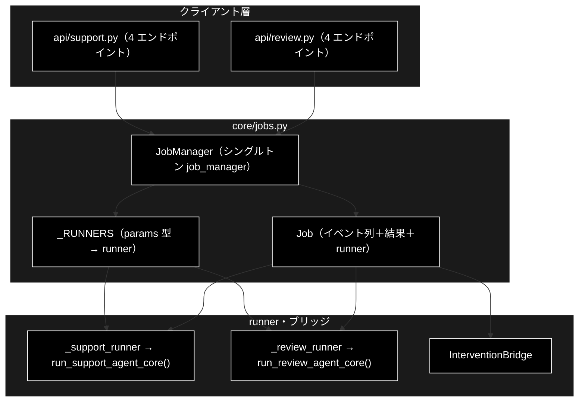
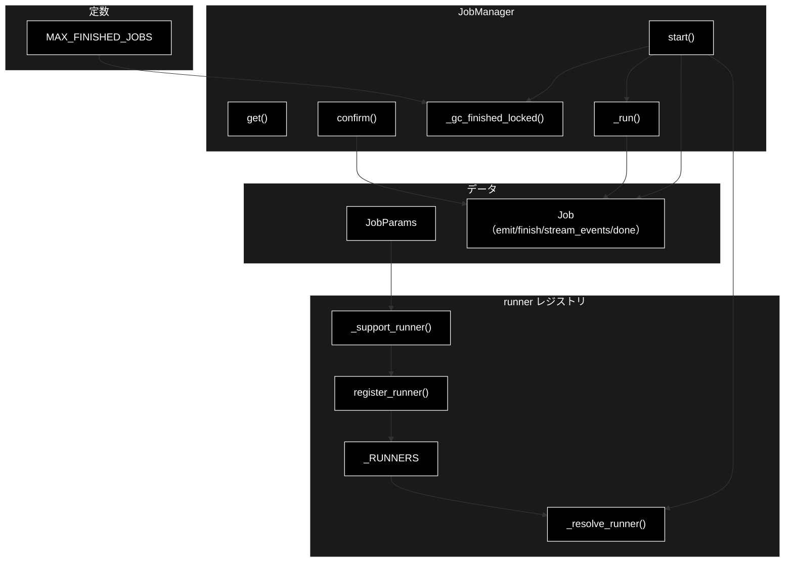
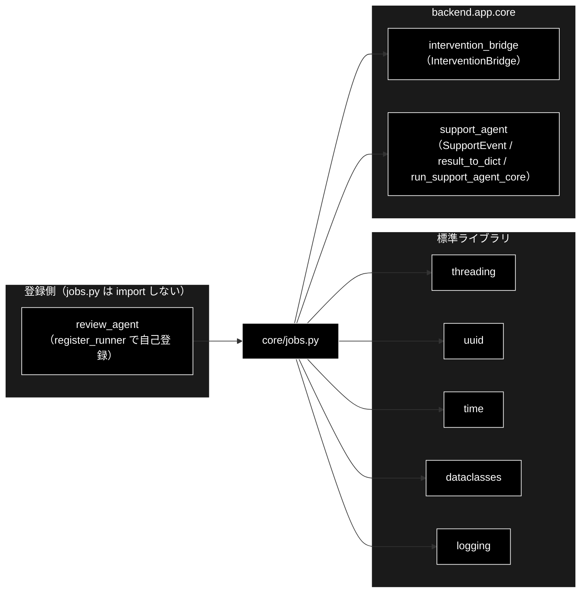

# core/jobs.py - ジョブ管理（インメモリ）ドキュメント

**Version 1.2** | 最終更新: 2026-08-01

---

## 目次

1. [概要](#概要)
2. [アーキテクチャ構成図](#1-アーキテクチャ構成図)
3. [モジュール構成図](#2-モジュール構成図)
4. [クラス・関数一覧表](#3-クラス関数一覧表)
5. [クラス・関数 IPO詳細](#4-クラス関数-ipo詳細)
6. [設定・定数](#5-設定定数)
7. [使用例](#6-使用例)
8. [エクスポート](#7-エクスポート)
9. [変更履歴](#8-変更履歴)
10. [付録: 依存関係図](#付録-依存関係図)

---

## 概要

`backend/app/core/jobs.py` は、GRACE の**エージェント実行のジョブ管理（インメモリ）**を
担うモジュール。1 リクエスト = 1 ジョブとし、ジョブはワーカースレッドで**実行関数（runner）**を
呼び、進捗イベントを蓄積する。SSE 購読者はイベント列を先頭から追いかけるため、再接続・
途中購読でも全イベントをリプレイできる。

ローカル開発用のシングルプロセス前提で、永続化はしない。完了ジョブは `MAX_FINISHED_JOBS`
上限で古い順に破棄する。HITL CONFIRM は `InterventionBridge` を介して非同期に解決する。

### runner 注入方式（v1.1）

当初は `run_support_agent_core` を直接呼んでいたが、GRACE-Review（文書レビュー）を同じ
ジョブ基盤へ乗せるため、実行関数を差し替え可能にした。

```python
runner(params, emit, confirm) -> Optional[Dict[str, Any]]
```

`start()` は runner 省略時、`params` の**型**から `_RUNNERS` を引いて既定 runner を解決する。
そのため **`api/support.py` の `job_manager.start(JobParams(...))` は無変更で動く**。

| エージェント | params の型 | runner | 登録元 |
|---|---|---|---|
| Support | `JobParams` | `_support_runner` | 本モジュール（自分で登録） |
| Review | `ReviewParams` | `_review_runner` | `core/review_agent.py`（import 時に登録） |

> **循環 import が発生しない理由**: `jobs.py` は Review 側のモジュールを一切知らない。
> `review_agent.py` が一方的に `register_runner()` を呼ぶ。`ReviewParams` を構築するには
> `review_agent` の import が必要なので、**登録漏れも構造的に起きない**。

### 主な責務

- ジョブの生成・ワーカースレッド起動（`JobManager.start`）
- params の型から実行関数を解決する（`register_runner` / `_resolve_runner`）
- 進捗イベントの蓄積と SSE 購読者への通知（`Job.emit` / `stream_events`）
- 最終結果・状態の保持（running / completed / failed）
- HITL CONFIRM 応答の注入（`JobManager.confirm` → `InterventionBridge.resolve`）
- 完了ジョブの GC（`MAX_FINISHED_JOBS` 超過分を破棄）

### 各責務対応のモジュール

| # | 責務 | 対応モジュール | 説明 |
|---|------|--------------|------|
| 1 | ジョブ生成・実行 | `jobs.py`（`JobManager`） | ワーカースレッドで runner を実行 |
| 2 | runner の解決 | `jobs.py`（`_RUNNERS` / `register_runner`） | params の型 → (runner, kind) |
| 3 | イベント蓄積/配信 | `jobs.py`（`Job`） | `emit` / `stream_events` |
| 4 | HITL 応答注入 | `core/intervention_bridge.py` | `InterventionBridge.resolve` |
| 5 | Support のコア実行 | `core/support_agent.py` | `run_support_agent_core` |
| 6 | Review のコア実行 | `core/review_agent.py` | `run_review_agent_core` |

### 主要機能一覧

| 機能 | 説明 |
|------|------|
| `JobRunner` | 実行関数の型 `(params, emit, confirm) -> Optional[dict]` |
| `register_runner()` | params の型に対する既定 runner を登録する |
| `JobParams` | Support のクエリパラメータ（CLI 引数と 1:1） |
| `Job` | 実行中/完了のジョブ（イベント列＋結果） |
| `SupportJob` | `Job` の後方互換エイリアス |
| `Job.emit()` | 進捗イベントを蓄積し購読者を起こす |
| `Job.finish()` | 状態と結果を確定 |
| `Job.stream_events()` | イベントを先頭から返すブロッキングイテレータ |
| `JobManager` | ジョブの生成・参照・HITL 注入 |
| `JobManager.start()` | ジョブを起動 |
| `JobManager.get()` | ジョブを参照 |
| `JobManager.confirm()` | HITL 応答を注入 |
| `job_manager` | アプリ全体で共有するシングルトン |

---

## 1. アーキテクチャ構成図

### 1.1 システム全体構成



### 1.2 データフロー

1. `JobManager.start(params)` が params の型から runner を解決し、`Job` と `InterventionBridge` を生成してワーカースレッドを起動
2. ワーカーが `runner(params, job.emit, bridge.resolver)` を実行
3. `emit` で蓄積されたイベントを `stream_events()` が SSE 購読者へ順に返す
4. CONFIRM 到達時、`JobManager.confirm()` → `bridge.resolve()` で応答を注入
5. 完了時 `finish("completed", result)`、`None` 戻り・例外時は `finish("failed")`

---

## 2. モジュール構成図

### 2.1 内部モジュール構成



### 2.2 外部依存関係

| ライブラリ | バージョン | 用途 |
|-----------|-----------|------|
| `threading` | 標準 | ワーカースレッド・`Condition` / `Lock` |
| `uuid` | 標準 | ジョブ ID 生成 |
| `time` | 標準 | 生成/完了時刻・イベント ts |
| `dataclasses` | 標準 | `JobParams` / `SupportJob` |
| `logging` | 標準 | 実行失敗のログ |

### 2.3 内部依存モジュール

| モジュール | 用途 |
|-----------|------|
| `backend.app.core.intervention_bridge` | `InterventionBridge`（HITL 非同期解決） |
| `backend.app.core.support_agent` | `ConfirmFn` / `EmitFn` / `SupportEvent` / `result_to_dict` / `run_support_agent_core` |

> ⚠️ **`core/review_agent.py` への依存は無い。** Review の runner は `review_agent.py` 側が
> `register_runner()` で登録する。本モジュールが Review を import しないことで循環 import を
> 構造的に避けている。

---

## 3. クラス・関数一覧表

### 3.1 クラス一覧

#### JobParams（dataclass）

| メソッド | 概要 |
|---------|------|
| （dataclass） | query / vertical / dry_run / use_web / do_action / verbose |

#### Job（dataclass）※ `SupportJob` は後方互換エイリアス

| メソッド | 概要 |
|---------|------|
| `emit(event)` | 進捗イベントを蓄積し購読者を起こす |
| `finish(status, result)` | 状態と結果を確定 |
| `done`（property） | running でなければ True |
| `stream_events(poll_timeout)` | イベントを先頭から返すブロッキングイテレータ |

#### JobManager

| メソッド | 概要 |
|---------|------|
| `__init__()` | ジョブ辞書とロックを初期化 |
| `start(params, runner, kind)` | ジョブを起動（runner 省略時は型から解決） |
| `get(job_id)` | ジョブを参照 |
| `confirm(job_id, intervention_id, approve)` | HITL 応答を注入 |
| `_run(job)` | ワーカー本体（runner 実行） |
| `_gc_finished_locked()` | 完了ジョブの GC |

#### モジュール関数

| 関数 | 概要 |
|---------|------|
| `register_runner(params_type, runner, kind)` | params の型に対する既定 runner を登録 |
| `_resolve_runner(params)` | params の型から runner を解決（未登録は TypeError） |
| `_support_runner(params, emit, confirm)` | `JobParams` → `run_support_agent_core` |

### 3.2 関数一覧

モジュールレベル関数はない（`job_manager` はシングルトンインスタンス）。

---

## 4. クラス・関数 IPO詳細

### 4.1 JobParams クラス

**概要**: `POST /api/support/query` のパラメータ（CLI 引数と 1:1）。

```python
JobParams(
    query: str,
    vertical: Optional[str] = None,
    dry_run: bool = True,
    use_web: bool = True,
    do_action: bool = True,
    verbose: bool = False,
    identity: Optional[Dict[str, str]] = None,
)
```

| パラメータ | 型 | デフォルト | 説明 |
|------------|------|-----------|------|
| `query` | str | - | 問い合わせ内容 |
| `vertical` | Optional[str] | None | 業界プロファイル |
| `dry_run` / `use_web` / `do_action` | bool | True | ドライラン／Web／アクション |
| `verbose` | bool | False | 詳細ログ |
| `identity` | Optional[Dict[str, str]] | None | 本人確認の識別子（`--identity` 相当。`order_id` / `email`） |

> 📝 **`identity` は当初 `_support_runner` が `None` を直書きしていた**（画面から渡せなかった）。
> 現在は `params.identity` を素通しする。実際に照合されるのは
> **`require_identity` のプロファイル（`ec`）＋ `dry_run=False` ＋ `SUPPORT_IDENTITY_FILE` 設定**
> の経路だけで、`dry_run=True` ではデモ照合が値を見ない
> （[`core_verticals.md`](./core_verticals.md) / `support_actions.create_identity_verifier`）。
> 回帰は `test_jobs_generic.py::test_identity_is_passed_through_to_core` で固定。

| 項目 | 内容 |
|------|------|
| **Input** | 上記フィールド |
| **Process** | 値を保持 |
| **Output** | `JobParams` |

**戻り値例**:
```python
JobParams(query="返品したい", vertical="ec", dry_run=True)
```

```python
# 使用例
job = job_manager.start(JobParams(query="返品したい", vertical="ec"))
```

### 4.2 SupportJob クラス

実行中/完了のジョブ。イベント列と最終結果を保持し、`threading.Condition` で購読者を通知する。

#### メソッド: `emit`

**概要**: コアからの進捗イベントを蓄積し、SSE 購読者を起こす。

```python
def emit(self, event: SupportEvent) -> None
```

| パラメータ | 型 | デフォルト | 説明 |
|------------|------|-----------|------|
| `event` | SupportEvent | - | コアが発行した進捗イベント |

| 項目 | 内容 |
|------|------|
| **Input** | `event: SupportEvent` |
| **Process** | 1. `{seq, ts, **asdict(event)}` の record を作成<br>2. Condition ロック下で `events` に append し `notify_all()` |
| **Output** | `None`（`events` に追記する副作用） |

**戻り値例**:
```python
# events に追加される record
{"seq": 3, "ts": 1752543210.1, "type": "log", "step": "gate", "message": "…", "data": {}}
```

```python
# 使用例（core へ渡す）
run_support_agent_core(..., emit=job.emit)
```

#### メソッド: `finish`

**概要**: ジョブの状態と結果を確定し、購読者を起こす。

```python
def finish(self, status: str, result: Optional[Dict[str, Any]] = None) -> None
```

| パラメータ | 型 | デフォルト | 説明 |
|------------|------|-----------|------|
| `status` | str | - | completed / failed |
| `result` | Optional[Dict[str, Any]] | None | 最終結果（dict） |

| 項目 | 内容 |
|------|------|
| **Input** | `status`, `result` |
| **Process** | Condition ロック下で status/result/finished_at を設定し `notify_all()` |
| **Output** | `None` |

**戻り値例**:
```python
# job.status = "completed", job.result = {...}
```

```python
# 使用例
job.finish("completed", result_to_dict(result))
```

#### メソッド: `stream_events`

**概要**: イベントを先頭から順に返すブロッキングイテレータ。新イベントが `poll_timeout` 秒
来ない場合は None（SSE 側は keepalive）。ジョブ完了かつ全イベント配信済みで終了。

```python
def stream_events(self, poll_timeout: float = 15.0) -> Iterator[Optional[Dict[str, Any]]]
```

| パラメータ | 型 | デフォルト | 説明 |
|------------|------|-----------|------|
| `poll_timeout` | float | 15.0 | 新イベント待ちタイムアウト（秒） |

| 項目 | 内容 |
|------|------|
| **Input** | `poll_timeout` |
| **Process** | index を進めつつ、未配信イベントがあれば yield、無く未完了なら wait、完了かつ配信済みで return、タイムアウトは None を yield |
| **Output** | `Iterator[Optional[Dict[str, Any]]]`: イベント dict または None（keepalive） |

**戻り値例**:
```python
{"seq": 0, "ts": ..., "type": "step", "step": "plan", "status": "started"}
None  # poll_timeout 到達 → keepalive
```

```python
# 使用例（api/support.py）
for event in job.stream_events():
    yield ": keepalive\n\n" if event is None else f"data: {json.dumps(event)}\n\n"
```

#### プロパティ: `done`

**概要**: ジョブが終了状態（running 以外）なら True。

```python
@property
def done(self) -> bool
```

| 項目 | 内容 |
|------|------|
| **Input** | なし（self のみ） |
| **Process** | `self.status != "running"` |
| **Output** | `bool` |

**戻り値例**:
```python
True   # completed / failed
False  # running
```

```python
# 使用例
if job.done: ...
```

### 4.3 JobManager クラス

ジョブの生成・参照・HITL 応答の注入を担う（インメモリ・スレッドセーフ）。

#### コンストラクタ: `__init__`

**概要**: ジョブ辞書とロックを初期化する。

```python
JobManager()
```

| 項目 | 内容 |
|------|------|
| **Input** | なし |
| **Process** | `self._jobs = {}`, `self._lock = threading.Lock()` |
| **Output** | `JobManager` インスタンス |

**戻り値例**:
```python
# 内部状態: _jobs={}, _lock=<Lock>
```

```python
# 使用例
job_manager = JobManager()  # モジュール末尾でシングルトン化
```

#### メソッド: `start`

**概要**: ジョブを生成し、ワーカースレッドで実行を開始する。runner 省略時は
`params` の型から既定 runner を解決する。

```python
def start(
    self,
    params: Any,
    runner: Optional[JobRunner] = None,
    kind: Optional[str] = None,
) -> Job
```

| パラメータ | 型 | デフォルト | 説明 |
|------------|------|-----------|------|
| `params` | Any | - | 実行パラメータ（`JobParams` / `ReviewParams` 等） |
| `runner` | Optional[JobRunner] | `None` | 実行関数。省略時は `_RUNNERS` から解決 |
| `kind` | Optional[str] | `None` | ジョブ種別のラベル。省略時は登録時の kind |

| 項目 | 内容 |
|------|------|
| **Input** | `params: Any`, `runner: Optional[JobRunner] = None`, `kind: Optional[str] = None` |
| **Process** | 1. runner 省略なら `_resolve_runner(params)`（未登録は `TypeError`）<br>2. `Job`（job_id=uuid 12桁）生成、`bridge=InterventionBridge(emit=job.emit)`<br>3. ロック下で GC ＋ `_jobs` 登録<br>4. daemon スレッド（名前 `{kind}-job-{job_id}`）で `_run(job)` 起動 |
| **Output** | `Job`: 起動済みジョブ |

**戻り値例**:
```python
Job(job_id="a1b2c3d4e5f6", kind="support", status="running", ...)
```

```python
# 使用例（既存の呼び方はそのまま動く）
job = job_manager.start(JobParams(query="返品したい", vertical="ec"))
assert job.kind == "support"

# Review も同じ呼び方（型で解決される）
from backend.app.core.review_agent import ReviewParams
job = job_manager.start(ReviewParams(document="...", document_title="LP案"))
assert job.kind == "review"

# 任意の runner を明示注入することもできる（テスト用）
job = job_manager.start(my_params, runner=my_runner, kind="custom")
```

> **未登録の型を runner 省略で渡すと `TypeError`。** 黙って動かさないことで、
> 登録漏れが本番で静かに失敗するのを防いでいる。

#### メソッド: `get`

**概要**: ジョブ ID からジョブを参照する（無ければ None）。

```python
def get(self, job_id: str) -> Optional[Job]
```

| パラメータ | 型 | デフォルト | 説明 |
|------------|------|-----------|------|
| `job_id` | str | - | ジョブ ID |

| 項目 | 内容 |
|------|------|
| **Input** | `job_id` |
| **Process** | ロック下で `_jobs.get(job_id)` |
| **Output** | `Optional[Job]` |

**戻り値例**:
```python
Job(job_id="a1b2c3d4e5f6", status="completed", ...)  # または None
```

```python
# 使用例
job = job_manager.get(job_id)
```

#### メソッド: `confirm`

**概要**: HITL 応答を注入する。戻り値は resolved / not_found / not_waiting。

```python
def confirm(self, job_id: str, intervention_id: str, approve: bool) -> str
```

| パラメータ | 型 | デフォルト | 説明 |
|------------|------|-----------|------|
| `job_id` | str | - | ジョブ ID |
| `intervention_id` | str | - | 対象 intervention ID |
| `approve` | bool | - | 承認/拒否 |

| 項目 | 内容 |
|------|------|
| **Input** | `job_id`, `intervention_id`, `approve` |
| **Process** | 1. `get(job_id)`、無ければ `not_found`<br>2. `bridge.resolve(intervention_id, approve)` 失敗なら `not_waiting`<br>3. 成功で `resolved` |
| **Output** | `str`: "resolved" / "not_found" / "not_waiting" |

**戻り値例**:
```python
"resolved"
```

```python
# 使用例
status = job_manager.confirm(job_id, intervention_id, approve=True)
```

---

## 5. 設定・定数

### 5.1 MAX_FINISHED_JOBS

```python
MAX_FINISHED_JOBS = 50
```

| 定数名 | 値 | 説明 |
|-------|----|------|
| `MAX_FINISHED_JOBS` | 50 | メモリに保持する完了ジョブ数の上限。超えた分は `finished_at` の古い順に破棄 |

---

## 6. 使用例

### 6.1 基本的なワークフロー

```python
from backend.app.core.jobs import JobParams, job_manager

# 起動
job = job_manager.start(JobParams(query="返品したい", vertical="ec"))

# 進捗（SSE 側で消費）
for event in job.stream_events():
    ...  # None は keepalive

# HITL 応答
job_manager.confirm(job.job_id, intervention_id="9f8e...", approve=True)

# 結果参照
j = job_manager.get(job.job_id)
print(j.status, j.result)
```

---

## 7. エクスポート

`__all__` 定義はない。`api/support.py` が `JobParams` / `job_manager`、`api/review.py` が
`job_manager`、`core/review_agent.py` が `register_runner` を import する。

```python
# 公開シンボル（明示的 __all__ はなし）
JobParams, Job, SupportJob, JobManager, JobRunner,
register_runner, job_manager, MAX_FINISHED_JOBS
```

`SupportJob` は `Job` の後方互換エイリアス（`SupportJob is Job`）。既存の
`from ... import SupportJob` を壊さないために残している。

---

## 8. 変更履歴

| バージョン | 日付 | 変更内容 |
|-----------|------|---------|
| 1.0 | 2026-07-15 | 初版作成（JobParams / SupportJob / JobManager / job_manager の IPO ドキュメント） |
| 1.1 | 2026-07-29 | runner 注入方式へ汎用化（PR #39）。`SupportJob` → `Job` へ改名し後方互換エイリアスを追加。`register_runner` / `_resolve_runner` / `_support_runner` / `JobRunner` を追記 |
| 1.2 | 2026-08-01 | `JobParams` に `identity` を追加し、`_support_runner` の `identity=None` 直書きを `params.identity` の素通しへ変更。画面から本人確認の識別子を渡せるようにしたもので、回帰は `test_jobs_generic.py::test_identity_is_passed_through_to_core` で固定 |

---

## 付録: 依存関係図



矢印が `review_agent → jobs` の一方向であることが重要。逆向き（`jobs → review_agent`）が
無いため、循環 import が構造的に発生しない。
