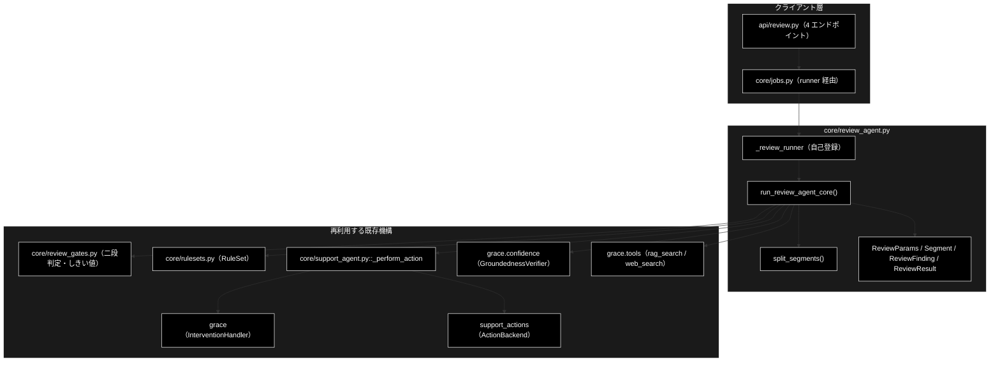
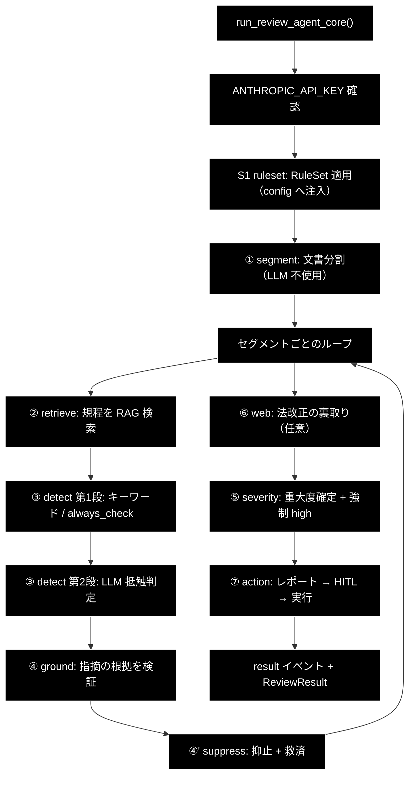
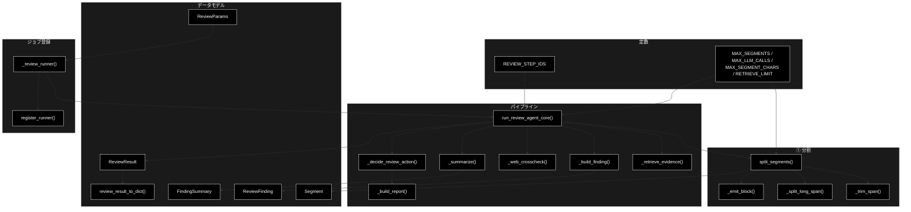
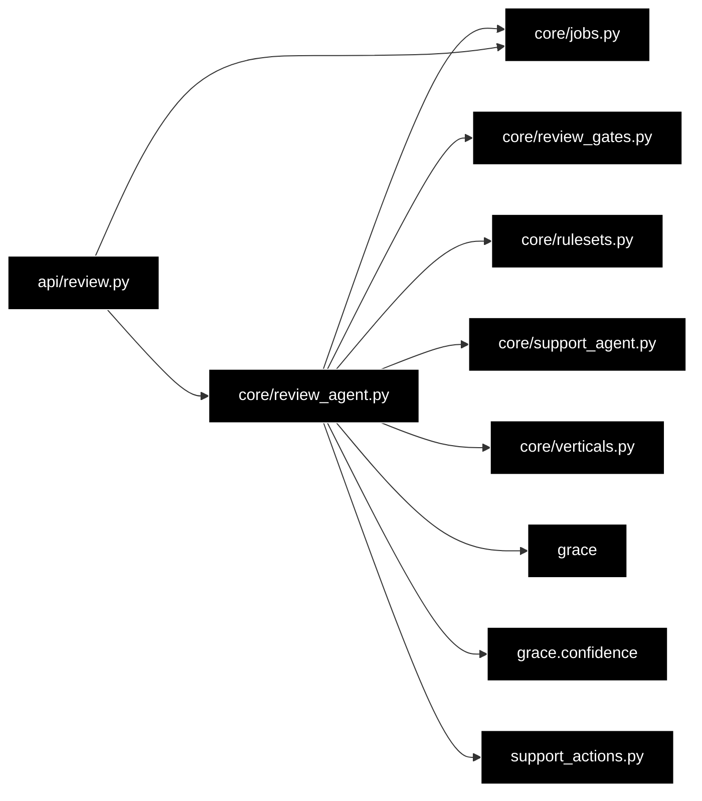

# core/review_agent.py - GRACE-Review コアパイプライン ドキュメント

**Version 1.0** | 最終更新: 2026-07-29

---

## 目次

1. [概要](#概要)
2. [アーキテクチャ構成図](#1-アーキテクチャ構成図)
3. [モジュール構成図](#2-モジュール構成図)
4. [クラス・関数一覧表](#3-クラス関数一覧表)
5. [クラス・関数 IPO詳細](#4-クラス関数-ipo詳細)
6. [設定・定数](#5-設定定数)
7. [使用例](#6-使用例)
8. [エクスポート](#7-エクスポート)
9. [変更履歴](#8-変更履歴)
10. [付録: 依存関係図](#付録-依存関係図)

---

## 概要

`backend/app/core/review_agent.py` は、GRACE-Review（文書レビュー）の**パイプライン中核**。
`support_agent.py` が「問い合わせ → 回答」なのに対し、本モジュールは**「文書 → 指摘」**と
情報の流れが逆になる。それでも中核部品は無改造で機能する。

| 部品 | Support での役割 | Review での役割 | 改造 |
|---|---|---|:---:|
| `GroundednessVerifier` | 主張が出典で裏付けられるか | **指摘が規程で裏付けられるか** | なし |
| `_perform_action` / `ActionBackend` | HITL → バックエンド実行 | 同じ | なし |
| `InterventionBridge` | CONFIRM の承認待ち | 同じ | なし |
| `rag_search`（`allowed_collections`） | 業界プロファイルの検索スコープ | ルールセットの検索スコープ | なし |

**新規実装は Segment / Detect / Severity の 3 つだけ**で、Retrieve・Ground・誤検知抑止・
Action はすべて既存機構の再利用である。

> **⚠️ Web API と CLI は同じ `run_review_agent_core` を通る。**
> `support_agent.py` と同じく、経路による分岐は存在しない。

### 主な責務

- 文書の検査単位への分割（決定的・原文オフセット保持）
- ルールセットの適用（検索スコープ・しきい値・重大リスク語の config 注入）
- セグメントごとの規程検索と二段判定による違反候補の検出
- 指摘の根拠検証と誤検知抑止・救済
- 重大度の確定（強制 high を含む）
- レポート生成と HITL を経たアクション実行
- ジョブ基盤への runner 自己登録

### 各責務対応のモジュール

| # | 責務 | 対応モジュール | 説明 |
|---|------|--------------|------|
| 1 | 文書分割 | `review_agent.py`（`split_segments`） | LLM 不使用・原文オフセット保持 |
| 2 | ルールセット適用 | `core/rulesets.py` | `get_ruleset()` で解決し config へ注入 |
| 3 | 規程検索 | `grace.tools`（`rag_search`） | `allowed_collections` で規程に限定 |
| 4 | 二段判定 | `core/review_gates.py` | 第1段キーワード → 第2段 LLM |
| 5 | 根拠検証・抑止 | `grace.confidence` / `core/review_gates.py` | `GroundednessVerifier` ＋ 純関数 |
| 6 | アクション実行 | `core/support_agent.py`（`_perform_action`） | 無改造で再利用 |
| 7 | ジョブ登録 | `core/jobs.py`（`register_runner`） | import 時に自己登録 |

### 主要機能一覧

| 機能 | 説明 |
|------|------|
| `ReviewParams` | レビュージョブのパラメータ（CLI 引数と 1:1） |
| `Segment` | 検査単位（原文オフセット付き） |
| `ReviewFinding` | 1 件の指摘（UI の指摘カードに対応） |
| `FindingSummary` | 重大度・状態ごとの件数 |
| `ReviewResult` | レビュー結果（指摘＋サマリ＋KPI） |
| `review_result_to_dict()` | `ReviewResult` を JSON 化可能な dict にする |
| `split_segments()` | ① 文書を検査単位へ分割する |
| `run_review_agent_core()` | パイプライン本体（S1・①〜⑦） |

---

## 1. アーキテクチャ構成図

### 1.1 システム全体構成



### 1.2 データフロー

1. `api/review.py` が `job_manager.start(ReviewParams(...))` を呼ぶ
2. `jobs.py` が params の型から `_review_runner` を解決し、ワーカースレッドで実行する
3. `run_review_agent_core` が S1 →①〜⑦ を進め、各段で `emit(SupportEvent)` を発火する
4. SSE 購読者（フロント）がイベントを受け取り、タイムラインと結果を描画する
5. ⑦ で HITL CONFIRM が必要なら `InterventionBridge` 経由で承認を待つ
6. 最終的に `ReviewResult` を dict 化して `Job.result` に格納する

### 1.3 パイプライン処理フロー



> 番号（①〜⑦）は Support のパイプラインとの対応を示す呼称であり、**実行順とは一致しない**
> （Support で ④' が ⑤ の後に来るのと同じ）。`REVIEW_STEP_IDS` の並びが実行順である。

---

## 2. モジュール構成図

### 2.1 内部モジュール構成



### 2.2 外部依存関係

| ライブラリ | バージョン | 用途 |
|-----------|-----------|------|
| （標準ライブラリ） | — | `copy` / `os` / `re` / `dataclasses` / `typing` |

外部ライブラリへの直接依存はない（LLM・Qdrant はすべて `grace` パッケージ越し）。

### 2.3 内部依存モジュール

| モジュール | 用途 |
|-----------|------|
| `backend.app.core.jobs` | `register_runner`（自己登録） |
| `backend.app.core.review_gates` | 二段判定・しきい値判定の 10 関数 |
| `backend.app.core.rulesets` | `RuleSet` / `RuleItem` / `get_ruleset` / しきい値既定値 |
| `backend.app.core.support_agent` | `AUTO_PROCEED` / `ConfirmFn` / `EmitFn` / `SupportEvent` / `_perform_action` |
| `backend.app.core.verticals` | `ActionRequest` |
| `grace` | `create_intervention_handler` / `create_tool_registry` / `get_config` |
| `grace.confidence` | `create_groundedness_verifier` |
| `support_actions` | `create_action_backend` |

> **循環 import は起きない。** `jobs.py` は Review 側を一切 import せず、
> `review_agent.py` が一方的に `register_runner` を呼ぶ。`ReviewParams` を構築するには
> 本モジュールの import が必要なので、**登録漏れも構造的に起きない**。

---

## 3. クラス・関数一覧表

### 3.1 クラス一覧

#### ReviewParams（dataclass）

| フィールド | 型 | 既定 | 概要 |
|---|---|---|---|
| `document` | str | - | 点検対象の文書 |
| `document_title` | str | `"無題"` | 表示用タイトル |
| `ruleset` | Optional[str] | `"ec_ad"` | 適用するルールセット |
| `use_web` | bool | `False` | Web 裏取り（Support と逆で既定 OFF） |
| `do_action` | bool | `True` | アクション実行 |
| `dry_run` | bool | `True` | ドライラン |
| `verbose` | bool | `False` | 詳細ログ |

#### Segment（dataclass）

| フィールド | 型 | 既定 | 概要 |
|---|---|---|---|
| `segment_id` | str | - | `s001` 形式の連番 |
| `text` | str | - | セグメント本文 |
| `start` / `end` | int | - | **原文**の文字オフセット |
| `kind` | str | `"paragraph"` | `paragraph` / `list_item` / `heading` |

#### ReviewFinding（dataclass）

| フィールド | 型 | 既定 | 概要 |
|---|---|---|---|
| `finding_id` | str | - | `f001` 形式の連番 |
| `segment_id` | str | - | 由来セグメント |
| `excerpt` | str | - | 該当箇所 |
| `start` / `end` | int | - | **原文**の文字オフセット |
| `rule_id` / `rule_title` / `category` / `law` / `article` | str | - | ルール由来のメタ情報 |
| `message` / `suggestion` | str | - | 指摘内容と修正案 |
| `severity` | Severity | `"medium"` | 重大度 |
| `confidence` | float | `0.0` | 根拠の支持率 |
| `citations` | List[str] | `[]` | 根拠条文 |
| `status` | FindingStatus | `"review_required"` | 確定状態 |
| `forced` | bool | `False` | 重大リスク語で強制 high にしたか |
| `suppress_reason` | Optional[str] | `None` | 抑止理由 |
| `web_checked` | bool | `False` | Web 裏取り済みか |

#### ReviewResult（dataclass）

| フィールド | 型 | 既定 | 概要 |
|---|---|---|---|
| `document_title` | str | - | タイトル |
| `ruleset` | Optional[str] | `None` | 適用したルールセット |
| `segments` | List[Segment] | `[]` | 分割結果 |
| `findings` | List[ReviewFinding] | `[]` | 採用した指摘（`suppressed` は含まない） |
| `summary` | FindingSummary | — | 件数サマリ |
| `used_web` | bool | `False` | Web を使ったか |
| `action` / `action_result` | — | `None` | 実行（予定）アクションと結果 |
| `segments_total` | int | `0` | セグメント数 |
| `rules_evaluated` | int | `0` | 第2段 LLM を呼んだ回数 |
| `detected_raw` | int | `0` | 第2段が違反とした数（抑止前） |
| `rescued` | int | `0` | 救済した数 |
| `forced_high` | int | `0` | 強制 high にした数 |
| `truncated` | bool | `False` | ガード上限で打ち切ったか |

### 3.2 関数一覧（カテゴリ別）

#### 公開関数

| 関数名 | 概要 |
|-------|------|
| `split_segments(text, max_chars, max_segments)` | ① 文書を検査単位へ分割する |
| `run_review_agent_core(...)` | パイプライン本体 |
| `review_result_to_dict(result)` | 結果を JSON 化可能な dict にする |

#### 非公開ヘルパ

| 関数名 | 概要 |
|-------|------|
| `_trim_span(text, start, end)` | 前後の空白を除いたスパンを返す |
| `_split_long_span(text, start, end, max_chars)` | 長いスパンを文末で分割する |
| `_emit_block(text, start, end, add)` | 段落ブロックを行種別で分けて追加する |
| `_retrieve_evidence(tool_registry, query, ruleset)` | ② 規程を検索する |
| `_build_finding(index, segment, rule, verdict, citations)` | 指摘を組み立てる（オフセット解決） |
| `_segment_text(segments, segment_id)` | セグメント ID から本文を引く |
| `_web_crosscheck(tool_registry, findings, ruleset, log)` | ⑥ 法改正を確認する |
| `_summarize(findings, suppressed)` | 件数サマリを作る |
| `_decide_review_action(result)` | ⑦ 実行アクションを決める |
| `_build_report(result)` | 指摘レポート（Markdown）を作る |
| `_review_runner(params, emit, confirm)` | ジョブ基盤から呼ばれる runner |

---

## 4. クラス・関数 IPO詳細

### 4.1 ① 文書分割

#### `split_segments`

**概要**: 文書を検査単位へ分割する。LLM を使わない決定的処理で、**オフセットは必ず原文に対して取る**。

```python
def split_segments(
    text: str,
    max_chars: int = MAX_SEGMENT_CHARS,
    max_segments: int = MAX_SEGMENTS,
) -> Tuple[List[Segment], bool]
```

| パラメータ | 型 | デフォルト | 説明 |
|------------|------|-----------|------|
| `text` | str | - | 分割対象の原文 |
| `max_chars` | int | `400` | これを超える段落は文末で再分割 |
| `max_segments` | int | `200` | セグメント数の上限 |

| 項目 | 内容 |
|------|------|
| **Input** | `text: str`, `max_chars: int = 400`, `max_segments: int = 200` |
| **Process** | 1. 空行（`\n[ \t　]*\n`）で段落へ一次分割<br>2. ブロック内に箇条書き・見出しがあれば 1 行 1 セグメント<br>3. `max_chars` 超の段落は文末（`。！？!?`）で再分割<br>4. 空白のみのスパンは破棄<br>5. `max_segments` に達したら打ち切る |
| **Output** | `Tuple[List[Segment], bool]`<br>- List[Segment]: 分割結果<br>- bool: 上限で打ち切ったか |

**戻り値例**:
```python
(
    [
        Segment(segment_id="s001", text="当社の商品は業界No.1の品質です。", start=0, end=16, kind="paragraph"),
        Segment(segment_id="s002", text="・送料無料", start=18, end=23, kind="list_item"),
        Segment(segment_id="s003", text="■ 特定商取引法に基づく表記", start=24, end=38, kind="heading"),
    ],
    False,
)
```

```python
# 使用例
from backend.app.core.review_agent import split_segments

document = "当社の商品は業界No.1の品質です。\n\n・送料無料\n・返品可能"
segments, truncated = split_segments(document)
for s in segments:
    # オフセットは原文基準なので、そのまま切り出せば本文に戻る
    assert document[s.start:s.end] == s.text
```

> ⚠️ **正規化を挟んではならない。** 全角/半角の統一やトリムを本文に対して行うと、
> `Segment.start` / `.end` が原文からずれ、UI のハイライト位置が壊れる。
> この不変条件（`document[start:end] == text`）は
> `backend/tests/test_review_agent_core.py` が全ケースで固定している。

---

### 4.2 パイプライン本体

#### `run_review_agent_core`

**概要**: 文書レビューのパイプライン（S1・①〜⑦）を実行し、進捗をイベントで通知する。

```python
def run_review_agent_core(
    document: str,
    document_title: str = "無題",
    ruleset: Optional[str] = "ec_ad",
    use_web: bool = False,
    do_action: bool = True,
    dry_run: bool = True,
    verbose: bool = False,
    emit: Optional[EmitFn] = None,
    confirm: Optional[ConfirmFn] = None,
) -> Optional[ReviewResult]
```

| パラメータ | 型 | デフォルト | 説明 |
|------------|------|-----------|------|
| `document` | str | - | 点検対象の文書 |
| `document_title` | str | `"無題"` | 表示用タイトル |
| `ruleset` | Optional[str] | `"ec_ad"` | 適用するルールセット ID |
| `use_web` | bool | `False` | ⑥ Web 裏取りを行うか |
| `do_action` | bool | `True` | ⑦ Action を行うか |
| `dry_run` | bool | `True` | アクションをドライランにするか |
| `verbose` | bool | `False` | 詳細ログを出すか |
| `emit` | Optional[EmitFn] | `None` | 進捗イベントのコールバック |
| `confirm` | Optional[ConfirmFn] | `None` | HITL CONFIRM の解決コールバック |

| 項目 | 内容 |
|------|------|
| **Input** | 上記 9 パラメータ |
| **Process** | 1. `ANTHROPIC_API_KEY` を確認（未設定なら error イベント＋`None`）<br>2. config を**ディープコピー**し、ルールセットを注入（S1）<br>3. `split_segments` で分割（①）<br>4. セグメント × 候補ルールで ②〜④' を回す<br>5. ⑥ Web 裏取り（`use_web=True` かつ指摘ありのとき）<br>6. ⑤ 重大度を確定<br>7. ⑦ レポート → HITL → アクション実行<br>8. result イベントを発火して `ReviewResult` を返す |
| **Output** | `Optional[ReviewResult]`: APIキー未設定なら `None` |

**戻り値例**:
```python
ReviewResult(
    document_title="化粧品LP案",
    ruleset="ec_ad",
    segments=[Segment(segment_id="s001", ...)],
    findings=[
        ReviewFinding(
            finding_id="f001", segment_id="s001", excerpt="業界No.1",
            start=6, end=12, rule_id="keihyo-03", rule_title="No.1表示の根拠",
            law="景品表示法", article="第5条第1号",
            message="出典の併記がない No.1 表示は不当表示に該当するおそれがあります",
            suggestion="調査主体・調査期間・調査対象を併記してください",
            severity="high", confidence=0.92, citations=["[規程] 景品表示法 優良誤認"],
            status="review_required", forced=True, web_checked=False,
        ),
    ],
    summary=FindingSummary(high=1, medium=0, low=0, confirmed=0, review_required=1, suppressed=2),
    used_web=False, action=ActionRequest("escalate_to_human", {...}, requires_confirmation=False),
    action_result="[DRY-RUN] 'escalate_to_human' を実行（ログのみ・args=...）",
    segments_total=3, rules_evaluated=9, detected_raw=3, rescued=0, forced_high=1, truncated=False,
)
```

```python
# 使用例（CLI 相当・confirm=None で自動承認）
from backend.app.core.review_agent import run_review_agent_core

result = run_review_agent_core(
    "当社の化粧品は業界No.1の実力。使えばシミが治ると評判です。",
    document_title="化粧品LP案",
    emit=lambda e: print(f"[{e.type}] {e.step or '-'}: {e.message}"),
)
print(f"指摘 {len(result.findings)} 件（重大 {result.summary.high}）")
```

##### ⚠️ config をディープコピーする理由

`jobs.py` はジョブごとにワーカースレッドを立てる。`config.qdrant.allowed_collections` /
`config.llm.prompt_addendum` をシングルトンのまま書き換えると、**並走中のジョブ同士で
検索スコープを奪い合う**（Review の規程スコープが実行中の Support のスコープを上書きする）。
`support_agent.py` が同じ理由で `copy.deepcopy(get_config())` を使っている。

##### ⚠️ `confirm=None` のフォールバック

CLI 経路では `confirm` が `None` になる。そのまま `InterventionHandler` へ渡すと承認を
解決できず CONFIRM 待ちで止まるため、`AUTO_PROCEED` へフォールバックする
（既定ドライランのため安全）。Web からは必ず `InterventionBridge.resolver` が渡る。

##### 発火するイベント

| type | step | 内容 |
|---|---|---|
| `step` | `REVIEW_STEP_IDS` の各値 | `started` / `finished` / `skipped` |
| `log` | 各ステップ | 途中経過（`verbose` 時に増える） |
| `intervention` | `action` | HITL 承認待ち（`InterventionBridge` 経由） |
| `result` | — | `review_result_to_dict(result)` |
| `error` | — | APIキー未設定などの実行エラー |

---

### 4.3 ヘルパ関数（抜粋）

#### `_build_finding`

**概要**: 検出結果から `ReviewFinding` を組み立てる。excerpt の位置を原文オフセットへ変換する。

```python
def _build_finding(
    index: int,
    segment: Segment,
    rule: RuleItem,
    verdict,
    citations: List[str],
) -> ReviewFinding
```

| 項目 | 内容 |
|------|------|
| **Input** | `index: int`, `segment: Segment`, `rule: RuleItem`, `verdict: Optional[DetectVerdict]`, `citations: List[str]` |
| **Process** | 1. `verdict is None` なら「自動判定に失敗したため要確認」の指摘を作る<br>2. excerpt がセグメント本文に含まれればその位置を原文オフセットへ変換<br>3. 含まれない（LLM が言い換えた）場合はセグメント全体をハイライト範囲にする |
| **Output** | `ReviewFinding` |

> **`verdict is None` でも指摘を残す。** Review では指摘を消す方向のミスが最も痛いため、
> 判定できないときは人に見せる。

#### `_decide_review_action`

**概要**: 指摘の内容から実行アクションを決める。

```python
def _decide_review_action(result: ReviewResult) -> Optional[ActionRequest]
```

| 項目 | 内容 |
|------|------|
| **Input** | `result: ReviewResult` |
| **Process** | 1. 指摘ゼロ → `None`<br>2. high が 1 件以上 → `escalate_to_human`（**承認不要**）<br>3. それ以外 → `create_ticket`（要承認） |
| **Output** | `Optional[ActionRequest]` |

**戻り値例**:
```python
ActionRequest(action_type="escalate_to_human", args={...}, requires_confirmation=False)
ActionRequest(action_type="create_ticket", args={...}, requires_confirmation=True)
```

> **`escalate_to_human` を承認不要にする理由**: 引き継ぎそのものなので、承認待ちで
> タイムアウトして宙に浮くのを防ぐ（Support の `_decide_action` と同じ考え方）。

#### `_web_crosscheck`

**概要**: `web_check=True` のルールについて法改正・ガイドライン更新を確認する。

| 項目 | 内容 |
|------|------|
| **Input** | `tool_registry`, `findings: List[ReviewFinding]`, `ruleset: RuleSet`, `log: Callable` |
| **Process** | ルールごとに 1 回だけ `web_search` を実行し、`finding.web_checked` を立てる |
| **Output** | `bool`: Web を実際に使ったか |

> ⚠️ **Web を根拠に新しい指摘は作らない。** 出典の信頼性を担保できないため、
> 確認した事実を記録するだけで判定は変えない。

---

## 5. 設定・定数

### 5.1 ステップ ID

```python
REVIEW_STEP_IDS = (
    "ruleset",    # S1 RuleSet 適用
    "segment",    # ① 文書分割
    "retrieve",   # ② 規程検索
    "detect",     # ③ 違反候補の二段判定
    "ground",     # ④ 指摘の根拠検証
    "suppress",   # ④' 誤検知抑止 + 救済
    "web",        # ⑥ 法改正の裏取り
    "severity",   # ⑤ 重大度の確定
    "action",     # ⑦ レポート → HITL → 実行
)
```

この並びが**実行順**であり、UI のタイムライン表示と 1:1 対応する
（`frontend/src/state/reviewReducer.ts` の `REVIEW_STEP_IDS`）。

### 5.2 組合せ爆発ガード

| 定数 | 値 | 目的 |
|------|-----|------|
| `MAX_SEGMENTS` | `200` | セグメント数の上限。超過分は切り捨てて `truncated=True` |
| `MAX_LLM_CALLS` | `300` | 第2段の呼び出し上限。到達したら打ち切る |
| `MAX_SEGMENT_CHARS` | `400` | これを超える段落は文末で再分割 |
| `RETRIEVE_LIMIT` | `5` | ② のセグメントあたり取得件数 |

> ⚠️ **これは必須のガードである。** 200 セグメント × 21 ルールを無条件に第2段へ流すと
> 4,200 回の LLM 呼び出しになる。第1段のキーワードフィルタが効くので実際はこの 1〜2 割だが、
> 上限を置かずに本番投入してはならない。入力段では `schemas.MAX_DOCUMENT_CHARS`（50,000）が
> 二重に効く。

---

## 6. 使用例

### 6.1 基本ワークフロー（Web API 経由）

```python
# api/review.py がこの形で呼ぶ
from backend.app.core.jobs import job_manager
from backend.app.core.review_agent import ReviewParams

job = job_manager.start(ReviewParams(
    document=request.document,
    document_title=request.document_title,
    ruleset=request.ruleset,
    use_web=request.use_web,
    do_action=request.do_action,
    dry_run=request.dry_run,
    verbose=request.verbose,
))
# → jobs.py が params の型から _review_runner を解決して実行する
```

### 6.2 応用ワークフロー（イベントを直接受ける）

```python
from backend.app.core.review_agent import run_review_agent_core

steps = []

def on_event(event):
    if event.type == "step":
        steps.append((event.step, event.status))
    elif event.type == "log":
        print(event.message)

result = run_review_agent_core(
    open("lp_draft.txt").read(),
    document_title="春キャンペーンLP案",
    ruleset="ec_ad",
    use_web=False,
    verbose=True,
    emit=on_event,
)

if result is None:
    print("ANTHROPIC_API_KEY が未設定です")
else:
    print(_build_report(result))   # Markdown のレポート
```

---

## 7. エクスポート

`__all__` は定義していない。外部から参照される公開要素は以下。

| 要素 | 種別 | 主な参照元 |
|---|---|---|
| `ReviewParams` | dataclass | `api/review.py` |
| `ReviewResult` / `ReviewFinding` / `Segment` / `FindingSummary` | dataclass | テスト |
| `review_result_to_dict()` | 関数 | `_review_runner` |
| `run_review_agent_core()` | 関数 | `_review_runner` / テスト |
| `split_segments()` | 関数 | テスト |
| `REVIEW_STEP_IDS` | タプル | フロントの `reviewReducer` と対応 |

**import 副作用**: 本モジュールを import すると `register_runner(ReviewParams, _review_runner, "review")`
が実行される。これは仕様であり、`ReviewParams` を使う側は必ず本モジュールを import するため
登録漏れが起きない設計になっている。

---

## 8. 変更履歴

| バージョン | 日付 | 変更内容 |
|-----------|------|---------|
| 1.0 | 2026-07-29 | 初版作成（GRACE-Review STEP4・PR #40 に対応） |

---

## 付録: 依存関係図



`jobs.py` から `review_agent.py` への矢印は**存在しない**（runner は登録テーブル経由）。
これにより循環 import が構造的に発生しない。
