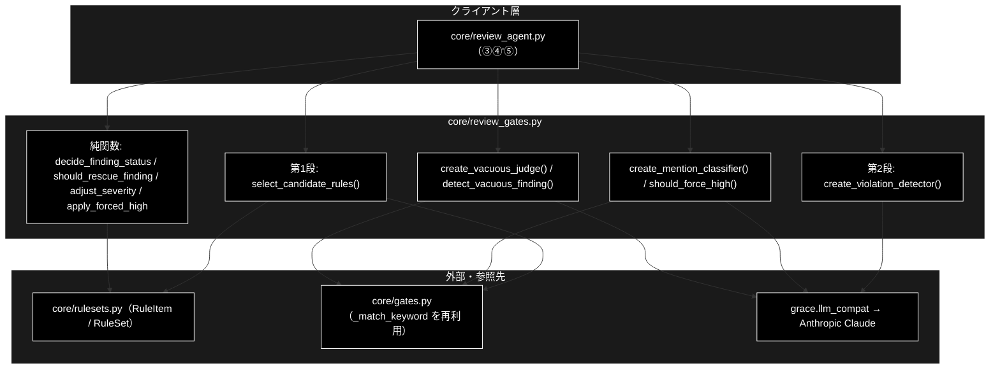
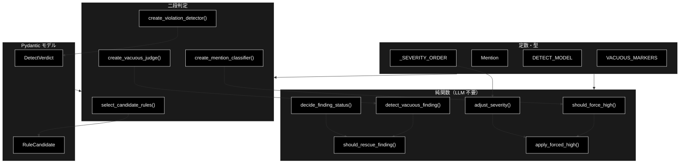
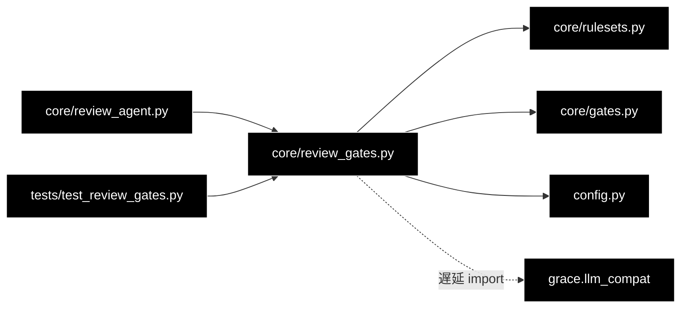

# core/review_gates.py - 文書レビューの判定・抑止ロジック ドキュメント

**Version 1.0** | 最終更新: 2026-07-29

---

## 目次

1. [概要](#概要)
2. [アーキテクチャ構成図](#1-アーキテクチャ構成図)
3. [モジュール構成図](#2-モジュール構成図)
4. [クラス・関数一覧表](#3-クラス関数一覧表)
5. [クラス・関数 IPO詳細](#4-クラス関数-ipo詳細)
6. [設定・定数](#5-設定定数)
7. [使用例](#6-使用例)
8. [エクスポート](#7-エクスポート)
9. [変更履歴](#8-変更履歴)
10. [付録: 依存関係図](#付録-依存関係図)

---

## 概要

`backend/app/core/review_gates.py` は、GRACE-Review の**判定と誤検知抑止**を担うモジュール。
`core/gates.py`（Support 側）と同じ立ち位置で、**副作用のない純関数**と、
**LLM クライアントを閉じ込めたファクトリ**の 2 種類だけを持つ。

パイプライン本体（`review_agent.py`）から判定ロジックを切り離しているのは、
しきい値の境界・救済条件・強制 high の可否を LLM 抜きで単体テストできるようにするため。

### Support との安全側の違い（最重要）

| 状況 | Support（`gates.py`） | Review（本モジュール） |
|---|---|---|
| 根拠検証が不能（`verified=False`） | `escalate`（回答しない） | **`review_required`（指摘を残す）** |
| 根拠がゼロ件 | `escalate` | **`review_required`** |
| 実質性判定の LLM が失敗 | `True`（情報なし扱い＝escalate） | **`False`（指摘を残す）** |

Support は「間違った回答を出す」のが最悪なので**黙る方**が安全側。Review は
「本当は違反なのに指摘が消える」のが最悪なので**人に見せる方**が安全側になる。
**方向が逆であることを取り違えると、危険側へ倒れる。**

### 主な責務

- 二段判定の第1段（キーワード・`always_check` による候補選択）
- 二段判定の第2段（LLM による抵触判定）のファクトリ提供
- 重大リスク語の言及種別分類（主張 / 否定 / 引用）
- 支持率から指摘の確定状態（`FindingStatus`）を決める
- 誤検知の抑止と、抑止からの救済
- 重大度（`Severity`）の調整と強制 high の適用

### 各責務対応のモジュール

| # | 責務 | 対応モジュール | 説明 |
|---|------|--------------|------|
| 1 | 第1段の候補選択 | `review_gates.py`（`select_candidate_rules`） | `rulesets.py` の keywords / always_check を参照 |
| 2 | 第2段の抵触判定 | `review_gates.py`（`create_violation_detector`） | `grace.llm_compat` 経由で Anthropic Claude |
| 3 | 言及種別の分類 | `review_gates.py`（`create_mention_classifier`） | 軽量モデルで否定・引用を弾く |
| 4 | 指摘ゲート | `review_gates.py`（`decide_finding_status`） | `gates._answer_gate` と同型 |
| 5 | 抑止と救済 | `review_gates.py`（`detect_vacuous_finding` / `should_rescue_finding`） | `gates._should_rescue_unaffirmed` と同型 |
| 6 | 重大度の確定 | `review_gates.py`（`adjust_severity` / `apply_forced_high`） | 根拠の強さで 1 段下げる／強制 high |

### 主要機能一覧

| 機能 | 説明 |
|------|------|
| `DetectVerdict` | 第2段の判定結果（Pydantic） |
| `RuleCandidate` | 第1段が選んだ候補ルール（Pydantic・イミュータブル） |
| `select_candidate_rules()` | 第1段: セグメントに対する候補ルールを選ぶ |
| `create_violation_detector()` | 第2段: 抵触判定の LLM 検出器を作る |
| `create_mention_classifier()` | 重大リスク語の言及種別を分類する検出器を作る |
| `should_force_high()` | 重大リスク語による強制 high の二段判定 |
| `create_vacuous_judge()` | 指摘文の実質性を判定する検出器を作る |
| `detect_vacuous_finding()` | 実質性なし（vacuous）の二段判定 |
| `decide_finding_status()` | 支持率から `FindingStatus` を決める |
| `should_rescue_finding()` | `suppressed` からの救済可否を決める |
| `adjust_severity()` | 根拠の強さで重大度を調整する |
| `apply_forced_high()` | 強制 high を適用する |

---

## 1. アーキテクチャ構成図

### 1.1 システム全体構成



### 1.2 データフロー

1. `review_agent.py` がセグメント本文を `select_candidate_rules()` へ渡す（LLM を呼ばない）
2. 候補が 0 件なら第2段は**一度も呼ばれない**（コスト制御の根幹）
3. 候補ごとに `detect(text, rule, evidence)` が抵触判定を返す（`None` = 判定失敗）
4. `GroundednessVerifier` の支持率を `decide_finding_status()` へ渡し `FindingStatus` を得る
5. `suppressed` は `should_rescue_finding()` で救済判定にかける
6. `adjust_severity()` → `should_force_high()` → `apply_forced_high()` で重大度を確定する

---

## 2. モジュール構成図

### 2.1 内部モジュール構成



### 2.2 外部依存関係

| ライブラリ | バージョン | 用途 |
|-----------|-----------|------|
| `pydantic` | 2.x | `DetectVerdict` / `RuleCandidate` の構造化出力 |

### 2.3 内部依存モジュール

| モジュール | 用途 |
|-----------|------|
| `backend.app.core.rulesets` | `RuleItem` / `RuleSet` / `Severity` / `FindingStatus` |
| `backend.app.core.gates` | `_match_keyword`（キーワード部分一致）を再利用 |
| `config` | `ModelConfig.DEFAULT_MODEL`（既定モデル） |
| `grace.llm_compat` | `create_chat_client`（LLM 呼び出し・遅延 import） |

> `grace.llm_compat` は**ファクトリ関数の内部で import** している。モジュール読み込み時に
> `grace` パッケージ全体（Qdrant クライアント等）を引き込まないための措置で、
> これにより純関数のテストは重い依存なしで走る。

---

## 3. クラス・関数一覧表

### 3.1 クラス一覧

#### DetectVerdict

| フィールド | 概要 |
|---------|------|
| `violates` | そのルールに抵触するか |
| `message` | 指摘内容（1〜2文） |
| `suggestion` | 修正案（1文） |
| `excerpt` | 該当箇所（対象テキストの部分文字列） |

#### RuleCandidate

| フィールド | 概要 |
|---------|------|
| `rule_id` | 候補になったルール ID |
| `matched_keyword` | 一致したキーワード（`always_check` の場合は `None`） |
| `always_check` | 常時チェックで候補になったか |

### 3.2 関数一覧（カテゴリ別）

#### 二段判定（ファクトリ・LLM を使う）

| 関数名 | 概要 |
|-------|------|
| `create_violation_detector(config)` | 抵触判定の検出器を返す |
| `create_mention_classifier(config)` | 言及種別（主張/否定/引用）の分類器を返す |
| `create_vacuous_judge(config)` | 指摘文の実質性判定器を返す |

#### 候補選択・二段判定の合成

| 関数名 | 概要 |
|-------|------|
| `select_candidate_rules(segment_text, ruleset)` | 第1段の候補選択（LLM 不要） |
| `should_force_high(text, ruleset, classify)` | 重大リスク語の二段判定 |
| `detect_vacuous_finding(message, judge)` | 実質性の二段判定 |

#### 判定（純関数・LLM 不要）

| 関数名 | 概要 |
|-------|------|
| `decide_finding_status(support_rate, verified, citation_count, notify_th, confirm_th)` | 指摘の確定状態を決める |
| `should_rescue_finding(status, has_contradiction, citation_count, message, judge)` | 救済可否を決める |
| `adjust_severity(base, support_rate, notify_th, confirm_th)` | 重大度を調整する |
| `apply_forced_high(severity, status, forced)` | 強制 high を適用する |

---

## 4. クラス・関数 IPO詳細

### 4.1 第1段（候補選択）

#### `select_candidate_rules`

**概要**: セグメントに対して第2段へ回すルール候補を選ぶ。ここで候補が 0 件なら
LLM 呼び出しは 1 回も発生しない。

```python
def select_candidate_rules(
    segment_text: str,
    ruleset: Optional[RuleSet],
) -> List[RuleCandidate]
```

| パラメータ | 型 | デフォルト | 説明 |
|------------|------|-----------|------|
| `segment_text` | str | - | 検査対象のセグメント本文 |
| `ruleset` | Optional[RuleSet] | - | 適用中のルールセット。`None` なら候補なし |

| 項目 | 内容 |
|------|------|
| **Input** | `segment_text: str`, `ruleset: Optional[RuleSet]` |
| **Process** | 1. `ruleset is None` なら空リスト<br>2. `always_check_rules` を全件候補に加える<br>3. `keyword_rules` を `_match_keyword` で部分一致判定し、一致したものを加える |
| **Output** | `List[RuleCandidate]`: 候補ルール。空なら第2段は走らない |

**戻り値例**:
```python
[
    RuleCandidate(rule_id="tokusho-01", matched_keyword=None, always_check=True),
    RuleCandidate(rule_id="tokusho-02", matched_keyword=None, always_check=True),
    RuleCandidate(rule_id="keihyo-03", matched_keyword="No.1", always_check=False),
]
```

```python
# 使用例
from backend.app.core.review_gates import select_candidate_rules
from backend.app.core.rulesets import get_ruleset

ruleset = get_ruleset("ec_ad")
candidates = select_candidate_rules("当社は業界No.1の品質です。", ruleset)
print([c.rule_id for c in candidates])
# ['tokusho-01', ..., 'tokusho-06', 'keihyo-03']
```

> **`always_check` が常に候補になる理由**: 特商法の表記漏れ（販売業者名が「無い」こと）は
> キーワード一致では原理的に検出できない。「無いこと」を確かめるには本文全体を見る必要が
> あるため、キーワード不問で第2段へ送る。

---

### 4.2 第2段（LLM 判定）

#### `create_violation_detector`

**概要**: `(セグメント本文, ルール, 規程根拠) → 抵触判定` の LLM 検出器を返す。

```python
def create_violation_detector(
    config,
) -> Callable[[str, RuleItem, str], Optional[DetectVerdict]]
```

| パラメータ | 型 | デフォルト | 説明 |
|------------|------|-----------|------|
| `config` | GraceConfig | - | LLM クライアント生成に使う設定 |

| 項目 | 内容 |
|------|------|
| **Input** | `config` |
| **Process** | 1. `grace.llm_compat.create_chat_client(config)` でクライアントを作る<br>2. クロージャ `detect(text, rule, evidence)` を返す |
| **Output** | `Callable[[str, RuleItem, str], Optional[DetectVerdict]]` |

返される `detect` の挙動:

| 項目 | 内容 |
|------|------|
| **Input** | `text: str`（セグメント本文）, `rule: RuleItem`, `evidence: str`（規程本文） |
| **Process** | 1. ルールの条文・判定基準・根拠をプロンプトへ埋め込む<br>2. 構造化出力で `DetectVerdict` を得る<br>3. 例外・パース失敗は `None` |
| **Output** | `Optional[DetectVerdict]`: `None` は**判定失敗**（呼び出し側は指摘を残す） |

**戻り値例**:
```python
DetectVerdict(
    violates=True,
    message="「業界No.1」は客観的な調査結果の出典が併記されておらず、優良誤認表示に該当するおそれがあります",
    suggestion="調査主体・調査期間・調査対象を併記するか、表現を削除してください",
    excerpt="業界No.1",
)
```

```python
# 使用例
detect = create_violation_detector(config)
verdict = detect("当社は業界No.1の品質です。", rule, "[規程] 景品表示法 第5条第1号 ...")
if verdict is None:
    print("判定失敗 → 指摘として残す（安全側）")
elif verdict.violates:
    print(verdict.message)
```

> ⚠️ **`None`（判定失敗）を「違反なし」と解釈してはならない。** `review_agent.py` は
> `verdict is None` のとき「自動判定に失敗したため要確認」という指摘を作って残す。
> ここを「違反なし」に倒すと、LLM が不安定なときに指摘が静かに消える。

---

### 4.3 重大リスク語の二段判定

#### `create_mention_classifier`

**概要**: 重大リスク語が**どう使われているか**（主張 / 否定 / 引用）を分類する検出器を返す。

```python
def create_mention_classifier(config) -> Callable[[str], Optional[Mention]]
```

| 項目 | 内容 |
|------|------|
| **Input** | `config` |
| **Process** | 軽量モデル（`claude-haiku-4-5-20251001`）のクライアントを閉じ込めたクロージャを返す |
| **Output** | `Callable[[str], Optional[Mention]]`: `"claim"` / `"negation"` / `"quotation"` / `None` |

#### `should_force_high`

**概要**: 重大リスク語による強制 high の二段判定。第1段はキーワード一致、第2段は言及種別の分類。

```python
def should_force_high(
    text: str,
    ruleset: Optional[RuleSet],
    classify: Optional[Callable[[str], Optional[Mention]]] = None,
) -> Tuple[bool, Optional[str], Optional[Mention]]
```

| パラメータ | 型 | デフォルト | 説明 |
|------------|------|-----------|------|
| `text` | str | - | 判定対象（指摘の該当箇所またはセグメント本文） |
| `ruleset` | Optional[RuleSet] | - | 適用中のルールセット |
| `classify` | Optional[Callable] | `None` | 第2段の分類器。`None` なら第2段を行わない |

| 項目 | 内容 |
|------|------|
| **Input** | `text: str`, `ruleset: Optional[RuleSet]`, `classify: Optional[Callable] = None` |
| **Process** | 1. `critical_keywords` の部分一致（不一致なら即 `(False, None, None)`）<br>2. `classify` で言及種別を判定<br>3. `negation` / `quotation` なら強制しない<br>4. 分類器なし・分類失敗（`None`）は**安全側＝強制する** |
| **Output** | `Tuple[bool, Optional[str], Optional[Mention]]`<br>- bool: 強制するか<br>- str: 一致したキーワード<br>- Mention: 言及種別 |

**戻り値例**:
```python
(True, "No.1", "claim")        # 主張として使っている → 強制 high
(False, "No.1", "negation")    # 「No.1 とは申しません」→ 強制しない
(False, None, None)            # 重大リスク語なし
```

```python
# 使用例
classify = create_mention_classifier(config)
forced, keyword, mention = should_force_high("業界No.1の品質です。", ruleset, classify)
print(forced, keyword, mention)   # True No.1 claim
```

---

### 4.4 誤検知の抑止

#### `create_vacuous_judge`

**概要**: 指摘文が実質的かを判定する軽量 LLM 判定器を返す。

```python
def create_vacuous_judge(config) -> Callable[[str], Optional[bool]]
```

| 項目 | 内容 |
|------|------|
| **Input** | `config` |
| **Process** | 軽量モデルのクライアントを閉じ込めたクロージャを返す |
| **Output** | `Callable[[str], Optional[bool]]`: `True`=実質性なし / `False`=実質的 / `None`=判定不能 |

#### `detect_vacuous_finding`

**概要**: 「問題ありません」型の中身のない指摘を検出する二段判定。

```python
def detect_vacuous_finding(
    message: str,
    judge: Optional[Callable[[str], Optional[bool]]] = None,
) -> Tuple[bool, Optional[str]]
```

| パラメータ | 型 | デフォルト | 説明 |
|------------|------|-----------|------|
| `message` | str | - | 指摘文 |
| `judge` | Optional[Callable] | `None` | 第2段の判定器 |

| 項目 | 内容 |
|------|------|
| **Input** | `message: str`, `judge: Optional[Callable] = None` |
| **Process** | 1. `VACUOUS_MARKERS` の部分一致（不一致なら `(False, None)`・LLM は呼ばない）<br>2. `judge` が `True` を返したときだけ `(True, marker)`<br>3. 判定器なし・判定失敗は**安全側＝残す**（`False`） |
| **Output** | `Tuple[bool, Optional[str]]`: (実質性なしか, 一致したマーカー) |

**戻り値例**:
```python
(True, "問題ありません")    # 中身のない指摘 → 抑止
(False, "特に問題")         # マーカーは一致したが LLM が「実質的」と判定
(False, None)               # マーカー不一致（LLM 未呼び出し）
```

> **Support と安全側が逆**: `gates._detect_no_info_answer` は判定失敗を `True`（escalate）に
> 倒すが、こちらは `False`（指摘を残す）が安全側。**落とす方向の判断だけを LLM に委ねる**
> 形にして、判定できないときに指摘が消えることを防いでいる。

---

### 4.5 指摘ゲートと救済（純関数）

#### `decide_finding_status`

**概要**: 根拠の支持率から指摘の確定状態を決める。`gates._answer_gate` と同型。

```python
def decide_finding_status(
    support_rate: float,
    verified: bool,
    citation_count: int,
    notify_th: float,
    confirm_th: float,
) -> FindingStatus
```

| パラメータ | 型 | デフォルト | 説明 |
|------------|------|-----------|------|
| `support_rate` | float | - | `GroundednessResult.support_rate`（0〜1） |
| `verified` | bool | - | 検証を実施できたか |
| `citation_count` | int | - | 根拠条文の件数 |
| `notify_th` | float | - | 自動確定のしきい値 |
| `confirm_th` | float | - | 保留のしきい値 |

| 項目 | 内容 |
|------|------|
| **Input** | 上記 5 パラメータ |
| **Process** | 1. 未検証・根拠ゼロ → `review_required`<br>2. `support_rate >= notify_th` → `confirmed`<br>3. `support_rate >= confirm_th` → `review_required`<br>4. それ未満 → `suppressed` |
| **Output** | `FindingStatus` |

**戻り値例**:
```python
"confirmed"        # support_rate=0.95, verified=True, citations=2
"review_required"  # support_rate=0.70
"suppressed"       # support_rate=0.30
"review_required"  # verified=False（Support なら escalate に倒すところ）
```

```python
# 使用例
status = decide_finding_status(0.95, True, 2, notify_th=0.85, confirm_th=0.60)
print(status)   # confirmed
```

> ⚠️ **未検証・根拠ゼロを `suppressed` にしない**のが Support との最大の違い。
> Support は「根拠が取れないなら答えない」が安全側だが、Review は
> 「根拠が取れないなら人に見せる」が安全側になる。

#### `should_rescue_finding`

**概要**: `suppressed` に落ちた指摘を `review_required` へ救済するか。
`gates._should_rescue_unaffirmed` と同型。

```python
def should_rescue_finding(
    status: FindingStatus,
    has_contradiction: bool,
    citation_count: int,
    message: str,
    judge: Optional[Callable[[str], Optional[bool]]] = None,
) -> bool
```

| パラメータ | 型 | デフォルト | 説明 |
|------------|------|-----------|------|
| `status` | FindingStatus | - | `decide_finding_status` の結果 |
| `has_contradiction` | bool | - | 規程と矛盾しているか |
| `citation_count` | int | - | 根拠条文の件数 |
| `message` | str | - | 指摘文 |
| `judge` | Optional[Callable] | `None` | 実質性判定器 |

| 項目 | 内容 |
|------|------|
| **Input** | 上記 5 パラメータ |
| **Process** | 1. `status != "suppressed"` なら `False`（救済不要）<br>2. 矛盾あり・根拠ゼロ・指摘文が空なら `False`<br>3. 実質性なし（vacuous）なら `False`<br>4. すべて通れば `True` |
| **Output** | `bool`: `True` なら `review_required` へ引き上げる |

**戻り値例**:
```python
True    # suppressed / 矛盾なし / 根拠 2 件 / 実質的な指摘文
False   # 矛盾あり（誤指摘の可能性が高い）
```

> **救済する理由**: 根拠検証器の出力はぶれる。支持率が下がっただけで指摘を捨てると、
> 本物の違反が消える。「規程と**矛盾していない**」なら残す、という条件で拾い直している。

---

### 4.6 重大度の確定（純関数）

#### `adjust_severity`

**概要**: ルール既定の重大度を、根拠の強さで調整する。

```python
def adjust_severity(
    base: Severity,
    support_rate: float,
    notify_th: float,
    confirm_th: float,
) -> Severity
```

| パラメータ | 型 | デフォルト | 説明 |
|------------|------|-----------|------|
| `base` | Severity | - | `RuleItem.severity_default` |
| `support_rate` | float | - | 支持率 |
| `notify_th` / `confirm_th` | float | - | しきい値 |

| 項目 | 内容 |
|------|------|
| **Input** | 上記 4 パラメータ |
| **Process** | 支持率が中程度（`confirm_th` 以上 `notify_th` 未満）なら 1 段下げる。それ以外は `base` のまま |
| **Output** | `Severity` |

**戻り値例**:
```python
"high"     # base="high", support_rate=0.95（>= notify_th）
"medium"   # base="high", support_rate=0.70（中程度 → 1 段下げ）
"high"     # base="high", support_rate=0.30（confirm_th 未満は ④' の管轄なので下げない）
```

> **中程度だけ下げる理由**: 根拠が弱い指摘を high のまま出すと、指摘リストの優先度が
> 信用されなくなる。`confirm_th` 未満は ④' で `suppressed` / 救済の対象なので、
> ここでは触らない。

#### `apply_forced_high`

**概要**: 重大リスク語による強制 high を適用する。

```python
def apply_forced_high(
    severity: Severity,
    status: FindingStatus,
    forced: bool,
) -> Tuple[Severity, FindingStatus]
```

| 項目 | 内容 |
|------|------|
| **Input** | `severity: Severity`, `status: FindingStatus`, `forced: bool` |
| **Process** | `forced=True` なら `("high", "review_required")` へ引き上げる。`False` ならそのまま |
| **Output** | `Tuple[Severity, FindingStatus]` |

**戻り値例**:
```python
("high", "review_required")   # forced=True（confirmed であっても人が見る）
("medium", "confirmed")       # forced=False
```

> **`confirmed` にしない理由**: 重大リスク語は「**必ず人が見る**」ための仕組みであり、
> 自動確定させてしまうと目的を達しない。

---

## 5. 設定・定数

| 定数 | 値 | 説明 |
|------|-----|------|
| `DETECT_MODEL` | `ModelConfig.DEFAULT_MODEL` | 第2段の抵触判定に使うモデル |
| `Mention` | `Literal["claim", "negation", "quotation"]` | 重大リスク語の言及種別 |
| `_SEVERITY_ORDER` | `("low", "medium", "high")` | 重大度の順序（調整時の 1 段下げに使う） |
| `VACUOUS_MARKERS` | 8 語 | 実質性なし判定の第1段候補句 |

`VACUOUS_MARKERS` の内容:

```python
("問題ありません", "問題はありません", "問題なし", "該当しません",
 "抵触しません", "違反しません", "指摘事項はありません", "特に問題")
```

---

## 6. 使用例

### 6.1 基本ワークフロー（③〜⑤ の一連）

```python
from backend.app.core.review_gates import (
    adjust_severity, apply_forced_high, create_mention_classifier,
    create_vacuous_judge, create_violation_detector, decide_finding_status,
    select_candidate_rules, should_force_high, should_rescue_finding,
)
from backend.app.core.rulesets import get_ruleset

ruleset = get_ruleset("ec_ad")
detect = create_violation_detector(config)
classify = create_mention_classifier(config)
judge = create_vacuous_judge(config)

segment = "当社の化粧品は業界No.1の実力です。"

# ③ 二段判定
for candidate in select_candidate_rules(segment, ruleset):
    rule = ruleset.rule_by_id(candidate.rule_id)
    verdict = detect(segment, rule, rule.description)
    if verdict is not None and not verdict.violates:
        continue

    # ④ Ground（GroundednessVerifier は review_agent.py 側）
    gres = verifier.verify(f"...{rule.title}...", verdict.message, [rule.description])

    # ④' Suppress + 救済
    status = decide_finding_status(
        gres.support_rate, gres.verified, 1, ruleset.notify_th, ruleset.confirm_th
    )
    if status == "suppressed" and should_rescue_finding(
        status, gres.has_contradiction, 1, verdict.message, judge
    ):
        status = "review_required"
    if status == "suppressed":
        continue

    # ⑤ Severity
    severity = adjust_severity(
        rule.severity_default, gres.support_rate, ruleset.notify_th, ruleset.confirm_th
    )
    forced, keyword, mention = should_force_high(verdict.excerpt, ruleset, classify)
    severity, status = apply_forced_high(severity, status, forced)
```

### 6.2 応用ワークフロー（純関数だけのテスト）

純関数は LLM も Qdrant も要らないため、境界値をそのまま検証できる。

```python
import pytest
from backend.app.core.review_gates import decide_finding_status

@pytest.mark.parametrize("rate,expected", [
    (0.85, "confirmed"),        # notify_th ちょうど → 確定
    (0.84, "review_required"),  # わずかに下 → 保留
    (0.60, "review_required"),  # confirm_th ちょうど → 保留
    (0.59, "suppressed"),       # わずかに下 → 抑止
])
def test_threshold_boundaries(rate, expected):
    assert decide_finding_status(rate, True, 1, 0.85, 0.60) == expected
```

---

## 7. エクスポート

`__all__` は定義していない。`review_agent.py` が import する公開要素は以下の 10 個。

```python
from backend.app.core.review_gates import (
    adjust_severity,
    apply_forced_high,
    create_mention_classifier,
    create_vacuous_judge,
    create_violation_detector,
    decide_finding_status,
    detect_vacuous_finding,
    select_candidate_rules,
    should_force_high,
    should_rescue_finding,
)
```

`DetectVerdict` / `RuleCandidate` はテストとスタブから参照する。

---

## 8. 変更履歴

| バージョン | 日付 | 変更内容 |
|-----------|------|---------|
| 1.0 | 2026-07-29 | 初版作成（GRACE-Review STEP2・PR #38 に対応） |

---

## 付録: 依存関係図



`grace.llm_compat` への依存は**ファクトリ関数の内部での遅延 import**（点線）。
これにより、純関数だけを使うテストは `grace` パッケージを読み込まずに済む。
