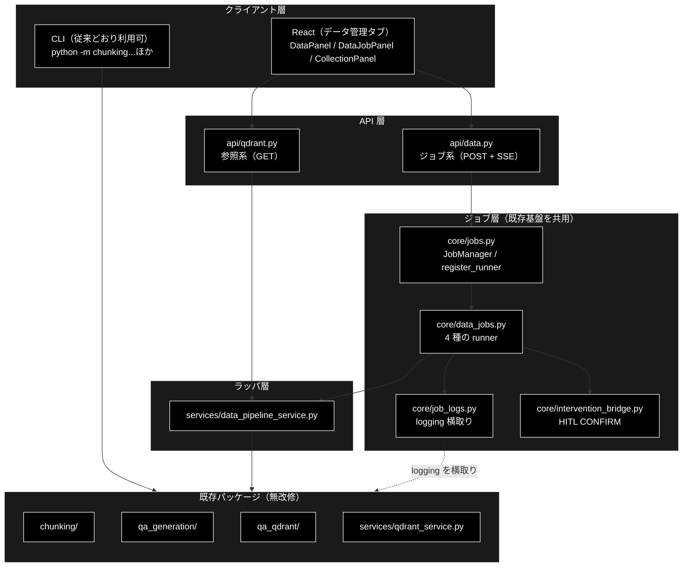
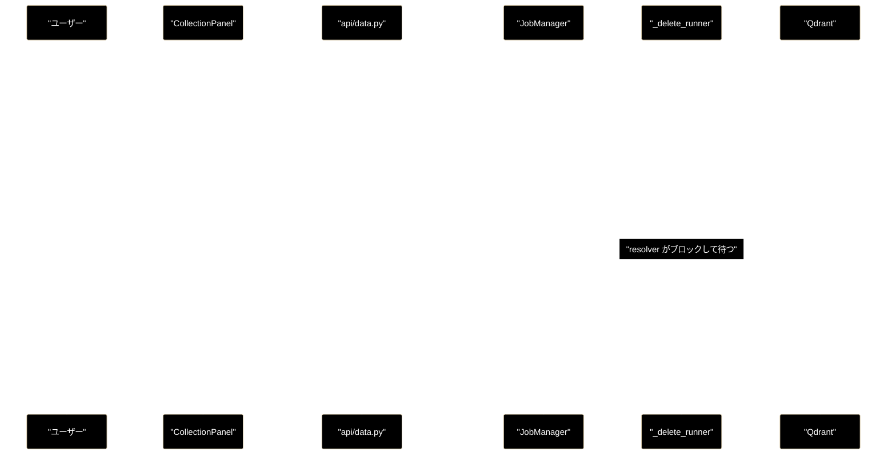
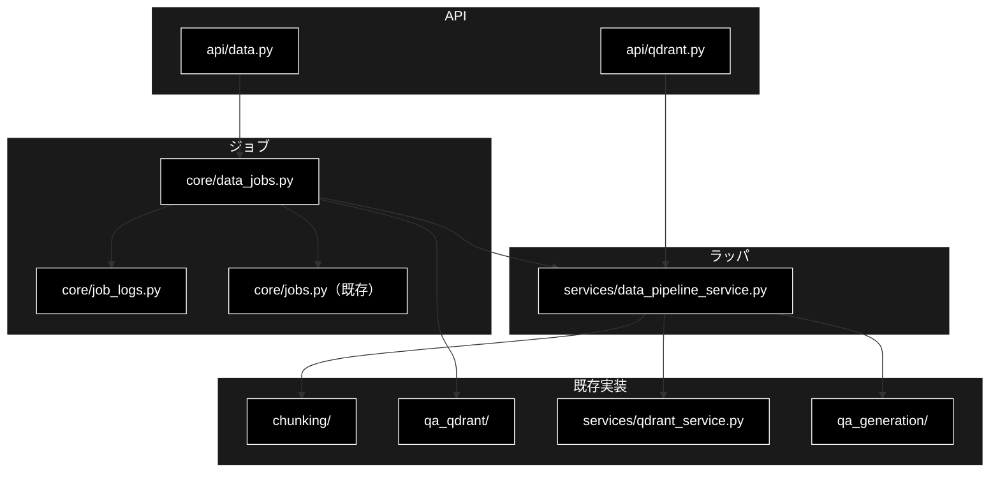
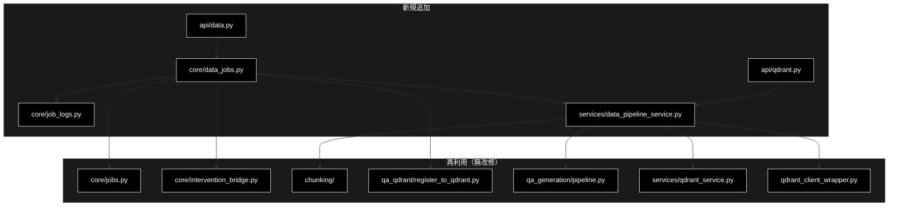

# データ準備パイプライン（チャンキング / Q/A 生成 / 登録 / 削除） ドキュメント

**Version 1.6** | 最終更新: 2026-09-16

---

## 目次

1. [概要](#概要)
2. [アーキテクチャ構成図](#1-アーキテクチャ構成図)
3. [モジュール構成図](#2-モジュール構成図)
4. [クラス・関数一覧表](#3-クラス関数一覧表)
5. [クラス・関数 IPO詳細](#4-クラス関数-ipo詳細)
6. [使用例](#5-使用例)
7. [エクスポート](#6-エクスポート)
8. [変更履歴](#7-変更履歴)
9. [付録B: 依存関係図](#付録b-依存関係図)

---

## 概要

CLI でしか実行できなかった**データ準備の 3 工程**（チャンク化 → Q/A 生成 → Qdrant 登録）と
コレクション管理を、Web API と React 画面から実行できるようにした一連のモジュール群。
**3 工程すべてが画面から実行できる**（Q/A 生成は v1.2 で追加）。

GRACE-Support・GRACE-Review と**同じジョブ基盤**（`core/jobs.py`）に乗せているため、
SSE による進捗配信・HITL CONFIRM・ジョブ管理を新規に実装していない。

| 層 | 実体 | 役割 |
|---|---|---|
| API（参照） | `backend/app/api/qdrant.py` | コレクション一覧・詳細・ポイント・ヘルス・ファイル一覧 |
| API（ジョブ） | `backend/app/api/data.py` | チャンク化・Q/A 生成・登録・削除の起動、SSE、HITL 応答 |
| runner | `backend/app/core/data_jobs.py` | 4 種のジョブ本体（`register_runner` で登録） |
| 進捗転送 | `backend/app/core/job_logs.py` | 既存パッケージの `logging` 出力を SSE イベントへ |
| ラッパ | `services/data_pipeline_service.py` | CLI に埋まっていた処理の関数化・JSON 化・パス検証 |

### 設計の前提：既存パッケージは 1 行も変更していない

`chunking/` `qa_generation/` `qa_qdrant/` `services/qdrant_service.py` の中身は
**Web 化のためには無改修**である（Web 対応を理由に手を入れていない、の意)。
v1.4 で `chunking/async_api_client.py` のモデル取り違えバグを直したが、これは
Web 化とは無関係の不具合であり、CLI でも同じく壊れていた。Q/A 生成も `qa_generation/pipeline.py::QAPipeline` を
そのまま呼ぶだけで、`qa_qdrant/make_qa_register_qdrant.py` の Phase 1 と
**同じ経路**を通る（CLI と Web で結果が食い違わない）。Web 化にあたって加えたのは以下だけ:

1. CLI の `main()` に埋まっていた処理を関数として取り出す層（`data_pipeline_service.py`）
2. `logging` 出力を SSE へ転送する仕組み（`job_logs.py`）
3. ジョブ基盤に載せる runner（`data_jobs.py`）

### 主な責務

- **チャンク化**: CSV / テキスト → セマンティックチャンク CSV（LLM・3 段階）
- **Q/A 生成**: チャンク済み CSV → Q/A ペア CSV・JSON（LLM・カバレージ分析つき）
- **Qdrant 登録**: Q/A CSV → コレクション（Embedding 生成つき）
- **コレクション管理**: 一覧・詳細・ポイントのプレビュー・削除
- **破壊的操作の承認**: 削除は常に、登録は `recreate=True` のときだけ HITL CONFIRM を通す
- **入力ファイルの安全な選択**: 許可ディレクトリのホワイトリスト内に限定する
- **進捗の可視化**: 既存モジュールを無改修のまま SSE で進捗を流す

### 実行の前提（プロバイダ）

| 用途 | プロバイダ | 既定 | 必要なもの |
|---|---|---|---|
| チャンク化の LLM | **ローカル LLM（Ollama）** | `gemma4:12b-mlx` | `ollama serve` ＋ `ollama pull gemma4:12b-mlx` |
| Q/A 生成の LLM | **ローカル LLM（Ollama）** | 同上 | 同上 |
| 登録時の Embedding | **Gemini** | `gemini-embedding-001`（3072次元） | `GOOGLE_API_KEY` |

⚠️ **データジョブの既定モデルは `config/grace_config.yml` の `llm.model`**
（＝ヘッダーの「利用モデル名」と同じ値）。`config.py::get_default_ollama_model()`
は yaml を読めないときのフォールバックであり、`.env` の
`OLLAMA_DEFAULT_MODEL` だけを変えても**この経路には効かない**
（詳細は §4.4）。

⚠️ **LLM 用の API キーは不要。** ローカル実行のためキーが存在しないので、
`_chunking_runner` / `_qa_runner` にキーの起動ガードは置いていない（置くと常に失敗する）。
Ollama への疎通不良は各処理の例外として捕捉し、error イベントで返す。

⚠️ **Embedding を Ollama にしてはいけない。** 既存 Qdrant コレクションの
次元（3072）を維持するための決定であり、変えると全件再登録が必要になる。

### 各責務対応のモジュール

| # | 責務 | 対応モジュール | 説明 |
|---|------|--------------|------|
| 1 | チャンク化 | `core/data_jobs.py::_chunking_runner` → `chunking/csv_text_to_chunks_text_csv.py` | `chunks_all_async` を同期ラップして呼ぶ |
| 2 | Q/A 生成 | `core/data_jobs.py::_qa_runner` → `qa_generation/pipeline.py::QAPipeline` | `make_qa_register_qdrant.py` の Phase 1 と同一経路 |
| 3 | Qdrant 登録 | `core/data_jobs.py::_register_runner` → `qa_qdrant/register_to_qdrant.py` | `register_to_qdrant()` は元から純関数 |
| 4 | 削除 | `core/data_jobs.py::_delete_runner` → `services/data_pipeline_service.py::delete_collection` | CLI に直書きだった処理を関数化 |
| 5 | 参照 | `api/qdrant.py` → `services/qdrant_service.py` | `QdrantDataFetcher` の DataFrame を JSON 化 |
| 6 | 承認 | `core/intervention_bridge.py`（既存） | Support / Review と同一の仕組み |
| 7 | 進捗 | `core/job_logs.py` | `logging.Handler` で横取り |
| 8 | パス検証 | `services/data_pipeline_service.py` | ホワイトリスト ＋ `resolve()` の二段 |

### 主要機能一覧

| 機能 | エンドポイント | 承認 |
|---|---|:---:|
| Qdrant 稼働確認 | `GET /api/qdrant/health` | — |
| コレクション一覧 | `GET /api/qdrant/collections` | — |
| コレクション詳細 | `GET /api/qdrant/collections/{name}` | — |
| ポイントのプレビュー | `GET /api/qdrant/collections/{name}/points` | — |
| 入力ファイル一覧 | `GET /api/files` | — |
| チャンク化の実行 | `POST /api/chunking/run` | なし |
| Q/A 生成の実行 | `POST /api/qa/generate` | なし |
| Qdrant 登録 | `POST /api/qdrant/register` | `recreate=True` のときだけ |
| コレクション削除 | `POST /api/qdrant/delete` | **常に** |
| 進捗の購読 | `GET /api/data/stream/{job_id}` | — |
| HITL 応答 | `POST /api/data/confirm/{job_id}` | — |
| 結果の取得 | `GET /api/data/result/{job_id}` | — |

---

## 1. アーキテクチャ構成図

### 1.1 システム全体構成



> **CLI は残す。** 大規模バッチや `--resume` は CLI の方が適しており、画面化の目的は
> 「小〜中規模の試行と可視化」である。両者は同じ関数を呼ぶので挙動は一致する。

### 1.2 承認フロー（削除の場合）



> ⚠️ **拒否・タイムアウトのいずれでも `delete_collection` は呼ばれない。**
> `_ask_confirmation()` が `(承認されたか, タイムアウトしたか)` を返し、
> 承認されていなければ実行前に return する。

---

## 2. モジュール構成図



---

## 3. クラス・関数一覧表

### 3.1 `backend/app/core/job_logs.py`

| 種別 | 名前 | 説明 |
|---|---|---|
| クラス | `JobLogHandler` | 自スレッドのログレコードだけを `emit` へ転送する Handler |
| 関数 | `capture_logs()` | 指定ロガーの出力を転送するコンテキストマネージャ |
| 定数 | `DEFAULT_LOGGER_NAMES` | `chunking` / `qa_generation` / `qa_qdrant` / `services` |

### 3.2 `services/data_pipeline_service.py`

| 種別 | 名前 | 説明 |
|---|---|---|
| 定数 | `ALLOWED_INPUT_DIRS` | 参照を許可するディレクトリ（4 件） |
| 例外 | `PathNotAllowedError` | 許可外パスを指した |
| 関数 | `resolve_allowed_dir()` | ディレクトリ名 → 絶対パス（検証つき） |
| 関数 | `list_input_files()` | 入力ファイル候補の列挙（更新日時降順） |
| 関数 | `resolve_input_file()` | `dir/name` → 実パス |
| 関数 | `delete_collection()` | コレクションを 1 つ削除（例外を投げず bool） |
| 関数 | `collection_exists()` | 存在確認 |
| 関数 | `dataframe_to_records()` | DataFrame → `list[dict]`（NaN → None） |
| 関数 | `collection_columns()` | レコード列から出現順に列名を抽出 |
| 関数 | `run_chunking_sync()` | `chunks_all_async` の同期ラッパ |
| 関数 | `run_qa_generation_sync()` | `QAPipeline.run()` の同期ラッパ（`asyncio.run()` は挟まない） |
| 関数 | `list_pulled_ollama_models()` | Ollama に pull 済みのモデル名（失敗時は空リスト） |
| 関数 | `load_input_text()` | CSV / テキストの読み込み |

### 3.3 `backend/app/core/data_jobs.py`

| 種別 | 名前 | 説明 |
|---|---|---|
| dataclass | `ChunkingParams` | チャンク化のパラメータ（CLI 引数と 1:1） |
| dataclass | `QaGenerationParams` | Q/A 生成のパラメータ（`model` は `Optional`・後述） |
| dataclass | `RegisterParams` | 登録のパラメータ |
| dataclass | `DeleteParams` | 削除のパラメータ |
| 関数 | `_chunking_runner()` | 読み込み → チャンク化 → 出力 |
| 関数 | `_qa_runner()` | 読み込み・検証 → Q/A 生成 → カバレージ → 出力 |
| 関数 | `_register_runner()` | 検証 → 承認（条件付き）→ Embedding → 登録 |
| 関数 | `_delete_runner()` | 対象確認 → 承認 → 削除 |
| 関数 | `_resolve_model()` | 使う LLM を決める。未指定はヘッダーと同じ既定へ |
| 関数 | `_model_not_pulled_message()` | 未 pull のモデルを LLM ループ前に検知する |
| 関数 | `_ask_confirmation()` | HITL CONFIRM を要求し `(承認, タイムアウト)` を返す |
| 定数 | `*_STEP_IDS` / `*_STEP_LABELS` | フロントの Timeline と 1:1 |

---

## 4. クラス・関数 IPO詳細

### 4.1 `capture_logs(emit_fn, logger_names, step, level)`

| 項目 | 内容 |
|---|---|
| **Input** | `emit_fn`（進捗の送信先）、`logger_names`（横取りするロガー）、`step`（イベントの step ID）、`level`（既定 INFO） |
| **Process** | ① `JobLogHandler` を生成（**生成時のスレッド ident を記録**）<br>② 対象ロガーに `addHandler`、level を参照カウント付きで引き上げ<br>③ `yield`<br>④ `finally` で `removeHandler` と level 復元 |
| **Output** | `JobLogHandler`（`set_step()` で転送先を切り替えられる） |

#### なぜスレッドで絞るのか

ハンドラは**ロガー（プロセス全体）**に付く。絞らないと、同時に走る別ジョブの
ログが自分の進捗として流れる。`record.thread` が生成時のスレッドと一致する
レコードだけを転送することで防ぐ。

#### なぜ level の復元に参照カウントが要るのか

素朴に「入るとき控えて出るとき書き戻す」と実装すると、**同時に 2 本走ったときに
復元されない**。

```
ジョブA: NOTSET(0) を控える → INFO(20) へ引き上げ
ジョブB: すでに 20 になっているものを「元の値」として控える
ジョブA: 終了 → 0 に戻す
ジョブB: 終了 → 20 に書き戻す   ← 元は 0 だった
```

結果、全ジョブ終了後もロガーが INFO のまま残り、コンソール出力が増え続ける。
最初に入った 1 本だけが元の値を持ち、最後に出る 1 本がそれを戻す方式にしてある。

> 回帰テスト: `backend/tests/test_job_logs.py::test_sequenced_jobs_restore_level`。
> Event で「A が入る → B が入る → A が出る → B が出る」の順序を固定している。
> **入れ子（後入れ先出し）では素朴実装でも通ってしまう**ため、そちらは回帰テストではない。

### 4.2 `resolve_input_file(rel_path, base)`

| 項目 | 内容 |
|---|---|
| **Input** | `rel_path`（`ディレクトリ名/ファイル名`）、`base`（基点。既定はカレント） |
| **Process** | ① `/` で 2 分割できるか検証<br>② ファイル名側に区切りが混ざっていないか検証<br>③ ディレクトリをホワイトリスト照合<br>④ `resolve()` 後に基点配下か検証<br>⑤ 実ファイルの存在確認 |
| **Output** | `Path`（絶対パス） |
| **例外** | `PathNotAllowedError` / `FileNotFoundError` |

**ホワイトリスト照合だけでは足りない。** `OUTPUT/../..` のような値に備えて
`resolve()` した結果が基点配下にあることも確認する（二段の検証）。

| 入力 | 結果 |
|---|---|
| `OUTPUT/a.csv` | ✅ 解決 |
| `a.csv` | ❌ 形式不正（ディレクトリ指定なし） |
| `OUTPUT/../../etc/passwd` | ❌ 形式不正（区切りが多い） |
| `logs/app.log` | ❌ 許可外ディレクトリ |
| `OUTPUT/..` | ❌ 親を指す |

### 4.3 `dataframe_to_records(df)`

| 項目 | 内容 |
|---|---|
| **Input** | pandas DataFrame（`QdrantDataFetcher.fetch_collection_points()` の戻り） |
| **Process** | `astype(object).where(pd.notnull(df), None)` で NaN を None へ寄せて `to_dict(orient="records")` |
| **Output** | `list[dict]` |

⚠️ **NaN を残すと不正な JSON になる。** JSON に NaN というリテラルは無く、
`json.dumps` が `NaN` という**パースできないトークン**を出力する。
列が揃わないコレクション（payload のキーがレコードごとに違う）では
必ず NaN が発生するため、この変換は必須である。

### 4.4 `_qa_runner(params, emit, confirm)`

| 項目 | 内容 |
|---|---|
| **Input** | `QaGenerationParams`（`input_file` / `output_dir` / `model` / `max_docs` / `use_celery` / `concurrency` / `batch_chunks` / `analyze_coverage`）、`emit`、`confirm`（未使用） |
| **Process** | ① 入力の解決・拡張子とテキストカラムの検証（`load`）<br>② `run_qa_generation_sync()` で Q/A 生成（`generate`）<br>③ カバレージ分析の結果を配信（`coverage`。無効なら skipped）<br>④ 出力ファイルの存在確認（`save`） |
| **Output** | `{"kind": "qa", "input_file", "qa_csv", "qa_json", "qa_count", "coverage_rate", "total_chunks", "model"}` |

`confirm` は使わない。Q/A 生成は既存データを壊さず、出力もタイムスタンプ付きの
新規ファイルなので、承認を挟む理由がない（削除・再作成とはここが違う）。

#### 既定モデルの解決は `_resolve_model()` の 1 箇所だけ（v1.3）

`ChunkingParams.model` / `QaGenerationParams.model` はどちらも
`Optional[str] = None`。**dataclass にも pydantic にも既定値を焼き付けない。**
未指定は runner まで運び、`_resolve_model()` で 1 回だけ解決する。

```python
model = _resolve_model(params.model)   # None / 空文字 / 空白 → 既定へ
```

##### 既定は「ヘッダーが表示している値」

`_resolve_model()` が返す既定は **`GET /api/model` と同じ**
`get_config().llm.model`（`grace_config.yml` 適用後）である。
`config.py::get_default_ollama_model()` は**フォールバックとしてのみ**使う。

| 経路 | 既定の出どころ |
|---|---|
| ヘッダー「利用モデル名」・GRACE エージェント | `grace_config.yml` の `llm.model` |
| `config.py::get_default_ollama_model()` | 環境変数 `OLLAMA_DEFAULT_MODEL` |

`grace_config.yml` は `llm.model` を明示しているため、`.env` に
`OLLAMA_DEFAULT_MODEL` を書いても**ヘッダー側は変わらない**。
v1.2 まではデータジョブだけが環境変数を見ていたので、両者が割れると

```
画面: 利用モデル名：gemma4:12b-mlx
実行: model 'gemma4:e4b' not found  ← 404 が全ブロックに出る
```

という食い違いが起きた（2026-09-05 に実機で発生）。解決を 1 本にすれば
この食い違いは**起き得なくなる**。

> 回帰テスト:
> `::test_request_default_model_agrees_with_header_under_env_override`
> — 既定は import 時に確定するため、同一プロセス内の monkeypatch では
> 捕まえられない。`OLLAMA_DEFAULT_MODEL` を与えた**子プロセス**で、
> リクエストが既定を焼き付けていないことを確認する。
> ほかに `::test_chunking_default_model_is_not_baked_in` /
> `::test_resolve_model_prefers_the_value_the_header_shows` /
> `::test_resolve_model_falls_back_when_grace_config_unavailable`。

空文字（`model: ""`）も既定へ倒す。フロントは
`state/dataParams.ts::modelOverride()` でキーごと省略するが、
サーバー側でも二重に潰しておく（`min_length` は付けていないので
`""` は pydantic の検証を通ってしまう）。

#### 選んだモデルが実際に使われることは、別に確かめる（v1.4）

`_resolve_model()` が正しい名前を返しても、**その先で捨てられていたら意味がない。**
実際そうなっていた:

```
チャンク化処理開始 (3段階)
モデル: gemma4:12b-mlx                          ← 解決結果は正しい
OllamaClient initialized: ... model=gemma4:e4b  ← 実際に使われたのは別物
[step1_block_242] Error: 404 model 'gemma4:e4b' not found
```

原因は `chunking/async_api_client.py::AsyncAPIClient._resolve_model()` に残っていた
Anthropic 移植時代の分岐で、**モデル名が `claude` で始まらなければ捨てて既定へ
差し替える**というものだった。Ollama のモデル名は `claude` で始まらないので、
**呼び出し側が渡したモデルは常に捨てられていた**。

| 層 | v1.3 まで | v1.4 |
|---|---|---|
| `_resolve_model()`（data_jobs） | ✅ 正しい名前を返す | 同じ |
| `chunks_all_async(model=...)` | ✅ 受け取る | 同じ |
| `client.generate_content(model=...)` | ✅ 渡す | 同じ |
| `AsyncAPIClient._resolve_model()` | ❌ **捨てる** | ✅ そのまま使う |

⚠️ **「モデル名からプロバイダを推測して差し替える」分岐を書かないこと。**
呼び出し側が決めたモデルをそのまま使う。差し替えると、画面の選択も
設定も、この 1 行で無効化される。

> 回帰テスト: `backend/tests/test_chunking_model_passthrough.py`
> — `_resolve_model` の単体だけでなく、`generate_content(model=X)` の X が
> **`generate_structured` まで届くこと**を実際に確認する（経路のどこかで
> 落ちていても単体テストでは気づけないため）。

あわせて `chunks_all_async` の `ANTHROPIC_API_KEY` 起動ガードを削除した。
LLM はローカル実行でキーが存在せず、キーを消した環境では
チャンク化が必ず失敗していた（CLAUDE.md のプロバイダ方針どおり）。

#### 連続失敗は中断する（v1.5）

事前確認を通り、モデルも正しく渡っても、**LLM が応答しない**ことはある。
実測（2026-09-06・M2 MacBook Air / `gemma4:12b-mlx`）:

```
[step1_block_99] Error: Request timed out.. Retrying in 1s (attempt 1/3)
[step1_block_69] Failed after 3 retries. Using fallback.
Step1: 段落分割:  0%| | 1/1229 [09:03<185:17:07, 543.18s/it]
```

1 ブロック 543 秒（180 秒 × 3 回）× 1229 ブロック = **185 時間**。しかも
全ブロックがフォールバック（機械的分割）なので、出来上がるのは中身のない CSV。
**失敗しているのに止まらず、最後は「成功」になる。** 404 のときと同じ構図で、
原因が変わっても被害は同じ。

`AsyncAPIClient` は連続失敗を数え、既定 3 回で `ChunkingAbortedError` を投げる。
`_chunking_runner` がこれを error イベントへ変換する。

| 環境変数 | 既定 | 意味 |
|---|---|---|
| `CHUNKING_ABORT_AFTER_FAILURES` | `3` | 連続失敗の許容回数（`0` で無効＝従来どおり完走） |
| `CHUNKING_LLM_TIMEOUT` | 未設定 | チャンク化の LLM タイムアウト（秒）。未設定なら `OLLAMA_TIMEOUT`（180）に従う |

⚠️ **タイムアウトの既定は変えていない。** 延ばせば「遅いだけのモデル」は
通るようになるが、**失敗の検知も同じだけ遅くなる**（3 連続失敗までに
`timeout × 3 × 3` 秒かかる）。遅いと分かっている環境で明示的に延ばす。

#### 出力トークン上限は必要量に合わせる（v1.5）

`chunks_all_async` は `max_output_tokens=16384` を渡していた。チャンクは
`MAX_CHUNK_TOKENS = 512` で切られ、入力ブロックも既定 1000 文字なので、
**実際に使う量の 16〜32 倍**である。Ollama ではこの値がそのまま `num_predict`
になり、モデルが停止トークンを出さないと上限まで生成し続けるため、
1 リクエストの最悪時間を決めてしまう。8192（モデルの `max_output` と同値）へ下げた。

#### ⚠️ ローカル LLM の処理量そのものは減らない

上記はいずれも「失敗を早く正しく知る」ための修正で、**処理を速くはしない**。
1.2M 文字 = 1229 回の LLM 呼び出しであり、M2 MacBook Air ＋ 12B モデルでは
1 呼び出しが数十秒〜数分かかる。現実的な手は次のとおり:

| 手 | 効果 |
|---|---|
| **最大行数**を小さくする（画面のフォーム） | 入力量に比例して呼び出し回数が減る。まずこれで所要時間を測る |
| 並列ワーカー数を下げる | ローカル LLM は同時実行で 1 本あたりが遅くなる。1〜2 が無難 |
| ブロックサイズを上げる | ブロック数は減るが 1 回の出力が伸びるので、総量はあまり変わらない |
| 軽いモデルを選ぶ | `llama3.2:latest`（2.0 GB）など。品質とのトレードオフ |

**まず 10〜20 行で 1 回通し、1 ブロックあたりの実測時間を掴んでから**
全量に掛けること。

#### 未 pull のモデルは LLM ループに入る前に弾く（v1.3）

`_model_not_pulled_message()` が Ollama の OpenAI 互換 `GET /models` を引き、
解決したモデルが無ければ `load` ステップで error にする。

**これが無いと止まらない。** チャンク化も Q/A 生成も 1 ブロックにつき
3 回リトライしてからフォールバック（機械的な分割）へ落ちる作りなので、
未 pull のモデル名で走らせると 404 を数千回出しながら最後まで進み、
中身のない CSV を「成功」として書く。

| 一覧の取得 | 挙動 |
|---|---|
| 取れた ＋ モデルがある | そのまま実行 |
| 取れた ＋ **モデルが無い** | **error**（pull 済み一覧と `ollama pull <名前>` を提示） |
| **取れない**（疎通不良・形式が違う） | **素通り**（判定不能で止めない） |

⚠️ **取れないときに止めないのは意図的。** ここは事前確認であって本処理では
ないので、確認の失敗を理由に実際には動くジョブを落とさない。疎通そのものが
死んでいれば本処理の例外として捕捉される。

⚠️ **この確認は「解決したモデル」に対して行う。** 実際に使われるモデルが
別物にすり替わっていると、確認は通るのに 404 が出る（v1.4 で修正した
`AsyncAPIClient._resolve_model()` のバグが、まさにこの状態だった）。

> 回帰テスト: `::test_chunking_stops_before_the_llm_loop_when_model_is_not_pulled` /
> `::test_qa_stops_before_the_llm_loop_when_model_is_not_pulled` /
> `::test_model_check_does_not_block_when_the_list_is_unavailable` /
> `::test_list_pulled_ollama_models_parses_and_never_raises`。

#### 入力の検証を `load` ステップで先に行う

`QAPipeline` はテキストカラムが無いと読み込み後に `ValueError` を投げる。
そのまま流すと「LLM を呼ぶ前に分かる誤り」が**生成ステップの失敗**として見える。

そこで `_qa_runner` は生成の前に、

1. 拡張子が `.csv` か（チャンク済み CSV 以外は弾く）
2. `pd.read_csv(nrows=1)` でヘッダだけ読み、`text` / `Combined_Text` /
   `content` / `chunk_text` のいずれかがあるか

を確認し、無ければ `load` ステップの error として返す。1 行しか読まないので
大きな CSV でもコストは無視できる。

#### 例外を出さずに 0 件だったときも失敗にする

`qa_count == 0` は例外ではないが、**後続の Qdrant 登録が空振りする**。
「成功したのに 0 件」を黙って通さず error にしている。

| 状況 | 挙動 |
|---|---|
| 生成成功（1 件以上） | `save` まで進み result を返す |
| **生成 0 件** | **error**（モデル名・チャンク内容・ワーカー状態の確認を促す） |
| `analyze_coverage=False` | `coverage` を `skipped` にして `save` へ |
| Celery 使用時の例外 | error メッセージに**ワーカー起動の確認**を追記する |

⚠️ **Celery を使うならワーカーが起動していること。** 落ちていると
`QAPipeline` が例外を投げる。runner はこれを捕捉し、
「Celery を外して再実行」を促すヒントを添えて error イベントに変換する。

### 4.5 `_delete_runner(params, emit, confirm)`

| 項目 | 内容 |
|---|---|
| **Input** | `DeleteParams(collections)`、`emit`、`confirm` |
| **Process** | ① 対象の存在と件数を確認（`inspect`）<br>② **HITL CONFIRM**（`confirm`）<br>③ 承認されたら削除（`delete`） |
| **Output** | `{"kind": "delete", "deleted": [...], "failed": [...], "missing": [...], "cancelled": bool}` |

| 状況 | 挙動 |
|---|---|
| 承認 | 削除する |
| **拒否** | **削除しない**。`cancelled: true` で完了 |
| **タイムアウト** | **削除しない**（安全側）。`reason` に「タイムアウト」 |
| 一部が存在しない | 存在する分だけ削除し、`missing` に載せる |
| 全部存在しない | 承認を求めず error |

承認画面には**対象名と合計件数**を出す（何が消えるか分からないまま押させない）。

### 4.6 `_register_runner(params, emit, confirm)`

承認を求める条件は **`recreate=True` かつ既存コレクションがある**ときだけ。

| `recreate` | コレクション | 承認 | 理由 |
|:---:|---|:---:|---|
| `False` | 任意 | 不要 | 既存を壊さない（追記） |
| `True` | 存在する | **必要** | 削除して作り直す＝破壊的 |
| `True` | 存在しない | 不要 | 壊すものが無い |

毎回ダイアログを出すと煩わしいため、**破壊を伴う場合に限定**している。

---

## 5. 使用例

### 5.1 画面から（推奨）

```bash
./run_dev.sh          # backend :8000 + frontend :5173
# → ブラウザで「データ管理」タブ
#   ① チャンキング → ② Q/A 作成 → ③ Qdrant 登録 → ④ コレクション管理
```

### 5.2 API を直接叩く

```bash
# コレクション一覧
curl -s localhost:8000/api/qdrant/collections | jq

# 入力ファイル候補
curl -s 'localhost:8000/api/files?dir=OUTPUT' | jq '.files[].path'

# チャンク化を起動して進捗を眺める
JOB=$(curl -s -X POST localhost:8000/api/chunking/run \
  -H 'Content-Type: application/json' \
  -d '{"input_file":"OUTPUT/cc_news_1per.csv","workers":8}' | jq -r .job_id)
curl -N localhost:8000/api/data/stream/$JOB

# Q/A 生成（入力はチャンク化の出力 CSV）
JOB=$(curl -s -X POST localhost:8000/api/qa/generate \
  -H 'Content-Type: application/json' \
  -d '{"input_file":"output_chunked/cc_news_1per_chunks.csv","batch_chunks":3}' | jq -r .job_id)
curl -N localhost:8000/api/data/stream/$JOB
```

> `model` を省略すると `config.py::get_default_ollama_model()` の値が使われる。
> **空文字を送ってはいけない**（空のモデル名で LLM を呼ぶことになる）。

### 5.3 進捗を見失ったとき（再購読）

フロントはタブ切替でパネルをアンマウントするため SSE 購読が切れるが、
`job_id` を覚えておけば購読し直せる。**`Job.stream_events()` は常にイベントを
先頭からリプレイする**ので、再購読するだけでタイムラインも承認待ちも復元される。

```bash
# ジョブがまだ存在するかを先に確かめる（消えていれば 404）
curl -s localhost:8000/api/data/result/$JOB | jq '{status, kind}'

# 生きていれば購読し直す。先頭から全イベントが流れてくる
curl -N localhost:8000/api/data/stream/$JOB
```

> ⚠️ **存在確認を挟むのが重要。** 完了ジョブは 50 件で GC される
> （`MAX_FINISHED_JOBS`）。消えた `job_id` に SSE で直接つなぐと、
> フロント側では `onerror` が発火して「切断されました」という**誤ったエラー**になる。

### 5.4 削除（承認が要る）

```bash
JOB=$(curl -s -X POST localhost:8000/api/qdrant/delete \
  -H 'Content-Type: application/json' \
  -d '{"collections":["old_collection"]}' | jq -r .job_id)

# SSE に intervention が流れるので intervention_id を取り、承認する
curl -s -X POST localhost:8000/api/data/confirm/$JOB \
  -H 'Content-Type: application/json' \
  -d '{"intervention_id":"<SSE で受け取った ID>","approve":true}'
```

> 承認しなければ削除されない。**承認を経ずに消す API は用意していない**
> （HTTP `DELETE` メソッドを使っていないのはこのため）。

### 5.4 CLI（従来どおり）

```bash
# 大規模バッチ・--resume は CLI の方が適している
python -m chunking.csv_text_to_chunks_text_csv \
  --input-file OUTPUT/cc_news_1per.csv --output output_chunked
python qa_qdrant/make_qa_register_qdrant.py    # Q/A 生成 + 登録（Phase 1 + 2）
python qa_qdrant/register_to_qdrant.py --input-file qa_output/x.csv --collection x
python qdrant_delete_collection.py x --yes
```

---

## 6. エクスポート

### `backend/app/core/job_logs.py`

```python
__all__ = ["JobLogHandler", "capture_logs", "DEFAULT_LOGGER_NAMES", "EmitFn"]
```

### `services/data_pipeline_service.py`

```python
ALLOWED_INPUT_DIRS, PathNotAllowedError,
resolve_allowed_dir, list_input_files, resolve_input_file,
delete_collection, collection_exists,
dataframe_to_records, collection_columns,
run_chunking_sync, run_qa_generation_sync, load_input_text,
list_pulled_ollama_models
```

### `backend/app/core/data_jobs.py`

```python
ChunkingParams, QaGenerationParams, RegisterParams, DeleteParams
CHUNKING_STEP_IDS, QA_STEP_IDS, REGISTER_STEP_IDS, DELETE_STEP_IDS
CHUNKING_STEP_LABELS, QA_STEP_LABELS, REGISTER_STEP_LABELS, DELETE_STEP_LABELS
```

> runner（`_chunking_runner` 等）は private。`register_runner()` により
> **params の型から解決される**ので、外から直接呼ぶ必要はない。

---

## 7. 変更履歴

| 版 | 日付 | 変更内容 |
|---|---|---|
| 1.0 | 2026-08-05 | 初版作成（D0〜D10） |
| 1.1 | 2026-08-05 | 再購読（タブ離脱後の進捗復元）の節を追加。`stream_events()` が先頭からリプレイする性質に依存することを明記 |
| 1.6 | 2026-09-16 | 文書再編 Phase 2。`review_rules_collection.md` を**付録A**へ統合し、旧「付録: 依存関係図」を**付録B**へ繰り下げた |
| 1.5 | 2026-09-06 | LLM 呼び出しが連続失敗したら `ChunkingAbortedError` で**中断**するようにした（従来は 1229 ブロックすべてフォールバックで「成功」していた）。`max_output_tokens` を 16384 → 8192 へ。`CHUNKING_ABORT_AFTER_FAILURES` / `CHUNKING_LLM_TIMEOUT` を追加 |
| 1.4 | 2026-09-06 | `AsyncAPIClient._resolve_model()` が **"claude" で始まらないモデル名を捨てていた**バグを修正（画面で選んだモデルが常に無視されていた）。`AsyncAPIClient` の既定モデルを import 時に焼き付けないようにし、`chunks_all_async` からクライアントへもモデルを渡す。`ANTHROPIC_API_KEY` の起動ガードを削除 |
| 1.3 | 2026-09-05 | 既定モデルの解決を `_resolve_model()` の 1 箇所に集約し、**ヘッダー（GET /api/model）と同じ値**に揃えた（`ChunkingParams.model` / `ChunkingRequest.model` を `Optional` 化）。未 pull のモデルを LLM ループ前に検知する `_model_not_pulled_message()` / `list_pulled_ollama_models()` を追加 |
| 1.2 | 2026-09-05 | **Q/A 生成ジョブを追加**（`POST /api/qa/generate` / `QaGenerationParams` / `_qa_runner` / `run_qa_generation_sync`）。既定モデルの実行時解決・入力検証の前倒し・0 件の扱いを §4.4 に記載。既定モデル表記を `gemma4:e4b` から `gemma4:12b-mlx` へ是正 |

---

## 付録B: 依存関係図



**新規 5 ファイルに対し、再利用 7 ファイルは無改修。** `jobs.py` の
`register_runner` 機構と `InterventionBridge` が、そのまま 4 種類目の
ジョブ系統（Q/A 生成）を受け入れられる設計だったことによる。
Q/A 生成の追加で新しく書いたのは、ラッパ 1 関数・runner 1 つ・
dataclass 1 つ・エンドポイント 1 本だけである。

---

## 付録A: 規程コレクションの準備（GRACE-Review 用）

> 📝 旧 `review_rules_collection.md` を統合した付録（2026-09-16）。
> ルールセットの設計は [`verticals_and_rulesets.md` §2](./verticals_and_rulesets.md)、
> 使われ方は [`review_flow.md` §4.3](./review_flow.md) を参照。

### A.1 なぜ必要か

`ec_ad` の検索スコープは 2 つだが、**`ec_ad_rules_anthropic` が未登録**である。

```
検索スコープ: ec_ad_rules_anthropic, ec_policy_anthropic
（未登録コレクションは条文フォールバックを使用）
```

実測（2026-08-17 20:07 〜 2026-08-18 21:41）では、常時チェック 7 ルール中 **6 つが
規程 0 件**だった。

```
doc/tokusho-01: 文書全体で判定 / 規程 0 件
doc/tokusho-02: 文書全体で判定 / 規程 0 件
doc/tokusho-03: 文書全体で判定 / 規程 0 件
doc/tokusho-05: 文書全体で判定 / 規程 0 件
doc/tokusho-06: 文書全体で判定 / 規程 0 件
doc/policy-01:  文書全体で判定 / 規程 0 件
```

実在するのは `ec_policy_anthropic`（返品・返金・交換の FAQ）だけで、**特商法の条文は
1 件も入っていない**。そのため:

- 指摘の根拠がすべて `RuleItem.description`（条文フォールバック）になる
- `policy-01`（社内規程との整合）が**原理的に機能しない** — 自社の「返品 14 日」を
  根拠として引けないため、「8 日 vs 14 日」を検出できない
- **RAG 経路が一度も検証されていない**

---

### A.2 CSV の形式

`qa_qdrant/register_to_qdrant.py` は `question` と `answer` があれば、
`question + "\n" + answer` を Embedding 対象として自動検出する。

| 列 | 必須 | 用途 |
|---|---|---|
| `question` | ✅ | Embedding 対象。**UI の引用ラベル**（`[規程] …`）にもなる |
| `answer` | ✅ | Embedding 対象。**④ Ground へ渡す根拠本文**になる |
| `topic` | — | payload の来歴（任意）。`chunk_id` / `doc_id` も同様に保持される |

Review 側の読み取り（`review_agent._retrieve_evidence`）:

```python
title = payload.get("title") or payload.get("question") or "(規程)"
body  = payload.get("answer") or payload.get("text") or ""
```

### ⚠️ `evidence_min_score = 0.70` を超える必要がある

`RuleSet.evidence_min_score`（既定 0.70）未満の規程は根拠として採用されない。
② Retrieve の検索クエリは **ルール本文**である。

```python
_retrieve_evidence(tool_registry, f"{rule.title} {rule.description}", rs, ...)
```

したがって `question` に**ルールのタイトル**、`answer` に**その条文の内容**を置くと、
埋め込み対象がクエリとほぼ同じ文になり、閾値を余裕で超える。逆に、無関係な語彙で
書くと 0.70 に届かず条文フォールバックのままになる（`ec_policy_anthropic` の
返品 FAQ が 0.6784 止まりだったのがその例）。

---

### A.3 手順

### 3-1. 雛形 CSV を書き出す

```bash
PYTHONPATH=. python3 scripts/export_ruleset_to_csv.py --ruleset ec_ad
# → qa_output/ec_ad_rules.csv（22 行）
```

出力例:

```csv
question,answer,topic
景品表示法 第5条第1号（優良誤認表示）,商品・サービスの品質、規格その他の内容について…,優良誤認
特定商取引法 第11条（販売価格・送料の明示）,通信販売の広告には、商品の販売価格（消費税込み）を…,表記漏れ
```

### 3-2. ⚠️ `answer` を実際の条文へ置き換える

**ここが本番。** 書き出された `answer` は `RuleItem.description`、つまり
**このリポジトリ自身の要約**である。`rulesets.py` の冒頭にあるとおり:

> 本ルールセットは技術検証用のサンプルであり、法務レビューを受けていない。

**登録しただけでは、根拠の中身は条文フォールバックと同じ**になる。RAG が意味を
持つのは、`answer` を実際の条文・ガイドライン本文へ置き換えてからである。

置き換えの出典として想定されるもの:

| 法令 | 一次情報 |
|---|---|
| 特定商取引法 | e-Gov 法令検索の条文、消費者庁「特定商取引法ガイド」の通信販売の広告表示 |
| 景品表示法 | e-Gov の条文、消費者庁の運用基準（No.1 表示・打消し表示・二重価格表示の各ガイドライン） |
| 医薬品医療機器等法 | e-Gov の条文、「医薬品等適正広告基準」および解説通知 |

1 条文が長い場合は、**判定に使う単位で行を分ける**（例: 第11条を「販売価格・送料」
「支払時期・方法」「引渡時期」「返品特約」「事業者情報」の 5 行に分ける）。
`question` は必ず対応するルールのタイトルを含めること — 含めないと検索が当たらない。

> **法務監修を通してから本番運用すること。** 誤った条文を根拠として提示すると、
> 指摘そのものが誤りになる。

### 3-3. `policy-01` 用に自社規程の行を足す

`policy-01`（表示内容と社内規程の不一致）は**自社の実データ**が無いと機能しない。
検索クエリはこれ:

```
表示内容と社内規程の不一致 広告に表示した取引条件（返品期限・送料負担・解約条件・
価格など）が、社内規程に定めた条件と食い違っていないかを確認する。…
```

現状 `ec_policy_anthropic` の返品 FAQ は **0.6784** で 0.70 に届かない。以下のように
**取引条件を一覧化した行**を足すと当たりやすくなる。

```csv
question,answer,topic
社内規程（取引条件の一覧）,返品期限: 商品到着後14日以内かつ未使用・未開封。お客様都合の返品は返送料をお客様負担。不良品・誤配送は当ストア負担。交換: 商品到着後14日以内、未使用品に限り1回まで。解約: 定期購入は次回お届け予定日の5日前までにマイページから。解約手数料なし。,規程不一致
```

> ⚠️ **この行の中身は各社の実際の規程に置き換えること。** 上の例は
> `ec_policy_anthropic` に既に登録されている値を一覧化しただけで、
> 監修済みの規程ではない。

#### `policy-01` は条文コレクションを検索しない

`policy-01` は `RuleItem.evidence_query` / `evidence_collections` で **② の検索を
上書き**している（`rulesets.py`）。

| | 既定のルール | `policy-01` |
|---|---|---|
| クエリ | `f"{title} {description}"` | 取引条件の語（`返品 交換 解約 送料 期限 …`） |
| 検索先 | `RuleSet.collections`（2 つ） | `ec_policy_anthropic` **のみ** |

**理由は自己一致。** `ec_ad_rules_anthropic` にはルール自身が 1 行として入って
いるので、ルール本文で検索すると自分を引き当てる（実測 2026-08-19 06:11 で
**0.9380**）。本命の「返品規定（14日）」は 0.6647 で、絶対閾値にも
`evidence_top_ratio`（0.9380 × 0.92 = 0.863）にも阻まれて**構造的に採用されない**。

したがって **`policy-01` を機能させるには `ec_policy_anthropic` 側に取引条件が
入っている必要がある。** 上の 3-3 の行はそちらへ登録する。

```bash
python qa_qdrant/register_to_qdrant.py \
  --input-file qa_output/ec_policy_terms.csv \
  --collection ec_policy_anthropic
```

⚠️ **`--recreate` を付けないこと。** 既存の返品・返金 FAQ を消してしまう。

### 3-4. Qdrant へ登録する

```bash
python qa_qdrant/register_to_qdrant.py \
  --input-file qa_output/ec_ad_rules.csv \
  --collection ec_ad_rules_anthropic \
  --recreate
```

| オプション | 意味 |
|---|---|
| `--recreate` | 既存の同名コレクションを削除して作り直す（初回・入れ替え時） |
| `--provider gemini` | 既定。`gemini-embedding-001`（3072 次元）で他コレクションと揃う |
| `--domain` | payload の `domain`（既定はコレクション名） |
| `--batch-size` | 既定 100。22 行なら指定不要 |

⚠️ **`--provider` は既定（gemini）のまま使う。** `openai` にすると次元が変わり、
`RAGSearchTool` の「次元不一致」フィルタで**検索対象から静かに外れる**。

登録は**冪等**である（ポイント ID が `question + answer` の内容ハッシュ）。同じ CSV を
再登録しても重複しない。

「データ管理」タブ（`./run_dev.sh` → :5173）からも登録できる。`qa_output/` は
`ALLOWED_INPUT_DIRS` に含まれているので、入力ファイルとして選択できる。

---

### A.4 登録後の確認

```bash
# 件数
curl -s http://localhost:6333/collections/ec_ad_rules_anthropic | jq '.result.points_count'

# 次元（3072 であること）
curl -s http://localhost:6333/collections/ec_ad_rules_anthropic \
  | jq '.result.config.params.vectors'
```

そのうえで Review を実行し、ログがこう変わることを確認する。

```
# 変更前
doc/tokusho-01: 文書全体で判定 / 規程 0 件

# 変更後（期待）
doc/tokusho-01: 文書全体で判定 / 規程 5 件
```

`規程 0 件` のままなら、`[retrieve] 関連度が低い規程を根拠にしません（< 0.70）: …`
のログにスコアが出ているので、`question` の文言がルールのタイトルと噛み合っているかを
見直す（3-2 の注意点）。

### ⚠️ 採用件数は 5 件のうち 1〜2 件が正常

登録すると `検索: 5 件` になるが、**根拠として採用されるのはそのうち上位の
1〜2 件だけ**である。コレクションの中身は「互いに似た条文 22 行」なので、どの
ルールで検索しても他ルールの条文が絶対閾値 0.70 を超えて付いてくる。

```
  [retrieve] 最上位より離れた規程を根拠にしません（< 0.7903）:
    特定商取引法 第11条（代金の支払時期・方法）(0.7422),
    特定商取引法 第11条（事業者名・住所・連絡先）(0.7374), …
```

これは正常な動作である（`RuleSet.evidence_top_ratio`、既定 0.92）。落とさないと
③ Detect の【規程】に他ルールの主題が混ざり、**指摘文が越境する**（実測: 支払時期の
指摘が引渡時期まで書き、引渡時期のルールも別途発火して二重計上になった）。

条文を実データへ差し替えて **1 条を複数行に分けた**場合、同じルールの条文は僅差で
並ぶので両方採用される。逆に「同じルールの条文なのに落ちている」なら、その行の
`question` がルールのタイトルと噛み合っていない（3-2）。

---

### A.5 関連

| 項目 | 場所 |
|---|---|
| ルール定義 | `backend/app/core/rulesets.py` |
| 検索と閾値 | `backend/app/core/review_agent.py::_retrieve_evidence` |
| 閾値の値と根拠 | `rulesets.DEFAULT_EVIDENCE_MIN_SCORE` |
| 登録 CLI | `qa_qdrant/register_to_qdrant.py` |
| 雛形の書き出し | `scripts/export_ruleset_to_csv.py` |
| パイプライン全体 | `backend/docs/data_pipeline.md` |
