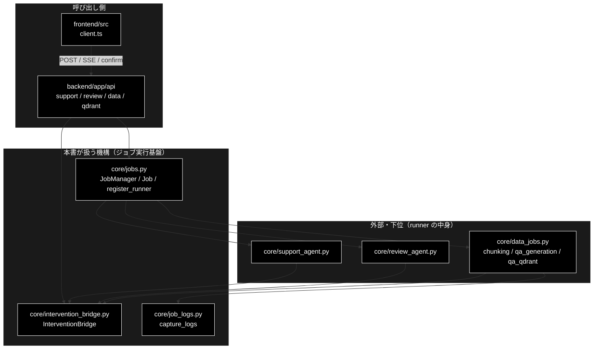
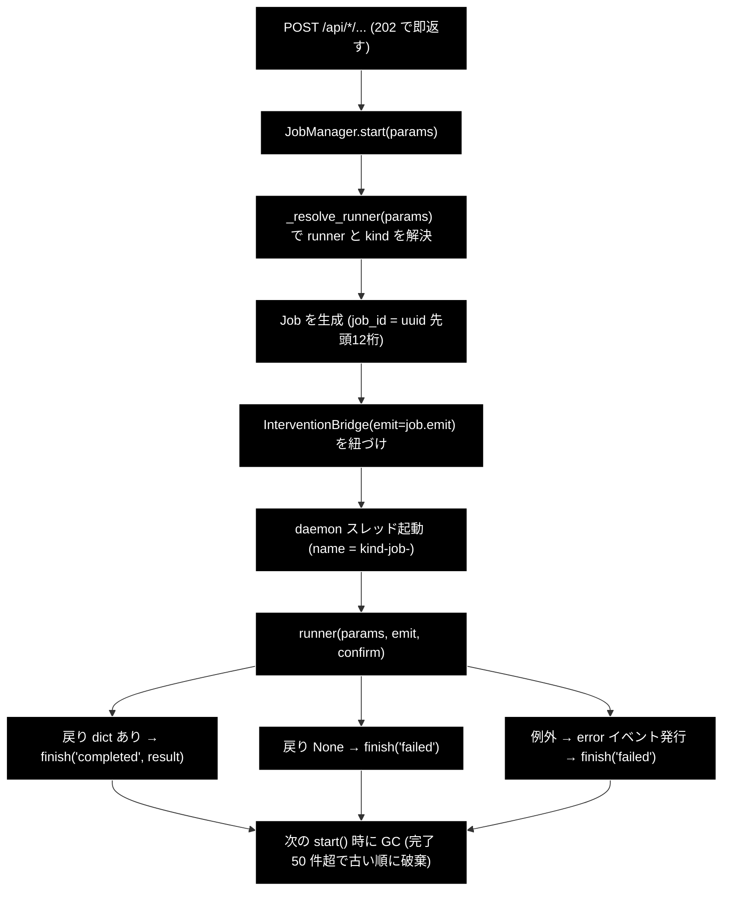
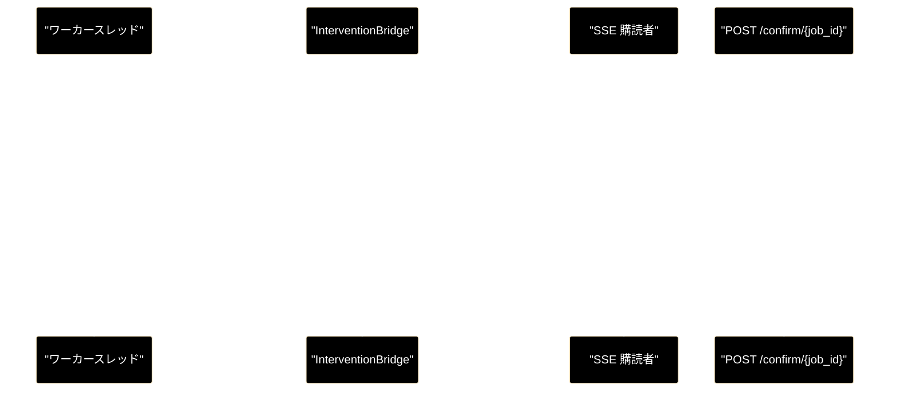

# ジョブ実行基盤（jobs / intervention_bridge / job_logs） ドキュメント

**Version 1.1** | 最終更新: 2026-09-24

> **本書の位置づけ**: GRACE-Support・GRACE-Review・データ準備の **3 系統が共有する
> 実行基盤の正本**。ジョブのライフサイクル、SSE のイベント配信、HITL 承認の橋渡し、
> 既存パッケージのログ転送をここに集約する。
> 系統別文書は**本書を参照するだけ**にして、同じ説明を持たない。

> **関連ドキュメント**
> - [`architecture.md`](./architecture.md) — 層構造と外部境界（先に読む）
> - [`api_contract.md`](./api_contract.md) — SSE のワイヤ形式・HTTP ステータス
> - [`reference/core_jobs.md`](./reference/core_jobs.md) — `jobs.py` の IPO 詳細
> - [`reference/core_intervention_bridge.md`](./reference/core_intervention_bridge.md)

---

## 目次

- [概要](#概要)
- [1. ジョブのライフサイクル](#1-ジョブのライフサイクル)
- [2. イベントの蓄積とリプレイ](#2-イベントの蓄積とリプレイ)
- [3. runner 注入（3 系統を 1 基盤に載せる仕掛け）](#3-runner-注入3-系統を-1-基盤に載せる仕掛け)
- [4. HITL 承認の橋渡し（InterventionBridge）](#4-hitl-承認の橋渡しinterventionbridge)
- [5. 既存パッケージのログ転送（job_logs）](#5-既存パッケージのログ転送job_logs)
- [6. 失敗の扱い](#6-失敗の扱い)
- [7. 制約（ローカル開発専用であることの帰結）](#7-制約ローカル開発専用であることの帰結)
- [8. 触るときのチェックリスト](#8-触るときのチェックリスト)
- [9. 変更履歴](#9-変更履歴)

---

## 概要

**1 リクエスト = 1 ジョブ = 1 ワーカースレッド。**

エージェントの 1 周は**ローカル LLM では数十秒〜数分**かかるため、HTTP リクエストの中で
完結させない。`POST` は **202 を即返し**、実処理はワーカースレッドで走り、進捗は SSE で
配信する。HITL 承認だけは処理の途中で人の応答が要るので、**SSE で問い、別の POST で答える**。

この基盤は 3 系統（Support / Review / データ準備）が**そのまま共有**する。
系統ごとに違うのは以下の 3 つだけである。

| 系統に固有なもの | 実体 |
|---|---|
| params 型 | `JobParams` / `ReviewParams` / `ChunkingParams` ほか |
| runner（実行関数） | `_support_runner` / `_review_runner` / `_chunking_runner` ほか |
| 結果 dict | `result_to_dict` / `review_result_to_dict` / 各 runner の戻り |

**どの params も `model`（使用するローカル LLM）を持つ**が、解決と既定値の扱いは
系統をまたいで同じ規約に従う（[`config_and_providers.md` §3](./config_and_providers.md)）。

### 主な責務

- ジョブのライフサイクル（起動・実行・完了・失敗）を管理する
- 進捗イベントを蓄積し、リプレイ付きで SSE へ配信する
- 系統ごとの runner を注入し、3 系統を 1 つの基盤に載せる
- HITL の承認待ちをワーカーと API のあいだで橋渡しする（タイムアウトは安全側）
- 既存パッケージのログをジョブの進捗イベントへ転送する

### 各責務対応のモジュール

| # | 責務 | 対応モジュール | 説明 |
|---|------|--------------|------|
| 1 | ライフサイクル | `backend/app/core/jobs.py` | `JobManager.start()` → ワーカースレッド → `Job`（§1） |
| 2 | 蓄積とリプレイ | `backend/app/core/jobs.py` / `backend/app/api/*.py` | `Job.stream_events()` を各ルータの `GET /stream/{job_id}` が SSE にする（§2） |
| 3 | runner 注入 | `backend/app/core/jobs.py` / `support_agent.py` 系 / `review_agent.py` 系 / `data_jobs.py` | `register_runner()` で params 型 → runner を登録し、`_resolve_runner()` で解決（§3） |
| 4 | HITL の橋渡し | `backend/app/core/intervention_bridge.py` | `InterventionBridge`（§4） |
| 5 | ログ転送 | `backend/app/core/job_logs.py` | `capture_logs()`（§5） |

### アーキテクチャ構成図



**データフロー**:

1. `POST` を受けたルータが `JobManager.start(params)` を呼び、202 と `job_id` を即返す
2. `_resolve_runner()` が params の型から runner を選び、ワーカースレッドで実行する
3. runner が emit したイベントは `Job` に蓄積され、`GET /stream/{job_id}` がリプレイ付きで流す
4. 承認が要ると runner は `InterventionBridge` で待ち、`POST /confirm/{job_id}` の応答で再開する

---

## 1. ジョブのライフサイクル



| 状態 | 値 | 意味 |
|---|---|---|
| 実行中 | `running` | ワーカースレッドが runner を実行中 |
| 完了 | `completed` | runner が dict を返した（`Job.result` に格納） |
| 失敗 | `failed` | 例外、または runner が `None` を返した |

**`None` を返す = 失敗だが error イベントは runner 側が出す**という約束になっている
（Ollama へ繋がらない・モデルが未 pull などの「想定内の失敗」を runner が自分で説明するため）。
`JobManager._run` が error イベントを出すのは**例外を捕まえたときだけ**である。

---

## 2. イベントの蓄積とリプレイ

`Job.events` は**捨てない**。`emit()` は `seq`（連番）と `ts`（サーバ時刻）を付けて
リストに追記し、`threading.Condition` で購読者を起こす。

`stream_events()` は**先頭（seq=0）から**順に返すブロッキングイテレータである。
その結果、

- **途中から購読しても全イベントが届く**（POST と SSE 接続の間に発生したイベントを落とさない）
- **再接続しても取りこぼさない**（ブラウザのリロード・ネットワーク瞬断に耐える）

新イベントが `poll_timeout`（既定 15 秒）来ないと `None` を yield し、API 側が
`: keepalive` コメントを送る。**ローカル LLM は 1 ステップが長いので、この keepalive が
無いとブラウザ側で切れる。**

### イベントの種類（`SupportEvent.type`）

| type | 意味 | 主な発行元 |
|---|---|---|
| `step` | ステップの開始 / 終了 / スキップ（`status` = `started` / `finished` / `skipped`） | 各 runner |
| `log` | 途中経過メッセージ | 各 runner・`job_logs` |
| `intervention` | HITL 承認待ち（`status` = `waiting` / `resolved` / `timeout`） | `InterventionBridge` |
| `result` | 最終結果（`data` に結果 dict） | 各 runner |
| `error` | 実行エラー | runner / `JobManager._run` |

> **`done` は `SupportEvent` ではない。** SSE の終端番兵で、`done_event(job)` が
> 組み立てる別物である。`ts`（完了時刻）と `started_at`（**POST を受け付けた時刻**）を
> 必ず載せる。フロントの所要時間表示がサーバ時計からこの 2 つを取るためで、
> **欠けると「完了 … ／ 所要 …」の行が丸ごと消える**（実測 2026-08-29 の回帰）。
>
> ⚠️ `started_at` が「最初のイベントが出た時刻」ではないのは意図的である。
> ローカル LLM では受付から最初のイベントまでにツール・planner・executor の生成で
> 十数秒かかることがあり、そこを落とすと実際に待った時間より短く見える。

---

## 3. runner 注入（3 系統を 1 基盤に載せる仕掛け）

`jobs.py` は実行関数を差し替え可能にしてある。

```python
JobRunner = Callable[[Any, EmitFn, ConfirmFn], Optional[Dict[str, Any]]]

def register_runner(params_type: type, runner: JobRunner, kind: str) -> None: ...
```

`start()` は runner 省略時、**params の型**から `_RUNNERS` を引く
（`isinstance` 判定なので継承も効く）。未登録の型を渡すと `TypeError` になる。

| params 型 | kind | 登録する場所 |
|---|---|---|
| `JobParams` | `support` | `jobs.py` の末尾（自分で登録） |
| `ReviewParams` | `review` | `review_agent.py` の import 時 |
| `ChunkingParams` | `chunking` | `data_jobs.py` の import 時 |
| `QaGenerationParams` | `qa` | 同上 |
| `RegisterParams` | `register` | 同上 |
| `DeleteParams` | `delete` | 同上 |

### ⚠️ 登録は import の副作用である（が、漏れない）

`review_agent.py` / `data_jobs.py` は **import された時点で** `register_runner()` を
実行する。一見「import 忘れ = 登録漏れ」に見えるが、**構造的に起きない**。
`ReviewParams` や `ChunkingParams` を構築するにはそのモジュールの import が必要だからである。

この形により **`jobs.py` は Review・データ準備を一切知らずに済み**、循環 import も起きない。

---

## 4. HITL 承認の橋渡し（InterventionBridge）

`grace.intervention.InterventionHandler` の `on_confirm` / `on_escalate` は
**同期コールバック**である。一方 Web では、応答は**別の HTTP リクエスト**として
非同期に届く。この段差を `threading.Event` で埋めるのが `InterventionBridge` である。



### タイムアウトは必ず安全側

待ち時間の優先順位は **`timeout_seconds`（Bridge 生成時）→ `request.timeout_seconds`
→ `DEFAULT_CONFIRM_TIMEOUT`（300 秒）**。時間切れなら

```python
return InterventionResponse(action=InterventionAction.CANCEL, timeout_reached=True)
```

＝**実行しない。** 呼び出し側（`_perform_action`）はこれを見て有人対応へ倒す。
「返事が無い＝承認」には**絶対にしない**。

> ⚠️ **CLI の自動承認（`AUTO_PROCEED`）を Web に持ち込まないこと。**

### 同時に待てるのは 1 件だけ

`InterventionBridge._pending` は**単数**である。`resolve()` は `intervention_id` が
一致しなければ `False` を返し、API は `not_waiting` を応答する（404 ではない）。

`selected_option` は選択肢つきの介入（0-(A) 主質問の選択）でのみ使う。

---

## 5. 既存パッケージのログ転送（job_logs）

`chunking/` `qa_generation/` `qa_qdrant/` `services/` は進捗コールバックを持たず、
`logger.info()` と `tqdm` にしか進捗を出さない。**3 パッケージを改修する代わりに**、
ジョブ実行中だけ `logging.Handler` を取り付けてレコードを横取りする。

```python
with capture_logs(emit, ["chunking"], step="chunk"):
    chunks_all_async(...)      # 中の logger.info が log イベントとして流れる
```

この仕組みには**非自明な守りが 2 つ**入っている。どちらも実測で見つかった不具合への対処で、
**削ると壊れる**。

| 守り | 何を防ぐか |
|---|---|
| **スレッド ID で絞る**（`record.thread != self._thread_ident` は無視） | ハンドラはロガー（プロセス全体）に付くため、同時に走る別ジョブのログが混ざる |
| **ロガー level の参照カウント**（`_level_refs`） | 素朴な退避・復元だと、2 本同時実行時に level が復元されず INFO のまま残る |

`capture_logs` はコンテキストマネージャなので例外時もハンドラは外れる。
**外し忘れるとハンドラが積み上がり、1 行のログが N 回転送される。**

---

## 6. 失敗の扱い

| 失敗の種類 | どう見えるか |
|---|---|
| runner が例外を送出 | `error` イベント → `failed` |
| runner が `None` を返す | runner が出した `error` イベントのみ → `failed`（Ollama 未起動・モデル未 pull はここ） |
| HITL タイムアウト | `intervention`（`status=timeout`）→ **ジョブは失敗しない**。安全側でアクションを実行せず続行 |
| ジョブ ID が無い | API が 404（`job not found`） |

SSE は**失敗しても必ず `done` 番兵で閉じる**（`status` に `failed` が入る）。

---

## 7. 制約（ローカル開発専用であることの帰結）

| 制約 | 理由・影響 |
|---|---|
| **インメモリ・永続化なし** | プロセス再起動で全ジョブが消える。`job_id` は再起動後 404 |
| **シングルプロセス前提** | `job_manager` はモジュールシングルトン。uvicorn を `--workers 2` 以上で起動すると別プロセスのジョブは見えない |
| **完了ジョブは 50 件まで**（`MAX_FINISHED_JOBS`） | 超えると古い完了ジョブから破棄され、結果取得が 404 になる |
| **認証なし** | CORS は `localhost:5173` / `127.0.0.1:5173` のみ許可 |
| **キャンセル API が無い** | 走り出したジョブを外から止める口は無い |
| **並列実行は速くならない** | ローカル LLM は 1 プロセスの推論資源を共有するため、同時実行すると各々が遅くなる（`config.py::get_default_chunking_workers()` の実測コメント参照） |

---

## 8. 触るときのチェックリスト

- [ ] 新しいジョブ種別を足した → `register_runner()` を**そのモジュールの import 時**に呼んでいるか
- [ ] runner は `(params, emit, confirm) -> Optional[dict]` のシグネチャか
- [ ] 失敗時に `None` を返すなら、**その前に `error` イベントを emit** しているか
- [ ] `model` の既定値を **dataclass のデフォルトで評価していないか**（[`pitfalls.md`](./pitfalls.md)）
- [ ] 破壊的操作なら CONFIRM を出しているか（タイムアウト = 実行しない、で正しいか）
- [ ] 外部パッケージの進捗を出したい → `capture_logs()` を `with` で使ったか
- [ ] `done_event` の `ts` / `started_at` を落としていないか（所要時間表示が消える）
- [ ] 3 系統すべてに効く変更か？ `backend/tests/test_jobs_generic.py` と Review 系 18 本を流したか

---

## 9. 変更履歴

| Version | 日付 | 変更内容 |
|---|---|---|
| 1.0 | 2026-09-16 | 新規作成。`jobs.py` / `intervention_bridge.py` / `job_logs.py` に分散していた共有基盤の説明を 1 本に集約した（ローカル LLM 前提の待ち時間・keepalive・並列の注意を含む） |
| 1.1 | 2026-09-24 | `a_cross_doc_md_format.md` v1.1（種別 A）に準拠（2026-09-24）。概要に主な責務・各責務対応のモジュール・アーキテクチャ構成図を追加。本文の章番号は変えていない |
