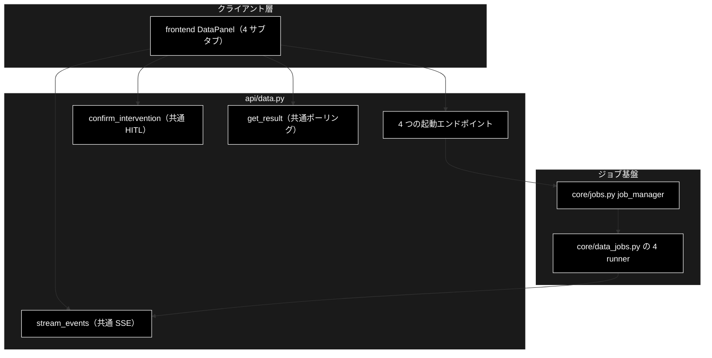
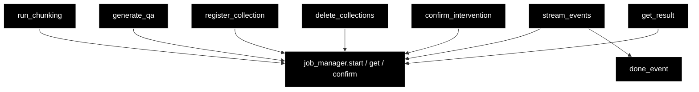

# api/data.py - データ準備ジョブ API ドキュメント

**Version 1.0** | 最終更新: 2026-09-16

> **本書の位置づけ**: `backend/app/api/data.py`（データ準備 4 ジョブの起動と共通 SSE / HITL）の **IPO リファレンス**。
> 引くための文書であり、**設計の「なぜ」と処理の流れは上位の文書が正本**である。
>
> | 知りたいこと | 参照先 |
> |---|---|
> | エンドポイント一覧と CONFIRM の要否 | [`api_contract.md` §1.3](../api_contract.md) |
> | パイプラインの中身 | [`data_pipeline.md`](../data_pipeline.md) |
> | ジョブ基盤・SSE・HITL の機構 | [`job_runtime.md`](../job_runtime.md) |
> | runner の実装 | [`core_data_jobs.md`](./core_data_jobs.md) |
> | 文書全体の地図 | [`README.md`](../README.md) |

---

## 目次

1. [概要](#概要)
2. [アーキテクチャ構成図](#1-アーキテクチャ構成図)
3. [モジュール構成図](#2-モジュール構成図)
4. [関数一覧表](#3-関数一覧表)
5. [関数 IPO詳細](#4-関数-ipo詳細)
6. [設定・定数](#5-設定定数)
7. [落とし穴](#6-落とし穴)
8. [変更履歴](#7-変更履歴)

---

## 概要

`backend/app/api/data.py`（197 行）は、データ準備パイプラインの 4 ジョブを起動し、
**進捗の SSE・HITL 応答・結果取得を 1 組で共用**する薄い層である。

`api/support.py` `api/review.py` と**構造は同一**で、違うのはジョブのパラメータ型と結果の形だけ。
ジョブ基盤・SSE・HITL ブリッジは `core/jobs.py` をそのまま使う。

### 主な責務

- 4 種のリクエスト（`ChunkingRequest` / `QaGenerationRequest` / `RegisterRequest` / `DeleteCollectionsRequest`）を params へ詰め替えてジョブを起動する
- 4 種で**共通**の SSE（`/api/data/stream/{job_id}`）・HITL 応答（`/api/data/confirm/{job_id}`）・結果取得（`/api/data/result/{job_id}`）を提供する

### 各責務対応のモジュール

| 責務 | 実体 |
|---|---|
| params 定義・実処理 | `backend/app/core/data_jobs.py` |
| ジョブ管理・SSE のイベント列 | `backend/app/core/jobs.py` |
| HITL 承認の橋渡し | `backend/app/core/intervention_bridge.py` |
| リクエスト / レスポンスの型 | `backend/app/schemas.py` |

### 主要機能一覧

| エンドポイント | 関数 | CONFIRM |
|---|---|---|
| `POST /api/chunking/run` | `run_chunking()` | なし（非破壊） |
| `POST /api/qa/generate` | `generate_qa()` | なし（非破壊） |
| `POST /api/qdrant/register` | `register_collection()` | `recreate=True` のときだけ |
| `POST /api/qdrant/delete` | `delete_collections()` | **常に** |
| `GET /api/data/stream/{job_id}` | `stream_events()` | — |
| `POST /api/data/confirm/{job_id}` | `confirm_intervention()` | — |
| `GET /api/data/result/{job_id}` | `get_result()` | — |

---

## 1. アーキテクチャ構成図

### 1.1 システム全体構成



### 1.2 データフロー

1. `POST` が対応する params を作り `job_manager.start(params)`（型から runner が解決される）
2. **202** と `{job_id, stream_url}` を即返す（`stream_url` は 4 種とも `/api/data/stream/{job_id}`）
3. フロントが SSE を購読し、`step` / `log` / `intervention` / `result` を受け取る
4. CONFIRM が出たら `POST /api/data/confirm/{job_id}` で応答を注入する
5. 終端の `done` 番兵で `EventSource` を閉じる

---

## 2. モジュール構成図



### 2.2 外部依存関係

| 依存 | 用途 |
|---|---|
| `backend.app.core.data_jobs`（4 params） | **import に副作用**: `register_runner()` が 4 件走る |
| `backend.app.core.jobs`（`job_manager` / `done_event`） | ジョブ起動・イベント列・終端番兵 |
| `backend.app.schemas` | リクエスト / レスポンスの Pydantic モデル |
| `fastapi` / `fastapi.responses.StreamingResponse` | ルータと SSE |

---

## 3. 関数一覧表

| 関数 | シグネチャ | 戻り |
|---|---|---|
| `run_chunking` | `(request: ChunkingRequest) -> QueryAccepted` | 202 |
| `generate_qa` | `(request: QaGenerationRequest) -> QueryAccepted` | 202 |
| `register_collection` | `(request: RegisterRequest) -> QueryAccepted` | 202 |
| `delete_collections` | `(request: DeleteCollectionsRequest) -> QueryAccepted` | 202 |
| `stream_events` | `(job_id: str) -> StreamingResponse` | SSE（404 あり） |
| `confirm_intervention` | `(job_id: str, request: ConfirmRequest) -> ConfirmResponse` | 200 / 404 |
| `get_result` | `(job_id: str) -> DataJobStatusResponse` | 200 / 404 |

---

## 4. 関数 IPO詳細

### 4.1 使用例

```bash
# チャンク化（モデルは任意。未指定なら GET /api/model と同じ既定）
curl -X POST localhost:8000/api/chunking/run \
  -H 'Content-Type: application/json' \
  -d '{"input_file":"OUTPUT/cc_news_1per.csv","model":"gemma4:12b-mlx"}'
# → {"job_id":"ab12cd34ef56","stream_url":"/api/data/stream/ab12cd34ef56"}

curl -N localhost:8000/api/data/stream/ab12cd34ef56
# data: {"seq":0,"type":"step","step":"load","status":"started", ...}
```

### 4.2 `run_chunking` / `generate_qa`（非破壊ジョブ）

| 項目 | 内容 |
|---|---|
| **Input** | `ChunkingRequest` / `QaGenerationRequest`（`model` は `GET /api/models` の選択肢のみ。外れると **422**） |
| **Process** | params へ詰め替えて `job_manager.start()` |
| **Output** | `QueryAccepted(job_id, stream_url)`（**202**） |

> 入力ファイルの検証は**起動時に行わず runner 側で行う**（許可ディレクトリ外・不在なら
> `error` イベントでジョブが失敗する）。4 種の API を同じ形に保つための設計判断である。
>
> ⚠️ `use_celery=True` を渡すなら Celery ワーカーが起動していること。落ちていれば
> **実行時**に `error` で失敗する（起動から実行までの間に生死が変わりうるため、起動時には弾かない）。

### 4.3 `register_collection` / `delete_collections`（破壊しうるジョブ）

| 項目 | 内容 |
|---|---|
| **Input** | `RegisterRequest`（`recreate` を含む）/ `DeleteCollectionsRequest`（`collections`） |
| **Process** | params へ詰め替えて `job_manager.start()`。**CONFIRM は runner 側で出す** |
| **Output** | `QueryAccepted`（**202**） |

`recreate=True` のとき、および削除は**必ず** `intervention` イベントが流れる。
フロントは既存の `ConfirmModal` で承認を返す。

### 4.4 `stream_events`

| 項目 | 内容 |
|---|---|
| **Input** | `job_id` |
| **Process** | `job_manager.get()`（無ければ **404**）→ `job.stream_events()` を `data: {JSON}` 行へ変換。`None` は `: keepalive` |
| **Output** | `StreamingResponse`（`text/event-stream`・`Cache-Control: no-cache`・`X-Accel-Buffering: no`）。末尾に `done` 番兵 |

### 4.5 `confirm_intervention` / `get_result`

| 項目 | 内容 |
|---|---|
| **Input** | `job_id` ＋ `ConfirmRequest`（`intervention_id` / `approve`）／ `job_id` |
| **Process** | `job_manager.confirm()` の戻り（`resolved` / `not_waiting` / `not_found`）／ `job_manager.get()` |
| **Output** | `ConfirmResponse`（`not_found` のみ **404**、`not_waiting` は **200**）／ `DataJobStatusResponse` |

---

## 5. 設定・定数

| 定数 | 値 | 用途 |
|---|---|---|
| `_STREAM_URL` | `"/api/data/stream/{job_id}"` | 4 種の起動で共通に返す SSE の URL |
| `router` | `APIRouter(prefix="/api", tags=["data"])` | 起動系は `/api/chunking/...` `/api/qdrant/...`、共通系は `/api/data/...` |

---

## 6. 落とし穴

| 罠 | 実際は |
|---|---|
| `core.data_jobs` の import を「未使用」と判断して消す | `register_runner()` が走らなくなり、`start()` が `TypeError: 未登録の params 型です` になる |
| 起動時に入力ファイルを検証したくなる | 4 種の API の形が崩れる。検証は runner 側に寄せてある |
| `not_waiting` をエラー（4xx）にしたくなる | タイムアウト済みの応答は異常ではない。**200** で返す |

---

## 7. 変更履歴

| Version | 日付 | 変更内容 |
|---|---|---|
| 1.0 | 2026-09-16 | 新規作成（文書再編 Phase 3）。実装（197 行）から IPO を書き起こした |
