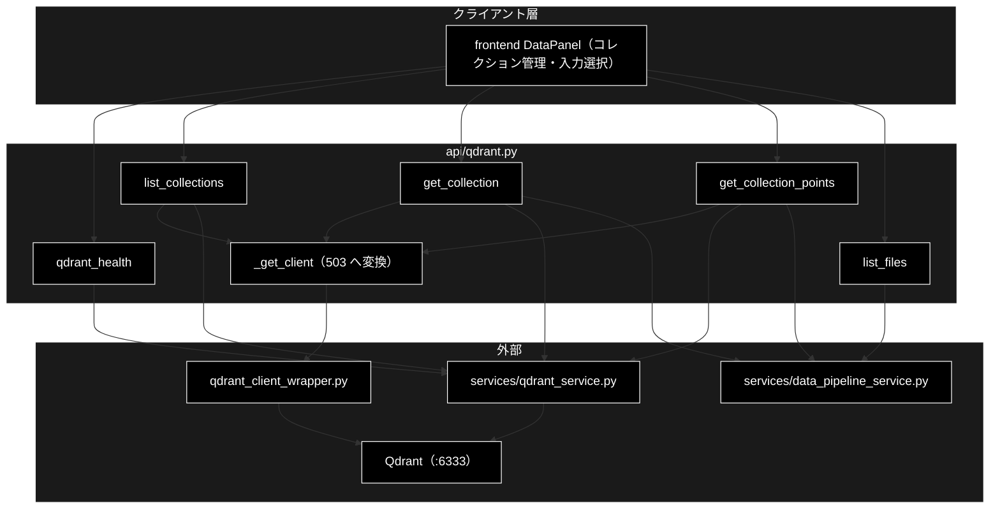
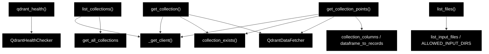

# api/qdrant.py - Qdrant 参照 API ドキュメント

**Version 1.0** | 最終更新: 2026-09-16

> **本書の位置づけ**: `backend/app/api/qdrant.py`（Qdrant 参照系・読み取り専用）の **IPO リファレンス**。
> 引くための文書であり、**設計の「なぜ」は上位の文書が正本**である。
>
> | 知りたいこと | 参照先 |
> |---|---|
> | エンドポイント一覧とステータス方針 | [`api_contract.md` §1.4・§5](../api_contract.md) |
> | コレクションの作り方 | [`data_pipeline.md`](../data_pipeline.md) |
> | 登録・削除（副作用あり）の API | [`api_data.md`](./api_data.md) |
> | 文書全体の地図 | [`README.md`](../README.md) |

---

## 目次

1. [概要](#概要)
2. [アーキテクチャ構成図](#1-アーキテクチャ構成図)
3. [モジュール構成図](#2-モジュール構成図)
4. [関数一覧表](#3-関数一覧表)
5. [関数 IPO詳細](#4-関数-ipo詳細)
6. [設定・定数](#5-設定定数)
7. [落とし穴](#6-落とし穴)
8. [変更履歴](#7-変更履歴)

---

## 概要

`backend/app/api/qdrant.py`（200 行）は、データ準備パイプラインのうち
**副作用のない参照系だけ**を持つ。登録・削除はジョブ基盤と HITL CONFIRM を経由するため
別ルータ（[`api_data.md`](./api_data.md)）になる。

実処理は `services/qdrant_service.py` が持ち、本モジュールは
`services/data_pipeline_service.py` を挟んで**JSON 化するだけの薄い層**である。

### 主な責務

- Qdrant の稼働確認（**落ちていても 200**）・コレクション一覧・詳細・ポイントのプレビュー
- 入力ファイル候補の列挙（許可ディレクトリのみ・**絶対パスを返さない**）

### 主要機能一覧

| エンドポイント | 関数 | 主なステータス |
|---|---|---|
| `GET /api/qdrant/health` | `qdrant_health()` | **200 固定** |
| `GET /api/qdrant/collections` | `list_collections()` | 200 / 503 |
| `GET /api/qdrant/collections/{name}` | `get_collection()` | 200 / 404 / 503 |
| `GET /api/qdrant/collections/{name}/points` | `get_collection_points()` | 200 / 404 / 503 |
| `GET /api/files` | `list_files()` | 200 / 400 |

---

## 1. アーキテクチャ構成図

### 1.1 システム全体構成



### 1.2 データフロー

1. 画面が参照系を叩く（**ジョブは作らない**。同期で応答する）
2. `_get_client()` が Qdrant クライアントを取得（失敗は **503** へ変換）
3. `services/` の関数で取得し、Pydantic モデルへ詰め替えて返す

---

## 2. モジュール構成図



### 2.2 外部依存関係

| 依存 | 用途 |
|---|---|
| `qdrant_client_wrapper.get_qdrant_client` | クライアント生成（**生成時点では接続確認をしない**） |
| `services.qdrant_service`（`QdrantHealthChecker` / `QdrantDataFetcher` / `get_all_collections` / `QDRANT_CONFIG`） | 稼働確認・一覧・ポイント取得 |
| `services.data_pipeline_service`（`collection_exists` / `collection_columns` / `dataframe_to_records` / `list_input_files` / `ALLOWED_INPUT_DIRS` / `PathNotAllowedError`） | 存在確認・整形・入力ファイル列挙 |

> すべて**関数内 import**（遅延 import）である。起動時に Qdrant 関連モジュールを
> 読み込まないことで、Qdrant が無い環境でもアプリ自体は起動する。

---

## 3. 関数一覧表

| 関数 | シグネチャ | 戻り |
|---|---|---|
| `_get_client()` | `() -> QdrantClient` | クライアント（失敗時 `HTTPException(503)`） |
| `qdrant_health` | `() -> QdrantHealth` | **常に 200** |
| `list_collections` | `() -> List[CollectionInfo]` | 一覧（`name` / `points_count` / `status`） |
| `get_collection` | `(name: str) -> CollectionDetail` | ベクトル設定 ＋ データ元の集計 |
| `get_collection_points` | `(name: str, limit: int = 50) -> CollectionPoints` | プレビュー（`limit` は 1〜500） |
| `list_files` | `(dir: str = "OUTPUT") -> InputFileListResponse` | 入力ファイル候補 |

---

## 4. 関数 IPO詳細

### 4.1 使用例

```bash
curl localhost:8000/api/qdrant/health
# {"available": false, "message": "...", "url": "http://localhost:6333"}   ← 200 のまま

curl localhost:8000/api/qdrant/collections
curl 'localhost:8000/api/qdrant/collections/ec_ad_rules_anthropic/points?limit=5'
curl 'localhost:8000/api/files?dir=OUTPUT'
```

### 4.2 `qdrant_health()`

| 項目 | 内容 |
|---|---|
| **Input** | なし（接続先は `QDRANT_CONFIG`） |
| **Process** | `QdrantHealthChecker.check_qdrant()` を呼び、例外も捕まえて本文へ載せる |
| **Output** | `QdrantHealth(available, message, url, …)`。**Qdrant が落ちていても 200** |

> ⚠️ **503 にしない。** 画面側で「通信エラー」と「Qdrant を起動してください」を
> 出し分けられなくなるため。一覧・詳細は Qdrant が必須なので 503 を返す。

### 4.3 `list_collections()` / `get_collection(name)` / `get_collection_points(name, limit)`

| 項目 | 内容 |
|---|---|
| **Input** | `name`（コレクション名）、`limit`（1〜500・既定 50） |
| **Process** | 1. `_get_client()`（接続不可は 503）<br>2. 詳細・ポイントは `collection_exists()` で存在確認（無ければ **404**）<br>3. `QdrantDataFetcher` で取得し、`dataframe_to_records()` で JSON 化 |
| **Output** | `CollectionInfo[]` / `CollectionDetail` / `CollectionPoints`（`columns` を別に返す） |

> payload のキーはコレクションごとに違うため、**列名を `columns` として別に返す**
> （画面はこの順で列を並べる）。長い文字列は取得側で 200 文字に切り詰められている。

### 4.4 `list_files(dir)`

| 項目 | 内容 |
|---|---|
| **Input** | `dir`（許可ディレクトリ名・既定 `OUTPUT`） |
| **Process** | `list_input_files(dir)`。ホワイトリスト外は `PathNotAllowedError` → **400** |
| **Output** | `InputFileListResponse(dir, allowed_dirs, files)` |

> ⚠️ **絶対パスを返さない。** `ディレクトリ名/ファイル名` 形式に限定している。

---

## 5. 設定・定数

| 定数 | 値 | 用途 |
|---|---|---|
| `router` | `APIRouter(prefix="/api", tags=["qdrant"])` | `/api/qdrant/*` と `/api/files` |
| `limit`（points） | `Query(default=50, ge=1, le=500)` | プレビュー件数の上限 |
| `ALLOWED_INPUT_DIRS` | `services/data_pipeline_service.py` 側 | 入力ファイルのホワイトリスト |

---

## 6. 落とし穴

| 罠 | 実際は |
|---|---|
| `/api/qdrant/health` を 503 にする | 画面のエラー出し分けが壊れる（§4.2） |
| クライアント生成の成功を「接続できた」と解釈する | `get_qdrant_client()` は**生成時点で接続確認をしない**。実リクエストで初めて失敗する |
| 参照系をジョブ化する | 不要。副作用が無いので同期で返す（ジョブ化するのは登録・削除だけ） |

---

## 7. 変更履歴

| Version | 日付 | 変更内容 |
|---|---|---|
| 1.0 | 2026-09-16 | 新規作成（文書再編 Phase 3）。実装（200 行）から IPO を書き起こした |
