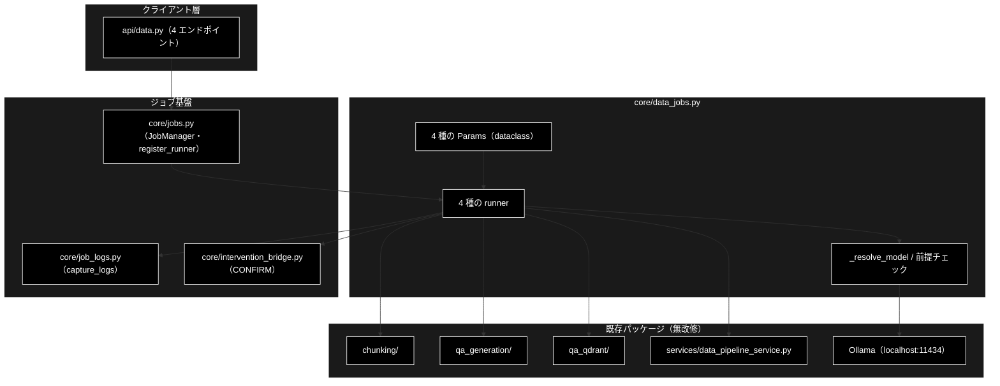
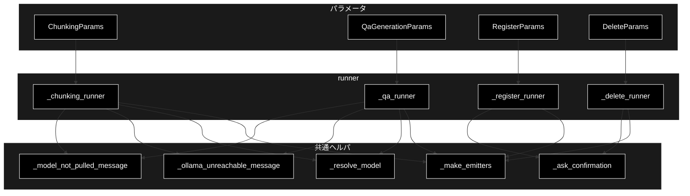

# core/data_jobs.py - データ準備ジョブの runner ドキュメント

**Version 1.0** | 最終更新: 2026-09-16

> **本書の位置づけ**: `backend/app/core/data_jobs.py`（データ準備 4 ジョブの runner）の **IPO リファレンス**。
> 引くための文書であり、**設計の「なぜ」と処理の流れは上位の文書が正本**である。
>
> | 知りたいこと | 参照先 |
> |---|---|
> | パイプラインの中身（チャンク化 → Q/A 生成 → 登録） | [`data_pipeline.md`](../data_pipeline.md) |
> | ジョブ基盤・runner 注入・SSE・HITL | [`job_runtime.md` §3](../job_runtime.md) |
> | エンドポイントと CONFIRM の要否 | [`api_contract.md` §1.3](../api_contract.md) |
> | 使うモデルの決まり方・Ollama の前提チェック | [`config_and_providers.md`](../config_and_providers.md) |
> | 文書全体の地図 | [`README.md`](../README.md) |

---

## 目次

1. [概要](#概要)
2. [アーキテクチャ構成図](#1-アーキテクチャ構成図)
3. [モジュール構成図](#2-モジュール構成図)
4. [クラス・関数一覧表](#3-クラス関数一覧表)
5. [クラス・関数 IPO詳細](#4-クラス関数-ipo詳細)
6. [設定・定数](#5-設定定数)
7. [落とし穴](#6-落とし穴)
8. [エクスポート](#7-エクスポート)
9. [変更履歴](#8-変更履歴)

---

## 概要

`backend/app/core/data_jobs.py` は、データ準備の 4 ジョブ
（**チャンク化 / Q/A 生成 / Qdrant 登録 / コレクション削除**）を
**GRACE-Support・GRACE-Review と同じジョブ基盤**（`core/jobs.py`）へ載せる runner 群である。

`register_runner(params_type, runner, kind)` が params の型から runner を解決するため、
`jobs.py` に手を入れずに 4 種類を追加できる。

### 主な責務

- 4 種類の params（`ChunkingParams` / `QaGenerationParams` / `RegisterParams` / `DeleteParams`）を受け、対応するパッケージを呼ぶ
- 進捗を `step` / `log` イベントとして SSE へ流す（既存パッケージは**無改修**。`core/job_logs.py` の `capture_logs()` で `logging` を横取りする）
- **破壊的操作に HITL CONFIRM を通す**（削除は常に / 登録は `recreate=True` のときだけ）
- **ローカル LLM の前提をループ前に確かめる**（Ollama への到達性・モデルが pull 済みか）
- 使用モデルを **1 箇所（`_resolve_model()`）で解決**する

### 各責務対応のモジュール

| 責務 | 実体 |
|---|---|
| チャンク化 | `chunking/csv_text_to_chunks_text_csv.py` |
| Q/A 生成 | `qa_generation/`（`QAPipeline`） |
| Qdrant 登録 | `qa_qdrant/register_to_qdrant.py` |
| コレクション削除 | `services/data_pipeline_service.delete_collection` |
| 進捗の転送 | `backend/app/core/job_logs.py` |
| HITL | `backend/app/core/intervention_bridge.py`（`jobs.py` 経由） |

### 主要機能一覧

| 機能 | 説明 |
|---|---|
| `_chunking_runner()` | CSV / テキスト → セマンティックチャンク CSV（`load` → `chunk` → `save`） |
| `_qa_runner()` | チャンク → Q/A ペア（`load` → `generate` → `coverage` → `save`） |
| `_register_runner()` | Q/A CSV → Qdrant 登録（`prepare` → `confirm` → `embed` → `upsert`） |
| `_delete_runner()` | コレクション削除（`inspect` → `confirm` → `delete`） |
| `_resolve_model()` | 使用モデルの解決（フォーム指定 → `get_config().llm.model` → 既定） |
| `_ollama_unreachable_message()` / `_model_not_pulled_message()` | ローカル LLM の前提チェック |

---

## 1. アーキテクチャ構成図

### 1.1 システム全体構成



### 1.2 データフロー

1. `api/data.py` が params を作り `job_manager.start(params)` を呼ぶ
2. `jobs.py` が型から runner を解決し、ワーカースレッドで実行する
3. runner は `_make_emitters(emit)` で step/log ヘルパを作り、進捗を SSE へ流す
4. 破壊的操作の手前で `_ask_confirmation()` が CONFIRM を要求する
5. 既存パッケージを呼ぶ区間は `capture_logs()` でログを横取りして転送する
6. 戻り dict が `Job.result` になる（`None` は失敗）

---

## 2. モジュール構成図



### 2.2 外部依存関係

| 依存 | 用途 |
|---|---|
| `chunking.csv_text_to_chunks_text_csv` / `chunking.async_api_client` | チャンク化本体・中断例外 |
| `qa_qdrant.register_to_qdrant` | Qdrant 登録本体 |
| `services.data_pipeline_service` | 入力ファイル解決・コレクション操作・Ollama 到達性 / pull 済み判定 |
| `services.qdrant_service` | コレクション一覧 |
| `qdrant_client_wrapper` | Qdrant クライアント |
| `config` | `get_default_ollama_model` / `get_default_chunking_workers` |
| `grace.intervention` | `InterventionRequest` / `InterventionLevel` |

---

## 3. クラス・関数一覧表

### 3.1 パラメータ（dataclass）

| クラス | 主なフィールド | CONFIRM |
|---|---|---|
| `ChunkingParams` | `input_file` / `output_dir="output_chunked"` / `model=None` / `workers`（既定は `get_default_chunking_workers()`）/ `block_size=1000` / `text_column` / `max_rows` / `combine_rows` / `resume` | なし |
| `QaGenerationParams` | `input_file` / `output_dir="qa_output/pipeline"` / `model=None` / `max_docs` / `use_celery=False` / `concurrency=8` / `batch_chunks=3` / `analyze_coverage=True` | なし |
| `RegisterParams` | `input_file` / `collection` / `recreate=False` / `batch_size=100` / `embed_workers=2` / `text_col` / `domain` / `max_docs` / **`provider="gemini"`** / `normalize_filename=True` / `create_ui_csv=True` | `recreate=True` のときだけ |
| `DeleteParams` | `collections: List[str]` | **常に** |

### 3.2 関数一覧

| 関数 | 概要 |
|---|---|
| `_resolve_model(explicit)` | 使用モデルの解決（未指定は `get_config().llm.model` → `get_default_ollama_model()`） |
| `_ollama_unreachable_message()` | Ollama へ確実に繋がらないときだけメッセージを返す |
| `_model_not_pulled_message(model)` | モデルが未 pull ならメッセージ（**pull 済み一覧つき**）を返す |
| `_make_emitters(emit)` | `log` / `step_started` / `step_finished` / `step_skipped` / `error` を作る |
| `_ask_confirmation(confirm, message, reason)` | CONFIRM を要求し `(承認されたか, タイムアウトしたか)` を返す |
| `_chunking_runner` / `_qa_runner` / `_register_runner` / `_delete_runner` | 4 種の実行関数 |

---

## 4. クラス・関数 IPO詳細

### 4.1 使用例

```python
from backend.app.core.data_jobs import ChunkingParams          # import で runner が登録される
from backend.app.core.jobs import job_manager

job = job_manager.start(ChunkingParams(
    input_file="OUTPUT/cc_news_1per.csv",
    model="gemma4:12b-mlx",        # 省略時は GET /api/model と同じ既定へ倒れる
))
for event in job.stream_events():
    if event and event["type"] == "step":
        print(event["step"], event["status"])
```

### 4.2 `_resolve_model(explicit: Optional[str]) -> str`

| 項目 | 内容 |
|---|---|
| **Input** | `explicit`: フォームで選ばれたモデル名（未指定は `None` / 空文字） |
| **Process** | 1. 指定があればトリムして返す<br>2. 無ければ `grace.config.get_config().llm.model`（`grace_config.yml` 適用後）<br>3. 解決できなければ `config.get_default_ollama_model()` |
| **Output** | 実際に使うモデル名 |

> ⚠️ **既定は `GET /api/model`（画面ヘッダーの「利用モデル名」）と同じ解決を使う。**
> `get_default_ollama_model()` を直接使うと、`.env` の `OLLAMA_DEFAULT_MODEL` と
> `grace_config.yml` の `llm.model` が食い違ったときに「**ヘッダーは A・実行は B**」になる。

### 4.3 `_chunking_runner(params, emit, confirm)`

| 項目 | 内容 |
|---|---|
| **Input** | `ChunkingParams`、`emit`、`confirm`（未使用＝非破壊） |
| **Process** | 1. `_resolve_model()` でモデルを決める<br>2. **Ollama 到達性 → モデル pull 済み**を確認（NG なら `error` を出して `None`）<br>3. `load`: 入力 CSV を解決して読む<br>4. `chunk`: `capture_logs(["chunking"])` の中でチャンク化（中断は `ChunkingAbortedError`）<br>5. `save`: 出力 CSV を書く（命名は `generate_output_filename()`） |
| **Output** | `{"output_file": ..., "chunks": ..., "model": ...}` 形式の dict。失敗時 `None` |

### 4.4 `_qa_runner(params, emit, confirm)`

| 項目 | 内容 |
|---|---|
| **Input** | `QaGenerationParams`、`emit`、`confirm`（未使用＝非破壊） |
| **Process** | 1. モデル解決と前提チェック（4.3 と同じ）<br>2. `load` → `generate`（`QAPipeline`。`use_celery=True` なら Celery 並列）<br>3. `coverage`: `analyze_coverage=True` のときセマンティックカバレッジを計測<br>4. `save`: Q/A CSV を書く（**新規ファイル**。既存を壊さない） |
| **Output** | 生成件数・出力パス・使用モデルを含む dict。失敗時 `None` |

### 4.5 `_register_runner(params, emit, confirm)`

| 項目 | 内容 |
|---|---|
| **Input** | `RegisterParams`、`emit`、`confirm` |
| **Process** | 1. `prepare`: 入力ファイルとコレクションの存在を確認<br>2. `confirm`: **`recreate=True` のときだけ** `_ask_confirmation()`（拒否・タイムアウトなら実行しない）<br>3. `embed`: `provider`（既定 `gemini`）で Embedding<br>4. `upsert`: `register_to_qdrant()` で登録 |
| **Output** | 登録件数・コレクション名を含む dict。失敗・非承認時 `None` |

> ⚠️ **Embedding は Gemini のまま。** `provider` を `"ollama"` にしてはいけない
> （次元が 3072 → 768 に変わり、既存コレクションの再作成と全件再登録が必要になる）。

### 4.6 `_delete_runner(params, emit, confirm)`

| 項目 | 内容 |
|---|---|
| **Input** | `DeleteParams`、`emit`、`confirm` |
| **Process** | 1. `inspect`: 対象コレクションの件数を数える<br>2. `confirm`: **必ず** `_ask_confirmation()`<br>3. `delete`: 承認されたものだけ削除 |
| **Output** | 削除したコレクション名の一覧を含む dict。非承認時は削除しない |

---

## 5. 設定・定数

### 5.1 ステップ ID

```python
CHUNKING_STEP_IDS = ("load", "chunk", "save")
QA_STEP_IDS       = ("load", "generate", "coverage", "save")
REGISTER_STEP_IDS = ("prepare", "confirm", "embed", "upsert")
DELETE_STEP_IDS   = ("inspect", "confirm", "delete")
```

各 ID には日本語ラベル（`*_STEP_LABELS`）が対応し、UI のタイムラインに出る。

### 5.2 既定値

| 値 | 既定 | 出どころ |
|---|---|---|
| チャンク化の並列数 | `get_default_chunking_workers()` | **ローカル LLM では上げても速くならない**（実測コメント参照） |
| 使用モデル | `None`（＝ `_resolve_model()` が解決） | `grace_config.yml` の `llm.model` |
| Embedding プロバイダ | `"gemini"` | `CLAUDE.md` §3 |

---

## 6. 落とし穴

| 罠 | 対処 |
|---|---|
| **`model` の既定を dataclass のデフォルトで評価する** | import 時に 1 度だけ確定し、`.env` と yml の食い違いに気づけない。`None` のまま持ち回り `_resolve_model()` で解決する |
| **未 pull のモデルで走らせる** | チャンク化は 404 を 3 回リトライしてフォールバック分割へ落ちるため、**止まらずにゴミを作り続ける**（実測: 1,229 ブロックで 404 が 3,687 回）。`_model_not_pulled_message()` で LLM ループ前に弾く |
| **Ollama 未起動を「判定不能」と混ぜる** | 接続拒否は曖昧ではないので確実に弾く。一覧が取れないだけのケースとは区別する |
| **CONFIRM のタイムアウトを承認扱いにする** | `_ask_confirmation()` は `(False, True)` を返し、呼び出し側は**実行しない** |
| **`capture_logs()` を `with` 以外で使う** | ハンドラが積み上がり、1 行のログが N 回転送される |

---

## 7. エクスポート

`__all__` は定義していない。外部（`api/data.py`）が使うのは 4 つの params 型のみで、
runner とヘルパは**モジュール内部**（`_` 始まり）である。
import されると `register_runner()` が 4 件走る（[`job_runtime.md` §3](../job_runtime.md)）。

---

## 8. 変更履歴

| Version | 日付 | 変更内容 |
|---|---|---|
| 1.0 | 2026-09-16 | 新規作成（文書再編 Phase 3）。実装（857 行）から IPO を書き起こした |
