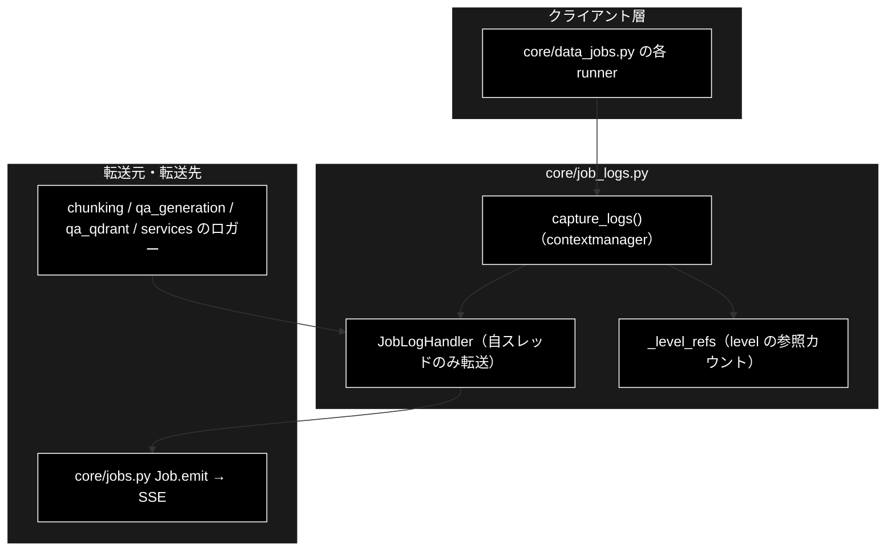
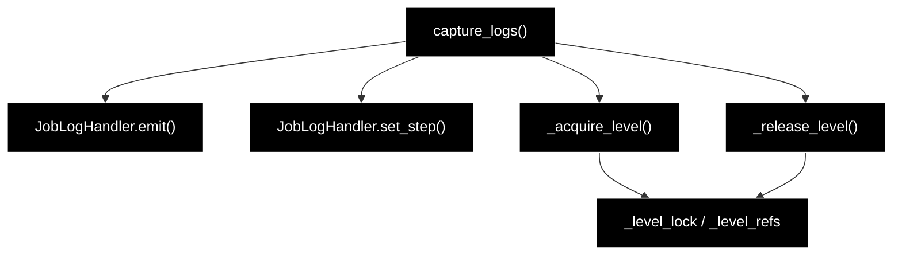

# core/job_logs.py - ジョブ進捗へのログ転送 ドキュメント

**Version 1.1** | 最終更新: 2026-09-24

> **本書の位置づけ**: `backend/app/core/job_logs.py`（既存パッケージの `logging` を進捗イベントへ転送）の **IPO リファレンス**。
> 引くための文書であり、**設計の「なぜ」は上位の文書が正本**である。
>
> | 知りたいこと | 参照先 |
> |---|---|
> | **機構の正本**（スレッド絞り込み・level の参照カウント） | [`job_runtime.md` §5](../job_runtime.md) |
> | 唯一の利用者 | [`core_data_jobs.md`](./core_data_jobs.md) |
> | SSE のワイヤ形式 | [`api_contract.md` §3](../api_contract.md) |
> | 文書全体の地図 | [`README.md`](../README.md) |

---

## 目次

1. [概要](#概要)
2. [アーキテクチャ構成図](#1-アーキテクチャ構成図)
3. [モジュール構成図](#2-モジュール構成図)
4. [クラス・関数一覧表](#3-クラス関数一覧表)
5. [クラス・関数 IPO詳細](#4-クラス関数-ipo詳細)
6. [設定・定数](#5-設定定数)
7. [落とし穴](#6-落とし穴)
8. [変更履歴](#7-変更履歴)

---

## 概要

`chunking/` `qa_generation/` `qa_qdrant/` `services/` の各パイプラインは、進捗を
`logger.info(...)` と `tqdm` にしか出しておらず、**進捗コールバックを持たない**。
GRACE-Support / GRACE-Review が `emit(SupportEvent(...))` で SSE へ流しているのに対し、
データ準備側にはその経路が無い。

そこで各モジュールへ `emit` 引数を足す（＝3 パッケージを改修する）代わりに、
**ジョブ実行スレッドに紐づく `logging.Handler` を一時的に取り付けてログレコードを横取りする**。
既存コードは 1 行も変えずに進捗が SSE へ流れる。

### 主な責務

- 指定したロガー（既定は データ準備 4 パッケージ）の出力を `log` イベントへ転送する
- **自スレッドのレコードだけ**を転送する（同時実行する他ジョブとの混線防止）
- ロガーの `level` を一時的に下げ、**参照カウントで正しく復元**する

### 各責務対応のモジュール

| # | 責務 | 対応モジュール | 説明 |
|---|------|--------------|------|
| 1 | 指定ロガーの出力を `log` イベントへ転送 | `backend/app/core/job_logs.py` | `capture_logs()` が `JobLogHandler` を取り付け、終了時に必ず外す。転送は `JobLogHandler.emit()`、ステップの切り替えは `set_step()` |
| 2 | 自スレッドのレコードだけを転送 | `backend/app/core/job_logs.py` | `JobLogHandler.emit()` が取り付けたスレッドの ID と照合する |
| 3 | level の一時変更と参照カウントでの復元 | `backend/app/core/job_logs.py` | `_acquire_level()` / `_release_level()` / `_level_refs` / `_level_lock` |

### 主要機能一覧

| 機能 | 説明 |
|---|---|
| `JobLogHandler` | 自スレッドのレコードだけを `emit` へ転送する `logging.Handler` |
| `capture_logs()` | ハンドラの取り付け・取り外しを行うコンテキストマネージャ |
| `DEFAULT_LOGGER_NAMES` | 既定で横取りするロガー名 |

---

## 1. アーキテクチャ構成図

### 1.1 システム全体構成



### 1.2 データフロー

1. runner が `with capture_logs(emit, ["chunking"], step="chunk"):` に入る
2. 対象ロガーへ `JobLogHandler` を取り付け、`level` を `_acquire_level()` で引き下げる
3. 既存パッケージが `logger.info(...)` を呼ぶ
4. ハンドラが `record.thread` を見て**自スレッド分だけ** `emit(SupportEvent(type="log", ...))` する
5. `with` を抜けるとハンドラを外し、`_release_level()` が参照カウント 0 で元の level へ戻す

---

## 2. モジュール構成図



### 2.2 外部依存関係

| 依存 | 用途 |
|---|---|
| `backend.app.core.support_agent.SupportEvent` / `EmitFn` | 転送するイベントの型 |
| 標準ライブラリ `logging` / `threading` / `contextlib` | ハンドラ・スレッド識別・コンテキストマネージャ |

---

## 3. クラス・関数一覧表

| 要素 | 概要 |
|---|---|
| `DEFAULT_LOGGER_NAMES` | 既定で横取りするロガー名（`chunking` / `qa_generation` / `qa_qdrant` / `services`） |
| `JobLogHandler(emit_fn, step=None, thread_ident=None)` | 自スレッドのレコードだけを転送する Handler |
| `JobLogHandler.emit(record)` | レコードを `log` イベントへ転送する（失敗は握りつぶす） |
| `JobLogHandler.set_step(step)` | 転送先のステップ ID を切り替える |
| `capture_logs(emit_fn, logger_names=DEFAULT_LOGGER_NAMES, step=None, level=INFO)` | 取り付け／取り外しを行うコンテキストマネージャ |
| `_acquire_level(logger, level)` / `_release_level(logger)` | level の引き下げと復元（参照カウント方式・非公開） |

---

## 4. クラス・関数 IPO詳細

### 4.1 使用例

```python
from backend.app.core.job_logs import capture_logs

with capture_logs(emit, ["chunking"], step="chunk") as handler:
    chunks_all_async(...)          # 中の logger.info が log イベントとして流れる
    handler.set_step("save")       # 同じジョブ内で段階が進んだら切り替える
```

### 4.2 `JobLogHandler.emit(record)`

| 項目 | 内容 |
|---|---|
| **Input** | `logging.LogRecord` |
| **Process** | 1. `record.thread != self._thread_ident` なら**無視**（他ジョブとの混線防止）<br>2. `self.format(record)` で整形（失敗は `handleError` に委ねる）<br>3. 空文字なら捨てる<br>4. `emit(SupportEvent(type="log", step=self._step, message=…, data={"level": record.levelname}))` |
| **Output** | なし（副作用としてイベント送信）。**転送中の例外は握りつぶす**（ログ出力の失敗で本処理を落とさない） |

### 4.3 `capture_logs(...)`

| 項目 | 内容 |
|---|---|
| **Input** | `emit_fn`（`Job.emit`）、`logger_names`、`step`、`level`（既定 `INFO`） |
| **Process** | 1. `JobLogHandler` を生成（生成時のスレッド ＝ ジョブのワーカースレッド）<br>2. 対象ロガーごとに `_acquire_level()` → `addHandler()`<br>3. `yield handler`<br>4. `finally` で `removeHandler()` → `_release_level()` |
| **Output** | `JobLogHandler`（`set_step()` で段階を切り替えられる） |

> **level を下げる理由**: 多くのロガーは未設定（＝ root の `WARNING` を継承）なので、
> 下げないと `INFO` が届かない。

---

## 5. 設定・定数

| 定数 | 値 | 意味 |
|---|---|---|
| `DEFAULT_LOGGER_NAMES` | `("chunking", "qa_generation", "qa_qdrant", "services")` | パッケージロガーに付ければ、`logging.getLogger(__name__)` で作られた子ロガーの出力も propagate で拾える |
| `_level_refs` | `{ロガー名: (元の level, 参照数)}` | 復元用（§6） |

---

## 6. 落とし穴

| 罠 | 実際に起きること |
|---|---|
| **スレッド絞り込みを外す** | ハンドラはロガー（プロセス全体）に付くため、同時に 2 本走らせると**片方の進捗にもう片方のログが混ざる** |
| **参照カウントを素朴な退避・復元に変える** | ジョブA が `NOTSET(0)` を控えて `INFO(20)` に上げた後、ジョブB が `20` を「元の値」として控えるため、**全ジョブ終了後もロガーが INFO のまま残る** |
| **`with` を使わず手で取り付ける** | 外し忘れるとハンドラが積み上がり、1 行のログが N 回転送される |
| **同時実行で違う `level` を要求する** | 先に入った方が勝つ。全ジョブが既定の `INFO` を使う限り問題にならない |

---

## 7. 変更履歴

| Version | 日付 | 変更内容 |
|---|---|---|
| 1.0 | 2026-09-16 | 新規作成（文書再編 Phase 3）。実装（193 行）から IPO を書き起こした |
| 1.1 | 2026-09-24 | 概要に「各責務対応のモジュール」（主な責務と 1:1）を追加（基本フォーマット §2.4。2026-09-24） |
