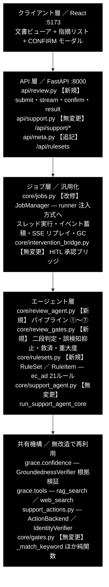
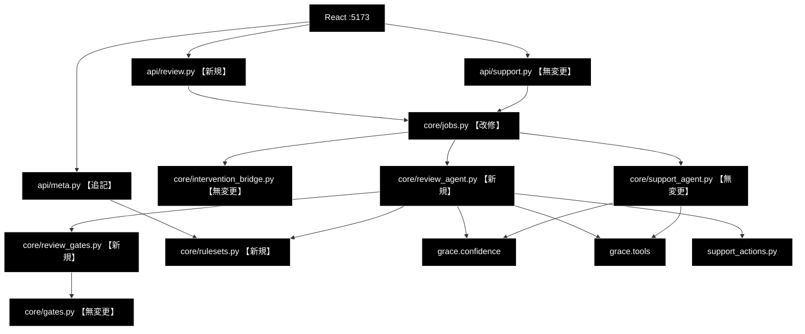
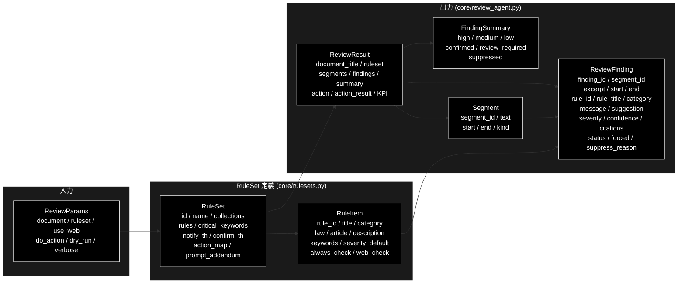
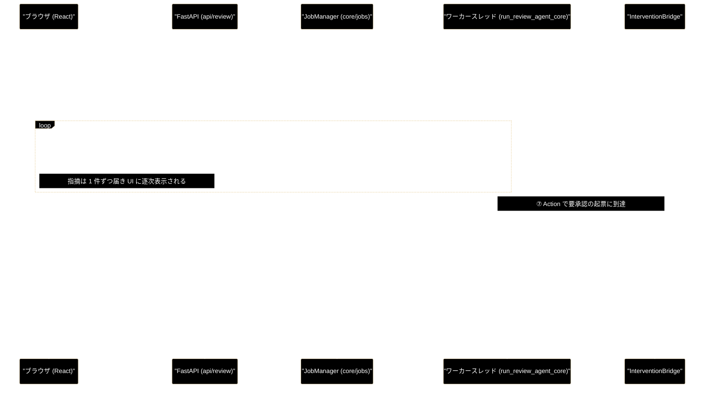
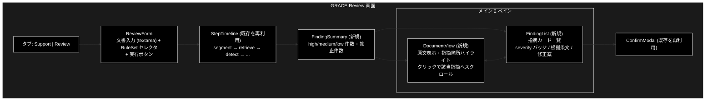

# GRACE-Review 設計書 — 業界特化・文書レビューエージェント

**Version 1.1** | 最終更新: 2026-08-01 | ステータス: **実装済み（STEP1〜7 完了・master マージ済み）**

> 📌 本書は**設計書**（意図と判断の記録）。実装後の各モジュール仕様は IPO 形式の
> モジュールドキュメントを正とする — [`core_rulesets.md`](./core_rulesets.md) /
> [`core_review_gates.md`](./core_review_gates.md) / [`core_review_agent.md`](./core_review_agent.md) /
> [`api_review.md`](./api_review.md)、フロントは
> [`../../frontend/docs/review_ui.md`](../../frontend/docs/review_ui.md)。
> 設計と実装が食い違う場合は**実装とモジュールドキュメントが正**。

---

## 目次

1. [概要と設計方針](#1-概要と設計方針)
2. [アーキテクチャ](#2-アーキテクチャ)
3. [パイプライン ①〜⑥](#3-パイプライン-)
4. [データモデル](#4-データモデル)
5. [RuleSet 定義（ec_ad）](#5-ruleset-定義ec_ad)
6. [ジョブ基盤の汎用化](#6-ジョブ基盤の汎用化)
7. [API 設計](#7-api-設計)
8. [フロントエンド設計](#8-フロントエンド設計)
9. [テスト方針](#9-テスト方針)
10. [実装計画とファイル一覧](#10-実装計画とファイル一覧)
11. [未決事項](#11-未決事項)
12. [変更履歴](#12-変更履歴)

---

## 1. 概要と設計方針

### 1.1 何を作るか

GRACE-Review は、**文書（EC の LP・商品説明文など）を規程（景表法・特商法・薬機法）に照らして点検し、
根拠条文つきの指摘リストを返す**自律型エージェントである。初回の業界プロファイルは
**`ec_ad`（EC 広告表示チェック）**。

既存の GRACE-Support が「問い合わせ → 回答」だったのに対し、GRACE-Review は
**「文書 → 指摘」**と入出力の型が変わる。しかしパイプラインの中核機構は共通で、
**既存コードの再利用率は概算 60〜70%** を見込む。

### 1.2 Support との対応関係（再利用の根拠）

| GRACE-Support（既存） | GRACE-Review（新規） | 再利用する実装 |
|---|---|---|
| 問い合わせ → 回答 | 文書 → 指摘リスト | — |
| ③ Groundedness（回答の裏付け） | ④ Ground（**指摘の根拠**が条文にあるか） | `GroundednessVerifier` **無改造** |
| ④ 回答ゲート（支持率で answer/escalate） | ⑤ 指摘ゲート（確信度で confirmed / review_required） | `_answer_gate` と同型ロジック |
| ④' 情報なし回答の検知 | ④' **誤検知抑止**（規程に該当しない指摘を落とす） | `_detect_no_info_answer` と同型（二段判定） |
| ④-救済（矛盾なし・出典ありは維持） | ④-救済（矛盾なし指摘は棄却せず保留へ） | `_should_rescue_unaffirmed` と同型 |
| エスカレ語 → 強制エスカレ | **重大リスク語** → 強制 `high`（必ず人間レビュー） | `_should_force_escalate` と同型（二段判定） |
| ⑤ Web フォールバック | ⑥ Web 裏取り（法改正・ガイドライン更新） | `tool_registry.execute("web_search")` |
| ⑥ Action（本人確認 → HITL → 実行） | ⑦ Action（レポート出力 → HITL → 差し戻し） | `_perform_action` / `ActionBackend` **無改造** |
| VerticalProfile | **RuleSet** | 構造を踏襲（`verticals.py` と同型） |

### 1.3 設計方針（3 原則）

1. **既存機構を無改造で使う。** `GroundednessVerifier` / `InterventionBridge` /
   `ActionBackend` / `tool_registry` は 1 行も変更しない。変更が必要になったら設計を疑う。
2. **過検知を抑えることを最優先にする。** 文書レビュー AI の実用上の失敗は「指摘が多すぎて
   読まれない」であり、精度より**指摘の信頼性**が価値を決める。Support で実装済みの
   3 つの抑止機構（二段判定・誤検知抑止・救済）をそのまま持ち込む。
3. **既存 Support を壊さない。** ジョブ基盤の汎用化は後方互換を保ち、
   `api/support.py` と `core/support_agent.py` は**無変更**とする。

### 1.4 技術スタック

| 用途 | 実体 |
|---|---|
| LLM（検出・判定・要約） | Anthropic Claude `claude-sonnet-4-6` |
| LLM（軽量二段判定） | Anthropic Claude `claude-haiku-4-5-20251001` |
| Embedding（規程検索） | Gemini `gemini-embedding-001`（3072次元） |
| ベクトル DB | Qdrant（コレクション `*_anthropic`） |
| Web API | FastAPI（`:8000`）・SSE |
| フロントエンド | Vite + React 18 + TypeScript（`:5173`） |

---

## 2. アーキテクチャ

### 2.1 全体構成

構成は **2 枚組**で示す。**図A** が層の積み重なり、**図B** がコンポーネント 14 個の
依存関係（エッジ 17 本、省略なし）。1 枚に統合すると、層の枠（subgraph）を跨ぐ
エッジが原因でノードが横方向に広がり、文字が潰れて読めなくなるため分けている。

凡例: **【新規】** 新規作成 / **【改修】** 既存を変更 / **【追記】** 既存へ追加 /
**【無変更】** 手を入れない。

#### 図A — レイヤ構成（何がどの層にあるか）



#### 図B — コンポーネント依存関係（何が何を呼ぶか・省略なし）

ノードは実ファイル 1 個に対応する。ラベルを 1 行に抑えることで横幅の膨張を防ぎ、
各エッジの意味は直後の一覧表で補う。層の帰属は図A を参照。



#### 依存関係の内訳（図B のエッジ 17 本）

| # | 呼び出し元 | 呼び出し先 | 呼び出す内容 |
|---:|---|---|---|
| 1 | React | `api/review.py` | `POST /api/review/submit`・SSE 購読・`POST /confirm`・`GET /result` |
| 2 | React | `api/support.py` | 既存のサポート画面（タブ切替で共存） |
| 3 | React | `api/meta.py` | `GET /api/rulesets` で RuleSet セレクタを構築 |
| 4 | `api/review.py` | `core/jobs.py` | `job_manager.start(ReviewParams)` → `job_id` / `stream_url` |
| 5 | `api/support.py` | `core/jobs.py` | `job_manager.start(JobParams)` — **既存呼び出しのまま無変更** |
| 6 | `api/meta.py` | `core/rulesets.py` | `RULESETS` を `RuleSetInfo[]` へ整形 |
| 7 | `core/jobs.py` | `core/intervention_bridge.py` | `InterventionBridge(emit=job.emit)` を生成し `resolver` を runner へ渡す |
| 8 | `core/jobs.py` | `core/review_agent.py` | `run_review_agent_core(params, emit, confirm)` をワーカースレッドで実行 |
| 9 | `core/jobs.py` | `core/support_agent.py` | `run_support_agent_core(...)` — **既存経路のまま無変更** |
| 10 | `core/review_agent.py` | `core/review_gates.py` | ③検出・④'抑止・④救済・⑤重大度の純関数群 |
| 11 | `core/review_agent.py` | `core/rulesets.py` | `RULESETS.get(ruleset_id)` で `RuleSet` / `RuleItem` を解決 |
| 12 | `core/review_agent.py` | `grace.confidence` | `GroundednessVerifier.verify()` で ④ 指摘の根拠検証 |
| 13 | `core/review_agent.py` | `grace.tools` | `rag_search`（② 規程検索）/ `web_search`（⑥ 法改正の裏取り） |
| 14 | `core/review_agent.py` | `support_actions.py` | `create_action_backend()` → ⑦ アクション実行 |
| 15 | `core/review_gates.py` | `core/gates.py` | `_match_keyword` を第1段の候補検出に再利用 |
| 16 | `core/support_agent.py` | `grace.confidence` | 既存の ③ Confidence（共有先が同一であることを示す） |
| 17 | `core/support_agent.py` | `grace.tools` | 既存の ② Execute / ⑤ Web フォールバック |

> 📝 **図の分割方針（再発防止）**: Mermaid（dagre）は subgraph を跨ぐエッジが多いと
> subgraph の枠自体を横方向に配置するため、「層の枠」と「細かい依存」を 1 枚に
> 同居させると必ず横長になる。`direction TB` は外部ノードとのエッジがある場合に
> 無視されるため回避策にならない。**層の表現（図A）と依存の表現（図B）を分け、
> 図B では subgraph を使わない**のが、情報量を落とさずに読める唯一の構成。

### 2.2 変更の影響範囲

| ファイル | 変更 |
|---|---|
| `backend/app/core/jobs.py` | **改修**（後方互換つき汎用化） |
| `backend/app/core/support_agent.py` | 無変更 |
| `backend/app/core/gates.py` | 無変更（`_match_keyword` を import して再利用） |
| `backend/app/core/verticals.py` | 無変更 |
| `backend/app/core/intervention_bridge.py` | 無変更 |
| `backend/app/api/support.py` | 無変更 |
| `backend/app/api/meta.py` | **追記**（`/api/rulesets` を 1 エンドポイント追加） |
| `backend/app/main.py` | **追記**（`review.router` を 1 行結線） |
| `backend/app/schemas.py` | **追記**（Review 系スキーマ） |
| `support_actions.py` / `grace/*` | 無変更 |

---

## 3. パイプライン ①〜⑥

### 3.1 ステップ ID

SSE の `step` イベントで使う。UI のタイムライン表示と 1:1 対応する。

```python
REVIEW_STEP_IDS = (
    "ruleset",    # S1 RuleSet 適用（--ruleset 指定時のみ）
    "segment",    # ① Segment  文書を検査単位に分割
    "retrieve",   # ② Retrieve 規程を RAG 検索
    "detect",     # ③ Detect   違反候補の二段判定
    "ground",     # ④ Ground   指摘の根拠検証
    "suppress",   # ④' Suppress 誤検知抑止 + 救済
    "web",        # ⑥ Web      法改正の裏取り（任意）
    "severity",   # ⑤ Severity 重大度判定
    "action",     # ⑦ Action   レポート → HITL → 適用
)
```

> 📝 **実行順の注記**: 番号（①〜⑦）は Support の対応関係を示すための呼称であり、
> **実際の実行順は上の `REVIEW_STEP_IDS` の並び**（segment → retrieve → detect →
> ground → suppress → web → severity → action）である。Support で ④' が ⑤ の後に
> 来るのと同じく、番号順と実行順は一致しない。

### 3.2 処理フロー

```mermaid
flowchart TB
    START(["文書 (LP テキスト)"]) --> KEY{"ANTHROPIC_API_KEY<br>設定済み？"}
    KEY -- "未設定" --> ERR["error イベント → 終了"]
    KEY -- "OK" --> S0["S1 RuleSet 適用<br>規程コレクション・しきい値・重大リスク語を切替<br>config.qdrant.allowed_collections へ注入"]
    S0 --> S1["① Segment<br>文書を検査単位に分割 (段落・箇条書き・見出し)<br>各セグメントに文字オフセットを付与"]
    S1 --> S2["② Retrieve<br>セグメントごとに規程を RAG 検索<br>rag_search (allowed_collections で範囲限定)"]
    S2 --> S3A{"③-1 候補検出<br>RuleItem.keywords の<br>キーワード一致？"}
    S3A -- "不一致" --> SKIP["このルールはスキップ<br>(LLM 呼び出しなし = 低コスト)"]
    S3A -- "一致" --> S3B["③-2 LLM 判定<br>実際に抵触するか + 指摘文 + 修正案を生成"]
    SKIP --> S4
    S3B --> S4["④ Ground<br>GroundednessVerifier で<br>指摘文 x 規程条文を検証 → support_rate"]
    S4 --> S4P{"④' 誤検知抑止<br>根拠ゼロ / 支持率が confirm_th 未満？"}
    S4P -- "はい" --> RESCUE{"④-救済<br>矛盾なし かつ 条文あり かつ<br>実質的な指摘？"}
    RESCUE -- "はい" --> KEEPR["review_required として残す<br>(棄却しない)"]
    RESCUE -- "いいえ" --> SUP["suppressed<br>(指摘リストから除外)"]
    S4P -- "いいえ" --> WEBQ
    KEEPR --> WEBQ
    SUP --> WEBQ{"⑥ Web 裏取り<br>use_web かつ<br>法改正リスクあり？"}
    WEBQ -- "はい" --> WEB["web_search で最新ガイドライン確認<br>矛盾があれば信頼度を下げる"]
    WEBQ -- "いいえ" --> S5
    WEB --> S5["⑤ Severity<br>rule.severity_default を基準に<br>support_rate で調整"]
    S5 --> FORCE{"重大リスク語に一致？<br>(二段判定: 語 → 意図分類)"}
    FORCE -- "一致かつ誤検知でない" --> HIGH["severity = high 強制<br>status = review_required 強制"]
    FORCE -- "不一致 / 誤検知" --> S6
    HIGH --> S6["⑦ Action<br>指摘レポート生成"]
    S6 --> ACTQ{"do_action かつ<br>指摘あり？"}
    ACTQ -- "いいえ" --> DONE
    ACTQ -- "はい" --> HITL{"requires_confirmation？"}
    HITL -- "はい" --> CONF["HITL CONFIRM<br>(フロント承認待ち /<br>タイムアウト → 実行せず有人へ)"]
    HITL -- "いいえ" --> EXEC
    CONF -- "承認" --> EXEC["ActionBackend で実行<br>(dry-run / webhook / pseudo)"]
    CONF -- "拒否 / タイムアウト" --> NOEXEC["実行せず有人対応へ"]
    EXEC --> DONE(["result イベント (ReviewResult)"])
    NOEXEC --> DONE
classDef default fill:#000,stroke:#fff,color:#fff
classDef subgraphStyle fill:#1a1a1a,stroke:#fff,color:#fff
class START,KEY,ERR,S0,S1,S2,S3A,SKIP,S3B,S4,S4P,RESCUE,KEEPR,SUP,WEBQ,WEB,S5,FORCE,HIGH,S6,ACTQ,HITL,CONF,EXEC,NOEXEC,DONE default
```



### 3.3 各ステップの詳細

#### S1 RuleSet 適用（`ruleset`）

`RULESETS.get(ruleset_id)` で解決し、以下を `config` へ注入する。**Support の S1 と同じ手順**。

```python
config.qdrant.allowed_collections = list(ruleset.collections)
config.llm.prompt_addendum = ruleset.prompt_addendum
notify_th = ruleset.notify_th   # 指摘を自動確定するしきい値
confirm_th = ruleset.confirm_th # これ未満は誤検知抑止の対象
```

未指定時は `step_skipped("ruleset")` としてスキップし、既定しきい値で動作する。

#### ① Segment（`segment`）

文書を**検査単位（セグメント）**へ分割する。分割は LLM を使わず決定的に行う。

| 分割規則 | 内容 |
|---|---|
| 一次分割 | 空行（`\n\s*\n`）で段落へ |
| 二次分割 | 段落が `MAX_SEGMENT_CHARS`(=400) を超える場合、日本語文末（`。！？`）で再分割 |
| 箇条書き | 行頭 `・`, `-`, `*`, `1.` は 1 行 1 セグメント |
| 空白のみ | 破棄 |
| オフセット | 元文書内の `start` / `end`（文字位置）を保持 → **UI のハイライトに使用** |

> ⚠️ **オフセットは必ず原文に対して取る。** 正規化（全角→半角等）を挟むと UI の
> ハイライト位置がずれる。正規化は判定用のコピーに対してのみ行い、`start`/`end` は
> 原文基準を維持する。

#### ② Retrieve（`retrieve`）

セグメントごとに規程コレクションを検索する。**既存の `rag_search` ツールを無改造で使う**。

```python
res = tool_registry.execute(
    "rag_search",
    query=segment.text,
    limit=RETRIEVE_LIMIT,           # 既定 5
    allowed_collections=list(ruleset.collections),
)
```

コスト対策として、**同一文書内の検索結果はセグメント単位でキャッシュしない**（各セグメントが
異なる文言のため）。ただし規程コレクションが未登録の場合は `rag_search` の
自動フォールバックにより制限なし検索になるため、**RuleSet の `rules` に埋め込んだ条文テキストを
フォールバック根拠として使う**（§5.3 参照）。

#### ③ Detect（`detect`）— 二段判定

**Support の強制エスカレ判定（`_should_force_escalate`）と同じ二段構造**を採る。

| 段 | 処理 | コスト |
|---|---|---|
| **第1段** | `RuleItem.keywords` とセグメント本文のキーワード一致（`_match_keyword` を再利用） | 0（LLM 呼び出しなし） |
| **第2段** | 一致したルールのみ LLM で「実際に抵触するか」を判定し、指摘文・修正案を生成 | 軽量 LLM 1 回 / (セグメント × 一致ルール) |

第2段の出力スキーマ（Pydantic・Structured Outputs）:

```python
class DetectVerdict(BaseModel):
    violates: bool          # 抵触するか
    message: str            # 指摘内容（1〜2文）
    suggestion: str         # 修正案（1文）
    excerpt: str            # 該当箇所（セグメント本文の部分文字列）
```

`violates=False` はその場で破棄する（指摘化しない）。LLM 判定失敗（`None`）は
**安全側＝指摘として残し `review_required` にする**（Support の「判定失敗は escalate」と同方針）。

> 💡 **キーワード方式の限界を承知の上で採用する。** キーワード非依存の違反
> （例: 根拠のない体験談）は第1段をすり抜ける。これは `RuleItem.keywords` を空にすると
> 「全セグメント × そのルール」で第2段を回す設定（`always_check=True`）で補う。
> 常時チェックするルールは RuleSet 側で明示的に選ぶ（コストと精度のトレードオフを設定で持つ）。

#### ④ Ground（`ground`）

**`GroundednessVerifier` を無改造で使う。** 引数の意味を読み替えるだけで成立する。

| verifier の引数 | Support での意味 | Review での意味 |
|---|---|---|
| `query` | 問い合わせ | 「この記述は〈ルール名〉に抵触するか」 |
| `answer` | 生成された回答 | **生成された指摘文（message）** |
| `sources` | RAG で引いた出典 | **② で引いた規程条文 + RuleItem.description** |

```python
gres = verifier.verify(
    query=f"次の記述は「{rule.title}」（{rule.law} {rule.article}）に抵触するか",
    answer=finding.message,
    sources=[_citation_text(c) for c in finding.citations],
)
finding.confidence = gres.support_rate
```

これにより「**指摘そのものが条文で裏付けられているか**」が数値化される。
根拠のない思い込み指摘は `support_rate` が下がり、次の ④' で落ちる。

#### ④' Suppress（`suppress`）— 誤検知抑止 + 救済

Support の `_detect_no_info_answer` / `_should_rescue_unaffirmed` と**同型のロジック**。

```
support_rate >= notify_th                    → status = "confirmed"       （自動確定）
confirm_th <= support_rate < notify_th       → status = "review_required" （要人間確認）
support_rate <  confirm_th
    ├─ 矛盾なし かつ 条文あり かつ 実質的指摘 → status = "review_required" （④-救済）
    └─ それ以外                              → status = "suppressed"      （除外）
verified == False（検証不能）                 → status = "review_required" （安全側）
```

**救済の判定条件**（`_should_rescue_unaffirmed` と同じ発想）:

- `gres.has_contradiction == False`（条文と矛盾していない）
- `len(finding.citations) > 0`（根拠条文が引けている）
- 指摘文が実質的（定型の「問題ありません」型でない — 軽量 LLM の二段判定）

救済された指摘は**棄却せず `review_required`** に落とす。「弱い根拠だから消す」ではなく
「弱い根拠だから人が見る」という方針で、見落とし（false negative）を防ぐ。

`suppressed` の指摘は `ReviewResult.findings` から除外し、
**件数のみ `summary.suppressed` に残す**（KPI 計測・チューニング用）。

#### ⑥ Web 裏取り（`web`）

`use_web=True` かつ RuleSet が `web_check=True` を指定したルールに該当する指摘のみ、
法改正・ガイドライン更新を確認する。**Support の ⑤ と同じ `web_search` 呼び出し**。

```python
res = tool_registry.execute("web_search", query=f"{rule.law} {rule.article} 改正 ガイドライン")
```

Web の記述と指摘が矛盾する場合は `confidence` を減じ、`review_required` へ落とす。
**Web を根拠に新しい指摘を作ることはしない**（出典の信頼性が担保できないため）。

#### ⑤ Severity（`severity`）

```
base = rule.severity_default                       # RuleSet が定める既定重大度
support_rate >= notify_th                → base のまま
confirm_th <= support_rate <  notify_th  → 1 段下げる (high→medium, medium→low)
重大リスク語に一致（二段判定で誤検知でない） → high へ強制 + review_required へ強制
```

**重大リスク語の二段判定**は Support の `_should_force_escalate` をそのまま踏襲する。
第1段でキーワード一致、第2段で意図分類（`claude-haiku-4-5-20251001`）を行い、
「引用・否定文脈での言及」を誤検知として除外する。

例: 「当社は『業界No.1』などの表現は使用しません」という文は `No.1` に一致するが、
意図分類で「否定・方針表明」と判定されれば強制 high にしない。

#### ⑦ Action（`action`）

**Support の ⑥ と同じ `_perform_action` / `ActionBackend` を使う。**
本人確認（`IdentityVerifier`）は文書レビューでは不要なため `identity_verifier=None` を渡す。

| 条件 | action_type | requires_confirmation |
|---|---|---|
| `high` の指摘が 1 件以上 | `escalate_to_human` | **False**（引き継ぎ自体は承認不要） |
| `confirmed` の指摘のみ | `create_ticket` | True |
| 指摘 0 件 | なし（スキップ） | — |

`args` には `{"ruleset": ..., "findings": <件数>, "high": <件数>, "report": <Markdown>}` を載せる。

---

## 4. データモデル

### 4.1 クラス図



### 4.2 `ReviewFinding`（中核スキーマ）

```python
Severity = Literal["high", "medium", "low"]
FindingStatus = Literal["confirmed", "review_required", "suppressed"]

@dataclass
class ReviewFinding:
    """1件の指摘。UI の指摘カード 1 枚に対応する。"""

    finding_id: str            # "f001" 形式（表示・承認の識別子）
    segment_id: str            # 対象セグメント（"s003"）
    excerpt: str               # 該当箇所の原文（そのまま UI に表示）
    start: int                 # 原文内の開始オフセット（ハイライト用）
    end: int                   # 原文内の終了オフセット（ハイライト用）

    rule_id: str               # 抵触するルール（"keihyo-01"）
    rule_title: str            # "優良誤認表示"
    category: str              # "優良誤認" / "有利誤認" / "表記漏れ" ...
    law: str                   # "景品表示法"
    article: str               # "第5条第1号"

    message: str               # 指摘内容（1〜2文）
    suggestion: str            # 修正案（1文）

    severity: Severity         # 重大度（⑤ で確定）
    confidence: float          # 根拠支持率（④ の support_rate）
    citations: List[str]       # 根拠条文（"[規程] 景表法第5条第1号: ..."）

    status: FindingStatus      # ④' で確定
    forced: bool = False       # 重大リスク語による強制 high か（KPI 用）
    suppress_reason: Optional[str] = None   # suppressed の理由（デバッグ用）
    web_checked: bool = False  # ⑥ で Web 裏取りしたか
```

### 4.3 `Segment` / `FindingSummary` / `ReviewResult`

```python
@dataclass
class Segment:
    segment_id: str            # "s003"
    text: str                  # セグメント本文（原文そのまま）
    start: int                 # 原文内オフセット
    end: int
    kind: str = "paragraph"    # "paragraph" | "list_item" | "heading"


@dataclass
class FindingSummary:
    high: int = 0
    medium: int = 0
    low: int = 0
    confirmed: int = 0
    review_required: int = 0
    suppressed: int = 0        # findings には含まれない（件数のみ）


@dataclass
class ReviewResult:
    document_title: str
    ruleset: Optional[str]                    # 適用した RuleSet ID
    segments: List[Segment]                   # UI のハイライト用
    findings: List[ReviewFinding]             # suppressed を除く
    summary: FindingSummary
    used_web: bool = False
    action: Optional[ActionRequest] = None    # verticals.ActionRequest を再利用
    action_result: Optional[str] = None
    # --- KPI 計測用メタデータ ---
    segments_total: int = 0
    rules_evaluated: int = 0                  # 第2段 LLM を呼んだ (セグメント×ルール) 数
    detected_raw: int = 0                     # 第2段が violates=True とした数
    rescued: int = 0                          # ④-救済で残した数
    forced_high: int = 0                      # 重大リスク語で強制 high にした数
```

> 📌 **`detected_raw` と `len(findings)` の差が誤検知抑止の効き具合**を表す。
> チューニング時はこの比率（抑止率）と、既知 NG サンプルの検出漏れを両方見る。

### 4.4 進捗イベント

Support の `SupportEvent` を**そのまま再利用**する（`type` / `step` / `status` / `title` /
`message` / `data`）。`step` の値のみ `REVIEW_STEP_IDS` に変わる。
これにより **SSE 配信・`jobs.py`・フロントの `jobReducer` が共通化できる**。

指摘が 1 件確定するたびに `finding` 相当の `log` イベントを流し、
UI が**逐次で指摘を積み上げられる**ようにする（全件終了を待たせない）。

```python
_emit(SupportEvent(
    type="log", step="ground",
    message=f"[{finding.rule_id}] {finding.message}",
    data={"finding": asdict(finding)},
))
```

---

## 5. RuleSet 定義（ec_ad）

### 5.1 データ構造

```python
@dataclass
class RuleItem:
    rule_id: str                       # "keihyo-01"
    title: str                         # "優良誤認表示"
    category: str                      # "優良誤認"
    law: str                           # "景品表示法"
    article: str                       # "第5条第1号"
    description: str                   # 判定基準（LLM プロンプトに埋め込む）
    keywords: List[str] = field(default_factory=list)   # 第1段の候補検出語
    severity_default: Severity = "medium"
    always_check: bool = False         # True なら keywords 不問で第2段を必ず実行
    web_check: bool = False            # True なら ⑥ Web 裏取りの対象


@dataclass
class RuleSet:
    id: str                            # "ec_ad"
    name: str                          # "EC広告表示"
    collections: List[str]             # 規程 Qdrant コレクション
    rules: List[RuleItem]
    critical_keywords: List[str] = field(default_factory=list)  # 強制 high
    notify_th: float = 0.85            # 自動確定しきい値（法令なので厳しめ）
    confirm_th: float = 0.60
    action_map: Dict[str, str] = field(default_factory=dict)
    prompt_addendum: str = ""
```

### 5.2 `ec_ad` の設定値

```python
RuleSet(
    id="ec_ad",
    name="EC広告表示",
    collections=["ec_ad_rules_anthropic", "ec_policy_anthropic"],
    critical_keywords=[
        "No.1", "ナンバーワン", "日本一", "世界一", "最安", "業界最",
        "完治", "治る", "がん", "医薬品", "副作用がない", "絶対",
    ],
    notify_th=0.85,     # 既定 (gov=0.8) より厳しい。誤指摘のコストが高いため
    confirm_th=0.60,
    action_map={"修正": "create_ticket", "差し戻し": "send_reply"},
    prompt_addendum=(
        "景品表示法・特定商取引法・医薬品医療機器等法の条文に基づいて判定し、"
        "該当条項番号を必ず明示すること。断定を避け、根拠のない指摘はしないこと。"
    ),
    rules=[...],        # §5.3
)
```

### 5.3 ルール一覧（21 件）

`description` は LLM の判定基準としてそのままプロンプトへ埋め込む。
**規程コレクションが未登録の場合、この `description` と `article` が根拠のフォールバックになる**
ため、条文の要点を自己完結的に書く。

#### 景品表示法（12 件）

| # | rule_id | title | article | severity | keywords（第1段） |
|---|---|---|---|:--:|---|
| 1 | `keihyo-01` | 優良誤認表示 | 第5条第1号 | high | 最高, 最強, 世界初, 日本初, 唯一, 究極, 完璧 |
| 2 | `keihyo-02` | 有利誤認表示 | 第5条第2号 | high | 業界最安, 他社より安, 最安値, 底値 |
| 3 | `keihyo-03` | No.1 表示の根拠 | 第5条第1号 | high | No.1, ナンバーワン, 第1位, シェア1位, 売上1位 |
| 4 | `keihyo-04` | 二重価格表示 | 第5条第2号 | high | 通常価格, 定価, メーカー希望小売価格, 元値, 参考価格 |
| 5 | `keihyo-05` | 打消し表示の明瞭性 | 第5条 | medium | ※, 注), 個人の感想, 効果を保証するものではありません |
| 6 | `keihyo-06` | 体験談の一般化 | 第5条第1号 | medium | 体験談, お客様の声, 使ってみたら, 実感しました |
| 7 | `keihyo-07` | 期間限定表示の常態化 | 第5条第2号 | medium | 今だけ, 期間限定, 本日限り, 残りわずか |
| 8 | `keihyo-08` | 無料表示の条件不記載 | 第5条第2号 | medium | 無料, 0円, タダ, フリー |
| 9 | `keihyo-09` | 数量限定の根拠 | 第5条第2号 | low | 限定, 先着, 在庫僅少, ラスト |
| 10 | `keihyo-10` | おとり広告 | 第5条第3号 | high | 特価, 目玉, 売切れ次第 |
| 11 | `keihyo-11` | 原産国の誤認 | 第5条第3号 | medium | 国産, 日本製, made in, 産地 |
| 12 | `keihyo-12` | 景品類の限度額 | 第4条 | low | プレゼント, 抽選, もれなく, 景品 |

#### 医薬品医療機器等法（3 件）

| # | rule_id | title | article | severity | keywords |
|---|---|---|---|:--:|---|
| 13 | `yakki-01` | 食品の医薬品的効能標榜 | 第68条 | high | 治る, 治療, 改善, 予防, 効く, 病気, 症状 |
| 14 | `yakki-02` | 化粧品の効能範囲逸脱 | 第66条 | high | シワが消える, 若返る, 美白, アンチエイジング |
| 15 | `yakki-03` | 医療機器的性能の標榜 | 第68条 | medium | 血行促進, 筋肉増強, 痩身, 医療用 |

#### 特定商取引法（6 件・すべて `always_check=True`）

表記漏れの検出はキーワードでは拾えないため、**文書全体に対して常時チェック**する。

| # | rule_id | title | article | severity | 判定内容 |
|---|---|---|---|:--:|---|
| 16 | `tokusho-01` | 販売価格・送料の明示 | 第11条 | high | 価格と送料の記載があるか |
| 17 | `tokusho-02` | 代金支払時期・方法 | 第11条 | medium | 支払方法の記載があるか |
| 18 | `tokusho-03` | 商品引渡時期 | 第11条 | medium | 発送・お届け時期の記載があるか |
| 19 | `tokusho-04` | 返品特約の表示 | 第11条 | high | 返品可否・条件・期限の記載があるか |
| 20 | `tokusho-05` | 事業者名・住所・連絡先 | 第11条 | high | 事業者情報の記載があるか |
| 21 | `tokusho-06` | 定期購入の条件明示 | 第12条の6 | high | 継続回数・総額・解約条件の記載があるか |

> ⚠️ **本 RuleSet は技術検証用のサンプルであり、法務レビューを受けたものではない。**
> `description` は公開されている条文・ガイドラインの要点を要約したものだが、
> **実運用には法務部門による監修が必須**である。この旨をコード冒頭の docstring と
> UI のフッターに明記する。

### 5.4 テストデータ

| ファイル | 内容 |
|---|---|
| `backend/tests/data/ec_ad_ng_sample.txt` | 意図的に違反を仕込んだ LP（各カテゴリ 1 件以上・想定 12 指摘） |
| `backend/tests/data/ec_ad_ok_sample.txt` | 適正表記の LP（想定 0 指摘。**過検知テスト用**） |
| `backend/tests/data/ec_ad_edge_sample.txt` | 誤検知しやすい文（否定文脈の「No.1」等。**抑止機構のテスト用**） |

---

## 6. ジョブ基盤の汎用化

### 6.1 課題

現状の `core/jobs.py` は `run_support_agent_core` を直接呼んでいる。

```python
# core/jobs.py（現状）
def _run(self, job: SupportJob) -> None:
    p = job.params
    result = run_support_agent_core(p.query, verbose=p.verbose, ...)
```

Review を同じジョブ基盤（スレッド実行・イベント蓄積・SSE リプレイ・HITL ブリッジ・GC）に
乗せるため、**実行関数を注入可能にする**。

### 6.2 設計（後方互換つき）

```python
# 実行関数の型: (params, emit, confirm) -> 結果 dict または None
JobRunner = Callable[[Any, EmitFn, ConfirmFn], Optional[Dict[str, Any]]]


@dataclass
class Job:                             # SupportJob からリネーム
    job_id: str
    kind: str                          # "support" | "review"  ← 新規
    params: Any                        # JobParams | ReviewParams
    status: str = "running"
    events: List[Dict[str, Any]] = field(default_factory=list)
    result: Optional[Dict[str, Any]] = None
    ...                                # 以下は現状と同一


SupportJob = Job                       # 後方互換エイリアス


class JobManager:
    def start(
        self,
        params: Any,
        runner: Optional[JobRunner] = None,
        kind: Optional[str] = None,
    ) -> Job:
        """runner 省略時は params の型から既定 runner を解決する。"""
        if runner is None:
            runner, kind = _resolve_default_runner(params)
        ...
```

`_resolve_default_runner` は `JobParams` → Support ランナー、`ReviewParams` → Review ランナーを
返す。**`api/support.py` の `job_manager.start(JobParams(...))` は 1 文字も変えずに動く。**

### 6.3 循環 import の回避

`jobs.py` が `review_agent` を import すると
`jobs → review_agent → jobs`（`ReviewParams` 参照）の循環が起きうる。
**`ReviewParams` は `review_agent.py` 側に置き、`jobs.py` は遅延 import する**方針とする
（現状 `jobs.py` が `support_agent` をトップレベル import しているのと同じ形を維持できるよう、
`JobParams` は `jobs.py` に残す）。

```python
def _resolve_default_runner(params: Any) -> tuple[JobRunner, str]:
    if isinstance(params, JobParams):
        return _support_runner, "support"
    from backend.app.core.review_agent import ReviewParams, run_review_agent_core  # 遅延
    if isinstance(params, ReviewParams):
        return _review_runner, "review"
    raise TypeError(f"unknown job params: {type(params).__name__}")
```

### 6.4 データフロー（SSE / HITL は Support と完全に同一）



---

## 7. API 設計

### 7.1 エンドポイント

| メソッド | パス | 内容 |
|---|---|---|
| `POST` | `/api/review/submit` | 文書を投入しジョブ起動 → `202 {job_id, stream_url}` |
| `GET` | `/api/review/stream/{job_id}` | SSE で進捗配信（Support と同形式） |
| `POST` | `/api/review/confirm/{job_id}` | HITL CONFIRM への応答 |
| `GET` | `/api/review/result/{job_id}` | 状態と `ReviewResult`（ポーリング用） |
| `GET` | `/api/rulesets` | RuleSet 一覧（`/api/verticals` と同型・`meta.py` に追記） |

### 7.2 リクエスト / レスポンス

```python
class ReviewRequest(BaseModel):
    """POST /api/review/submit"""
    document: str = Field(min_length=1, max_length=50_000, description="点検対象の文書")
    document_title: str = Field(default="無題", description="表示用タイトル")
    ruleset: Optional[Literal["ec_ad"]] = Field(default="ec_ad")
    use_web: bool = Field(default=False, description="Web で法改正を裏取り（既定 OFF）")
    do_action: bool = Field(default=True)
    dry_run: bool = Field(default=True)
    verbose: bool = Field(default=False)
```

- `use_web` の既定は **OFF**（Support は ON）。文書レビューは条文が一次情報であり、
  Web 検索は速度・コストに対して得るものが小さいため。
- `document` の上限 50,000 文字は、セグメント数 × ルール数の LLM 呼び出しが
  発散しないようにするためのガード。超過は `422`。

レスポンス型は `QueryAccepted` / `ConfirmRequest` / `ConfirmResponse` を**Support と共用**し、
結果のみ `ReviewJobStatusResponse`（`result: ReviewResultModel`）を新設する。

### 7.3 セグメント × ルールの組合せ爆発を防ぐガード

| ガード | 値 | 目的 |
|---|---|---|
| `MAX_DOCUMENT_CHARS` | 50,000 | 入力段で拒否（422） |
| `MAX_SEGMENTS` | 200 | 超過分は切り捨て、`log` で警告 |
| `MAX_LLM_CALLS` | 300 | 第2段の呼び出し上限。到達したら打ち切り、`ReviewResult` に警告を載せる |

> ⚠️ **これは必須のガードである。** 200 セグメント × 21 ルールを無条件に第2段へ流すと
> 4,200 回の LLM 呼び出しになる。第1段のキーワードフィルタが効くので実際はこの 1〜2 割だが、
> 上限を置かずに本番投入してはならない。

---

## 8. フロントエンド設計

### 8.1 画面構成

Support のチャット画面（`App.tsx`）とは**別画面**とし、上部にタブを置いて切り替える。



### 8.2 ハイライトの実装方針

`ReviewFinding.start` / `.end`（原文オフセット）をもとに、原文を
**「非該当テキスト」と「該当スパン」に分割してレンダリングする**。

```
1. findings を start 昇順にソート
2. 重なりを検出したら severity の高い方を優先（同値なら先勝ち）
3. [0, f1.start) 通常 / [f1.start, f1.end) <mark data-finding-id> / ... と分割
4. <mark> の背景色を severity で分ける（high=赤系 / medium=橙系 / low=灰系）
```

`dangerouslySetInnerHTML` は使わず、**React 要素の配列として構築する**（XSS 回避）。

### 8.3 型定義の追随

CLAUDE.md の CI ゲート要件により、**API スキーマ追加と同時に `frontend/src/types.ts` を更新する**。

```typescript
export type Severity = 'high' | 'medium' | 'low';
export type FindingStatus = 'confirmed' | 'review_required' | 'suppressed';

export interface ReviewFinding { /* §4.2 と 1:1 */ }
export interface Segment { /* §4.3 と 1:1 */ }
export interface FindingSummary { /* §4.3 と 1:1 */ }
export interface ReviewResult { /* §4.3 と 1:1 */ }
export interface RuleSetInfo { id: string; name: string; rule_count: number; ... }
export interface ReviewParams { /* §7.2 と 1:1 */ }
```

`jobReducer` は `SupportEvent` を扱う既存実装を**ジェネリック化せず、Review 用に薄い
`reviewReducer` を新設する**（result の型が異なるだけで構造は同じ。無理な共通化はしない）。

---

## 9. テスト方針

`backend/tests/` に追加。**実 API キー・Qdrant 不要**（`conftest.py` のスタブ方式を踏襲）。

| テストファイル | 対象 | 主な検証 |
|---|---|---|
| `test_review_segment.py` | ① Segment | 段落・箇条書き分割、オフセットが原文と一致すること |
| `test_review_gates.py` | ④'⑤ 純関数 | しきい値による status 判定、救済条件、severity 調整、強制 high |
| `test_review_agent_core.py` | パイプライン | スタブ LLM で ①〜⑦ が通ること、KPI カウンタの整合 |
| `test_review_api.py` | API | submit/stream/confirm/result の応答、422 ガード |
| `test_jobs_generic.py` | ジョブ汎用化 | **Support の既存挙動が変わらないこと**（回帰） |

**過検知の回帰テスト**を重視する:

```python
def test_ok_sample_produces_no_findings(...):
    """適正 LP に対して指摘 0 件（過検知しない）。"""

def test_edge_sample_suppresses_negated_mentions(...):
    """否定文脈の「No.1」を強制 high にしない（誤検知抑止）。"""
```

フロントは `vitest` で `reviewReducer` とハイライト分割ロジックを対象にする。

---

## 10. 実装計画とファイル一覧

### 10.1 新規ファイル

| ファイル | 役割 | 規模感 |
|---|---|---|
| `backend/app/core/rulesets.py` | `RuleItem` / `RuleSet` / `RULESETS`（ec_ad 21 ルール） | 中 |
| `backend/app/core/review_gates.py` | 検出二段判定・誤検知抑止・救済・重大度（**純関数**） | 中 |
| `backend/app/core/review_agent.py` | `ReviewParams` / `ReviewFinding` / `run_review_agent_core` | 大 |
| `backend/app/api/review.py` | `/api/review/*` | 小 |
| `frontend/src/components/DocumentView.tsx` | 原文 + ハイライト | 中 |
| `frontend/src/components/FindingList.tsx` | 指摘カード一覧 | 中 |
| `frontend/src/components/ReviewForm.tsx` | 入力フォーム | 小 |
| `frontend/src/state/reviewReducer.ts` | SSE イベント → 画面状態 | 小 |
| `backend/tests/test_review_*.py` | テスト 5 本 | 中 |
| `backend/tests/data/ec_ad_*.txt` | テストデータ 3 本 | 小 |

### 10.2 既存ファイルの変更

| ファイル | 変更内容 | リスク |
|---|---|:--:|
| `backend/app/core/jobs.py` | runner 注入方式へ（後方互換エイリアス付き） | **中**（回帰テストで担保） |
| `backend/app/schemas.py` | Review 系スキーマを追記 | 低 |
| `backend/app/api/meta.py` | `/api/rulesets` を追加 | 低 |
| `backend/app/main.py` | `review.router` を結線 | 低 |
| `frontend/src/App.tsx` | タブ切替を追加 | 低 |
| `frontend/src/types.ts` | Review 型を追記（**CI 必須**） | 低 |

### 10.3 実装順序（**全 STEP 完了**）

| STEP | 内容 | 状態 |
|:--:|---|:--:|
| 1 | `rulesets.py`（ec_ad 定義）+ テストデータ ← **LLM 不要で単体検証できる** | ✅ |
| 2 | `review_gates.py` + `test_review_gates.py` ← 純関数なのでテストが速い | ✅ |
| 3 | `jobs.py` 汎用化 + `test_jobs_generic.py` ← **Support の回帰をここで固める** | ✅ |
| 4 | `review_agent.py` + `test_review_agent_core.py` | ✅ |
| 5 | `api/review.py` + `schemas.py` + `meta.py` + `main.py` + `test_review_api.py` | ✅ |
| 6 | フロントエンド（`types.ts` → `reviewReducer` → コンポーネント → `App.tsx`） | ✅ |
| 7 | ドキュメント（IPO 形式のモジュール仕様、`frontend/docs/*.md`） | ✅ |

各ステップで CI 4 ゲート（`ruff` / `pytest backend` / `compileall` / `frontend`）を通した。

> 📝 STEP7 のドキュメントは計画時の `backend/docs/review_agent.md` ではなく、
> モジュール単位に分割して **`core_review_agent.md` / `core_review_gates.md` /
> `core_rulesets.md` / `api_review.md`** として作成した（1 モジュール 1 ドキュメントの規約に合わせた）。

---

## 11. 未決事項

実装着手前に確認したい点。**現時点の想定**を併記しているので、異論がなければこの前提で進める。

| # | 論点 | 想定（デフォルト） |
|---|---|---|
| 1 | **規程データの登録** | Qdrant コレクション `ec_ad_rules_anthropic` は**未作成**。初回は `RuleItem.description` を根拠のフォールバックとして動かし、コレクション登録は後続タスクとする |
| 2 | **文書の入力方式** | 初回は**テキスト貼り付けのみ**（`textarea`）。ファイルアップロード（HTML/PDF）は後続 |
| 3 | **Web 裏取りの既定** | **OFF**。条文が一次情報であり、Web は速度・コストに見合わないため |
| 4 | **`use_web` の位置づけ** | 既存の `⑤ Web フォールバック` と違い、Review では**信頼度を下げる方向にしか使わない**（Web 由来の新規指摘は作らない） |
| 5 | **本人確認** | 文書レビューでは不要 → `identity_verifier=None` 固定 |
| 6 | **法務監修** | 本 RuleSet は**技術検証用サンプル**。実運用には法務監修が必要である旨を docstring と UI に明記 |
| 7 | **画面の分離** | Support とはタブで分ける（1 画面に詰め込まない） |

---

## 12. 変更履歴

| バージョン | 変更内容 |
|-----------|---------|
| 1.0 | 初版作成。パイプライン ①〜⑦、`ReviewFinding` スキーマ、`ec_ad` RuleSet（21ルール）、ジョブ基盤の汎用化方針、API / フロント設計、テスト方針、実装計画を記述 |
| 1.1 | ステータスを「レビュー待ち（未実装）」→「実装済み（STEP1〜7 完了・master マージ済み）」へ更新（計画された新規ファイル・テスト・テストデータの実在を確認済み）。§10.3 を STEP 別の完了表に変更し、STEP7 のドキュメントが計画時の単一 `review_agent.md` ではなくモジュール単位 4 本として作成された旨を追記。冒頭に「設計書と実装が食い違う場合は実装とモジュールドキュメントが正」の位置づけを明記 |
