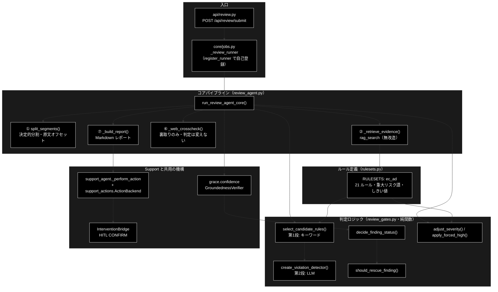
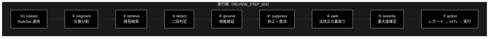
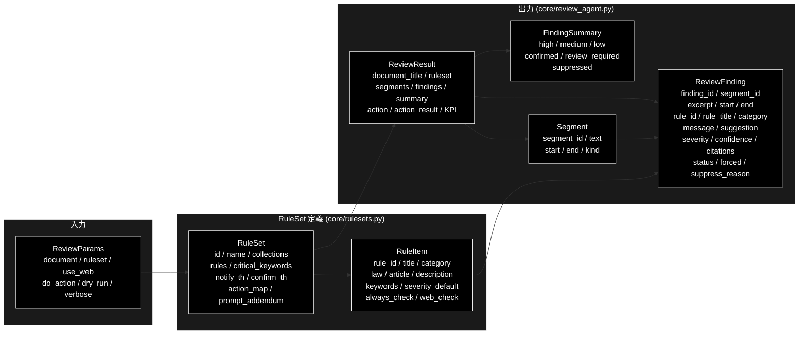
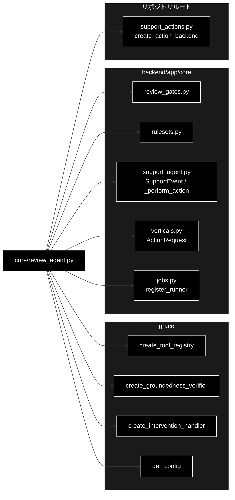
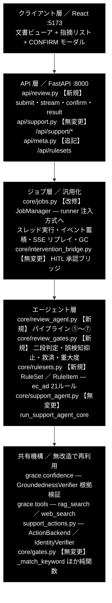
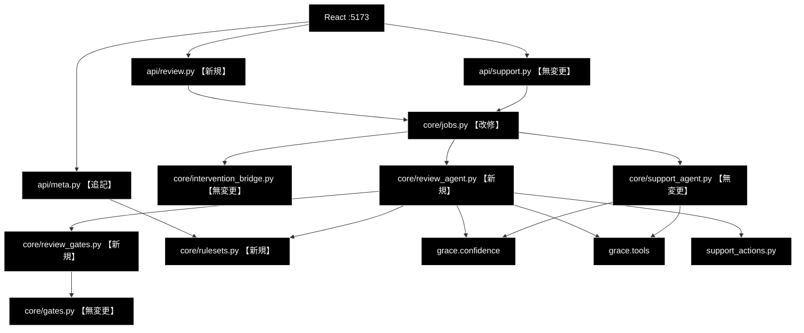

# GRACE-Review 処理フローと設計 ドキュメント

**Version 2.0** | 最終更新: 2026-09-16

> **本書の位置づけ**: GRACE-Review（文書 → 指摘）の**処理フロー（HOW）と設計判断（WHY）を
> 1 本にまとめた正本**。v2.0 で `review_agent_spec.md`（1,005 行）を統合した。
>
> | 知りたいこと | 参照先 |
> |---|---|
> | 各段が何を入力し何を出すか・なぜその判定か | 本書 §4（IPO ＋ `設計仕様`） |
> | ルールセット（`ec_ad`・23 ルール）の中身 | [`verticals_and_rulesets.md` §2](./verticals_and_rulesets.md) |
> | ジョブ・SSE・HITL の機構（Support と共通） | [`job_runtime.md`](./job_runtime.md) |
> | エンドポイントと SSE の契約 | [`api_contract.md`](./api_contract.md) |
> | 関数・クラスのシグネチャ | [`reference/core_review_agent.md`](./reference/core_review_agent.md) / [`reference/core_review_gates.md`](./reference/core_review_gates.md) |
> | テスト方針 | [`tests.md`](./tests.md) |

> **関連ドキュメント**
> - [`support_flow.md`](./support_flow.md) — 対になる GRACE-Support（0-(A)〜⑥）
> - [`architecture.md`](./architecture.md) — backend の層構造と外部境界
> - [`pitfalls.md`](./pitfalls.md) — 共用部品を触るときの注意

---

## 目次

- [概要](#概要)
- [1. 設計方針](#1-設計方針)
- [2. アーキテクチャ構成図](#2-アーキテクチャ構成図)
- [3. モジュール構成図](#3-モジュール構成図)
- [4. 処理ステップ IPO詳細（S1・①〜⑦）](#4-処理ステップ-ipo詳細s1)
- [5. 設定・定数](#5-設定定数)
- [6. 使用例](#6-使用例)
- [7. エクスポート](#7-エクスポート)
- [8. データモデル](#8-データモデル)
- [9. 未決事項](#9-未決事項)
- [10. 変更履歴](#10-変更履歴)
- [付録A: 依存関係図](#付録a-依存関係図)
- [付録B: 実装時の構成と影響範囲](#付録b-実装時の構成と影響範囲)

---

## 概要

本ドキュメントは、GRACE-Review パイプライン（`backend/app/core/review_agent.py` の
`run_review_agent_core()`）が実行する **処理フローの各ステップ（S1・①〜⑦）** を、
実装関数・シグネチャ・IPO（Input-Process-Output）・戻り値例・使用例つきで記述する。
全体像（アーキテクチャ・データフロー）はリポジトリルートの [`README.md`](../../README.md) §1〜§2 を参照。

Support（`support_agent.py`）が「問い合わせ → 回答」なのに対し、本パイプラインは
**「文書 → 指摘」**と情報の流れが逆になる。それでも中核部品は無改造で機能する。

| 中核部品 | Support での意味 | Review での意味 |
|---|---|---|
| `GroundednessVerifier` | 回答の主張が出典で裏付けられるか | **指摘が規程で裏付けられるか** |
| `_perform_action` / `ActionBackend` | 起票・返信の実行 | そのまま（起票・差し戻し） |
| `InterventionBridge` 経由の HITL CONFIRM | 副作用アクションの承認 | そのまま |

新規実装は **① Segment / ③ Detect / ⑤ Severity の 3 つだけ**で、
② Retrieve・④ Ground・④' 誤検知抑止・⑦ Action は既存機構の再利用である。

> 📝 **注意（実行順）**: ステップ番号は Support との**対応**を示す呼称であり、実行順とは
> 一致しない。実際の実行順は `REVIEW_STEP_IDS` の並び
> **S1 → ① → ② → ③ → ④ → ④' → ⑥ → ⑤ → ⑦** で、**⑥ Web 裏取りが ⑤ Severity より先**に来る
> （Support で ④' が ⑤ の後に来るのと同じ事情）。UI のタイムラインもこの並び。

### 主な責務

- 文書を検査単位（セグメント）へ決定的に分割し、**原文の文字オフセット**を保持する
- セグメントごとに規程を RAG 検索し、二段判定で違反候補を検出する
- 指摘そのものを `GroundednessVerifier` で裏付け検証し、誤検知を抑止・救済する
- 重大度を確定し、重大リスク語による強制 high を適用する
- 指摘レポートを組み立て、HITL CONFIRM を経てアクションを実行する
- 組合せ爆発（セグメント × ルール）のガードと KPI メタデータの計測

### 各責務対応のモジュール

| # | 責務 | 対応モジュール | 説明 |
|---|------|--------------|------|
| 1 | パイプライン統括 | `core/review_agent.py` | `run_review_agent_core()` が S1・①〜⑦ を実行 |
| 2 | 文書分割 | `core/review_agent.py` | `split_segments()`（LLM 不使用・決定的） |
| 3 | 規程検索 | `core/review_agent.py` | `_retrieve_evidence()`（`rag_search` を無改造で使用） |
| 4 | 判定ロジック | `core/review_gates.py` | 二段判定・抑止・救済・重大度（純関数＋ファクトリ） |
| 5 | ルール定義 | `core/rulesets.py` | `RuleSet` / `RULESETS`（`ec_ad`・21 ルール） |
| 6 | 根拠検証 | `grace.confidence` | `GroundednessVerifier`（Support と共用） |
| 7 | HITL・実行 | `core/support_agent.py` / `support_actions.py` | `_perform_action` / `ActionBackend` を再利用 |

### 主要機能一覧

| 機能 | 説明 |
|------|------|
| `run_review_agent_core()` | コアパイプライン本体（イベント発行型） |
| `split_segments()` | ① 文書を検査単位へ分割（原文オフセット保持） |
| `_retrieve_evidence()` | ② セグメントに関連する規程を RAG 検索 |
| `_web_crosscheck()` | ⑥ 法改正の裏取り（**判定は変えない**） |
| `_summarize()` | 重大度・状態別の集計（`FindingSummary`） |
| `_decide_review_action()` | ⑦ 指摘内容からアクション種別を決定 |
| `_build_report()` | 指摘レポート（Markdown）の生成 |
| `REVIEW_STEP_IDS` | ステップ ID 一覧（UI タイムライン対応） |

---

---

## 1. 設計方針


### 1.1 何を作るか

GRACE-Review は、**文書（EC の LP・商品説明文など）を規程（景表法・特商法・薬機法）に照らして点検し、
根拠条文つきの指摘リストを返す**自律型エージェントである。初回の業界プロファイルは
**`ec_ad`（EC 広告表示チェック）**。

既存の GRACE-Support が「問い合わせ → 回答」だったのに対し、GRACE-Review は
**「文書 → 指摘」**と入出力の型が変わる。しかしパイプラインの中核機構は共通で、
**既存コードの再利用率は概算 60〜70%** を見込む。

### 1.2 Support との対応関係（再利用の根拠）

| GRACE-Support（既存） | GRACE-Review（新規） | 再利用する実装 |
|---|---|---|
| 問い合わせ → 回答 | 文書 → 指摘リスト | — |
| ③ Groundedness（回答の裏付け） | ④ Ground（**指摘の根拠**が条文にあるか） | `GroundednessVerifier` **無改造** |
| ④ 回答ゲート（支持率で answer/escalate） | ⑤ 指摘ゲート（確信度で confirmed / review_required） | `_answer_gate` と同型ロジック |
| ④' 情報なし回答の検知 | ④' **誤検知抑止**（規程に該当しない指摘を落とす） | `_detect_no_info_answer` と同型（二段判定） |
| ④-救済（矛盾なし・出典ありは維持） | ④-救済（矛盾なし指摘は棄却せず保留へ） | `_should_rescue_unaffirmed` と同型 |
| エスカレ語 → 強制エスカレ | **重大リスク語** → 強制 `high`（必ず人間レビュー） | `_should_force_escalate` と同型（二段判定） |
| ⑤ Web フォールバック | ⑥ Web 裏取り（法改正・ガイドライン更新） | `tool_registry.execute("web_search")` |
| ⑥ Action（本人確認 → HITL → 実行） | ⑦ Action（レポート出力 → HITL → 差し戻し） | `_perform_action` / `ActionBackend` **無改造** |
| VerticalProfile | **RuleSet** | 構造を踏襲（`verticals.py` と同型） |

### 1.3 設計方針（3 原則）

1. **既存機構を無改造で使う。** `GroundednessVerifier` / `InterventionBridge` /
   `ActionBackend` / `tool_registry` は 1 行も変更しない。変更が必要になったら設計を疑う。
2. **過検知を抑えることを最優先にする。** 文書レビュー AI の実用上の失敗は「指摘が多すぎて
   読まれない」であり、精度より**指摘の信頼性**が価値を決める。Support で実装済みの
   3 つの抑止機構（二段判定・誤検知抑止・救済）をそのまま持ち込む。
3. **既存 Support を壊さない。** ジョブ基盤の汎用化は後方互換を保ち、
   `api/support.py` と `core/support_agent.py` は**無変更**とする。

### 1.4 技術スタック

| 用途 | 実体 |
|---|---|
| LLM（検出・判定・要約） | ローカル LLM（Ollama）。既定は `config.py::get_default_ollama_model()`（`gemma4:12b-mlx`）。③ Detect 第2段は `detect_model(config)` が **`config/grace_config.yml` の `llm.model`** から解決する |
| LLM（軽量二段判定） | 同じくローカル LLM。`judge_model(config)` が `config.llm.light_model` から解決する（未設定なら `verticals.INTENT_MODEL`） |
| Embedding（規程検索） | Gemini `gemini-embedding-001`（3072次元） |
| ベクトル DB | Qdrant（コレクション `*_anthropic`） |
| Web API | FastAPI（`:8000`）・SSE |
| フロントエンド | Vite + React 18 + TypeScript（`:5173`） |

---

## 2. アーキテクチャ構成図



---

## 3. モジュール構成図



> ⚠️ **②〜④' は 1 本のループ**である。図では直列に見えるが、実装は
> `for segment in segments:` → `for candidate in candidates:` の二重ループ内で
> ② Retrieve → ③ Detect → ④ Ground → ④' Suppress を回し、
> ループを抜けてから 4 つの `step_finished` をまとめて発行する。

### 3.1 外部依存関係

| 依存先 | 用途 |
|---|---|
| `grace.create_tool_registry` | `rag_search`（② 規程検索）・`web_search`（⑥ 裏取り） |
| `grace.confidence.create_groundedness_verifier` | ④ 指摘の根拠検証 |
| `grace.create_intervention_handler` | ⑦ HITL CONFIRM |
| `grace.get_config` | 設定（**deepcopy して使う**） |
| `support_actions.create_action_backend` | ⑦ アクション実行（dry-run / webhook / pseudo） |

### 3.2 内部依存モジュール

| モジュール | 用途 |
|---|---|
| `core/review_gates.py` | 二段判定・抑止・救済・重大度（純関数群＋ファクトリ） |
| `core/rulesets.py` | `RuleSet` / `RuleItem` / `get_ruleset` / しきい値既定 |
| `core/support_agent.py` | `SupportEvent` / `EmitFn` / `ConfirmFn` / `AUTO_PROCEED` / `_perform_action` |
| `core/verticals.py` | `ActionRequest` |
| `core/jobs.py` | `register_runner`（import 時に自己登録） |

---

## 4. 処理ステップ IPO詳細（S1・①〜⑦）

**処理フロー（決定フロー）**: 各段が何を見て分岐するかの全体像。

```mermaid
flowchart TB
    START(["文書 (LP テキスト)"]) --> KEY{"ollama serve<br>到達可能？"}
    KEY -- "未設定" --> ERR["error イベント → 終了"]
    KEY -- "OK" --> S0["S1 RuleSet 適用<br>規程コレクション・しきい値・重大リスク語を切替<br>config.qdrant.allowed_collections へ注入"]
    S0 --> S1["① Segment<br>文書を検査単位に分割 (段落・箇条書き・見出し)<br>各セグメントに文字オフセットを付与"]
    S1 --> S2["② Retrieve<br>セグメントごとに規程を RAG 検索<br>rag_search (allowed_collections で範囲限定)"]
    S2 --> S3A{"③-1 候補検出<br>RuleItem.keywords の<br>キーワード一致？"}
    S3A -- "不一致" --> SKIP["このルールはスキップ<br>(LLM 呼び出しなし = 低コスト)"]
    S3A -- "一致" --> S3B["③-2 LLM 判定<br>実際に抵触するか + 指摘文 + 修正案を生成"]
    SKIP --> S4
    S3B --> S4["④ Ground<br>GroundednessVerifier で<br>指摘文 x 規程条文を検証 → support_rate"]
    S4 --> S4P{"④' 誤検知抑止<br>根拠ゼロ / 支持率が confirm_th 未満？"}
    S4P -- "はい" --> RESCUE{"④-救済<br>矛盾なし かつ 条文あり かつ<br>実質的な指摘？"}
    RESCUE -- "はい" --> KEEPR["review_required として残す<br>(棄却しない)"]
    RESCUE -- "いいえ" --> SUP["suppressed<br>(指摘リストから除外)"]
    S4P -- "いいえ" --> WEBQ
    KEEPR --> WEBQ
    SUP --> WEBQ{"⑥ Web 裏取り<br>use_web かつ<br>法改正リスクあり？"}
    WEBQ -- "はい" --> WEB["web_search で最新ガイドライン確認<br>矛盾があれば信頼度を下げる"]
    WEBQ -- "いいえ" --> S5
    WEB --> S5["⑤ Severity<br>rule.severity_default を基準に<br>support_rate で調整"]
    S5 --> FORCE{"重大リスク語に一致？<br>(二段判定: 語 → 意図分類)"}
    FORCE -- "一致かつ誤検知でない" --> HIGH["severity = high 強制<br>status = review_required 強制"]
    FORCE -- "不一致 / 誤検知" --> S6
    HIGH --> S6["⑦ Action<br>指摘レポート生成"]
    S6 --> ACTQ{"do_action かつ<br>指摘あり？"}
    ACTQ -- "いいえ" --> DONE
    ACTQ -- "はい" --> HITL{"requires_confirmation？"}
    HITL -- "はい" --> CONF["HITL CONFIRM<br>(フロント承認待ち /<br>タイムアウト → 実行せず有人へ)"]
    HITL -- "いいえ" --> EXEC
    CONF -- "承認" --> EXEC["ActionBackend で実行<br>(dry-run / webhook / pseudo)"]
    CONF -- "拒否 / タイムアウト" --> NOEXEC["実行せず有人対応へ"]
    EXEC --> DONE(["result イベント (ReviewResult)"])
    NOEXEC --> DONE
classDef default fill:#000,stroke:#fff,color:#fff
classDef subgraphStyle fill:#1a1a1a,stroke:#fff,color:#fff
class START,KEY,ERR,S0,S1,S2,S3A,SKIP,S3B,S4,S4P,RESCUE,KEEPR,SUP,WEBQ,WEB,S5,FORCE,HIGH,S6,ACTQ,HITL,CONF,EXEC,NOEXEC,DONE default
```





---

### 4.0 （0）事前チェックと設定分離

**概要**: 設定をリクエスト単位へ分離する。

```python
config = copy.deepcopy(get_config())
```

| 項目 | 内容 |
|------|------|
| **Input** | `grace.get_config()` のシングルトン |
| **Process** | config を**ディープコピー**し、以降の生成物（tool_registry / verifier / detector / handler）はすべてコピーを参照させる |
| **Output** | `config`（リクエスト専用） |

> ⚠️ **LLM 用の API キーのチェックは無い。** 以前は `ANTHROPIC_API_KEY` 未設定を起動ガードで
> 弾いていたが、本リポジトリの LLM はローカル実行（Ollama）でキーが存在しないため、
> **ガードごと削除した**（回帰テスト: `backend/tests/test_review_agent_core.py::test_runs_without_llm_api_key`）。
> 必要な外部キーは Embedding 用の `GOOGLE_API_KEY` だけで、これは RAG 検索時に効く。

> ⚠️ **なぜ deepcopy か**: S1 で `config.qdrant.allowed_collections` と
> `config.llm.prompt_addendum` を RuleSet に合わせて書き換えるため、シングルトンを
> そのまま使うと `jobs.py` がジョブごとに立てるワーカースレッド同士で値を奪い合う
> （**Review の検索スコープが並走中の Support のスコープを上書きする**等）。
> Support 側の同じ対処は [`core_support_agent.md`](./reference/core_support_agent.md) §4.3.1。

---

### 4.1 （S1）RuleSet 適用

**概要**: ルールセットを解決し、検索スコープ・しきい値・方針を config へ配線する。

```python
rs = get_ruleset(ruleset)                    # 既定 "ec_ad"
notify_th = rs.notify_th if rs else DEFAULT_NOTIFY_TH    # 0.85
confirm_th = rs.confirm_th if rs else DEFAULT_CONFIRM_TH  # 0.60
config.qdrant.allowed_collections = list(rs.collections) if rs else []
config.llm.prompt_addendum = rs.prompt_addendum if rs else ""
```

| 項目 | 内容 |
|------|------|
| **Input** | `ruleset: Optional[str]`（既定 `"ec_ad"`） |
| **Process** | 1. `get_ruleset()` で `RuleSet` を解決（未知 ID は `None`）<br>2. しきい値を RuleSet 優先で決定（無ければ既定 0.85 / 0.60）<br>3. 検索スコープと方針を config へ注入<br>4. `ruleset` ステップの started / finished を発行（`rs is None` なら skipped） |
| **Output** | `rs: Optional[RuleSet]`, `notify_th`, `confirm_th`。イベント: `step(ruleset)` |

**イベント例**:
```python
{"type": "step", "step": "ruleset", "status": "finished",
 "data": {"ruleset": "ec_ad", "name": "EC広告表示チェック", "rules": 21,
          "collections": [...], "notify_th": 0.85, "confirm_th": 0.6}}
```

> 📝 検索スコープのコレクションが未登録でも失敗しない。② が空を返した場合は
> **`RuleItem.description` を根拠にフォールバック**する（§4.3）。

---

### 4.2 （①）Segment — 文書を検査単位へ分割

**概要**: LLM を使わず決定的に分割する。**原文の文字オフセットを保持**する。

```python
def split_segments(
    text: str,
    max_chars: int = MAX_SEGMENT_CHARS,   # 400
    max_segments: int = MAX_SEGMENTS,     # 200
) -> Tuple[List[Segment], bool]
```

| パラメータ | 型 | デフォルト | 説明 |
|------------|------|-----------|------|
| `text` | str | - | 原文（**一切加工しない**） |
| `max_chars` | int | 400 | これを超える段落は文末で再分割 |
| `max_segments` | int | 200 | 上限に達したら打ち切り |

| 項目 | 内容 |
|------|------|
| **Input** | `text`（原文）, `max_chars`, `max_segments` |
| **Process** | 1. 空行（`\n[ \t　]*\n`）で段落へ一次分割<br>2. ブロック内に箇条書き（`・- * ＊` / `1.` `1)`）・見出し（`#` `■◆●▼【`）が 1 行でもあれば**行単位**へ分割<br>3. `max_chars` 超過は文末（`。！？!?`）で再分割<br>4. 前後の空白を除く（オフセットは原文基準を維持）／空白のみは破棄<br>5. `max_segments` 到達で打ち切り |
| **Output** | `(List[Segment], truncated: bool)` |

> ⚠️ **オフセットは必ず原文に対して取る。** 正規化を挟むと UI のハイライト位置が
> ずれるため、`text` へは一切手を加えない。

**戻り値例**:
```python
([Segment(segment_id="s001", text="業界No.1の効果！", start=0, end=9, kind="paragraph"),
  Segment(segment_id="s002", text="・返品は不可", start=11, end=18, kind="list_item")],
 False)
```

```python
# 使用例
segments, truncated = split_segments(document)
```

> 📝 セグメントが 0 件、または RuleSet が未解決の場合はここで打ち切り、
> 空の `ReviewResult` を `result` イベントとして返す。

#### 設計仕様（なぜこの判定か）

文書を**検査単位（セグメント）**へ分割する。分割は LLM を使わず決定的に行う。

| 分割規則 | 内容 |
|---|---|
| 一次分割 | 空行（`\n\s*\n`）で段落へ |
| 二次分割 | 段落が `MAX_SEGMENT_CHARS`(=400) を超える場合、日本語文末（`。！？`）で再分割 |
| 箇条書き | 行頭 `・`, `-`, `*`, `1.` は 1 行 1 セグメント |
| 空白のみ | 破棄 |
| オフセット | 元文書内の `start` / `end`（文字位置）を保持 → **UI のハイライトに使用** |

> ⚠️ **オフセットは必ず原文に対して取る。** 正規化（全角→半角等）を挟むと UI の
> ハイライト位置がずれる。正規化は判定用のコピーに対してのみ行い、`start`/`end` は
> 原文基準を維持する。

---

### 4.3 （②）Retrieve — 規程を RAG 検索

**概要**: セグメント本文をクエリに、RuleSet のコレクションから規程を検索する。
`rag_search` ツールを**無改造**で使う。

```python
def _retrieve_evidence(
    tool_registry, query: str, ruleset: Optional[RuleSet]
) -> Tuple[List[str], List[str]]
```

| 項目 | 内容 |
|------|------|
| **Input** | `tool_registry`, `query`（セグメント本文）, `ruleset` |
| **Process** | 1. RuleSet 未解決・コレクション未設定なら `([], [])`<br>2. `rag_search`（`limit=RETRIEVE_LIMIT=5`・`allowed_collections` 指定）を実行<br>3. 例外・失敗・空出力はすべて `([], [])`（**握りつぶして継続**）<br>4. payload から `title`/`question` → ラベル、`answer`/`text` → 本文を抽出 |
| **Output** | `(citations, source_texts)` — `citations` は UI 表示用ラベル（`[規程] …`）、`source_texts` は ④ の検証に渡す**本文** |

> 📝 **表示用と検証用を分けるのは Support と同じ設計**。識別子だけを検証器へ渡すと
> どの主張も裏付けられず全 neutral になるため、本文を別に集める
> （[`core_gates.md`](./reference/core_gates.md) §4.3 `_collect_source_texts` の議論と同じ）。

**フォールバック**: `source_texts` が空なら `RuleItem.description`、
`citations` が空なら `rule.citation()` を使う。

```python
evidence_texts = source_texts or [rule.description]
rule_citations = citations or [rule.citation()]
```

#### 設計仕様（なぜこの判定か）

セグメントごとに規程コレクションを検索する。**既存の `rag_search` ツールを無改造で使う**。

```python
res = tool_registry.execute(
    "rag_search",
    query=segment.text,
    limit=RETRIEVE_LIMIT,           # 既定 5
    allowed_collections=list(ruleset.collections),
)
```

コスト対策として、**同一文書内の検索結果はセグメント単位でキャッシュしない**（各セグメントが
異なる文言のため）。ただし規程コレクションが未登録の場合は `rag_search` の
自動フォールバックにより制限なし検索になるため、**RuleSet の `rules` に埋め込んだ条文テキストを
フォールバック根拠として使う**（§5.3 参照）。

---

### 4.4 （③）Detect — 二段判定で違反候補を検出

**概要**: 第1段でキーワード候補を絞り、第2段の LLM で違反かを判定する。

```python
candidates = select_candidate_rules(segment.text, rs)   # 第1段（キーワード）
verdict = detect(segment.text, rule, evidence)          # 第2段（LLM）
```

| 項目 | 内容 |
|------|------|
| **Input** | `segment.text`, `rs`（RuleSet）, `evidence`（② の本文を連結） |
| **Process** | 1. `select_candidate_rules()` が `always_check_rules` ＋ キーワード一致ルールを返す<br>2. 候補が無ければ**そのセグメントをスキップ**（LLM を呼ばない）<br>3. 候補ごとに `create_violation_detector()` の判定器を呼ぶ（`DETECT_MODEL = ModelConfig.DEFAULT_MODEL`）<br>4. `verdict.violates == False` なら次の候補へ<br>5. `llm_calls` を数え、`MAX_LLM_CALLS`（300）到達で打ち切り |
| **Output** | `verdict`（`violates` / メッセージ / 修正案）、`detected_raw` 件数、`truncated` |

> ⚠️ **組合せ爆発ガード**: 200 セグメント × 21 ルールを無条件に第2段へ流すと
> **4,200 回**の LLM 呼び出しになる。第1段のキーワードフィルタで実際はこの 1〜2 割だが、
> 上限（`MAX_LLM_CALLS = 300`）は必ず置く。到達時は `truncated=True` で打ち切り、
> `detect` ステップの finished に記録する。

#### 設計仕様（なぜこの判定か）

**Support の強制エスカレ判定（`_should_force_escalate`）と同じ二段構造**を採る。

| 段 | 処理 | コスト |
|---|---|---|
| **第1段** | `RuleItem.keywords` とセグメント本文のキーワード一致（`_match_keyword` を再利用） | 0（LLM 呼び出しなし） |
| **第2段** | 一致したルールのみ LLM で「実際に抵触するか」を判定し、指摘文・修正案を生成 | 軽量 LLM 1 回 / (セグメント × 一致ルール) |

第2段の出力スキーマ（Pydantic・Structured Outputs）:

```python
class DetectVerdict(BaseModel):
    violates: bool          # 抵触するか
    message: str            # 指摘内容（1〜2文）
    suggestion: str         # 修正案（1文）
    excerpt: str            # 該当箇所（セグメント本文の部分文字列）
```

`violates=False` はその場で破棄する（指摘化しない）。LLM 判定失敗（`None`）は
**安全側＝指摘として残し `review_required` にする**（Support の「判定失敗は escalate」と同方針）。

> 💡 **キーワード方式の限界を承知の上で採用する。** キーワード非依存の違反
> （例: 根拠のない体験談）は第1段をすり抜ける。これは `RuleItem.keywords` を空にすると
> 「全セグメント × そのルール」で第2段を回す設定（`always_check=True`）で補う。
> 常時チェックするルールは RuleSet 側で明示的に選ぶ（コストと精度のトレードオフを設定で持つ）。

---

### 4.5 （④）Ground — 指摘の根拠を検証

**概要**: `GroundednessVerifier` を「**指摘が規程で裏付けられるか**」に読み替えて使う。

```python
gres = verifier.verify(
    f"次の記述は「{rule.title}」（{rule.law} {rule.article}）に抵触するか",
    finding.message,
    evidence_texts,
)
finding.confidence = gres.support_rate
```

| 項目 | 内容 |
|------|------|
| **Input** | 疑似クエリ（ルール名・法令・条文から生成）、`finding.message`（指摘文）、`evidence_texts`（規程本文） |
| **Process** | Support と同一の検証器で主張ごとに supported / contradicted / neutral を判定し、支持率を出す |
| **Output** | `gres.support_rate` → `finding.confidence`、`gres.verified`、`gres.has_contradiction` |

> 📝 支持率の定義は Support と同じ `supported / (supported + contradicted)`。
> neutral は分母から除外する（＝答えていない内容を減点しない）。

#### 設計仕様（なぜこの判定か）

**`GroundednessVerifier` を無改造で使う。** 引数の意味を読み替えるだけで成立する。

| verifier の引数 | Support での意味 | Review での意味 |
|---|---|---|
| `query` | 問い合わせ | 「この記述は〈ルール名〉に抵触するか」 |
| `answer` | 生成された回答 | **生成された指摘文（message）** |
| `sources` | RAG で引いた出典 | **② で引いた規程条文 + RuleItem.description** |

```python
gres = verifier.verify(
    query=f"次の記述は「{rule.title}」（{rule.law} {rule.article}）に抵触するか",
    answer=finding.message,
    sources=[_citation_text(c) for c in finding.citations],
)
finding.confidence = gres.support_rate
```

これにより「**指摘そのものが条文で裏付けられているか**」が数値化される。
根拠のない思い込み指摘は `support_rate` が下がり、次の ④' で落ちる。

---

### 4.6 （④'）Suppress — 誤検知抑止 + 救済

**概要**: 支持率・出典数から指摘の状態を決め、抑止すべきものを落とす。ただし
「矛盾なし・根拠あり」の指摘は救済して保留に残す。

```python
status = decide_finding_status(
    gres.support_rate, gres.verified, len(finding.citations), notify_th, confirm_th,
)
if status == "suppressed" and should_rescue_finding(
    status, gres.has_contradiction, len(finding.citations), finding.message, vacuous_judge,
):
    status = "review_required"
    rescued += 1
```

| 状態 | 意味 | 扱い |
|---|---|---|
| `confirmed` | 支持率 ≥ `notify_th`（0.85） | 指摘として確定 |
| `review_required` | `confirm_th` ≤ 支持率 < `notify_th` | 保留（人の確認が要る） |
| `suppressed` | 根拠不足 or 実質性なし | **`findings` に含めない**（件数のみ集計） |

| 項目 | 内容 |
|------|------|
| **Input** | `support_rate`, `verified`, 出典数, `notify_th`, `confirm_th`, `has_contradiction`, `finding.message` |
| **Process** | 1. `decide_finding_status()` で 3 値判定<br>2. `suppressed` かつ「矛盾なし・根拠あり・実質的」なら `review_required` へ**救済**<br>3. 最終的に `suppressed` なら `detect_vacuous_finding()` で理由を決め（`実質性なし（…）` / `根拠不足（支持率 …）`）、`findings` へは**追加しない** |
| **Output** | `finding.status`, `finding.suppress_reason`, `suppressed` / `rescued` 件数 |

#### 設計仕様（なぜこの判定か）

Support の `_detect_no_info_answer` / `_should_rescue_unaffirmed` と**同型のロジック**。

```
support_rate >= notify_th                    → status = "confirmed"       （自動確定）
confirm_th <= support_rate < notify_th       → status = "review_required" （要人間確認）
support_rate <  confirm_th
    ├─ 矛盾なし かつ 条文あり かつ 実質的指摘 → status = "review_required" （④-救済）
    └─ それ以外                              → status = "suppressed"      （除外）
verified == False（検証不能）                 → status = "review_required" （安全側）
```

**救済の判定条件**（`_should_rescue_unaffirmed` と同じ発想）:

- `gres.has_contradiction == False`（条文と矛盾していない）
- `len(finding.citations) > 0`（根拠条文が引けている）
- 指摘文が実質的（定型の「問題ありません」型でない — 軽量 LLM の二段判定）

救済された指摘は**棄却せず `review_required`** に落とす。「弱い根拠だから消す」ではなく
「弱い根拠だから人が見る」という方針で、見落とし（false negative）を防ぐ。

`suppressed` の指摘は `ReviewResult.findings` から除外し、
**件数のみ `summary.suppressed` に残す**（KPI 計測・チューニング用）。

---

### 4.7 （⑥）Web 裏取り — 法改正・ガイドライン更新の確認

**概要**: `web_check=True` のルールについて法改正を確認する。**実行順では ⑤ より先**。

```python
def _web_crosscheck(tool_registry, findings, ruleset, log) -> bool
```

| 項目 | 内容 |
|------|------|
| **Input** | `findings`, `ruleset`, `tool_registry`（`use_web=True` かつ指摘ありのときだけ実行） |
| **Process** | 1. `rule.web_check` が真のルールを**ルール単位で1回だけ**検索（`"{law} {article} 改正 ガイドライン"`）<br>2. 例外・失敗は握りつぶす<br>3. 対象 finding の `web_checked` を立てる |
| **Output** | `used: bool`（1 件でも Web を引けたか）→ `result.used_web` |

> ⚠️ **Web を根拠に新しい指摘は作らない**（出典の信頼性を担保できないため）。
> 確認できたことを `web_checked` に記録するだけで、**判定は変えない**。
> このため既定は `use_web=False`（条文が一次情報であり、Web は速度・コストに見合わない）。

**スキップ条件**: `use_web=False` なら `reason="無効"`、指摘 0 件なら `reason="指摘なし"` で
`step_skipped("web")`。

#### 設計仕様（なぜこの判定か）

`use_web=True` かつ RuleSet が `web_check=True` を指定したルールに該当する指摘のみ、
法改正・ガイドライン更新を確認する。**Support の ⑤ と同じ `web_search` 呼び出し**。

```python
res = tool_registry.execute("web_search", query=f"{rule.law} {rule.article} 改正 ガイドライン")
```

Web の記述と指摘が矛盾する場合は `confidence` を減じ、`review_required` へ落とす。
**Web を根拠に新しい指摘を作ることはしない**（出典の信頼性が担保できないため）。

---

### 4.8 （⑤）Severity — 重大度の確定＋強制 high

**概要**: ルール既定の重大度を確信度で調整し、重大リスク語があれば high へ強制する。

```python
base = rule.severity_default if rule else "medium"
finding.severity = adjust_severity(base, finding.confidence, notify_th, confirm_th)
forced, keyword, mention = should_force_high(target_text, rs, classify_mention)
finding.severity, finding.status = apply_forced_high(finding.severity, finding.status, forced)
```

| 項目 | 内容 |
|------|------|
| **Input** | `rule.severity_default`, `finding.confidence`, しきい値, セグメント本文, `rs.critical_keywords` |
| **Process** | 1. `adjust_severity()` で確信度に応じて上下<br>2. `should_force_high()` が**二段判定**（キーワード一致 → `create_mention_classifier` で言及種別を分類）<br>3. 強制対象なら `apply_forced_high()` で severity=high・status も引き上げ<br>4. 強制しなかった場合も、キーワードが当たっていれば言及種別をログに残す |
| **Output** | `finding.severity`, `finding.status`, `finding.forced`, `forced_high` 件数 |

> 📝 **二段判定の意図は Support の強制エスカレと同じ**。キーワード一致だけで high に
> するとリスク語の**単なる言及**（否定・引用）まで拾ってしまうため、
> 第2段の言及分類で誤検知を抑える。

#### 設計仕様（なぜこの判定か）

```
base = rule.severity_default                       # RuleSet が定める既定重大度
support_rate >= notify_th                → base のまま
confirm_th <= support_rate <  notify_th  → 1 段下げる (high→medium, medium→low)
重大リスク語に一致（二段判定で誤検知でない） → high へ強制 + review_required へ強制
```

**重大リスク語の二段判定**は Support の `_should_force_escalate` をそのまま踏襲する。
第1段でキーワード一致、第2段で意図分類（`judge_model(config)` が解決する軽量モデル）を行い、
「引用・否定文脈での言及」を誤検知として除外する。

例: 「当社は『業界No.1』などの表現は使用しません」という文は `No.1` に一致するが、
意図分類で「否定・方針表明」と判定されれば強制 high にしない。

---

### 4.9 （⑦）Action — レポート → HITL CONFIRM → 実行

**概要**: 指摘内容からアクションを決め、承認を経てバックエンドで実行する。

```python
def _decide_review_action(result: ReviewResult) -> Optional[ActionRequest]
```

| 条件 | アクション | 承認 |
|---|---|:--:|
| 指摘 0 件 | なし（`step_skipped`） | — |
| `summary.high > 0` | `escalate_to_human` | **不要** |
| high なし（confirmed / review_required のみ） | `create_ticket` | 必要 |

| 項目 | 内容 |
|------|------|
| **Input** | `result`（findings / summary / document_title / ruleset）, `do_action`, `dry_run` |
| **Process** | 1. `_decide_review_action()` で種別決定（引数に `_build_report()` の Markdown を同梱）<br>2. `create_action_backend(dry_run=dry_run)` を生成<br>3. `_perform_action()`（Support と**同一関数**）で HITL CONFIRM → 実行<br>4. **本人確認は不要**（`identity_verifier=None, identity=None`） |
| **Output** | `result.action`, `result.action_result`。イベント: `step(action)` / `intervention` |

> ⚠️ **`escalate_to_human` が承認不要なのは意図的**。引き継ぎそのものなので、
> 承認待ちタイムアウトで宙に浮くのを防ぐ（Support の同名アクションと同じ扱い）。

**レポート例**（`_build_report()`）:
```markdown
# 表示チェック結果: 春の新商品LP

- ルールセット: ec_ad
- 指摘: 3 件（high 1 / medium 2 / low 0）
- 抑止: 2 件

## [HIGH] 最上級表現の根拠不備（景品表示法 第5条第1号）
- 該当箇所: 業界No.1の効果！
- 指摘: 「業界No.1」の裏付けとなる調査の出典が示されていません。
- 修正案: 調査機関・調査期間・対象範囲を併記するか、表現を削除してください。
- 根拠: [規程] 優良誤認表示の禁止
- 確信度: 0.92 / 状態: confirmed
```

---

## 5. 設定・定数

### 5.1 ガード上限

```python
MAX_SEGMENTS = 200       # 分割の上限
MAX_LLM_CALLS = 300      # 第2段 LLM 呼び出しの上限
MAX_SEGMENT_CHARS = 400  # これを超える段落は文末で再分割
RETRIEVE_LIMIT = 5       # ② のセグメントあたり取得件数
```

| 定数 | 値 | 到達時の挙動 |
|---|---:|---|
| `MAX_SEGMENTS` | 200 | 以降を打ち切り、`truncated=True` |
| `MAX_LLM_CALLS` | 300 | ループを抜けて `truncated=True` |
| `MAX_SEGMENT_CHARS` | 400 | 文末で再分割（打ち切りではない） |
| `RETRIEVE_LIMIT` | 5 | — |

### 5.2 REVIEW_STEP_IDS

```python
REVIEW_STEP_IDS = (
    "ruleset", "segment", "retrieve", "detect",
    "ground", "suppress", "web", "severity", "action",
)
```

UI のタイムライン表示と 1:1 対応する。**タプルの並びが実行順**。

### 5.3 しきい値の既定（`rulesets.py`）

```python
DEFAULT_NOTIFY_TH = 0.85
DEFAULT_CONFIRM_TH = 0.60
```

RuleSet が `notify_th` / `confirm_th` を持つ場合はそちらが優先される。

---

### 5.4 セグメント × ルールの組合せ爆発を防ぐガード

| ガード | 値 | 目的 |
|---|---|---|
| `MAX_DOCUMENT_CHARS` | 50,000 | 入力段で拒否（422） |
| `MAX_SEGMENTS` | 200 | 超過分は切り捨て、`log` で警告 |
| `MAX_LLM_CALLS` | 300 | 第2段の呼び出し上限。到達したら打ち切り、`ReviewResult` に警告を載せる |

> ⚠️ **これは必須のガードである。** 200 セグメント × 21 ルールを無条件に第2段へ流すと
> 4,200 回の LLM 呼び出しになる。第1段のキーワードフィルタが効くので実際はこの 1〜2 割だが、
> 上限を置かずに本番投入してはならない。

---

## 6. 使用例

### 6.1 基本ワークフロー（コア直呼び・自動承認）

```python
from backend.app.core.review_agent import run_review_agent_core

result = run_review_agent_core(
    document=open("lp.txt", encoding="utf-8").read(),
    document_title="春の新商品LP",
    ruleset="ec_ad",
    use_web=False,      # 既定 OFF（条文が一次情報）
    dry_run=True,       # 既定ドライラン
)
print(result.summary)                     # FindingSummary(high=1, medium=2, …)
for f in result.findings:
    print(f.severity, f.rule_id, f.excerpt, f.confidence)
```

### 6.2 応用ワークフロー（Web・SSE ＋ HITL 承認待ち）

```python
# api/review.py 経由（ジョブ基盤が runner を型解決する）
job = job_manager.start(ReviewParams(document=text, ruleset="ec_ad"))
# → GET /api/review/stream/{job_id} で step/log/intervention/result を購読
# → POST /api/review/confirm/{job_id} で CONFIRM に応答
```

> 📝 `ReviewParams` を構築するには `review_agent` の import が必要で、その import で
> `register_runner(ReviewParams, _review_runner, "review")` が走る。
> **登録漏れは構造的に起きない**（設計書 §6.3）。

---

## 7. エクスポート

`__all__` 定義はない。`api/review.py` が `ReviewParams` を、`jobs.py` が
`register_runner` 経由で `_review_runner` を参照する。

```python
# 公開シンボル（明示的 __all__ はなし）
REVIEW_STEP_IDS, MAX_SEGMENTS, MAX_LLM_CALLS, MAX_SEGMENT_CHARS, RETRIEVE_LIMIT,
ReviewParams, Segment, ReviewFinding, FindingSummary, ReviewResult,
review_result_to_dict, split_segments, run_review_agent_core
```

---

## 8. データモデル

### 8.1 クラス図



### 8.2 `ReviewFinding`（中核スキーマ）

```python
Severity = Literal["high", "medium", "low"]
FindingStatus = Literal["confirmed", "review_required", "suppressed"]

@dataclass
class ReviewFinding:
    """1件の指摘。UI の指摘カード 1 枚に対応する。"""

    finding_id: str            # "f001" 形式（表示・承認の識別子）
    segment_id: str            # 対象セグメント（"s003"）
    excerpt: str               # 該当箇所の原文（そのまま UI に表示）
    start: int                 # 原文内の開始オフセット（ハイライト用）
    end: int                   # 原文内の終了オフセット（ハイライト用）

    rule_id: str               # 抵触するルール（"keihyo-01"）
    rule_title: str            # "優良誤認表示"
    category: str              # "優良誤認" / "有利誤認" / "表記漏れ" ...
    law: str                   # "景品表示法"
    article: str               # "第5条第1号"

    message: str               # 指摘内容（1〜2文）
    suggestion: str            # 修正案（1文）

    severity: Severity         # 重大度（⑤ で確定）
    confidence: float          # 根拠支持率（④ の support_rate）
    citations: List[str]       # 根拠条文（"[規程] 景表法第5条第1号: ..."）

    status: FindingStatus      # ④' で確定
    forced: bool = False       # 重大リスク語による強制 high か（KPI 用）
    suppress_reason: Optional[str] = None   # suppressed の理由（デバッグ用）
    web_checked: bool = False  # ⑥ で Web 裏取りしたか
```

### 8.3 `Segment` / `FindingSummary` / `ReviewResult`

```python
@dataclass
class Segment:
    segment_id: str            # "s003"
    text: str                  # セグメント本文（原文そのまま）
    start: int                 # 原文内オフセット
    end: int
    kind: str = "paragraph"    # "paragraph" | "list_item" | "heading"


@dataclass
class FindingSummary:
    high: int = 0
    medium: int = 0
    low: int = 0
    confirmed: int = 0
    review_required: int = 0
    suppressed: int = 0        # findings には含まれない（件数のみ）


@dataclass
class ReviewResult:
    document_title: str
    ruleset: Optional[str]                    # 適用した RuleSet ID
    segments: List[Segment]                   # UI のハイライト用
    findings: List[ReviewFinding]             # suppressed を除く
    summary: FindingSummary
    used_web: bool = False
    action: Optional[ActionRequest] = None    # verticals.ActionRequest を再利用
    action_result: Optional[str] = None
    # --- KPI 計測用メタデータ ---
    segments_total: int = 0
    rules_evaluated: int = 0                  # 第2段 LLM を呼んだ (セグメント×ルール) 数
    detected_raw: int = 0                     # 第2段が violates=True とした数
    rescued: int = 0                          # ④-救済で残した数
    forced_high: int = 0                      # 重大リスク語で強制 high にした数
```

> 📌 **`detected_raw` と `len(findings)` の差が誤検知抑止の効き具合**を表す。
> チューニング時はこの比率（抑止率）と、既知 NG サンプルの検出漏れを両方見る。

### 8.4 進捗イベント

Support の `SupportEvent` を**そのまま再利用**する（`type` / `step` / `status` / `title` /
`message` / `data`）。`step` の値のみ `REVIEW_STEP_IDS` に変わる。
これにより **SSE 配信・`jobs.py`・フロントの `jobReducer` が共通化できる**。

指摘が 1 件確定するたびに `finding` 相当の `log` イベントを流し、
UI が**逐次で指摘を積み上げられる**ようにする（全件終了を待たせない）。

```python
_emit(SupportEvent(
    type="log", step="ground",
    message=f"[{finding.rule_id}] {finding.message}",
    data={"finding": asdict(finding)},
))
```

---

## 9. 未決事項

実装着手前に確認したい点。**現時点の想定**を併記しているので、異論がなければこの前提で進める。

| # | 論点 | 想定（デフォルト） |
|---|---|---|
| 1 | **規程データの登録** | Qdrant コレクション `ec_ad_rules_anthropic` は**未作成**。初回は `RuleItem.description` を根拠のフォールバックとして動かし、コレクション登録は後続タスクとする |
| 2 | **文書の入力方式** | 初回は**テキスト貼り付けのみ**（`textarea`）。ファイルアップロード（HTML/PDF）は後続 |
| 3 | **Web 裏取りの既定** | **OFF**。条文が一次情報であり、Web は速度・コストに見合わないため |
| 4 | **`use_web` の位置づけ** | 既存の `⑤ Web フォールバック` と違い、Review では**信頼度を下げる方向にしか使わない**（Web 由来の新規指摘は作らない） |
| 5 | **本人確認** | 文書レビューでは不要 → `identity_verifier=None` 固定 |
| 6 | **法務監修** | 本 RuleSet は**技術検証用サンプル**。実運用には法務監修が必要である旨を docstring と UI に明記 |
| 7 | **画面の分離** | Support とはタブで分ける（1 画面に詰め込まない） |

---

---

## 10. 変更履歴

| Version | 変更内容 |
|---|---|
| 2.0 | **`review_agent_spec.md`（1,005 行）を統合し、処理フローと設計判断を 1 本にした**（2026-09-16）。設計方針を **§1** へ、処理フロー（決定フロー）図を **§4 冒頭**へ、各ステップの設計仕様を **§4 の該当ステップ直下（`#### 設計仕様`）** へ、データモデルを **§8**、未決事項を **§9**、実装時の構成と影響範囲を**付録B**へ移した。ルールセット定義（旧 §5）は [`verticals_and_rulesets.md` §2](./verticals_and_rulesets.md) へ、ジョブ基盤の汎用化（旧 §6）は [`job_runtime.md` §3](./job_runtime.md) へ、API 設計（旧 §7）は [`api_contract.md`](./api_contract.md) へ、テスト方針（旧 §9）は [`tests.md`](./tests.md) へ移送した。旧 §3「クラス・関数一覧表」は `reference/core_review_*.md` と重複するため削除してリンクに置換。S1 と ⑦ の設計仕様は IPO 本文と同内容のため取り込んでいない |
| 1.x 以前 | `review_flow.md` としての履歴。git で追える |

---

## 付録A: 依存関係図



## 付録B: 実装時の構成と影響範囲

> 📝 GRACE-Review 導入時の構成図と影響範囲。**【新規】【改修】【追記】【無変更】**の注記は
> 導入時点のものである。**現在の構成は §2・§3 を見ること。**

### B.1 全体構成

構成は **2 枚組**で示す。**図A** が層の積み重なり、**図B** がコンポーネント 14 個の
依存関係（エッジ 17 本、省略なし）。1 枚に統合すると、層の枠（subgraph）を跨ぐ
エッジが原因でノードが横方向に広がり、文字が潰れて読めなくなるため分けている。

凡例: **【新規】** 新規作成 / **【改修】** 既存を変更 / **【追記】** 既存へ追加 /
**【無変更】** 手を入れない。

#### 図A — レイヤ構成（何がどの層にあるか）



#### 図B — コンポーネント依存関係（何が何を呼ぶか・省略なし）

ノードは実ファイル 1 個に対応する。ラベルを 1 行に抑えることで横幅の膨張を防ぎ、
各エッジの意味は直後の一覧表で補う。層の帰属は図A を参照。



#### 依存関係の内訳（図B のエッジ 17 本）

| # | 呼び出し元 | 呼び出し先 | 呼び出す内容 |
|---:|---|---|---|
| 1 | React | `api/review.py` | `POST /api/review/submit`・SSE 購読・`POST /confirm`・`GET /result` |
| 2 | React | `api/support.py` | 既存のサポート画面（タブ切替で共存） |
| 3 | React | `api/meta.py` | `GET /api/rulesets` で RuleSet セレクタを構築 |
| 4 | `api/review.py` | `core/jobs.py` | `job_manager.start(ReviewParams)` → `job_id` / `stream_url` |
| 5 | `api/support.py` | `core/jobs.py` | `job_manager.start(JobParams)` — **既存呼び出しのまま無変更** |
| 6 | `api/meta.py` | `core/rulesets.py` | `RULESETS` を `RuleSetInfo[]` へ整形 |
| 7 | `core/jobs.py` | `core/intervention_bridge.py` | `InterventionBridge(emit=job.emit)` を生成し `resolver` を runner へ渡す |
| 8 | `core/jobs.py` | `core/review_agent.py` | `run_review_agent_core(params, emit, confirm)` をワーカースレッドで実行 |
| 9 | `core/jobs.py` | `core/support_agent.py` | `run_support_agent_core(...)` — **既存経路のまま無変更** |
| 10 | `core/review_agent.py` | `core/review_gates.py` | ③検出・④'抑止・④救済・⑤重大度の純関数群 |
| 11 | `core/review_agent.py` | `core/rulesets.py` | `RULESETS.get(ruleset_id)` で `RuleSet` / `RuleItem` を解決 |
| 12 | `core/review_agent.py` | `grace.confidence` | `GroundednessVerifier.verify()` で ④ 指摘の根拠検証 |
| 13 | `core/review_agent.py` | `grace.tools` | `rag_search`（② 規程検索）/ `web_search`（⑥ 法改正の裏取り） |
| 14 | `core/review_agent.py` | `support_actions.py` | `create_action_backend()` → ⑦ アクション実行 |
| 15 | `core/review_gates.py` | `core/gates.py` | `_match_keyword` を第1段の候補検出に再利用 |
| 16 | `core/support_agent.py` | `grace.confidence` | 既存の ③ Confidence（共有先が同一であることを示す） |
| 17 | `core/support_agent.py` | `grace.tools` | 既存の ② Execute / ⑤ Web フォールバック |

> 📝 **図の分割方針（再発防止）**: Mermaid（dagre）は subgraph を跨ぐエッジが多いと
> subgraph の枠自体を横方向に配置するため、「層の枠」と「細かい依存」を 1 枚に
> 同居させると必ず横長になる。`direction TB` は外部ノードとのエッジがある場合に
> 無視されるため回避策にならない。**層の表現（図A）と依存の表現（図B）を分け、
> 図B では subgraph を使わない**のが、情報量を落とさずに読める唯一の構成。

### B.2 変更の影響範囲

| ファイル | 変更 |
|---|---|
| `backend/app/core/jobs.py` | **改修**（後方互換つき汎用化） |
| `backend/app/core/support_agent.py` | 無変更 |
| `backend/app/core/gates.py` | 無変更（`_match_keyword` を import して再利用） |
| `backend/app/core/verticals.py` | 無変更 |
| `backend/app/core/intervention_bridge.py` | 無変更 |
| `backend/app/api/support.py` | 無変更 |
| `backend/app/api/meta.py` | **追記**（`/api/rulesets` を 1 エンドポイント追加） |
| `backend/app/main.py` | **追記**（`review.router` を 1 行結線） |
| `backend/app/schemas.py` | **追記**（Review 系スキーマ） |
| `support_actions.py` / `grace/*` | 無変更 |

---
