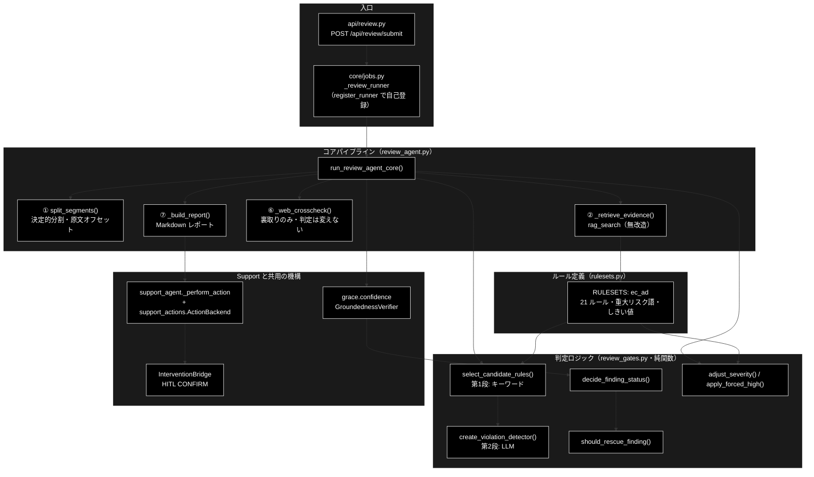
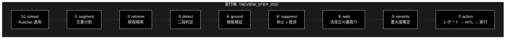
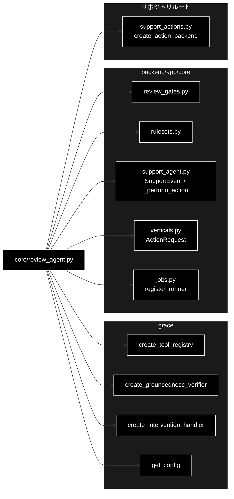

# review_flow.md - GRACE-Review 処理フロー ステップ詳細（S1・①〜⑦）ドキュメント

**Version 1.0** | 最終更新: 2026-08-01

> 📌 GRACE-**Support** 側の対応ドキュメントは [`backend_flow.md`](./backend_flow.md)（(0)〜(8)）。

---

## 目次

1. [概要](#概要)
2. [アーキテクチャ構成図](#1-アーキテクチャ構成図)
3. [モジュール構成図](#2-モジュール構成図)
4. [クラス・関数一覧表](#3-クラス関数一覧表)
5. [処理ステップ IPO詳細（S1・①〜⑦）](#4-処理ステップ-ipo詳細s1)
6. [設定・定数](#5-設定定数)
7. [使用例](#6-使用例)
8. [エクスポート](#7-エクスポート)
9. [変更履歴](#8-変更履歴)
10. [付録: 依存関係図](#付録-依存関係図)

---

## 概要

本ドキュメントは、GRACE-Review パイプライン（`backend/app/core/review_agent.py` の
`run_review_agent_core()`）が実行する **処理フローの各ステップ（S1・①〜⑦）** を、
実装関数・シグネチャ・IPO（Input-Process-Output）・戻り値例・使用例つきで記述する。
全体像（アーキテクチャ・データフロー）はリポジトリルートの [`README.md`](../../README.md) §1〜§2 を参照。

Support（`support_agent.py`）が「問い合わせ → 回答」なのに対し、本パイプラインは
**「文書 → 指摘」**と情報の流れが逆になる。それでも中核部品は無改造で機能する。

| 中核部品 | Support での意味 | Review での意味 |
|---|---|---|
| `GroundednessVerifier` | 回答の主張が出典で裏付けられるか | **指摘が規程で裏付けられるか** |
| `_perform_action` / `ActionBackend` | 起票・返信の実行 | そのまま（起票・差し戻し） |
| `InterventionBridge` 経由の HITL CONFIRM | 副作用アクションの承認 | そのまま |

新規実装は **① Segment / ③ Detect / ⑤ Severity の 3 つだけ**で、
② Retrieve・④ Ground・④' 誤検知抑止・⑦ Action は既存機構の再利用である。

> 📝 **注意（実行順）**: ステップ番号は Support との**対応**を示す呼称であり、実行順とは
> 一致しない。実際の実行順は `REVIEW_STEP_IDS` の並び
> **S1 → ① → ② → ③ → ④ → ④' → ⑥ → ⑤ → ⑦** で、**⑥ Web 裏取りが ⑤ Severity より先**に来る
> （Support で ④' が ⑤ の後に来るのと同じ事情）。UI のタイムラインもこの並び。

### 主な責務

- 文書を検査単位（セグメント）へ決定的に分割し、**原文の文字オフセット**を保持する
- セグメントごとに規程を RAG 検索し、二段判定で違反候補を検出する
- 指摘そのものを `GroundednessVerifier` で裏付け検証し、誤検知を抑止・救済する
- 重大度を確定し、重大リスク語による強制 high を適用する
- 指摘レポートを組み立て、HITL CONFIRM を経てアクションを実行する
- 組合せ爆発（セグメント × ルール）のガードと KPI メタデータの計測

### 各責務対応のモジュール

| # | 責務 | 対応モジュール | 説明 |
|---|------|--------------|------|
| 1 | パイプライン統括 | `core/review_agent.py` | `run_review_agent_core()` が S1・①〜⑦ を実行 |
| 2 | 文書分割 | `core/review_agent.py` | `split_segments()`（LLM 不使用・決定的） |
| 3 | 規程検索 | `core/review_agent.py` | `_retrieve_evidence()`（`rag_search` を無改造で使用） |
| 4 | 判定ロジック | `core/review_gates.py` | 二段判定・抑止・救済・重大度（純関数＋ファクトリ） |
| 5 | ルール定義 | `core/rulesets.py` | `RuleSet` / `RULESETS`（`ec_ad`・21 ルール） |
| 6 | 根拠検証 | `grace.confidence` | `GroundednessVerifier`（Support と共用） |
| 7 | HITL・実行 | `core/support_agent.py` / `support_actions.py` | `_perform_action` / `ActionBackend` を再利用 |

### 主要機能一覧

| 機能 | 説明 |
|------|------|
| `run_review_agent_core()` | コアパイプライン本体（イベント発行型） |
| `split_segments()` | ① 文書を検査単位へ分割（原文オフセット保持） |
| `_retrieve_evidence()` | ② セグメントに関連する規程を RAG 検索 |
| `_web_crosscheck()` | ⑥ 法改正の裏取り（**判定は変えない**） |
| `_summarize()` | 重大度・状態別の集計（`FindingSummary`） |
| `_decide_review_action()` | ⑦ 指摘内容からアクション種別を決定 |
| `_build_report()` | 指摘レポート（Markdown）の生成 |
| `REVIEW_STEP_IDS` | ステップ ID 一覧（UI タイムライン対応） |

---

## 1. アーキテクチャ構成図



---

## 2. モジュール構成図



> ⚠️ **②〜④' は 1 本のループ**である。図では直列に見えるが、実装は
> `for segment in segments:` → `for candidate in candidates:` の二重ループ内で
> ② Retrieve → ③ Detect → ④ Ground → ④' Suppress を回し、
> ループを抜けてから 4 つの `step_finished` をまとめて発行する。

### 2.1 外部依存関係

| 依存先 | 用途 |
|---|---|
| `grace.create_tool_registry` | `rag_search`（② 規程検索）・`web_search`（⑥ 裏取り） |
| `grace.confidence.create_groundedness_verifier` | ④ 指摘の根拠検証 |
| `grace.create_intervention_handler` | ⑦ HITL CONFIRM |
| `grace.get_config` | 設定（**deepcopy して使う**） |
| `support_actions.create_action_backend` | ⑦ アクション実行（dry-run / webhook / pseudo） |

### 2.2 内部依存モジュール

| モジュール | 用途 |
|---|---|
| `core/review_gates.py` | 二段判定・抑止・救済・重大度（純関数群＋ファクトリ） |
| `core/rulesets.py` | `RuleSet` / `RuleItem` / `get_ruleset` / しきい値既定 |
| `core/support_agent.py` | `SupportEvent` / `EmitFn` / `ConfirmFn` / `AUTO_PROCEED` / `_perform_action` |
| `core/verticals.py` | `ActionRequest` |
| `core/jobs.py` | `register_runner`（import 時に自己登録） |

---

## 3. クラス・関数一覧表

### 3.1 データモデル

| クラス | 概要 |
|---|---|
| `ReviewParams` | `POST /api/review/submit` のパラメータ |
| `Segment` | 検査単位（`start` / `end` は**原文**の文字オフセット） |
| `ReviewFinding` | 1 件の指摘（UI の指摘カード 1 枚に対応） |
| `FindingSummary` | 重大度・状態別の集計 |
| `ReviewResult` | レビュー結果（result イベント・`GET /result` の戻り） |

### 3.2 関数一覧（ステップ別）

| ステップ | 関数名 | 概要 |
|---|---|---|
| S1 | `get_ruleset()` | RuleSet を解決（`rulesets.py`） |
| ① | `split_segments()` | 文書を検査単位へ分割 |
| ① | `_trim_span()` / `_split_long_span()` / `_emit_block()` | 分割の補助 |
| ② | `_retrieve_evidence()` | 規程を RAG 検索 |
| ③ | `select_candidate_rules()` / `create_violation_detector()` | 二段判定（`review_gates.py`） |
| ④ | `verifier.verify()` | 指摘の根拠検証（`grace.confidence`） |
| ④' | `decide_finding_status()` / `should_rescue_finding()` / `detect_vacuous_finding()` | 抑止・救済 |
| ⑥ | `_web_crosscheck()` | 法改正の裏取り |
| ⑤ | `adjust_severity()` / `should_force_high()` / `apply_forced_high()` | 重大度確定 |
| ⑦ | `_decide_review_action()` / `_build_report()` / `_perform_action()` | レポート・HITL・実行 |
| — | `_build_finding()` / `_segment_text()` / `_summarize()` | 補助 |
| — | `review_result_to_dict()` / `_review_runner()` | 変換・ジョブ結線 |

---

## 4. 処理ステップ IPO詳細（S1・①〜⑦）

### 4.0 （0）事前チェックと設定分離

**概要**: LLM 呼び出し前に APIキーを確認し、設定をリクエスト単位へ分離する。

```python
if not os.getenv("ANTHROPIC_API_KEY"):
    _emit(SupportEvent(type="error", message="⚠️ ANTHROPIC_API_KEY が未設定です。…"))
    return None
config = copy.deepcopy(get_config())
```

| 項目 | 内容 |
|------|------|
| **Input** | 環境変数 `ANTHROPIC_API_KEY`、`grace.get_config()` のシングルトン |
| **Process** | 1. APIキー未設定なら `error` イベントを発行して `None` を返す<br>2. config を**ディープコピー**し、以降の生成物（tool_registry / verifier / detector / handler）はすべてコピーを参照させる |
| **Output** | `config`（リクエスト専用）、または `None`（APIキー未設定） |

> ⚠️ **なぜ deepcopy か**: S1 で `config.qdrant.allowed_collections` と
> `config.llm.prompt_addendum` を RuleSet に合わせて書き換えるため、シングルトンを
> そのまま使うと `jobs.py` がジョブごとに立てるワーカースレッド同士で値を奪い合う
> （**Review の検索スコープが並走中の Support のスコープを上書きする**等）。
> Support 側の同じ対処は [`core_support_agent.md`](./core_support_agent.md) §4.3.1。

---

### 4.1 （S1）RuleSet 適用

**概要**: ルールセットを解決し、検索スコープ・しきい値・方針を config へ配線する。

```python
rs = get_ruleset(ruleset)                    # 既定 "ec_ad"
notify_th = rs.notify_th if rs else DEFAULT_NOTIFY_TH    # 0.85
confirm_th = rs.confirm_th if rs else DEFAULT_CONFIRM_TH  # 0.60
config.qdrant.allowed_collections = list(rs.collections) if rs else []
config.llm.prompt_addendum = rs.prompt_addendum if rs else ""
```

| 項目 | 内容 |
|------|------|
| **Input** | `ruleset: Optional[str]`（既定 `"ec_ad"`） |
| **Process** | 1. `get_ruleset()` で `RuleSet` を解決（未知 ID は `None`）<br>2. しきい値を RuleSet 優先で決定（無ければ既定 0.85 / 0.60）<br>3. 検索スコープと方針を config へ注入<br>4. `ruleset` ステップの started / finished を発行（`rs is None` なら skipped） |
| **Output** | `rs: Optional[RuleSet]`, `notify_th`, `confirm_th`。イベント: `step(ruleset)` |

**イベント例**:
```python
{"type": "step", "step": "ruleset", "status": "finished",
 "data": {"ruleset": "ec_ad", "name": "EC広告表示チェック", "rules": 21,
          "collections": [...], "notify_th": 0.85, "confirm_th": 0.6}}
```

> 📝 検索スコープのコレクションが未登録でも失敗しない。② が空を返した場合は
> **`RuleItem.description` を根拠にフォールバック**する（§4.3）。

---

### 4.2 （①）Segment — 文書を検査単位へ分割

**概要**: LLM を使わず決定的に分割する。**原文の文字オフセットを保持**する。

```python
def split_segments(
    text: str,
    max_chars: int = MAX_SEGMENT_CHARS,   # 400
    max_segments: int = MAX_SEGMENTS,     # 200
) -> Tuple[List[Segment], bool]
```

| パラメータ | 型 | デフォルト | 説明 |
|------------|------|-----------|------|
| `text` | str | - | 原文（**一切加工しない**） |
| `max_chars` | int | 400 | これを超える段落は文末で再分割 |
| `max_segments` | int | 200 | 上限に達したら打ち切り |

| 項目 | 内容 |
|------|------|
| **Input** | `text`（原文）, `max_chars`, `max_segments` |
| **Process** | 1. 空行（`\n[ \t　]*\n`）で段落へ一次分割<br>2. ブロック内に箇条書き（`・- * ＊` / `1.` `1)`）・見出し（`#` `■◆●▼【`）が 1 行でもあれば**行単位**へ分割<br>3. `max_chars` 超過は文末（`。！？!?`）で再分割<br>4. 前後の空白を除く（オフセットは原文基準を維持）／空白のみは破棄<br>5. `max_segments` 到達で打ち切り |
| **Output** | `(List[Segment], truncated: bool)` |

> ⚠️ **オフセットは必ず原文に対して取る。** 正規化を挟むと UI のハイライト位置が
> ずれるため、`text` へは一切手を加えない。

**戻り値例**:
```python
([Segment(segment_id="s001", text="業界No.1の効果！", start=0, end=9, kind="paragraph"),
  Segment(segment_id="s002", text="・返品は不可", start=11, end=18, kind="list_item")],
 False)
```

```python
# 使用例
segments, truncated = split_segments(document)
```

> 📝 セグメントが 0 件、または RuleSet が未解決の場合はここで打ち切り、
> 空の `ReviewResult` を `result` イベントとして返す。

---

### 4.3 （②）Retrieve — 規程を RAG 検索

**概要**: セグメント本文をクエリに、RuleSet のコレクションから規程を検索する。
`rag_search` ツールを**無改造**で使う。

```python
def _retrieve_evidence(
    tool_registry, query: str, ruleset: Optional[RuleSet]
) -> Tuple[List[str], List[str]]
```

| 項目 | 内容 |
|------|------|
| **Input** | `tool_registry`, `query`（セグメント本文）, `ruleset` |
| **Process** | 1. RuleSet 未解決・コレクション未設定なら `([], [])`<br>2. `rag_search`（`limit=RETRIEVE_LIMIT=5`・`allowed_collections` 指定）を実行<br>3. 例外・失敗・空出力はすべて `([], [])`（**握りつぶして継続**）<br>4. payload から `title`/`question` → ラベル、`answer`/`text` → 本文を抽出 |
| **Output** | `(citations, source_texts)` — `citations` は UI 表示用ラベル（`[規程] …`）、`source_texts` は ④ の検証に渡す**本文** |

> 📝 **表示用と検証用を分けるのは Support と同じ設計**。識別子だけを検証器へ渡すと
> どの主張も裏付けられず全 neutral になるため、本文を別に集める
> （[`core_gates.md`](./core_gates.md) §4.3 `_collect_source_texts` の議論と同じ）。

**フォールバック**: `source_texts` が空なら `RuleItem.description`、
`citations` が空なら `rule.citation()` を使う。

```python
evidence_texts = source_texts or [rule.description]
rule_citations = citations or [rule.citation()]
```

---

### 4.4 （③）Detect — 二段判定で違反候補を検出

**概要**: 第1段でキーワード候補を絞り、第2段の LLM で違反かを判定する。

```python
candidates = select_candidate_rules(segment.text, rs)   # 第1段（キーワード）
verdict = detect(segment.text, rule, evidence)          # 第2段（LLM）
```

| 項目 | 内容 |
|------|------|
| **Input** | `segment.text`, `rs`（RuleSet）, `evidence`（② の本文を連結） |
| **Process** | 1. `select_candidate_rules()` が `always_check_rules` ＋ キーワード一致ルールを返す<br>2. 候補が無ければ**そのセグメントをスキップ**（LLM を呼ばない）<br>3. 候補ごとに `create_violation_detector()` の判定器を呼ぶ（`DETECT_MODEL = ModelConfig.DEFAULT_MODEL`）<br>4. `verdict.violates == False` なら次の候補へ<br>5. `llm_calls` を数え、`MAX_LLM_CALLS`（300）到達で打ち切り |
| **Output** | `verdict`（`violates` / メッセージ / 修正案）、`detected_raw` 件数、`truncated` |

> ⚠️ **組合せ爆発ガード**: 200 セグメント × 21 ルールを無条件に第2段へ流すと
> **4,200 回**の LLM 呼び出しになる。第1段のキーワードフィルタで実際はこの 1〜2 割だが、
> 上限（`MAX_LLM_CALLS = 300`）は必ず置く。到達時は `truncated=True` で打ち切り、
> `detect` ステップの finished に記録する。

---

### 4.5 （④）Ground — 指摘の根拠を検証

**概要**: `GroundednessVerifier` を「**指摘が規程で裏付けられるか**」に読み替えて使う。

```python
gres = verifier.verify(
    f"次の記述は「{rule.title}」（{rule.law} {rule.article}）に抵触するか",
    finding.message,
    evidence_texts,
)
finding.confidence = gres.support_rate
```

| 項目 | 内容 |
|------|------|
| **Input** | 疑似クエリ（ルール名・法令・条文から生成）、`finding.message`（指摘文）、`evidence_texts`（規程本文） |
| **Process** | Support と同一の検証器で主張ごとに supported / contradicted / neutral を判定し、支持率を出す |
| **Output** | `gres.support_rate` → `finding.confidence`、`gres.verified`、`gres.has_contradiction` |

> 📝 支持率の定義は Support と同じ `supported / (supported + contradicted)`。
> neutral は分母から除外する（＝答えていない内容を減点しない）。

---

### 4.6 （④'）Suppress — 誤検知抑止 + 救済

**概要**: 支持率・出典数から指摘の状態を決め、抑止すべきものを落とす。ただし
「矛盾なし・根拠あり」の指摘は救済して保留に残す。

```python
status = decide_finding_status(
    gres.support_rate, gres.verified, len(finding.citations), notify_th, confirm_th,
)
if status == "suppressed" and should_rescue_finding(
    status, gres.has_contradiction, len(finding.citations), finding.message, vacuous_judge,
):
    status = "review_required"
    rescued += 1
```

| 状態 | 意味 | 扱い |
|---|---|---|
| `confirmed` | 支持率 ≥ `notify_th`（0.85） | 指摘として確定 |
| `review_required` | `confirm_th` ≤ 支持率 < `notify_th` | 保留（人の確認が要る） |
| `suppressed` | 根拠不足 or 実質性なし | **`findings` に含めない**（件数のみ集計） |

| 項目 | 内容 |
|------|------|
| **Input** | `support_rate`, `verified`, 出典数, `notify_th`, `confirm_th`, `has_contradiction`, `finding.message` |
| **Process** | 1. `decide_finding_status()` で 3 値判定<br>2. `suppressed` かつ「矛盾なし・根拠あり・実質的」なら `review_required` へ**救済**<br>3. 最終的に `suppressed` なら `detect_vacuous_finding()` で理由を決め（`実質性なし（…）` / `根拠不足（支持率 …）`）、`findings` へは**追加しない** |
| **Output** | `finding.status`, `finding.suppress_reason`, `suppressed` / `rescued` 件数 |

---

### 4.7 （⑥）Web 裏取り — 法改正・ガイドライン更新の確認

**概要**: `web_check=True` のルールについて法改正を確認する。**実行順では ⑤ より先**。

```python
def _web_crosscheck(tool_registry, findings, ruleset, log) -> bool
```

| 項目 | 内容 |
|------|------|
| **Input** | `findings`, `ruleset`, `tool_registry`（`use_web=True` かつ指摘ありのときだけ実行） |
| **Process** | 1. `rule.web_check` が真のルールを**ルール単位で1回だけ**検索（`"{law} {article} 改正 ガイドライン"`）<br>2. 例外・失敗は握りつぶす<br>3. 対象 finding の `web_checked` を立てる |
| **Output** | `used: bool`（1 件でも Web を引けたか）→ `result.used_web` |

> ⚠️ **Web を根拠に新しい指摘は作らない**（出典の信頼性を担保できないため）。
> 確認できたことを `web_checked` に記録するだけで、**判定は変えない**。
> このため既定は `use_web=False`（条文が一次情報であり、Web は速度・コストに見合わない）。

**スキップ条件**: `use_web=False` なら `reason="無効"`、指摘 0 件なら `reason="指摘なし"` で
`step_skipped("web")`。

---

### 4.8 （⑤）Severity — 重大度の確定＋強制 high

**概要**: ルール既定の重大度を確信度で調整し、重大リスク語があれば high へ強制する。

```python
base = rule.severity_default if rule else "medium"
finding.severity = adjust_severity(base, finding.confidence, notify_th, confirm_th)
forced, keyword, mention = should_force_high(target_text, rs, classify_mention)
finding.severity, finding.status = apply_forced_high(finding.severity, finding.status, forced)
```

| 項目 | 内容 |
|------|------|
| **Input** | `rule.severity_default`, `finding.confidence`, しきい値, セグメント本文, `rs.critical_keywords` |
| **Process** | 1. `adjust_severity()` で確信度に応じて上下<br>2. `should_force_high()` が**二段判定**（キーワード一致 → `create_mention_classifier` で言及種別を分類）<br>3. 強制対象なら `apply_forced_high()` で severity=high・status も引き上げ<br>4. 強制しなかった場合も、キーワードが当たっていれば言及種別をログに残す |
| **Output** | `finding.severity`, `finding.status`, `finding.forced`, `forced_high` 件数 |

> 📝 **二段判定の意図は Support の強制エスカレと同じ**。キーワード一致だけで high に
> するとリスク語の**単なる言及**（否定・引用）まで拾ってしまうため、
> 第2段の言及分類で誤検知を抑える。

---

### 4.9 （⑦）Action — レポート → HITL CONFIRM → 実行

**概要**: 指摘内容からアクションを決め、承認を経てバックエンドで実行する。

```python
def _decide_review_action(result: ReviewResult) -> Optional[ActionRequest]
```

| 条件 | アクション | 承認 |
|---|---|:--:|
| 指摘 0 件 | なし（`step_skipped`） | — |
| `summary.high > 0` | `escalate_to_human` | **不要** |
| high なし（confirmed / review_required のみ） | `create_ticket` | 必要 |

| 項目 | 内容 |
|------|------|
| **Input** | `result`（findings / summary / document_title / ruleset）, `do_action`, `dry_run` |
| **Process** | 1. `_decide_review_action()` で種別決定（引数に `_build_report()` の Markdown を同梱）<br>2. `create_action_backend(dry_run=dry_run)` を生成<br>3. `_perform_action()`（Support と**同一関数**）で HITL CONFIRM → 実行<br>4. **本人確認は不要**（`identity_verifier=None, identity=None`） |
| **Output** | `result.action`, `result.action_result`。イベント: `step(action)` / `intervention` |

> ⚠️ **`escalate_to_human` が承認不要なのは意図的**。引き継ぎそのものなので、
> 承認待ちタイムアウトで宙に浮くのを防ぐ（Support の同名アクションと同じ扱い）。

**レポート例**（`_build_report()`）:
```markdown
# 表示チェック結果: 春の新商品LP

- ルールセット: ec_ad
- 指摘: 3 件（high 1 / medium 2 / low 0）
- 抑止: 2 件

## [HIGH] 最上級表現の根拠不備（景品表示法 第5条第1号）
- 該当箇所: 業界No.1の効果！
- 指摘: 「業界No.1」の裏付けとなる調査の出典が示されていません。
- 修正案: 調査機関・調査期間・対象範囲を併記するか、表現を削除してください。
- 根拠: [規程] 優良誤認表示の禁止
- 確信度: 0.92 / 状態: confirmed
```

---

## 5. 設定・定数

### 5.1 ガード上限

```python
MAX_SEGMENTS = 200       # 分割の上限
MAX_LLM_CALLS = 300      # 第2段 LLM 呼び出しの上限
MAX_SEGMENT_CHARS = 400  # これを超える段落は文末で再分割
RETRIEVE_LIMIT = 5       # ② のセグメントあたり取得件数
```

| 定数 | 値 | 到達時の挙動 |
|---|---:|---|
| `MAX_SEGMENTS` | 200 | 以降を打ち切り、`truncated=True` |
| `MAX_LLM_CALLS` | 300 | ループを抜けて `truncated=True` |
| `MAX_SEGMENT_CHARS` | 400 | 文末で再分割（打ち切りではない） |
| `RETRIEVE_LIMIT` | 5 | — |

### 5.2 REVIEW_STEP_IDS

```python
REVIEW_STEP_IDS = (
    "ruleset", "segment", "retrieve", "detect",
    "ground", "suppress", "web", "severity", "action",
)
```

UI のタイムライン表示と 1:1 対応する。**タプルの並びが実行順**。

### 5.3 しきい値の既定（`rulesets.py`）

```python
DEFAULT_NOTIFY_TH = 0.85
DEFAULT_CONFIRM_TH = 0.60
```

RuleSet が `notify_th` / `confirm_th` を持つ場合はそちらが優先される。

---

## 6. 使用例

### 6.1 基本ワークフロー（コア直呼び・自動承認）

```python
from backend.app.core.review_agent import run_review_agent_core

result = run_review_agent_core(
    document=open("lp.txt", encoding="utf-8").read(),
    document_title="春の新商品LP",
    ruleset="ec_ad",
    use_web=False,      # 既定 OFF（条文が一次情報）
    dry_run=True,       # 既定ドライラン
)
print(result.summary)                     # FindingSummary(high=1, medium=2, …)
for f in result.findings:
    print(f.severity, f.rule_id, f.excerpt, f.confidence)
```

### 6.2 応用ワークフロー（Web・SSE ＋ HITL 承認待ち）

```python
# api/review.py 経由（ジョブ基盤が runner を型解決する）
job = job_manager.start(ReviewParams(document=text, ruleset="ec_ad"))
# → GET /api/review/stream/{job_id} で step/log/intervention/result を購読
# → POST /api/review/confirm/{job_id} で CONFIRM に応答
```

> 📝 `ReviewParams` を構築するには `review_agent` の import が必要で、その import で
> `register_runner(ReviewParams, _review_runner, "review")` が走る。
> **登録漏れは構造的に起きない**（設計書 §6.3）。

---

## 7. エクスポート

`__all__` 定義はない。`api/review.py` が `ReviewParams` を、`jobs.py` が
`register_runner` 経由で `_review_runner` を参照する。

```python
# 公開シンボル（明示的 __all__ はなし）
REVIEW_STEP_IDS, MAX_SEGMENTS, MAX_LLM_CALLS, MAX_SEGMENT_CHARS, RETRIEVE_LIMIT,
ReviewParams, Segment, ReviewFinding, FindingSummary, ReviewResult,
review_result_to_dict, split_segments, run_review_agent_core
```

---

## 8. 変更履歴

| バージョン | 変更内容 |
|-----------|---------|
| 1.0 | 初版作成。GRACE-Review パイプライン（S1・①〜⑦）を実コードからステップ別に詳細化。実行順が番号順と一致しない点（⑥ Web が ⑤ Severity より先）、②〜④' が単一の二重ループである点、組合せ爆発ガード（`MAX_LLM_CALLS`）、Web は判定を変えない裏取り専用である点、`escalate_to_human` が承認不要である点を明記。Support 版 [`backend_flow.md`](./backend_flow.md) と対になる構成 |

---

## 付録: 依存関係図


