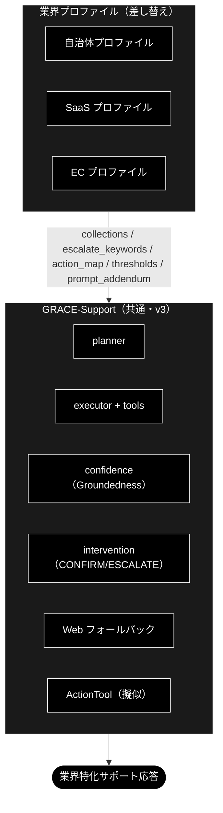

# 業界プロファイルとルールセット ドキュメント

**Version 1.0** | 最終更新: 2026-09-16

> **本書の位置づけ**: GRACE-Support の**業界プロファイル**（`VerticalProfile`・gov / saas / ec）と、
> GRACE-Review の**ルールセット**（`RuleSet`・ec_ad）の**カタログ**。
> 何が業界ごとに差し替わるのか、なぜその設計にしたのか、どう増やすのかを 1 本にまとめる。
>
> ⚠️ **実装の値（フィールド定義・ルール本文・キーワード）は本書に複製しない。**
> 正本は `backend/app/core/verticals.py` / `backend/app/core/rulesets.py` と、その IPO 文書
> （[`reference/core_verticals.md`](./reference/core_verticals.md) /
> [`reference/core_rulesets.md`](./reference/core_rulesets.md)）である。

> **関連ドキュメント**
> - [`support_flow.md`](./support_flow.md) — 業界プロファイルが効く処理フローと設計判断
> - [`review_flow.md`](./review_flow.md) — ルールセットが効く処理フローと設計判断
> - [`architecture.md`](./architecture.md) / [`job_runtime.md`](./job_runtime.md)

---

## 目次

- [概要](#概要)
- [1. 業界プロファイル（VerticalProfile）— GRACE-Support](#1-業界プロファイルverticalprofile-grace-support)
- [2. ルールセット（RuleSet）— GRACE-Review](#2-ルールセットruleset-grace-review)
- [3. 増やすときの手順](#3-増やすときの手順)
- [4. 変更履歴](#4-変更履歴)

---

## 概要

2 つのカタログは**役割が似ているが型が違う**。

| | `VerticalProfile`（Support） | `RuleSet`（Review） |
|---|---|---|
| 定義 | `backend/app/core/verticals.py` | `backend/app/core/rulesets.py` |
| 収録 | `gov` / `saas` / `ec` | `ec_ad`（EC広告表示・23 ルール） |
| 構造 | 1 プロファイル = パラメータの束 | **1 プロファイル = N 個の検査ルール**（`RuleItem`） |
| 検索スコープ | `collections` → `config.qdrant.allowed_collections` | 同左 |
| しきい値 | `notify_th` / `confirm_th` | 同左（法令なので厳しめ: 0.85 / 0.60） |
| 二段判定の第1段 | `escalate_keywords` / `action_map` の語 | `RuleItem.keywords`（＋ `always_check`） |
| API | `GET /api/verticals` | `GET /api/rulesets`（**ルール本文は返さない**） |

**型を分けた理由**: `VerticalProfile` に 23 個のルール定義を持たせると Support 用の構造が壊れるため。
検索スコープ・しきい値・アクションマップという**枠は共通**である。

> 📝 **LLM はローカル（Ollama）**だが、Embedding は Gemini のままなので、
> Qdrant コレクション名は `*_anthropic` のままである（既存コレクションを使い続けるため。
> [`config_and_providers.md` §1](./config_and_providers.md)）。

---

## 1. 業界プロファイル（VerticalProfile）— GRACE-Support

### 1.0 業界特化とは何か

#### 主な責務

業界特化レイヤー（`VerticalProfile`）が GRACE-Support 共通エンジンの上で担う責務は次の 4 つ。

1. **検索範囲の限定** — 業界の専用コレクションだけを回答根拠にする（`allowed_collections`。フォールバック連鎖も業界外へ漏らさない）
2. **判断基準の切替** — 「答える / 人に渡す」の閾値・強制エスカレ語・アクション語彙を業界の業務設計に合わせる
3. **安全装置の業界適合** — 本人確認（EC）・断定回避（gov）・「情報なし回答」の検知（④'）など、 **間違え方の業界差**を吸収する
4. **語り口の注入** — `prompt_addendum` により回答方針（用語・禁則・トーン）を業界化する

#### 各責務対応のモジュール

| 責務               | 実装（`../../agent_support_example.py` / `../../grace`）                                                          | テスト・データ資産                             |
|--------------------|-------------------------------------------------------------------------------------------------------------------|------------------------------------------------|
| 検索範囲の限定     | `PROFILES[v].collections` → `config.qdrant.allowed_collections` → `RAGSearchTool._apply_allowed_collections`      | `backend/tests/test_collection_selection.py`   |
| 判断基準の切替     | `_answer_gate()`（閾値）/ `_should_force_escalate()`（エスカレ語×意図分類）/ `_decide_action()`（アクション語彙） | `backend/tests/test_judge_model_resolution.py` |
| 安全装置の業界適合 | `_perform_action()`（本人確認）/ `_detect_no_info_answer()`＋`create_no_info_judge()`（④'）                       | `backend/tests/test_no_info_prediction.py`     |
| 語り口の注入       | `PROFILES[v].prompt_addendum` → `config.llm.prompt_addendum` → `ReasoningTool._build_prompt()`                    | —（reasoning 出力に反映）                      |

#### 主要機能一覧

| 機能                                 | 概要                                                                               | 参照    |
|--------------------------------------|------------------------------------------------------------------------------------|---------|
| `--vertical gov / saas / ec`         | プロファイル一括切替 CLI（閾値・エスカレ語・アクション・本人確認・検索範囲・方針） | §7      |
| 二段判定（エスカレ語・アクション語） | キーワード候補一致 → 軽量 LLM 意図分類で FAQ 質問の誤検知を抑止                    | §6      |
| ④' 情報なし回答検知                  | 「見つかりませんでした」型回答を実質回答判定（answered/no_info）で escalate へ     | §6・§9 |

#### 定義: 何をもって「業界特化」と呼ぶか

**「業界特化」＝共通エンジン（GRACE-Support）は 1 つのまま、業界ごとに差し替わる 7
つの機構（VerticalProfile）で挙動を変えること。**
エンジン本体（Plan → 内部 RAG → 根拠検証 → 回答ゲート → Web 裏取り → アクション＋HITL）は gov / saas / ec で完全に共通であり、業界性はすべて
**プロファイルの差分として注入**される。

言い換えると、業界特化の実体は次の 6 軸を業界別に定義したものである:
**「①何を知識源とし、②どこまで自信があれば答え、③何を人間に渡し、④何を実行し、⑤どう語り、⑥何で測るか」**。

#### 業界特化を構成する 7 つの機構

| # | 機構                                                                    | 何が業界ごとに変わるか                                                    | 例                                                                                | 実装位置                                          |
|---|-------------------------------------------------------------------------|---------------------------------------------------------------------------|-----------------------------------------------------------------------------------|---------------------------------------------------|
| 1 | **検索スコープ**（`collections` → `config.qdrant.allowed_collections`） | 回答の根拠にしてよいナレッジの範囲。フォールバック連鎖も業界外へ漏れない  | gov=FAQ・法令系のみ / ec=規定・注文 FAQ のみ                                      | `RAGSearchTool._apply_allowed_collections`        |
| 2 | **回答の厳しさ**（`notify_th` / `confirm_th`）                          | 「どこまで確信があれば答えてよいか」の基準                                | gov は 0.8/0.5（既定 0.7/0.4 より厳格）＝「間違えるくらいなら窓口へ」             | `_answer_gate()`                                  |
| 3 | **強制エスカレ基準**（`escalate_keywords`＋意図分類）                   | 機械に答えさせてはいけない話題の定義（二段判定で FAQ 質問の誤検知は抑止） | gov=法的判断・減免・個別事情 / saas=障害・課金 / ec=決済・破損                    | `_should_force_escalate()`                        |
| 4 | **アクション語彙**（`action_map`）                                      | 「対応」と見なす意図と、その処理先                                        | ec「返品したい」→起票 / gov「様式がほしい」→案内返信（申請自体は人間）            | `_decide_action()`                                |
| 5 | **本人確認**（`require_identity`)                                       | 副作用操作の前に本人確認を要するか                                        | EC のみ True（注文情報の操作）                                                    | `_perform_action()`                               |
| 6 | **業務方針**（`prompt_addendum` → `config.llm.prompt_addendum`）        | 回答の語り口・禁則                                                        | gov「断定回避・担当課明示・個人情報を尋ねない」/ saas「バージョン明示・再現手順」 | `ReasoningTool._build_prompt()`                   |
| 7 | **評価基準**（何をもって良いサポートとするか）                           | 業界ごとの合否基準                                            | gov「根拠なし回答=0」/ ec「本人確認遵守率=100%」                                  | **未整備**（評価基盤は本リポジトリに無い） |

#### 成熟度: 現時点で「特化」と呼べる度合い（正直な評価）

- **厚い部分（実質的な差別化）**: 機構 3・4・5。同種の依頼でも EC では「本人確認 → CONFIRM → 起票」、 gov では「有人窓口へ」と、
  **業界の業務設計（誰が何をしてよいか）の違いをコードが実際に分岐**している。
- **薄い部分（まだ枠のみ）**:
    - 機構 1 のナレッジは **専用コレクションの枠だけがある**段階。登録用のテストデータは
      本リポジトリには無い。実運用ナレッジ（実 FAQ・実規約・e-Gov
      等）の投入は引き続き将来課題。gov は暫定代替 `wikipedia_ja` も併用。
    - 機構 2・6 は数値 2 つと日本語 1 文であり、「特化」というより業界別チューニングの置き場。
    - 業界固有ワークフロー（実返品 API・申請システム連携）、業界用語辞書、制度改正追随は **未実装**。 ActionTool は擬似（ドライラン）。

#### 設計理由（トレードオフ）

「業界ごとに別アプリを作る」のではなく「プロファイル差し替え」にしたのは、回答エンジン・出典検証・ HITL という難しい共通部分を
1 回だけ作り、 **業界追加を設定の追加に落とす**ため。その代償として、 現段階の「特化」の深さは上記パラメータの深さ＝
**投入されたデータの質**に依存する。 次の一手は機能追加ではなく **データ登録と再計測**（
専用コレクションへの登録）、 その先に実運用データの投入がある。

---


### 1.1 業界プロファイル（差し替えの共通枠）

| 差し替え項目        | 説明                                         | GRACE-Support 上の反映先                        |
|---------------------|----------------------------------------------|-------------------------------------------------|
| `collections`       | 検索対象コレクションの許可リスト             | planner の `collection` 指定 / tools の検索範囲 |
| `sample_queries`    | 代表想定質問（評価・回帰用）                 | KPI 計測・チューニング                          |
| `escalate_keywords` | 強制エスカレの語（例: 障害・決済・法的判断） | 回答ゲート前の割り込み判定                      |
| `require_identity`  | 本人確認が必要な操作か                       | アクション前 HITL（CONFIRM）強化                |
| `action_map`        | 意図 → アクション種別の対応                  | `_decide_action()`                              |
| `thresholds`        | notify/confirm の上書き（厳しめ/緩め）       | `_answer_gate()`                                |
| `prompt_addendum`   | 業界固有の注意（用語・断定回避 等）          | reasoning プロンプトへ追記                      |
| `kpi`               | 運用指標                                     | 評価                                            |

---

### 1.2 業界プロファイルの GRACE-Support への適用



---

### 1.3 自治体（Local Government）

| 項目                                 | 内容                                                                                                                             |
|--------------------------------------|----------------------------------------------------------------------------------------------------------------------------------|
| **主な責務**                         | **「誤案内ゼロ」**。出典（条例名・案内ページ）を示せる範囲でのみ答え、法的判断・個別事情は必ず窓口へ渡す                         |
| **対象コレクション**                 | `条例・要綱`、`手続き案内`、`窓口FAQ`（住民向け）                                                                                |
| **専用コレクション** | `gov_faq_anthropic` / `gov_laws_anthropic`（＋暫定代替 `wikipedia_ja`） |
| **代表想定質問**                     | 「住民票の写しの取り方は？」「国民健康保険の加入手続きは？」「粗大ごみの出し方は？」「保育園の申込期限は？」                     |
| **エスカレ基準**                     | 法的判断・個別事情・出典なしは**必ず有人**。断定を避け、根拠（条例名・案内ページ）を必須にする                                   |
| **アクション**                       | `send_reply`（担当課・必要書類・窓口時間の案内）。申請受付そのものは人間（`escalate_to_human`）                                  |
| **KPI**                              | 出典付与率 ≈ 100% / 根拠なし回答 = 0 / 一次解決率 / **誤案内 = 0**                                                               |
| **特有の注意**                       | 正確性最優先・**断定回避**、個人情報を聞かない、高齢者にも平易な表現、最新の制度改正への追随                                     |

> 自治体は「間違えない・出典を示す・迷ったら窓口へ」を最重視。`thresholds` は厳しめ（confirm/notify
> を上げる）に設定し、少しでも根拠が弱ければエスカレへ倒す。

---

### 1.4 SaaS

| 項目                                 | 内容                                                                                                         |
|--------------------------------------|--------------------------------------------------------------------------------------------------------------|
| **主な責務**                         | **「速い自己解決と正しい振り分け」**。ドキュメント根拠で即答し、障害・課金・セキュリティは即時に起票／有人へ |
| **対象コレクション**                 | `製品ドキュメント`、`APIリファレンス`、`リリースノート`、`既知の不具合`                                      |
| **専用コレクション** | `saas_docs_anthropic` / `saas_api_anthropic` |
| **代表想定質問**                     | 「API のレート制限は？」「Webhook の設定方法は？」「このエラーコードの意味は？」「v2 への移行手順は？」      |
| **エスカレ基準**                     | 障害・課金・セキュリティ、再現不能、バージョン不一致は `create_ticket`／`escalate_to_human`                  |
| **アクション**                       | `create_ticket`（障害・不具合）、`send_reply`（ドキュメントリンク・ステータスページ案内）                    |
| **KPI**                              | 自己解決率（deflection）/ 一次応答時間 / チケット適正振り分け率 / 再現手順取得率                             |
| **特有の注意**                       | **バージョン差の明示**、出典にドキュメント URL、コード例の正確性、Web フォールバックは公式ドキュメント優先   |

> SaaS は「速く・正確に・再現手順つき」。`escalate_keywords` に「障害」「ダウン」「課金」「情報漏えい」等を入れ、即エスカレ。

---

### 1.5 EC（Eコマース）

| 項目                                 | 内容                                                                                                          |
|--------------------------------------|---------------------------------------------------------------------------------------------------------------|
| **主な責務**                         | **「安全な実行」**。返品・キャンセル等の副作用操作を本人確認 → CONFIRM の二段で守りながら完遂させる           |
| **対象コレクション**                 | `商品情報`、`返品・交換規定`、`配送・送料`、`注文FAQ`                                                         |
| **専用コレクション** | `ec_policy_anthropic` / `ec_faq_anthropic` |
| **代表想定質問**                     | 「返品したい」「配送状況を知りたい」「サイズ交換できる？」「注文をキャンセルしたい」                          |
| **エスカレ基準**                     | 個人注文情報の照会・変更（**本人確認必須**）、決済トラブルは有人／本人確認フロー                              |
| **アクション**                       | `create_ticket`（返品受付・要 CONFIRM＋本人確認）、`send_reply`（規定・返信テンプレ）。注文照会は注文 ID 必須 |
| **KPI**                              | 自己解決率 / 返品処理時間 / **誤操作 = 0（本人確認必須）** / CS 満足度                                        |
| **特有の注意**                       | **個人情報・注文権限の確認を必須**（`require_identity=True` → アクション前 HITL を強化）、規定の版管理        |

> EC は「行動（返品・キャンセル）に直結」するため、v3 のアクション＋HITL が本領。副作用のある操作は本人確認 → CONFIRM の二段で守る。

---

### 1.6 実装への落とし込み（VerticalProfile 案）

共通コードは変えず、 **プロファイルを渡すだけ**で切り替える設計。

```text
VerticalProfile（dataclass 案）
  - name: str                      # "gov" | "saas" | "ec"
  - collections: list[str]         # 検索許可コレクション
  - escalate_keywords: list[str]   # 強制エスカレ語
  - require_identity: bool         # アクション前に本人確認を必須化
  - action_map: dict[str, str]     # 意図キーワード → action_type
  - notify_th / confirm_th: float  # 閾値の上書き（未指定なら config 既定）
  - prompt_addendum: str           # reasoning への業界注意書き
  - sample_queries: list[str]      # 評価用
  - kpi: list[str]
```

**適用ポイント（GRACE-Support への差し込み）**:

| プロファイル項目         | 差し込み先（既存関数)                                                                                                                                                                                                                    | 状態                                                      |
|--------------------------|------------------------------------------------------------------------------------------------------------------------------------------------------------------------------------------------------------------------------------------|-----------------------------------------------------------|
| `escalate_keywords`      | **二段判定**: キーワード候補一致（`_match_keyword`）→ 軽量 LLM 意図分類（`create_intent_classifier`・question/request/incident）。question（FAQ質問）は誤検知とみなし通常フロー継続、それ以外・分類失敗は即 `escalate`（Web もスキップ） | ✅ 実装済み（`_should_force_escalate`）                   |
| `notify_th`/`confirm_th` | `_answer_gate()` のしきい値を上書き                                                                                                                                                                                                      | ✅ 実装済み                                               |
| `action_map`             | `_decide_action()`（二段判定: キーワード候補 → 意図分類。question は起票せず回答のみ）                                                                                                                                                   | ✅ 実装済み                                               |
| `require_identity`       | `_perform_action()`（本人確認ステップを前置。起動有無は `SupportResult.identity_checked` に記録）                                                                                                                                        | ✅ 実装済み                                               |
| `collections`            | `config.qdrant.allowed_collections` 経由で `RAGSearchTool` の検索候補（明示指定・フォールバック連鎖を含む）を許可リストで限定。実コレクション名（`gov_faq_anthropic` 等）を割り当て済み。未登録なら制限を適用せず従来動作（警告ログ）    | ✅ 実装済み（`RAGSearchTool._apply_allowed_collections`） |
| `prompt_addendum`        | `config.llm.prompt_addendum` 経由で `ReasoningTool._build_prompt()` のシステム指示直後に「業務方針（遵守）」として注入。executor 経由・Web フォールバック経由の両 reasoning に効く                                                       | ✅ 実装済み                                               |
| `sample_queries` / `kpi` | dataclass には持たせない（評価用のテストケース・KPI 計測基盤は本リポジトリには無い）                                                                                       | — 未整備                               |

**CLI**: `python agent_support_example.py --vertical gov "住民票の取り方は？"`（プロファイルを選択）。 **実装済み**。

**実装状況**: `VerticalProfile` 導入と gov/saas/ec の 3 プロファイルは実装済み（PR #106）。設計時の実装順（自治体 → SaaS →
EC）どおり 3 業界を同時に組み込み済みで、上表のとおり全項目が配線済み。残件は §10 を参照。

---

### 1.7 実行例（コマンド）

業界別アプリの実行例を示す。`--vertical` フラグは **実装済み**（PR #106）であり、次の 2 段構えで示す。

- **7.1**: 共通コマンド（GRACE-Support v3・プロファイル未適用）で、業界の代表シナリオを試す
- **7.2**: `--vertical` でプロファイルを切り替えて実行する（推奨）

共通の前提: `ollama serve` 起動済み（LLM・**API キー不要**）／`.env` に `GOOGLE_API_KEY`（Embedding）、
Qdrant 起動済み＋対象コレクション登録済み。コレクションの登録手順は
[`data_pipeline.md`](./data_pipeline.md)（アプリの「データ管理」タブ）または
`qa_qdrant/register_to_qdrant.py` を参照。 uv 管理環境では `python …` を `uv run python …` に読み替える。

#### 1.7.1 現時点（v3 共通コマンドで業界シナリオを試す）

共通 CLI は `../../agent_support_example.py`（引数: `query` / `-v` / `--no-web` / `--no-action` / `--dry-run`）。
`--vertical` を付けない場合は業界チューニング（エスカレ語・しきい値・アクション対応）が適用されないため、共通挙動の確認用。

**自治体（正確性・出典最優先）**

```bash
python agent_support_example.py "住民票の写しの取り方は？"
python agent_support_example.py -v "国民健康保険の加入手続きは？"   # 支持率の内訳を表示
```

**SaaS（速く・正確・再現手順）**

```bash
python agent_support_example.py "API のレート制限は？"
python agent_support_example.py -v "サービスが落ちています"        # 障害系 → escalate 想定
```

**EC（行動＝返品/キャンセルは HITL）**

```bash
python agent_support_example.py "返品したい"                       # アクション(create_ticket)・CONFIRM＋ドライラン
python agent_support_example.py --no-dry-run "解約したい"          # 擬似実行（実API連携は将来）
python agent_support_example.py --no-web "配送状況を知りたい"      # 内部ナレッジのみ
```

#### 1.7.2 業界プロファイル（VerticalProfile・実装済み）

`--vertical {gov|saas|ec}` でプロファイル（エスカレ語・アクション対応・本人確認・閾値、および表示メタの対象コレクション・方針）を一括切替する。
**実装済み**（PR #106）。

**自治体**

```bash
python agent_support_example.py --vertical gov "住民票の写しの取り方は？"
```

**SaaS**

```bash
python agent_support_example.py --vertical saas -v "Webhook の設定方法は？"
```

**EC**

```bash
python agent_support_example.py --vertical ec "返品したい"              # 本人確認 → CONFIRM → ドライラン
python agent_support_example.py --vertical ec --no-dry-run "返品したい"  # 擬似実行
```

> ✅ `--vertical` は実装済みで、`escalate_keywords`/しきい値/`action_map`/`require_identity` に加え、
> `collections`（`allowed_collections` による実検索限定）と `prompt_addendum`（reasoning への注入）も **フル配線済み**（§6
> 参照）。
> 専用コレクション未登録時は警告ログのうえ無制限検索となる（`allowed_collections` は制限を適用しない）。

---

### 1.8 テスト

#### 1.8.1 単体テスト（実 API・実 Qdrant 不要）

> ⚠️ **旧版に載っていた `tests/test_agent_support_vertical.py` 等の 3 件は存在しない。**
> リポジトリ直下に `tests/` は無く（CLAUDE.md §9.4）、テストはすべて `backend/tests/` にある。
> 下表は 2026-09-04 に実在を確認したもの。

| テスト                                              | 対象                                                                                   |
|-----------------------------------------------------|------------------------------------------------------------------------------------------|
| `backend/tests/test_support_agent_core.py`          | `run_support_agent_core` の一周（LLM 用 API キー無しでも走ること・イベント列を含む）      |
| `backend/tests/test_judge_model_resolution.py`      | 判定系のモデル解決（`judge_model` が `config.llm.light_model` を優先し、`INTENT_MODEL` は最後の砦であること） |
| `backend/tests/test_local_llm_degradation.py`       | ローカル LLM が判定を返せないときの安全側縮退                                            |
| `backend/tests/test_no_info_prediction.py` ／ `test_no_info_judge_failure_reason.py` | ④' 情報なし回答検知（将来予測質問・判定失敗時の理由） |
| `backend/tests/test_collection_selection.py` ／ `test_config_isolation.py` | `allowed_collections` による検索範囲限定と、リクエスト単位の config 分離 |
| `backend/tests/test_scope_and_models.py`            | スコープ判定（`split_by_scope` / `ensure_out_of_scope_notice`）と選択可能モデル             |
| `backend/tests/test_multi_question.py`              | 0-(A) 複数質問の検知・クラスタ化・再構成                                                  |

実行: `PYTHONPATH=. uv run pytest backend/tests -q`（**リポジトリ直下に `tests/` は無い**。CI と同じゲートで、実 API キー・Qdrant 不要）。

#### 1.8.2 実行コストと実行時間

> ⚠️ **本リポジトリの LLM はローカル実行（Ollama）なので、LLM のトークン課金は発生しない。**
> 課金されるのは Embedding（Gemini `gemini-embedding-001`）と、`--no-web` を外したときの
> Web 検索バックエンド（SerpAPI）だけ。以下の**円建ての数値は Anthropic 版（`grace_v2`）で
> 計測したときの記録**であり、本リポジトリには当てはまらない。

<details>
<summary>参考: Anthropic 版での実測（履歴として保存）</summary>

- 1 ケース ≈ 9 円 → ec 1 run（9 ケース）≈ 80 円
- 最大費目はステップ毎の確信度評価 `evaluate_with_factors`（約 34%）。PR #118 で
  `config.llm.light_model` へ切替え、約 −23%/ケース（1 run ≈ 62 円）

</details>

**ローカル LLM で効いてくるのはコストではなく実行時間**である。eval 1 ケースあたりの LLM 呼び出しは
約 7〜10 回（reasoning・ステップ毎の確信度評価・`evaluate_final`・groundedness 検証・⑤ 再検証・判定 2 種）で、
これがそのまま待ち時間になる。

- `config.llm.light_model` は **`llm.model` と同一**にしてある。別モデルを指定すると `ollama pull` が
  もう 1 本必要になるうえ、モデル切替のたびに VRAM のロード/アンロードが挟まってかえって遅くなるため
- 補助 LLM 判定（`judges.enabled`）は**既定で無効**。ローカル LLM では 1 判定あたり 90〜250 秒かかる
- 時間を削る策: `--limit N`（スモーク）・`--no-web`（⑤ と SerpAPI を回避）・業界単位の実行・
  `--cases` で失敗ケースだけの JSONL を渡す

---

### 1.9 残タスク（次工程候補）

`VerticalProfile`（`--vertical`）は実装済み（PR #106）。その後の進捗は次のとおり。

| #  | 残タスク                                                         | 内容                                                                                                                                                                                                                                                                                                                                                                                                                             | 状態                                                                                                                                                                               |
|----|------------------------------------------------------------------|----------------------------------------------------------------------------------------------------------------------------------------------------------------------------------------------------------------------------------------------------------------------------------------------------------------------------------------------------------------------------------------------------------------------------------|------------------------------------------------------------------------------------------------------------------------------------------------------------------------------------|
| 1  | `collections` の実検索限定                                       | プロファイルの対象コレクション（実名 `gov_faq_anthropic` 等）で RAG 検索範囲をスコープ制限。フォールバック連鎖にも適用。未登録コレクションのみなら制限なしで従来動作（警告）                                                                                                                                                                                                                                                     | ✅ **実装済み**（`config.qdrant.allowed_collections`＋`RAGSearchTool._apply_allowed_collections`・テスト `backend/tests/test_collection_selection.py`）                                    |
| 2  | `prompt_addendum` のプロンプト注入                               | reasoning プロンプトのシステム指示直後へ業界方針（断定回避・出典必須・本人確認等）を「業務方針（遵守）」として追記                                                                                                                                                                                                                                                                                                               | ✅ **実装済み**（`config.llm.prompt_addendum`＋`ReasoningTool._build_prompt`）                                                                                                     |
| 3  | KPI 評価スクリプト                                               | 分岐一致率・誤エスカレ率・**強制エスカレ誤検知率（0 目標）**・出典付与率・**根拠なし回答率（0 目標）**・アクション適合率・本人確認遵守率を自動計測                                                                                                                                                                                                                                                                               | ❌ **本リポジトリには無い**（他プロジェクトの記述だった。着手するなら新規実装） |
| 4  | 二段判定（キーワード誤検知抑止）                                 | エスカレ語・アクション語の部分一致を候補検出に格下げし、一致時のみ軽量 LLM（`judge_model(config)` が解決）で意図分類（question/request/incident）。question は強制エスカレ・起票を抑止                                                                                                                                                                                                                                            | ✅ **実装済み**（`_should_force_escalate` / `_decide_action`・単体テストは `backend/tests/` 配下）                                                                  |
| 5  | 「情報なし回答」検知ゲート（④'）                                 | 「見つかりませんでした」型の誠実な回答が出典・支持率を伴い answer で通過する問題（3 業種の out-of-scope で顕在化）への対処。定型句の候補検出＋軽量 LLM の実質回答判定（answered/no_info）の二段判定で、情報なしなら escalate に倒す。判定失敗は安全側（escalate）                                                                                                                                                                | ✅ **実装済み**（`_detect_no_info_answer` / `create_no_info_judge`）                                                                                                               |
| 6  | Web 重複実行の排除（⑤）                                          | executor が動的 Web 検索済みなら、⑤ フォールバックは回答再生成（reasoning）と相互検証を省略し、内部回答を本文スニペットで再検証のみ実施（1 ケースあたり十数秒〜短縮）。出典は URL 包含で重複排除（`_merge_citations`）                                                                                                                                                                                                           | ✅ **実装済み**                                                                                                                                                                    |
| 7  | ④' 判定プロンプトの few-shot 改善                                | 「弊社固有の規定は見当たりませんでした」等の断り書きに haiku ジャッジが反応し、実質回答まで no_info と誤判定する over-strict を、判定基準の具体化＋few-shot 判定例で是正                                                                                                                                                                                                                                                         | ✅ **実装済み**（PR #116。ec 9/9 に回復）                                                                                                                                          |
| 8  | テスト用コレクションの整備                                       | 業界別の合成 Q&A と一括登録手段。out-of-scope 検証用の「穴」を意図的に残す設計                                                                                                                                                                                                                                                                                    | ❌ **本リポジトリには無い**（同上） |
| 9  | ステップ確信度評価の軽量化                                       | `evaluate_with_factors` を `config.llm.light_model` で実行する。**ローカル LLM ではこれを `llm.model` と同一にしてある**（別モデルを指定すると `ollama pull` がもう 1 本必要になり、切替のたびに VRAM のロード/アンロードが発生してかえって遅くなるため）                                                                                                                                                                                                                                             | ✅ **実装済み**（PR #118・§9.3）                                                                                                                                                   |
| 10 | out-of-scope × 動的 Web の answer 化対策（escalate_recall 回復） | ①④' 判定基準を精密化: 「質問された事柄そのもの」と「確認方法の案内」を区別し案内のみは no_info、将来予測質問への非確定情報（要望・検討段階）の紹介も no_info。一般知識質問への Web 根拠つき実質回答は answered として保護する few-shot を併記。②出典が Web のみ（社内根拠ゼロ）の answer は候補句がなくても ④' 判定を必須化（`_detect_no_info_answer` の `force_judge`）。追加コストは Web-only 回答 1 件あたり haiku 1 呼び出し | ✅ **実装済み・効果確認済み**（`create_no_info_judge` / `_detect_no_info_answer`。再計測 vertical_ec6/gov3 で ec 9/9・gov 7/7＝escalate_recall 1.000 回復。saas 500 エラーは #12） |
| 11 | ungrounded_answer_rate の計測是正（次工程候補①）                 | `SupportResult`/`CaseResult` に判定できた主張数 `groundedness_decided` を伝搬し、「判定可能（decided>0）かつ支持率 < confirm_th」のみを根拠なしに計上。判定不能（Q&A 形式ソースで全 neutral）は新指標 `groundedness_neutral_rate` で可視化。根本対策として Groundedness プロンプトに Q&A 形式ソースの扱いを明記                                                                                                                  | ✅ **実装済み・効果確認済み**（PR #126。2026-07-11 再計測で ungrounded 0.000／neutral_rate saas 0.600・ec 0.667。§9.1）                                                            |
| 12 | web_search のタイムアウト耐性強化（次工程候補②）                 | タイムアウト→検索0件→情報なし回答→誤エスカレの連鎖（saas「500エラー報告」）を遮断。リトライを設定化（`max_retries`/`retry_backoff_seconds`・対象を Timeout/ConnectionError/5xx に拡大）＋主バックエンド失敗/0件時の `fallback_backend`（既定 duckduckgo・キー不要）を追加                                                                                                                                                        | ✅ **実装済み・効果確認済み**（PR #127。2026-07-11 再計測で saas 8/8 到達＝「500 エラー報告」通過。§9.1）                                                                          |
| 13 | 実運用ナレッジの取得整備（次工程候補③）                          | gov=e-Gov 法令 API（条単位 text CSV）/ saas=OSS 公式ドキュメント（セクション単位 text CSV）を取得・整形して登録する。ec は合成 or 自社 CSV を同一手順で                                                                                                                                               | ❌ **本リポジトリには無い**（同上） |
| 14 | 実 ActionTool 連携と本人確認フロー（次工程候補④）                | `../../support_actions.py`: ActionBackend 抽象（dry-run / **Webhook 実連携**（JSON POST・Bearer 任意）/ pseudo）＋本人確認（dry-run=デモ照合、実モード=顧客台帳 CSV 照合・台帳未設定は安全側で未確認→有人へ）。⑥ Action を「本人確認→CONFIRM→バックエンド実行」に再配線。CLI `--identity KEY=VALUE` 追加                                                                                                                         | ✅ **実装済み**（PR #129。実連携は `SUPPORT_ACTION_WEBHOOK_URL` 等で有効化）                                                                                                       |

> **次工程候補①〜④は #11〜#14 としてすべて実装済み**（上表参照・2026-07-03）。
>
> ⚠️ 旧版はここに「3 業種 KPI 再計測完了（gov 7/7・saas 8/8・ec 9/9）」等の実測値を載せていたが、
> **その計測を行った基盤（`eval/vertical/`）は本リポジトリに無い**ため削除した（v3.0）。
> 品質を数値で確かめたい場合は、評価基盤の新規実装（残タスク #3）が前提になる。
> 残るライブ作業はユーザー環境での実データ取得・登録（#13 のコマンド）と #14 本人確認フローの実運用検証。

---


## 2. ルールセット（RuleSet）— GRACE-Review

### 2.1 データ構造

```python
@dataclass
class RuleItem:
    rule_id: str                       # "keihyo-01"
    title: str                         # "優良誤認表示"
    category: str                      # "優良誤認"
    law: str                           # "景品表示法"
    article: str                       # "第5条第1号"
    description: str                   # 判定基準（LLM プロンプトに埋め込む）
    keywords: List[str] = field(default_factory=list)   # 第1段の候補検出語
    severity_default: Severity = "medium"
    always_check: bool = False         # True なら keywords 不問で第2段を必ず実行
    web_check: bool = False            # True なら ⑥ Web 裏取りの対象


@dataclass
class RuleSet:
    id: str                            # "ec_ad"
    name: str                          # "EC広告表示"
    collections: List[str]             # 規程 Qdrant コレクション
    rules: List[RuleItem]
    critical_keywords: List[str] = field(default_factory=list)  # 強制 high
    notify_th: float = 0.85            # 自動確定しきい値（法令なので厳しめ）
    confirm_th: float = 0.60
    action_map: Dict[str, str] = field(default_factory=dict)
    prompt_addendum: str = ""
```

### 2.2 `ec_ad` の設定値

```python
RuleSet(
    id="ec_ad",
    name="EC広告表示",
    collections=["ec_ad_rules_anthropic", "ec_policy_anthropic"],
    critical_keywords=[
        "No.1", "ナンバーワン", "日本一", "世界一", "最安", "業界最",
        "完治", "治る", "がん", "医薬品", "副作用がない", "絶対",
    ],
    notify_th=0.85,     # 既定 (gov=0.8) より厳しい。誤指摘のコストが高いため
    confirm_th=0.60,
    action_map={"修正": "create_ticket", "差し戻し": "send_reply"},
    prompt_addendum=(
        "景品表示法・特定商取引法・医薬品医療機器等法の条文に基づいて判定し、"
        "該当条項番号を必ず明示すること。断定を避け、根拠のない指摘はしないこと。"
    ),
    rules=[...],        # §5.3
)
```

### 2.3 ルール一覧（23 件）

**正本は `backend/app/core/rulesets.py`。** ルール ID・条項・severity・キーワードの一覧は
[`reference/core_rulesets.md` §5.4](./reference/core_rulesets.md#54-ルール一覧23-件) にある。

> ⚠️ **本書はルール本文とキーワードの一覧を持たない。** 統合前の `review_agent_spec.md` §5.3 は
> 21 行の表で複製していたが、**実装が 23 件に増えたあとも 21 件のまま取り残されていた**
> （`yakki-04` 安全性の保証表現 / `policy-01` 表示内容と社内規程の不一致 が欠落。
> 実測 2026-09-16 で判明し、`reference/core_rulesets.md` 側を是正した）。
> 同じ表を 2 箇所に置く限り必ず腐るので、ここには置かない。

現在の構成（実測 2026-09-16・`rulesets.py` を実行して計測）:

| 法令 | 件数 | 判定方式 |
|---|---:|---|
| 景品表示法 | 12 | keywords（うち `keihyo-03` / `keihyo-04` / `keihyo-05` は ＋ web_check） |
| 医薬品医療機器等法 | 4 | keywords（うち `yakki-01` は ＋ web_check） |
| 特定商取引法 | 6 | すべて `always_check=True`（うち `tokusho-06` は ＋ web_check） |
| 社内規程 | 1 | `policy-01` のみ。`always_check=True` |
| **合計** | **23** | `always_check` 7 / `web_check` 5 / keywords 方式 16 |

#### 特商法ルールが `always_check` である理由

表記漏れ（「価格が書かれていない」）の検出は**キーワード一致では原理的に不可能**である。
「無い」ものは語として現れないので、文書全体に対して常時チェックするしかない。
そのため `always_check=True` のルールには `keywords` を持たせない。


### 2.4 テストデータ

| ファイル | 内容 |
|---|---|
| `backend/tests/data/ec_ad_ng_sample.txt` | 意図的に違反を仕込んだ LP（各カテゴリ 1 件以上・想定 12 指摘） |
| `backend/tests/data/ec_ad_ok_sample.txt` | 適正表記の LP（想定 0 指摘。**過検知テスト用**） |
| `backend/tests/data/ec_ad_edge_sample.txt` | 誤検知しやすい文（否定文脈の「No.1」等。**抑止機構のテスト用**） |

---

---

## 3. 増やすときの手順

### 3.1 業界プロファイルを増やす（Support）

1. `backend/app/core/verticals.py` の `PROFILES` に `VerticalProfile` を追加する
   （`collections` / `escalate_keywords` / `action_map` / `require_identity` /
   `notify_th` / `confirm_th` / `prompt_addendum`）
2. `collections` に挙げた Qdrant コレクションを登録する
   （[`data_pipeline.md`](./data_pipeline.md)。**未登録なら検索制限は適用されず警告ログのみ**）
3. `GET /api/verticals` に出ることを確認する（UI のセレクタはこの API を読む）
4. `backend/tests/test_vertical_scope.py` にスコープ固定のテストを追加する

> ⚠️ **プロファイルの許可リストに汎用コーパス（`wikipedia_ja` 等）を混ぜない。** 業界外へ根拠が漏れる。

### 3.2 ルールを増やす（Review）

1. `backend/app/core/rulesets.py` の該当リスト（`_KEIHYO_RULES` / `_YAKKI_RULES` /
   `_TOKUSHO_RULES` / `_POLICY_RULES`）へ `RuleItem` を追加する
2. `description` は**条文の要点を自己完結的に**書く（規程コレクションが未登録のとき、
   これと `article` が ④ Ground の根拠フォールバックになる）
3. 「表記漏れ」を見る種類のルールは `always_check=True` にし、`keywords` は**持たせない**
4. 件数・`always_check` / `web_check` の数を変えたら
   [`reference/core_rulesets.md`](./reference/core_rulesets.md) の一覧を追随させ、
   **実行して数えた値**を書く（過去に 21 のまま 2 件取り残した事故がある）
5. 法務監修を通す（**本ルールセットは技術検証用のサンプルである**）

---

## 4. 変更履歴

| Version | 日付 | 変更内容 |
|---|---|---|
| 1.0 | 2026-09-16 | 新規作成。`agent_support_verticals.md`（417 行）と `review_agent_spec.md` §5（RuleSet 定義）を統合し、増やし方（§3）を追加した。§2.3 のルール一覧は**複製せず** `reference/core_rulesets.md` へのリンクに置き換え、実測値（23 件）で要約表を作り直した |
