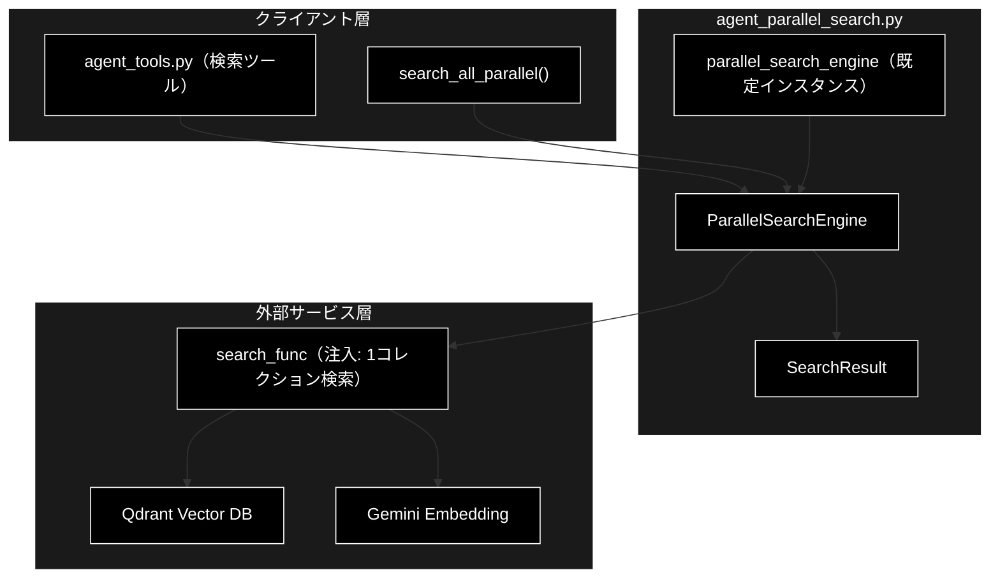
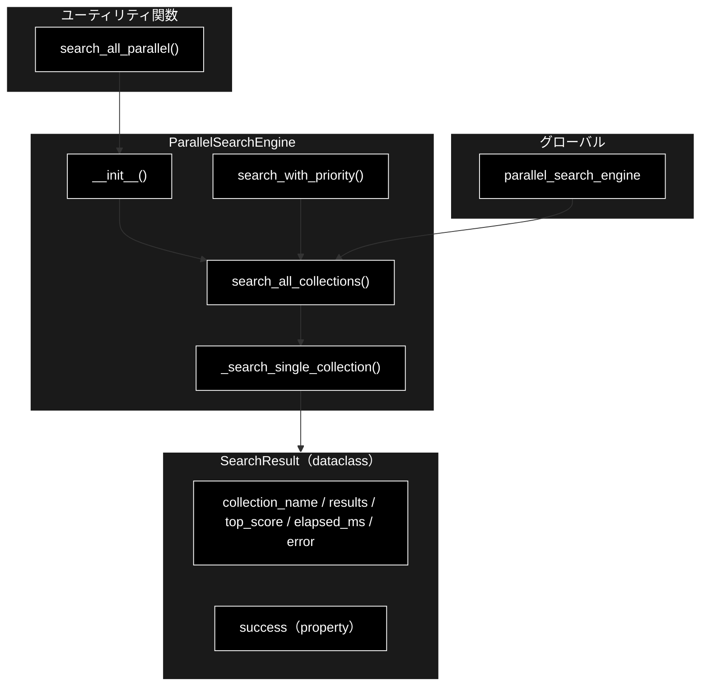
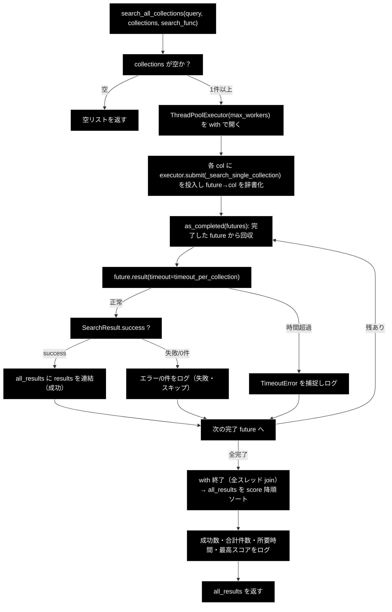
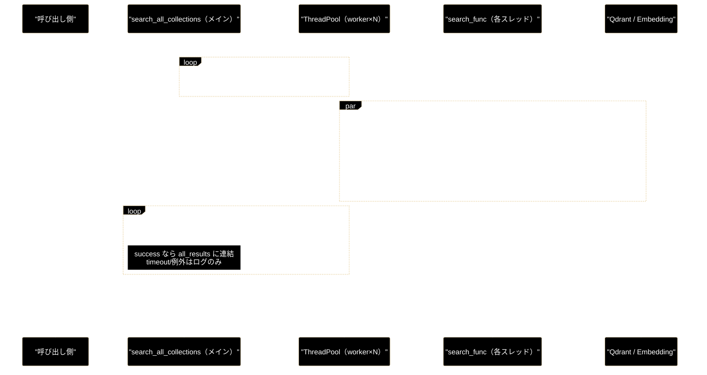
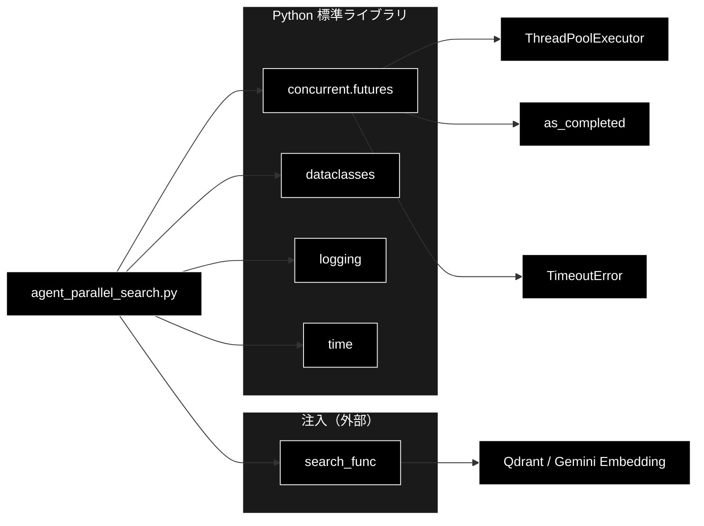

# agent_parallel_search.py - 並列検索エンジン ドキュメント

**Version 1.0** | 最終更新: 2026-07-25

---

## 目次

1. [概要](#概要)
2. [アーキテクチャ構成図](#1-アーキテクチャ構成図)
3. [モジュール構成図](#2-モジュール構成図)
4. [ThreadPoolExecutor による並列処理（重点解説）](#3-threadpoolexecutor-による並列処理重点解説)
5. [クラス・関数一覧表](#4-クラス関数一覧表)
6. [クラス・関数 IPO詳細](#5-クラス関数-ipo詳細)
7. [設定・定数](#6-設定定数)
8. [使用例](#7-使用例)
9. [エクスポート](#8-エクスポート)
10. [変更履歴](#9-変更履歴)
11. [付録: 依存関係図](#付録-依存関係図)

---

## 概要

`agent_parallel_search.py` は、**複数の Qdrant コレクションを同時（並列）に検索し、結果を 1 本の
スコア降順リストへ統合する**軽量エンジンである。中核は Python 標準ライブラリの
`concurrent.futures.ThreadPoolExecutor` による**スレッド並列**で、各コレクションの検索を
別スレッドへ振り分け、投入した順ではなく**完了した順**（`as_completed`）で結果を回収する。

検索の実体（1 コレクションをどう検索するか）はこのモジュールには持たず、呼び出し側から
`search_func`（`(query, collection_name) -> List[Dict] | str`）として**注入**する。これにより、
Embedding（Gemini）や Qdrant 依存を engine 本体から切り離し、並列制御・タイムアウト・
エラー集約・進捗ログという「並列オーケストレーション」だけに責務を絞っている。

- 検索の並列化対象は I/O 待ち（Qdrant への検索リクエスト）であり、GIL の影響を受けにくいため
  スレッドプールが有効に働く（プロセス並列は不要）。
- 1 コレクションの遅延・失敗が全体を止めないよう、**コレクション単位でタイムアウトと例外を隔離**する。

### 主な責務

- 複数コレクションへの検索リクエストをスレッドプールへ投入し並列実行する
- 各コレクションの検索を注入された `search_func` に委譲する（検索実体の分離）
- コレクション単位のタイムアウト管理と例外の隔離（1 件の失敗で全体を止めない）
- 全コレクションの結果を統合し、`score` 降順にソートして返す
- 優先コレクション先行＋早期停止（early-stop）による段階的検索の提供
- 進捗・成功件数・所要時間・最高スコアのログ出力

### 各責務対応のモジュール

| # | 責務 | 対応モジュール | 説明 |
|---|------|--------------|------|
| 1 | 検索リクエストの並列投入・回収 | `agent_parallel_search.py`（`ParallelSearchEngine.search_all_collections`） | `ThreadPoolExecutor` + `as_completed` |
| 2 | 単一コレクション検索の実行と結果整形 | `agent_parallel_search.py`（`ParallelSearchEngine._search_single_collection`） | `search_func` を呼び `SearchResult` に包む |
| 3 | 検索実体（1 コレクションの検索） | 呼び出し側の `search_func`（例: `agent_tools.py`） | Embedding→Qdrant 検索を engine 外に分離 |
| 4 | タイムアウト・例外の隔離 | `agent_parallel_search.py`（`search_all_collections` / `_search_single_collection`） | `future.result(timeout=...)` と `try/except` |
| 5 | 優先順位付き・早期停止検索 | `agent_parallel_search.py`（`ParallelSearchEngine.search_with_priority`） | フェーズ分割＋しきい値停止 |
| 6 | 結果ラッパーと成否判定 | `agent_parallel_search.py`（`SearchResult`） | `success` プロパティで成否を判定 |

### 主要機能一覧

| 機能 | 説明 |
|------|------|
| `SearchResult` | 1 コレクションの検索結果ラッパー（結果・最高スコア・所要時間・エラー） |
| `SearchResult.success` | 成否判定プロパティ（エラー無し かつ 結果 1 件以上） |
| `ParallelSearchEngine` | 並列検索エンジン本体 |
| `ParallelSearchEngine.__init__()` | 並列数・タイムアウトの設定 |
| `ParallelSearchEngine.search_all_collections()` | 全コレクションを並列検索し統合（中核） |
| `ParallelSearchEngine._search_single_collection()` | 単一コレクション検索（各スレッドが実行する内部関数） |
| `ParallelSearchEngine.search_with_priority()` | 優先コレクション先行＋早期停止の段階検索 |
| `search_all_parallel()` | エンジン生成〜並列検索までのショートカット関数 |
| `parallel_search_engine` | 既定設定（4 並列・10 秒）のグローバルインスタンス |

---

## 1. アーキテクチャ構成図

### 1.1 システム全体構成



### 1.2 データフロー

1. クライアント（`agent_tools.py` 等）が `query`・`collections`・`search_func` を渡して呼び出す
2. `search_all_collections` が各コレクションの検索タスクをスレッドプールへ投入
3. 各スレッドが `_search_single_collection` を実行し、注入された `search_func` で 1 コレクションを検索
4. `search_func` が Embedding（Gemini）→ Qdrant 検索を行い、ヒット（`List[Dict]`）またはエラー文字列を返す
5. 各スレッドの結果を `SearchResult` に包み、完了順（`as_completed`）にメインスレッドが回収
6. 成功分の結果を平坦化して集約し、`score` 降順にソートして返却

---

## 2. モジュール構成図

### 2.1 内部モジュール構成



### 2.2 外部依存関係

| ライブラリ | バージョン | 用途 |
|-----------|-----------|------|
| `concurrent.futures`（標準） | 3.11+ | `ThreadPoolExecutor` / `as_completed` / `TimeoutError` によるスレッド並列 |
| `dataclasses`（標準） | 3.11+ | `SearchResult` の定義 |
| `logging`（標準） | 3.11+ | 進捗・エラー・統計ログ |
| `time`（標準） | 3.11+ | 所要時間計測 |

### 2.3 内部依存モジュール

| モジュール | 用途 |
|-----------|------|
| （なし） | 本モジュールは検索実体を持たず `search_func` として外部から注入される（疎結合） |

> 📝 **注意**: 検索の実体（Qdrant/Embedding）は `search_func` 経由で注入されるため、本モジュール
> 自体は Qdrant・Gemini に直接依存しない。テスト時はダミーの `search_func` を渡せる。

---

## 3. ThreadPoolExecutor による並列処理（重点解説）

本モジュールの核心。`search_all_collections` が **N 個のコレクション**を **`max_workers` 並列**で
検索する仕組みを、「処理の流れ」と「データの流れ」に分けて解説する。

### 3.1 なぜスレッド並列か

- 各コレクション検索は **Qdrant へのネットワーク I/O 待ち**が支配的。I/O 待ち中は GIL が解放される
  ため、スレッドプールでも実効的に並列化できる（重い CPU 計算ではないのでプロセス並列は不要）。
- 例: 5 コレクション × 各 200ms を直列で行うと約 1000ms。4 並列なら概ね
  `ceil(5/4) × 200ms ≒ 400ms` に短縮される（最も遅いコレクションが律速）。

### 3.2 処理の流れ（制御フロー）



**要点**:

1. **投入（submit）**: `executor.submit(...)` は即座に `Future` を返し、ブロックしない。全コレクション
   ぶんを一気に投入することで、`max_workers` の範囲で同時実行が始まる。
2. **対応付け**: `future_to_collection` 辞書で `Future → コレクション名`を保持。完了時にどの
   コレクションの結果かを逆引きできるようにしている。
3. **回収（as_completed）**: 投入順ではなく**完了順**に `Future` が返る。速いコレクションから
   逐次ログ・集約でき、体感の待ちが減る。
4. **隔離**: `future.result(timeout=...)` の `TimeoutError`、および内部の一般例外を `try/except` で
   受けるため、**1 コレクションの遅延・失敗が他や全体を止めない**。
5. **同期点**: `with ThreadPoolExecutor(...)` を抜ける際に全スレッドが join される。以降のソートは
   単一スレッドで安全に行われる。

> 📝 **注意（2 段階のタイムアウトに見える点）**: `_search_single_collection` 内部の `search_func`
> 自体にはタイムアウトが無く、`future.result(timeout=...)` はメインスレッドの**待ち時間**を打ち切る
> だけである。ワーカースレッド自体は `search_func` が戻るまで動き続ける（Python のスレッドは
> 強制中断できない）。タイムアウトは「結果を待たずに次へ進む」ための制御であり、遅い検索を
> 物理的に kill するものではない点に留意する。

### 3.3 データの流れ（データフロー）



**データ変換の段階**:

| 段階 | データ形 | 説明 |
|:--:|------|------|
| 入力 | `query: str`, `collections: List[str]`, `search_func` | クエリ・対象コレクション・検索実体 |
| 各スレッド出力 | `List[Dict]` または `str`（エラー） | `search_func` の戻り。各 Dict に `score` を含む想定 |
| ラップ | `SearchResult` | `results` / `top_score` / `elapsed_ms` / `error` に整形。各結果へ `collection_name` を付与 |
| 集約 | `all_results: List[Dict]` | 成功した `SearchResult.results` を平坦化して連結 |
| 出力 | `List[Dict]`（`score` 降順） | 全コレクション横断でスコア順に並んだ統合結果 |

---

## 4. クラス・関数一覧表

### 4.1 クラス一覧

#### SearchResult

| メンバー | 概要 |
|---------|------|
| `collection_name: str` | 検索対象コレクション名 |
| `results: List[Dict[str, Any]]` | 検索ヒット（各 Dict に `score` 等） |
| `top_score: float` | このコレクション内の最高スコア |
| `elapsed_ms: float` | このコレクション検索の所要時間（ミリ秒） |
| `error: Optional[str]` | エラーメッセージ（正常時 `None`） |
| `success`（property） | エラー無し かつ 結果 1 件以上なら `True` |

#### ParallelSearchEngine

| メソッド | 概要 |
|---------|------|
| `__init__(max_workers=4, timeout_per_collection=10)` | 並列数・コレクション毎タイムアウトを設定 |
| `search_all_collections(query, collections, search_func)` | 全コレクションを並列検索し統合（中核） |
| `_search_single_collection(query, collection_name, search_func)` | 単一コレクション検索（各スレッドが実行する内部関数） |
| `search_with_priority(query, priority_collections, other_collections, search_func, early_stop_score=0.8)` | 優先コレクション先行＋早期停止 |

### 4.2 関数一覧（カテゴリ別）

#### ユーティリティ関数

| 関数名 | 概要 |
|-------|------|
| `search_all_parallel(query, collections, search_func, max_workers=4)` | エンジン生成〜並列検索のショートカット |

---

## 5. クラス・関数 IPO詳細

### 5.1 SearchResult クラス

1 コレクションの検索結果を包む `dataclass`。成否は `success` プロパティで判定する。

#### プロパティ: `success`

**概要**: エラーが無く、かつ結果が 1 件以上あるかを返す成否判定。

```python
@property
def success(self) -> bool
```

| 項目 | 内容 |
|------|------|
| **Input** | なし（self のみ） |
| **Process** | `self.error is None and len(self.results) > 0` を評価 |
| **Output** | `bool`: 成功なら True |

**戻り値例**:
```python
True
```

```python
# 使用例
sr = SearchResult(collection_name="qa_pairs", results=[{"score": 0.9}], top_score=0.9, elapsed_ms=120.0)
print(sr.success)
# True
```

### 5.2 ParallelSearchEngine クラス

複数の Qdrant コレクションを並列に検索し、結果を統合する並列検索エンジン。

#### コンストラクタ: `__init__`

**概要**: 並列実行数とコレクション毎タイムアウトを設定する。

```python
ParallelSearchEngine(max_workers: int = 4, timeout_per_collection: int = 10)
```

| パラメータ | 型 | デフォルト | 説明 |
|------------|------|-----------|------|
| `max_workers` | int | 4 | スレッドプールの並列実行数 |
| `timeout_per_collection` | int | 10 | 1 コレクションの結果待ちタイムアウト（秒） |

| 項目 | 内容 |
|------|------|
| **Input** | `max_workers: int = 4`, `timeout_per_collection: int = 10` |
| **Process** | 引数をインスタンス属性に保存し、初期化ログを出力 |
| **Output** | `ParallelSearchEngine` インスタンス |

```python
# 使用例
engine = ParallelSearchEngine(max_workers=8, timeout_per_collection=15)
```

#### メソッド: `search_all_collections`

**概要**: 全コレクションをスレッドプールで並列検索し、成功結果を `score` 降順に統合して返す。

```python
def search_all_collections(
    self,
    query: str,
    collections: List[str],
    search_func: Callable
) -> List[Dict[str, Any]]
```

| パラメータ | 型 | デフォルト | 説明 |
|------------|------|-----------|------|
| `query` | str | - | 検索クエリ |
| `collections` | List[str] | - | 検索対象コレクション名のリスト |
| `search_func` | Callable | - | `(query, collection_name) -> List[Dict] | str` の検索関数 |

| 項目 | 内容 |
|------|------|
| **Input** | `query: str`, `collections: List[str]`, `search_func: Callable` |
| **Process** | 1. `collections` 空ならガードして `[]` を返す<br>2. `ThreadPoolExecutor(max_workers)` を開く<br>3. 各コレクションに `_search_single_collection` を `submit`（`future→col` を辞書化）<br>4. `as_completed` で完了順に `future.result(timeout=...)` を回収<br>5. `success` は `all_results` へ連結、`TimeoutError`/例外はログのみ<br>6. `all_results` を `score` 降順ソート、統計をログ |
| **Output** | `List[Dict[str, Any]]`: 全コレクション横断の統合結果（`score` 降順） |

**戻り値例**:
```python
[
    {"score": 0.92, "text": "...", "collection_name": "qa_pairs"},
    {"score": 0.81, "text": "...", "collection_name": "wikipedia_ja"},
    {"score": 0.75, "text": "...", "collection_name": "livedoor"}
]
```

```python
# 使用例
engine = ParallelSearchEngine(max_workers=4)
results = engine.search_all_collections(
    query="レベッカ・クローン",
    collections=["qa_pairs", "wikipedia_ja", "livedoor"],
    search_func=search_rag_knowledge_base_structured,
)
print(f"統合ヒット数: {len(results)} / 最高スコア: {results[0]['score']:.3f}")
# 統合ヒット数: 12 / 最高スコア: 0.920
```

#### メソッド: `_search_single_collection`

**概要**: 1 コレクションを検索し、結果を `SearchResult` に整形する内部関数（各スレッドが実行）。

```python
def _search_single_collection(
    self,
    query: str,
    collection_name: str,
    search_func: Callable
) -> SearchResult
```

| パラメータ | 型 | デフォルト | 説明 |
|------------|------|-----------|------|
| `query` | str | - | 検索クエリ |
| `collection_name` | str | - | 対象コレクション名 |
| `search_func` | Callable | - | 検索関数 |

| 項目 | 内容 |
|------|------|
| **Input** | `query: str`, `collection_name: str`, `search_func: Callable` |
| **Process** | 1. 計測開始<br>2. `search_func(query, collection_name)` を実行<br>3. 戻りが `str` ならエラーとして `SearchResult(error=...)`<br>4. 結果ありなら `top_score` を算出し各 Dict に `collection_name` を付与<br>5. 空なら結果 0 件の `SearchResult`<br>6. 例外は捕捉し `error` 付き `SearchResult` を返す |
| **Output** | `SearchResult`: 結果・最高スコア・所要時間・（あれば）エラー |

**戻り値例**:
```python
SearchResult(
    collection_name="qa_pairs",
    results=[{"score": 0.92, "text": "...", "collection_name": "qa_pairs"}],
    top_score=0.92,
    elapsed_ms=118.0,
    error=None
)
```

```python
# 使用例（通常はエンジン内部から呼ばれる）
sr = engine._search_single_collection("クエリ", "qa_pairs", search_func)
if sr.success:
    print(sr.top_score)
```

#### メソッド: `search_with_priority`

**概要**: 優先コレクションを先に検索し、十分な高スコアが出れば残りを打ち切る段階的検索。

```python
def search_with_priority(
    self,
    query: str,
    priority_collections: List[str],
    other_collections: List[str],
    search_func: Callable,
    early_stop_score: float = 0.8
) -> List[Dict[str, Any]]
```

| パラメータ | 型 | デフォルト | 説明 |
|------------|------|-----------|------|
| `query` | str | - | 検索クエリ |
| `priority_collections` | List[str] | - | 先に検索する優先コレクション |
| `other_collections` | List[str] | - | 優先で不足した場合に検索するその他 |
| `search_func` | Callable | - | 検索関数 |
| `early_stop_score` | float | 0.8 | 優先結果の最高スコアがこの値以上なら残りを打ち切る |

| 項目 | 内容 |
|------|------|
| **Input** | `query`, `priority_collections`, `other_collections`, `search_func`, `early_stop_score=0.8` |
| **Process** | 1. フェーズ1: 優先コレクションを `search_all_collections` で並列検索<br>2. 先頭スコア ≥ `early_stop_score` なら即返却（早期停止）<br>3. フェーズ2: その他コレクションを並列検索<br>4. 両フェーズを連結し `score` 降順ソート |
| **Output** | `List[Dict[str, Any]]`: 統合結果（`score` 降順） |

**戻り値例**:
```python
[
    {"score": 0.88, "text": "...", "collection_name": "qa_pairs"},
    {"score": 0.62, "text": "...", "collection_name": "wikipedia_ja"}
]
```

```python
# 使用例
results = engine.search_with_priority(
    query="返品したい",
    priority_collections=["qa_pairs"],
    other_collections=["wikipedia_ja", "livedoor"],
    search_func=search_rag_knowledge_base_structured,
    early_stop_score=0.8,
)
```

### 5.3 ユーティリティ関数

#### `search_all_parallel`

**概要**: エンジン生成から並列検索までを 1 行で行うショートカット関数。

```python
def search_all_parallel(
    query: str,
    collections: List[str],
    search_func: Callable,
    max_workers: int = 4
) -> List[Dict[str, Any]]
```

| パラメータ | 型 | デフォルト | 説明 |
|------------|------|-----------|------|
| `query` | str | - | 検索クエリ |
| `collections` | List[str] | - | 検索対象コレクション |
| `search_func` | Callable | - | 検索関数 |
| `max_workers` | int | 4 | 並列数 |

| 項目 | 内容 |
|------|------|
| **Input** | `query`, `collections`, `search_func`, `max_workers=4` |
| **Process** | 1. `ParallelSearchEngine(max_workers)` を生成<br>2. `search_all_collections` を委譲呼び出し |
| **Output** | `List[Dict[str, Any]]`: 統合結果（`score` 降順） |

**戻り値例**:
```python
[
    {"score": 0.90, "text": "...", "collection_name": "qa_pairs"}
]
```

```python
# 使用例
from agent_parallel_search import search_all_parallel

results = search_all_parallel(
    query="配送状況を知りたい",
    collections=["qa_pairs", "wikipedia_ja"],
    search_func=search_func,
    max_workers=4,
)
print(f"{len(results)}件")
```

---

## 6. 設定・定数

### 6.1 グローバルインスタンス

既定設定（4 並列・コレクション毎 10 秒タイムアウト）の共有インスタンス。呼び出し側は都度
生成せずこれを再利用できる（`agent_tools.py` はこれを import して使用）。

```python
parallel_search_engine = ParallelSearchEngine(max_workers=4, timeout_per_collection=10)
```

| 設定 | 既定値 | 説明 |
|-----|-------|------|
| `max_workers` | 4 | 同時検索スレッド数 |
| `timeout_per_collection` | 10 | 1 コレクションの結果待ち上限（秒） |

> 📝 **注意**: `max_workers` を増やすとレイテンシは下がるが、Qdrant への同時接続数も増える。
> Qdrant/ネットワークの許容量に応じて調整する（過大な並列はかえって遅延やエラーを招く）。

---

## 7. 使用例

### 7.1 基本的なワークフロー（全コレクション並列検索）

```python
from agent_parallel_search import parallel_search_engine

# 1. 検索実体（1コレクションを検索する関数）を用意
def search_func(query: str, collection_name: str):
    # Embedding(Gemini)→Qdrant 検索を行い List[Dict]（score付き）を返す
    # エラー時は説明文字列(str)を返すと SearchResult.error に格納される
    return search_rag_knowledge_base_structured(query, collection_name)

# 2. 対象コレクション（例: Qdrant から動的取得）
collections = ["qa_pairs", "wikipedia_ja", "livedoor"]

# 3. 並列検索（既定 4 並列・10 秒タイムアウト）
results = parallel_search_engine.search_all_collections(
    query="レベッカ・クローンとは？",
    collections=collections,
    search_func=search_func,
)

# 4. 統合結果（score 降順）を利用
for r in results[:5]:
    print(f"{r['score']:.3f}  [{r['collection_name']}]  {r.get('text', '')[:40]}")
```

### 7.2 応用ワークフロー（優先順位付き＋早期停止）

```python
# 優先コレクションで高スコアが出れば、その他は検索しない（レイテンシ削減）
results = parallel_search_engine.search_with_priority(
    query="返品したい",
    priority_collections=["qa_pairs"],       # まずFAQを見る
    other_collections=["wikipedia_ja", "livedoor"],
    search_func=search_func,
    early_stop_score=0.8,                    # 0.8以上なら即確定
)
```

---

## 8. エクスポート

`__all__` でエクスポートされる要素：

```python
__all__ = [
    "ParallelSearchEngine",     # 並列検索エンジン本体
    "SearchResult",             # 結果ラッパー
    "parallel_search_engine",   # 既定インスタンス（4並列・10秒）
    "search_all_parallel",      # ショートカット関数
]
```

---

## 9. 変更履歴

| バージョン | 変更内容 |
|-----------|---------|
| 1.0 | 初版作成（`ParallelSearchEngine` / `SearchResult` / `search_all_parallel` の IPO 詳細と、ThreadPoolExecutor による並列処理の制御フロー・データフローを重点解説） |

---

## 付録: 依存関係図


