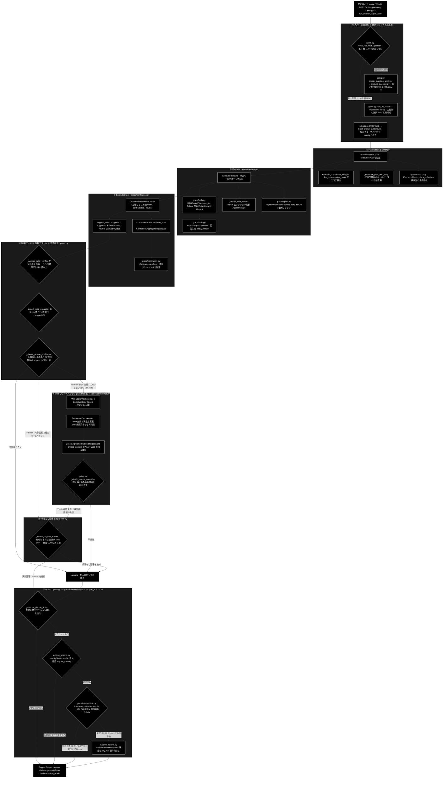

# GRACE-Support API フロー一覧（0 〜 ⑥ 8 段階）

**Version 2.0** | 最終更新: 2026-09-03

本書は、`grace/*.py`（自律エージェント基盤）と `backend/app/api/*.py` / `backend/app/core/*.py`
（Web API・オーケストレーション）に散らばる**主要 API**を、パイプラインの 8 段階へ分類し、
呼び出し順に並べたものである。「処理の流れを API の流れで掴む」ことを目的とし、各段階について
**API（シンボル名）／API概要／入力：概要／処理概要／出力：概要** の表でまとめる。

技術スタック: LLM = ローカル LLM（Ollama・既定 `gemma4:12b-mlx`）／
Embedding = Gemini（`gemini-embedding-001`・3072次元）。
LLM 呼び出しは `grace/llm_compat.py::create_chat_client` が返す genai 互換クライアント経由で、
すべて次の 1 つのシグネチャに統一されている（内部は `OllamaGenaiClient`）:

```python
response = client.models.generate_content(
    model=...,
    contents="...",
    config={"temperature": ..., "max_output_tokens": ...},
)
text = response.text
```

> ⚠️ **行番号は書かない。** 実装への参照は「ファイル名 + シンボル名」で示す
> （`docs/pipelines.md` / `docs/reasoning_flow.md` と同じ方針。行番号はコミットのたびに嘘になる）。
>
> ⚠️ **Embedding だけはローカルではない。** LLM は Ollama だが、`RAGSearchTool` の検索ベクトルと
> `SourceAgreementCalculator` の一致度計算は Gemini の `embed_content` を叩く（外部 API・要 `GOOGLE_API_KEY`）。
>
> **関連ドキュメント**: モード全体の対照は [`docs/pipelines.md`](./pipelines.md)、生成（reasoning）の詳細は
> [`docs/reasoning_flow.md`](./reasoning_flow.md)、判定（ゲート）の全体像は [`docs/guardrails.md`](./guardrails.md)、
> 各モジュールの IPO 詳細は `grace/docs/*.md` / `backend/docs/core_gates.md` を参照。

---

## 目次

- [1. 全体フロー（呼び出し順）](#1-全体フロー呼び出し順)
  - [1.1 アーキテクチャ図](#11-アーキテクチャ図)
  - [1.2 図の読み方（3 つの要点）](#12-図の読み方3-つの要点)
  - [1.3 呼び出し順（コールスタック）](#13-呼び出し順コールスタック)
- [2. ファイル分類一覧（どのファイルがどの段階か）](#2-ファイル分類一覧どのファイルがどの段階か)
- [3. (0)-A 入力・質問分析](#3-0-a-入力質問分析複数質問の検知--選択--再構成)
- [4. (0)-B 業界プロファイル適用](#4-0-b-業界プロファイル適用)
- [5. (1) Plan（planner）](#5-1-planplanner)
- [6. (2) Execute（内部RAG → reasoning）](#6-2-execute内部rag--reasoning)
- [7. (3) Groundedness（根拠検証）](#7-3-groundedness根拠検証支持率)
- [8. (4) 回答ゲート＋強制エスカレ＋救済判定](#8-4-回答ゲート強制エスカレ救済判定-answer)
- [9. (5) Web フォールバック](#9-5-web-フォールバック内部回答で確定した場合はスキップ)
- [10. (4)' 情報なし回答検知](#10-4-情報なし回答検知)
- [11. (6) Action（本人確認 → HITL CONFIRM → 実行）](#11-6-action本人確認--hitl-confirm--実行)
- [12. 横断モジュール（段階に属さないが全段階が使う）](#12-横断モジュール段階に属さないが全段階が使う)
- [13. 8 段階の外にあるサブシステム](#13-8-段階の外にあるサブシステム)
- [14. 変更履歴](#14-変更履歴)

---

## 1. 全体フロー（呼び出し順）

### 1.1 アーキテクチャ図

8 段階を**サブグラフ**として置き、その中に**構成物（`grace/*.py` ＋ 実際に使う API）**を並べた。
菱形は分岐（判定）、角丸四角は処理。分岐ラベルは実装の発動条件そのものである。



### 1.2 図の読み方（3 つの要点）

**① どの段階を誰が持っているか。** 8 段階のうち **判定（ゲート）はすべて `backend/app/core/gates.py`**
（(0)-A・④・④'・⑥ の種別決定）、**生成と実行はすべて `grace/*.py`**（①②③⑤）に分かれている。
`support_agent.py` は**自分では判定も生成もせず**、この 2 系統を順に呼ぶだけの統括役である。

**② 分岐は 3 か所しかない。** 直列に見えるが、実際に経路が変わるのは次の 3 つだけ:

| 分岐 | 条件 | 効果 |
|---|---|---|
| (0)-A の第 1 段 | `looks_like_multi_question` が False | 第 2 段の LLM を**一度も呼ばず** (0)-B へ直行 |
| ④ → ⑤ | `decision == "escalate"` かつ `use_web` かつ 強制エスカレでない | ⑤ を実行。`answer` なら**⑤ を丸ごとスキップ**（＝「内部回答で確定」） |
| ④' → ⑥ | `decision == "answer"` かつ 回答が空でない | ④' を実行。`no_info` なら `escalate` へ書き換え |

**③ LLM を呼ぶ箇所と呼ばない箇所。** 図中で LLM（Ollama）を叩くのは
`A2` / `A3`（軽量モデル）・`P2` / `P3`・`E3` / `E4`・`C1` / `C3`・`W2`・`N1`、および `G2` / `T1` が
共有する意図分類器のみ。`G1` / `G3` / `W4` は**純関数**で、`E2` と `W3` は LLM ではなく
**Gemini Embedding** を使う（`CLAUDE.md` §3 のプロバイダ方針どおり）。

### 1.3 呼び出し順（コールスタック）

```
Web:  POST /api/support/query        … backend/app/api/support.py::start_query
   └→ backend/app/core/jobs.py::JobManager.start（ワーカースレッド起動＋InterventionBridge 生成）
        └→ backend/app/core/jobs.py::_support_runner
             └→ backend/app/core/support_agent.py::run_support_agent_core   ← パイプライン統括の親API
                  ├→ (0)-A 入力・質問分析      gates.py（looks_like_multi_question → analyze_questions → reconstruct_query）
                  ├→ (0)-B 業界プロファイル適用 verticals.py（PROFILES → build_prompt_addendum）
                  ├→ ①  Plan                  grace/planner.py::Planner.create_plan
                  ├→ ②  Execute               grace/executor.py::Executor.execute（内部で tools / replan / memory）
                  ├→ ③  Groundedness          grace/confidence.py::GroundednessVerifier.verify
                  ├→ ④  回答ゲート             gates.py::_answer_gate ＋ 強制エスカレ ＋ 救済
                  ├→ ⑤  Web フォールバック     tools.py::WebSearchTool（④ が escalate のときだけ）
                  ├→ ④' 情報なし回答検知        gates.py::_detect_no_info_answer
                  └→ ⑥  Action                gates.py::_decide_action → intervention.py → support_actions.py
   進捗は SSE で配信: GET /api/support/stream/{job_id}
   HITL 承認:        POST /api/support/confirm/{job_id}
```

CLI（`agent_support_example.py`）も**同じ `run_support_agent_core` を通る**（`CLAUDE.md` §1）。
Web/CLI で分岐する API は存在せず、違いは `emit` / `confirm` コールバックの中身だけである。

---

## 2. ファイル分類一覧（どのファイルがどの段階か）

対象 3 ディレクトリの**全ファイル**を 8 段階へ分類した。段階に属さないものは「横断」または
「別サブシステム」として明示する（§12・§13）。

### 2.1 `grace/*.py`（12 ファイル）

| ファイル | 段階 | 役割 |
|---|---|---|
| `planner.py` | **①** | 計画生成（複雑度推定 → ルールベース or LLM 計画） |
| `executor.py` | **②** | 計画実行オーケストレータ（RAG → reasoning → ReAct ループ） |
| `tools.py` | **② ⑤** | ツール群（`rag_search` / `reasoning` / `web_search` / `ask_user` / `code_execute`） |
| `confidence.py` | **③ ⑤** | 根拠検証（③）・回答間一致度（⑤ の相互検証）・多軸信頼度 |
| `calibration.py` | **③** | confidence の事後較正（温度スケーリング） |
| `intervention.py` | **⑥** | HITL 4 段階介入（SILENT / NOTIFY / CONFIRM / ESCALATE） |
| `replan.py` | **②（内部）** | ステップ失敗・低信頼度時の動的リプラン。executor から呼ばれる |
| `memory.py` | **① ②（横断）** | 実行メモリ。planner のコレクション優先順位・executor の実績記録 |
| `llm_compat.py` | 横断 | 全 LLM 呼び出しの基盤アダプタ（genai 互換 → Ollama） |
| `schemas.py` | 横断 | データ契約（`ExecutionPlan` / `PlanStep` / `ExecutionResult` / `StepResult`） |
| `config.py` | 横断 | 設定管理（Pydantic 階層設定・しきい値） |
| `__init__.py` | 横断 | 公開 API の集約（`create_planner` / `create_executor` 等） |

### 2.2 `backend/app/api/*.py`（5 ファイル）

| ファイル | 段階 | 役割 |
|---|---|---|
| `support.py` | **入口（全段階）** | `POST /api/support/query`・SSE 配信・HITL 応答・結果取得 |
| `meta.py` | 横断 | 業界プロファイル一覧・モデル一覧・ヘルスチェック（画面の初期化用） |
| `review.py` | **対象外** | GRACE-Review（文書レビュー）の入口 → §13 |
| `data.py` | **対象外** | データ準備パイプライン（チャンキング / 登録 / 削除）→ §13 |
| `qdrant.py` | **対象外** | Qdrant コレクション参照（読み取り専用）→ §13 |

### 2.3 `backend/app/core/*.py`（10 ファイル）

| ファイル | 段階 | 役割 |
|---|---|---|
| `support_agent.py` | **全段階** | パイプライン統括（`run_support_agent_core`）。8 段階すべてをここが呼ぶ |
| `gates.py` | **(0)-A ④ ④' ⑥** | 判定ロジック群（質問分析・回答ゲート・情報なし検知・アクション決定） |
| `verticals.py` | **(0)-B** | 業界プロファイル（`gov` / `saas` / `ec`）の定義とプロンプト組み立て |
| `jobs.py` | **入口（全段階）** | ジョブ管理。ワーカースレッドで `run_support_agent_core` を呼ぶ |
| `intervention_bridge.py` | **⑥** | Web の HITL 承認待ち（ワーカースレッド ↔ HTTP の橋渡し） |
| `job_logs.py` | 横断 | 既存モジュールの `logging` 出力を進捗イベントへ転送 |
| `review_agent.py` | **対象外** | GRACE-Review コア → §13 |
| `review_gates.py` | **対象外** | GRACE-Review の判定ロジック → §13 |
| `rulesets.py` | **対象外** | GRACE-Review のルールセット定義 → §13 |
| `data_jobs.py` | **対象外** | データ準備パイプラインの job runner → §13 |

> 📌 **⑥ の実行本体はリポジトリ直下の `support_actions.py`** にある（`create_action_backend` /
> `create_identity_verifier`）。3 ディレクトリの外だが ⑥ に不可欠なため §11 に含める。

---

## 3. (0)-A 入力・質問分析（複数質問の検知 → 選択 → 再構成）

| API | API概要 | 入力：概要 | 処理概要 | 出力：概要 |
|---|---|---|---|---|
| `api/support.py::start_query` | ・問い合わせジョブを起動する（Web 入口）。<br>・上位のモジュール：フロントエンド（`POST /api/support/query`）<br>・API：<code>job = job_manager.start(JobParams(query=..., vertical=..., model=...))</code> | `QueryRequest`（query / vertical / model / dry_run / use_web / do_action / verbose / identity） | `JobParams` へ詰め替えて `job_manager.start()` に委譲。**同期実行はしない**（202 を即返す） | `QueryAccepted`（`job_id`, `stream_url`）。進捗は SSE、結果は `GET /api/support/result/{job_id}` |
| `core/jobs.py::JobManager.start` → `_support_runner` | ・ジョブをワーカースレッドで実行し、SSE 用のイベントキューと HITL 橋渡しを用意する。<br>・上位のモジュール：`api/support.py::start_query`<br>・API：<code>result = run_support_agent_core(params.query, vertical=..., model=..., identity=..., emit=emit, confirm=confirm)</code> | `JobParams` | `InterventionBridge(emit=job.emit)` を生成 → `threading.Thread` で `_support_runner` を起動。`emit` は SSE キューへ、`confirm` は `bridge.resolver` へ配線 | `SupportResult` の dict（`job.result` に格納） |
| `core/support_agent.py::run_support_agent_core` | ・8 段階パイプライン全体を統括する**親 API**。Web/CLI 共通の唯一の入口。<br>・上位のモジュール：`core/jobs.py::_support_runner`（Web）／ `agent_support_example.py`（CLI）<br>・API：<code>support = run_support_agent_core(query, vertical=..., emit=..., confirm=...)</code> | `query`、`vertical`、`model`、`identity`、`emit`（進捗）、`confirm`（HITL 応答） | `get_config()` を**リクエスト単位でディープコピー**（ジョブ間で検索スコープを奪い合わないため）→ `tool_registry` / `planner` / `executor` / `verifier` を生成 → ①〜⑥ を順に実行 | `SupportResult`（answer / citations / groundedness / decision / action_result ほか） |
| `gates.py::looks_like_multi_question` | ・複数質問の**候補**かを判定する第 1 段（**LLM 呼び出しゼロ**）。<br>・上位のモジュール：`run_support_agent_core`<br>・API：<code>looks_multi = looks_like_multi_question(query)</code> | `query`（原文） | `MULTI_QUESTION_MARKERS`（接続表現）の部分一致など。「？」の数だけでは判定しない | `bool`。False なら第 2 段（LLM）は**一度も呼ばれない** |
| `gates.py::create_question_analyzer` → `analyze_questions` | ・複数質問の**分解**と**担当範囲判定（GA'）を 1 回の LLM 呼び出しで**行う第 2 段。<br>・上位のモジュール：`run_support_agent_core`（`looks_multi=True` のときだけ解析器を生成）<br>・API：<code>response = client.models.generate_content(model=judge_model(config), contents=build_prompt(query, strict), config={"temperature": 0.0, "max_output_tokens": MULTI_QUESTION_MAX_OUTPUT_TOKENS})</code> | `query`、`profile`（`scope_description` 等を分類に使う） | 軽量 LLM へ 1 往復。以前は分解と範囲判定で 2 回呼んでいた（実測 16.3s + 2.2s）ものを 1 回に畳んだ。**判定不能なら「単一質問」に倒す**（安全側の向きが ④・④' と逆） | `QuestionAnalysis(clusters, verdicts)` |
| `gates.py::split_by_scope`（+ `scope_classifier_for` / `create_scope_classifier`） | ・クラスタを担当範囲内／外の添字へ分ける。解析器が IN/OUT を返していれば**LLM を呼ばない**。<br>・上位のモジュール：`run_support_agent_core`<br>・API：<code>response = client.models.generate_content(model=model_name, contents=prompt, config={"temperature": 0.0, "max_output_tokens": MULTI_QUESTION_MAX_OUTPUT_TOKENS})</code>（フォールバック経路のみ） | `clusters`、`classify`（`scope_classifier_for` が解析器の結果か新規分類器かを選ぶ） | 範囲外の主質問は**選択肢に出さない**（選ばせても生成側が断るだけ）。判定不能なら**全件を範囲内**として扱う | `(in_scope_indexes, out_of_scope_indexes)` |
| `intervention_bridge.py::InterventionBridge.resolver`（主質問の選択） | ・範囲内の主質問が複数あるとき、利用者に選ばせる（自動選定はしない）。<br>・上位のモジュール：`run_support_agent_core`（`resolve_confirm(InterventionRequest(...))`）<br>・API：<code>selection = resolve_confirm(InterventionRequest(level=InterventionLevel.CONFIRM, options=options, reason="multi_question_selection"))</code> | `InterventionRequest`（`options`＝範囲内の主質問リスト） | Web は承認が来るまでワーカースレッドをブロック（SSE で `type="intervention"` を配信）。CLI は `AUTO_PROCEED` | `InterventionResponse`（`selected_option`）。拒否・timeout なら**単一質問として処理を継続**（escalate には倒さない） |
| `gates.py::reconstruct_query` | ・採用クラスタ（主質問＋関連質問）を自然文の 1 文へ再構成する。<br>・上位のモジュール：`run_support_agent_core`（主質問が確定した後）<br>・API：<code>response = client.models.generate_content(model=judge_model(config), contents=prompt, config={"temperature": 0.0, "max_output_tokens": MULTI_QUESTION_MAX_OUTPUT_TOKENS})</code> | `main`（主質問）、`related`（関連質問）、`config` | 関連質問が無ければ**LLM を呼ばず** `main` を返す。ある場合は指示語（「その」等）を解決した 1 文へ統合。失敗時は `fallback_reconstruct`（単純連結） | `str`（再構成後クエリ）。以降 ①〜⑥ はこれを「利用者の元の質問文」として扱い、原文は `original_query` に保持 |

---

## 4. (0)-B 業界プロファイル適用

| API | API概要 | 入力：概要 | 処理概要 | 出力：概要 |
|---|---|---|---|---|
| `verticals.py::PROFILES.get(vertical)` | ・`--vertical {gov\|saas\|ec}` から `VerticalProfile` を解決する（**LLM 不使用**）。<br>・上位のモジュール：`run_support_agent_core`（**解決は 0-(A) の手前**。0-(A) のスコープ判定が `scope_description` を読むため）<br>・API：<code>profile = PROFILES.get(vertical) if vertical else None</code> | `vertical`（`gov` / `saas` / `ec` / `None`） | 辞書引きのみ。`None`（基本版）ならプロファイル由来の差は一切発生しない | `Optional[VerticalProfile]` |
| `VerticalProfile.build_prompt_addendum` / `build_closing_instruction` | ・業界固有の業務方針＋共通 `SCOPE_POLICY` を reasoning プロンプトへ注入する文字列を組み立てる。<br>・上位のモジュール：`run_support_agent_core`<br>・API：<code>config.llm.prompt_addendum = profile.build_prompt_addendum()</code><br><code>config.llm.prompt_closing = profile.build_closing_instruction(out_of_scope_questions)</code> | `profile`、`out_of_scope_questions`（0-(A) で範囲外と判定された主質問） | 文字列組み立てのみ。`closing` は**【回答の構成ルール】の後ろ**へ置く（前に置くと構成ルールに負けてモデルが断りを落とす実測あり） | `str`。② の `ReasoningTool` がプロンプト内で読む |
| （設定注入） | ・検索スコープと Web 優先ドメインを config へ配線する。<br>・上位のモジュール：`run_support_agent_core`<br>・API：<code>config.qdrant.allowed_collections = list(profile.collections)</code><br><code>config.web_search.preferred_domains = list(profile.preferred_domains)</code> | `profile` | `tools` は config への参照を保持しているため、ここでの代入が②⑤の実行時に効く。しきい値（`notify_th` / `confirm_th`）もここで上書き | 以降の `rag_search` は許可コレクションのみを検索する |

---

## 5. (1) Plan（planner）

| API | API概要 | 入力：概要 | 処理概要 | 出力：概要 |
|---|---|---|---|---|
| `planner.py::Planner.create_plan` | ・質問から実行計画を生成する**親 API**。<br>・上位のモジュール：`run_support_agent_core`<br>・API：<code>plan = planner.create_plan(query)</code> | `query`（再構成後の質問文）、`context_hints`（replan 由来の補助情報。既定空） | 複雑度を推定 → 単純ならルールベース、複雑なら LLM でステップ列を生成 → `repair_plan_dependencies()` で依存関係を補修。`context_hints` は検索クエリ・複雑度に混ぜない（汚染ループ防止） | `ExecutionPlan`（`steps: List[PlanStep]`、`complexity: float`） |
| `Planner.estimate_complexity_with_llm` | ・質問の複雑度（0.0〜1.0）を LLM で推定する。<br>・上位のモジュール：`Planner.create_plan`<br>・API：<code>response = self.client.models.generate_content(model=self.model_name, contents=prompt, config={"temperature": self.config.planner.complexity_temperature, "max_output_tokens": self.config.planner.complexity_max_output_tokens})</code> | `query` | 応答から `llm_compat.parse_score()` でスコア抽出（**`float()` 直変換はしない**。ローカル LLM は「答えは 0.8 です」と前置きを付ける）。失敗時はルールベース推定 | `float`（複雑度） |
| `Planner._generate_plan_with_retry` | ・複雑と判定された質問について LLM でステップ列（JSON）を生成する。<br>・上位のモジュール：`Planner.create_plan`（`_should_use_llm_plan()` が True のときのみ）<br>・API：<code>response = self.client.models.generate_content(model=self.model_name, contents=prompt, config=config)</code> | `query`、生成用プロンプト | 空応答・不正 JSON は既定回数までリトライ。連続失敗すると `_llm_plan_disabled` サーキットブレーカーが立ち、以降は**ルールベース計画へ自動フォールバック** | `List[PlanStep]` |
| `memory.py::ExecutionMemory.best_collection` | ・過去の実行実績から検索コレクションの優先順位を決める（**LLM 不使用**）。<br>・上位のモジュール：`Planner._prioritized_collection`（`config.memory.enabled` のときだけ生成）<br>・API：<code>best = self._memory.best_collection(query, ...)</code> | `query`（キーワード抽出して照合） | JSONL の実行記録から成功率・スコアで並べ替え | `Optional[str]`（優先コレクション名） |

---

## 6. (2) Execute（内部RAG → reasoning）

| API | API概要 | 入力：概要 | 処理概要 | 出力：概要 |
|---|---|---|---|---|
| `executor.py::Executor.execute` | ・計画を実行するオーケストレータの**親 API**。<br>・上位のモジュール：`run_support_agent_core`<br>・API：<code>result = executor.execute(plan)</code> | `plan`（`ExecutionPlan`） | 各 `PlanStep` を締切ベース（`_start_with_deadline` + デーモンスレッド）で実行。RAG スコア不足なら `web_search` を動的挿入（`ExecutionState.dynamic_steps` で追跡）。最後に `_blend_groundedness_confidence` で内部の根拠検証も済ませる | `ExecutionResult`（`final_answer` / `step_results` / `overall_confidence`） |
| `tools.py::RAGSearchTool.execute` | ・Qdrant ベクトル検索で内部ナレッジを取得する（**LLM 不使用・Embedding は Gemini**）。<br>・上位のモジュール：`Executor`（`tool_registry.execute("rag_search", ...)`）<br>・API：<code>query_vector, sparse_vector = self._embed_query_once(query, len(search_candidates))</code><br><code>results = search_rag_knowledge_base_structured(query, target_collection, **precomputed)</code>（実体は `agent_tools`） | `query`、`collection`、`allowed_collections`（0-(B) の検索スコープ） | クエリのベクトル化は**コレクション数によらず 1 回だけ**行い、各コレクションへ使い回す。許可リスト内を順にフォールバック探索 | `ToolResult`（出典本文・スコア付きの検索結果） |
| `tools.py::ReasoningTool.execute` | ・収集した出典から**利用者への回答**を生成する（本パイプラインで最も重い LLM 呼び出し）。<br>・上位のモジュール：`Executor`（`tool_registry.execute("reasoning", ...)`）／ ⑤ からも再利用<br>・API：<code>response = self.client.models.generate_content(model=self.model_name, contents=prompt, config={"temperature": self.config.llm.temperature, "max_output_tokens": self.config.llm.max_tokens, "thinking_budget_tokens": heavy_thinking_budget(self.config)})</code> | `query`、`context`、`sources`（RAG/Web 検索結果） | 0-(B) の `prompt_addendum` / `prompt_closing` を含むプロンプトを構築 → 生成。**空応答なら参照情報を上位数件へ絞って 1 回だけ再試行**（ローカル LLM は入力が長いほど本文へ到達しにくい）。空のままなら `success=False` で返し、上位の回復経路へ載せる | `ToolResult`（`output`＝回答文） |
| `executor.py::Executor._decide_next_action` | ・S3 ハイブリッド ReAct ループの**次アクション判断**（追加検索 / Web 検索 / 終了）。<br>・上位のモジュール：`Executor.execute_react_generator`（`executor.react_enabled=True`・**既定で有効**）<br>・API：<code>response = self._react_client.models.generate_content(model=resolve_heavy_model(self.config), contents=prompt, config={"response_mime_type": "application/json", "response_schema": AgentThought, "temperature": 0.0, "max_output_tokens": 512})</code> | 実行中の `ExecutionState`（既収集の出典・これまでの思考） | 構造化出力（`AgentThought`）で次アクションを決定。RAG の関連度が低ければ `web_search` を動的に追加する | `AgentThought`（次アクション種別・理由） |
| `replan.py::ReplanOrchestrator.handle_step_failure` | ・ステップ失敗・低信頼度をトリガに計画を動的修正する（**LLM 呼び出しは `Planner` 経由**）。<br>・上位のモジュール：`Executor.execute_plan_generator`（`_should_trigger_replan()` が True のとき）<br>・API：<code>replan_result = self.replan_orchestrator.handle_step_failure(step_result=result, current_plan=plan, completed_results=state.step_results, replan_count=state.replan_count)</code> | `step_result`、`current_plan`、`completed_results`、`replan_count` | 戦略（全体再計画／部分再計画／フォールバック／スキップ／中断）を決め、再計画の実体は `Planner.create_plan` へ委譲。上限は `config.replan.max_replans` | `ReplanResult`（`success` / `new_plan` / `reason`）。新計画があれば generator を再帰実行 |
| `memory.py::ExecutionMemory.record` / `record_many` | ・どのコレクションで成功したかを実行メモリへ記録する（**LLM 不使用**）。<br>・上位のモジュール：`Executor._record_memory`<br>・API：<code>self._memory.record_many(query, collections, success, ...)</code> | `query`、`collections`、`success` | JSONL へ追記。次回以降の ① で `best_collection` が読む | なし（副作用のみ） |

---

## 7. (3) Groundedness（根拠検証）支持率

| API | API概要 | 入力：概要 | 処理概要 | 出力：概要 |
|---|---|---|---|---|
| `confidence.py::GroundednessVerifier.verify` | ・回答の各主張が出典に裏付けられているかを検証する**親 API**（支持率の算出元）。<br>・上位のモジュール：`run_support_agent_core`（**executor と同一インスタンスを共有**。別インスタンスだと同じ検証をもう一度 LLM へ投げ、実測でリクエスト全体の 39% を浪費した）<br>・API：<code>response = self.client.models.generate_content(model=self.model_name, contents=prompt, config={"response_mime_type": "application/json", "response_schema": GroundednessResponse, "temperature": 0.0, "max_output_tokens": 1024})</code> | `query`、`answer`、`sources`（**出典本文**。無ければ出典ラベルで代替） | 主張ごとに supported / contradicted / neutral（`ClaimVerdict`）を判定。`is_unsupportable_policy_claim()` に該当する断り文は分母から除外。**同一入力はメモ化して再検証しない** | `GroundednessResult`（`support_rate = supported / (supported + contradicted)`、`has_contradiction`、`verified`、`verification_failed`） |
| `confidence.py::LLMSelfEvaluator.evaluate_final` | ・最終回答の自己評価とクエリ網羅度を**1 回の LLM 呼び出しで統合評価**する（構造化出力）。<br>・上位のモジュール：`Executor._calculate_overall_confidence`<br>・API：<code>response = self.client.models.generate_content(model=self.model_name, contents=prompt, config={"response_mime_type": "application/json", "response_schema": FinalEvaluationResult, "temperature": 0.0, "max_output_tokens": 1024})</code> | `query`、`answer`、`sources`（**識別子ではなく本文**。識別子だけだと全主張が neutral になり分母が 0 になる） | 旧実装の `evaluate()` ＋ `QueryCoverageCalculator.calculate()` の **2 回を 1 回に畳んだもの** | `FinalEvaluationResult`（自己評価スコア・網羅度・理由） |
| `confidence.py::ConfidenceAggregator.aggregate` | ・ステップ別スコアを 1 つの全体信頼度へ集計する（**LLM 不使用・純関数**）。<br>・上位のモジュール：`Executor._calculate_overall_confidence`<br>・API：<code>aggregated_score = self.confidence_aggregator.aggregate(scores, method=...)</code> | `List[ConfidenceScore]` | `mean` / `min` / `weighted` から選択 | `float` |
| `calibration.py::Calibrator.transform` | ・集計後 confidence を温度スケーリングで事後較正する（**LLM 不使用**）。<br>・上位のモジュール：`Executor._calculate_overall_confidence`（`self._calibrator = Calibrator.load(...)`）<br>・API：<code>calibrated = self._calibrator.transform(final_conf)</code> | `p`（較正前 confidence 0.0〜1.0） | `sigmoid(logit(p) / T)`。`T` は `config/calibration.json` から読む（無ければ恒等 `T=1.0` ＝ 無変換） | `float`（較正後 confidence → `ExecutionResult.overall_confidence`） |
| `confidence.py::ConfidenceCalculator.calculate` / `llm_calculate` / `decide_action` | ・**ステップ単位**の信頼度算出と介入レベル決定（全体信頼度とは別経路）。<br>・上位のモジュール：`Executor._llm_calculate_step_confidence` / `_calculate_step_confidence`（`judges.step_confidence_llm` ゲートで LLM 版を使うか決まる）<br>・API：<code>confidence_score = self.confidence_calculator.calculate(confidence_factors)</code><br><code>action_decision = self.confidence_calculator.decide_action(confidence_score)</code> | `ConfidenceFactors` | LLM 評価に失敗すればヒューリスティックへフォールバック。矛盾が 1 件でもあると `answer_conf` は 0.30 に cap される | `ConfidenceScore` / `ActionDecision`（`InterventionLevel`） |

> 📌 **`LLMSelfEvaluator.evaluate()` と `QueryCoverageCalculator` は現行パイプラインから呼ばれていない。**
> `grace/__init__.py` から export され続けているが、`grace/` と `backend/app/core/` を grep しても
> 呼び出し箇所は 0 件で、`evaluate_final()` に統合された**旧実装の残骸**である。
> 「export されている＝使われている」と読まないこと。

---

## 8. (4) 回答ゲート＋強制エスカレ＋救済判定: answer

| API | API概要 | 入力：概要 | 処理概要 | 出力：概要 |
|---|---|---|---|---|
| `gates.py::_answer_gate` | ・支持率・出典数から回答可否を判定する**純関数**（LLM 不使用）。<br>・上位のモジュール：`run_support_agent_core`<br>・API：<code>decision, warning = _answer_gate(gres.support_rate, gres.verified, len(internal_citations), notify_th, confirm_th)</code> | `support_rate`、`verified`、`citation_count`、`notify_th` / `confirm_th`（0-(B) のしきい値） | しきい値との比較のみ | `(Decision, bool)`。`decision` = `"answer"` / `"escalate"` 等、`warning` = 未確認注記の要否 |
| `gates.py::_should_force_escalate`（→ `create_intent_classifier`） | ・業界プロファイルのエスカレ語に一致したら強制的に有人対応へ倒す**二段判定**。<br>・上位のモジュール：`run_support_agent_core`<br>・API：<code>response = client.models.generate_content(model=model_name, contents=prompt, config={"temperature": 0.0, "max_output_tokens": JUDGE_MAX_OUTPUT_TOKENS})</code>（第 2 段の意図分類。**第 1 段が一致したときだけ**呼ばれ、結果は ⑥ とメモ化共有） | `query`、`profile.escalate_keywords`、`classify` | 第 1 段：キーワード部分一致で候補検出。第 2 段：意図が `"question"`（FAQ 質問）なら誤検知として通常フロー継続、それ以外なら強制エスカレ | `(forced_escalate: bool, matched_keyword, intent)` |
| `gates.py::_should_rescue_unaffirmed` | ・④-救済。groundedness が「肯定できなかった」だけで escalate に落ちた**出典付き・矛盾なし**の内部回答を救う。<br>・上位のモジュール：`run_support_agent_core`<br>・API：<code>rescued = _should_rescue_unaffirmed(decision, forced_escalate, gres.has_contradiction, len(internal_citations), internal_answer, query, no_info_judge)</code> | `decision`、`has_contradiction`、`citation_count`、`answer`、`query`、`no_info_judge` | 矛盾なし・出典あり・「情報なし」回答でないときだけ `"answer"`（未確認注記つき）へ引き上げ、**無駄な ⑤ Web 二次生成と ④' 誤エスカレの連鎖を断つ** | `bool`（救済したか） |
| `gates.py::_should_rescue_unverified` | ・⑤-救済。**検証器そのものが落ちた**（例外・タイムアウト・空応答）ことだけを理由に、生成できた回答を捨てない。<br>・上位のモジュール：`run_support_agent_core`（⑤ の中）<br>・API：<code>w_rescued = _should_rescue_unverified(w_decision, gres_web.verification_failed, contradiction, len(web_citations), web_answer)</code> | `decision`、`verification_failed`、`has_contradiction`、`citation_count`、`answer` | ローカル LLM では検証 1 回に 90〜250 秒かかりタイムアウトが常態化するため必要。救済後も ④' は必ず通る | `bool` |

---

## 9. (5) Web フォールバック（内部回答で確定した場合はスキップ）

**発動条件**: `decision == "escalate"` かつ `use_web` かつ **強制エスカレでない**とき。
`decision == "answer"` なら丸ごとスキップされる（＝「内部回答で確定」）。

| API | API概要 | 入力：概要 | 処理概要 | 出力：概要 |
|---|---|---|---|---|
| `tools.py::WebSearchTool.execute` | ・Web 検索で裏取りする（**LLM 不使用**）。<br>・上位のモジュール：`run_support_agent_core`（`tool_registry.execute("web_search", query=query)`）<br>・API：<code>raw_results = self._search_with_backend(backend, query, num, lang)</code>（DuckDuckGo / Google CSE / SerpAPI を切り替え） | `query`、`num_results`、`language` | 主バックエンドが失敗/0 件なら `fallback_backend` で再試行（空振りすると「情報なし回答」→ ④' 誤エスカレへ連鎖するため粘る）。結果は rag_search 互換形式へ変換 | `ToolResult`（検索結果） |
| `tools.py::ReasoningTool.execute`（Web 経由） | ・Web 検索結果から回答を**再生成**する。<br>・上位のモジュール：`run_support_agent_core`<br>・API：<code>web_reason = tool_registry.execute("reasoning", query=query, sources=web_output)</code> | `query`、`sources=web_output` | ⚠️ **executor が既に動的 Web 検索を済ませている場合は再生成しない**（`reuse_internal`）。内部回答を再利用し、本文スニペットでの**再検証だけ**行う（重複推論を省略し十数秒短縮） | `ToolResult`（Web 版の回答文） |
| `confidence.py::SourceAgreementCalculator.calculate` | ・内部回答と Web 回答の一致度を **Gemini Embedding のコサイン類似度**で算出する（相互検証。LLM 不使用）。<br>・上位のモジュール：`run_support_agent_core`（再利用時はスキップ＝同一回答の比較は常に一致で無意味）<br>・API：<code>response = self.client.models.embed_content(model=self.embed_model, contents=chunk)</code>（`BATCH_SIZE` 単位でまとめて 1 往復） | `answers: List[str]`（内部回答・Web 回答） | 全ペアのコサイン類似度の平均。`confirm_th` 未満なら「矛盾」扱い。⚠️ **LLM がローカルでもここは外部 API**（待ち時間・課金が効く） | `float`（一致度 0.0〜1.0） |
| `gates.py::_pick_groundedness` / `_merge_citations` | ・内部と Web の支持率・出典をどちらで代表させるかを決める（純関数）。<br>・上位のモジュール：`run_support_agent_core`<br>・API：<code>g_rate, g_decided = _pick_groundedness(gres, gres_web)</code> | `gres`（内部）、`gres_web`（Web） | 判定可能な主張数が多い方を採用。出典は重複排除してマージ | `(support_rate, decided_count)` / マージ済み出典リスト |

---

## 10. (4)' 情報なし回答検知

**発動条件**: `support.decision == "answer"` かつ回答が空でないとき（⑤ の後に走る）。

| API | API概要 | 入力：概要 | 処理概要 | 出力：概要 |
|---|---|---|---|---|
| `gates.py::_detect_no_info_answer`（→ `create_no_info_judge`） | ・「見つかりませんでした」型の誠実な情報なし回答が、出典・支持率を伴ってゲートを通過するのを防ぐ**二段判定**。<br>・上位のモジュール：`run_support_agent_core`<br>・API：<code>response = client.models.generate_content(model=model_name, contents=prompt, config={"temperature": 0.0, "max_output_tokens": JUDGE_MAX_OUTPUT_TOKENS})</code> | `query`、`answer`、`force_judge`（**出典が Web のみ**なら候補句なしでも判定を必須化） | 第 1 段：`NO_INFO_MARKERS` の部分一致。第 2 段：軽量 LLM が「実質回答か／情報なしか」を判定。⚠️ 判定できなかった場合は **Web のみを理由にはエスカレしない**（`force_judge` はトリガであって判定結果ではない） | `(no_info: bool, marker: Optional[str])`。`True` なら `decision` を `"escalate"` へ書き換え、`no_info_detected=True` |
| `gates.py::create_no_info_judge` の失敗記録（`on_failure`） | ・判定失敗の**理由**を実行記録に残す。<br>・上位のモジュール：`run_support_agent_core`（`_record_judge_failure` コールバック）<br>・API：<code>_raw_no_info_judge = create_no_info_judge(config, on_failure=_record_judge_failure)</code> | `kind`（`JUDGE_DISABLED` / `JUDGE_UNEXPECTED_OUTPUT` / `JUDGE_EXCEPTION`）、`detail` | 「無効（実行していない）」と「失敗（実行して駄目だった）」はどちらも `None` を返すため、区別しないとログが嘘になる | 進捗イベントの `failure_kind` / `failure_detail` |
| `gates.py::answer_cites_sources` / `ensure_out_of_scope_notice` | ・回答本文が出典に触れているかの確認と、担当範囲外への断りの**後付け**（LLM 不使用）。<br>・上位のモジュール：`run_support_agent_core`（**全ゲートの後**）<br>・API：<code>support.answer = ensure_out_of_scope_notice(support.answer, out_of_scope_questions, guidance, links=...)</code> | `answer`、`out_of_scope_questions`、`guidance`、`links` | ⚠️ **ゲートの後で足す**（後付けの定型文で groundedness や ④' の判定を動かさないため）。モデルが断りを落としてもプロバイダに依存せず必ず出る | `str`（断り＋窓口案内を含む回答） |

---

## 11. (6) Action（本人確認 → HITL CONFIRM → 実行）

| API | API概要 | 入力：概要 | 処理概要 | 出力：概要 |
|---|---|---|---|---|
| `gates.py::_decide_action` | ・問い合わせ内容と回答判定から必要なアクション種別を決める**二段判定**（意図分類器は ④ とメモ化共有＝LLM 追加呼び出しなし）。<br>・上位のモジュール：`run_support_agent_core`（`do_action=True` のとき）<br>・API：<code>action = _decide_action(query, support.decision, profile, classify)</code> | `query`、`decision`、`profile.action_map`、`classify` | 第 1 段：キーワード一致で候補検出。第 2 段：意図分類で確定 | `Optional[ActionRequest]`（`action_type` / `args` / `requires_confirmation`） |
| `support_actions.py::IdentityVerifier.verify` | ・本人確認（`profile.require_identity=True` のときだけ。**LLM 不使用**）。<br>・上位のモジュール：`support_agent.py::_perform_action`<br>・API：<code>result = identity_verifier.verify(identity)</code> | `identity`（画面から渡された識別子） | `CsvIdentityChecker` 等で照合。**未確認ならアクションを実行せず有人対応へ引き継ぐ**（安全側） | `IdentityResult`（`verified` / `method` / `detail`） |
| `intervention.py::InterventionHandler.handle` | ・副作用のあるアクションの実行前に人間の承認（CONFIRM）を求める（**LLM 不使用**）。<br>・上位のモジュール：`support_agent.py::_perform_action`<br>・API：<code>response = handler.handle(ActionDecision(level=InterventionLevel.CONFIRM, confidence_score=0.5, reason=...))</code> | `ActionDecision`（`level` / `confidence_score` / `reason`） | ⚠️ **dry-run（副作用なし）では承認を求めない**。承認は「取り消せない操作の前に人を挟む」仕組みなので、起票も送信もしない実行では目的を果たさず、押されないまま `default_timeout` を空転する（実測 8 分 22 秒のうち 5 分） | `InterventionResponse`（`action` = PROCEED / CANCEL 等、`timeout_reached`） |
| `intervention_bridge.py::InterventionBridge.resolver` / `.resolve` | ・Web の承認待ちをワーカースレッド ↔ HTTP 間で橋渡しする。<br>・上位のモジュール：`InterventionHandler`（`on_confirm` / `on_escalate` として注入）／ `api/support.py::confirm_intervention`<br>・API：<code>status = job_manager.confirm(job_id, request.intervention_id, request.approve, request.selected_option)</code> | `InterventionRequest`（ワーカー側）／ `ConfirmRequest`（HTTP 側） | `resolver` は SSE へ `type="intervention"` を流し、承認が来るまでブロック。`resolve` が HTTP 側から応答を注入して解放。⚠️ **Web に自動承認を持ち込まない**（CLI のみ `AUTO_PROCEED`） | `InterventionResponse` / `ConfirmResponse`（`status`） |
| `support_actions.py::ActionBackend.execute` | ・アクションを実際に実行する（**LLM 不使用**）。<br>・上位のモジュール：`support_agent.py::_perform_action`<br>・API：<code>outcome = backend.execute(action.action_type, action.args)</code> | `action_type`、`args` | `create_action_backend(dry_run=...)` が `DryRunActionBackend`（既定・副作用なし）／ `WebhookActionBackend`（実 HTTP）／ `PseudoActionBackend` を選ぶ | `ActionOutcome`（`message`）→ `support.action_result` |

---

## 12. 横断モジュール（段階に属さないが全段階が使う）

| API | API概要 | 入力：概要 | 処理概要 | 出力：概要 |
|---|---|---|---|---|
| `llm_compat.py::create_chat_client` | ・**全 LLM 呼び出しの基盤**。genai 互換インターフェースのまま Ollama を呼ぶクライアントを返す。<br>・上位のモジュール：planner / executor / confidence / tools / gates のすべて<br>・API：<code>client = create_chat_client(config)</code> → 以降 <code>client.models.generate_content(...)</code> | `config`（`config.llm.provider` / `model` / `timeout`） | `provider` で分岐（既定 `ollama` → `OllamaGenaiClient`、`anthropic` → 後方互換、`gemini` → 素の genai）。`max_output_tokens` → `max_tokens` 変換、JSON モード、`<think>` タグ除去、コードフェンス除去をここで吸収 | genai 互換クライアント |
| `llm_compat.py::parse_score` | ・LLM 応答から 0.0〜1.0 のスコアを取り出す（**`float()` 直変換の代替**）。<br>・上位のモジュール：`planner.estimate_complexity_with_llm` / `confidence` 各評価器<br>・API：<code>value = parse_score(response.text)</code> | LLM の生テキスト | 正規表現で数値部分のみ抽出しクランプ。ローカル LLM は「数値のみ」と指示しても前置きを付けるため必須 | `Optional[float]` |
| `schemas.py`（`ExecutionPlan` / `PlanStep` / `ExecutionResult` / `StepResult`） | ・① → ② → ③ を貫くデータ契約。<br>・上位のモジュール：planner / executor / replan<br>・API：<code>plan = ExecutionPlan(steps=[...], complexity=...)</code> | — | Pydantic による型安全。`repair_plan_dependencies()` も同居 | 各データモデル |
| `config.py::get_config` | ・設定の一元管理（LLM / Embedding / 信頼度 / 介入 / リプラン / Qdrant / Web 検索 / Planner / Executor）。<br>・上位のモジュール：`run_support_agent_core`（**必ずディープコピーして使う**）<br>・API：<code>config = copy.deepcopy(get_config())</code> | `grace_config.yml` ＋ 環境変数 | ⚠️ シングルトンをそのまま使うとジョブ間で検索スコープを奪い合う（gov のリクエストが ec のスコープで走る） | `GraceConfig` |
| `core/job_logs.py` | ・既存モジュールの `logging` 出力を進捗イベントへ転送する。<br>・上位のモジュール：`core/jobs.py`<br>・API：ロギングハンドラの装着 | 各モジュールの `logger` 出力 | `print` 改修なしに UI/SSE へ実行ログを流すための仕組み | `SupportEvent(type="log")` |
| `api/meta.py` | ・画面初期化用のメタ情報。`GET /api/models`（選択可能モデル一覧）・`/api/verticals`・`/api/rulesets`・`/api/model`・`/api/health`。<br>・上位のモジュール：フロントエンド（`ModelSelect` 等）<br>・API：<code>GET /api/models</code> ほか | — | ⚠️ `GET /api/model` は**サーバー既定値**の表示にすぎない。`model` 引数で上書きした実際の値は `SupportResult.model_used` にしか出ない | プロファイル/モデル一覧 JSON |

---

## 13. 8 段階の外にあるサブシステム

以下は本パイプライン（GRACE-Support の 8 段階）には**含まれない**。同じジョブ基盤
（`core/jobs.py`）と同じ API 形（起動 → SSE → 結果取得）を共有しているだけである。

| サブシステム | ファイル | 概要 |
|---|---|---|
| **GRACE-Review**（文書 → 指摘） | `api/review.py`, `core/review_agent.py`, `core/review_gates.py`, `core/rulesets.py` | 文書レビュー。判定の骨格は Support と同型に作られているが、**コードは共有していない別コア**（`run_review_agent_core`）。設計は `backend/docs/review_agent_spec.md` |
| **データ準備パイプライン** | `api/data.py`, `api/qdrant.py`, `core/data_jobs.py` | チャンキング → Qdrant 登録 → コレクション管理。CLI（`chunking/` / `qa_qdrant/`）と同じ関数を呼ぶ。⚠️ **Q/A 生成だけは UI に無い**（CLI のみ） |

---

## 14. 変更履歴

| Version | 日付 | 内容 |
|---|---|---|
| 2.0 | 2026-09-03 | **v1.0 の誤り 5 件を実装確認のうえ訂正**し、分類の欠落を補完。<br>① `_dispatch_generator` → **`_decide_next_action`**（ReAct の次アクション判断の実体）<br>② `RAGSearchTool.execute` の API を実装どおり **`_embed_query_once` + `agent_tools.search_rag_knowledge_base_structured`** に訂正（v1.0 が書いていた `client.search(...)` は実在しない）<br>③ `LLMSelfEvaluator` を `evaluate` / `evaluate_final` に分離したうえで、grep で**呼び出し 0 件**を確認し `evaluate()` と `QueryCoverageCalculator` を「現行経路から呼ばれない旧実装」として表から外した<br>④ `SourceAgreementCalculator` の API を **`client.models.embed_content`（バッチ）** に訂正<br>⑤ `ConfidenceCalculator.calculate` の呼び出し元を **`_calculate_overall_confidence` → `_llm_calculate_step_confidence`（ステップ単位）** に訂正。全体信頼度は `evaluate_final` → `aggregate` → `Calibrator.transform` の順で `_calculate_overall_confidence` が担う<br>追加: ファイル分類一覧（§2）、`jobs.py` / `intervention_bridge.py` / `job_logs.py` / `replan.py` / `memory.py` / `llm_compat.py` / `schemas.py` / `config.py` / `meta.py`、8 段階外のサブシステム（§13） |
| 1.0 | 2026-09-03 | 初版作成。0〜⑥ 8 段階の主要 API をシンボル名ベースで一覧化 |
