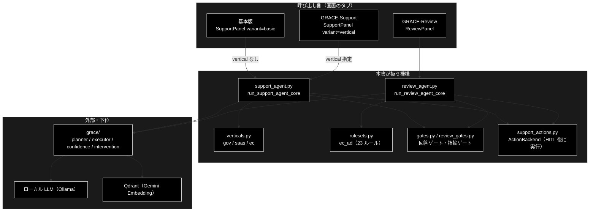

# app_tabs_overview.md - 処理 3 タブ（基本版 / GRACE-Support / GRACE-Review）の概要

**Version 1.4** | 最終更新: 2026-10-07

---

## 目次

- [概要](#概要)
  - [主な責務](#主な責務)
  - [各責務対応のモジュール](#各責務対応のモジュール)
  - [アーキテクチャ構成図](#アーキテクチャ構成図)
- [1. 3 タブをひと目で](#1-3-タブをひと目で)
- [2. 基本版 — 問い合わせ ＋ RAG](#2-基本版--問い合わせ--rag)
- [3. GRACE-Support — 問い合わせ ＋ RAG ＋ 業界プロファイル](#3-grace-support--問い合わせ--rag--業界プロファイル)
- [4. GRACE-Review — 規程 RAG ＋ 根拠検証で広告表示を点検](#4-grace-review--規程-rag--根拠検証で広告表示を点検)
- [5. 3 タブを支える grace のコアモジュール](#5-3-タブを支える-grace-のコアモジュール)
- [6. 読み違えやすい点](#6-読み違えやすい点)
- [7. 関連ドキュメント](#7-関連ドキュメント)
- [8. 変更履歴](#8-変更履歴)

---

## 概要

画面（`./run_dev.sh` → http://localhost:5173）の**処理を行う 3 タブ**を、
タブごとに「**業界特化**」「**処理フロー**」「**回答（出力）**」の 3 点でまとめる。
4 つ目の「データ管理」タブ（チャンク化 → Q/A 作成 → Qdrant 登録 → コレクション管理）は、
3 タブが検索するコレクションを用意する側なので本書では扱わない（[`backend/docs/data_pipeline.md`](../backend/docs/data_pipeline.md)）。

本書は**読み始めの入口**である。ステップ ID の対照表・基本版と Support の差（9 項目）・
モード別ガードレールの有効表の**正本は [`pipelines.md`](pipelines.md)** にあり、本書では繰り返さない。

技術スタック: LLM = **ローカル LLM（Ollama）**（既定 `gemma4:26b-a4b-it-qat`。`config.py::get_default_ollama_model()`・**API キー不要**）／
Embedding = Gemini（`gemini-embedding-001`・3072 次元）／ベクトル DB = Qdrant（grace_v2 と共用）。

> 📌 姉妹リポジトリ grace_v2（Anthropic 版）にも同名の文書がある。**タブの構成・ステップ・業界定義は同じ**で、
> 違うのは LLM（あちらは Anthropic Claude）と、画面の既定値・実行例の数値である。片方をコピーして持ち込まないこと（CLAUDE.md §5）。

### 主な責務

- 問い合わせに、全コレクションを対象とした社内ナレッジで根拠つきに回答する（基本版）
- 問い合わせに、業界プロファイルで絞った社内ナレッジと業界の方針で回答する（GRACE-Support）
- 広告文書を EC 広告表示ルールと規程 RAG で点検し、条文つきの指摘を出す（GRACE-Review）
- 回答・指摘が出典で裏付けられるかを検証し、支持率で確定・要確認・有人対応に振り分ける
- 副作用のあるアクション（起票・返信）を、人間の承認（HITL CONFIRM）を得るまで実行しない

### 各責務対応のモジュール

| # | 責務 | 対応モジュール | 説明 |
|---|------|--------------|------|
| 1 | 全コレクション対象の根拠つき回答（基本版） | `backend/app/core/support_agent.py` | `run_support_agent_core` を `vertical=None` で実行。画面は `frontend/src/components/SupportPanel.tsx`（`variant="basic"`） |
| 2 | 業界プロファイル適用の回答（GRACE-Support） | `backend/app/core/verticals.py` | `PROFILES`（`gov` / `saas` / `ec`）。コアは 1 と同じ関数（`variant="vertical"`） |
| 3 | 広告文書の点検と条文つき指摘（GRACE-Review） | `backend/app/core/review_agent.py` | `run_review_agent_core`。ルールは `backend/app/core/rulesets.py::EC_AD`（23 ルール） |
| 4 | 根拠検証と確定・要確認・有人対応の振り分け | `grace/confidence.py` | `GroundednessVerifier`（両エージェント共用）。判定は `backend/app/core/gates.py::_answer_gate` / `backend/app/core/review_gates.py::decide_finding_status` |
| 5 | アクションの HITL 承認 | `support_actions.py` | `ActionBackend`（両エージェント共用）。承認待ちは `grace/intervention.py` と画面の `ConfirmModal` |

### アーキテクチャ構成図



**データフロー**:

1. 基本版と GRACE-Support は**同じコア関数**へ入る。違いは `vertical` を渡すかどうかだけ
2. GRACE-Support はそこで業界プロファイル（検索スコープ・しきい値・方針）を、GRACE-Review はルールセットを適用する
3. コアは `grace/` の部品で Qdrant を検索し、ローカル LLM（Ollama）で回答・指摘を生成し、`GroundednessVerifier` で根拠を検証する
4. ゲートが支持率で結果を振り分け、副作用のあるアクションは HITL 承認後に `ActionBackend` が実行する

---

## 1. 3 タブをひと目で

| | 基本版 | GRACE-Support | GRACE-Review |
|---|---|---|---|
| 画面の説明文 | 問い合わせ → 回答（業界特化なし） | 問い合わせ → 回答（業界特化） | 文書 → 指摘（業界特化） |
| 入力 | 短い質問 | 短い質問 ＋ 業界（gov / saas / ec） | 広告文書（LP など）＋ ルールセット |
| 業界特化 | **なし** | **業界の How-to**（`VerticalProfile`） | **業界の法令遵守**（`RuleSet`） |
| 検索する知識 | **全コレクション** | 業界の専用コレクション | 規程・条文のコレクション |
| 出力 | 回答 1 件 ＋ 出典 | 回答 1 件 ＋ 出典 | 指摘 N 件（条文・重大度つき） |
| 確からしさの指標 | groundedness（支持率）・全体信頼度 | 同左 | 指摘ごとの支持率 → 確定 / 要確認 / 抑止 |
| コア関数 | `run_support_agent_core` | 同左（`vertical` 指定） | `run_review_agent_core` |
| ステップ数 | 9（0-(B) はスキップ） | 9 | 9 |

タブの並びは「**業界特化を足していく順**」である。基本版が素のパイプラインで、
Support は `VerticalProfile`、Review は `RuleSet` を差し替えたものにあたる。

> 📝 **ローカル LLM なので 1 回の実行に数十秒かかる**（下の実行例で 25〜52 秒）。
> 進捗はステップごとに SSE で画面へ流れるので、待っている間もどこを処理しているかが見える。

---

## 2. 基本版 — 問い合わせ ＋ RAG

**概要**: 業界プロファイルを使わない**素のパイプライン**。画面のリード文は
「業界特化なしの素のパイプライン: 内部RAG＋出典 / Web裏取り・相互検証 / アクション＋HITL 承認」。
業界由来のガードレールが効かないので、パイプライン本体の挙動を確かめる用途に向く。

### 2.1 業界特化

**なし。** 業界プロファイルを適用しないため、次のようになる。

- 検索スコープを絞らない（`allowed_collections = []` → **登録済みの全コレクション**が対象）
- しきい値はグローバル既定（`config/grace_config.yml` の `confidence.thresholds`：notify 0.7 / confirm 0.4）
- 担当範囲の判定・強制エスカレのキーワード・本人確認・業務方針の注入は**行わない**

### 2.2 処理フロー

実行順に並べる（画面の表示名は `frontend/src/state/jobReducer.ts::STEP_LABELS`）。

| 実行順 | ステップ（画面の表示名） | 何をするか |
|:--:|---|---|
| 1 | 0-(A) 入力・質問分析（複数質問の検知） | 1 つの入力に質問が複数あれば、主質問を利用者に選ばせて再構成する |
| 2 | 0-(B) 業界プロファイル適用 | **スキップ**（基本版はプロファイルなし） |
| 3 | ① Plan（planner） | 実行計画を作る（通常は rag_search → reasoning の 2 ステップ） |
| 4 | ② Execute（内部RAG → reasoning） | 全コレクションを検索し、回答を生成する |
| 5 | ③ Groundedness（根拠検証） | 回答の各主張が出典で裏付けられるかを検証し、支持率を出す |
| 6 | ④ 回答ゲート＋強制エスカレ＋救済 | 支持率・出典数で answer / 注意つき answer / escalate を決める |
| 7 | ⑤ Web フォールバック | 内部回答で確定できなかったときだけ Web を検索し、相互検証する |
| 8 | ④' 情報なし回答検知 | 「情報が見つかりません」のような実質のない回答を見分ける |
| 9 | ⑥ Action（本人確認 → HITL CONFIRM → 実行） | アクションが要る問い合わせなら承認を経て実行（本人確認は行わない） |

### 2.3 回答

画面例文「領収書は発行できますか？」の実行例（`backend/docs/領収書を発行できますか.txt`・2026-08-21・`gemma4:26b-a4b-it-qat`・所要 41 秒）:

```
answer（回答）
はい、領収書の発行は可能です。
社内ナレッジ (ec_policy.csv) によると、以下の通りです。
    マイページの注文履歴から、領収書（PDF）をダウンロードできます。
    発行時に宛名や但し書きを指定することが可能です。

出典                     社内 ec_policy.csv
groundedness（支持率）   1.00（判定可能 3 主張）
全体信頼度               0.99
```

- **groundedness（支持率）** = supported ÷（supported ＋ contradicted）。neutral（出典から判定できない主張）は分母から除く
- 回答ゲートは、支持率 ≥ notify かつ出典 1 件以上で answer、confirm 以上なら注意つきの answer、それ未満・未検証・出典 0 件なら escalate（有人対応）にする
- 基本版は全コレクションを検索するので、この質問でも EC のコレクション（`ec_policy.csv`）が当たっている

> 実行例の数値は一例である。ローカル LLM は揺れが大きく、同じ質問の 2 回目は全体信頼度 0.97・所要 25 秒だった（同ファイル）。

---

## 3. GRACE-Support — 問い合わせ ＋ RAG ＋ 業界プロファイル

**概要**: 基本版と**同じパイプライン**に、業界プロファイルを適用したもの。画面のリード文は
「内部RAG＋出典 / Web裏取り・相互検証 / アクション＋HITL 承認（業界プロファイル適用）」。

### 3.1 業界特化

**業界の How-to 情報**で答える。`backend/app/core/verticals.py::PROFILES` に 3 業界がある。

| 業界 | 検索スコープ | 強制エスカレ語（例） | 本人確認 | しきい値 | 業界の方針（プロンプトへ注入） |
|---|---|---|:--:|---|---|
| `gov` 自治体 | `gov_faq_anthropic` / `gov_laws_anthropic` | 法的・訴訟・減免・不服 | — | notify 0.8 / confirm 0.5（厳しめ） | 条例・公式案内に基づき、該当ページ・担当課を明示。Web は `go.jp` / `lg.jp` を優先 |
| `saas` SaaS | `saas_docs_anthropic` / `saas_api_anthropic` | 障害・ダウン・課金・セキュリティ | — | 既定 | 製品バージョン・再現手順・公式ドキュメント URL を添える |
| `ec` EC | `ec_policy_anthropic` / `ec_faq_anthropic` | 決済・返金・破損・クレーム | ✅ | 既定 | 注文情報の照会・変更は本人確認必須。返品・交換は規定の版に基づく |

> 📝 コレクション名の `_anthropic` は、grace_v2 と**共用している Qdrant** の命名である（Embedding は両リポジトリとも Gemini 3072 次元）。
> 本リポジトリの LLM が Anthropic という意味ではない。

このほか、各業界は**担当範囲**（`scope_description`）を持ち、範囲外の質問（天気・ニュースなど）は
回答せずに窓口を案内する。基本版との差の全項目は [`pipelines.md`](pipelines.md) §3 を参照。

### 3.2 処理フロー

ステップは基本版と同じ 9 つ。違いは **0-(B) が実行される**ことと、③〜⑥ が業界プロファイルの値で動くこと。

| 実行順 | ステップ（画面の表示名） | 業界プロファイルが効く点 |
|:--:|---|---|
| 1 | 0-(A) 入力・質問分析（複数質問の検知） | 複数の質問を検知したとき、**担当範囲外の主質問を選択肢から外し**、断りと窓口案内に回す（GA'） |
| 2 | 0-(B) 業界プロファイル適用 | 検索スコープ・しきい値・方針を適用する（例: `gov` は 0.8 / 0.5） |
| 3 | ① Plan（planner） | 実行計画を作る |
| 4 | ② Execute（内部RAG → reasoning） | 業界のコレクションだけを検索し、業界の方針つきで回答を生成する。単独の範囲外質問は、ここで方針（`SCOPE_POLICY`）に従って断る |
| 5 | ③ Groundedness（根拠検証） | 基本版と同じ検証 |
| 6 | ④ 回答ゲート＋強制エスカレ＋救済 | 業界のしきい値で判定し、強制エスカレ語があれば有人対応へ |
| 7 | ⑤ Web フォールバック | Web 検索で業界の優先ドメインに加点する（`gov` は `go.jp` / `lg.jp`） |
| 8 | ④' 情報なし回答検知 | 基本版と同じ |
| 9 | ⑥ Action（本人確認 → HITL CONFIRM → 実行） | `gov` の「申請・手続・様式」なら返信アクションを承認待ちにする。`ec` は先に本人確認 |

### 3.3 回答

例文「住民票の写しの取り方は？」（`gov`）の実行例（`backend/docs/住民票の写しの取り方は.txt`・2026-08-21・`gemma4:26b-a4b-it-qat`・所要 52 秒）:

```
answer（回答）  vertical: gov
住民票の写しの取得方法について、社内ナレッジによると以下の通りです。
社内ナレッジ(gov_faq.csv)によると、住民票の写しは以下の方法で取得できます。
    取得方法  市役所本庁舎・各区役所の窓口 / 郵送 / コンビニ交付（マイナンバーカードが必要）
    手数料    窓口・コンビニ：1通300円 / 郵送：定額小為替での支払い
    必要なもの 本人確認書類
出典: gov_faq.csv

groundedness（支持率）   1.00（判定可能 6 主張）
全体信頼度               0.99
```

基本版との見え方の違いは、**出典が業界のナレッジ（ここでは `gov_faq.csv`）に限られる**ことと、
業界の方針（担当窓口の案内など）に沿った文面になることである。

3 業界の画面例文と範囲外の質問 1 件をまとめて流した実行例（`backend/docs/GRACE-Support_例文4件.txt`・2026-10-07・
`gemma4:26b-a4b-it-qat`・Web フォールバック OFF・アクションはドライラン。画面と同じ `run_support_agent_core` を E2E から呼んだもの）:

| 業界 | 質問 | 判定 | 出典 | 支持率（判定可能な主張） | アクション | 所要 |
|---|---|---|---|---|---|---:|
| `gov` | 住民票の写しの取り方は？ | answer | `gov_faq.csv` | 1.00（6） | なし | 61 秒 |
| `saas` | サービスが落ちています | **escalate**（強制エスカレ語「落ち」） | `saas_docs.csv` | 1.00（7） | `escalate_to_human` | 61 秒 |
| `ec` | 返品したい | answer | `ec_policy.csv` | 1.00（8） | `create_ticket`（本人確認つき） | 65 秒 |
| `gov` | 明日の東京の天気を教えてください（範囲外） | **escalate**（回答なし・出典 0 件で ④ が escalate） | なし | 0.00（0） | `escalate_to_human` | 2 秒 |

- `saas` は根拠つきの回答を作れているのに escalate になる。強制エスカレ語は回答の出来より優先される（④）
- `ec` は回答できたのでチケット起票、回答できなければ有人引き継ぎになる（判定とアクションが食い違わない）
- 範囲外の質問は、Web OFF では回答を作らずに escalate になる（Web を ON にした 2026-08-21 の
  `backend/docs/明日の東京の天気は.txt` では、天気予報サイトを出典に回答していた）

---

## 4. GRACE-Review — 規程 RAG ＋ 根拠検証で広告表示を点検

**概要**: 「規程 RAG ＋ 根拠検証（groundedness）で広告表示を点検し、条文つきの指摘を出す」タブ。
入出力の向きが Support と逆で、**文書 → 指摘**である。コア関数は別だが、
Retrieve・Ground・誤検知抑止・Action は Support と同じ機構を再利用している
（新規実装は Segment / Detect / Severity の 3 つ）。

### 4.1 業界特化

**業界の法令遵守**を点検する。`backend/app/core/rulesets.py::EC_AD`（EC 広告表示）を使う。

| 項目 | 内容 |
|---|---|
| 対象法令 | 景品表示法（12）/ 医薬品医療機器等法（4）/ 特定商取引法（6）/ 社内規程（1）＝ **23 ルール** |
| 常時チェック | **7 件**（特定商取引法 6 ＋ 社内規程 1）。キーワードに関係なく必ず判定する＝**表記漏れの検出** |
| 指摘の自動確定 | 支持率 **0.85 以上**（要確認は 0.60 以上）。誤指摘のコストが高いので Support（gov 0.8）より厳しい |
| 重大リスク語 | 「No.1」「日本一」「最安」「完治」「治る」「副作用がない」「絶対」「100%」など。一致すると重大度を high に引き上げる |
| 検索スコープ | `ec_ad_rules_anthropic`（規程・条文。**grace_v2 と 1 個を共用**）/ `ec_policy_anthropic`（社内規程） |

画面のオプション（既定は `frontend/src/state/formMemory.ts`）:

| オプション | 既定 | 意味 |
|---|:--:|---|
| Web で法改正を裏取り | OFF | ⑥ を実行する。結果は信頼度を**下げる方向にだけ**使う |
| dry-run | OFF | 起票せずログのみ |
| 詳細ログ | **ON** | `-v` 相当のログを出す（各段の判断根拠をステップトレースで追えるように。grace_v2 は OFF） |

画面の例文は 3 つ：**NG 例（優良誤認・薬機法）**／**NG 例（表記漏れ・規程不一致）**／**OK 例（指摘 0 件を期待）**。

### 4.2 処理フロー

`REVIEW_STEP_IDS` の順に実行する。番号は Support との**対応を示す呼称**なので、⑥ が ⑤ より先に来る。

| 実行順 | ステップ（画面の表示名） | 何をするか |
|:--:|---|---|
| 1 | S1 ルールセット適用 | EC広告表示ルール 23 件・検索スコープ・しきい値・重大リスク語を適用する |
| 2 | ① Segment（文書を検査単位へ分割） | 文書を検査単位へ分ける（決定的・原文の位置を保持） |
| 3 | ② Retrieve（規程を RAG 検索） | セグメントごとに規程を検索する |
| 4 | ③ Detect（二段判定で違反候補を検出） | 第 1 段でルールのキーワードに当たるセグメントを絞り、第 2 段で LLM が違反かどうかを判定する（常時チェックの 7 件はキーワード不問で第 2 段へ） |
| 5 | ④ Ground（指摘の根拠を検証） | 指摘が規程で裏付けられるかを検証し、支持率を出す |
| 6 | ④' Suppress（誤検知抑止 + 救済） | 支持率の低い指摘を抑止し、矛盾の無いものは救済する |
| 7 | ⑥ Web 裏取り（法改正・ガイドライン更新） | 既定 OFF。ON なら法改正を検索し、信頼度を下げる方向にだけ使う |
| 8 | ⑤ Severity（重大度の確定＋強制 high） | 重大度（重大 / 中 / 軽微）を決め、重大リスク語があれば high に引き上げる |
| 9 | ⑦ Action（レポート → HITL CONFIRM → 実行） | 指摘があればレポートを作って起票（次節） |

② 〜 ④' は**セグメントごとに並行して流れる**（画面では 4 つのステップが同時に始まる）。

### 4.3 回答（指摘）

```
指摘 N 件   重大 n  中 n  軽微 n | 確定 n  要確認 n  抑止 n

原文（指摘箇所がハイライトされる）
指摘カード（条文・重大度・状態・根拠）
```

- 指摘カードには**条文・重大度（重大 / 中 / 軽微）・状態**が付く
- 状態は支持率で決まる：0.85 以上 = **確定**、0.60 以上 = **要確認**、それ未満 = **抑止**（誤検知として除外）。
  未検証・根拠 0 件の指摘は消さずに**要確認**にする（Support が escalate に倒すのとは逆）
- 指摘があれば ⑦ でレポートを作る。重大（high）の指摘があれば承認なしで有人対応へ引き継ぎ（`escalate_to_human`）、なければ HITL 承認のあとに起票する（`create_ticket`）
- OK 例（指摘 0 件を期待）では、⑦ は「指摘なし」でスキップされる

画面の 3 例文の実行例（`backend/docs/GRACE-Review_例文3件.txt`・2026-10-07・`gemma4:26b-a4b-it-qat`・Web 裏取り OFF。
画面と同じ `run_review_agent_core` を E2E から呼んだもの）:

| 例文 | 指摘 | 重大 / 中 / 軽微 | 確定 / 要確認 / 抑止 | 主な指摘 | 所要 |
|---|---:|---|---|---|---:|
| NG 例（優良誤認・薬機法）`化粧品LP案` | 10 | 7 / 3 / 0 | 6 / 4 / 0 | No.1 の根拠（keihyo-03）・二重価格（keihyo-04）・「シミが治る」（yakki-02）・「副作用がない」（yakki-04）・特商法の表示漏れ 5 件 | 220 秒 |
| NG 例（表記漏れ・規程不一致）`表記漏れLP案` | 4 | 1 / 3 / 0 | 4 / 0 / 0 | 送料・支払方法・引渡時期の表示漏れ（tokusho-01〜03）・返品 8 日 < 規程 14 日（policy-01） | 144 秒 |
| OK 例（指摘 0 件を期待）`適正LP案` | 0 | 0 / 0 / 0 | 0 / 0 / 1 | 候補 1 件を ④' が誤検知として抑止し、0 件 | 84 秒 |

- `化粧品LP案` の重大 7 件のうち 3 件は重大リスク語（No.1 / 治る / 副作用がない）による強制 high
- 特商法の表示漏れ（書かれていないこと自体が違反）は該当箇所が無いので、原文はハイライトされない
- 同じ条件でもう 1 回流しても（同日 11:21）、指摘は 1 字も違わず一致した（違ったのは所要時間だけ）。それ以上の揺れは `GRACE_E2E_REPEAT` で測る（`backend/docs/tests.md` §4.2）

---

## 5. 3 タブを支える grace のコアモジュール

3 タブはいずれも `grace/`（自律エージェント基盤）の部品で動く。コアモジュールは **8 つ**
（`planner` / `executor` / `confidence` / `calibration` / `memory` / `intervention` / `replan` / `tools`）。

使い方は 2 つのエージェントで大きく違う。

- **基本版・GRACE-Support** は grace の計画→実行ループ（`planner` → `executor`）をまるごと使い、
  `tools` / `replan` / `memory` / `calibration` は `executor` の内側で動く
- **GRACE-Review** は `planner` / `executor` を通らず、`tools`（検索）・`confidence`（根拠検証）・
  `intervention`（承認）・`llm_compat`（LLM 判定）を**直接**呼ぶ

**ステップごとにどのモジュール（シンボル）が効くかの表と、Support / Review の比較表の正本は
[`grace/docs/README.md`「概要」](../grace/docs/README.md#概要) にある**（本書には同じ表を置かない）。

基盤モジュールは `config.py`（設定）/ `schemas.py`（データ契約）/ `llm_compat.py`（Ollama 呼び出しの互換アダプタ。Anthropic は明示時のみの後方互換）。

grace 全体を読むときの入口は次の 4 本（索引は [`grace/docs/README.md`](../grace/docs/README.md)）。

| 文書 | 何が書いてあるか |
|---|---|
| [`grace/docs/README.md`](../grace/docs/README.md) | grace/docs の棚卸し。冒頭の「概要」に **Support / Review が使う grace モジュールの対応表と比較** |
| [`grace/docs/grace.md`](../grace/docs/grace.md) | 設計思想と 5 段階設計（Plan / Execute / Confidence / Intervention / Replan）。第 5 部に製品パイプライン（0-(A)〜⑥）との対応 |
| [`grace/docs/grace_core.md`](../grace/docs/grace_core.md) | 8 コアモジュールの構成図・IPO リンク集 |
| [`grace/docs/grace_core_flow.md`](../grace/docs/grace_core_flow.md) | 5 段階設計の最小実行サンプルと、発行される API・プロンプト全文 |

---

## 6. 読み違えやすい点

| 誤解しやすい点 | 実際 |
|---|---|
| 基本版は「RAG のコレクションを絞っている」 | 逆で、**絞らない**（全コレクションが対象）。絞るのは GRACE-Support の業界プロファイル |
| 基本版でも 0-(B) 業界プロファイル適用が走る | **スキップ**される（タイムラインには表示されるが状態はスキップ） |
| 基本版と GRACE-Support は別実装 | **同じ関数**（`run_support_agent_core`）。画面も同じ `SupportPanel` を `variant` で切り替えている |
| Review の番号順 ＝ 実行順 | 違う。⑥ Web 裏取りは ⑤ Severity より**先**に実行される（番号は Support との対応を示す呼称） |
| `tools.py` は共通モジュール | grace のコアモジュール **8 つ目**（ツール実行）として数える。共通（基盤）は `config.py` / `schemas.py` / `llm_compat.py` |
| コレクション名が `_anthropic` なので LLM も Anthropic | 違う。Qdrant を grace_v2 と共用しているための命名で、本リポジトリの LLM は Ollama |
| `grace/docs/grace_runtime.md` を読む | それは **grace_v2 側の名前**（grace_v2 は 2026-09-14 に `grace_core_flow.md` を改称した）。本リポジトリは `grace_core_flow.md` のまま |

---

## 7. 関連ドキュメント

| 文書 | 何の正本か |
|---|---|
| [`pipelines.md`](pipelines.md) | 3 モードのステップ対照表（§2）・実行順の図（§2.1）・基本版と Support の差 9 項目（§3）・モード別ガードレール（§4） |
| [`guardrails.md`](guardrails.md) | ゲート・しきい値・失敗時にどちらへ倒すか（GA〜G9） |
| [`reasoning_flow.md`](reasoning_flow.md) | Support の回答生成（reasoning）と Review の指摘生成（detect）のプロンプト構造 |
| [`../README.md`](../README.md) | 画面・操作とプログラムの対応、スクリーンショット |
| [`../backend/docs/review_flow.md`](../backend/docs/review_flow.md) | GRACE-Review の設計 |
| [`../backend/docs/data_pipeline.md`](../backend/docs/data_pipeline.md) | データ管理タブ（チャンク化 → 登録） |
| [`../grace/docs/README.md`](../grace/docs/README.md) | grace コアモジュールの棚卸しと、Support / Review の使い方の比較 |

---

## 8. 変更履歴

| バージョン | 変更内容 |
|---|---|
| 1.0 | 初版作成（2026-10-06）。処理 3 タブ（基本版 / GRACE-Support / GRACE-Review）を「業界特化・処理フロー・回答」の 3 点でまとめた。grace_v2 の同名文書（v1.1）と同じ構成で、本リポジトリの実装（Ollama・Review の詳細ログ既定 ON・`grace_core_flow.md` の名前）と実行ログ（`backend/docs/*.txt`）に合わせて書いた。ステップ対照表などの正本は `pipelines.md`、grace モジュールの対応表は `grace/docs/README.md` に置き、本書はリンクする |
| 1.1 | §4.3 に GRACE-Review の実行例（画面の 3 例文・2026-10-07 の E2E 実測）を追加し、「Review の実行ログを置いていない」の注記を外した。元ログは `backend/docs/GRACE-Review_例文3件.txt` |
| 1.2 | §4.3 の「1 回だけの実行結果」を、同条件の再実行（2026-10-07 11:21）で指摘が完全に一致した事実に置き換えた（元ログ `backend/docs/GRACE-Review_例文3件.txt` の「再実行」） |
| 1.3 | §3.3 に GRACE-Support の実行例（3 業界の画面例文＋範囲外の質問 1 件・2026-10-07 の E2E 実測）の表を追加。元ログは `backend/docs/GRACE-Support_例文4件.txt` |
| 1.4 | §3.3 の範囲外の質問の行に、元ログで欠けていたアクション（`escalate_to_human`）と escalate になった経路（④ の回答ゲート）を補った |
