# GRACE-Support ガードレール（評価・判定）設計

本書は grace_v2_local の「評価（ガードレール）」層を、実コードから起こした一覧である。
パイプライン全体の流れは `CLAUDE.md` §1、業界特化の設計は `grace/doc/agent_support_verticals.md` を参照。

対象コード（読み取り時点）:
`backend/app/core/gates.py` / `backend/app/core/support_agent.py` /
`backend/app/core/verticals.py` / `grace/confidence.py` / `grace/executor.py` /
`grace/intervention.py` / `support_actions.py` / `backend/app/core/review_gates.py`

---

## 1. ガードレール全体図

```mermaid
flowchart TB
    Q["問い合わせ query"]

    subgraph SA["0-(A) 入力・質問分析"]
        GA["GA 複数質問の二段判定 looks_like_multi_question → create_cluster_analyzer"]
        GA1{"主質問が複数か"}
        GA2["主質問の選択 HITL ＋ 再構成 ＋ 保留質問の明示"]
    end

    subgraph S0["取得段ガードレール"]
        G0["G0 RAG 採用下限 reasoning_min_rag_score = 0.64"]
    end

    subgraph S1["③ 根拠検証 Confidence"]
        G1["G1 GroundednessVerifier.verify : claim 分解と 3 値判定"]
        G1A["support_rate = supported / decided ; neutral は分母から除外"]
        G1B["M-6 判定率で減衰 _damp_support_rate"]
        G1C["矛盾 1 件以上 → answer_conf を 0.30 に cap"]
        G1D["verification_failed : 検証器の例外 タイムアウト 空応答"]
    end

    subgraph S2["④ 回答ゲート"]
        G2{"G2 _answer_gate : verified かつ 出典 1 件以上 かつ 支持率 ≥ confirm"}
        G3{"G3 _should_force_escalate : エスカレ語 かつ 意図が question 以外"}
        G4{"G4 _should_rescue_unaffirmed : 矛盾なし 出典あり 実質回答"}
    end

    subgraph S3["⑤ Web フォールバックと相互検証"]
        G5["G5 web_search → reasoning → 再検証"]
        G5A{"相互検証 SourceAgreementCalculator : 一致度が confirm 未満なら矛盾扱い"}
        G5B{"G5-救済 _should_rescue_unverified : 検証器障害のときだけ救済"}
    end

    subgraph S4["④' 情報なし回答検知"]
        G6{"G6 _detect_no_info_answer : 候補句 または 出典が Web のみ → 第 2 段 LLM 判定"}
    end

    subgraph S5["⑥ アクション"]
        G7{"G7 _decide_action : 意図が question ならアクション起票せず"}
        G8{"G8 IdentityVerifier : 本人確認 require_identity"}
        G9{"G9 InterventionHandler CONFIRM : HITL 承認 タイムアウトは有人へ"}
        EX["ActionBackend 実行 既定 dry_run"]
    end

    ANS["answer 回答を返す"]
    ESC["escalate 有人対応へ"]

    Q --> GA
    GA --> GA1
    GA1 -->|"複数"| GA2
    GA1 -->|"単一 または 判定不能"| G0
    GA2 --> G0
    G0 --> G1
    G1 --> G1A
    G1A --> G1B
    G1B --> G2
    G1 --> G1C
    G1 --> G1D
    G2 -->|"通過"| G3
    G2 -->|"不通過"| G4
    G3 -->|"エスカレ語に該当"| ESC
    G3 -->|"誤検知抑止"| G6
    G4 -->|"救済 未確認注記つき"| G6
    G4 -->|"救済せず"| G5
    G5 --> G5A
    G5A --> G5B
    G5B -->|"ゲート通過 または 障害救済"| G6
    G5B -->|"不通過"| ESC
    G6 -->|"情報なし回答"| ESC
    G6 -->|"実質回答"| ANS
    ANS --> G7
    ESC --> G7
    G7 -->|"アクションあり"| G8
    G7 -->|"アクションなし"| EX
    G8 -->|"確認済み"| G9
    G8 -->|"未確認"| ESC
    G9 -->|"承認"| EX
    G9 -->|"拒否 または タイムアウト"| ESC
classDef default fill:#000,stroke:#fff,color:#fff
classDef subgraphStyle fill:#1a1a1a,stroke:#fff,color:#fff
class Q,GA,GA1,GA2,G0,G1,G1A,G1B,G1C,G1D,G2,G3,G4,G5,G5A,G5B,G6,G7,G8,G9,EX,ANS,ESC default
style SA fill:#1a1a1a,stroke:#fff,color:#fff
style S0 fill:#1a1a1a,stroke:#fff,color:#fff
style S1 fill:#1a1a1a,stroke:#fff,color:#fff
style S2 fill:#1a1a1a,stroke:#fff,color:#fff
style S3 fill:#1a1a1a,stroke:#fff,color:#fff
style S4 fill:#1a1a1a,stroke:#fff,color:#fff
style S5 fill:#1a1a1a,stroke:#fff,color:#fff
```

---

## 2. ガードレール一覧（機構 → 実装 → 失敗時の既定）

| ID | 機構 | 実装（ファイル:行） | 概要 | 判定不能・失敗時 |
|---|---|---|---|---|
| GA | 複数質問の検知・選択（0-(A)） | `backend/app/core/gates.py` `looks_like_multi_question` / `create_cluster_analyzer` / `reconstruct_query` / `deferred_main_questions`、`support_agent.py` の `analyze` ステップ | 1 入力に複数の主質問があるとき、答える 1 つを利用者に選ばせ、採用クラスタを 1 文へ再構成する。採用しなかった主質問は `deferred_questions` で必ず提示する。第 2 段の応答が形式に従わないときは**1 回だけ厳格に再要求**し、**元の問い合わせに由来しない行は出力ごと捨てる**（`_derives_from_query`。散文が主質問になるのを防ぐ） | **単一質問とみなす**（＝現行動作を維持）。選択がタイムアウト・拒否でも原文のまま 1 周し、escalate にはしない |
| GA' | 担当範囲の判定（0-(A)） | `gates.py` `create_scope_classifier` / `split_by_scope`、`verticals.VerticalProfile.scope_description` / `out_of_scope_guidance` | 主質問ごとに業界の担当範囲内かを判定。**範囲外は選択肢に出さず**、`out_of_scope_questions` として断り＋窓口案内で返す。範囲内が 1 つだけなら選択そのものを出さない。**検索クエリからは外すが質問文は生成側へ渡し、同じ回答の中で断らせる**（1 回のやり取りで両方に対応する）。指示に従わないモデルのために `ensure_out_of_scope_notice` が回答本文へ追記して担保する（ゲートの後なので判定は動かさない）。案内先は `VerticalProfile.out_of_scope_links` の URL を literal で渡す（記憶から URL を書かせない） | **全件を範囲内とみなす**（判定不能・分類器なし・全件 OUT のいずれも）。誤って断って答えられる質問を落とすほうが害が大きく、範囲外なら生成側の `SCOPE_POLICY` が二重に守る |
| G0 | RAG 採用下限 | `config/grace_config.yml:353` `reasoning_min_rag_score` | コサイン類似度 0.64 未満の RAG 結果は reasoning にも出典にも使わない。全件除外になる場合はフィルタ不適用 | フィルタ無効（0 件化を避ける） |
| G1 | 根拠検証 | `grace/confidence.py:840` `GroundednessVerifier` / `:889` `verify()` | 回答を claim へ分解し `supported`/`contradicted`/`neutral` の 3 値判定。同一入力はキャッシュ（`_CACHE_SIZE=4`）で再検証しない | `verification_failed=True` を立てて後段の救済判断へ回す |
| G1A | 支持率算出 | `grace/confidence.py` `verify()` 内 | `support_rate = supported / (supported + contradicted)`。**neutral は分母から除外** | `decided=0` なら 0.0 ＋ `verified=False` |
| G1A' | 方針文の除外 | `grace/confidence.py` `is_unsupportable_policy_claim` | 「担当範囲外です」「窓口へお問い合わせください」等、**原理的にどの情報源でも支持されない方針文**を集計の母数から外す。除外は `neutral` と判定されたものだけで、事実として裏付けられた記述（supported）は落とさない | 主張がすべて方針文なら除外しない（検証対象 0 で「未検証」へ倒れるのを避ける） |
| G1B | 判定率による減衰（M-6） | `grace/executor.py` `_damp_support_rate` | `decided/total` が低いほど支持率を割り引く。`strength=0.3` / `target=0.8`。母数からは G1A' が方針文を除いてある（**正しく断るほど減点される**問題の解消。実測 2026-08-29: 7/9 → 0.906 だったケース） | `strength=0` で減衰なし（従来動作） |
| G1C | 矛盾による cap | `grace/executor.py:2283` | 矛盾が 1 件でもあれば `answer_conf` を 0.30 で頭打ち | — |
| G1D | 検証器障害の切り分け | `grace/confidence.py:801` `GroundednessResult` | 「肯定できなかった」と「検証器が落ちた」を `verification_failed` で区別 | — |
| G2 | 回答ゲート | `backend/app/core/gates.py:368` `_answer_gate` | `verified` かつ 出典 1 件以上 かつ 支持率が閾値以上で `answer`。`notify` 以上＝注記なし、`confirm` 以上＝未確認注記つき | 未検証・出典 0 → `escalate` |
| G3 | 強制エスカレ（二段判定） | `gates.py:340` `_should_force_escalate` | 第 1 段＝`escalate_keywords` 部分一致、第 2 段＝意図分類。`question`（FAQ 質問）なら誤検知として抑止 | 分類失敗 → 安全側で強制エスカレ |
| G4 | 未肯定回答の救済 | `gates.py:404` `_should_rescue_unaffirmed` | 矛盾なし・出典あり・実質回答なら、支持率が弱いだけでは捨てず未確認注記つきで維持 | 強制エスカレ時は救済しない |
| G5 | Web フォールバック | `support_agent.py:503` 付近 | 内部が escalate かつ強制エスカレでない場合のみ実行。executor が動的 Web 検索済みなら**再検証のみ**（重複推論を省略） | 検索 0 件 → escalate 継続 |
| G5A | 相互検証 | `grace/confidence.py:614` `SourceAgreementCalculator` | 内部回答と Web 回答の埋め込みコサイン一致度。`confirm_th` 未満で矛盾扱い | 回答再利用時はスキップ（同一回答の比較は無意味） |
| G5B | 検証器障害の救済 | `gates.py:438` `_should_rescue_unverified` | **検証器が落ちたときだけ**、矛盾なし・出典ありの回答を破棄しない | (a) 肯定できなかった場合は対象外 |
| G6 | 情報なし回答検知（二段判定） | `gates.py:290` `_detect_no_info_answer` / `:130` `NO_INFO_MARKERS` | 第 1 段＝定型句一致、第 2 段＝軽量 LLM。出典が Web のみなら候補句なしでも判定必須（`force_judge`） | 候補句あり＋判定不能 → escalate ／ 候補句なし＋判定不能 → **維持** |
| G7 | アクション判定（二段判定） | `gates.py:474` `_decide_action` | `action_map` キーワード一致 → 意図分類。`question` なら起票しない。`escalate` 時は常に `escalate_to_human` | 分類失敗 → 起票（副作用は G9 で守る） |
| G8 | 本人確認 | `support_actions.py:175` `IdentityVerifier` / `:185` `verify()` | `require_identity=True` のプロファイル（EC）で実行前に照合。未確認ならアクションせず有人へ | 未確認 → 実行せず引き継ぎ |
| G9 | HITL 承認 | `grace/intervention.py:169` `_handle_confirm` / `intervention_bridge.py:62` `resolver` | 副作用あり（`requires_confirmation=True`）のみ承認必須。`escalate_to_human` は承認不要で直接実行 | タイムアウト → 実行せず escalate |

---

## 3. モジュール一覧

### 3.1 主系統（GRACE-Support）

| モジュール | 行数 | 役割 | 主要シンボル |
|---|---|---|---|
| `backend/app/core/gates.py` | 615 | **回答ゲート判定の純ロジック群**。CLI 版と判定を一致させるため副作用を持たない | `_answer_gate` `_should_force_escalate` `_detect_no_info_answer` `_should_rescue_unaffirmed` `_should_rescue_unverified` `_decide_action` `_match_keyword` `judge_model` `judges_enabled` |
| `backend/app/core/support_agent.py` | 695 | パイプライン中核。①〜⑥＋④'＋救済を配線し `SupportEvent` を emit | `run_support_agent_core` `_perform_action` `SupportResult` `STEP_IDS` |
| `backend/app/core/verticals.py` | 140 | 業界プロファイル。閾値・エスカレ語・アクション対応・検索スコープ・スコープ方針 | `VerticalProfile` `PROFILES` `SCOPE_POLICY` `INTENT_MODEL` `JUDGE_MAX_OUTPUT_TOKENS` |
| `grace/confidence.py` | 1128 | **評価器の本体**。根拠検証・自己評価・網羅度・一致度・信頼度合成 | `GroundednessVerifier` `GroundednessResult` `ConfidenceCalculator` `LLMSelfEvaluator` `SourceAgreementCalculator` `QueryCoverageCalculator` `ConfidenceAggregator` `InterventionLevel` |
| `grace/executor.py` | 2573 | 実行と信頼度合成。`_blend_groundedness_confidence`(2225) と M-6 減衰(2303) | `_blend_groundedness_confidence` `_damp_support_rate` |
| `grace/intervention.py` | 678 | HITL。CONFIRM / ESCALATE / NOTIFY / SILENT の 4 レベルと閾値の動的調整 | `InterventionHandler` `DynamicThresholdAdjuster` `ConfirmationFlow` |
| `backend/app/core/intervention_bridge.py` | 125 | Web の承認待ちを解決（CLI の自動承認を Web に持ち込まないための境界） | `InterventionBridge` `PendingIntervention` |
| `support_actions.py` | 251 | 本人確認とアクション実行バックエンド | `IdentityVerifier` `CsvIdentityChecker` `DryRunActionBackend` `WebhookActionBackend` |
| `grace/calibration.py` | 167 | 信頼度の温度スケーリング較正（ECE 計測付き） | `Calibrator` `fit_temperature` `expected_calibration_error` |
| `grace/replan.py` | 818 | 失敗・低信頼時のリプラン戦略決定 | `ReplanManager` `ReplanOrchestrator` `ReplanTrigger` |

### 3.2 副系統（GRACE-Review — 文書レビュー用の同型ガードレール）

`review_gates.py` の docstring に「`gates.py` を『回答 → 指摘』へ読み替えた版」と明記されており、判定の骨格が対応している。

| Support（`gates.py`） | Review（`review_gates.py`） | 概要 |
|---|---|---|
| `_match_keyword` | `select_candidate_rules`（そのまま再利用） | 第 1 段のキーワード候補検出 |
| `_answer_gate` | `decide_finding_status:402` | 指摘の採否判定 |
| `_should_force_escalate` | `should_force_high:295` | 重大リスク語による強制 high |
| `_detect_no_info_answer` | `detect_vacuous_finding:371` | 実質性のない指摘の検知 |
| `_should_rescue_unaffirmed` | `should_rescue_finding:428` | 支持が弱い指摘を消さず `review_required` へ |
| `create_intent_classifier` | `create_mention_classifier:247` | 第 2 段の LLM 分類 |
| `create_no_info_judge` | `create_vacuous_judge:324` | 第 2 段の YES/NO 判定 |

関連: `backend/app/core/rulesets.py`（643 行, `RuleItem` / `RuleSet`）、`backend/app/core/review_agent.py`（1083 行）。

Review における「安全側」は **指摘を消さない（`review_required` にする）** であり、
Support の「回答せず escalate」と同じ考え方（誤って人に届けないより、人に確認してもらう方が損失が小さい）。

---

## 4. 閾値・設定値

| 設定キー | 既定 | 効果 |
|---|---|---|
| `confidence.thresholds.silent` | 0.9 | 自動進行 |
| `confidence.thresholds.notify` | 0.7 | 注記なしで `answer` |
| `confidence.thresholds.confirm` | 0.4 | 未確認注記つき `answer`。これ未満は `escalate` |
| `confidence.groundedness_weight` | 0.6 | 支持率が信頼度の主成分 |
| `confidence.self_eval_weight` | 0.25 | 自己評価（従） |
| `confidence.coverage_weight` | 0.15 | クエリ網羅度（従） |
| `confidence.search_aux_weight` | 0.2 | 検索ベース集約値（補助） |
| `confidence.groundedness_coverage_strength` | 0.3 | M-6 減衰の強さ（0 で無効） |
| `confidence.groundedness_coverage_target` | 0.8 | 判定率がこれ以上なら減衰なし |
| `executor.reasoning_min_rag_score` | 0.64 | RAG 採用下限（実測値・マージン 0.046 の暫定値） |
| `llm.timeout` | 180 | `planner.step_timeout_seconds`(240) より短いことが不変条件 |
| **`judges.enabled`** | **false** | **補助 LLM 判定を全面停止**（§5 参照） |
| **`judges.multi_question`** | **true** | 複数質問の構造解析（GA）。**`judges.enabled` とは独立**。切ると複数質問の片方が無言で落ちる |

業界プロファイル別の上書きは `gov` のみ（`notify_th=0.8` / `confirm_th=0.5` ＝厳しめ）。
`ec` は `require_identity=True`（注文情報の操作は本人確認必須）。

---

## 5. 設計原則と注意点

### 5.1 三つの原則

全ガードレールに一貫して次の 3 つが効いている。

1. **二段判定** — 第 1 段でキーワード候補を絞り（LLM 呼び出しゼロ）、一致したものだけ第 2 段の LLM 判定へ回す。
2. **安全側フォールバック** — 分類・判定の失敗（`None`）は常にキーワード判定へ倒す。Support の安全側は「回答せず escalate」。
3. **救済** — 「矛盾がある」と「肯定できなかった」を区別し、後者では回答を捨てない。

救済機構の根拠は `_should_rescue_unverified` の docstring に実測ログとして残っている
（16:07:10 に 107 文字の正しい回答が生成されたのに、16:11:43 の検証タイムアウトだけを理由に破棄され escalate した）。

### 5.2 `judges.enabled=false` の影響（重要）

ローカル LLM では 1 判定に 90〜250 秒かかるため、`judges.enabled` の既定は `false` である。
この結果、**G3・G6・G7 の第 2 段 LLM 判定は常に `None` を返し、実際にはキーワード判定のみで動いている**
（`gates.py:80` で `create_intent_classifier` が `lambda _query: None` を返す）。

§1 の図の「第 2 段」は、既定構成では点線として読むこと。
`_detect_no_info_answer` の docstring もこの前提を明記している
（「本リポジトリの既定は `judges.enabled=false` なので、判定は**常に**得られない」）。

クラウド LLM を指す構成へ切り替える場合や判定精度を優先する場合は、
`config/grace_config.yml` の `judges.enabled` を `true` に戻す。

⚠️ **GA（複数質問の構造解析）だけは例外で、既定でも動く。** 専用フラグ
`judges.multi_question`（既定 `true`）を見ているため。他の補助判定は切っても
キーワード判定という同等の代替に倒れるが、GA には代替が無く、切ると複数質問の
片方が**無言で落ちたまま高信頼として提示される**（docs/multi_question_handling.md）。

---

## 6. 対応するテスト

`backend/tests/` 配下。実 API キー・Qdrant 不要で CI ゲートに含まれる。

| テスト | 守っている挙動 |
|---|---|
| `test_support_agent_core.py` | パイプライン全体（①〜⑥）の判定 |
| `test_multi_question.py` | GA 検知・構造解析・再構成の純ロジック／`judges.multi_question` の独立性 |
| `test_multi_question_pipeline.py` | GA 組み込み（単一質問の不変・選択・保留質問・タイムアウト時に escalate しない）／GA' 範囲外は選択肢に出さず窓口案内で返す |
| `test_policy_claims.py` | G1A' 方針文を母数から外す（事実・矛盾は落とさない） |
| `test_executor_reasoning_and_memory.py` | `ask_user` を reasoning の参照情報に混ぜない／補助ステップの空振りでコレクションを罰しない |
| `test_done_event_timing.py` | 実行の開始・完了時刻を SSE 終端イベントが運ぶ |
| `test_review_gates.py` | Review 側ゲートの判定 |
| `test_verification_failure.py` | G5B 検証器障害の救済 |
| `test_web_only_needs_a_verdict.py` | G6 出典が Web のみ＋判定不能で escalate しない |
| `test_no_info_judge_failure_reason.py` | G6 判定失敗理由の記録 |
| `test_groundedness_cache.py` | G1 同一入力の再検証抑止 |
| `test_groundedness_claim_trace.py` | G1 矛盾主張の本文保持 |
| `test_groundedness_sources.py` | G1 出典本文を渡す（ラベルだけだと全 neutral 化） |
| `test_judge_model_resolution.py` | 判定系モデルの解決経路（yml を正とする） |
| `test_adoption_threshold.py` / `test_measure_rag_threshold.py` | G0 RAG 採用下限 |
| `test_intervention_bridge.py` | G9 Web の承認待ち解決 |
| `test_timeout_budget.py` | `llm.timeout < planner.step_timeout_seconds` の不変条件 |
