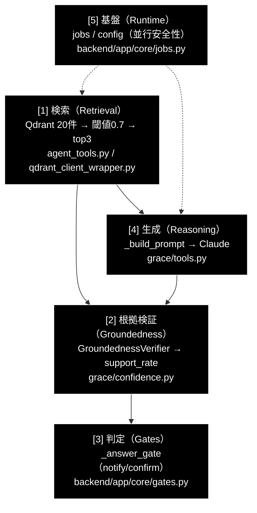

# 性能改善レバー分析 — 事業特化型エージェントの回答品質を決める部分

**Version 1.7** | 最終更新: 2026-07-27 | ステータス: **P-01 / P-01b / P-04 / P-03（案①検索順序）/ P-08 / W-2 / M-3 実装済み・他は未実装**

> 📌 本書はコード調査に基づく分析・提案。**P-01 / P-01b / P-04 / P-03（案①）は実装済み**、
> それ以外は未実装。実施順序は §5 に従うこと。特に
> **しきい値調整（P-07）を先に行ってはならない**（§5 参照）。
>
> 📊 v1.2 で**実測ログに基づき評価を見直した**（P-02 を格下げ／P-04 を格上げ／
> P-03 に検索順序リスクを追記）。理論上の懸念より実測を優先する。

`run_dev.sh` で起動する GRACE-Support（Web UI 版）および、その元となる CLI 版
`agent_support_example.py` について、**「事業特化型」自律エージェントの回答品質を決定している
コード上の箇所**を特定し、改善効果を有効スコア付きで評価した資料。

CLI 版と Web 版は `run_support_agent_core()` を共有するため（`agent_support_example.py` は
イベント→print の薄いラッパ）、**本書の指摘はすべて両方に等しく効く**。

---

## 目次

1. [概要](#概要)
2. [性能を決める5層](#1-性能を決める5層)
3. [S級: 致命的な欠陥](#2-s級-致命的な欠陥)
4. [A級: 影響大](#3-a級-影響大)
5. [B級: 中程度](#4-b級-中程度)
6. [実施順序と注意](#5-実施順序と注意)
7. [検証方法](#6-検証方法)
8. [レバー一覧（サマリ）](#7-レバー一覧サマリ)
9. [関連ドキュメント](#8-関連ドキュメント)
10. [変更履歴](#9-変更履歴)

---

## 概要

### 結論（先に要点）

**性能を決めているのは判定ロジック（ゲートのしきい値）ではなく、その前段の「検索 → 根拠検証」である。**
そして、その前段に**致命的な不整合が 2 つ**存在する。

| 順位 | 問題 | 有効スコア | 一言 |
|:--:|---|:--:|---|
| 1 | **groundedness に「ファイル名」しか渡っていない** | **10** | 支持率が構造的に 0 になり、誤エスカレの主因 |
| 2 | **RRF スコアを 0.7 のコサイン閾値で足切り** | **9** | ハイブリッド検索時に RAG が常にゼロ件になり得る |
| 3 | first-hit-wins のコレクション打ち切り | 8 | 2 つ目以降のスコープを見ずに探索終了 |

`_should_rescue_unaffirmed`（④-救済）や ⑤ Web フォールバックは、**問題 1 の対症療法**として
機能している。根本を直せば、これらの出番自体が減り、レイテンシとコストも下がる。

### 有効スコアの定義

**有効スコア** = 回答品質（自己解決率・根拠なし回答率・誤エスカレ率）への寄与度を 0〜10 で表す。
併せて **確度**（コード上の確実性）と **工数** を示す。

| 確度 | 意味 |
|:--:|---|
| ★★★ | コードを追って確認済み。実行環境に依存しない |
| ★★☆ | コード上は明白だが、発火条件がデータ/環境に依存する（§6 で検証可能） |
| ★☆☆ | 推定を含む |

---

## 1. 性能を決める5層



**レバーの大きさは [1] > [2] >> [3] > [4] の順。** しきい値（[3]）は最も手軽に触れるが、
[1][2] が壊れている状態で調整すると**誤った最適化**になる（§5 参照）。

---

## 2. S級: 致命的な欠陥

### P-01　groundedness に「ファイル名」しか渡っていない　**有効スコア 10 / 確度 ★★★ / 工数 小**

> ✅ **実装済み**（P-01 / P-01b とも完了）。
> - **P-01**（backend/CLI の ③ Confidence）: `StepResult.source_texts` を追加し、
>   `Executor._extract_source_texts()` が payload から本文を抽出、
>   `_collect_source_texts()` 経由で検証器へ渡す。
> - **P-01b**（executor 内部の `overall_confidence`）: `_calculate_overall_confidence`
>   も識別子を渡していたため（実測ログ `Groundedness neutral (0 decided of 7)`）、
>   `ExecutionState.get_completed_source_texts()` を追加し、**自己評価
>   （`evaluate_final`）と groundedness ブレンドの双方**を本文に切り替えた。
>
> いずれも本文が取れない経路は従来の出典ラベルへフォールバックする。
> 回帰テスト: `backend/tests/test_groundedness_sources.py`。
>
> **実測効果**（`--vertical gov "住民票の写しの取り方は？"`）:
> 支持率 判定不能(0/7) → **1.00（7/7 supported）** / decision **answer**。
>
> 以下は修正前の問題記述として残す。

| 項目 | 内容 |
|---|---|
| **箇所** | `grace/executor.py:1669-1681`（`_extract_sources`）→ `backend/app/core/support_agent.py:329` |
| **影響** | 支持率が構造的に 0 になり、**誤エスカレの主因**。無駄な Web 二次生成も誘発 |

`_extract_sources` は検索結果から **`payload["source"]`（＝出典ファイル名・識別子）だけ**を
抽出する。本文（`payload["question"]` / `["answer"]` / `["content"]`）は捨てられる。

```python
# grace/executor.py:1669-1681
def _extract_sources(self, tool_result: ToolResult) -> List[str]:
    """ツール結果からソースを抽出"""
    sources = []
    if isinstance(tool_result.output, list):
        for item in tool_result.output:
            if isinstance(item, dict):
                payload = item.get("payload", {})
                source = payload.get("source", "")   # ← 識別子のみ。本文は捨てられる
                if source and source not in sources:
                    sources.append(source)
    return sources
```

この `sources` が `_collect_citations` → `_citation_text`（ラベル除去）を経て、
そのまま検証器へ渡る。

```python
# backend/app/core/support_agent.py:329
gres = verifier.verify(query, internal_answer, [_citation_text(c) for c in internal_citations])
```

結果、`GroundednessVerifier` のプロンプトに入る情報源はこうなる。

```
# 情報源
gov_faq.csv
```

**これでは、いかなる主張も検証できない。** 全主張が `neutral` となり、
`support_rate = supported / (supported + contradicted)` の分母が 0 →
`decided = 0` → `_answer_gate` が **escalate** を返す。

> ⚠️ **開発側も認識している**。`support_agent.py:394-396` のコメントに、
> 「内部ゲートで escalate になる主因は **groundedness 検証が出典ラベル（URL 文字列）にしか
> 当たらないこと**」と明記されている。つまり `_should_rescue_unaffirmed`（④-救済）と
> ⑤ Web フォールバックの再検証は、**この欠陥への対症療法**として作られている。

**改善案**: `_extract_sources` を本文抽出に変える、または検証器へ検索本文を別経路で渡す。
出典表示（citations）は識別子のまま、検証用ソースは本文、と**用途を分離**するのが素直。

**期待効果**: 支持率が実測値になる → 誤エスカレ激減 → 自己解決率↑。
④-救済・⑤ Web の発火が減り、**1 ケースあたり十数秒の短縮**とコスト削減も伴う。

---

### P-02　RRF スコアを 0.7 のコサイン閾値で足切りしている　**有効スコア 9 → 3 に格下げ / 確度 ★☆☆ / 工数 小**

> ⚠️ **実測で再現せず — 予測が外れた項目**（v1.2 で格下げ）。
> `--vertical gov "住民票の写しの取り方は？"` の実行ログでは、`hybrid=有効`
> かつ `sparse=True` でも観測スコアは **0.8011（コサイン尺度）** であり、
> 足切りも `コサイン類似度フィルタ: 10 -> 1件 (Top: 0.8011, 閾値: 0.7)` と
> **正常に機能**していた。RRF スコア（〜0.03）による全件除外は起きていない。
>
> 「有効スコア 9」は**理論上の懸念に基づく過大評価**だったため 3 へ引き下げる。
> ただしコード上の型不整合（RRF スコアとコサイン閾値を同一視できる構造）は
> 残っており、Qdrant のバージョンや sparse 設定の有無で将来再燃し得るため、
> **`score_type` を明示する防御的リファクタは依然有効**（工数小）。
>
> 代わりに**この足切りで 10 件中 9 件が捨てられ、出典が 1 件だけになった**ことが
> 実害として観測された → **P-04（閾値 0.7 が高すぎる）を格上げ**（§3 参照）。
>
> 以下は当初の懸念記述として残す。

| 項目 | 内容 |
|---|---|
| **箇所** | `agent_tools.py:42, 477-484` × `qdrant_client_wrapper.py:1162-1170`（`Fusion.RRF`） |
| **影響** | （当初の想定）sparse を持つコレクションでは RAG が常にゼロ件になり得る |

ハイブリッド検索は **RRF 融合**でスコアを返す。

```python
# qdrant_client_wrapper.py:1162-1170
response = client.query_points(
    collection_name=collection_name,
    prefetch=prefetch,
    query=models.FusionQuery(fusion=models.Fusion.RRF),   # ← RRF スコア
    limit=limit,
    score_threshold=score_threshold if score_threshold > 0.0 else None,
)
```

RRF スコアは概ね `1/(60 + rank)` のオーダーで、**最大でも約 0.03**。
返却時に**正規化していない**（`"score": h.score` をそのまま格納）。

一方、`search_rag_knowledge_base_structured` は次で足切りする。

```python
# agent_tools.py:42
COSINE_SIMILARITY_THRESHOLD: float = 0.7  # Cohere Rerank廃止 → コサイン類似度で直接フィルタ

# agent_tools.py:477-484
filtered_results = [
    r for r in candidates
    if r.get("score", 0.0) >= COSINE_SIMILARITY_THRESHOLD   # ← RRF スコアには絶対に届かない
]
```

**RRF スコア（〜0.03）が 0.7 を超えることは原理的にない** → 全件除外 →
`[[NO_RAG_RESULT_LOW_SCORE]]` → 出典 0 → `_answer_gate` が escalate。

> 📝 **発火条件**: ハイブリッド検索が成立した場合（コレクションが sparse ベクトルを持ち、
> かつ sparse クエリベクトルが生成できた場合）に限る。sparse 未設定のコレクションは
> dense のみに切り替わる（`qdrant_client_wrapper.py:1137-1141`）ため、この場合スコアは
> コサイン類似度となり閾値 0.7 は意味を持つ（ただし高すぎる → P-04）。
> 実環境での発火有無は §6 の 1 コマンドで確認できる。

**改善案**: 検索方式ごとに閾値体系を分離する。
- ハイブリッド（RRF）… 閾値による足切りをやめ、**順位で上位 N 件**を採用
- dense のみ … コサイン閾値（ただし P-04 で見直し）

あるいは、`search_collection` の戻り値に `score_type`（`"rrf"` / `"cosine"`）を持たせ、
呼び出し側が適切に判断できるようにする。

---

### P-03　最初にヒットしたコレクションで探索を打ち切る　**有効スコア 8 / 確度 ★★★ / 工数 中**

> ✅ **検索順序（案①）は実装済み（v1.5）／横断ランキング（案②）は未着手**。
>
> `_apply_allowed_collections` が `candidates`（＝汎用 `search_priority` 順・既定で
> wikipedia_ja が先頭）の並びで絞り込んでいたため、**業界プロファイルが指定した
> 優先順位が無視**されていた。許可リストは「その業界で信頼できる順」に書かれた
> 意図的な並びなので、**`allowed` の順序を優先**するよう変更した。
>
> **効果（実プロファイルで検証）**:
> | vertical | 変更前の検索順 | 変更後 |
> |---|---|---|
> | gov | `wikipedia_ja_5per, gov_laws, gov_faq` | **`gov_faq, gov_laws, wikipedia_ja_5per`** |
> | saas | （同様に汎用順） | `saas_docs, saas_api` |
> | ec | （同様に汎用順） | `ec_policy, ec_faq` |
>
> gov では**正解のある `gov_faq` が最初に評価される**ようになり、無駄な
> wikipedia 検索が減る（＝レイテンシ短縮）。同一の許可キーワードに複数候補が
> 一致する場合は `candidates` 側の並び（search_priority 順）を保つ。
> 回帰テスト: `backend/tests/test_collection_selection.py`（順序 6 ケース）。
>
> **未着手（案②）**: `break` を廃して全スコープ横断でスコア統合する方式。
> 案①で「正解が最後に評価される」問題は解消したが、**先頭コレクションが一次
> ヒットを返すと後続を見ない**構造自体は残っている（`ParallelSearchEngine` の
> 再利用で対応可能）。
>
> 以下は問題の記述として残す。

| 項目 | 内容 |
|---|---|
| **箇所** | `grace/tools.py:205-210` |
| **影響** | 業界プロファイルの複数スコープが活きない |

```python
# grace/tools.py:205-210
# 結果があれば採用してループ終了
if results:
    final_results = results
    used_collection = target_collection
    logger.info(f"Found {len(results)} valid results in {target_collection}")
    break          # ← 以降のコレクションを一切見ない
```

gov プロファイルは `gov_faq_anthropic` / `gov_laws_anthropic` / `wikipedia_ja` の
3 スコープを持つ（`backend/app/core/verticals.py:60`）が、**1 つ目が弱い結果を 1 件返しただけで
探索が終了**する。2 つ目に条文の完全一致があっても届かない。

> ⚠️ **実測で判明した追加リスク: 検索順序が逆**（v1.2 追記）。
> gov 実行時の探索順は `['wikipedia_ja_5per', 'gov_laws_anthropic', 'gov_faq_anthropic']` で、
> **正解のあった `gov_faq_anthropic` が最後**だった。原因は
> `grace/config.py:167` の既定値:
> ```python
> search_priority = ["wikipedia_ja", "livedoor", "cc_news", "japanese_text"]
> ```
> vertical のコレクション（gov/saas/ec）が優先リストに**含まれていない**ため、
> 汎用の wikipedia が先に評価される。今回は wikipedia と gov_laws が閾値 0.7 を
> 超えなかったため**偶然**正解に到達したが、wikipedia に 0.7 以上の凡庸なヒットが
> 1 件あれば `break` により**権威ある gov FAQ は永久に参照されない**。
>
> → 対策は 2 つ: ①`search_priority` に vertical のコレクションを優先配置する、
> ②横断ランキングにして順序依存をなくす（本項の本来の改善）。

**改善案**: 全候補コレクションを検索してから**横断でスコア統合**する。
既存の `ParallelSearchEngine`（`docs/agent_parallel_search.md`）がそのまま使えるため、
**レイテンシを増やさずに**実現できる（むしろ並列化で短縮する可能性が高い）。

---

## 3. A級: 影響大

### P-04　`COSINE_SIMILARITY_THRESHOLD = 0.7` が高すぎる　**有効スコア 8 → 9 に格上げ / 確度 ★★★ / 工数 小**

> ⚠️ **v1.4: 回帰と修正**（実測で発覚）。二段構えの導入直後、gov で次の回帰が出た。
> ```
> 🔍 wikipedia_ja_5per → 緩和 0.5 で 3 件（著作権・インドネシア等の無関係文書）
> → `if results: break` で打ち切り
> → 正解のある gov_faq_anthropic（0.80）が一度も検索されない
> ```
> **原因**: 緩和でしか拾えなかった低関連の結果を一次ヒットと同等に扱って
> `break` していたため（P-03 の first-hit-wins との相互作用）。
> **修正**（`grace/tools.py`）: 一次閾値に届く結果を含むコレクションだけを即採用し、
> 緩和のみの結果は**フォールバックとして保留**して探索を継続する。どのコレクションも
> 一次に届かない場合のみ保留分を採用する（＝P-04 の「出典ゼロを救う」意図は維持）。
> 一次ヒットのあるコレクションでは緩和分も一緒に採用されるため、出典数を増やす効果も
> 正しいコレクション側で維持される。
> 回帰テスト: `backend/tests/test_collection_selection.py`（5 ケース）。
>
> 📌 **教訓**: P-04 は **P-03（first-hit-wins・検索順序）より先に入れるべきではなかった**。
> 閾値を緩めると低関連コレクションがヒットしやすくなり、打ち切りの害が顕在化する。
> 依存関係のあるレバーは順序を守ること。
>
> ✅ **実装済み（v1.3・二段構えで対応）**。一次閾値 0.7 は維持し、**出典が
> `MIN_RESULTS_BEFORE_RELAX`(=2) 件未満のときのみ** 緩和閾値 0.5 で再選抜する
> （`agent_tools.select_by_similarity()`）。高スコアのケースは一次で完結するため
> **既存挙動は不変**、出典不足のケースだけを救う設計。
> 緩和しても件数が増えない場合は一次の結果を返す（無意味な緩和をしない）。
>
> **効果（実測ケースの再現）**: 候補 10 件・Top 0.8011 の分布で
> **出典 1 件 → 3 件**（`RAG_SEARCH_LIMIT` 上限）。高精度ケース（0.92/0.88/0.81/0.55）
> では従来どおり 0.55 を不採用。
> 回帰テスト: `backend/tests/test_similarity_selection.py`（11 ケース）。
>
> ⚠️ **併せて修正**: 全コレクション並列検索版（`search_rag_knowledge_base`）の
> Step 4 は一次閾値で再フィルタしており、**下位モジュールの緩和を打ち消していた**。
> 緩和閾値を下限として扱うよう変更した。
>
> 📝 **判明**: `grace/config.py:161` の `score_threshold=0.35` は**実際には未使用**
> （`RAGSearchTool.execute(score_threshold=...)` も本体へ渡っていない死んだ引数）。
> 挙動を変えないため今回はコードを変更していないが、二重管理の混乱源なので
> 将来の整理対象。
>
> 以下は問題の記述として残す。**実測で確認（v1.2 で格上げ・確度 ★★☆ → ★★★）**。gov の代表質問で
> `コサイン類似度フィルタ: 10 -> 1件 (Top: 0.8011, 閾値: 0.7)` — **候補 10 件中 9 件が
> 閾値で捨てられ、出典が 1 件だけ**になった。その結果、信頼度評価器が 2 回にわたり
> 「ソース数が 1 のみで、複数情報源による検証がない」「ヒット数 1 は限定的」と減点し、
> **step2 の信頼度が 0.65 まで低下して CONFIRM が発火**した。
> P-02 の格下げ分の実害はここに現れている。

`agent_tools.py:42`。dense 経路でも 0.7 は厳しい。`gemini-embedding-001` の日本語では、
関連文書でもコサイン類似度が 0.6〜0.75 に収まることが多く、**正解を落として escalate に倒れる**。

さらに `grace/config.py:161` には `score_threshold: float = 0.35` があり、**しきい値が二重管理**で
不整合を起こしている。

**改善案**: 0.5 前後へ引き下げ、かつ **ヒット 0 件時のみ緩和する二段構え**にする。
しきい値の定義箇所を 1 つに集約する。

### P-05　リランカーが不在　**有効スコア 7 / 確度 ★★★ / 工数 中**

`agent_tools.py:478` のコメントに「**Cohere Rerank 廃止**」とあり、現在の
`search_rag_knowledge_base_structured` は**生のベクトルスコア順**で 20 件 → 3 件を選抜する。
`rerank_results()` 関数自体は `agent_tools.py:217` に残存するが、この経路からは呼ばれない。

**改善案**: cross-encoder リランクの復活（Cohere `rerank-multilingual-v3.0` またはローカルモデル）。
RAG では定番かつ効果の大きい改善。

> ⚠️ **順序が重要**: P-01 / P-02 を直してからでないと、リランクの効果を測定できない
> （検索結果が 0 件では並べ替えようがない）。

### P-06　`RAG_SEARCH_LIMIT = 3` 固定　**有効スコア 7 / 確度 ★★★ / 工数 小**

`config.py:486`。複数トピック・長文手続きでは根拠が不足する。複数質問クエリで
片方のトピックが 3 枠を占有する問題の一因でもある
（`docs/multi_question_handling.md` #11）。

**改善案**: 5〜8 へ拡大、またはクエリ複雑度に応じた可変化。

---

## 4. B級: 中程度

| # | 項目 | 箇所 | スコア | 確度 | 内容 |
|---|---|---|:--:|:--:|---|
| **P-07** | gov のしきい値が厳格 | `verticals.py:64`（`notify_th=0.8`） | 6 | ★★★ | 3 業種で最も厳しい。P-01 未修正下では escalate を増幅する。**P-01 修正後に再調整すべき**（§5） |
| ~~**P-08**~~ ✅**実装済み** | グローバル config の並行汚染 | `support_agent.py`（`copy.deepcopy(get_config())`） | 6 | ★★★ | 同時リクエストで検索スコープ・方針が相互汚染していた。リクエスト単位のディープコピーで解消（§9 v1.6） |
| **P-09** | 業界スコープの静かな失効 | `verticals.py:50-56` | 5 | ★★★ | 登録済みコレクションが 1 つも無いと**制限なしで全件横断**にフォールバック。gov 質問が wikipedia で回答され、**失敗に気づけない** |
| **P-10** | reasoning の本文 1000 字切り詰め | `grace/tools.py` `_build_prompt` | 5 | ★★★ | 長い手続き文書が途中で切れ、根拠が欠落する |
| **P-11** | Dynamic Thresholding（top≥0.98 で 1 件化） | `grace/tools.py:220-222` | 4 | ★★★ | コサインで 0.98 は稀・RRF では絶対に発火しない → 実質デッドコード。発火時は根拠を 1 件に削り逆効果 |

---

## 5. 実施順序と注意

```
第1波（効果最大・小工数）
  P-01  groundedness に本文を渡す        ← ここだけで体感が変わる
  P-02  RRF / コサインの閾値体系を分離
  ↓ KPI 再測定（自己解決率・出典付与率・根拠なし回答率・誤エスカレ率）

第2波（検索品質）
  P-03  コレクション横断ランキング
  P-04  閾値 0.7 → 0.5 の調整
  P-06  top_k 3 → 5〜8

第3波（仕上げ）
  P-05  リランカー復活
  P-07  しきい値の再チューニング     ← 必ず最後
  P-08  config 並行安全化
```

> ⚠️ **P-07（しきい値調整）を先にやってはならない。**
> 最も手軽に見えるが、P-01 が壊れた状態で `notify_th` を下げると、
> 「**根拠を検証できていないのに回答する**」方向へ倒れる。これは KPI の
> 「根拠なし回答率（0 に近いほど良い）」を直接悪化させる、最も避けるべき変更である。

### KPI との対応

| KPI（`grace/docs/agent_support_example.md` §9） | 主に効くレバー |
|---|---|
| 自己解決率（deflection） | P-01, P-02, P-03, P-04 |
| 出典付与率 | P-01, P-02 |
| **根拠なし回答率**（0 に近いほど良い） | P-01（改善）／P-07 を先行すると**悪化**する |
| エスカレーション適合率 | P-01, P-07 |
| 平均応答時間 | P-01（⑤ Web 抑制）, P-03（並列化） |

---

## 6. 検証方法

### 6.1 P-01 の確認（最短）

CLI 版が最速。`-v` で支持率の内訳を出す。

```bash
uv run python agent_support_example.py --vertical gov -v "住民票の写しの取り方は？"
```

出力の `[groundedness] supported=… / total=…` を見る。

| 観測 | 判定 |
|---|---|
| `supported=0 / total=N`（N≥1） | **P-01 が発火している**（本文が渡っていないため全主張が neutral） |
| `supported≥1` | P-01 の影響は限定的。他レバーを優先 |

### 6.2 P-02 の確認（1 コマンド）

```bash
grep -E "Hybrid Search成功|コサイン類似度フィルタ|NO_RAG_RESULT_LOW_SCORE" logs/*.log | tail -20
```

| 観測 | 判定 |
|---|---|
| 「Hybrid Search成功」の直後に `20 -> 0件` または `NO_RAG_RESULT_LOW_SCORE` | **P-02 が発火している** |
| 「Hybrid Search成功」が出ない（dense のみ） | P-02 は未発火。ただし P-04（閾値 0.7）は依然有効 |

### 6.3 P-09 の確認

```bash
curl -s http://localhost:6333/collections | python -m json.tool | grep -E "gov_|saas_|ec_"
```

gov/saas/ec のコレクションが 1 つも無ければ、検索スコープは**制限なし**にフォールバックしている。

---

## 7. レバー一覧（サマリ）

| # | レバー | 層 | 箇所 | スコア | 確度 | 工数 |
|---|---|:--:|---|:--:|:--:|:--:|
| P-01 | groundedness に本文を渡す ✅**実装済み** | [2] | `executor.py:1669-1681` / `support_agent.py:329` | **10** | ★★★ | 小 |
| P-01b | executor 内部（自己評価・ブレンド）にも本文 ✅**実装済み** | [2] | `executor.py`（`get_completed_source_texts`） | **9** | ★★★ | 小 |
| **P-04** | 二段構え閾値（0.7 → 不足時 0.5）✅**実装済み** | [1] | `agent_tools.select_by_similarity()` | **9** | ★★★ | 小 |
| **P-03** | 検索順序の是正 ✅**実装済み** ／ 横断ランキングは未着手 | [1] | `grace/tools.py`（`_apply_allowed_collections`） | **8** | ★★★ | 中 |
| P-02 | RRF / コサインの閾値体系を分離（**実測で再現せず→格下げ**） | [1] | `agent_tools.py:42,477-484` | ~~9~~ **3** | ★☆☆ | 小 |
| P-05 | リランカー復活 | [1] | `agent_tools.py:217,478` | 7 | ★★★ | 中 |
| P-06 | `RAG_SEARCH_LIMIT` 3 → 5〜8 | [1] | `config.py:486` | 7 | ★★★ | 小 |
| P-07 | しきい値の再チューニング | [3] | `verticals.py:64` | 6 | ★★★ | 小 |
| **P-08** ✅**実装済み** | config 並行安全化 | [5] | `support_agent.py`（`copy.deepcopy(get_config())`） | 6 | ★★★ | 小 |
| P-09 | 業界スコープ失効の可視化 | [1] | `verticals.py:50-56` | 5 | ★★★ | 小 |
| P-10 | reasoning の切り詰め見直し | [4] | `grace/tools.py` `_build_prompt` | 5 | ★★★ | 小 |
| P-11 | Dynamic Thresholding の削除/修正 | [1] | `grace/tools.py:220-222` | 4 | ★★★ | 小 |

---

## 8. 関連ドキュメント

| ドキュメント | 内容 |
|---|---|
| `grace/docs/agent_support_example.md` | CLI 版 GRACE-Support の設計書（KPI・回答ポリシー） |
| `grace/docs/agent_support_example_flow.md` | 1 コマンドの実行トレース（S0〜S9） |
| `backend/docs/README.md` | backend アーキテクチャ・パイプライン ①〜⑥ |
| `backend/docs/core_gates.md` | `_answer_gate` 等の判定純関数（P-07 の対象） |
| `backend/docs/core_jobs.md` | ジョブ管理・スレッド実行（P-08 の対象） |
| `docs/reasoning_flow.md` | reasoning の 4 層構成（P-10 の対象） |
| `docs/agent_parallel_search.md` | 並列検索基盤（P-03 で再利用可能） |
| `docs/multi_question_handling.md` | 複数質問対応（P-06 / P-08 と関連） |

---

## 9. 変更履歴

| バージョン | 変更内容 |
|-----------|---------|
| 1.7 | **W-2 と M-3 を実装**。①**W-2（担当範囲の明示）**: 検索スコープ（`VerticalProfile.collections`）が効くのは内部 RAG だけで、⑤ Web フォールバックと executor の動的 web_search にはドメイン制限が無い（`WebSearchConfig` に allowed_domains 相当が無く、`WebSearchTool.execute` も query/num_results/language しか受け取らない）。実測で gov に天気サイトが引用として載ったため、取得側ではなく生成側で担保する方針を採り、全プロファイル共通の `verticals.SCOPE_POLICY` を `VerticalProfile.build_prompt_addendum()` で合成して reasoning へ注入する。複合質問で範囲内の質問まで断られないよう「同時に含まれる場合はそちらには回答する」を明文化。②**M-3（適合性チェックの軽量化）**: `Executor._evaluate_rag_relevance` は YES/NO の 2 値しか返さないのに主モデルを使っており、実測で数秒かかったうえ十分だった RAG 経路を捨てて Web 検索へ落とす原因になっていた。`executor.relevance_check_model`（既定 =`llm.light_model`）を新設し、A/B と巻き戻しを設定で行えるようにした。回帰テスト `backend/tests/test_scope_and_models.py` を 20 ケース追加。**解決ロジック単体のテストだけでは呼び出し箇所の巻き戻しを検出できなかった**ため、LLM へ渡る model を捕まえるテストを追加している |
| 1.6 | **P-08 を実装**。`get_config()` はプロセス共有シングルトンを返すが `run_support_agent_core` が `config.qdrant.allowed_collections` / `config.llm.prompt_addendum` を直接書き換えており、`jobs.py` がジョブごとにスレッドを立てるため**同時リクエストで検索スコープが相互汚染**していた（gov の質問が ec のコレクションで走りうる）。`copy.deepcopy(get_config())` によるリクエスト単位のコピーへ変更（`model_copy` ではなく `deepcopy` を選択したのは、テストのスタブが pydantic ではないため）。回帰テスト `backend/tests/test_config_isolation.py` を 4 ケース追加し、同一 config オブジェクトを共有させた2 スレッドを Barrier で同期させる実測再現で、修正前コードでは 2 件が失敗することを確認 |
| 1.0 | 初版作成。性能を決める 5 層を整理し、S 級 3 件（groundedness へのファイル名のみ供給／RRF × コサイン閾値の不整合／first-hit-wins 打ち切り）・A 級 3 件・B 級 5 件を有効スコア・確度・工数付きで列挙。実施順序（しきい値調整を最後にする理由）と検証方法を明記。**分析段階／未実装** |
| 1.1 | **P-01 を実装**（`StepResult.source_texts` 追加 / `Executor._extract_source_texts()` / `_collect_source_texts()` / ③ Confidence の検証ソース差し替え・フォールバック付き）。回帰テスト `backend/tests/test_groundedness_sources.py` を追加し、P-01 の項と §7 サマリに実装済みを明記。他レバー（P-02 以降）は未実装 |
| 1.5 | **P-03 案①（検索順序）を実装**。`_apply_allowed_collections` が汎用 `search_priority` 順で絞り込んでいたため業界プロファイルの優先順位が無視されていた問題を修正し、`allowed` の並びを優先するよう変更。gov で `[wikipedia, gov_laws, gov_faq]` → `[gov_faq, gov_laws, wikipedia]` となり、正解のあるコレクションが最初に評価される。3 業種の実プロファイルで検証。順序の回帰テスト 6 ケース追加（修正前のコードでは 1 件が失敗することを確認）。案②（横断ランキング）は未着手 |
| 1.4 | **P-04 の回帰を修正**。二段構え導入直後、緩和でしか拾えなかった wikipedia の低関連結果が `break` で正解の gov_faq を握り潰す回帰が実測で発覚（P-03 の first-hit-wins との相互作用）。一次閾値に届くコレクションのみ即採用し、緩和のみの結果はフォールバックとして保留するよう `grace/tools.py` を修正。回帰テスト 5 ケース追加。**教訓: P-04 は P-03 より先に入れるべきではなかった**（依存関係のあるレバーは順序を守る） |
| 1.3 | **P-04 を二段構えで実装**。一次閾値 0.7 を維持し、出典が 2 件未満のときのみ緩和閾値 0.5 で再選抜する `select_by_similarity()`（純関数）を追加。高スコアのケースは挙動不変、出典不足のケースのみ救う。実測ケース再現で出典 1 件 → 3 件。並列検索版（`search_rag_knowledge_base`）の Step 4 が下位モジュールの緩和を打ち消していた不整合も修正。`grace/config.py:161` の `score_threshold=0.35` が未使用（死んだ設定）であることを記録。回帰テスト 11 ケース追加 |
| 1.2 | **実測ログに基づく評価の見直し＋P-01b を実装**。①**P-01b**: executor 内部（`_calculate_overall_confidence`）も識別子を渡しており `Groundedness neutral (0 decided of 7)` となっていたため、`ExecutionState.get_completed_source_texts()` を追加し自己評価・groundedness ブレンドの双方を本文へ切替。②**P-02 を格下げ**（9 → 3・★★☆ → ★☆☆）: 実測でスコアは 0.8011（コサイン尺度）でフィルタも正常動作し、**予測が外れた**ことを明記。③**P-04 を格上げ**（8 → 9・★★★）: 閾値 0.7 が候補 10 件中 9 件を捨て、出典 1 件・step 信頼度 0.65・CONFIRM 発火という実害を確認。④**P-03 に検索順序リスクを追記**: `search_priority` の既定に vertical のコレクションが無く、権威ある gov FAQ が最後に評価される |
