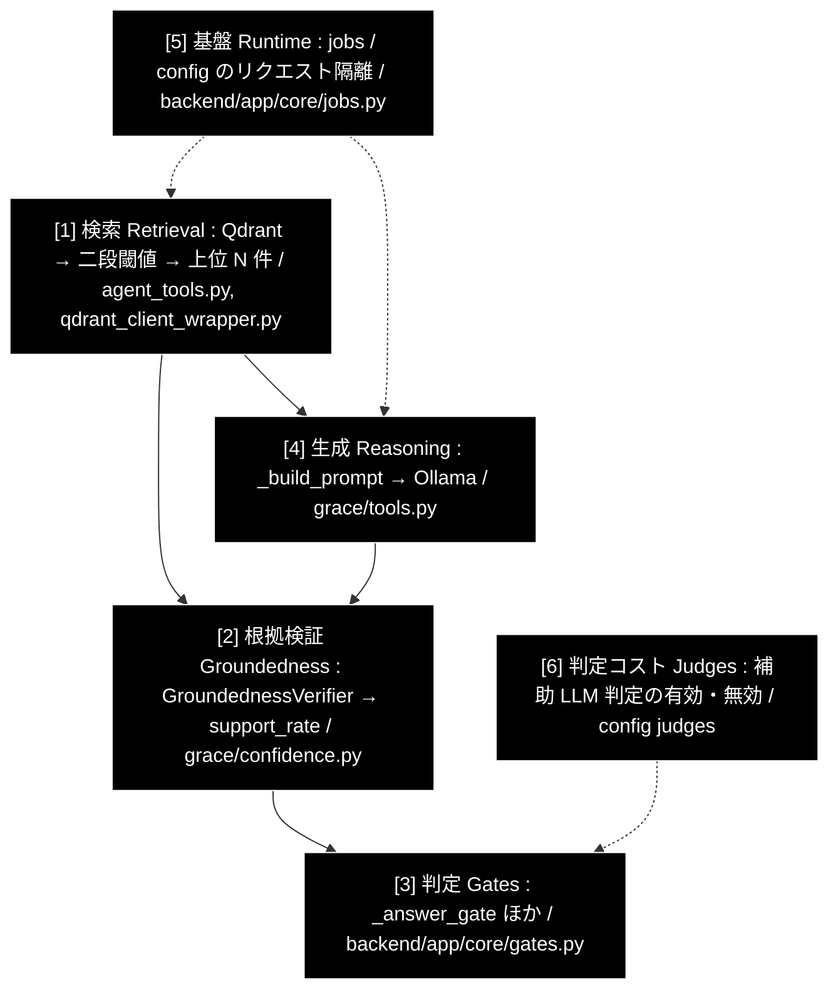

# 性能改善レバー — 回答品質とレイテンシを決めている箇所

**Version 2.0** | 最終更新: 2026-09-02

本書は「**性能（回答品質・レイテンシ）を決めているコード上の箇所**」を、実コードから
起こして評価した資料である。モードごとの全体像は `docs/pipelines.md`、判定の詳細は
`docs/guardrails.md`、生成の詳細は `docs/reasoning_flow.md` を参照。

技術スタック: LLM = ローカル LLM（Ollama・既定 `gemma4:12b-mlx`）／
Embedding = Gemini（`gemini-embedding-001`）。

> ⚠️ **行番号は書かない。** 実装への参照はすべて「ファイル名 + シンボル名」で示す。
> v1.7 は行番号で書かれていたが、2026-09-02 の突き合わせで**すべて別のコードを
> 指していた**（`executor.py:1669-1681` としていた `_extract_sources` は 2000 行台、
> `config.py:486` の `RAG_SEARCH_LIMIT` は 550 行台）。

> ⚠️ **v1.7 は「P-06 未実装」と書いていたが、実際には実装済みだった**
> （`AgentConfig.RAG_SEARCH_LIMIT = 5`）。v2.0 で全レバーを実コードに当てて再確認した。

---

## 目次

1. [性能を決める層](#1-性能を決める層)
2. [レバーの現況一覧](#2-レバーの現況一覧)
3. [実装済みレバーの要点](#3-実装済みレバーの要点)
4. [未実装で残るレバー](#4-未実装で残るレバー)
5. [ローカル LLM 特有のレイテンシ・レバー](#5-ローカル-llm-特有のレイテンシレバー)
6. [GRACE-Review 側のレバー](#6-grace-review-側のレバー)
7. [実施順序と注意](#7-実施順序と注意)
8. [検証方法](#8-検証方法)
9. [関連ドキュメント](#9-関連ドキュメント)
10. [変更履歴](#10-変更履歴)

---

## 1. 性能を決める層



**回答品質へのレバーの大きさは [1] > [2] >> [3] > [4] の順。**
しきい値（[3]）は最も手軽に触れるが、[1][2] が壊れている状態で調整すると
**誤った最適化**になる（§7）。

**レイテンシへのレバーは [6] が支配的**（ローカル LLM では 1 判定に 90〜250 秒）。
v1.7 の時点では層として立てていなかったが、Ollama へ移行してから最大の要因になった。

### 有効スコアの定義

**有効スコア** = 回答品質（自己解決率・根拠なし回答率・誤エスカレ率）への寄与度を 0〜10。
併せて **確度**（コード上の確実性）を示す。

| 確度 | 意味 |
|:--:|---|
| ★★★ | コードを追って確認済み。実行環境に依存しない |
| ★★☆ | コード上は明白だが、発火条件がデータ／環境に依存する |
| ★☆☆ | 推定を含む |

---

## 2. レバーの現況一覧

2026-09-02 に全項目を実コードへ当てて確認した。

| # | レバー | 層 | 実装 | 状態 | スコア |
|---|---|:--:|---|:--:|:--:|
| P-01 | groundedness に本文を渡す | [2] | `executor.py` `_extract_source_texts` / `_collect_source_texts` | ✅ 実装済み | 10 |
| P-01b | executor 内部（自己評価・ブレンド）にも本文 | [2] | `ExecutionState.get_completed_source_texts` | ✅ 実装済み | 9 |
| P-04 | 二段構え閾値（0.7 → 不足時 0.5） | [1] | `agent_tools.select_by_similarity` | ✅ 実装済み | 9 |
| P-03 | 検索順序の是正（許可リスト順を優先） | [1] | `grace/tools.py` `_apply_allowed_collections` | ✅ 実装済み | 8 |
| P-03b | コレクション横断ランキング（`break` の廃止） | [1] | — | ❌ **未実装** | 6 |
| P-06 | `RAG_SEARCH_LIMIT` 3 → 5 | [1] | `config.AgentConfig.RAG_SEARCH_LIMIT` | ✅ **実装済み**（v1.7 の記載は誤り） | 7 |
| P-08 | config のリクエスト隔離 | [5] | `support_agent.py` / `review_agent.py` の `copy.deepcopy(get_config())` | ✅ 実装済み | 6 |
| W-2 | 担当範囲の明示（生成側で担保） | [4] | `verticals.SCOPE_POLICY` → `build_prompt_addendum` | ✅ 実装済み | 7 |
| W-2b | 範囲外の断りを構成ルールの**後ろ**へ | [4] | `llm.prompt_closing` / `build_closing_instruction` | ✅ 実装済み | 7 |
| M-3 | 適合性チェックの軽量化 | [1] | `executor.relevance_check_model` | ✅ 実装済み | 5 |
| M-4 | groundedness の結果キャッシュ | [2] | `GroundednessVerifier._cache`（`_CACHE_SIZE = 4`） | ✅ 実装済み | 4 |
| M-5 | 0-(A) の解析を 1 回の LLM 呼び出しへ統合 | [6] | `gates.create_question_analyzer`（`IN:` / `OUT:`） | ✅ 実装済み | 4 |
| M-6 | クエリベクトルの再利用（N コレクション） | [1] | `grace/tools.py` の RAG 検索 | ✅ 実装済み | 3 |
| **J-1** | **補助 LLM 判定の停止**（`judges.enabled`） | [6] | `config/grace_config.yml` `judges` | ✅ **既定 false** | — （§5） |
| P-02 | RRF / コサインの閾値体系を分離 | [1] | — | ❌ 未実装（実測で再現せず） | 3 |
| P-05 | リランカー復活 | [1] | `agent_tools.rerank_results`（**呼び出し元なし**） | ❌ 未実装 | 7 |
| P-07 | しきい値の再チューニング | [3] | `verticals.py` gov の `notify_th=0.8` | ❌ 未実装（**最後にやる**） | 6 |
| P-09 | 業界スコープ失効の可視化 | [1] | `support_agent.py`（ログのみ） | △ 部分的 | 5 |
| P-10 | reasoning の本文 1000 字切り詰め | [4] | `grace/tools.py` `_build_prompt` | ❌ 未実装 | 5 |
| P-11 | Dynamic Thresholding（top≥0.98 で 1 件化） | [1] | `grace/tools.py` | ❌ 未実装（実質デッドコード） | 4 |

---

## 3. 実装済みレバーの要点

### P-01 / P-01b — groundedness に本文を渡す（スコア 10 / 9）

**問題だったこと**: `_extract_sources` は `payload["source"]`（＝出典ファイル名）だけを
抽出し、本文（`question` / `answer` / `content`）を捨てていた。検証器のプロンプトに入る
情報源が `gov_faq.csv` の 1 行だけになり、**いかなる主張も検証できない**。
全主張が `neutral` → `decided = 0` → `_answer_gate` が escalate。

**対処**: `StepResult.source_texts` を追加し、`Executor._extract_source_texts` が
payload から本文を抽出。executor 内部の `_calculate_overall_confidence` も
`ExecutionState.get_completed_source_texts()` で本文へ切り替えた（P-01b）。
本文が取れない経路は従来の出典ラベルへフォールバックする。

**実測効果**: 支持率 判定不能(0/7) → **1.00（7/7 supported）** / decision **answer**。
回帰テスト `backend/tests/test_groundedness_sources.py`。

> 📌 `_should_rescue_unaffirmed`（④-救済）と ⑤ Web フォールバックは、**この欠陥への
> 対症療法**として作られていた。根本が直ったので、これらの出番は減っている。

### P-04 — 二段構え閾値（スコア 9）

一次閾値 `COSINE_SIMILARITY_THRESHOLD = 0.7` を維持し、出典が
`MIN_RESULTS_BEFORE_RELAX`(=2) 件未満のときだけ `COSINE_SIMILARITY_THRESHOLD_RELAXED = 0.5`
で再選抜する（`agent_tools.select_by_similarity`）。高スコアのケースは一次で完結するため
**既存挙動は不変**、出典不足のケースだけを救う。

> ⚠️ **P-04 を P-03 より先に入れて回帰した。** 閾値を緩めると低関連コレクションが
> ヒットしやすくなり、`break` の害（P-03）が顕在化する。修正として、一次閾値に届く
> 結果を含むコレクションだけを即採用し、**緩和のみの結果はフォールバックとして保留**
> して探索を継続するようにした。
> **教訓: 依存関係のあるレバーは順序を守る。**

### P-03 — 検索順序の是正（スコア 8）

`_apply_allowed_collections` が汎用 `search_priority` 順（既定で `wikipedia_ja` が先頭）で
絞り込んでいたため、業界プロファイルの優先順位が無視されていた。許可リストは
「その業界で信頼できる順」に書かれた意図的な並びなので、**`allowed` の順序を優先**する。

| vertical | 変更前 | 変更後 |
|---|---|---|
| gov | `wikipedia_ja_5per, gov_laws, gov_faq` | **`gov_faq, gov_laws, wikipedia_ja_5per`** |
| saas | （汎用順） | `saas_docs, saas_api` |
| ec | （汎用順） | `ec_policy, ec_faq` |

回帰テスト `backend/tests/test_collection_selection.py`。

**P-03b（未実装）**: `break` を廃して全スコープ横断でスコア統合する方式。
案①で「正解が最後に評価される」問題は解消したが、**先頭コレクションが一次ヒットを
返すと後続を見ない**構造自体は残っている。`ParallelSearchEngine`
（`docs/agent_parallel_search.md`）を再利用すればレイテンシを増やさずに実現できる。

### P-06 — `RAG_SEARCH_LIMIT` 3 → 5（スコア 7）✅

**v1.7 は「未実装」と書いていたが、実際には `config.AgentConfig.RAG_SEARCH_LIMIT = 5`
になっていた**（両リポジトリとも）。複数トピック・長文手続きで根拠が不足する問題は
緩和されている。

> 📝 さらに増やす余地はある（`executor.reasoning_max_sources = 20` が上限側）。
> ただしローカル LLM では入力長がそのままレイテンシに効くため、単純な拡大は
> 推奨しない。

### P-08 — config のリクエスト隔離（スコア 6）

`get_config()` はプロセス共有シングルトンを返すが、`run_support_agent_core` は
`config.qdrant.allowed_collections` / `config.llm.prompt_addendum` を直接書き換える。
`jobs.py` がジョブごとにスレッドを立てるため、**同時リクエストで検索スコープが
相互汚染**していた（gov の質問が ec のコレクションで走りうる）。

`copy.deepcopy(get_config())` によるリクエスト単位のコピーで解消（Review 側も同様）。
回帰テスト `backend/tests/test_config_isolation.py`（Barrier で 2 スレッドを同期させ、
修正前コードで 2 件が失敗することを確認済み）。

### W-2 / W-2b — 担当範囲を生成側で担保（スコア 7）

検索スコープ（`VerticalProfile.collections`）が効くのは**内部 RAG だけ**で、
⑤ Web フォールバックと executor の動的 `web_search` にはドメイン制限が無い
（`WebSearchTool.execute` は query / num_results / language しか受け取らない）。
実測で gov に天気サイトが引用として載ったため、**取得側ではなく生成側で担保**する
方針を採った。

- **W-2**: `verticals.SCOPE_POLICY` を `build_prompt_addendum()` で合成して reasoning へ注入
- **W-2b**: 範囲外の断りは `llm.prompt_closing` として**【回答の構成ルール（最重要）】より
  後ろ**へ置く。業務方針（前方）に混ぜていたときは構成ルールに負けて断りが落ちた
  （実測 2 回連続）。詳細は `docs/reasoning_flow.md` §2

---

## 4. 未実装で残るレバー

### P-05 — リランカーが不在（スコア 7 / 確度 ★★★）

`rerank_results` は `agent_tools.py` に**関数として残っているが、呼び出し元が
モジュール docstring だけ**（実行経路からは呼ばれない）。現在は生のベクトルスコア順で
候補 → 上位 N 件を選抜している。

**改善案**: cross-encoder リランクの復活。RAG では定番かつ効果が大きい。
⚠️ ただしローカル LLM 環境ではリランクもコストになる。**軽量なローカル
cross-encoder を使うか、Embedding だけ Gemini のままリランクは外部 API にする**か、
方式の選択が先。

### P-10 — reasoning の本文 1000 字切り詰め（スコア 5 / 確度 ★★★）

`_build_prompt` が参照情報の `content` を 1000 文字で打ち切る。長い手続き文書が
途中で切れ、根拠が欠落する。

**改善案**: 切り詰め前に要約する、または `reasoning_max_sources` とのバランスで
「件数を減らして 1 件あたりを長く」する。

### P-11 — Dynamic Thresholding（スコア 4 / 確度 ★★★）

`grace/tools.py` に「Top 1 が 0.98 以上なら他を切り捨てる」処理が残っている。
コサインで 0.98 は稀で、**実質デッドコード**。発火した場合は根拠を 1 件に削るため
逆効果（P-04 と方向が逆）。削除が妥当。

### P-09 — 業界スコープの静かな失効（スコア 5 / 確度 ★★★ / △ 部分的）

登録済みコレクションが 1 つも無いと**制限なしで全件横断**にフォールバックする。
gov の質問が wikipedia で回答され、**失敗に気づけない**。

現状は 0-(B) のログに「未登録コレクションは自動的に無視」と出るだけ。
**改善案**: 許可コレクションが 0 件になったら警告を出す、または escalate に倒す。

### P-02 — RRF / コサインの閾値体系（スコア 3 / 確度 ★☆☆）

**実測で再現しなかった項目**（v1.2 で 9 → 3 へ格下げ）。ハイブリッド検索でも観測
スコアは 0.80 台（コサイン尺度）で、足切りは正常に機能していた。ただしコード上の
型不整合（RRF スコアとコサイン閾値を同一視できる構造）は残っており、Qdrant の
バージョンや sparse 設定で将来再燃し得る。`score_type` を明示する防御的
リファクタは依然有効。

### P-07 — しきい値の再チューニング（スコア 6 / **最後にやる**）

`verticals.py` の gov は `notify_th=0.8` / `confirm_th=0.5` と 3 業種で最も厳しい。
P-01 が直った今なら再調整の余地があるが、**§7 の順序を守ること**。

---

## 5. ローカル LLM 特有のレイテンシ・レバー

Anthropic から Ollama へ移行してから、**回答品質より先にレイテンシが問題になる**
場面が増えた。ここは v1.7 に無かった観点である。

### J-1 — 補助 LLM 判定の停止（`judges`）

```yaml
judges:
  enabled: false            # G3 / G6 / G7 の第 2 段 LLM 判定を全面停止
  step_confidence_llm: false  # ステップごとの信頼度 LLM 評価を停止
  multi_question: true      # 0-(A) の構造解析だけは有効（代替が無いため）
```

ローカル LLM では 1 判定に 90〜250 秒かかるため、**既定で `enabled: false`**。
この結果、G3・G6・G7 の第 2 段は常に `None` を返し、キーワード判定のみで動く。

> ⚠️ **これは品質とレイテンシのトレードオフである。** 精度を優先するなら `true` に
> 戻すが、1 問あたり数分単位で伸びる。判定の安全側フォールバックについては
> `docs/guardrails.md` §5.2 を参照。

> ⚠️ **`multi_question` だけは既定でも `true`。** 他の補助判定には「キーワード判定」
> という同等の代替があるが、0-(A) の構造解析には代替が無く、切ると複数質問の片方が
> **無言で落ちたまま高信頼として提示される**。

### M-3 — 適合性チェックの軽量化

`Executor._evaluate_rag_relevance` は YES/NO の 2 値しか返さないのに主モデルを使って
おり、実測で数秒かかったうえ、十分だった RAG 経路を捨てて Web 検索へ落とす原因に
なっていた。`executor.relevance_check_model`（既定 = `llm.light_model`）を新設し、
A/B と巻き戻しを設定で行えるようにした。

> 📌 **解決ロジック単体のテストだけでは、呼び出し箇所の巻き戻しを検出できない。**
> LLM へ渡る model を捕まえるテストを `backend/tests/test_scope_and_models.py` に置いた。

### M-4 — groundedness の結果キャッシュ

`GroundednessVerifier` が `(query, answer, tuple(sources))` をキーに直近
`_CACHE_SIZE = 4` 件を記憶する。⑤ Web フォールバックの再検証などで同一入力が
再び来たとき、LLM 呼び出しを省く。**失敗（検証器の例外・空応答）はキャッシュしない。**

あわせて `support_agent` が `executor.groundedness_verifier` を**再利用**する
（以前は検証器を 2 つ作っており、キャッシュが効かなかった）。

### M-5 — 0-(A) の解析を 1 回の LLM 呼び出しへ統合

クラスタ分解（GA）と担当範囲の判定（GA'）を 1 回にまとめた
（`create_question_analyzer` が `IN:` / `OUT:` 接頭辞つきで返す）。

> 📊 **効果は約 2.2 秒 / 69 秒（3%）。** 当初「18.9 秒の短縮」と見積もったが、
> **16.3 秒はモデルのウォームアップ**で、統合しても消えない。実測で訂正した。

### M-6 — クエリベクトルの再利用

複数コレクションを検索するとき、クエリの Embedding を 1 回だけ計算して使い回す
（ログ: `クエリベクトルを 1 回だけ計算し N コレクションで再利用します`）。
Embedding は Gemini API 呼び出しなので、コレクション数に比例した往復が消える。

### タイムアウトの不変条件

```
llm.timeout (180) < planner.step_timeout_seconds (240)
```

逆転すると、ステップのタイムアウトより先に LLM が返らず、**リトライもできずに
ステップごと失敗**する。回帰テスト `backend/tests/test_timeout_budget.py` が固定している。

---

## 6. GRACE-Review 側のレバー

v1.7 は Support 専用だったが、Review にも独自の性能特性がある。

### 組合せ爆発ガード

```python
MAX_SEGMENTS = 200       # 文書の分割上限
MAX_LLM_CALLS = 300      # detect の呼び出し上限
MAX_SEGMENT_CHARS = 400  # これを超える段落は文末で再分割
```

**detect はセグメント × 候補ルールごとに 1 回呼ばれる。** 200 セグメント × 21 ルールを
無条件に第 2 段へ流すと 4,200 回になる。第 1 段のキーワードフィルタで実際はこの
1〜2 割だが、上限は必ず置く。

> ⚠️ **ローカル LLM では detect の回数がそのまま実行時間になる。** 実測
> 2026-08-31 の NG 例（100 文字・4 セグメント）で判定 16 回 = 3 分 16 秒。
> 文書を長くするとほぼ線形に伸びる。

### モデル解決の落とし穴（性能ではなく可用性）

`detect_model(config)` は **yml を正**として解決する。`ModelConfig.DEFAULT_MODEL`
（yml を見ないモジュール定数）を直接使うと、クライアント本体と食い違って
**detect だけが存在しないモデル名で呼ばれて 404** になる。実測 2026-08-31 では
33 回の detect が全滅した。詳細は `docs/guardrails.md` §3.2。

---

## 7. 実施順序と注意

残っているレバーの推奨順序。

```
第1波（検索品質・依存の少ないもの）
  P-11  Dynamic Thresholding の削除     ← デッドコードの除去。副作用が小さい
  P-09  スコープ失効の可視化            ← 失敗に気づけるようにする
  ↓ KPI 再測定

第2波（検索品質の本丸）
  P-03b コレクション横断ランキング       ← break の廃止。P-05 の前提
  P-10  切り詰めの見直し
  ↓ KPI 再測定

第3波（仕上げ）
  P-05  リランカー復活                  ← 方式選定が先（ローカル環境のコスト）
  P-02  score_type の明示（防御的）
  P-07  しきい値の再チューニング         ← 必ず最後
```

> ⚠️ **P-07（しきい値調整）を先にやってはならない。**
> 最も手軽に見えるが、検索・検証が整っていない状態で `notify_th` を下げると、
> 「**根拠を検証できていないのに回答する**」方向へ倒れる。これは KPI の
> 「根拠なし回答率（0 に近いほど良い）」を直接悪化させる、最も避けるべき変更である。

> ⚠️ **P-05（リランカー）は P-03b の後。** 先頭コレクションで打ち切っている状態では、
> 並べ替える候補がそもそも揃っていない。

### KPI との対応

| KPI | 主に効くレバー |
|---|---|
| 自己解決率（deflection） | P-01 ✅, P-03 ✅, P-03b, P-04 ✅ |
| 出典付与率 | P-01 ✅, P-04 ✅, P-06 ✅ |
| **根拠なし回答率**（0 に近いほど良い） | P-01 ✅（改善）／P-07 を先行すると**悪化** |
| エスカレーション適合率 | P-01 ✅, P-07 |
| 平均応答時間 | J-1, M-3 ✅, M-4 ✅, M-5 ✅, M-6 ✅, P-03b（並列化） |

---

## 8. 検証方法

### 8.1 支持率が出ているか（P-01）

```bash
uv run python agent_support_example.py --vertical gov -v "住民票の写しの取り方は？"
```

出力の `[groundedness] supported=… / total=…` を見る。

| 観測 | 判定 |
|---|---|
| `supported=0 / total=N`（N≥1） | 本文が渡っていない（P-01 の回帰） |
| `supported≥1` | 正常 |

### 8.2 検索の足切り状況（P-04 / P-06）

コンソールの次の行を見る。

```
コサイン類似度フィルタ: 一次閾値 0.7 では出典不足のため 緩和閾値 0.5 で再選抜 → 5件
コサイン類似度フィルタ: 10 -> 5件 (Top: 0.8011, 閾値: 0.5)
```

| 観測 | 判定 |
|---|---|
| 緩和が毎回発火する | 一次閾値 0.7 が実データに対して高い → P-07 の再調整候補 |
| `-> 1件` で終わる | 出典が足りない → 信頼度評価器が「ソース数 1」で減点する |

### 8.3 コレクションの探索順（P-03 / P-03b）

```
RAGSearchTool: allowed_collections で検索範囲を限定: ['gov_faq_anthropic', 'gov_laws_anthropic']
緩和閾値のみの結果（Top: 0.6781）のため保留し探索を継続: ec_ad_rules_anthropic
```

許可リストの並び順で検索されていれば P-03 は効いている。
「保留し探索を継続」が出ていれば P-04 の回帰修正も効いている。

### 8.4 業界スコープの失効（P-09）

```bash
curl -s http://localhost:6333/collections | python -m json.tool | grep -E "gov_|saas_|ec_"
```

gov / saas / ec のコレクションが 1 つも無ければ、検索スコープは**制限なし**に
フォールバックしている。

### 8.5 レイテンシの内訳（§5）

コンソールの `httpx - INFO - HTTP Request: POST http://localhost:11434/...` の
タイムスタンプ差を見る。**LLM 呼び出しの回数と 1 回あたりの秒数**が支配的で、
Qdrant・Embedding は誤差に近い。

---

## 9. 関連ドキュメント

| ドキュメント | 内容 |
|---|---|
| `docs/pipelines.md` | 3 モードの対照（どのモードで何が動くか） |
| `docs/guardrails.md` | 判定（ゲート）の一覧・閾値・`judges` の影響 |
| `docs/reasoning_flow.md` | 生成（`reasoning` / `detect`）とプロンプト構造 |
| `docs/agent_parallel_search.md` | 並列検索基盤（P-03b で再利用可能） |
| `docs/multi_question_handling.md` | 複数質問（0-(A)）の設計 |
| `docs/local_llm_timeout_budget.md` | ローカル LLM のタイムアウト設計 |
| `backend/docs/core_gates.md` | `_answer_gate` 等の判定純関数（P-07 の対象） |
| `backend/docs/core_review_agent.md` | Review コア（§6 の対象） |

---

## 10. 変更履歴

| バージョン | 変更内容 |
|---|---|
| 2.0 | **全レバーを実コードへ当てて再確認**。①**P-06 を「未実装」から「実装済み」へ訂正**（`RAG_SEARCH_LIMIT = 5`。v1.7 の記載が誤りだった）。②**行番号参照を全廃**（突き合わせで全滅を確認）。③ローカル LLM 特有のレイテンシ・レバー（J-1 `judges` / M-3〜M-6 / タイムアウト不変条件）を §5 として新設。④GRACE-Review 側のレバー（組合せ爆発ガード・detect の回数）を §6 として新設。⑤P-03 を「順序の是正（実装済み）」と「横断ランキング（P-03b・未実装）」に分離。⑥層の図に [6] 判定コストを追加し、技術スタックを Ollama へ更新。⑦実施順序を「残っているもの」基準へ書き直した |
| 1.7 | W-2（担当範囲の明示）と M-3（適合性チェックの軽量化）を実装 |
| 1.6 | P-08（config の並行汚染）を実装。`copy.deepcopy(get_config())` によるリクエスト単位のコピー |
| 1.5 | P-03 案①（検索順序）を実装。`allowed` の並びを優先 |
| 1.4 | P-04 の回帰を修正。緩和のみの結果はフォールバックとして保留。**教訓: 依存関係のあるレバーは順序を守る** |
| 1.3 | P-04 を二段構えで実装（`select_by_similarity`） |
| 1.2 | 実測ログに基づく評価の見直し（P-02 格下げ／P-04 格上げ）＋ P-01b を実装 |
| 1.1 | P-01 を実装（`StepResult.source_texts`） |
| 1.0 | 初版。性能を決める 5 層、S 級 3 件・A 級 3 件・B 級 5 件を有効スコア付きで列挙 |
