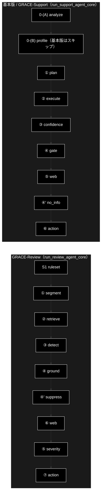

# パイプライン 3 モード対照（基本版 / GRACE-Support / GRACE-Review）

本書は**アプリが提供する 3 つのモードを 1 枚で見比べる**ためのハブである。
判定の詳細は `docs/guardrails.md`、回答生成の詳細は `docs/reasoning_flow.md` を参照。

技術スタック: LLM = ローカル LLM（Ollama・既定 `gemma4:26b-a4b-it-qat`）／
Embedding = Gemini（`gemini-embedding-001`・3072次元）。

> ⚠️ **行番号は書かない。** 実装への参照はすべて「ファイル名 + シンボル名」で示す。
> 行番号はコミットのたびに嘘になる（2026-08-31 の監査で、旧ドキュメントの行番号参照が
> 全滅していた）。

---

## 1. モードの一覧

`frontend/src/App.tsx` の `Tab` が定義するタブと、その実体。

| タブ | `Tab` の値 | 実体（コア関数） | API |
|---|---|---|---|
| 基本版 | `basic` | `backend/app/core/support_agent.py::run_support_agent_core`（`vertical=None`） | `POST /api/support/query` → `GET /api/support/stream/{job_id}` |
| GRACE-Support | `support` | 同上（`vertical` を指定） | 同上 |
| GRACE-Review | `review` | `backend/app/core/review_agent.py::run_review_agent_core` | `POST /api/review/submit` → `GET /api/review/stream/{job_id}` |
| データ管理 | `data` | `backend/app/core/data_jobs.py` / `services/data_pipeline_service.py` | `POST /api/chunking/run` / `POST /api/qdrant/register` ほか |

> ⚠️ **基本版と GRACE-Support は同じ 1 関数を通る。** 別実装ではない。
> 違いは `vertical` を渡すかどうかだけで、そこから 0-(B) 以降の差が生まれる（§3）。
> したがって片方で確認した挙動は、業界プロファイル由来の差を除いてもう片方にも当てはまる。

> ⚠️ **GRACE-Review は別のコアである。** 判定の骨格は Support と同型に作られているが
> （`review_gates.py` の docstring 参照）、コードは共有していない。

---

## 2. ステップ対照表

Support は `support_agent.py::STEP_IDS`、Review は `review_agent.py::REVIEW_STEP_IDS` が正。
番号（①②…）は **Support との対応を示す呼称**であり、実行順とは一致しない
（Support で ④' が ⑤ の後に来るのと同じ理由で、Review でも ⑤ が ⑥ の後に来る）。

| # | 基本版 | GRACE-Support | GRACE-Review |
|---|---|---|---|
| 0-(A) | `analyze` 入力・質問分析 | `analyze` 入力・質問分析 | — |
| S1 / 0-(B) | — | `profile` 業界プロファイル適用 | `ruleset` ルールセット適用 |
| ① | `plan` Plan（planner） | `plan` Plan（planner） | `segment` 文書を検査単位へ分割 |
| ② | `execute` 内部RAG → reasoning | `execute` 内部RAG → reasoning | `retrieve` 規程を RAG 検索 |
| ③ | `confidence` Groundedness | `confidence` Groundedness | `detect` 二段判定で違反候補を検出 |
| ④ | `gate` 回答ゲート＋強制エスカレ＋救済 | 同左 | `ground` 指摘の根拠を検証 |
| ④' | `no_info` 情報なし回答検知 | 同左 | `suppress` 誤検知抑止＋救済 |
| ⑤ | `web` Web フォールバック | 同左 | `severity` 重大度の確定＋強制 high |
| ⑥ | `action` 本人確認 → HITL → 実行 | 同左 | `web` 法改正・ガイドラインの裏取り |
| ⑦ | — | — | `action` レポート → HITL → 実行 |

### 2.1 実行順（実際に流れる順序）

---

## 3. 基本版と GRACE-Support の差（`vertical` の有無だけ）

`run_support_agent_core` は `profile = PROFILES.get(vertical) if vertical else None` で
プロファイルを解決し、以降を `profile is not None` で分岐する。基本版では次がすべて
「無し」側に倒れる。

| 項目 | 基本版（`vertical=None`） | GRACE-Support（`vertical` 指定） |
|---|---|---|
| 0-(B) `profile` ステップ | **スキップ** | 実行（検索スコープ・閾値・方針をログへ） |
| 検索スコープ | `allowed_collections = []`（**全コレクション**が対象） | `profile.collections` に限定 |
| 閾値 | グローバル既定（`confidence.thresholds`） | プロファイル上書き（`gov` は `notify=0.8` / `confirm=0.5`） |
| 業務方針の注入 | `prompt_addendum = ""` | `profile.build_prompt_addendum()` |
| 断りの指示 | `prompt_closing = ""` | `profile.build_closing_instruction(...)` |
| 担当範囲の判定（GA'） | **行わない**（全質問が範囲内） | `scope_description` で範囲外を切り分け、窓口案内で断る |
| 強制エスカレ（G3） | `escalate_keywords` が無いので発火しない | プロファイルのキーワードで発火 |
| 本人確認（G8） | 行わない | `require_identity=True` のプロファイル（`ec`）で実行 |
| Web 優先ドメイン | 無し | `profile.preferred_domains`（加点のみ） |

> ⚠️ **基本版は「ガードレールが薄い」モードである。** 0-(A) の複数質問分析と
> ③〜④' の根拠検証・回答ゲートは効くが、**業界プロファイル由来のガードレールは
> すべて無効**になる。担当範囲外の質問にもそのまま答えようとする。
> 素のパイプラインの挙動を確かめる用途に使い、業務で使うなら GRACE-Support を選ぶ。

---

## 4. モード別に効くガードレール

詳細は `docs/guardrails.md` §2。ここでは有効・無効だけを示す。

| ID | 機構 | 基本版 | Support | Review |
|---|---|:--:|:--:|:--:|
| GA | 複数質問の検知・選択 | ✅ | ✅ | — |
| GA' | 担当範囲の判定 | — | ✅ | — |
| G0 | RAG 採用下限 | ✅ | ✅ | ✅（`retrieve` の閾値） |
| G1 | 根拠検証（groundedness） | ✅ | ✅ | ✅（`ground`） |
| G2 | 回答ゲート | ✅ | ✅ | ✅（`decide_finding_status`） |
| G3 | 強制エスカレ | —（キーワード無し） | ✅ | ✅（`should_force_high`） |
| G4 | 未肯定の救済 | ✅ | ✅ | ✅（`should_rescue_finding`） |
| G5 | Web フォールバック | ✅ | ✅ | ✅（⑥ 裏取り・信頼度を下げる方向のみ） |
| G6 | 情報なし／実質性なしの検知 | ✅ | ✅ | ✅（`detect_vacuous_finding`） |
| G7 | アクション判定 | ✅ | ✅ | ✅（常に `escalate_to_human`） |
| G8 | 本人確認 | — | ✅（`ec`） | — |
| G9 | HITL 承認 | ✅ | ✅ | ✅ |

---

## 5. どの文書を読むか

| 知りたいこと | 文書 |
|---|---|
| モードの違い・ステップの対応 | **本書** |
| なぜ escalate したか／どの閾値が効いたか | `docs/guardrails.md` |
| 回答（と指摘）がどう生成されるか・プロンプトの中身 | `docs/reasoning_flow.md` |
| 複数質問（0-(A)）の設計 | `docs/multi_question_handling.md` |
| Support コアの IPO | `backend/docs/core_support_agent.md` |
| Review コアの IPO | `backend/docs/core_review_agent.md` / `backend/docs/core_review_gates.md` |
| ゲート純関数の IPO | `backend/docs/core_gates.md` |
| データ準備（チャンク化・登録） | `backend/docs/data_pipeline.md` |

---

## 6. 変更履歴

| バージョン | 変更内容 |
|---|---|
| 1.0 | 初版。3 モードの対照表・実行順・基本版と Support の差・ガードレールの有効表を新設（それまで「基本版」がどの文書にも記載されていなかった） |
