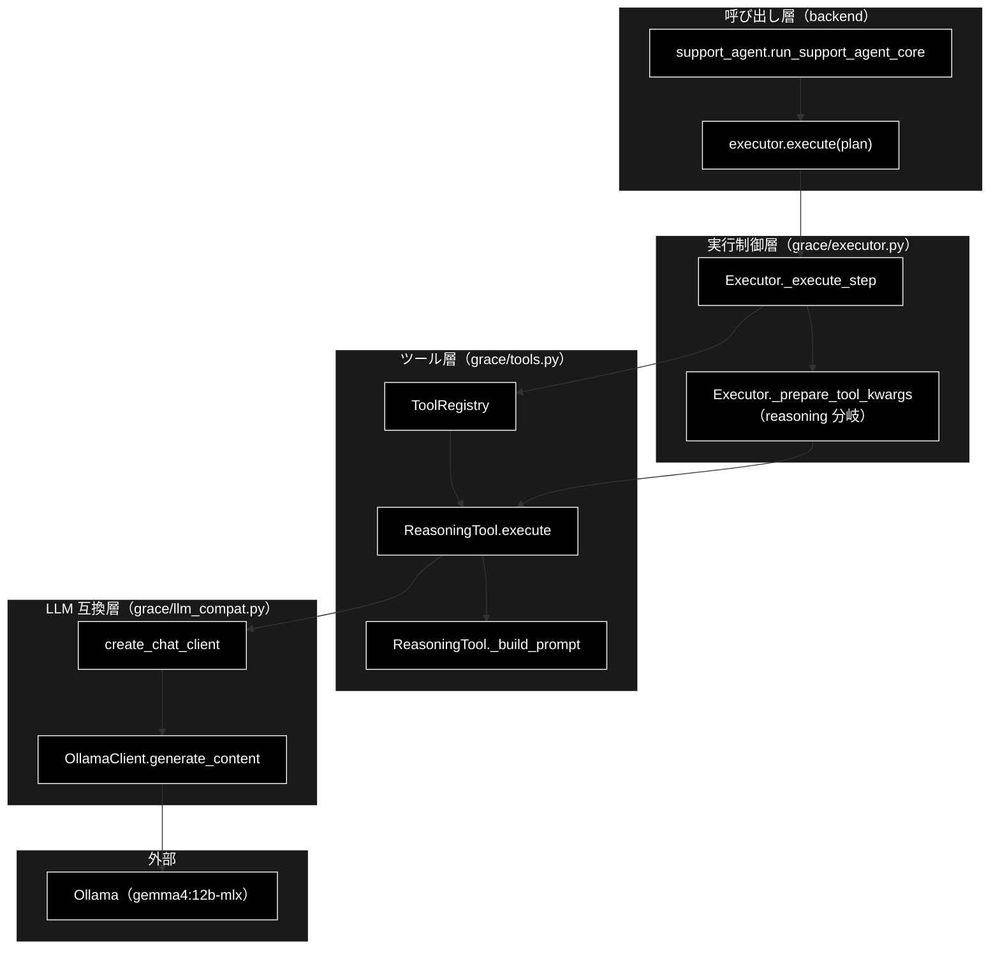

# 生成（reasoning / detect）フロー ドキュメント

**Version 2.0** | 最終更新: 2026-08-31

本書は「**LLM に文章を生成させる 2 つのステップ**」を扱う。

| モード | ステップ | 生成するもの | 実体 |
|---|---|---|---|
| 基本版 / GRACE-Support | ② `execute` の `reasoning` | ユーザーへの**回答** | `grace/tools.py::ReasoningTool` |
| GRACE-Review | ③ `detect` | ルール抵触の**指摘** | `backend/app/core/review_gates.py::create_violation_detector` |

判定（ゲート）側は `docs/guardrails.md`、モードの全体像は `docs/pipelines.md` を参照。

技術スタック: LLM = ローカル LLM（Ollama・既定 `gemma4:12b-mlx`）／
Embedding = Gemini（`gemini-embedding-001`）。

> 📌 **`backend/app/core/` に reasoning の実装は無い。** `support_agent.py` は
> `executor.execute(plan)` の 1 行で `grace/` へ丸ごと委譲しており、backend が担うのは
> 「呼び出し」と「結果の評価（③〜⑥）」だけである。一方 Review の `detect` は
> backend 側（`review_gates.py`）に実装がある — **ここが 2 つの非対称**。

> ⚠️ **行番号は書かない。** 実装への参照は「ファイル名 + シンボル名」で示す。
> v1.0 は行番号で書かれていたが、2026-08-31 の監査で **4 件すべてが別のコードを
> 指していた**（`tools.py:415` は空行、`executor.py:1152` は無関係な `return` 文）。

---

## 目次

1. [Support の reasoning](#1-support-の-reasoning)
2. [プロンプト構造（7 ブロック）](#2-プロンプト構造7-ブロック)
3. [Review の detect](#3-review-の-detect)
4. [2 つの生成ステップの対比](#4-2-つの生成ステップの対比)
5. [設定・定数](#5-設定定数)
6. [使用例](#6-使用例)
7. [設計上の要点と既知の制約](#7-設計上の要点と既知の制約)
8. [関連ドキュメント](#8-関連ドキュメント)
9. [変更履歴](#9-変更履歴)

---

## 1. Support の reasoning

### 1.1 4 層構成



### 1.2 `Executor._prepare_tool_kwargs`（reasoning 分岐）

reasoning ステップの入力を組み立てる、回答品質を左右する要の処理。

| 項目 | 内容 |
|---|---|
| **Input** | `step: PlanStep`, `state: ExecutionState` |
| **Process** | 1. `kwargs["query"] = step.query or state.plan.original_query`（**元質問の復元**）<br>2. `state.step_results` を **step_id 昇順で全走査**（`depends_on` は見ない）<br>3. `status != "success"` はスキップ<br>4. **`ask_user` の結果は除外**（`plan.steps` に加えて `state.dynamic_steps` も見る）<br>5. 文字列出力が `[{` で始まれば `ast.literal_eval` で復元し `sources` へ<br>6. 復元できない文字列は `--- 参照情報 (Step N) ---` を付けて `context_parts` へ<br>7. `sources` / `context` を kwargs に格納 |
| **Output** | `Dict[str, Any]`: `{query, sources?, context?}` |

> 📝 **なぜ元質問を復元するのか**: `step.description`（「取得した情報を元に回答を生成」等の
> **内部指示**）をそのまま質問として渡すと、LLM が本来の質問を見失い、検索結果を全件羅列する
> 汎用サマリーになる（coverage / groundedness が低下する）。

> 📝 **なぜ `depends_on` ではなく全走査か**: 動的に挿入された `web_search`（RAG スコア不足時）や
> リプラン後のステップ結果も拾うため。依存関係だけを見ると、これらが観測から漏れる。

> ⚠️ **`ask_user` の出力は参照情報に混ぜない。** 検索が空振りしたときに動的挿入される
> `ask_user` は「…十分な情報が見つかりませんでした。追加の情報があれば教えてください」という
> **内部の問いかけ**を output に持つ。これを渡すと回答生成 LLM が内部の泣き言を参照情報として
> 読み、回答へ引き写す（実測 2026-08-29: 【補足コンテキスト】にこの dict がそのまま入っていた）。
> ステップトレースには残るので、何が起きたかは追える。消すのは reasoning への入力だけ。

### 1.3 `ReasoningTool.execute`

| 項目 | 内容 |
|---|---|
| **Input** | `query: str`, `context: Optional[str]`, `sources: Optional[List[Dict]]` |
| **Process** | 1. 計測開始<br>2. `_build_prompt(query, context, sources)`<br>3. `[GRACE REASONING IPO: INPUT]` としてプロンプト全文をログ出力<br>4. `client.models.generate_content(model, contents=prompt, config={temperature, max_output_tokens})`<br>5. `[GRACE REASONING IPO: OUTPUT]` として回答をログ出力<br>6. トークン使用量を収集<br>7. `ToolResult` に回答と `confidence_factors` を格納<br>8. 例外時は `success=False` の `ToolResult` |
| **Output** | `ToolResult`（`output` = 回答テキスト、`confidence_factors` = 後段の信頼度算出用メタ） |

`ToolResult` のメンバー: `success` / `output` / `confidence_factors`
（`has_sources` / `source_count` / `answer_length` / `token_usage`）/ `error` / `execution_time_ms`。

---

## 2. プロンプト構造（7 ブロック）

`ReasoningTool._build_prompt` が生成する。

| # | ブロック | 内容 | 供給元 |
|:--:|---|---|---|
| 1 | システム指示 | 「ハイブリッド・ナレッジ・エージェント」としての役割定義 | 固定 |
| 2 | **【現在日時】** | 今日の日付と「明日」が指す日付 | `ReasoningTool._now_text` |
| 3 | **【業務方針（遵守）】** | 業界プロファイルの方針 | `config.llm.prompt_addendum`（0-(B) の注入口） |
| 4 | **【参照情報】** | 情報源ごとに 種別【社内】/【Web】・信頼度・コレクション名・Q/A・出典ファイル名 | `sources`（RAG / Web 検索結果） |
| 5 | 【補足コンテキスト】 | 構造化できなかった他ステップの出力 | `context` |
| 6 | 【ユーザーの質問】 | **元の質問**（内部指示ではない） | `_prepare_tool_kwargs` が復元 |
| 7 | 【回答の構成ルール（最重要）】 | 7 項目の制約（§2.1） | 固定 |
| 8 | **【この回答で必ず守ること】** | 担当範囲外の断りと案内先 URL | `config.llm.prompt_closing`（GA' の注入口） |

> ⚠️ **8 番目の位置が結果を変える。** 断りの指示を業務方針（3 番）に混ぜていたとき、
> 後段の【回答の構成ルール（最重要）】に負けてモデルが断りを落とす事象が**実測 2 回連続**で
> 起きた。構成ルールより**後ろ**へ置いてから、クラウド LLM ではモデル自身が断りを書くように
> なった（実測 2026-08-31）。ブロック番号ではなく「構成ルールの後」という位置が要件である。

### 2.1 回答の構成ルール（品質の安全装置・7 項目）

| # | ルール | 意図 |
|:--:|---|---|
| 1 | **正確性と誠実さ** | 参照情報にある事実のみ。無ければ「提供された情報源には見当たりませんでした」と正直に |
| 2 | 判明した事実を優先 | 直接的な回答を最初に簡潔に |
| 3 | **出典の明示（種別を偽らない）** | 【社内】→「社内ナレッジ（ファイル名）によると…」／【Web】→「Web 検索結果（URL）によると…」 |
| 4 | **出典は引用元から書き写す** | 1 記述に 1 情報源。「出典:」行に無い URL・ドメインを書くのは捏造 |
| 5 | 情報源番号を書かない | 「情報源 1」は内部の通し番号で読者には見えない |
| 6 | 丁寧な日本語 | です・ます調、箇条書き等で構造化 |
| 7 | **捏造禁止** | 事前知識による補完・推測を禁止 |

> 💡 **ルール 1・3 は後段ゲートと対で設計されている。** ルール 3 の出典明示により
> `GroundednessVerifier`（③）が支持率を検証できる形になり、ルール 1 の定型句が
> ④' 情報なし検知（`_detect_no_info_answer`）の検知対象そのものになる。
> **生成の出力仕様と判定ゲートは一体の設計である。**

---

## 3. Review の detect

`create_violation_detector(config)` が返すクロージャ。**セグメント × ルール**ごとに 1 回呼ばれる。

| 項目 | 内容 |
|---|---|
| **Input** | `text: str`（セグメント本文）, `rule: RuleItem`, `evidence: str`（RAG で引いた規程） |
| **Process** | 1. `detect_model(config)` でモデル名を解決（**yml を正**）<br>2. 判定の原則＋ルール＋判定基準＋規程＋対象テキストでプロンプト構築<br>3. `client.models.generate_content(model=model_name, config={response_schema: DetectVerdict, temperature: 0.0, max_output_tokens: 512})`<br>4. `DetectVerdict.model_validate_json(response.text)`<br>5. 空応答・例外は `None` を返す（例外は本文を `_brief(e)` で 1 行ログへ） |
| **Output** | `Optional[DetectVerdict]`（`violates` / `message` / `suggestion` / `excerpt`） |

### 3.1 `None`（判定失敗）の扱い — 二重の注意

1. **「違反なし」と解釈してはならない。** `review_agent._build_finding` は定型文
   「…に該当する可能性があります（自動判定に失敗したため要確認）」で指摘を残す。
   ここを「違反なし」に倒すと、LLM が不安定なときに指摘が静かに消える。
2. **その指摘を「確定」にしてもならない。** 定型文はルール名を言い換えただけなので、
   後段の groundedness が条文からほぼ必ず「支持される」と判定してしまう
   （実測 2026-08-31: 支持率 1.00 で「要確認」と書かれた指摘が「確定」バッジになった）。
   `verdict is None` のとき status の上限は `review_required`。

### 3.2 モデル解決の落とし穴

`detect_model(config)` は `config.llm.model` →（無ければ）`ModelConfig.DEFAULT_MODEL` の順に解決する。
**定数を直接使ってはならない** — `ModelConfig.DEFAULT_MODEL` は yml を見ないモジュール定数なので、
クライアント本体（yml を読む）と食い違うと **detect だけが存在しないモデル名で呼ばれて 404** になる。
実測 2026-08-31 では 33 回の detect が全滅した。詳細は `docs/guardrails.md` §3.2。

---

## 4. 2 つの生成ステップの対比

| | Support の `reasoning` | Review の `detect` |
|---|---|---|
| 実装場所 | `grace/tools.py`（grace 側） | `backend/app/core/review_gates.py`（backend 側） |
| 呼び出し回数 | 1 回（計画の最終ステップ） | セグメント × 候補ルール（上限あり） |
| 出力形式 | 自由文（Markdown） | 構造化（`DetectVerdict` / JSON schema） |
| temperature | `config.llm.temperature`（既定 0.7） | 0.0（固定） |
| 出力上限 | `config.llm.max_tokens`（既定 4096） | 512 |
| モデル解決 | `config.llm.model` | `detect_model(config)`（同じく yml を正） |
| 失敗時 | `ToolResult(success=False)` → ②が失敗 → リプラン対象 | `None` → 指摘を残して `review_required`（安全側） |
| 後段の検証 | `GroundednessVerifier`（回答 vs 出典） | `GroundednessVerifier`（**指摘文** vs 規程＋対象文書） |

> ⚠️ **Review の groundedness には検査対象の本文も渡す。** 表記漏れの指摘は
> 「〜の記載がない」という**対象文書についての主張**であり、条文だけを根拠にすると
> 原理的に検証できない（全 neutral になる）。

---

## 5. 設定・定数

`config.llm`（`grace/config.py`）のうち生成側が参照する項目:

| キー | 既定値 | 説明 |
|---|---|---|
| `provider` | `"ollama"` | チャットクライアントの選択（`create_chat_client`） |
| `model` | `config.py::get_default_ollama_model()`（`gemma4:12b-mlx`） | reasoning / detect に使うモデル |
| `light_model` | 同上 | 軽量判定用（`judge_model`。生成本体では未使用） |
| `temperature` | `0.7` | 生成の温度（detect は 0.0 固定） |
| `max_tokens` | `4096` | `max_output_tokens` として渡る |
| `prompt_addendum` | `""` | **業界プロファイル方針の注入口**（0-(B) が設定） |
| `prompt_closing` | `""` | **担当範囲外の断りの注入口**（GA' が設定。構成ルールの**後ろ**に置かれる） |

> ⚠️ `prompt_addendum` / `prompt_closing` は `support_agent` が**グローバル可変シングルトンへ
> 書き込む**方式で設定される。並行リクエスト間で汚染し得る既知の課題があり、詳細と改善方針は
> `docs/multi_question_handling.md` を参照。

---

## 6. 使用例

### 6.1 パイプライン経由（通常の経路）

```python
from backend.app.core.support_agent import run_support_agent_core

# ② Execute の内部で reasoning まで実行される
result = run_support_agent_core(
    query="住民票の写しの取り方は？",
    vertical="gov",          # → prompt_addendum / prompt_closing が注入される
)                            # vertical=None なら「基本版」（注入なし）
print(result.answer)
```

### 6.2 ツール単体での実行（デバッグ用）

```python
from grace.config import get_config
from grace.tools import ReasoningTool

config = get_config()
config.llm.prompt_addendum = "条例・公式案内に基づき、断定を避け、該当ページ・担当課を明示。"

tool = ReasoningTool(config=config)
result = tool.execute(
    query="住民票の写しの取り方は？",
    sources=[{
        "score": 0.92,
        "payload": {
            "question": "住民票の取得方法",
            "answer": "窓口・郵送・コンビニ交付から選べます。",
            "source": "gov_faq.csv",
            "domain": "gov_faq_anthropic",
        },
    }],
)
print(result.output)
print(result.confidence_factors)   # {'has_sources': True, 'source_count': 1, ...}
```

---

## 7. 設計上の要点と既知の制約

### 7.1 要点

- **元質問の復元**が回答品質の要。内部指示を質問として渡すと汎用サマリー化する。
- **観測の全走査**により、動的 `web_search` やリプラン結果を取りこぼさない。
  ただし `ask_user` だけは除外する（§1.2）。
- **プロンプトと判定ゲートの一体設計**（§2.1）。出典明示と「情報なし」定型句が、後段の
  `GroundednessVerifier` と `_detect_no_info_answer` の入力仕様になっている。
- **ブロックの順序が挙動を変える**（§2 の ⚠️）。追加する指示をどこへ置くかは設計判断である。
- **プロバイダ抽象化**により、tools 側は genai 形式の呼び出しのまま Ollama を利用できる。

### 7.2 既知の制約

| 制約 | 内容 | 状態 |
|---|---|---|
| ~~複数質問に弱い~~ | プロンプトに「各サブ質問に漏れなく答えよ」という制約が無く、出典が片方に偏ると答えられる質問だけ答えていた | **解消済み**。0-(A) が主質問を切り分けて 1 問へ再構成し、範囲外は `prompt_closing` で断らせる（`docs/multi_question_handling.md`） |
| `prompt_addendum` / `prompt_closing` の共有状態 | グローバル可変 config 経由で設定され、並行リクエストで汚染し得る | **未対応** |
| `content` の切り詰め | 参照情報の `content` は 1000 文字で打ち切り | 未対応（長文ソースでは要約前処理の検討余地） |
| Review の指摘文が定型に寄る | `detect` が失敗すると全件が同じ定型文になり、区別が付かない | 失敗時は `review_required` 止まりにして誤認を防ぐところまで対応済み（§3.1） |

---

## 8. 関連ドキュメント

| ドキュメント | 内容 |
|---|---|
| `docs/pipelines.md` | 3 モードの対照（本書の上位） |
| `docs/guardrails.md` | 判定（ゲート）側の一覧（本書の対） |
| `backend/docs/core_support_agent.md` | Support コアの IPO |
| `backend/docs/core_review_agent.md` / `core_review_gates.md` | Review コアとゲートの IPO |
| `backend/docs/core_gates.md` | ④ 回答ゲート・④' 情報なし検知 |
| `grace/docs/executor.md` / `grace/docs/tools.md` / `grace/docs/llm_compat.md` | 実行エンジン・ツール・互換層の IPO |
| `docs/multi_question_handling.md` | 複数質問（0-(A)）の設計 |

---

## 9. 変更履歴

| バージョン | 変更内容 |
|---|---|
| 2.0 | 対象を「Support の reasoning」から「**生成ステップ全般**」へ拡張し、Review の `detect` を並置。プロンプトを 7 ブロック／7 ルールへ更新（【現在日時】【この回答で必ず守ること】＝`prompt_closing` を追加）。`ask_user` 除外を追記。**行番号参照を全廃**（v1.0 の 4 件がすべて別のコードを指していた）。解消済みの制約（複数質問）を整理 |
| 1.0 | 初版。backend → executor → tools → llm_compat の 4 層構成、`_prepare_tool_kwargs` の元質問復元・観測収集、`_build_prompt` の 6 ブロック構造と回答ルール |
