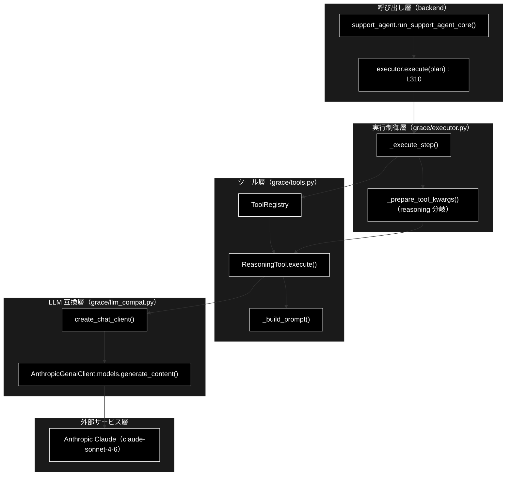
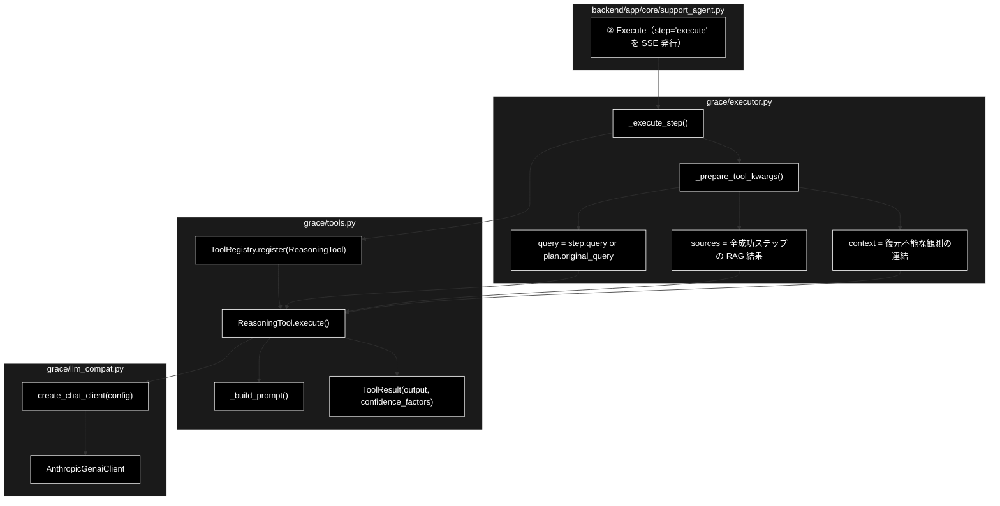
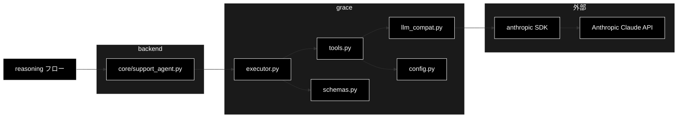

# reasoning（推論・回答生成）フロー ドキュメント

**Version 1.0** | 最終更新: 2026-07-25

GRACE-Support のパイプライン ② Execute における **`reasoning`（収集した観測を統合して最終回答を
生成する処理）** を、モジュール構成・処理順・IPO 詳細の観点から整理した資料。

> 📌 **重要**: `backend/app/core/` に reasoning の実装は**存在しない**。
> `backend/app/core/support_agent.py:310` が `executor.execute(plan)` の 1 行で grace 側へ
> **丸ごと委譲**しており、backend が担うのは「呼び出し」と「結果の評価（③〜⑥）」のみである。
> 本書は backend からの呼び出し経路を含め、reasoning の実体（`grace/`）を追跡する。

技術スタック: LLM = Anthropic Claude（既定 `claude-sonnet-4-6`）／Embedding = Gemini
（`gemini-embedding-001`）。

---

## 目次

1. [概要](#概要)
2. [アーキテクチャ構成図](#1-アーキテクチャ構成図)
3. [モジュール構成図](#2-モジュール構成図)
4. [クラス・関数一覧表](#3-クラス関数一覧表)
5. [クラス・関数 IPO詳細](#4-クラス関数-ipo詳細)
6. [プロンプト構造](#5-プロンプト構造)
7. [設定・定数](#6-設定定数)
8. [使用例](#7-使用例)
9. [設計上の要点と既知の制約](#8-設計上の要点と既知の制約)
10. [関連ドキュメント](#9-関連ドキュメント)
11. [変更履歴](#10-変更履歴)
12. [付録: 依存関係図](#付録-依存関係図)

---

## 概要

`reasoning` は、RAG 検索や Web 検索で集めた**観測（sources / context）を統合し、ユーザーの
元の質問に対する最終回答を生成する**ステップである。計画（`ExecutionPlan`）の最終ステップは
必ず `reasoning` になる（`grace/planner.py` の計画作成ルール5）。

処理は 4 層に分かれる。

1. **呼び出し層**（backend）… `executor.execute(plan)` を呼び、SSE で `step="execute"` を通知
2. **実行制御層**（executor）… ステップ種別で分岐し、**入力（元質問・観測）を組み立てる**
3. **ツール層**（tools）… **プロンプトを構築**し LLM を呼ぶ
4. **LLM 互換層**（llm_compat）… Gemini 形式の呼び出しを **Anthropic** へ橋渡しする

### 主な責務

- 計画ステップ `reasoning` の実行制御（タイムアウト・フォールバック）
- **ユーザーの元の質問の復元**（内部指示で上書きされるのを防ぐ）
- 全成功ステップからの**観測収集**（動的挿入された web_search・リプラン結果を含む）
- 業界プロファイル方針（`prompt_addendum`）を注入した**プロンプト構築**
- Anthropic Claude による**回答生成**と、後段の信頼度算出用メタ情報の付与
- 捏造禁止・出典明示ルールの強制（後段ゲートが検証可能な出力形式の担保）

### 各責務対応のモジュール

| # | 責務 | 対応モジュール | 説明 |
|---|------|--------------|------|
| 1 | reasoning の呼び出しと進捗通知 | `backend/app/core/support_agent.py` | `executor.execute(plan)`（:310）。SSE `step="execute"` |
| 2 | ステップ実行制御 | `grace/executor.py`（`_execute_step`） | 種別分岐・タイムアウト・フォールバック（:937） |
| 3 | 元質問の復元・観測収集 | `grace/executor.py`（`_prepare_tool_kwargs`） | reasoning 分岐（:1147-1189）が本書の肝 |
| 4 | プロンプト構築 | `grace/tools.py`（`ReasoningTool._build_prompt`） | 業務方針注入・出典整形・回答ルール |
| 5 | LLM 呼び出しと結果整形 | `grace/tools.py`（`ReasoningTool.execute`） | `ToolResult` に回答＋`confidence_factors` |
| 6 | プロバイダ抽象化 | `grace/llm_compat.py`（`AnthropicGenaiClient`） | `models.generate_content()` を Anthropic へ |
| 7 | ツール登録・解決 | `grace/tools.py`（`ToolRegistry`） | `reasoning` を登録（:1147-1148） |

### 主要機能一覧

| 機能 | 説明 |
|------|------|
| `ReasoningTool` | LLM 推論ツール（`name = "reasoning"`） |
| `ReasoningTool.__init__()` | config・モデル名・チャットクライアントの初期化 |
| `ReasoningTool.execute()` | プロンプト構築 → LLM 呼び出し → `ToolResult` 返却 |
| `ReasoningTool._build_prompt()` | 6 ブロック構成のプロンプトを組み立て |
| `Executor._execute_step()` | ステップ種別で分岐して実行（タイムアウト・フォールバック） |
| `Executor._prepare_tool_kwargs()` | **元質問の復元**と**観測収集**（reasoning 分岐） |
| `create_chat_client()` | provider に応じたチャットクライアント生成 |
| `ToolResult` | ツール実行結果（`output` / `confidence_factors` / `execution_time_ms`） |

---

## 1. アーキテクチャ構成図

### 1.1 システム全体構成



### 1.2 データフロー

1. backend が `executor.execute(plan)` を呼ぶ（reasoning は計画の最終ステップ）
2. `_execute_step()` が `step.action == "reasoning"` を検出
3. `_prepare_tool_kwargs()` が **元の質問**を復元し、**全成功ステップの観測**を `sources` / `context` に振り分け
4. `ReasoningTool.execute()` が `_build_prompt()` でプロンプトを構築
5. `llm_compat` 経由で Anthropic Claude を呼び、回答テキストを取得
6. `ToolResult`（回答＋`confidence_factors`）を返し、`ExecutionResult.final_answer` に格納
7. backend の ③ Groundedness 以降へ渡る

---

## 2. モジュール構成図

### 2.1 内部モジュール構成



### 2.2 外部依存関係

| ライブラリ | 用途 |
|-----------|------|
| `anthropic` | Claude API 呼び出し（`llm_compat.AnthropicGenaiClient` 経由） |
| `ast`（標準） | 文字列化された RAG 結果の復元（`literal_eval`） |

### 2.3 内部依存モジュール

| モジュール | 用途 |
|-----------|------|
| `grace.config`（`config.llm`） | モデル・温度・最大トークン・`prompt_addendum` |
| `grace.llm_compat` | provider 抽象化（Anthropic / Gemini 互換クライアント） |
| `grace.schemas`（`PlanStep` / `ExecutionState`） | ステップ定義と実行状態 |

---

## 3. クラス・関数一覧表

### 3.1 クラス一覧

#### ReasoningTool（`grace/tools.py:415`）

| メソッド | 概要 |
|---------|------|
| `__init__(config=None, model_name=None)` | config・モデル名・チャットクライアントを初期化 |
| `execute(query, context=None, sources=None, **kwargs)` | プロンプト構築 → LLM 呼び出し → `ToolResult` |
| `_build_prompt(query, context, sources)` | 6 ブロック構成のプロンプトを組み立て |

#### ToolResult（`grace/tools.py:34`）

| メンバー | 概要 |
|---------|------|
| `success: bool` | 実行成否 |
| `output: Any` | 生成された回答テキスト |
| `confidence_factors: Dict[str, Any]` | `has_sources` / `source_count` / `answer_length` / `token_usage` |
| `error: Optional[str]` | エラーメッセージ |
| `execution_time_ms: Optional[int]` | 実行時間（ミリ秒） |

### 3.2 関数一覧（カテゴリ別）

#### 実行制御（`grace/executor.py`）

| 関数名 | 概要 |
|-------|------|
| `_execute_step(step, state)` | ステップ種別で分岐して実行（:937） |
| `_prepare_tool_kwargs(step, state)` | ツール実行引数を準備。reasoning 分岐が本書の中心（:1130） |

#### LLM 互換（`grace/llm_compat.py`）

| 関数名 | 概要 |
|-------|------|
| `create_chat_client(config=None)` | provider に応じたクライアント生成（:221） |

---

## 4. クラス・関数 IPO詳細

### 4.1 Executor._prepare_tool_kwargs（reasoning 分岐）

**概要**: reasoning ステップの入力を組み立てる。**元の質問の復元**と**観測の収集**を行う、
回答品質を左右する要の処理。

```python
def _prepare_tool_kwargs(
    self,
    step: PlanStep,
    state: ExecutionState
) -> Dict[str, Any]
```

| パラメータ | 型 | デフォルト | 説明 |
|------------|------|-----------|------|
| `step` | PlanStep | - | 実行対象ステップ（`action == "reasoning"`） |
| `state` | ExecutionState | - | 実行状態（`step_results` / `plan` を保持） |

| 項目 | 内容 |
|------|------|
| **Input** | `step: PlanStep`, `state: ExecutionState` |
| **Process** | 1. `kwargs["query"] = step.query or state.plan.original_query`（**元質問の復元**）<br>2. `state.step_results` を **step_id 昇順で全走査**（`depends_on` は見ない）<br>3. `status != "success"` はスキップ<br>4. 文字列出力が `[{` で始まれば `ast.literal_eval` で復元し `sources` へ<br>5. 復元できない文字列は `--- 参照情報 (Step N) ---` を付けて `context_parts` へ<br>6. リスト出力はそのまま `sources` へ<br>7. `sources` / `context` を kwargs に格納 |
| **Output** | `Dict[str, Any]`: `{query, sources?, context?}` |

**戻り値例**:
```python
{
    "query": "住民票の写しの取り方は？",
    "sources": [
        {"score": 0.92, "payload": {"question": "住民票の取得方法", "answer": "窓口またはコンビニ交付…", "source": "gov_faq.csv", "domain": "gov_faq_anthropic"}}
    ],
    "context": "--- 参照情報 (Step 2) ---\n[Web] https://example.city.jp/juminhyo"
}
```

> 📝 **なぜ元質問を復元するのか**: `step.description`（「取得した情報を元に回答を生成」等の
> **内部指示**）をそのまま質問として渡すと、**LLM が本来の質問を見失い、検索結果を全件羅列する
> 汎用サマリー**になる。コード上のコメント（`executor.py:1148-1151`）にも
> 「coverage/groundedness 低下」を防ぐ意図が明記されている。該当行は `executor.py:1152`。

> 📝 **なぜ `depends_on` ではなく全走査か**: 動的に挿入された `web_search`（RAG スコア不足時）や
> **リプラン後のステップ結果**も拾うため。依存関係だけを見ると、これらが観測から漏れる。

### 4.2 ReasoningTool クラス

LLM 推論ツール。`name = "reasoning"` として `ToolRegistry` に登録される。

#### コンストラクタ: `__init__`

**概要**: config・モデル名・チャットクライアントを初期化する。

```python
ReasoningTool(
    config: Optional[GraceConfig] = None,
    model_name: Optional[str] = None
)
```

| パラメータ | 型 | デフォルト | 説明 |
|------------|------|-----------|------|
| `config` | Optional[GraceConfig] | None | None なら `get_config()` |
| `model_name` | Optional[str] | None | None なら `config.llm.model`（`claude-sonnet-4-6`） |

| 項目 | 内容 |
|------|------|
| **Input** | `config: Optional[GraceConfig] = None`, `model_name: Optional[str] = None` |
| **Process** | 1. config を解決<br>2. モデル名を解決<br>3. `create_chat_client(config)` でクライアント生成 |
| **Output** | `ReasoningTool` インスタンス |

```python
# 使用例
tool = ReasoningTool(config=get_config())
```

#### メソッド: `execute`

**概要**: プロンプトを構築して LLM を呼び出し、回答と信頼度メタ情報を `ToolResult` で返す。

```python
def execute(
    self,
    query: str,
    context: Optional[str] = None,
    sources: Optional[List[Dict]] = None,
    **kwargs
) -> ToolResult
```

| パラメータ | 型 | デフォルト | 説明 |
|------------|------|-----------|------|
| `query` | str | - | ユーザーの元の質問 |
| `context` | Optional[str] | None | 他ステップの補足コンテキスト |
| `sources` | Optional[List[Dict]] | None | RAG 検索結果（`score` / `payload` を持つ） |

| 項目 | 内容 |
|------|------|
| **Input** | `query: str`, `context: Optional[str] = None`, `sources: Optional[List[Dict]] = None` |
| **Process** | 1. 計測開始<br>2. `_build_prompt(query, context, sources)`<br>3. `[GRACE REASONING IPO: INPUT]` としてプロンプト全文をログ出力<br>4. `client.models.generate_content(model, contents=prompt, config={temperature, max_output_tokens})`<br>5. `[GRACE REASONING IPO: OUTPUT]` として回答をログ出力<br>6. `usage_metadata` があればトークン使用量を収集<br>7. `ToolResult` に回答と `confidence_factors` を格納<br>8. 例外時は `success=False` の `ToolResult` |
| **Output** | `ToolResult`: `output` に回答テキスト、`confidence_factors` に後段の信頼度算出用メタ |

**戻り値例**:
```python
ToolResult(
    success=True,
    output="社内ナレッジ（gov_faq.csv）によると、住民票の写しは以下の方法で取得できます。\n- 窓口…",
    confidence_factors={
        "has_sources": True,
        "source_count": 3,
        "answer_length": 412,
        "token_usage": {"input_tokens": 1820, "output_tokens": 260}
    },
    execution_time_ms=3120
)
```

```python
# 使用例
result = tool.execute(
    query="住民票の写しの取り方は？",
    sources=rag_results,
)
if result.success:
    print(result.output)
```

#### メソッド: `_build_prompt`

**概要**: システム指示・業務方針・参照情報・補足・質問・回答ルールの 6 ブロックでプロンプトを構築する。

```python
def _build_prompt(
    self,
    query: str,
    context: Optional[str],
    sources: Optional[List[Dict]]
) -> str
```

| パラメータ | 型 | デフォルト | 説明 |
|------------|------|-----------|------|
| `query` | str | - | ユーザーの元の質問 |
| `context` | Optional[str] | - | 補足コンテキスト |
| `sources` | Optional[List[Dict]] | - | 参照ソース |

| 項目 | 内容 |
|------|------|
| **Input** | `query: str`, `context: Optional[str]`, `sources: Optional[List[Dict]]` |
| **Process** | 1. システム指示（ハイブリッド・ナレッジ・エージェント）<br>2. **`config.llm.prompt_addendum` があれば「業務方針（遵守）」として注入**<br>3. `sources` を情報源ごとに整形（信頼度スコア・コレクション名・Q/A・出典ファイル名。`content` は 1000 文字で切り詰め）<br>4. `context` を「補足コンテキスト」として追加<br>5. 「ユーザーの質問」を追加<br>6. 「回答の構成ルール」5 項目を追加<br>7. 改行で連結して返す |
| **Output** | `str`: 完成したプロンプト文字列 |

**戻り値例**:
```python
"""あなたは社内ドキュメント検索システムと連携した「ハイブリッド・ナレッジ・エージェント」です。
…
### 【業務方針（遵守）】
条例・公式案内に基づき、断定を避け、該当ページ・担当課を明示。個人情報は尋ねない。

### 【参照情報】
--- 情報源 1 (信頼度: 0.92, コレクション: gov_faq_anthropic) ---
Q: 住民票の取得方法
A: 窓口またはコンビニ交付…
出典: gov_faq.csv

### 【ユーザーの質問】
住民票の写しの取り方は？

### 【回答の構成ルール（最重要）】
1. **正確性と誠実さ**: …
"""
```

### 4.3 create_chat_client

**概要**: `config.llm.provider` に応じたチャットクライアントを生成する。戻り値はいずれも
`client.models.generate_content(...)` を提供する（genai 互換）。

```python
def create_chat_client(config: Any = None) -> Any
```

| パラメータ | 型 | デフォルト | 説明 |
|------------|------|-----------|------|
| `config` | Any | None | `config.llm.provider` / `config.llm.model` を参照 |

| 項目 | 内容 |
|------|------|
| **Input** | `config: Any = None` |
| **Process** | 1. provider を解決（既定 `"anthropic"`）<br>2. `"gemini"`/`"google"` なら `genai.Client()`<br>3. `"anthropic"` なら `AnthropicGenaiClient`（genai 互換ラッパー） |
| **Output** | `Any`: `models.generate_content()` を持つクライアント |

```python
# 使用例
client = create_chat_client(get_config())
resp = client.models.generate_content(
    model="claude-sonnet-4-6",
    contents=prompt,
    config={"temperature": 0.7, "max_output_tokens": 4096},
)
print(resp.text)
```

---

## 5. プロンプト構造

`_build_prompt` が生成するプロンプトは以下の 6 ブロックからなる。

| # | ブロック | 内容 | 供給元 |
|:--:|---------|------|-------|
| 1 | システム指示 | 「ハイブリッド・ナレッジ・エージェント」としての役割定義 | 固定 |
| 2 | **【業務方針（遵守）】** | 業界プロファイルの方針 | `config.llm.prompt_addendum`（**S1 profile の注入口**） |
| 3 | **【参照情報】** | 情報源ごとに 信頼度スコア・コレクション名・Q/A・出典ファイル名 | `sources`（RAG / Web 検索結果） |
| 4 | 【補足コンテキスト】 | 構造化できなかった他ステップの出力 | `context` |
| 5 | 【ユーザーの質問】 | **元の質問**（内部指示ではない） | `_prepare_tool_kwargs` が復元 |
| 6 | 【回答の構成ルール】 | 5 項目の制約（下表） | 固定 |

### 5.1 回答の構成ルール（品質の安全装置）

| # | ルール | 意図 |
|:--:|-------|------|
| 1 | **正確性と誠実さ** | 参照情報にある事実のみ。無ければ「**提供された情報源には見当たりませんでした**」と正直に回答 |
| 2 | 判明した事実を優先 | 直接的な回答を最初に簡潔に述べる |
| 3 | **出典の明示** | 「社内ナレッジ（出典ファイル名）によると…」形式を強制 |
| 4 | 丁寧な日本語 | です・ます調、箇条書き等で構造化 |
| 5 | **捏造禁止** | 事前知識による補完・推測を禁止 |

> 💡 **ルール1・3 は後段ゲートと対で設計されている**。
> ルール3 の出典明示により `GroundednessVerifier`（③）が支持率を検証できる形になり、
> ルール1 の定型句が backend の **④' 情報なし検知ゲート**（`_detect_no_info_answer`）が
> 拾う対象そのものになる。**reasoning の出力仕様と判定ゲートは一体の設計**である。

---

## 6. 設定・定数

`config.llm`（`grace/config.py`）のうち reasoning が参照する項目:

| キー | 既定値 | 説明 |
|-----|-------|------|
| `provider` | `"anthropic"` | チャットクライアントの選択（`create_chat_client`） |
| `model` | `"claude-sonnet-4-6"` | reasoning に使うモデル |
| `light_model` | `"claude-haiku-4-5-20251001"` | 軽量判定用（reasoning 本体では未使用） |
| `temperature` | `0.7` | 生成の温度 |
| `max_tokens` | `4096` | `max_output_tokens` に渡る |
| `prompt_addendum` | `""` | **業界プロファイル方針の注入口**（S1 profile が設定） |

> ⚠️ **注意**: `prompt_addendum` は `backend/app/core/support_agent.py:277` が
> **グローバル可変シングルトンへ書き込む**方式で設定される。並行リクエスト間で汚染し得る
> 既知の課題があり、詳細と改善方針は `docs/multi_question_handling.md` §1.2 を参照。

---

## 7. 使用例

### 7.1 パイプライン経由（通常の経路）

```python
from backend.app.core.support_agent import run_support_agent_core

# ② Execute の内部で reasoning まで実行される
result = run_support_agent_core(
    query="住民票の写しの取り方は？",
    vertical="gov",          # → prompt_addendum が reasoning に注入される
)
print(result.answer)         # reasoning が生成した最終回答
```

### 7.2 ツール単体での実行（デバッグ用）

```python
from grace.config import get_config
from grace.tools import ReasoningTool

config = get_config()
config.llm.prompt_addendum = "条例・公式案内に基づき、断定を避け、該当ページ・担当課を明示。"

tool = ReasoningTool(config=config)
result = tool.execute(
    query="住民票の写しの取り方は？",
    sources=[{
        "score": 0.92,
        "payload": {
            "question": "住民票の取得方法",
            "answer": "窓口・郵送・コンビニ交付から選べます。",
            "source": "gov_faq.csv",
            "domain": "gov_faq_anthropic",
        },
    }],
)
print(result.output)
print(result.confidence_factors)   # {'has_sources': True, 'source_count': 1, ...}
```

---

## 8. 設計上の要点と既知の制約

### 8.1 要点

- **元質問の復元**（`executor.py:1152`）が回答品質の要。内部指示を質問として渡すと汎用
  サマリー化し、coverage / groundedness が低下する。
- **観測の全走査**により、動的 web_search やリプラン結果を取りこぼさない。
- **プロンプトと判定ゲートの一体設計**（§5.1）。出典明示と「情報なし」定型句が、後段の
  `GroundednessVerifier` と `_detect_no_info_answer` の入力仕様になっている。
- **プロバイダ抽象化**により、tools 側は Gemini 形式の呼び出しのまま Anthropic を利用できる。

### 8.2 既知の制約

| 制約 | 内容 | 対応方針 |
|---|---|---|
| **複数質問に弱い** | プロンプトに「各サブ質問に漏れなく答えよ」という制約が**無い**。出典が片方の質問に偏ると、LLM は捏造禁止ルールに従って**答えられる質問だけ答える**（＝正しい振る舞いだが、もう一方が黙って落ちる） | `docs/multi_question_handling.md` の **#13**（reasoning プロンプトへのサブ質問制約追加）で本 `_build_prompt` を改修対象としている |
| `prompt_addendum` の共有状態 | グローバル可変 config 経由で設定され、並行リクエストで汚染し得る | 同 §1.2 / **#0**（config 依存の除去） |
| `content` の切り詰め | 参照情報の `content` は 1000 文字で打ち切り | 長文ソースでは要約前処理の検討余地 |

---

## 9. 関連ドキュメント

| ドキュメント | 内容 |
|---|---|
| `backend/docs/core_support_agent.md` | ①〜⑥ パイプライン全体（reasoning の呼び出し元） |
| `backend/docs/core_gates.md` | ④ 回答ゲート・④' 情報なし検知（reasoning 出力の判定先） |
| `grace/docs/executor.md` | 実行エンジンの IPO 詳細 |
| `grace/docs/tools.md` | ツール群の IPO 詳細 |
| `grace/docs/llm_compat.md` | プロバイダ互換層の詳細 |
| `grace/docs/confidence_calibration.md` | 信頼度測定（`confidence_factors` の利用先） |
| `docs/multi_question_handling.md` | 複数質問対応の改善提案（§8.2 の制約の対応方針） |

---

## 10. 変更履歴

| バージョン | 変更内容 |
|-----------|---------|
| 1.0 | 初版作成（backend → executor → tools → llm_compat の 4 層構成、`_prepare_tool_kwargs` の元質問復元・観測収集、`_build_prompt` の 6 ブロック構造と回答ルール、IPO 詳細・設定・既知の制約） |

---

## 付録: 依存関係図


