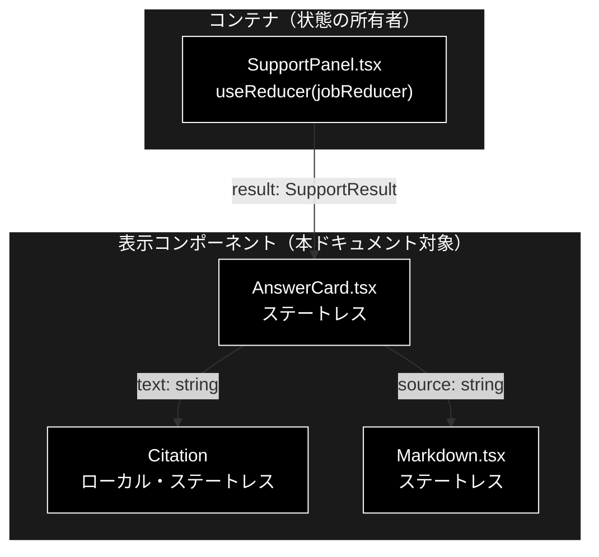
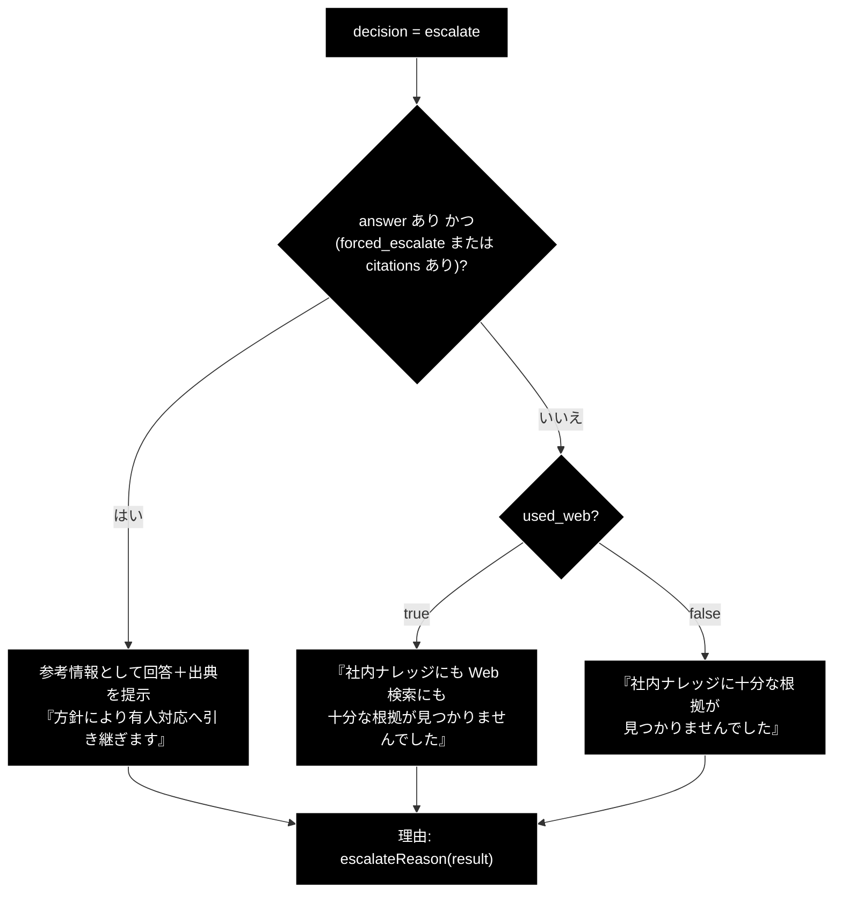
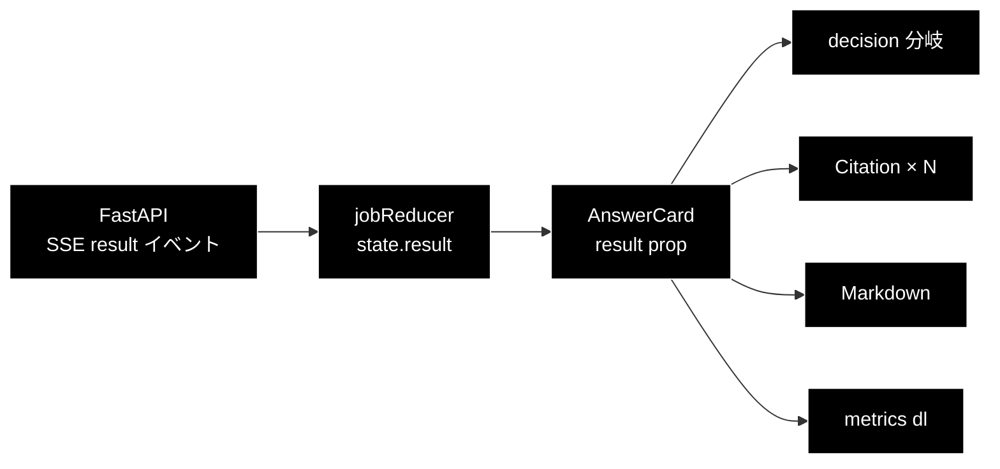
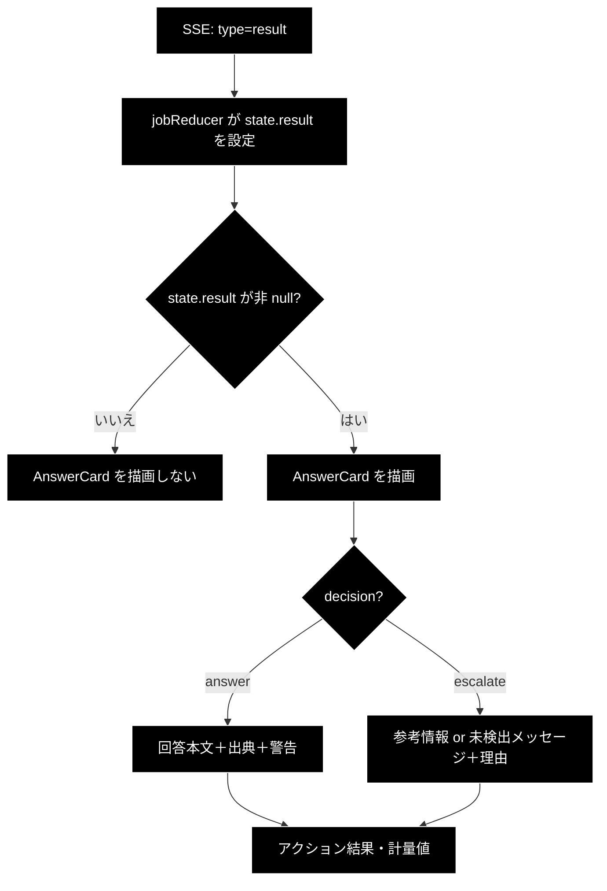

# AnswerCard.tsx - 回答カード（GRACE-Support の最終結果表示） ドキュメント

**Version 1.0** | 最終更新: 2026-08-01

---

## 目次

- [概要](#概要)
- [1. コンポーネントツリー図](#1-コンポーネントツリー図)
- [2. Props インターフェース](#2-props-インターフェース)
- [3. 状態管理](#3-状態管理)
- [4. データフロー・副作用](#4-データフロー副作用)
- [5. API 通信・SSE イベント](#5-api-通信sse-イベント)
- [6. ユーザー操作フロー](#6-ユーザー操作フロー)
- [7. 型定義とバックエンド対応](#7-型定義とバックエンド対応)
- [8. スタイル・アクセシビリティ](#8-スタイルアクセシビリティ)
- [9. テスト](#9-テスト)
- [10. 変更履歴](#10-変更履歴)

---

## 概要

| 項目 | 内容 |
|---|---|
| ファイル | `frontend/src/components/AnswerCard.tsx` |
| 種別 | 表示コンポーネント（ステートレス） |
| 親 | `SupportPanel.tsx`（`{state.result && <AnswerCard result={state.result} />}`） |
| 子 | `Markdown.tsx`、`Citation`（同ファイル内のローカルコンポーネント） |
| 主な依存 | `../types`（`SupportResult`）、`./Markdown` |
| 対応バックエンド | `backend/app/core/support_agent.py`（`SupportResult`）、`backend/app/core/gates.py`（出典の `[社内]` / `[Web]` ラベル付け） |

### 主な責務

- `decision`（`answer` / `escalate`）を**バッジ＋カード色**で提示し、どちらに倒れたかを一目で分かるようにする。
- 回答本文を `Markdown` で描画し、出典を **`[社内]` / `[Web]` の区別付き**で列挙する。
- **escalate でも、生成済みの有用な回答を捨てずに「参考情報」として提示する**（強制エスカレ時・出典がある時）。
- エスカレ理由を `SupportResult` のフラグから逆算して 1 行で説明する。
- groundedness（支持率）・全体信頼度・内部×Web 一致度・意図分類を計量値として並べる。
- アクションが起票された場合、種別・本人確認の有無・実行結果を示す。

### 主要機能一覧

| 機能 | 実装 | 説明 |
|---|---|---|
| decision バッジ | `` `decision-badge ${result.decision}` `` | `answer（回答）` / `escalate（有人対応へ）`。**文言を併記**し色のみに依存させない |
| 補助バッジ | `result.vertical` / `used_web` / `web_reused` | 業界プロファイル・Web 使用・Web 再利用を小バッジで表示 |
| 回答本文 | `<Markdown source={result.answer} />` | 見出し・表・箇条書きを整形（依存ライブラリなし） |
| 出典リスト | `Citation` | 先頭が `[Web]` なら Web、それ以外は社内。ラベルを外して本文だけ表示 |
| 裏付け不足の警告 | `result.warning` | 「出典による裏付けが十分ではありません」 |
| 内部×Web 矛盾の警告 | `used_web && contradiction` | 「食い違いの可能性があります」 |
| escalate 時の救済表示 | `forced_escalate \|\| citations.length > 0` | 参考情報として回答＋出典を出す |
| エスカレ理由 | `escalateReason(result)` | 強制エスカレ → 情報なし検知 → ゲート未達 の優先順で判定 |
| アクション結果 | `result.action` | `action_type` / 本人確認有無 / `action_result` |
| 計量値 | `<dl className="metrics">` | groundedness / 全体信頼度 / 一致度 / 意図分類 |

---

## 1. コンポーネントツリー図



> `AnswerCard` は `SupportPanel` からしか使われない（`ReviewPanel` は `FindingList` /
> `DocumentView` を使う）。Support / Review で共用しているのは `ConfirmModal` のみ。

---

## 2. Props インターフェース

実コードは `interface Props` を切らずインライン型で受けている。

```typescript
export function AnswerCard({ result }: { result: SupportResult }) { ... }
```

| Prop | 型 | 必須 | 既定値 | 説明 |
|---|---|:---:|---|---|
| `result` | `SupportResult` | ✅ | — | `result` SSE イベントで届いた最終結果。reducer の `state.result` |

### コールバックの契約

コールバック props は**なし**。本コンポーネントは親へ一切通知しない（純表示）。

### ローカルコンポーネント `Citation`

```typescript
function Citation({ text }: { text: string })
```

| Prop | 型 | 必須 | 既定値 | 説明 |
|---|---|:---:|---|---|
| `text` | `string` | ✅ | — | `"[社内] xxx"` / `"[Web] タイトル（URL）"` 形式の出典 1 行 |

---

## 3. 状態管理

### 3.1 ローカル state（`useState`）

**なし。** `useState` / `useReducer` / `useEffect` / `useRef` を一切持たない純表示コンポーネント。

### 3.2 reducer state（`useReducer`）

**なし。** reducer は親（`SupportPanel`）の `jobReducer` が持つ。

### 3.3 親から渡る状態（props 由来）

| 値 | 供給元 | 本コンポーネントでの扱い |
|---|---|---|
| `result` | `SupportPanel` の `state.result`（`jobReducer` が `result` イベントで設定） | 読み取りのみ。変更しない |

> **不変条件**: `result` は変更しない。表示の分岐に使うだけで、派生値（`isAnswer`）も
> レンダリング内のローカル定数に留める。

---

## 4. データフロー・副作用

### 4.1 副作用一覧（`useEffect`）

**なし。** `useEffect` を使っていない（DOM 操作・購読・タイマーのいずれも行わない）。

### 4.2 表示分岐ロジック

本コンポーネントの実質は「`SupportResult` のフラグ組み合わせ → 見せ方」の分岐である。

#### 4.2.1 `decision === 'answer'` のとき

| 条件 | 表示 |
|---|---|
| `answer` が非 null | `<Markdown source={answer} />` |
| `answer` が null / 空 | `（回答なし）` |
| `warning === true` | ⚠️ 裏付け不足の注意書き |
| `used_web && contradiction` | ⚠️ 内部×Web の食い違い注意 |
| `citations.length > 0` | 出典リスト |

#### 4.2.2 `decision === 'escalate'` のとき



> ⚠️ **この 2 段の分岐は意図的な仕様であり、単純化してはならない。**
> - 強制エスカレ（エスカレ語検知）は「回答が作れなかった」わけではないので、
>   一律に「根拠が見つかりませんでした」と出すと**有用な回答を捨てて嘘を伝える**ことになる。
> - `used_web === false`（Web フォールバック未実行）のときに「Web 検索にも」と書くと、
>   実行していない検索をしたことにしてしまう。

#### 4.2.3 `escalateReason()` の優先順

```typescript
if (result.forced_escalate) return `エスカレ語を検知（意図分類: ...）による強制エスカレ`;
if (result.no_info_detected) return '「情報なし回答」を検知（④\' ゲート）';
return '出典・支持率がしきい値未達（回答ゲート）';
```

| # | 条件 | 理由文 | バックエンド側の設定箇所 |
|---|---|---|---|
| 1 | `forced_escalate` | エスカレ語による強制エスカレ | `support_agent.py` `_should_force_escalate()` → `support.forced_escalate` |
| 2 | `no_info_detected` | ④' 情報なし回答の検知 | `support_agent.py` の ④' ゲート → `support.no_info_detected = True` |
| 3 | いずれでもない | 回答ゲート未達（出典・支持率） | ④ 回答ゲート |

> ⚠️ **これはフロント側の「逆算」であり、バックエンドから理由文字列が来ているわけではない。**
> フラグは同時に立ちうる（強制エスカレかつ情報なし等）ため、**順序が意味を持つ**。
> 新しいエスカレ要因をバックエンドに足したら、この関数にも分岐を足す必要がある
> （足さないと、すべて「しきい値未達」という誤った理由が表示される）。

#### 4.2.4 groundedness の「判定不能」表示

```typescript
result.groundedness_decided === 0
  ? '判定不能（判定可能 0 主張）'
  : `${result.groundedness.toFixed(2)}（判定可能 ${result.groundedness_decided} 主張）`
```

`support_rate = supported / (supported + contradicted)` は neutral を分母から外すため、
**全主張が neutral だと分母が 0** になる。その場合の `groundedness` 値は意味を持たないので
数値を出さず「判定不能」と明示する。`0.00` と表示すると「根拠ゼロ」と誤読される。

### 4.3 データフロー図



---

## 5. API 通信・SSE イベント

**該当なし。** `fetch` / `EventSource` を一切呼ばない。API 通信は親の `SupportPanel` が
行い、本コンポーネントは畳み込み済みの `state.result` を受け取るだけである。

---

## 6. ユーザー操作フロー

### 6.1 イベントハンドラ一覧

| 要素 | イベント | ハンドラ | 効果 | 無効化条件 |
|---|---|---|---|---|
| — | — | — | — | — |

**イベントハンドラはなし。** クリック・入力を受け付ける要素を持たない。
唯一のインタラクションは `Markdown` が描画するリンク（`target="_blank" rel="noopener noreferrer"`）で、
これは `Markdown.tsx` 側の責務である。

### 6.2 表示までのフロー



---

## 7. 型定義とバックエンド対応

| TS 型（`src/types.ts`） | 対応する Python | 定義元 |
|---|---|---|
| `SupportResult` | `SupportResult`（dataclass） | `backend/app/core/support_agent.py` |
| `Decision` (`'answer' \| 'escalate'`) | `decision` フィールド | `backend/app/core/support_agent.py` |
| `ActionRequestInfo` | `ActionRequest` | `backend/app/schemas.py` |

### `SupportResult` フィールドの使用箇所

| フィールド | 型 | 本コンポーネントでの用途 |
|---|---|---|
| `answer` | `string \| null` | 回答本文（`Markdown` へ） |
| `citations` | `string[]` | 出典リスト。`[社内]` / `[Web]` プレフィクス付き |
| `groundedness` | `number` | 支持率。`groundedness_decided === 0` なら非表示 |
| `groundedness_decided` | `number` | 判定可能な主張数。0 なら「判定不能」 |
| `decision` | `Decision` | カード色・バッジ・分岐の主軸 |
| `warning` | `boolean` | 裏付け不足の注意書き |
| `used_web` | `boolean` | 「Web 使用」バッジ、未検出メッセージの文言切替 |
| `source_agreement` | `number \| null` | 内部×Web 一致度（null なら行ごと非表示） |
| `contradiction` | `boolean` | `used_web` と併せて食い違い注意 |
| `action` | `ActionRequestInfo \| null` | アクション欄の表示可否と `action_type` / `args` |
| `action_result` | `string \| null` | アクション実行結果メッセージ |
| `vertical` | `string \| null` | `vertical: xxx` バッジ |
| `overall_confidence` | `number` | 全体信頼度 |
| `intent` | `string \| null` | 意図分類（強制エスカレ理由文にも埋め込む） |
| `forced_escalate` | `boolean` | エスカレ理由の第 1 分岐、救済表示の条件 |
| `identity_checked` | `boolean` | 「（本人確認ステップあり）」の付記 |
| `no_info_detected` | `boolean` | エスカレ理由の第 2 分岐 |
| `web_reused` | `boolean` | 「Web 再利用」バッジ |

**18 フィールド中 18 すべてを使用**している（未使用フィールドなし）。

### 出典プレフィクスの生成元

`[社内]` / `[Web]` は**バックエンドが付ける**（`backend/app/core/gates.py`）。

| 判定 | 付くラベル |
|---|---|
| `str(src).startswith(("http://", "https://"))` | `[Web]` |
| それ以外（社内ナレッジのファイル名等） | `[社内]` |

フロント側の `Citation` は `text.startsWith('[Web]')` で判定し、
`text.replace(/^\[(Web|社内)\]\s*/, '')` でラベルを外して本文だけ表示する。

> ⚠️ **バックエンドのラベル文字列を変えたら、`Citation` の正規表現も同時に直す。**
> ズレても TypeScript は通り、画面に `[Web] ...` が二重表示されるだけで気付きにくい。

---

## 8. スタイル・アクセシビリティ

| 項目 | 内容 |
|---|---|
| スタイル方式 | プレーン CSS（`src/styles.css`）。CSS-in-JS・Tailwind は不使用 |
| 主要クラス | `.answer-card`（`.answer` / `.escalate` 修飾）, `.answer-header`, `.decision-badge`, `.badge`, `.notice`, `.citations`, `.citation-web`, `.citation-internal`, `.citation-label`, `.action-result`, `.action-message`, `.metrics` |
| 色の使い分け | `.answer-card.answer` → `border-left: 5px solid var(--green)` / `.answer-card.escalate` → `var(--red)`。**カード全体の背景ではなく左端の帯**で区別する |
| ダークモード | 未対応（対応する場合は `prefers-color-scheme` を使う） |

### アクセシビリティ・チェック

| 観点 | 状態 |
|---|---|
| フォーム要素に `label` が対応しているか | 該当なし（フォーム要素を持たない） |
| モーダルにフォーカストラップがあるか | 該当なし（モーダルではない） |
| 状態表示が色のみに依存していないか（記号併用） | ✅ decision バッジは `answer（回答）` / `escalate（有人対応へ）` と文言を併記。出典も `社内` / `Web` のラベル文字を出す。警告は ⚠️ 絵文字付き |
| キーボードのみで送信・承認できるか | 該当なし（操作要素なし。`Markdown` のリンクのみネイティブに到達可） |
| 計量値がリスト構造になっているか | ✅ `<dl>` / `<dt>` / `<dd>` を使用 |
| 出典リストがリスト構造になっているか | ✅ `<ul>` / `<li>` を使用 |
| 見出し階層が飛んでいないか | ❌ **`h1` → `h3` で `h2` が飛んでいる。** ページ内の `<h1>` は `App.tsx:34`（タブ名）だけで、`SupportPanel` / `StepTimeline` / `AnswerCard` のいずれも `<h2>` を持たない。カード内の「出典」「アクション」が `<h3>`。`<h2>` へ下げるのが最小の修正（`DocumentView` / `FindingList` は `<h2>` を使っており、Review 側は階層が正しい） |

---

## 9. テスト

| テストファイル | 対象 | 実行 |
|---|---|---|
| （専用テストなし） | — | — |
| `src/state/jobReducer.test.ts` | `state.result` を組み立てる側（reducer） | `npm test` |
| `src/markdown/parseMarkdown.test.ts` | 回答本文の描画に使う Markdown パーサ | `npm test` |

**本コンポーネント専用のテストは未整備。** `@testing-library/react` を導入していないため
JSX のレンダリングテストが書けず、`tsc --noEmit` の型検査でガードしている。

### テストを足すなら

`escalateReason()` と `Citation` のラベル剥がしは**純関数として切り出せる**ため、
`src/state/` 配下へ移せば vitest でテストできる（`queryParams.ts` と同じ方式）。
現状は JSX と同居しているためテスト対象にできていない。

---

## 10. 変更履歴

| 版 | 日付 | 変更内容 |
|---|---|---|
| 1.0 | 2026-08-01 | 初版作成 |
