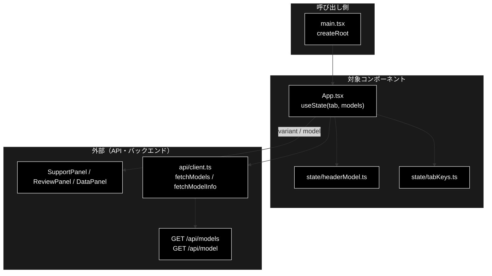
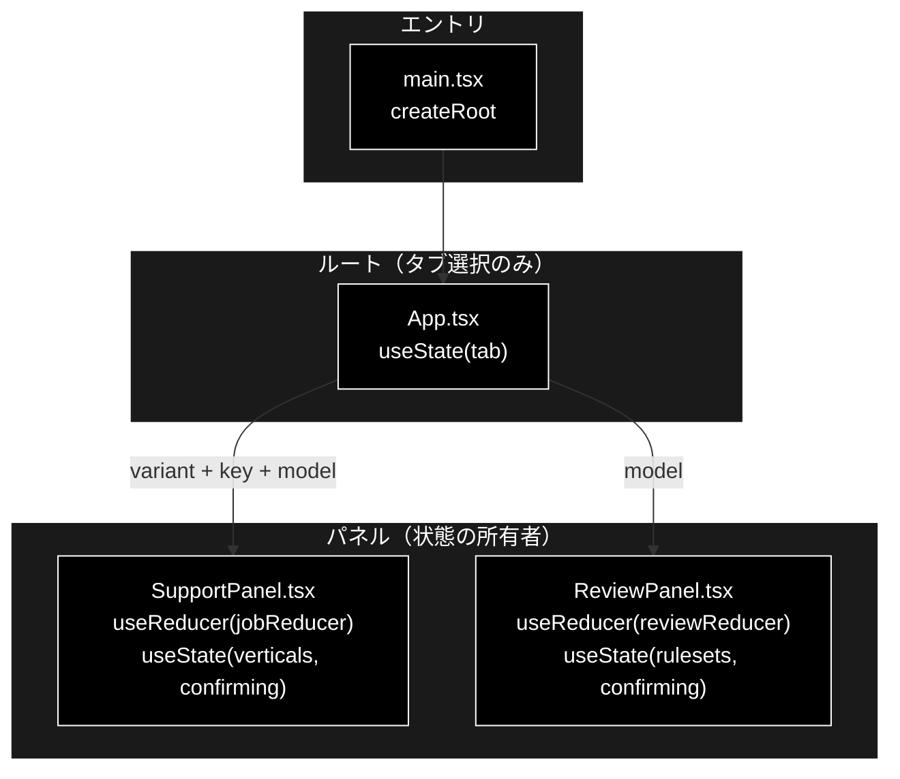
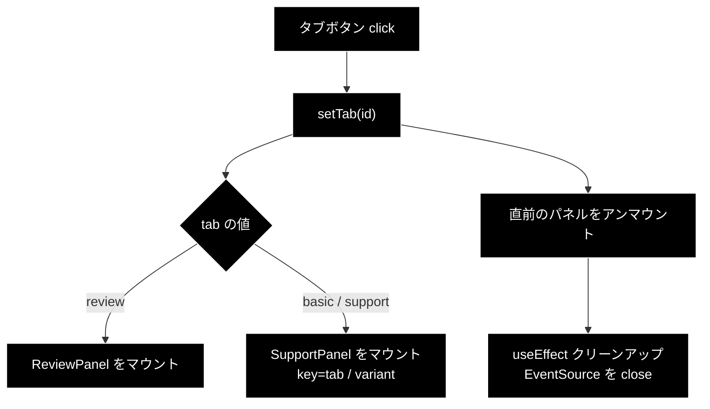
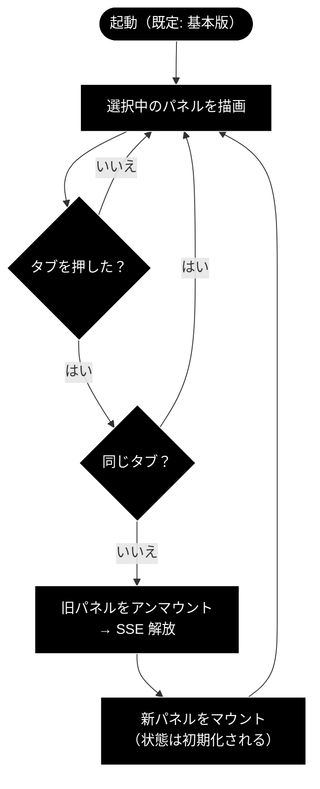

# App.tsx - 4 タブのルートコンテナ ドキュメント

**Version 1.2** | 最終更新: 2026-09-24

---

## 目次

1. [概要](#概要)
2. [コンポーネントツリー図](#12-コンポーネントツリー図)
3. [Props インターフェース](#2-props-インターフェース)
4. [状態管理](#3-状態管理)
5. [データフロー・副作用](#4-データフロー副作用)
6. [ユーザー操作フロー](#5-ユーザー操作フロー)
7. [型定義とバックエンド対応](#6-型定義とバックエンド対応)
8. [スタイル・アクセシビリティ](#7-スタイルアクセシビリティ)
9. [テスト](#8-テスト)
10. [変更履歴](#9-変更履歴)

---

## 概要

| 項目 | 内容 |
|---|---|
| ファイル | `frontend/src/App.tsx` |
| 種別 | **コンテナコンポーネント**（タブ選択・ヘッダーのモデル選択の `useState` ＋ モデル情報取得の `useEffect`） |
| 親 | `main.tsx`（`createRoot`） |
| 子 | `SupportPanel`（基本版 / Support の 2 用途）・`ReviewPanel`・`DataPanel` |
| 主な依存 | `./components/SupportPanel` / `./components/ReviewPanel` / `./components/DataPanel` / `./state/headerModel` / `./api/client`（`fetchModelInfo` / `fetchModels`） |
| 対応バックエンド | `GET /api/model` / `GET /api/models`（ヘッダーのモデルセレクタ。ジョブ系 API は子パネルが呼ぶ） |

`App.tsx` は**タブの選択とヘッダーのモデル選択**を持つ薄いルート。ジョブ状態・SSE 購読・
承認状態は**各パネルが自分で持つ**ため、`App` は reducer を持たない。

タブは 4 つ。前 3 つ（下表）の並びは「**業界特化を足していく順**」で、
4 つ目の「データ管理」（`<DataPanel />`）はデータを準備する側である。

| タブ | 業界特化 | 描画されるもの |
|---|---|---|
| **基本版** | なし | `<SupportPanel variant="basic" />` |
| **GRACE-Support** | `VerticalProfile`（gov / saas / ec） | `<SupportPanel variant="vertical" />` |
| **GRACE-Review** | `RuleSet`（ec_ad） | `<ReviewPanel />` |

### 主な責務

- 4 つのタブを提示し、選択されたパネルだけを描画する
- 非アクティブなパネルを**アンマウント**して、離れた側の `EventSource` を確実に閉じる
- 基本版 / Support で `SupportPanel` を**複製せず** `variant` で振り分ける
- `key={tab}` を与えて、基本版 ⇄ Support の切替時にパネルを作り直させる
- `h1` にアクティブなタブ名を出す
- **ヘッダー（タイトル横）でモデルを選ばせる**。エージェントの 3 タブは 1 つ、データ管理タブは
  工程ごとに 2 つ（「① チャンキング」「② Q/A 作成」）。選択はスロットごとに `headerModels` で持ち、
  各パネルへ prop で渡す

### 各責務対応のモジュール

| # | 責務 | 対応モジュール | 説明 |
|---|---|---|---|
| 1 | 4 タブの提示と描画 | `App.tsx` | `TABS` と `tab` の `useState` |
| 2 | 非アクティブパネルのアンマウント | `App.tsx` | 条件レンダリングでアンマウントし、各パネルの `EventSource` を閉じさせる |
| 3 | `SupportPanel` の共用 | `App.tsx` / `SupportPanel.tsx` | `variant="basic"` / `"vertical"` で振り分け |
| 4 | `key={tab}` による作り直し | `App.tsx` | 基本版 ⇄ Support の切替で state を持ち越さない |
| 5 | `h1` のタブ名 | `App.tsx` | アクティブなタブのラベルを見出しへ |
| 6 | ヘッダーのモデル選択 | `App.tsx` / `state/headerModel.ts` / `api/client.ts` | 選択肢は `fetchModels`、既定値は `fetchModelInfo`。並べ方・表示値は `headerModel.ts` |

### 主要機能一覧

| 機能 | 実装 | 説明 |
|---|---|---|
| タブ定義 | `TABS` 定数 | `id` / `label` / `description` の 3 つ組 |
| タブ選択 | `useState<Tab>('basic')` | **既定は基本版** |
| パネル振り分け | 条件レンダリング | `review` なら `ReviewPanel`、他は `SupportPanel` |
| 業界特化の有無 | `variant` prop | `tab === 'basic' ? 'basic' : 'vertical'` |
| 再マウント強制 | `key={tab}` | 基本版 ⇄ Support の状態持ち越しを防ぐ |
| モデル選択 | ヘッダーの `<select className="model-badge-select">` | 並べる内容は `headerSlots(tab, modelInfo)`。未選択時はサーバーの既定モデル名を表示（`headerSelectValue`） |

---

## 1. アーキテクチャ構成図

### 1.1 システム全体での位置づけ



**データフロー**:

1. マウント時に `fetchModels` / `fetchModelInfo` でモデルの選択肢と既定値を取得する
2. タブ選択とタブごとのモデル選択を `useState` で保持し、ヘッダーに表示する
3. 選択中のタブのパネルだけを描画し、`model` を prop で渡す（ジョブ系 API はパネル側が呼ぶ）

### 1.2 コンポーネントツリー図



> 📝 **状態は `App` に無い。** ジョブ・SSE・承認の状態はすべてパネル側にある。
> `App` が持つのは `tab`（どれを描くか）だけである。

---

## 2. Props インターフェース

**Props なし**（`export default function App()`）。ルートコンポーネントのため
外部から渡される値はない。

### 子へ渡す props

| 子 | 渡す props | 内容 |
|---|---|---|
| `SupportPanel` | `variant` / `key` / `model` | `variant` は `'basic'` or `'vertical'`。`key` は `tab` の値。`model` は `headerModels.basic` / `.support` |
| `ReviewPanel` | `model` | `headerModels.review` |
| `DataPanel` | `chunkingModel` / `qaModel` | `headerModels.chunking` / `.qa` |

---

## 3. 状態管理

### 3.1 ローカル state（`useState`）

| 変数 | 型 | 初期値 | 更新契機 | 説明 |
|---|---|---|---|---|
| `tab` | `'basic' \| 'support' \| 'review' \| 'data'` | `'basic'` | タブボタンの `click` | 表示するパネル。**既定は基本版** |
| `modelInfo` | `ModelInfo \| null` | `null` | 初回の `fetchModelInfo()` | サーバーの既定モデル名（未選択時にセレクタへ出す値） |
| `models` | `ModelChoice[]` | `[]` | 初回の `fetchModels()` | セレクタの選択肢。取得失敗なら空（既定モデルだけの選択肢に縮退） |
| `headerModels` | `HeaderModels` | `INITIAL_HEADER_MODELS`（全スロット `''`） | ヘッダーのセレクタ変更 | スロット（`basic` / `support` / `review` / `chunking` / `qa`）ごとの選択。**空文字は「サーバーの既定値」**。`App` はアンマウントされないのでタブを切り替えても残る |

### 3.2 reducer state（`useReducer`）

**なし。** ジョブ状態は各パネルが自分の reducer（`jobReducer` / `reviewReducer`）で持つ。

### 3.3 親から渡る状態（props 由来）

**なし。** ルートコンポーネントのため親が存在しない。

### 3.4 派生値

| 値 | 導出 | 用途 |
|---|---|---|
| `active` | `TABS.find((t) => t.id === tab) ?? TABS[0]` | `h1` に出すタブ名。見つからない場合は先頭（基本版）へフォールバック |
| `variant` | `tab === 'basic' ? 'basic' : 'vertical'` | `SupportPanel` へ渡す業界特化の有無 |
| `slots` | `headerSlots(tab, modelInfo)` | ヘッダーに並べるセレクタ（見出し・スロット・既定モデル） |

---

## 4. データフロー・副作用

### 4.1 副作用一覧（`useEffect`）

| # | 目的 | 依存配列 | クリーンアップ | 備考 |
|---|---|---|---|---|
| 1 | 既定モデル名の取得（`GET /api/model`） | `[]` | `alive = false` | 失敗しても画面を壊さない |
| 2 | モデルの選択肢の取得（`GET /api/models`） | `[]` | `alive = false` | 失敗しても出さない。既定モデルだけの選択肢に縮退し、サーバーは設定どおりのモデルで走る |

ジョブ系 API と SSE 購読は各パネルの責務である。

> 📝 **モデルの選択はヘッダーで行う**（2026-09-23 以降・全タブ・grace_v2 と同じ）。
> 以前は各フォームに `ModelSelect` があり、ヘッダーは既定値の表示だけだった。
> データ管理タブはチャンキングと Q/A 作成で**別々のモデルを選べる**よう 2 つ並べる
> （既定はどちらも `ModelInfo.model`）。

### 4.2 アンマウントによる SSE 解放

```tsx
{tab === 'data' ? (
  <DataPanel chunkingModel={headerModels.chunking} qaModel={headerModels.qa} />
) : tab === 'review' ? (
  <ReviewPanel model={headerModels.review} />
) : (
  <SupportPanel
    key={tab}
    variant={tab === 'basic' ? 'basic' : 'vertical'}
    model={headerModels[tab === 'basic' ? 'basic' : 'support']}
  />
)}
```

| 仕組み | 効果 |
|---|---|
| **条件レンダリング**（CSS の hide ではない） | 非アクティブなパネルが**アンマウント**され、`useEffect` のクリーンアップで `EventSource` が閉じる |
| **`key={tab}`** | 基本版 ⇄ Support は同じ `SupportPanel` 型なので、`key` が無いと React がインスタンスを**再利用**する。`key` を変えることで別コンポーネント扱いになり確実に作り直される |

> ⚠️ **`key={tab}` は必須。** これが無いと基本版 → Support と切り替えたときに、
> 前のタブの reducer 状態（実行中のジョブ・タイムライン・結果）と SSE 購読が
> **そのまま残る**。`variant` だけが変わって中身が引き継がれるため、
> 「基本版で実行した結果が Support タブに出ている」という状態になる。

> 📝 **サーバ側のジョブは走り続ける。** タブを離れるとブラウザは購読をやめるが、
> バックエンドのワーカースレッドは最後まで実行される。戻っても購読は復元されない。

### 4.3 データフロー図



---

## 5. ユーザー操作フロー

### 5.1 イベントハンドラ一覧

| 要素 | イベント | ハンドラ | 効果 | 無効化条件 |
|---|---|---|---|---|
| タブボタン ×3 | `click` | `() => setTab(t.id)` | パネルを切り替える | **なし**（実行中でも切替可能） |

> 📝 **実行中でもタブを切り替えられる。** `disabled` は付けていない。切り替えると
> 購読は切れるがサーバ側の処理は継続するため、UI が固まることはない。

### 5.2 操作フロー図



---

## 6. 型定義とバックエンド対応

| TS 型 | 定義場所 | 対応する Python | 備考 |
|---|---|---|---|
| `Tab` | 本ファイル（ローカル） | — | UI 内部のみ。バックエンドに対応物なし |
| `SupportVariant` | `components/SupportPanel.tsx` | — | 同上 |

`App.tsx` は API を直接呼ばないため、バックエンド由来の型を持たない。

---

## 7. スタイル・アクセシビリティ

| 項目 | 内容 |
|---|---|
| スタイル方式 | プレーン CSS（`src/styles.css`）。CSS-in-JS・Tailwind は不使用 |
| 主要クラス | `.app`, `.tabs`, `.tab`, `.tab.active`, `.tab-sub` |
| ダークモード | 未対応 |

### アクセシビリティ・チェック

| 観点 | 状態 | 補足 |
|---|:--:|---|
| タブに `role="tablist"` / `role="tab"` があるか | ✅ | `nav.tabs` に `role="tablist"`、各ボタンに `role="tab"` |
| 選択状態が支援技術へ伝わるか | ✅ | `aria-selected={t.id === tab}` |
| キーボードで切り替えられるか | ✅ | `<button>` 要素なので Tab / Enter で操作可能 |
| 矢印キーでのタブ移動（WAI-ARIA 準拠） | ❌ | 未実装。左右キーでの移動には対応していない |
| `role="tabpanel"` と `aria-controls` の対応付け | ❌ | パネル側に `tabpanel` を付けていない |
| 状態表示が色のみに依存していないか | ✅ | アクティブタブは `.active` の枠線＋説明文で区別 |

---

## 8. テスト

| テストファイル | 対象 | 実行 |
|---|---|---|
| `src/state/headerModel.test.ts` | ヘッダーのモデルセレクタ（タブごとのスロット・表示値・選択肢・論理層の注記） | `npm test`（16 件） |
| `src/state/tabKeys.test.ts` | タブの矢印キー移動 | `npm test` |

**`App.tsx` 自体のレンダリングテストは未整備**（判断は上記の純関数へ出してある）。 `@testing-library/react` を導入していないため、
JSX のレンダリングテストは持たない。ガードは以下 2 つ。

| 手段 | 何を守るか |
|---|---|
| `tsc --noEmit`（`npm run lint`） | `variant` / `Tab` の型不整合 |
| 目視確認 | タブ切替時の SSE 解放・状態の作り直し |

> ⚠️ **`key={tab}` の欠落は型検査で捕まらない。** 消しても `tsc` は通り、
> vitest も落ちない。変更する場合は実際にタブを往復して、前のタブの
> タイムラインが残らないことを確認すること。

---

## 9. 変更履歴

| 版 | 日付 | 変更内容 |
|---|---|---|
| 1.2 | 2026-09-24 | `a_react_page_md_format.md` v1.1 に追随（2026-09-24）。概要に「各責務対応のモジュール」（主な責務と 1:1）を追加し、`## 1.` を「アーキテクチャ構成図」として **1.1 システム全体での位置づけ（3 層）** と 1.2 コンポーネントツリー図の 2 枚構成にした。Mermaid の `classDef subgraphStyle` の欠落を補った。主な責務の「3 つのタブ」を実装（`TABS` は 4 件）に合わせて「4 つ」へ是正した |
| 1.1 | 2026-09-23 | **モデルの選択をヘッダーへ移した**（grace_v2 と同じ変更）。「利用モデル名」の表示をセレクタにし、データ管理タブは工程ごとに 2 つ並べる。`modelInfo` / `models` / `headerModels` の state と取得の `useEffect` 2 本を追記。あわせて 4 タブ目（データ管理）への言及を足した（本書は v1.0 のまま 3 タブ時代の記述が残っていた。矢印キー移動などの細部は未追随） |
| 1.0 | 2026-08-01 | 初版作成。3 タブ化（基本版 / GRACE-Support / GRACE-Review）後の実装に基づく。`key={tab}` が必要な理由と、それが型検査では守られない点を明記 |
