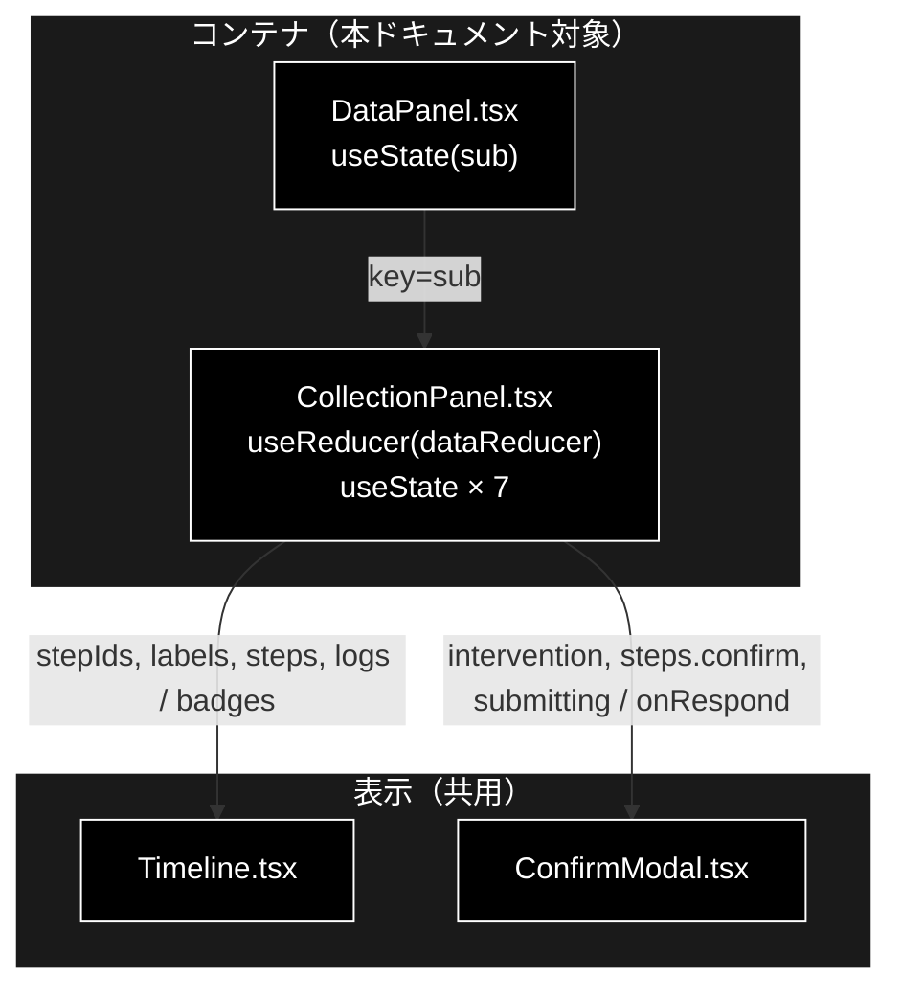
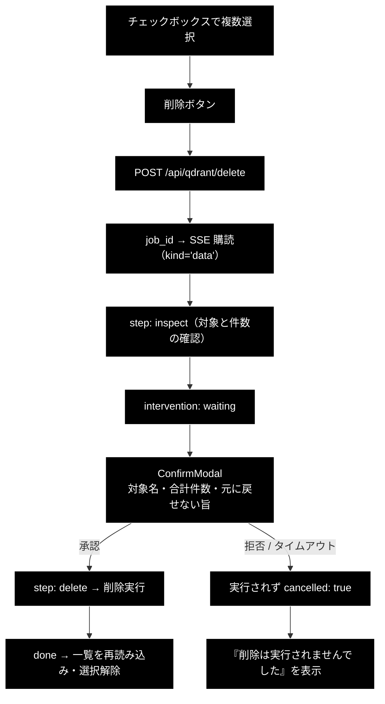
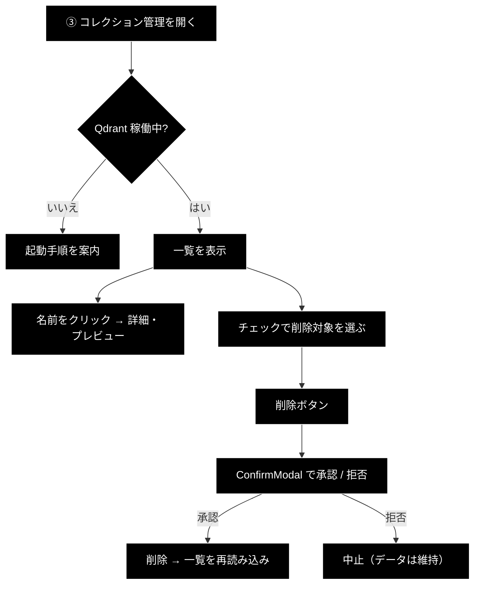

# CollectionPanel.tsx - コレクション管理（一覧・詳細・削除） ドキュメント

**Version 1.1** | 最終更新: 2026-08-05

---

## 目次

- [概要](#概要)
- [1. コンポーネントツリー図](#1-コンポーネントツリー図)
- [2. Props インターフェース](#2-props-インターフェース)
- [3. 状態管理](#3-状態管理)
- [4. データフロー・副作用](#4-データフロー副作用)
- [5. API 通信・SSE イベント](#5-api-通信sse-イベント)
- [6. ユーザー操作フロー](#6-ユーザー操作フロー)
- [7. 型定義とバックエンド対応](#7-型定義とバックエンド対応)
- [8. スタイル・アクセシビリティ](#8-スタイルアクセシビリティ)
- [9. テスト](#9-テスト)
- [10. 変更履歴](#10-変更履歴)

---

## 概要

| 項目 | 内容 |
|---|---|
| ファイル | `frontend/src/components/CollectionPanel.tsx` |
| 種別 | コンテナコンポーネント（`useReducer` + `useState` × 7 + `useEffect` × 3 + `useRef`） |
| 親 | `DataPanel.tsx`（サブタブ「③ コレクション管理」） |
| 子 | `Timeline.tsx`、`ConfirmModal.tsx` |
| 主な依存 | `../api/client`, `../state/dataReducer` |
| 対応バックエンド | `backend/app/api/qdrant.py`（参照）、`backend/app/api/data.py`（削除） |

### 主な責務

- Qdrant の稼働確認と、落ちているときの**復旧手順の案内**。
- コレクション一覧（名前・ポイント数・状態）の表示と再読み込み。
- 選択したコレクションの詳細（ベクトル次元・距離関数・データ元）の表示。
- ポイントのプレビュー（**列がコレクションごとに違う**ため動的に列を組む）。
- 複数選択して削除する。**削除は必ず承認を経る。**
- 削除完了後に一覧を自動で取り直す。

### 削除を「ジョブ + 承認」にしている理由

コレクション削除は**不可逆**である。HTTP の `DELETE` メソッドで単発に実行できると、
誤クリックでデータが消える。そこで:

1. `POST /api/qdrant/delete` でジョブを起動する
2. バックエンドが対象と件数を確認し、`intervention` を流す
3. `ConfirmModal` で対象名と合計件数を提示する
4. 承認して初めて削除する（拒否・タイムアウトなら実行しない）

承認 UI は Support / Review と同じ `ConfirmModal` を**そのまま再利用**しており、
削除専用のモーダルは作っていない。

### 主要機能一覧

| 機能 | 実装 | 説明 |
|---|---|---|
| 稼働確認 | `fetchQdrantHealth()` | **落ちていても 200** なので `available` で判定 |
| 一覧 | `fetchCollections()` | 名前・ポイント数・状態 |
| 詳細 | `fetchCollectionDetail(name)` | ベクトル設定＋データ元の集計 |
| プレビュー | `fetchCollectionPoints(name, 20)` | 列は `columns` の順で描く |
| 複数選択 | `useState<Set<string>>` | チェックボックス |
| 削除 | `startDelete(targets)` → SSE → 承認 | 不可逆なので必ず承認 |
| 自動リロード | `useEffect`（完了時） | 削除後に一覧を取り直す |

---

## 1. コンポーネントツリー図



---

## 2. Props インターフェース

**Props なし**（`export function CollectionPanel()`）。

一覧・選択・削除の状態はすべて自分が持ち、親へは通知しない。

---

## 3. 状態管理

### 3.1 ローカル state（`useState`）

| 変数 | 型 | 初期値 | 更新契機 | 説明 |
|---|---|---|---|---|
| `health` | `QdrantHealth \| null` | `null` | `reload()` | Qdrant の稼働状態 |
| `collections` | `CollectionInfo[]` | `[]` | `reload()` | 一覧 |
| `loading` | `boolean` | `false` | `reload()` の前後 | 再読み込み中 |
| `loadError` | `string \| null` | `null` | `reload()` 失敗時 | 取得エラー |
| `selected` | `string \| null` | `null` | 名前クリック | 詳細を出すコレクション |
| `detail` | `CollectionDetail \| null` | `null` | `useEffect`（selected 変更時） | 詳細 |
| `points` | `CollectionPoints \| null` | `null` | 同上 | プレビュー |
| `checked` | `Set<string>` | `new Set()` | チェックボックス | 削除対象 |
| `confirming` | `boolean` | `false` | 承認送信時 | 二重送信の防止 |

> `selected`（詳細表示）と `checked`（削除対象）は**別の状態**である。
> 詳細を見ているコレクションが削除対象とは限らないため、意図的に分けている。

### 3.2 reducer state（`useReducer`）

```tsx
const [state, dispatch] = useReducer(dataReducer, 'delete', initialDataState);
```

`dataReducer` を **`kind='delete'`** で初期化する。ステップは
`inspect` / `confirm` / `delete` の 3 つ。

フィールドとアクションは [`DataJobPanel.md`](./DataJobPanel.md) §3.2 と同じ。

### 3.3 親から渡る状態（props 由来）

**なし。**

---

## 4. データフロー・副作用

### 4.1 副作用一覧（`useEffect`）

| # | 目的 | 依存配列 | クリーンアップ | 備考 |
|---|---|---|---|---|
| 1 | 初回ロード | `[reload]` | `unsubscribeRef.current?.()` を返す | `reload` は `useCallback([])` なので実質マウント時 1 回 |
| 2 | 詳細・プレビューの取得 | `[selected]` | `cancelled = true` を返す | 選択が変わったら古い応答を捨てる |
| 3 | 削除完了後の再読み込み ＋ 記憶の破棄 | `[state.phase, state.result, reload]` | なし | 状態を見て一度だけ走る。購読を張らないので解除不要 |
| 4 | **前回ジョブの再購読** | `[subscribe]` | `cancelled = true` を返す | 承認待ちのまま離脱して戻ったときにモーダルを取り戻す |

```tsx
// #1 — 初回ロード + アンマウント時の SSE 解除
useEffect(() => {
  void reload();
  return () => unsubscribeRef.current?.();
}, [reload]);

// #3 — 削除が成功したときだけ一覧を取り直す
useEffect(() => {
  if (state.phase !== 'completed' || !state.result) return;
  if (state.result.cancelled) return;      // 中止なら何も変わっていない
  setChecked(new Set());
  setSelected(null);
  void reload();
}, [state.phase, state.result, reload]);
```

> ⚠️ **#3 で `cancelled` を見るのが重要。** 承認を拒否した場合もジョブは
> `completed` で終わる（失敗ではない）。`cancelled` を見ずに再読み込みすると
> 「何も消えていないのに選択が解除される」ため、拒否したことが分かりにくくなる。

### 4.1.1 承認待ちのまま離脱しても取り戻せる

サブタブを離れるとアンマウントされ、承認モーダルごと消える。バックエンドの
`resolver` は承認が来るまでブロックし続けるため、**戻る手段が無いとタイムアウトまで
放置される**ことになる。

`state/activeJobs.ts` に `job_id` を残し、再マウント時に購読し直すことで解決している。
`Job.stream_events()` は常に index 0 からリプレイするので、**承認待ちの
`intervention` イベントも含めて**復元される。

```tsx
const remembered = recallJob('delete');
void fetchDataJobStatus(remembered)
  .then(() => { dispatch({ type: 'started', jobId: remembered, kind: 'delete' }); subscribe(remembered); })
  .catch(() => forgetJob('delete'));   // 404 = GC 済み。黙って忘れる
```

> `DataJobPanel` と違い、**完了したら記憶を捨てる**（#3）。削除後に見たいのは
> 更新された一覧であって、済んだ削除のタイムラインではないため。

### 4.2 削除フロー



### 4.3 Qdrant が落ちているとき

`GET /api/qdrant/health` は**落ちていても 200** を返す（`available: false`）。
503 にしないのは、画面側でエラーと案内を出し分けるためである。

| 状態 | 表示 |
|---|---|
| `available: true` | `Qdrant: 稼働中（http://localhost:6333）` |
| `available: false` | ⚠️ バナー ＋ `docker-compose ... up -d` の案内 |

一覧の取得（`fetchCollections`）は失敗しうるので `.catch(() => [])` で
空配列に倒し、**ヘルス情報の表示を優先**する（一覧が取れないことより
「Qdrant が落ちている」ことの方が知りたい情報のため）。

### 4.4 列が可変であることへの対処

```tsx
{points.columns.map((column) => <th key={column}>{column}</th>)}
...
{points.columns.map((column) => (
  <td key={column}>{row[column] == null ? '' : String(row[column])}</td>
))}
```

payload のキーはコレクションごとに違うため、**列を固定できない**。
バックエンドが `columns`（出現順）と `rows` を別に返し、画面はその順で描く。

`row[column]` が `undefined`（そのレコードにキーが無い）や `null`
（バックエンドが NaN を寄せた値）になりうるので、`== null` でまとめて空欄にする。

---

## 5. API 通信・SSE イベント

### 5.1 呼び出す API

| 関数 | メソッド | パス | 用途 |
|---|---|---|---|
| `fetchQdrantHealth` | GET | `/api/qdrant/health` | 稼働確認 |
| `fetchDataJobStatus` | GET | `/api/data/result/{job_id}` | 再購読前の存在確認 |
| `fetchCollections` | GET | `/api/qdrant/collections` | 一覧 |
| `fetchCollectionDetail` | GET | `/api/qdrant/collections/{name}` | 詳細 |
| `fetchCollectionPoints` | GET | `/api/qdrant/collections/{name}/points?limit=20` | プレビュー |
| `startDelete` | POST | `/api/qdrant/delete` | 削除ジョブの起動 |
| `subscribeStream` | GET(SSE) | `/api/data/stream/{job_id}` | 進捗の購読（`kind='data'`） |
| `confirmDataIntervention` | POST | `/api/data/confirm/{job_id}` | HITL 応答 |

### 5.2 削除ジョブのステップ

| step | ラベル | バッジ |
|---|---|---|
| `inspect` | ① 削除対象の確認 | `対象 N 件` |
| `confirm` | ② HITL CONFIRM（承認が必要） | `承認済み` / `中止` |
| `delete` | ③ 削除実行 | `削除 N 件` |

---

## 6. ユーザー操作フロー

### 6.1 イベントハンドラ一覧

| 要素 | イベント | ハンドラ | 効果 | 無効化条件 |
|---|---|---|---|---|
| 再読み込みボタン | `click` | `reload()` | 一覧とヘルスを取り直す | `loading` または `running` |
| 削除ボタン | `click` | `runDelete()` | 削除ジョブを起動 | `checked.size === 0` または `running` |
| チェックボックス | `change` | `toggleChecked(name)` | 削除対象の追加 / 除外 | `running` |
| コレクション名 | `click` | `setSelected(...)` | 詳細の表示 / 非表示（トグル） | **なし** |
| 承認 / 拒否 | `click` | `respond(bool)` | HITL 応答 | `confirming` |

> 名前クリックだけは実行中でも無効化していない。詳細の閲覧は非破壊で、
> 削除の進行を妨げないため。

### 6.2 操作フロー図



---

## 7. 型定義とバックエンド対応

| TS 型（`src/types.ts`） | 対応する Python | 定義元 |
|---|---|---|
| `QdrantHealth` | `QdrantHealth` | `backend/app/schemas.py` |
| `CollectionInfo` | `CollectionInfo` | 同上 |
| `CollectionDetail` | `CollectionDetail` | 同上 |
| `CollectionSource` | `fetch_collection_source_info` の戻り 1 件 | `services/qdrant_service.py` |
| `CollectionPoints` | `CollectionPoints` | `backend/app/schemas.py` |
| `DataJobResult` | `_delete_runner` の戻り dict | `backend/app/core/data_jobs.py` |

### `vector_size` / `distance` が `unknown` である理由

```typescript
vector_size: unknown;
distance: unknown;
```

Qdrant の Named vectors 構成では、`fetch_collection_info()` が
**数値ではなく dict** を返す（ベクトル名 → サイズの対応）。
片方に決め打つと実行時に `[object Object]` が出るため、
`unknown` にして `String(...)` で表示している。

> ⚠️ **バックエンドのスキーマを変えたら TS 型も追随させる。**
> `frontend` は blocking な CI ゲートなので、型がズレると PR がマージできなくなる。

---

## 8. スタイル・アクセシビリティ

| 項目 | 内容 |
|---|---|
| スタイル方式 | プレーン CSS（`src/styles.css`） |
| 主要クラス | `.collection-toolbar`, `.collection-list`, `.collection-table`, `.collection-detail`, `.collection-points`, `.link-button`, `.health-ok`, `.health-ng`, `.warn-banner`, `.error-banner` |
| 削除ボタン | `.collection-toolbar button.danger`（赤背景） |
| ダークモード | 未対応 |

### アクセシビリティ・チェック

| 観点 | 状態 |
|---|---|
| フォーム要素に `label` が対応しているか | ✅ チェックボックスに `aria-label="{name} を削除対象に選ぶ"` |
| モーダルにフォーカストラップがあるか | ❌ `ConfirmModal` 側の未対応項目 |
| 状態表示が色のみに依存していないか（記号併用） | ✅ Qdrant の状態は「稼働中」「停止」と**文言**。削除ボタンも「選択した N 件を削除」と件数入り |
| キーボードのみで操作できるか | ✅ すべてネイティブ `<button>` / `<input type="checkbox">`。コレクション名も `<button className="link-button">`（`<a>` や `<span onClick>` ではない） |
| 表にヘッダセルがあるか | ✅ `<th scope="col">` |
| 削除の危険性が事前に伝わるか | ✅ ボタンに `title="削除には承認が必要です"`、モーダルに「元に戻せません」 |
| エラーが支援技術に伝わるか | ✅ `.error-banner` / `.warn-banner` に `role="alert"` |
| 削除の進捗が支援技術に伝わるか | ✅ `Timeline` のライブ領域が実行中ステップを読み上げる |
| 一覧の更新そのものが支援技術に伝わるか | ❌ 一覧テーブルに `aria-live` は付けていない（行数が多いと読み上げが長すぎるため）。削除完了は Timeline のライブ領域が伝える |
| 選択件数が支援技術に伝わるか | ✅ ボタン文言に件数が入るので、フォーカス時に読み上げられる |

> 上記 ❌ は既知の未対応。消さずに残す。

---

## 9. テスト

| テストファイル | 対象 | ケース数 | 実行 |
|---|---|:---:|---|
| `src/state/dataReducer.test.ts` | 削除ジョブの畳み込み（`kind='delete'` を含む） | 21 | `npm test` |
| （本コンポーネントの専用テストなし） | — | — | — |

**バックエンド側で削除の安全性を検証している。**
`backend/tests/test_data_jobs.py` に以下がある:

| テスト | 検証内容 |
|---|---|
| `test_delete_rejected_does_not_delete` | 拒否したら `delete_collection` を呼ばない |
| `test_delete_timeout_does_not_delete` | タイムアウトでも呼ばない |
| `test_delete_endpoint_rejection_keeps_data` | API 経由でも同じ |
| `test_delete_confirm_message_includes_counts` | 承認画面に対象名と件数が出る |

これらは**承認ゲートを外した実装に当てて fail することを確認済み**。

### テスト方針

- `@testing-library/react` 未導入のため JSX のレンダリングテストは無く、
  `tsc --noEmit` でガードしている。
- 削除の安全性はフロントの見た目ではなく**バックエンドの経路**で担保する
  （画面を迂回して API を叩かれても承認なしには消えない）。

---

## 10. 変更履歴

| 版 | 日付 | 変更内容 |
|---|---|---|
| 1.0 | 2026-08-05 | 初版作成 |
| 1.1 | 2026-08-05 | 承認待ちのまま離脱すると取り戻せない不具合を修正（`activeJobs` による再購読）。`role="alert"` を追加 |
