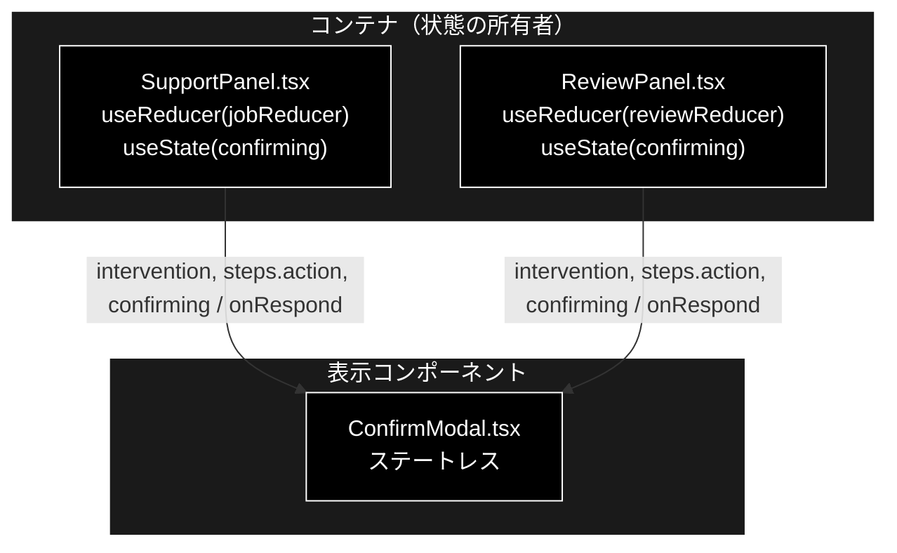
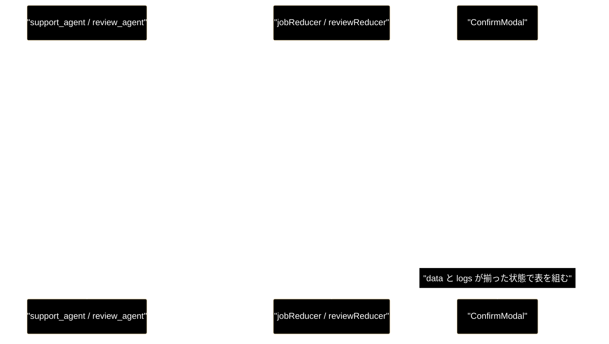
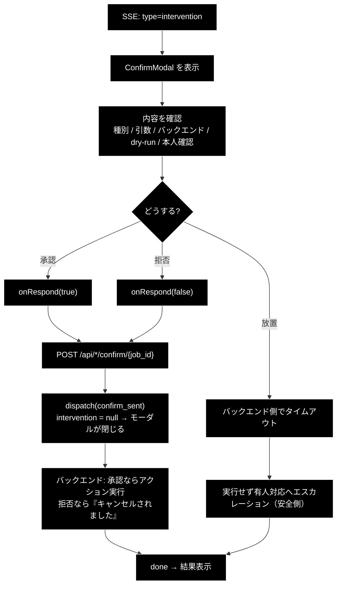

# ConfirmModal.tsx - HITL CONFIRM 承認モーダル ドキュメント

**Version 1.0** | 最終更新: 2026-08-01

---

## 目次

- [概要](#概要)
- [1. コンポーネントツリー図](#1-コンポーネントツリー図)
- [2. Props インターフェース](#2-props-インターフェース)
- [3. 状態管理](#3-状態管理)
- [4. データフロー・副作用](#4-データフロー副作用)
- [5. API 通信・SSE イベント](#5-api-通信sse-イベント)
- [6. ユーザー操作フロー](#6-ユーザー操作フロー)
- [7. 型定義とバックエンド対応](#7-型定義とバックエンド対応)
- [8. スタイル・アクセシビリティ](#8-スタイルアクセシビリティ)
- [9. テスト](#9-テスト)
- [10. 変更履歴](#10-変更履歴)

---

## 概要

| 項目 | 内容 |
|---|---|
| ファイル | `frontend/src/components/ConfirmModal.tsx` |
| 種別 | 表示コンポーネント（ステートレス） |
| 親 | `SupportPanel.tsx` と `ReviewPanel.tsx` の**両方**（唯一の共用コンポーネント） |
| 子 | なし |
| 主な依存 | `../types`（`InterventionInfo`） |
| 対応バックエンド | `backend/app/core/intervention_bridge.py`（intervention イベント）、`backend/app/core/support_agent.py` / `review_agent.py`（`_perform_action`） |

### 主な責務

- **副作用のあるアクションを実行する前に、人間の承認を必ず取る**（HITL CONFIRM）。承認なしにアクションは実行されない。
- 何を実行しようとしているか（`action_type` / `args` / バックエンド / dry-run 可否）を隠さず提示する。
- 本人確認ステップが走っていればその結果を示す。
- タイムアウト時の挙動（実行せず有人対応へ）を事前に明示する。
- 送信中（`submitting`）は両ボタンを `disabled` にして二重送信を防ぐ。

### 主要機能一覧

| 機能 | 実装 | 説明 |
|---|---|---|
| 背景オーバーレイ | `<div className="modal-backdrop">` | クリックしても閉じない（誤操作で承認機会を失わせない） |
| ダイアログ | `role="dialog" aria-modal="true" aria-label="アクション実行の承認"` | 支援技術へダイアログであることを伝える |
| アクション内容表 | `<table className="modal-table">` | 種別 / 引数 / バックエンド / 本人確認 / 理由 / タイムアウト |
| 引数の生表示 | `<pre>{JSON.stringify(data.args ?? {}, null, 2)}</pre>` | 整形せず生の JSON を出す（何が送られるかを隠さない） |
| 本人確認行 | `actionStep.logs.find((line) => line.includes('本人確認'))` | ログ行から抽出。無ければ行ごと非表示 |
| 承認 | `onRespond(true)` | 「承認して実行（PROCEED）」 |
| 拒否 | `onRespond(false)` | 「拒否（実行しない）」 |
| 二重送信防止 | `disabled={submitting}` | 両ボタンに付与 |

---

## 1. コンポーネントツリー図



> **2 つの親から共用される唯一のコンポーネント。** これを成立させているのが
> `ActionStepView` という**構造的な受け口**である（§2.2）。

---

## 2. Props インターフェース

### 2.1 `Props`

```typescript
interface Props {
  intervention: InterventionInfo;
  actionStep: ActionStepView; // ⑥/⑦ の step started イベント（action_type/args/backend/dry_run）
  submitting: boolean;
  onRespond: (approve: boolean) => void;
}
```

| Prop | 型 | 必須 | 既定値 | 説明 |
|---|---|:---:|---|---|
| `intervention` | `InterventionInfo` | ✅ | — | intervention イベントの `data`。`state.intervention`（非 null のときだけ親が描画する） |
| `actionStep` | `ActionStepView` | ✅ | — | アクションステップの `data` / `logs`。Support は `state.steps.action`、Review も `state.steps.action` |
| `submitting` | `boolean` | ✅ | — | 送信中フラグ。親の `useState(confirming)`。`true` の間は両ボタンを `disabled` |
| `onRespond` | `(approve: boolean) => void` | ✅ | — | 承認（`true`）／拒否（`false`）を親へ返す |

### 2.2 `ActionStepView` — 共用を可能にする構造的な型

```typescript
/**
 * アクションステップの表示に必要な部分だけを構造的に受ける。
 * Support の `StepState` と Review の `ReviewStepState` の両方が当てはまるため、
 * 本モーダルは両エージェントで共用できる。
 */
export interface ActionStepView {
  data: Record<string, unknown>;
  logs: string[];
}
```

| 型 | `id` の型 | `status` | `logs` | `data` | `ActionStepView` に代入可能か |
|---|---|---|---|---|:---:|
| `StepState`（`state/jobReducer.ts`） | `StepId` | `StepStatus` | `string[]` | `Record<string, unknown>` | ✅ |
| `ReviewStepState`（`state/reviewReducer.ts`） | `ReviewStepId` | `StepStatus` | `string[]` | `Record<string, unknown>` | ✅ |

`StepState` と `ReviewStepState` は `id` の型が違う（`StepId` vs `ReviewStepId`）ため
**共通の型として直接は使えない**。必要な 2 フィールドだけを持つ `ActionStepView` を
定義したことで、TypeScript の構造的部分型により両方が代入可能になっている。

> ⚠️ **`ActionStepView` に `id` や `status` を足すと共用が壊れる。** 追加した瞬間に
> `StepId` と `ReviewStepId` の非互換が表面化し、どちらかの親でコンパイルが通らなくなる。
> このプロパティ最小主義は意図的な設計である。

### 2.3 コールバックの契約

| コールバック | 呼ばれる条件 | 親側の責務 |
|---|---|---|
| `onRespond(true)` | 「承認して実行（PROCEED）」クリック（`submitting === false`） | `confirmIntervention(jobId, intervention_id, true)` → `dispatch({ type: 'confirm_sent' })` |
| `onRespond(false)` | 「拒否（実行しない）」クリック（`submitting === false`） | 同上、`approve=false` |

親（`SupportPanel` / `ReviewPanel`）の `respond` は同一形状:

```typescript
const respond = useCallback(async (approve: boolean) => {
  if (!state.jobId || !state.intervention) return;
  setConfirming(true);
  try {
    await confirmIntervention(state.jobId, state.intervention.intervention_id, approve);
    dispatch({ type: 'confirm_sent' });
  } catch (error) {
    dispatch({ type: 'failed', message: ... });
  } finally {
    setConfirming(false);
  }
}, [state.jobId, state.intervention]);
```

| 論点 | 説明 |
|---|---|
| `intervention_id` を渡すのは親 | モーダルは `intervention.intervention_id` を**表示にも送信にも使わない**。ID の取り回しは親の責務 |
| `finally` で `setConfirming(false)` | 失敗しても `submitting` が `true` のまま固まらない。ただしモーダル自体は `dispatch({type:'failed'})` で `phase='failed'` になるまで残る |
| モーダルを閉じるのは reducer | `confirm_sent` が `intervention` を `null` にする。**モーダルは自分で閉じない** |

---

## 3. 状態管理

### 3.1 ローカル state（`useState`）

**なし。** `useState` / `useReducer` / `useEffect` / `useRef` を一切持たない純表示コンポーネント。
送信中フラグすら親が持つ（`submitting` prop）。

### 3.2 reducer state（`useReducer`）

**なし。** `jobReducer` / `reviewReducer` は親が持つ。

### 3.3 親から渡る状態（props 由来）

| 値 | 供給元 | 本コンポーネントでの扱い |
|---|---|---|
| `intervention` | 親の `state.intervention`（`intervention` イベントで設定、`confirm_sent` で `null`） | 読み取りのみ |
| `actionStep` | 親の `state.steps.action`（`step` イベントの `data` と `log` イベントの蓄積） | 読み取りのみ |
| `submitting` | 親の `useState(confirming)` | 読み取りのみ。ボタンの `disabled` |

> **不変条件**: モーダルの表示・非表示は**親の条件付きレンダリング**（`{state.intervention && <ConfirmModal .../>}`）で決まる。
> モーダル内に「閉じる」状態を持たない。持たせると reducer の `intervention` と二重管理になり、
> 承認済みなのにモーダルが残る／未承認なのに消える、という不整合が起きる。

---

## 4. データフロー・副作用

### 4.1 副作用一覧（`useEffect`）

**なし。** フォーカス移動もスクロールロックも `Escape` キー購読も実装していない
（→ §8 のアクセシビリティ ❌ 項目）。

### 4.2 表示データの出どころ

モーダルの表は **2 つの別イベント**から組み立てられる。

| 表の行 | 値 | 出どころ |
|---|---|---|
| アクション種別 | `data.action_type` | `step` イベント（アクションステップの `step_started`） |
| 引数 | `data.args` | 同上（**Support のみ。Review は送っていない** → §7） |
| バックエンド | `data.backend` + `data.dry_run` | 同上 |
| 本人確認 | `actionStep.logs` から `'本人確認'` を含む行 | `log` イベント（`_perform_action` の識別子照合ログ） |
| 理由 | `intervention.reason` | `intervention` イベント |
| タイムアウト | `intervention.timeout_seconds` | 同上 |



> ⚠️ **順序が保証されている理由**: `_perform_action` は「本人確認 → CONFIRM の
> `handler.handle()`」の順で進む。intervention イベントは本人確認ログの**後**に出るため、
> モーダルが描画される時点で `logs` には既に本人確認行が入っている。
> この順序が逆転すると、本人確認行が空のままモーダルが出る。

### 4.3 防御的な既定値

| 式 | 値が無いときの表示 |
|---|---|
| `String(data.action_type ?? '不明')` | `不明` |
| `JSON.stringify(data.args ?? {}, null, 2)` | `{}` |
| `String(data.backend ?? '-')` | `-` |
| `data.dry_run === true ? '（dry-run: 実行せずログのみ）' : '（実行モード）'` | **`undefined` は「実行モード」扱い** |

> ⚠️ **`dry_run` の既定は「実行モード」に倒れる。** `data.dry_run` が届かなかった場合、
> `=== true` が偽になるため画面には「（実行モード）」と出る。実際には dry-run かもしれないので、
> **表示が実態より危険側に振れる**（＝ユーザーに慎重な判断をさせる）方向であり、この向きは正しい。
> 逆（未定義を dry-run 扱い）にすると、本当に実行されるのに「ログのみ」と伝えてしまう。

### 4.4 本人確認行の抽出

```typescript
const identityLog = actionStep.logs.find((line) => line.includes('本人確認'));
```

| 論点 | 説明 |
|---|---|
| 検索する文字列 | `'本人確認'`。バックエンドの `_perform_action` が出す `"   [action] 本人確認（{method}）: {status} — {detail}"` に一致する |
| 見つからないとき | 行ごと非表示（`{identityLog && <tr>...}`）。本人確認が不要なプロファイル（`require_identity=false`）や Review では常にこちら |
| **本人確認 NG のときは？** | このモーダル自体が出ない。`_perform_action` は未確認なら**その場で return** し、CONFIRM に進まないため。したがって表に出るのは実質「確認済み」の行だけ |

> ⚠️ **ログ本文への文字列マッチという脆い連結である。** バックエンドのログ文言から
> 「本人確認」の 4 文字が消えると、モーダルの本人確認行が**黙って消える**（型検査もテストも通る）。
> 構造化するなら `step_started` の `data` に `identity_result` を載せて `data` 経由で読むべきだが、
> 現状は未実装。

---

## 5. API 通信・SSE イベント

**本コンポーネント自身は API を呼ばない。** `fetch` / `EventSource` を一切使わず、
承認・拒否は `onRespond` で親へ委譲する。参考として親側の経路を示す。

### 5.1 親が呼ぶ API

| 関数 | メソッド | パス | 呼ぶ親 |
|---|---|---|---|
| `confirmIntervention` | POST | `/api/support/confirm/{job_id}` | `SupportPanel` |
| `confirmReviewIntervention` | POST | `/api/review/confirm/{job_id}` | `ReviewPanel` |

いずれもボディは `{ intervention_id, approve }`、応答は `{ status: string }`。

### 5.2 関係する SSE イベント種別

| type | 意味 | reducer の扱い | モーダルへの影響 |
|---|---|---|---|
| `step` | アクションステップの開始 | `steps.action.data` を更新 | 表の「種別 / 引数 / バックエンド」 |
| `log` | 進捗ログ 1 行 | `steps.action.logs` に追加 | 表の「本人確認」行 |
| `intervention` | HITL CONFIRM 要求 | `state.intervention` を設定 | **モーダルが出る** |
| （`confirm_sent` アクション） | 承認/拒否の送信完了 | `state.intervention` を `null` に | **モーダルが消える** |
| `done` | 配信終了 | `phase='completed'`、`EventSource` を close | 承認後の結果表示へ |

---

## 6. ユーザー操作フロー

### 6.1 イベントハンドラ一覧

| 要素 | イベント | ハンドラ | 効果 | 無効化条件 |
|---|---|---|---|---|
| `<button className="approve">` | `click` | `() => onRespond(true)` | 承認 → アクション実行 | `submitting === true` |
| `<button className="reject">` | `click` | `() => onRespond(false)` | 拒否 → アクションを実行しない | `submitting === true` |
| `<div className="modal-backdrop">` | — | **なし** | 背景クリックで閉じない | — |
| `Escape` キー | — | **なし** | 未実装 | — |

> **背景クリックで閉じないのは意図的。** 承認待ちは「実行するか否か」の分岐点であり、
> 誤クリックで閉じてしまうと、ジョブは承認を待ち続けたままタイムアウトする
> （＝安全側だが、ユーザーには何が起きたか分からない）。明示的な 2 択のみを受け付ける。

### 6.2 操作フロー図



### 6.3 二重送信の防止

```
クリック → 親の respond() → setConfirming(true) → submitting=true が伝播
        → 両ボタンが disabled → 応答待ち → finally で setConfirming(false)
```

`submitting` を**モーダル側の state にしていない**のがポイント。API 呼び出しの寿命を
知っているのは親だけなので、フラグも親が持つ。

---

## 7. 型定義とバックエンド対応

| TS 型（`src/types.ts`） | 対応する Python | 定義元 |
|---|---|---|
| `InterventionInfo` | intervention イベントの `data` | `backend/app/core/intervention_bridge.py` |
| `ActionRequestInfo` | `ActionRequest` | `backend/app/schemas.py` |
| `StepState` / `ReviewStepState` | `step` イベントの畳み込み結果（フロント側の構造） | `src/state/jobReducer.ts` / `src/state/reviewReducer.ts` |

### `InterventionInfo` フィールドの使用箇所

```typescript
export interface InterventionInfo {
  intervention_id: string;
  message: string;
  reason?: string | null;
  options?: string[] | null;
  confidence_score?: number | null;
  timeout_seconds?: number;
}
```

| フィールド | 用途 |
|---|---|
| `intervention_id` | **本コンポーネントでは未使用**。親が `confirmIntervention` に渡す |
| `message` | `<p className="modal-message">` |
| `reason` | 「理由」行（無ければ行ごと非表示） |
| `options` | **未使用**。CONFIRM は承認／拒否の 2 択固定なので選択肢を出さない |
| `confidence_score` | **未使用**。承認判断には信頼度スコアより「何を実行するか」の方が重要という判断 |
| `timeout_seconds` | 「タイムアウト」行（`typeof === 'number'` のときのみ）。`0` も表示される |

**6 フィールド中 3 を使用**、未使用は `intervention_id` / `options` / `confidence_score`。

### アクションステップ `data` のバックエンド対応

| キー | Support（`support_agent.py` ⑥） | Review（`review_agent.py` ⑦） |
|---|:---:|:---:|
| `action_type` | ✅ 送る | ✅ 送る |
| `args` | ✅ 送る | ❌ **送っていない** |
| `requires_confirmation` | ✅ 送る（モーダルでは未使用） | ✅ 送る（同左） |
| `backend` | ✅ 送る | ✅ 送る |
| `dry_run` | ✅ 送る | ✅ 送る |
| `require_identity` | ✅ 送る（モーダルでは未使用） | ❌ 送らない（文書レビューに本人確認は無い） |

> ⚠️ **Review の CONFIRM では「引数」行が常に `{}` と表示される。** `review_agent.py` の
> `step_started` に `args=action.args` が無いためで、モーダル側のバグではない。
> Review のアクション引数まで見せたいなら、バックエンドの `step_started` に `args` を足す。

> ⚠️ **バックエンドのスキーマを変えたら、この表の TS 型も必ず追随させる。**
> `frontend` は blocking な CI ゲート（`tsc --noEmit`）なので、型がズレると
> **PR がマージできなくなる**。ただし `data` は `Record<string, unknown>` なので
> **キー名の変更は型検査に引っかからない**（画面に「不明」「`-`」が出るだけ）。ここは要注意。

---

## 8. スタイル・アクセシビリティ

| 項目 | 内容 |
|---|---|
| スタイル方式 | プレーン CSS（`src/styles.css`）。CSS-in-JS・Tailwind は不使用 |
| 主要クラス | `.modal-backdrop`, `.modal`, `.modal-message`, `.modal-table`, `.modal-actions`, `.approve`, `.reject` |
| ポータル | **未使用**。`createPortal` を使わず、親の DOM ツリー内にそのまま描画する。`.modal-backdrop` の `position: fixed` で全画面を覆う |
| スクロールロック | 未実装（背面がスクロールできる） |
| ダークモード | 未対応（対応する場合は `prefers-color-scheme` を使う） |

### アクセシビリティ・チェック

| 観点 | 状態 |
|---|---|
| ダイアログとして識別されるか | ✅ `role="dialog" aria-modal="true" aria-label="アクション実行の承認"` |
| モーダルにフォーカストラップがあるか | ❌ 未実装。Tab で背面の要素へ抜けられる |
| 開いたときにモーダル内へフォーカスが移るか | ❌ 未実装（`autoFocus` も `useEffect` によるフォーカス移動も無い） |
| 閉じたときに元の要素へフォーカスが戻るか | ❌ 未実装 |
| `Escape` で閉じられるか | ❌ 未実装。ただし**意図的に閉じさせない**設計（§6.1）なので、対応するなら「拒否」ではなく「何もしない」が妥当 |
| キーボードのみで承認・拒否できるか | ✅ ネイティブ `<button>` なので Tab + Enter/Space で操作可（フォーカストラップが無いだけで到達自体はできる） |
| 状態表示が色のみに依存していないか（記号併用） | ✅ ボタンは「承認して実行（PROCEED）」「拒否（実行しない）」と文言で区別。dry-run も「（dry-run: 実行せずログのみ）」と明記 |
| 送信中であることが伝わるか | ❌ `disabled` になるだけで、`aria-busy` もスピナーも文言変化も無い |
| 表がヘッダ付きか | ✅ `<th>` を行見出しに使用 |

> 上記 ❌ は既知の未対応であり、消さずに残す。承認モーダルは**誤操作の影響が最も大きい**
> 画面なので、フォーカストラップと初期フォーカスは優先度が高い改善項目である。

---

## 9. テスト

| テストファイル | 対象 | 実行 |
|---|---|---|
| `src/state/jobReducer.test.ts` | `intervention` の設定と `confirm_sent` によるクリア（Support 側） | `npm test` |
| `src/state/reviewReducer.test.ts` | 同（Review 側、13 ケース） | `npm test` |
| （コンポーネント本体の専用テストなし） | — | — |

**本コンポーネント専用のテストは未整備。** `@testing-library/react` を導入していないため
JSX のレンダリングテストが書けず、`tsc --noEmit` の型検査でガードしている。

### 型検査で守れていること・守れていないこと

| 項目 | 型検査で守れるか |
|---|:---:|
| `ActionStepView` に `StepState` / `ReviewStepState` が代入できること | ✅ 両親のコンパイルが通ることで担保 |
| `onRespond` のシグネチャ | ✅ |
| `data.action_type` / `data.args` などのキー名 | ❌ `Record<string, unknown>` なので任意のキーが書ける |
| 本人確認ログの `'本人確認'` 文字列マッチ | ❌ バックエンドの文言変更を検知できない |

### テスト方針

- **純ロジック（reducer / パーサ）を優先してテストする。** JSX のレンダリングテストは未導入。
- CI では `npm run lint`（tsc）→ `npm test`（vitest）→ `npm run build` の順に実行され、
  **いずれも blocking**。

---

## 10. 変更履歴

| 版 | 日付 | 変更内容 |
|---|---|---|
| 1.0 | 2026-08-01 | 初版作成 |
