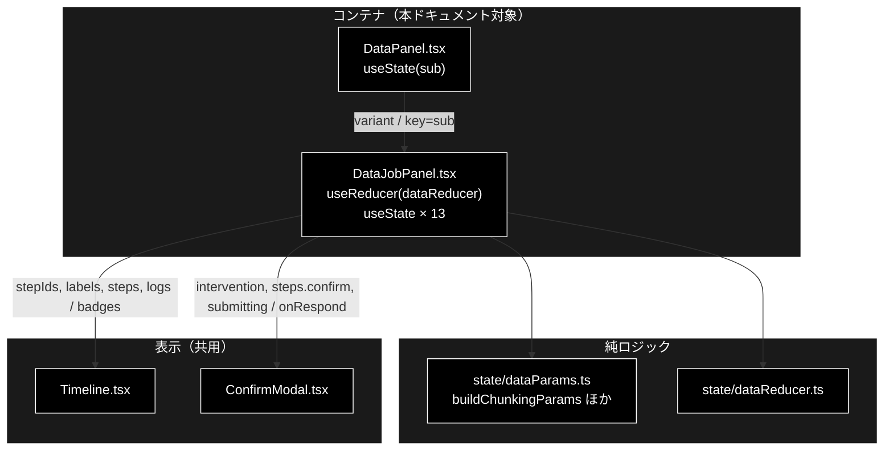
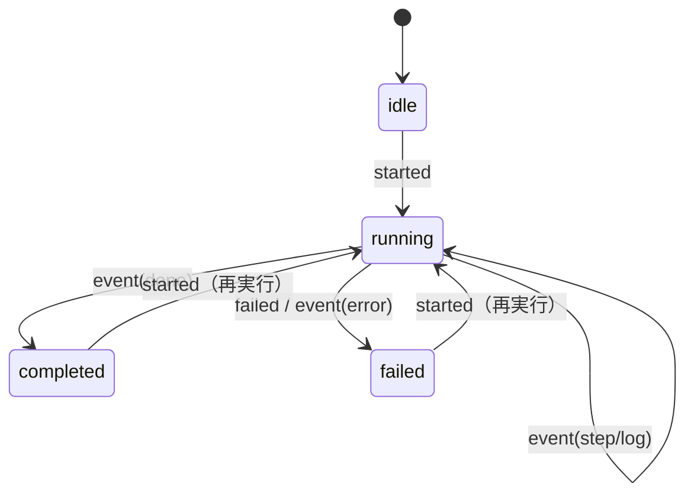
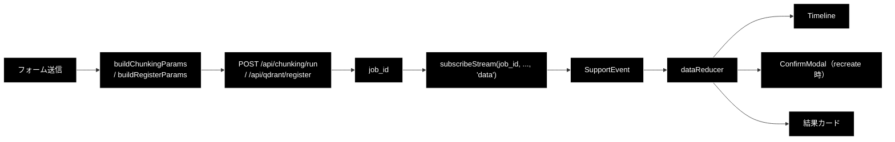
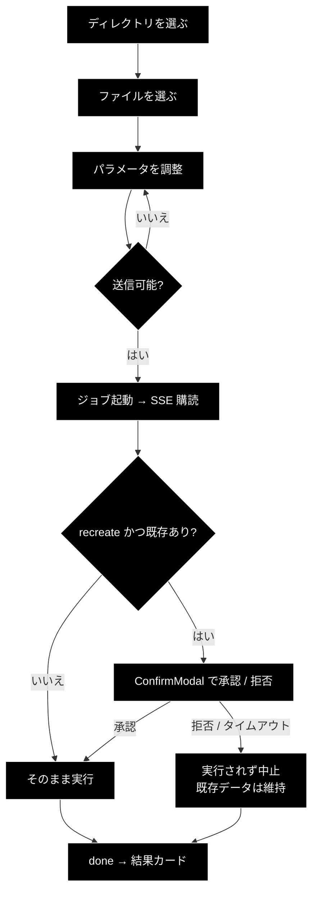

# DataJobPanel.tsx - チャンキング / Qdrant 登録の実行パネル ドキュメント

**Version 1.1** | 最終更新: 2026-08-05

---

## 目次

- [概要](#概要)
- [1. コンポーネントツリー図](#1-コンポーネントツリー図)
- [2. Props インターフェース](#2-props-インターフェース)
- [3. 状態管理](#3-状態管理)
- [4. データフロー・副作用](#4-データフロー副作用)
- [5. API 通信・SSE イベント](#5-api-通信sse-イベント)
- [6. ユーザー操作フロー](#6-ユーザー操作フロー)
- [7. 型定義とバックエンド対応](#7-型定義とバックエンド対応)
- [8. スタイル・アクセシビリティ](#8-スタイルアクセシビリティ)
- [9. テスト](#9-テスト)
- [10. 変更履歴](#10-変更履歴)

---

## 概要

| 項目 | 内容 |
|---|---|
| ファイル | `frontend/src/components/DataJobPanel.tsx` |
| 種別 | コンテナコンポーネント（`useReducer` + `useState` × 13 + `useEffect` × 2 + `useRef`） |
| 親 | `DataPanel.tsx`（`variant` を渡して 2 用途で共用） |
| 子 | `Timeline.tsx`、`ConfirmModal.tsx` |
| 主な依存 | `../api/client`, `../state/dataParams`, `../state/dataReducer` |
| 対応バックエンド | `backend/app/api/data.py`（`/api/chunking/run`, `/api/qdrant/register`） |

### 主な責務

- 入力ファイルを**許可ディレクトリから選ばせる**（自由入力させない）。
- チャンク化 / 登録のパラメータをフォームで受け、API パラメータへ組み立てる。
- ジョブを起動し、SSE で進捗を購読して `Timeline` に流す。
- `recreate=True` の承認要求（intervention）を `ConfirmModal` で処理する。
- 結果（チャンク数 / 登録件数）を提示する。

### なぜ 1 コンポーネントで 2 用途を兼ねるのか

チャンキングと登録は**器が同じ**（フォーム → ジョブ起動 → SSE 購読 → Timeline → 結果）で、
違うのはフォームの中身と呼ぶ API だけ。`SupportPanel` が基本版 / Support を
`variant` で兼ねているのと同じ構造にしてある。

| 要素 | チャンキング | 登録 | 扱い |
|---|---|---|---|
| ジョブ起動・SSE・承認 | 同じ | 同じ | ✅ 共通 |
| フォーム項目 | ワーカー数・ブロックサイズ等 | コレクション名・バッチサイズ等 | ❌ `variant` で分岐 |
| 既定の入力ディレクトリ | `OUTPUT` | `qa_output` | ❌ `DEFAULT_DIR` |
| 承認 | 不要 | `recreate` 時のみ | ❌ バックエンド側で判断 |

### 主要機能一覧

| 機能 | 実装 | 説明 |
|---|---|---|
| ディレクトリ選択 | `INPUT_DIRS` | 許可 4 ディレクトリ（backend と 1:1） |
| ファイル選択 | `fetchInputFiles(dir)` | サイズ・更新日時つきで列挙 |
| コレクション名の補完 | `suggestCollectionName()` | 登録時、未入力ならファイル名から |
| パラメータ組み立て | `buildChunkingParams` / `buildRegisterParams` | 純関数（テスト済み） |
| 送信可否 | `canSubmitChunking` / `canSubmitRegister` | 純関数（テスト済み） |
| 進捗表示 | `Timeline` | ステップ ID はジョブ種別で変わる |
| 承認 | `ConfirmModal` | Support / Review と共用 |

---

## 1. コンポーネントツリー図



---

## 2. Props インターフェース

```typescript
export type DataJobVariant = 'chunking' | 'register';

export function DataJobPanel({ variant }: { variant: DataJobVariant })
```

| Prop | 型 | 必須 | 既定値 | 説明 |
|---|---|:---:|---|---|
| `variant` | `DataJobVariant` | ✅ | — | フォームの中身と呼ぶ API を決める |

### コールバックの契約

コールバック props は**なし**。親へ通知しない。

> `variant` は `DataJobKind` の部分集合（`'delete'` を除く）。削除は
> `CollectionPanel` が担当するため、このパネルは扱わない。

---

## 3. 状態管理

### 3.1 ローカル state（`useState`）

| 変数 | 型 | 初期値 | 更新契機 | 説明 |
|---|---|---|---|---|
| `dir` | `string` | `DEFAULT_DIR[variant]`（`'OUTPUT'` / `'qa_output'`） | セレクタ変更 | 入力ディレクトリ |
| `files` | `InputFileInfo[]` | `[]` | `useEffect`（dir 変更時） | ファイル候補 |
| `inputFile` | `string` | `''` | セレクタ変更 | `dir/name` 形式 |
| `outputDir` | `string` | `'output_chunked'` | 入力 | チャンク化の出力先 |
| `model` | `string` | `'gemma4:e4b'` | 入力 | チャンク化の LLM（ローカル / Ollama） |
| `workers` | `number` | `8` | 入力 | 並列ワーカー数 |
| `blockSize` | `number` | `1000` | 入力 | ブロックサイズ（文字） |
| `textColumn` | `string` | `''` | 入力 | CSV のテキストカラム（空 = 自動検出） |
| `maxRows` | `string` | `''` | 入力 | 最大行数（空 = 全件）。**文字列で保持** |
| `combineRows` | `boolean` | `false` | チェックボックス | CSV 全行を結合 |
| `collection` | `string` | `''` | 入力 / ファイル選択で補完 | 登録先コレクション名 |
| `recreate` | `boolean` | `false` | チェックボックス | **既存を作り直す（要承認）** |
| `batchSize` | `number` | `100` | 入力 | Embedding バッチサイズ |
| `embedWorkers` | `number` | `2` | 入力 | Embedding 並列数 |
| `maxDocs` | `string` | `''` | 入力 | 最大件数。**文字列で保持** |
| `verbose` | `boolean` | `false` | チェックボックス | 詳細ログ |
| `confirming` | `boolean` | `false` | 承認送信時 | 二重送信の防止 |

> ⚠️ **`maxRows` / `maxDocs` は `number` ではなく `string` で保持する。**
> `<input type="number">` は空欄のとき `''` を返し、`Number('')` は **`0`** になる。
> `number` で持つと空欄が「最大 0 件」という意図しない指定になるため、
> 文字列のまま持ち `toOptionalNumber()` で `null` に変換する。

### 3.2 reducer state（`useReducer`）

`state/dataReducer.ts` が SSE イベント列を畳み込む。**純関数・副作用ゼロ。**

| フィールド | 型 | 初期値 | 説明 |
|---|---|---|---|
| `jobId` | `string \| null` | `null` | 起動中ジョブの ID |
| `kind` | `DataJobKind` | `variant` | ステップ ID 集合の決定に使う |
| `phase` | `'idle' \| 'running' \| 'completed' \| 'failed'` | `'idle'` | 進行状態 |
| `steps` | `Record<string, DataStepState>` | 全 `pending` | ジョブ種別ごとのステップ |
| `intervention` | `InterventionInfo \| null` | `null` | HITL CONFIRM の承認待ち |
| `result` | `DataJobResult \| null` | `null` | 最終結果 |
| `error` | `string \| null` | `null` | エラーメッセージ |
| `logs` | `string[]` | `[]` | ステップに紐づかないログ |

#### アクション一覧

| アクション | ペイロード | 効果 |
|---|---|---|
| `started` | `jobId`, `kind` | 状態を初期化し `phase='running'` |
| `event` | `SupportEvent` | 種別に応じて steps / intervention / result を更新 |
| `confirm_sent` | — | `intervention` をクリア |
| `failed` | `message` | `phase='failed'` |
| `reset` | — | **種別を保ったまま**初期状態へ |

#### 状態遷移図



#### Support / Review の reducer との違い

| 観点 | `jobReducer` / `reviewReducer` | `dataReducer` |
|---|---|---|
| ステップ ID 集合 | 定数 1 種 | **`kind` から引く**（3 種） |
| 結果の型 | `SupportResult` / `ReviewResult` | `DataJobResult`（種別で形が違う） |
| `data` の扱い | 置換 | 置換（同じ） |
| 未知ステップ ID | 無視 | 無視（同じ） |

### 3.3 親から渡る状態（props 由来）

| 値 | 供給元 | 本コンポーネントでの扱い |
|---|---|---|
| `variant` | `DataPanel` の `sub` | 読み取りのみ。`kind` と既定ディレクトリを決める |

---

## 4. データフロー・副作用

### 4.1 副作用一覧（`useEffect`）

| # | 目的 | 依存配列 | クリーンアップ | 備考 |
|---|---|---|---|---|
| 1 | ファイル一覧の取得 | `[dir]` | `cancelled = true` を返す | 取得中に dir が変わったら結果を捨てる（古い応答で上書きしない） |
| 2 | **前回ジョブの再購読** ＋ SSE 購読の解除 | `[kind, subscribe]` | `cancelled = true` と `unsubscribeRef.current?.()` を返す | 再購読の前に存在確認する（下記） |

```tsx
// #1 — 競合状態の回避
useEffect(() => {
  let cancelled = false;
  void fetchInputFiles(dir)
    .then((response) => { if (!cancelled) setFiles(response.files); })
    .catch(() => { if (!cancelled) setFiles([]); });
  return () => { cancelled = true; };
}, [dir]);

// #2 — アンマウント時の購読解除
useEffect(() => () => unsubscribeRef.current?.(), []);
```

> ⚠️ **#1 の `cancelled` フラグは必須。** ディレクトリを素早く切り替えると、
> 遅い方の応答が後に届いて**古いディレクトリのファイル一覧で上書き**される。

### 4.1.1 タブを離れても進捗を失わない仕組み

タブ（サブタブ）はアンマウントで切り替わるため、離れると reducer 状態と
SSE 購読が破棄される。**ジョブはバックエンドで走り続けるのに `job_id` を失う**ので、
戻っても進捗を追えなかった。

これを `state/activeJobs.ts`（モジュールスコープの小さなストア）で解決している。

```tsx
// 起動時
rememberJob(kind, job_id);

// 再マウント時
const remembered = recallJob(kind);
if (!remembered) return () => unsubscribeRef.current?.();
void fetchDataJobStatus(remembered)
  .then(() => { dispatch({ type: 'started', jobId: remembered, kind }); subscribe(remembered); })
  .catch(() => forgetJob(kind));   // 404 = もう無い。黙って忘れる
```

| 論点 | 説明 |
|---|---|
| なぜ再購読だけで復元できるのか | `Job.stream_events()` は**常に index 0 からリプレイする**（`backend/app/core/jobs.py`）。購読し直せばステップもログも承認待ちも戻る |
| なぜ React の state ではないのか | 覚えたいのは「アンマウントされても消えない」情報なので、state では目的を果たせない |
| **なぜ SSE の前に存在確認するのか** | 完了ジョブは 50 件で GC される（`MAX_FINISHED_JOBS`）。消えた `job_id` に `EventSource` でつなぐと `onerror` が発火し、**「切断されました」という誤ったエラー**になる。先に `GET /api/data/result/{job_id}` を叩き、404 なら黙って忘れる |
| なぜ `sessionStorage` にしないのか | 復元先のジョブがサーバ再起動で消えている可能性があり、かえって不整合を招く |

> 完了後も記憶を残すのは意図的。タブを離れて戻ったときに**結果カードが見える**。

### 4.2 ジョブ起動から結果まで



### 4.3 コレクション名の自動補完

```tsx
const selectFile = (path: string) => {
  setInputFile(path);
  if (variant === 'register' && collection.trim() === '') {
    setCollection(suggestCollectionName(path));
  }
};
```

| 条件 | 挙動 |
|---|---|
| 登録タブ かつ コレクション名が空 | ファイル名（拡張子なし）で補完 |
| 既に入力済み | **上書きしない**（ユーザーの入力を尊重） |
| チャンキングタブ | 何もしない |

`suggestCollectionName` は**サフィックス（`_anthropic` 等）を付けない**。
命名規約はプロジェクトによって違うため、ユーザーに決めさせる。

---

## 5. API 通信・SSE イベント

### 5.1 呼び出す API

| 関数 | メソッド | パス | 用途 |
|---|---|---|---|
| `fetchInputFiles` | GET | `/api/files?dir=` | 入力ファイル候補 |
| `fetchDataJobStatus` | GET | `/api/data/result/{job_id}` | 再購読前の存在確認 |
| `startChunking` | POST | `/api/chunking/run` | チャンク化ジョブの起動 |
| `startRegister` | POST | `/api/qdrant/register` | 登録ジョブの起動 |
| `subscribeStream` | GET(SSE) | `/api/data/stream/{job_id}` | 進捗の購読（`kind='data'`） |
| `confirmDataIntervention` | POST | `/api/data/confirm/{job_id}` | HITL 応答 |

### 5.2 SSE イベント種別

Support / Review と**完全に同一**（`SupportEvent` を共用）。

| type | 意味 | reducer の扱い |
|---|---|---|
| `step` | ステップの開始・終了・スキップ | `steps[id].status` / `data` を更新（**置換**） |
| `log` | 進捗ログ 1 行 | 該当ステップの `logs` へ。step 無しは `state.logs` へ |
| `intervention` | HITL CONFIRM 要求 | `intervention` を設定（モーダル表示） |
| `result` | 最終結果 | `result` を設定 |
| `error` | エラー | `phase='failed'` |
| `done` | 配信終了 | `phase='completed'`、`EventSource` を close |

### 5.3 ステップ ID（バックエンドと 1:1）

| variant | ステップ | バックエンド定義 |
|---|---|---|
| `chunking` | `load` / `chunk` / `save` | `CHUNKING_STEP_IDS` |
| `register` | `prepare` / `confirm` / `embed` / `upsert` | `REGISTER_STEP_IDS` |

---

## 6. ユーザー操作フロー

### 6.1 イベントハンドラ一覧

| 要素 | イベント | ハンドラ | 効果 | 無効化条件 |
|---|---|---|---|---|
| ディレクトリセレクタ | `change` | `setDir` | ファイル一覧を取り直す | `running` |
| ファイルセレクタ | `change` | `selectFile` | 入力ファイル設定＋コレクション名補完 | `running` |
| 各入力欄 | `change` | 各 setter | ローカル state 更新 | `running` |
| `recreate` チェック | `change` | `setRecreate` | 承認が要る状態にする | `running` |
| 送信ボタン | `submit` | `submit(e)` | ジョブ起動 → SSE 購読 | `!canSubmit` |
| 承認ボタン | `click` | `respond(true)` | `confirmDataIntervention(.., true)` | `confirming` |
| 拒否ボタン | `click` | `respond(false)` | 同上（`false`） | `confirming` |

**送信ボタンの無効化条件**（`dataParams.ts` の純関数・テスト済み）:

| variant | 条件 |
|---|---|
| `chunking` | `running` または `inputFile` が空白のみ |
| `register` | `running` または `inputFile` が空白のみ または `collection` が空白のみ |

### 6.2 操作フロー図



---

## 7. 型定義とバックエンド対応

| TS 型（`src/types.ts`） | 対応する Python | 定義元 |
|---|---|---|
| `ChunkingParams` | `ChunkingRequest` / `ChunkingParams` | `backend/app/schemas.py` / `core/data_jobs.py` |
| `RegisterParams` | `RegisterRequest` / `RegisterParams` | 同上 |
| `InputFileInfo` | `InputFileInfo` | `backend/app/schemas.py` |
| `DataJobResult` | runner の戻り dict | `backend/app/core/data_jobs.py` |
| `DataJobKind` | `Job.kind` | `backend/app/core/jobs.py` |
| `SupportEvent` | SSE ペイロード | `backend/app/core/jobs.py` |
| `InterventionInfo` | intervention イベントの `data` | `backend/app/core/intervention_bridge.py` |

> ⚠️ **バックエンドのスキーマを変えたら、この表の TS 型も必ず追随させる。**
> `frontend` は blocking な CI ゲート（`tsc --noEmit`）なので、型がズレると
> **PR がマージできなくなる**。ただし `DataJobResult` はすべて optional なので、
> フィールド名の変更は型検査に引っかからない（画面に `-` が出るだけ）。

### Embedding プロバイダの固定

```typescript
provider: 'gemini',   // buildRegisterParams 内でハードコード
```

CLAUDE.md のプロバイダ方針により、**Embedding は Gemini**
（`gemini-embedding-001`・3072 次元・`GOOGLE_API_KEY`）で固定。
LLM 用途（ローカル LLM / Ollama）とは別系統なので、画面から切り替えさせない。

⚠️ **LLM をローカル化しても Embedding は Gemini のまま。** これは既存 Qdrant
コレクション（3072 次元）を使い続けるための決定であり、`'ollama'` にすると
768 次元になって全コレクションの再作成＋全件再登録が必要になる。

---

## 8. スタイル・アクセシビリティ

| 項目 | 内容 |
|---|---|
| スタイル方式 | プレーン CSS（`src/styles.css`） |
| 主要クラス | `.query-form`, `.query-row`, `.query-toggles`, `.grow`, `.file-meta`, `.danger-toggle`, `.notice`, `.error-banner`, `.running-banner`, `.answer-card`, `.metrics` |
| 破壊的トグル | `.danger-toggle`（`recreate` が ON のとき赤字＋太字） |
| ダークモード | 未対応 |

### アクセシビリティ・チェック

| 観点 | 状態 |
|---|---|
| フォーム要素に `label` が対応しているか | ✅ すべて `<label>` で包んでいる（暗黙の関連付け） |
| モーダルにフォーカストラップがあるか | ❌ `ConfirmModal` 側の未対応項目 |
| 状態表示が色のみに依存していないか（記号併用） | ✅ `recreate` は色に加えて「⚠️ 既存の同名コレクションを削除して作り直します」と文言で警告 |
| キーボードのみで送信・承認できるか | ✅ ネイティブ `<form>` / `<button>` / `<select>` / `<input>` のみ |
| 実行中であることが伝わるか | ✅ ボタン文言が「実行中…」に変わり、バナーも出る |
| 進捗が支援技術に伝わるか | ✅ `Timeline` が `aria-live="polite"` のライブ領域で**実行中のステップ名だけ**を読み上げる（ログ 1 行ごとに読み上げると実用にならないため） |
| エラーが支援技術に伝わるか | ✅ `.error-banner` に `role="alert"` |
| 必須項目が示されているか | ❌ `required` / `aria-required` を付けていない（送信ボタンの `disabled` のみ） |

> 上記 ❌ は既知の未対応。消さずに残す。

---

## 9. テスト

| テストファイル | 対象 | ケース数 | 実行 |
|---|---|:---:|---|
| `src/state/dataParams.test.ts` | パラメータ組み立て・送信可否・整形 | 26 | `npm test` |
| `src/state/dataReducer.test.ts` | SSE イベントの畳み込み | 21 | `npm test` |
| （本コンポーネントの専用テストなし） | — | — | — |

### テスト方針

- **ロジックを JSX の外へ出してテストする。** `buildChunkingParams` /
  `buildRegisterParams` / `canSubmit*` / `toOptionalNumber` はすべて
  `state/dataParams.ts` の純関数で、`queryParams.ts` と同じ方式。
- 特に検証しているのは **空欄の数値が `0` にならないこと**
  （`toOptionalNumber('')` → `null`）。ここを間違えると「最大 0 件」で
  何も処理されないジョブが走る。
- `@testing-library/react` 未導入のため JSX のレンダリングテストは無く、
  `tsc --noEmit` でガードしている。
- CI では `npm run lint` → `npm test` → `npm run build` の順に実行され、
  **いずれも blocking**。

### 型検査で守れないこと

| 項目 | 状態 |
|---|:---:|
| `useEffect` #1 の `cancelled` フラグ漏れ | ❌ |
| `useEffect` #2 のクリーンアップ漏れ | ❌ |
| `rememberJob` の呼び忘れ（進捗が復元されない） | ❌ |
| `step.data` のキー名（バッジの表示） | ❌ `Record<string, unknown>` のため |

---

## 10. 変更履歴

| 版 | 日付 | 変更内容 |
|---|---|---|
| 1.0 | 2026-08-05 | 初版作成 |
| 1.1 | 2026-08-05 | タブ離脱時に進捗を失う不具合を修正（`activeJobs` による再購読）。`role="alert"` と `Timeline` のライブ領域を追加 |
