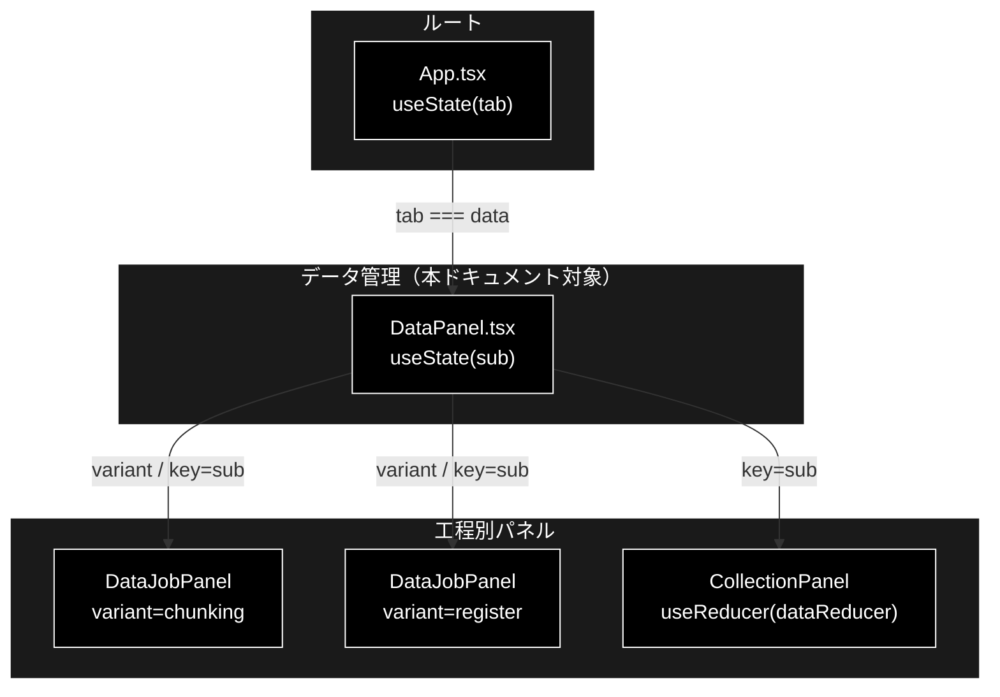
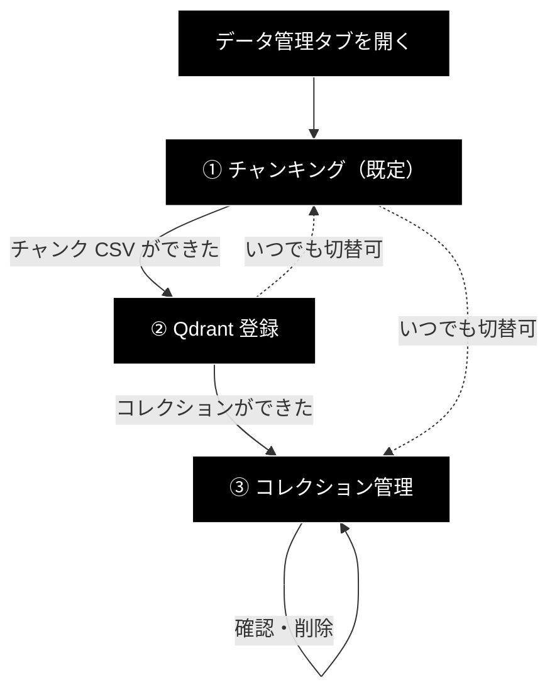

# DataPanel.tsx - データ管理タブのルート ドキュメント

**Version 1.1** | 最終更新: 2026-08-05

---

## 目次

- [概要](#概要)
- [1. コンポーネントツリー図](#1-コンポーネントツリー図)
- [2. Props インターフェース](#2-props-インターフェース)
- [3. 状態管理](#3-状態管理)
- [4. データフロー・副作用](#4-データフロー副作用)
- [5. API 通信・SSE イベント](#5-api-通信sse-イベント)
- [6. ユーザー操作フロー](#6-ユーザー操作フロー)
- [7. 型定義とバックエンド対応](#7-型定義とバックエンド対応)
- [8. スタイル・アクセシビリティ](#8-スタイルアクセシビリティ)
- [9. テスト](#9-テスト)
- [10. 変更履歴](#10-変更履歴)

---

## 概要

| 項目 | 内容 |
|---|---|
| ファイル | `frontend/src/components/DataPanel.tsx` |
| 種別 | 状態保持コンポーネント（`useState` 1 個） |
| 親 | `App.tsx`（4 タブ目「データ管理」） |
| 子 | `DataJobPanel.tsx`（チャンキング / 登録）、`CollectionPanel.tsx`（コレクション管理） |
| 主な依存 | `./CollectionPanel`, `./DataJobPanel` |
| 対応バックエンド | `backend/app/api/data.py`, `backend/app/api/qdrant.py` |

### 主な責務

- データ準備の 3 工程を**パイプラインの流れ順**にサブタブとして並べる。
- サブタブの切り替えでコンポーネントを**アンマウント**し、前工程の状態と SSE 購読を残さない。
- 各工程の説明文を出し、何をする画面かを明示する。

### なぜ入れ子のタブなのか

`App.tsx` の 4 タブのうち、前 3 つ（基本版 / Support / Review）は
**「エージェントを使う」**側で、このタブだけが**「データを準備する」**側である。
モードが違うため、同列に 6 タブ並べるのではなく入れ子にしてある。

```
App.tsx
 ├─ 基本版          ┐
 ├─ GRACE-Support   ├ エージェントを使う
 ├─ GRACE-Review    ┘
 └─ データ管理       ← データを準備する
     ├─ ① チャンキング
     ├─ ② Qdrant 登録
     └─ ③ コレクション管理
```

### 主要機能一覧

| 機能 | 実装 | 説明 |
|---|---|---|
| サブタブ切替 | `useState<SubTab>` | 既定は `chunking`（パイプラインの先頭） |
| 説明文 | `active.description` | 選択中の工程が何をするか |
| アンマウント切替 | `key={sub}` | **必須**。無いと前工程の状態が残る |

---

## 1. コンポーネントツリー図



---

## 2. Props インターフェース

**Props なし**（`export function DataPanel()`）。

タブの選択状態は自分の `useState` が持ち、親（`App.tsx`）へは通知しない。

---

## 3. 状態管理

### 3.1 ローカル state（`useState`）

| 変数 | 型 | 初期値 | 更新契機 | 説明 |
|---|---|---|---|---|
| `sub` | `SubTab`（`'chunking' \| 'register' \| 'collections'`） | `'chunking'` | サブタブのクリック | 表示中の工程 |

初期値が `'chunking'` なのは**パイプラインの先頭**だから。
初めて開いたユーザーが工程順に進めるようにしている。

### 3.2 reducer state（`useReducer`）

**なし。** ジョブの状態は子（`DataJobPanel` / `CollectionPanel`）がそれぞれ持つ。

### 3.3 親から渡る状態（props 由来）

**なし。**

---

## 4. データフロー・副作用

### 4.1 副作用一覧（`useEffect`）

**なし。** 購読・タイマー・API 呼び出しのいずれも行わない。

### 4.2 `key={sub}` が必須である理由

```tsx
{sub === 'collections' ? (
  <CollectionPanel key={sub} />
) : (
  <DataJobPanel key={sub} variant={sub} />
)}
```

`DataJobPanel` はチャンキングと登録で**同じコンポーネント**なので、
`key` が無いと React は同じ位置の要素として**インスタンスを再利用**する。
`variant` prop だけが変わり、以下がそのまま残る:

| 残るもの | 症状 |
|---|---|
| `dataReducer` の state | チャンキングの進捗が登録タブに表示される |
| SSE 購読（`unsubscribeRef`） | 前工程の `EventSource` が開いたまま |
| フォームの入力値 | 入力ファイルやワーカー数が引き継がれる |

⚠️ **この不具合は型検査でも vitest でも捕まらない。**
`App.tsx` のタブ切替（基本版 ⇄ Support）とまったく同じ理由であり、
そちらでも `key={tab}` が必須になっている。

### 4.3 データフロー図


---

## 5. API 通信・SSE イベント

**該当なし。** `fetch` / `EventSource` を一切呼ばない。通信は子が行う。

---

## 6. ユーザー操作フロー

### 6.1 イベントハンドラ一覧

| 要素 | イベント | ハンドラ | 効果 | 無効化条件 |
|---|---|---|---|---|
| サブタブボタン | `click` | `setSub(tab.id)` | 表示中の工程を切り替える | **なし** |
| サブタブボタン | `keydown` | `onKeyDown(event, index)` | 左右/上下矢印で移動、Home/End で端へ。フォーカスも運ぶ | **なし** |

> **実行中でもタブを切り替えられる。** 切り替えるとパネルがアンマウントされ、
> `useEffect` のクリーンアップで SSE 購読が解除される。ジョブ自体はバックエンドで
> 走り続け、**戻ると `state/activeJobs.ts` に残した `job_id` で購読し直す**ので
> タイムラインごと復元される（[`DataJobPanel.md`](./DataJobPanel.md) §4.1.1）。

### 6.2 操作フロー図



---

## 7. 型定義とバックエンド対応

| TS 型 | 定義元 | 対応 |
|---|---|---|
| `SubTab` | 本ファイル（module private） | UI 固有。バックエンドに対応物なし |

工程 ID（`chunking` / `register`）は `DataJobKind` の一部と一致するが、
`collections` は**ジョブではない**ため型としては別物である。

---

## 8. スタイル・アクセシビリティ

| 項目 | 内容 |
|---|---|
| スタイル方式 | プレーン CSS（`src/styles.css`） |
| 主要クラス | `.sub-tabs`, `.sub-tabs button.active`, `.tab-description` |
| ダークモード | 未対応 |

### アクセシビリティ・チェック

| 観点 | 状態 |
|---|---|
| フォーム要素に `label` が対応しているか | 該当なし（フォーム要素を持たない） |
| モーダルにフォーカストラップがあるか | 該当なし |
| 状態表示が色のみに依存していないか（記号併用） | ✅ 選択中のタブは `aria-selected` ＋ 太字 ＋ 背景色。ラベルに ①②③ の番号も入る |
| キーボードのみで操作できるか | ✅ ネイティブ `<button>` なので Tab + Enter で切替可 |
| タブに `role` が付いているか | ✅ `role="tablist"` / `role="tab"` / `aria-selected` |
| タブが矢印キーで移動できるか | ✅ 左右/上下矢印で移動（端で回り込む）、Home/End で端へ。移動時は `preventDefault()` でページスクロールを止め、フォーカスも運ぶ |
| `tabpanel` が関連付けられているか | ✅ `aria-controls` / `role="tabpanel"` / `aria-labelledby` |
| 選択中タブだけが Tab キーの到達点か | ✅ roving tabindex（選択中 `0` / それ以外 `-1`）。タブ群を素通りして本文へ行ける |

矢印キーの移動先計算は `state/tabKeys.ts` の純関数（テスト済み）。`App.tsx` のタブと共用している。

---

## 9. テスト

| テストファイル | 対象 | 実行 |
|---|---|---|
| `src/state/dataReducer.test.ts` | 子が使う reducer（21 ケース） | `npm test` |
| `src/state/dataParams.test.ts` | 子が使うフォーム純関数（26 ケース） | `npm test` |
| `src/state/tabKeys.test.ts` | 矢印キーの移動先計算（12 ケース） | `npm test` |
| （本コンポーネントの専用テストなし） | — | — |

**専用テストは未整備。** `@testing-library/react` を導入していないため
JSX のレンダリングテストが書けず、`tsc --noEmit` でガードしている。

⚠️ **`key={sub}` の欠落は型検査でもテストでも検出できない。**
レンダリングテストを導入するなら、まずここを対象にすべきである。

---

## 10. 変更履歴

| 版 | 日付 | 変更内容 |
|---|---|---|
| 1.0 | 2026-08-05 | 初版作成 |
| 1.1 | 2026-08-05 | サブタブの矢印キー移動・roving tabindex・`role="tabpanel"` を追加。タブ離脱で進捗を失う記述を、再購読するよう修正 |
