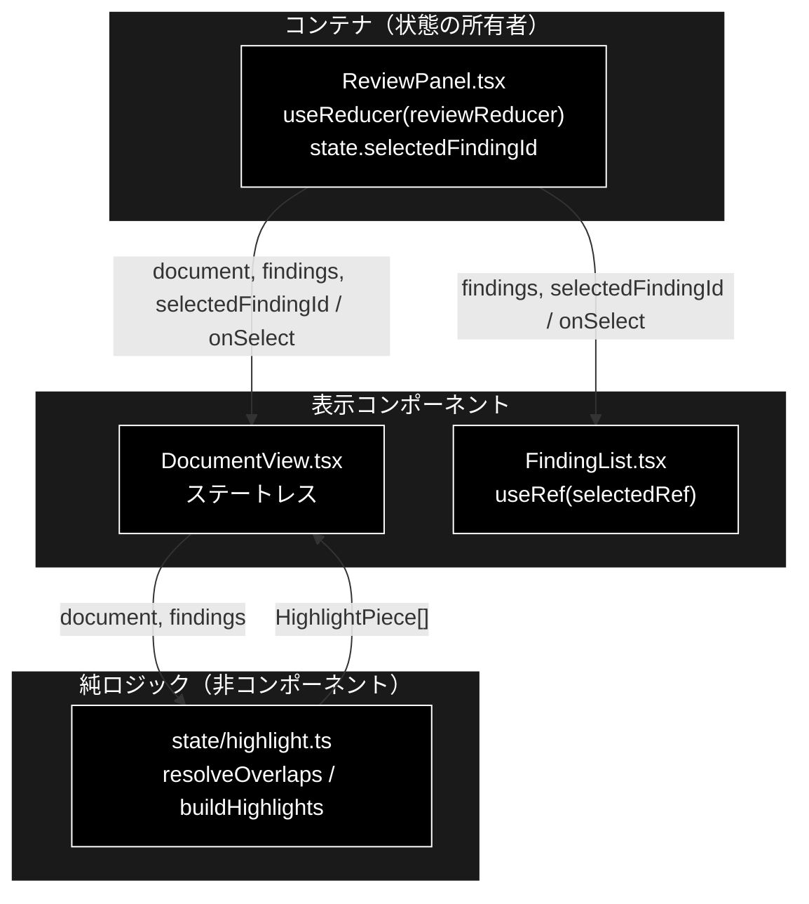
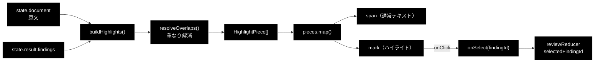
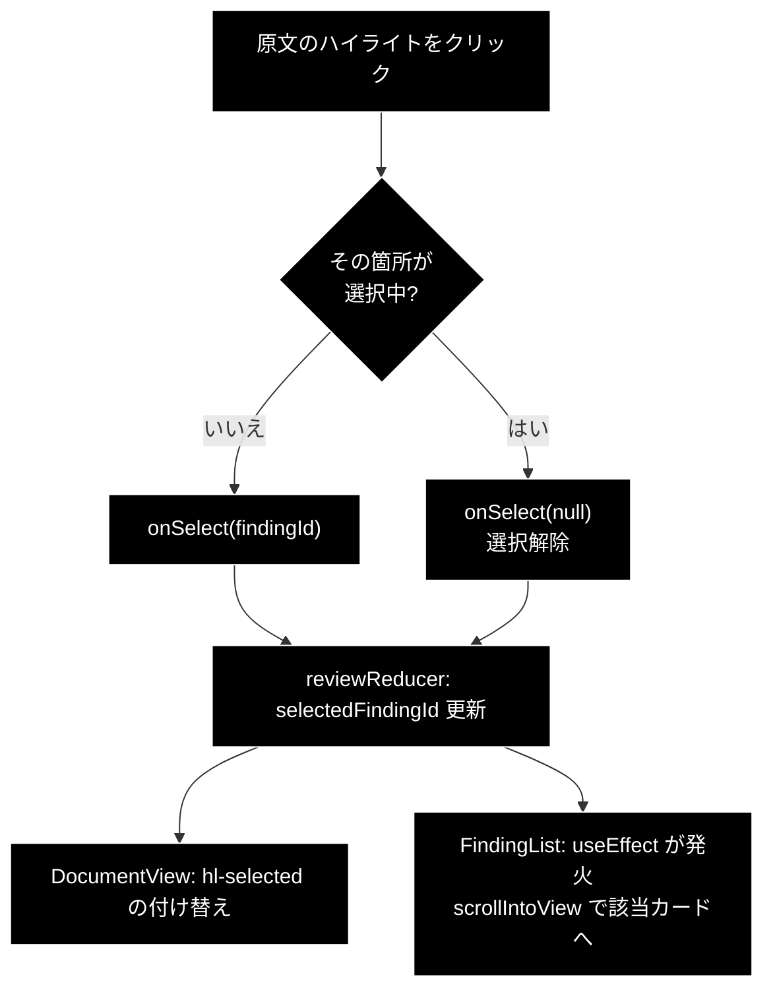

# DocumentView.tsx - 原文表示＋指摘ハイライト ドキュメント

**Version 1.0** | 最終更新: 2026-08-01

---

## 目次

- [概要](#概要)
- [1. コンポーネントツリー図](#1-コンポーネントツリー図)
- [2. Props インターフェース](#2-props-インターフェース)
- [3. 状態管理](#3-状態管理)
- [4. データフロー・副作用](#4-データフロー副作用)
- [5. API 通信・SSE イベント](#5-api-通信sse-イベント)
- [6. ユーザー操作フロー](#6-ユーザー操作フロー)
- [7. 型定義とバックエンド対応](#7-型定義とバックエンド対応)
- [8. スタイル・アクセシビリティ](#8-スタイルアクセシビリティ)
- [9. テスト](#9-テスト)
- [10. 変更履歴](#10-変更履歴)

---

## 概要

| 項目 | 内容 |
|---|---|
| ファイル | `frontend/src/components/DocumentView.tsx` |
| 種別 | 表示コンポーネント（ステートレス） |
| 親 | `ReviewPanel.tsx`（`.review-panes` の左ペイン） |
| 子 | なし（`<span>` / `<mark>` を直接組む） |
| 主な依存 | `../state/highlight`（`buildHighlights`）、`../types`（`ReviewFinding`） |
| 対応バックエンド | `backend/app/core/review_agent.py`（`ReviewFinding.start` / `.end`）、設計は `backend/docs/review_agent_spec.md` §8.2 |

### 主な責務

- GRACE-Review に投入した**原文をそのまま表示**する（バックエンドは分割時に正規化していないので、文字オフセットで切り出せば一致する）。
- 指摘スパンを severity 別の色で `<mark>` ハイライトする。
- ハイライトのクリックで**該当の指摘カードを選択**し、`FindingList` 側をスクロールさせる（選択済みを再クリックで解除）。
- `dangerouslySetInnerHTML` を使わず、React 要素の配列として組み立てて XSS を回避する。

### 主要機能一覧

| 機能 | 実装 | 説明 |
|---|---|---|
| 早期リターン | `if (!document) return null;` | 原文が空なら節ごと描画しない |
| 断片列の生成 | `buildHighlights(document, findings)` | 純関数（`state/highlight.ts`）。重なり解消と範囲外除去を含む |
| 通常テキスト | `<span key={index}>` | 改行の保持は CSS（`white-space: pre-wrap`）側の責務 |
| ハイライト | `<mark className={hl hl-{severity}}>` | 選択中は `hl-selected` を追加 |
| 選択トグル | `onSelect(selected ? null : piece.findingId)` | 同じ箇所を再クリックすると解除 |
| 追跡用属性 | `data-finding-id` | デバッグ・E2E からの参照用 |

---

## 1. コンポーネントツリー図



> `selectedFindingId` は **`ReviewPanel` の reducer state に 1 つだけ**存在し、
> `DocumentView` と `FindingList` の両方へ配られる。これが「原文 ⇄ 指摘カード」の
> 双方向ジャンプを成立させている（状態を各自が持つと同期が壊れる）。

---

## 2. Props インターフェース

```typescript
interface Props {
  document: string;
  findings: ReviewFinding[];
  selectedFindingId: string | null;
  onSelect: (findingId: string | null) => void;
}
```

| Prop | 型 | 必須 | 既定値 | 説明 |
|---|---|:---:|---|---|
| `document` | `string` | ✅ | — | 点検対象の原文。`reviewReducer` の `state.document`（送信時に保持したもの） |
| `findings` | `ReviewFinding[]` | ✅ | — | 採用された指摘。`state.result.findings` |
| `selectedFindingId` | `string \| null` | ✅ | — | 選択中の指摘 ID。`null` は未選択 |
| `onSelect` | `(findingId: string \| null) => void` | ✅ | — | ハイライトのクリックで呼ぶ |

### コールバックの契約

| コールバック | 呼ばれる条件 | 親側の責務 |
|---|---|---|
| `onSelect` | `<mark>` のクリック時。選択中の箇所なら `null`、それ以外なら該当 `findingId` を渡す | `dispatch({ type: 'select', findingId })` で reducer state を更新し、`FindingList` にも同じ値を配る |

> 「選択解除」を `null` で表現する契約なので、親は `null` を受け取れる型で受ける必要がある
> （`(id: string) => void` に狭めると解除できなくなる）。

---

## 3. 状態管理

### 3.1 ローカル state（`useState`）

**なし。** 選択状態は親（`ReviewPanel`）の reducer が単一の真実源として持つ。

### 3.2 reducer state（`useReducer`）

**なし。** 参照している `reviewReducer` の値は props 経由で受け取る。

### 3.3 親から渡る状態（props 由来）

| 値 | 供給元 | 本コンポーネントでの扱い |
|---|---|---|
| `document` | `ReviewPanel` の `state.document`（`started` アクションで保持） | 読み取りのみ。切り出しに使う |
| `findings` | `ReviewPanel` の `state.result.findings` | 読み取りのみ。`buildHighlights` へ渡す |
| `selectedFindingId` | `ReviewPanel` の `state.selectedFindingId` | 読み取りのみ。`hl-selected` の付与判定 |

> **不変条件**: `findings` を並べ替えない。並べ替えは `buildHighlights` 内部で
> **コピーに対して**行う（`[...findings].sort(...)`）。props 配列を破壊的に扱うと
> `FindingList` 側の並び（severity 降順）と食い違う。

---

## 4. データフロー・副作用

### 4.1 副作用一覧（`useEffect`）

**なし。** `useEffect` / `useRef` / タイマー / 購読のいずれも持たない。
毎レンダリングで `buildHighlights` を呼び直す（メモ化していない）。

| 検討事項 | 現状 |
|---|---|
| `useMemo(() => buildHighlights(...), [document, findings])` | 未導入。`document` は数万字までを想定しており、実測で問題が出ていないため入れていない。大きな文書で描画が重くなったらここが最初の候補 |

### 4.2 `buildHighlights` の契約（`state/highlight.ts`）

本コンポーネントの正しさは、この純関数の 3 つの防御に依存している。

| # | 防御 | 実装 | 破れたときの症状 |
|---|---|---|---|
| 1 | 空スパンの除去 | `.filter((f) => f.end > f.start)` | 空の `<mark>` が並ぶ |
| 2 | 重なりの解消 | `resolveOverlaps()`。severity 高を優先、同値なら先勝ち | 同じ文字を二重に切り出して**本文が重複表示**される |
| 3 | 範囲外の無視 | `if (finding.start < cursor \|\| finding.end > document.length) continue;` | `slice` が空を返し、**本文が欠落**する |

> ⚠️ **重なりは異常系ではなく通常起きる。** 同じ文言が複数のルールに触れるため
> （例:「業界No.1」は景表法の優良誤認と打消し表示の両方で拾われうる）。
> したがって `resolveOverlaps` は「念のため」ではなく必須の経路である。

#### 断片列の構造

```typescript
export interface HighlightPiece {
  text: string;                    // 原文の該当部分
  findingId: string | null;        // null = 通常テキスト
  severity: Severity | null;       // null = 通常テキスト
}
```

`findingId === null` かどうかだけで `<span>` / `<mark>` を分岐する。

### 4.3 XSS 回避の設計

| 方式 | 採否 | 理由 |
|---|---|---|
| `dangerouslySetInnerHTML` で `<mark>` タグを埋め込んだ HTML 文字列を作る | ❌ 不採用 | 原文はユーザー入力そのもの。HTML として解釈させると任意スクリプトが動く |
| 断片列（データ）を作り、React 要素として組み立てる | ✅ 採用 | React が文字列をテキストノードとしてエスケープする |

責務分割も同じ目的で決まっている — **`highlight.ts` はデータだけを作り、要素の組み立ては
`DocumentView` が行う**。ロジック側が JSX を返さないので、`dangerouslySetInnerHTML` を
使う余地自体が生まれない。

### 4.4 データフロー図



---

## 5. API 通信・SSE イベント

**該当なし。** `fetch` / `EventSource` を呼ばない。原文も指摘も props で受け取る。

---

## 6. ユーザー操作フロー

### 6.1 イベントハンドラ一覧

| 要素 | イベント | ハンドラ | 効果 | 無効化条件 |
|---|---|---|---|---|
| `<mark className="hl ...">` | `click` | インライン `() => onSelect(selected ? null : piece.findingId)` | 選択のトグル → 親の reducer 更新 → `FindingList` が該当カードへスクロール | なし（実行中でもクリック可） |
| `<span>`（通常テキスト） | — | なし | — | — |

### 6.2 操作フロー図



> 逆方向（指摘カードをクリック → 原文のハイライトが選択色になる）も同じ
> `selectedFindingId` を経由する。ただし**原文側へのスクロールは実装していない**
> （`FindingList` 側にしか `scrollIntoView` がない）。長い文書ではカードをクリックしても
> 該当箇所が画面外のままになる。

---

## 7. 型定義とバックエンド対応

| TS 型（`src/types.ts`） | 対応する Python | 定義元 |
|---|---|---|
| `ReviewFinding` | `ReviewFinding`（dataclass） | `backend/app/core/review_agent.py` |
| `Severity` (`'high' \| 'medium' \| 'low'`) | `severity` フィールド | `backend/app/core/review_agent.py` |
| `Segment` | `Segment` | `backend/app/schemas.py` |

### 本コンポーネントが使う `ReviewFinding` フィールド

| フィールド | 型 | 用途 |
|---|---|---|
| `start` | `number` | **原文の文字オフセット**（開始）。`buildHighlights` 内の `document.slice(start, end)` に直接使う |
| `end` | `number` | **原文の文字オフセット**（終了・排他）。範囲外判定（`end > document.length`）にも使う |
| `finding_id` | `string` | 選択状態のキー、`data-finding-id` |
| `severity` | `Severity` | `hl-{high\|medium\|low}` のクラス名 |

> ⚠️ **`start` / `end` は「原文の」オフセットであり、セグメントの相対位置ではない。**
> バックエンドは分割時に正規化（空白畳み込み・全角半角変換等）を一切していないため、
> 原文をそのまま `slice` すれば一致する。**バックエンドで正規化を入れると
> ハイライトが全部ズレる**ので、入れるならオフセットを原文座標へ逆写像する必要がある。

---

## 8. スタイル・アクセシビリティ

| 項目 | 内容 |
|---|---|
| スタイル方式 | プレーン CSS（`src/styles.css`）。CSS-in-JS・Tailwind は不使用 |
| 主要クラス | `.document-view`, `.document-body`, `.hl`, `.hl-high` / `.hl-medium` / `.hl-low`, `.hl-selected` |
| 改行の保持 | `.document-body { white-space: pre-wrap; word-break: break-word }` — **JSX 側では `<br>` を作らない**。CSS を外すと原文が 1 行に潰れる |
| スクロール | `.document-body { max-height: 70vh; overflow-y: auto }`（幅 ≤ 一定のメディアクエリでは `max-height: none`） |
| レイアウト | 親の `.review-panes` が左右 2 ペインを組む（右は `FindingList`） |
| ダークモード | 未対応（対応する場合は `prefers-color-scheme` を使う） |

### アクセシビリティ・チェック

| 観点 | 状態 |
|---|---|
| フォーム要素に `label` が対応しているか | 該当なし（フォーム要素を持たない） |
| モーダルにフォーカストラップがあるか | 該当なし（モーダルではない） |
| 状態表示が色のみに依存していないか（記号併用） | ❌ severity の区別が `hl-high` / `hl-medium` / `hl-low` の**背景色のみ**。原文側には記号・文字ラベルが無い（severity 文言は `FindingList` のカード側にのみある） |
| キーボードのみで送信・承認できるか | ❌ `<mark onClick>` に `tabIndex` も `onKeyDown` も無いため、**キーボードではハイライトを選択できない** |
| クリック可能であることが支援技術に伝わるか | ❌ `role="button"` を付けていない。`title` 属性（「クリックすると該当の指摘へ移動します」）はマウスホバー時のみ |
| 選択状態が支援技術に伝わるか | ❌ `aria-pressed` / `aria-current` を付けていない。`hl-selected` クラスのみ |
| 見出しがあるか | ✅ `<h2>原文（N 箇所を指摘）</h2>` |

> 上記 ❌ は既知の未対応であり、消さずに残す。改善するなら
> `<mark role="button" tabIndex={0} aria-pressed={selected} onKeyDown={...}>` が最小の変更。

---

## 9. テスト

| テストファイル | 対象 | 実行 |
|---|---|---|
| `src/state/highlight.test.ts` | `resolveOverlaps` / `buildHighlights`（13 ケース） | `npm test` |
| `src/state/reviewReducer.test.ts` | `selectedFindingId` を含む reducer の畳み込み（13 ケース） | `npm test` |
| （コンポーネント本体の専用テストなし） | — | — |

### テスト方針

- **本コンポーネントのロジックは実質 `buildHighlights` に集約されており、そちらがテスト済み。**
  JSX 側に残っているのは「`findingId === null` なら `<span>`、そうでなければ `<mark>`」の
  1 分岐だけである。これは意図的な設計で、**テストしたいロジックを JSX から追い出してある**。
- `@testing-library/react` は未導入のため、JSX のレンダリングテストは書けない。
  `tsc --noEmit` の型検査でガードしている。
- CI では `npm run lint`（tsc）→ `npm test`（vitest）→ `npm run build` の順に実行され、
  **いずれも blocking**。

---

## 10. 変更履歴

| 版 | 日付 | 変更内容 |
|---|---|---|
| 1.0 | 2026-08-01 | 初版作成 |
