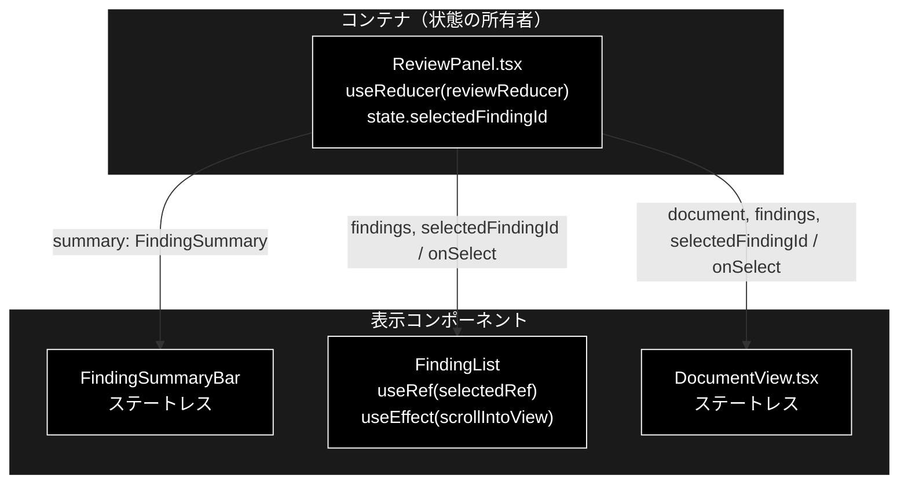
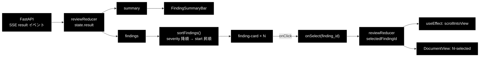
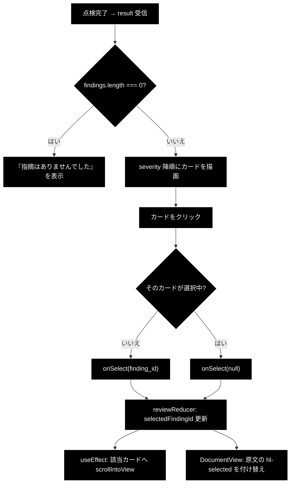

# FindingList.tsx - 指摘カード一覧＋サマリバー ドキュメント

**Version 1.0** | 最終更新: 2026-08-01

---

## 目次

- [概要](#概要)
- [1. コンポーネントツリー図](#1-コンポーネントツリー図)
- [2. Props インターフェース](#2-props-インターフェース)
- [3. 状態管理](#3-状態管理)
- [4. データフロー・副作用](#4-データフロー副作用)
- [5. API 通信・SSE イベント](#5-api-通信sse-イベント)
- [6. ユーザー操作フロー](#6-ユーザー操作フロー)
- [7. 型定義とバックエンド対応](#7-型定義とバックエンド対応)
- [8. スタイル・アクセシビリティ](#8-スタイルアクセシビリティ)
- [9. テスト](#9-テスト)
- [10. 変更履歴](#10-変更履歴)

---

## 概要

| 項目 | 内容 |
|---|---|
| ファイル | `frontend/src/components/FindingList.tsx` |
| 種別 | `FindingList` = 状態保持コンポーネント（`useRef` + `useEffect`）／ `FindingSummaryBar` = 表示コンポーネント（ステートレス） |
| 親 | `ReviewPanel.tsx`（`FindingSummaryBar` は結果直下、`FindingList` は `.review-panes` の右ペイン） |
| 子 | なし |
| 主な依存 | `../types`（`FindingSummary` / `ReviewFinding` / `Severity`）、`react`（`useEffect` / `useRef`） |
| 対応バックエンド | `backend/app/core/review_agent.py`（`ReviewFinding` / `FindingSummary`） |

**1 ファイルに 2 つの export** がある。`ReviewPanel` は両方を別々の位置に配置する
（サマリバーは全幅、カード一覧は 2 ペインの右側）。

### 主な責務

**`FindingList`**

- 指摘を **severity 降順 → 原文の出現順**に並べ、重大なものから読める順序にする。
- 1 件を 1 枚のカードとして、severity・ルール名・根拠法条文・ステータス・該当箇所の引用・
  指摘内容・修正案・根拠・確信度を提示する。
- 原文ハイライトのクリックで選択された指摘まで**自動スクロール**する。
- カードのクリックで選択をトグルし、原文側のハイライトと連動させる。
- 指摘 0 件のとき、「指摘はありませんでした」と明示する（空リストを黙って出さない）。

**`FindingSummaryBar`**

- severity 別（重大 / 中 / 軽微）と処理ステータス別（確定 / 要確認 / 抑止）の件数を 1 行で示す。
- 「抑止」に説明ツールチップを付ける（何を除外したのかが分からないと数字が読めないため）。

### 主要機能一覧

| 機能 | 実装 | 説明 |
|---|---|---|
| 並べ替え | `sortFindings()` | `SEVERITY_RANK` 降順 → `start` 昇順。**コピーに対して sort**（props を破壊しない） |
| severity ラベル | `SEVERITY_LABEL` | `high` → 重大 / `medium` → 中 / `low` → 軽微 |
| ステータスラベル | `STATUS_LABEL` | `confirmed` → 確定 / `review_required` → 要確認 / `suppressed` → 抑止。**未知の値はそのまま表示**（`?? finding.status`） |
| 自動スクロール | `useEffect` + `selectedRef` | `scrollIntoView({ behavior: 'smooth', block: 'nearest' })` |
| 選択トグル | `onSelect(selected ? null : finding.finding_id)` | 同じカードを再クリックで解除 |
| 空表示 | `findings.length === 0` の早期リターン | 「ルールに抵触する記述が見つかりませんでした」 |
| 根拠の折りたたみ | `<details>` / `<summary>` | 件数付き。既定は閉じる |
| 強制フラグ | `finding.forced` | 「重大リスク語」バッジ＋ツールチップ |
| Web 裏取り | `finding.web_checked` | 「Web 裏取り済み」バッジ |

---

## 1. コンポーネントツリー図



> `FindingList` と `DocumentView` は**兄弟**であり、直接は通信しない。
> 連動は親の `selectedFindingId`（reducer state）を経由する。

---

## 2. Props インターフェース

### 2.1 `FindingList`

```typescript
interface Props {
  findings: ReviewFinding[];
  selectedFindingId: string | null;
  onSelect: (findingId: string | null) => void;
}
```

| Prop | 型 | 必須 | 既定値 | 説明 |
|---|---|:---:|---|---|
| `findings` | `ReviewFinding[]` | ✅ | — | 採用された指摘。`state.result.findings`（抑止済みは含まれない） |
| `selectedFindingId` | `string \| null` | ✅ | — | 選択中の指摘 ID。`null` は未選択 |
| `onSelect` | `(findingId: string \| null) => void` | ✅ | — | カードのクリックで呼ぶ |

### 2.2 `FindingSummaryBar`

```typescript
export function FindingSummaryBar({ summary }: { summary: FindingSummary })
```

| Prop | 型 | 必須 | 既定値 | 説明 |
|---|---|:---:|---|---|
| `summary` | `FindingSummary` | ✅ | — | `state.result.summary`。severity 別・ステータス別の件数 |

### コールバックの契約

| コールバック | 呼ばれる条件 | 親側の責務 |
|---|---|---|
| `onSelect` | `<li className="finding-card">` のクリック時。選択中のカードなら `null`、それ以外なら `finding_id` を渡す | `dispatch({ type: 'select', findingId })` で reducer state を更新し、`DocumentView` にも同じ値を配る |

> `DocumentView` の `onSelect` と**同じ契約・同じハンドラ**（`ReviewPanel` の `select`）である。
> 片方だけ契約を変えると連動が崩れる。

---

## 3. 状態管理

### 3.1 ローカル state（`useState`）

**なし。** ただし `FindingList` は **`useRef` を 1 つ**持つ。

| 変数 | 型 | 初期値 | 更新契機 | 説明 |
|---|---|---|---|---|
| `selectedRef` | `React.MutableRefObject<HTMLLIElement \| null>` | `null` | レンダリング時に `ref={selected ? selectedRef : null}` で付け替え | 選択中カードの DOM 要素。スクロール先 |

> `useRef` は**再レンダリングを起こさない**ため state 表とは分けて扱う。
> `ref` を「選択中の 1 件にだけ」付ける方式なので、`selectedRef.current` は常に
> 選択中カード（未選択なら `null`）を指す。

### 3.2 reducer state（`useReducer`）

**なし。** `reviewReducer` は親（`ReviewPanel`）が持つ。

### 3.3 親から渡る状態（props 由来）

| 値 | 供給元 | 本コンポーネントでの扱い |
|---|---|---|
| `findings` | `ReviewPanel` の `state.result.findings` | 読み取りのみ。**コピーしてから** sort する |
| `selectedFindingId` | `ReviewPanel` の `state.selectedFindingId` | 読み取りのみ。`ref` 付与と `selected` クラスの判定 |
| `summary` | `ReviewPanel` の `state.result.summary` | 読み取りのみ（`FindingSummaryBar`） |

> **不変条件**: `sortFindings` は `[...findings].sort(...)` とコピーしてから並べ替える。
> `findings.sort(...)` と書くと **props 配列を破壊的に並べ替えてしまい**、
> 同じ配列を参照している `DocumentView` の `buildHighlights` の入力順まで変わる。
> （`buildHighlights` 側も独自に `[...findings]` してから sort するため実害は出ないが、
> 「props を変更しない」という表示コンポーネントの不変条件は守る。）

---

## 4. データフロー・副作用

### 4.1 副作用一覧（`useEffect`）

| # | 目的 | 依存配列 | クリーンアップ | 備考 |
|---|---|---|---|---|
| 1 | 選択中カードまでスクロール | `[selectedFindingId]` | なし | `selectedRef.current?.scrollIntoView({ behavior: 'smooth', block: 'nearest' })`。DOM 参照のみで購読・タイマーを張らないため解除不要 |

```typescript
useEffect(() => {
  selectedRef.current?.scrollIntoView({ behavior: 'smooth', block: 'nearest' });
}, [selectedFindingId]);
```

| 論点 | 説明 |
|---|---|
| なぜ optional chaining か | 選択解除（`selectedFindingId = null`）のときは `ref` がどのカードにも付かず `current` が `null` になる。`?.` が無いと解除のたびに例外になる |
| なぜ `block: 'nearest'` か | `'center'` だと、既に見えているカードをクリックしただけでも画面が跳ねる。`'nearest'` は画面外のときだけ動く |
| どこがスクロールするか | `.finding-list ul { max-height: 70vh; overflow-y: auto }` — **ページ全体ではなくカード一覧のコンテナ**が動く。`scrollIntoView` は最も近いスクロール可能な祖先を対象にするため |
| 依存配列に `findings` が要らない理由 | スクロール先は選択 ID だけで決まる。`findings` が変わる（新しい点検結果）ときは `selectedFindingId` も `null` にリセットされる |

### 4.2 並べ替えの規則

```typescript
const SEVERITY_RANK: Record<Severity, number> = { high: 3, medium: 2, low: 1 };

function sortFindings(findings: ReviewFinding[]): ReviewFinding[] {
  return [...findings].sort((a, b) => {
    const rank = SEVERITY_RANK[b.severity] - SEVERITY_RANK[a.severity];
    return rank !== 0 ? rank : a.start - b.start;
  });
}
```

| 優先度 | キー | 向き | 意図 |
|---|---|---|---|
| 1 | `severity` | 降順（high → medium → low） | 重大な指摘から読ませる |
| 2 | `start` | 昇順（原文の出現順） | 同 severity 内では文書を読む順に並ぶ |

> ⚠️ **`DocumentView` の並び（原文順）とは意図的に異なる。** カード一覧は「危険度順」、
> 原文は「文書順」。両者を突き合わせるための仕組みが `selectedFindingId` による連動である。

### 4.3 `SEVERITY_RANK` の重複

同じ `SEVERITY_RANK` 定義が `FindingList.tsx` と `state/highlight.ts` の**両方にある**。

| ファイル | 用途 |
|---|---|
| `FindingList.tsx` | カード一覧の並べ替え |
| `state/highlight.ts` | ハイライトの重なり解消（どちらを残すか） |

値は同一（`high: 3, medium: 2, low: 1`）だが、**用途が違うので共有していない**。
片方だけ変えても TypeScript は通るため、severity の優先度を変えるときは両方を確認する。

### 4.4 データフロー図



---

## 5. API 通信・SSE イベント

**該当なし。** `fetch` / `EventSource` を呼ばない。指摘・サマリとも props で受け取る。

---

## 6. ユーザー操作フロー

### 6.1 イベントハンドラ一覧

| 要素 | イベント | ハンドラ | 効果 | 無効化条件 |
|---|---|---|---|---|
| `<li className="finding-card">` | `click` | インライン `() => onSelect(selected ? null : finding.finding_id)` | 選択のトグル → 親の reducer 更新 → 原文ハイライトが選択色に | なし |
| `<details className="finding-citations">` | `toggle`（ネイティブ） | なし（ブラウザ標準） | 根拠リストの開閉。React state を持たない | なし |
| `<span className="sum-badge sum-muted" title="...">` | ホバー | なし | 「抑止」の説明ツールチップ | なし |

> `<details>` の開閉状態は**React が管理していない**ため、再レンダリングで閉じる場合がある
> （`key` が変わったとき）。現状 `key={finding.finding_id}` は安定しているので実害はない。

### 6.2 操作フロー図



---

## 7. 型定義とバックエンド対応

| TS 型（`src/types.ts`） | 対応する Python | 定義元 |
|---|---|---|
| `ReviewFinding` | `ReviewFinding`（dataclass） | `backend/app/core/review_agent.py` |
| `FindingSummary` | `FindingSummary` | `backend/app/schemas.py` |
| `Severity` (`'high' \| 'medium' \| 'low'`) | `severity` フィールド | `backend/app/core/review_agent.py` |
| `FindingStatus` (`'confirmed' \| 'review_required' \| 'suppressed'`) | `status` フィールド | `backend/app/core/review_agent.py` |

### `ReviewFinding` フィールドの使用箇所

| フィールド | 型 | 本コンポーネントでの用途 |
|---|---|---|
| `finding_id` | `string` | `key`、選択状態のキー |
| `segment_id` | `string` | **未使用**（`DocumentView` でも未使用。デバッグ用に残っている） |
| `excerpt` | `string` | `<blockquote className="finding-excerpt">` |
| `start` | `number` | 並べ替えの第 2 キー |
| `end` | `number` | **未使用**（本コンポーネントでは。`DocumentView` が使う） |
| `rule_id` | `string` | メタ行の末尾 |
| `rule_title` | `string` | カード見出しのルール名 |
| `category` | `string` | メタ行 |
| `law` | `string` | 「法令 条文」表示 |
| `article` | `string` | 「法令 条文」表示 |
| `message` | `string` | 指摘内容 |
| `suggestion` | `string` | 「修正案:」 |
| `severity` | `Severity` | バッジ・カード色（`sev-{severity}`）・並べ替えの第 1 キー |
| `confidence` | `number` | メタ行「確信度 0.00」 |
| `citations` | `string[]` | `<details>` の根拠リスト。0 件なら節ごと非表示 |
| `status` | `FindingStatus` | 「確定 / 要確認 / 抑止」ラベル |
| `forced` | `boolean` | 「重大リスク語」バッジ |
| `suppress_reason` | `string \| null` | **未使用**。抑止された指摘は `findings` に載らないため画面に出す機会がない |
| `web_checked` | `boolean` | 「Web 裏取り済み」バッジ |

**19 フィールド中 16 を使用**、未使用は `segment_id` / `end` / `suppress_reason` の 3 つ。

### `FindingSummary` フィールド

| フィールド | 表示 |
|---|---|
| `high` / `medium` / `low` | 「重大 N」「中 N」「軽微 N」。合計が「指摘 N 件」 |
| `confirmed` / `review_required` | 「確定 N」「要確認 N」 |
| `suppressed` | 「抑止 N」（ツールチップ: 根拠不足・実質性なしとして除外した指摘） |

サマリバーは「指摘 {high+medium+low} 件」、カード一覧の見出しは「指摘（{findings.length}）」と
**別々に数えている**が、バックエンドの `_summarize(findings, suppressed)`
（`review_agent.py`）が **`findings` だけを severity 別に数え、`suppressed` は
別カウントで加算しない**ため、両者は常に一致する。

```python
def _summarize(findings: List[ReviewFinding], suppressed: int) -> FindingSummary:
    summary = FindingSummary(suppressed=suppressed)
    for finding in findings:
        setattr(summary, finding.severity, getattr(summary, finding.severity) + 1)
        ...
```

同じ理由で `confirmed + review_required === findings.length` も成り立つ
（`suppressed` の指摘は `findings` に載らない — `review_agent.py` の
`suppressed: int = 0  # findings には含まれない（件数のみ）`）。

> ⚠️ この一致は `_summarize` の実装に依存している。**抑止された指摘も `findings` に
> 載せる**方針へ変えると、サマリバーとカード一覧の見出しが食い違うようになる。
> 数字がズレて見えたらまず `review_agent.py` の集計を確認する。

### 未知の値への耐性

```typescript
{STATUS_LABEL[finding.status] ?? finding.status}
```

`STATUS_LABEL` は `Record<string, string>`（`Record<FindingStatus, string>` ではない）で
宣言されており、バックエンドが新しい `status` を返しても**素の値を表示して落ちない**。
一方 `SEVERITY_LABEL` は `Record<Severity, string>` なので、新しい severity が来ると
`undefined` が表示される（型としては網羅済みなので `tsc` は通ってしまう）。

---

## 8. スタイル・アクセシビリティ

| 項目 | 内容 |
|---|---|
| スタイル方式 | プレーン CSS（`src/styles.css`）。CSS-in-JS・Tailwind は不使用 |
| 主要クラス（一覧） | `.finding-list`, `.finding-empty`, `.finding-card`（`.sev-high` / `.sev-medium` / `.sev-low` / `.selected` 修飾）, `.finding-head`, `.sev-badge`, `.finding-rule`, `.finding-law`, `.finding-status`, `.finding-excerpt`, `.finding-message`, `.finding-suggestion`, `.finding-citations`, `.finding-meta`, `.badge` |
| 主要クラス（サマリ） | `.finding-summary`, `.sum-total`, `.sum-badge`（`.sum-high` / `.sum-medium` / `.sum-low` / `.sum-muted` 修飾）, `.sum-sep` |
| レイアウト | 親の `.review-panes` が左（原文）／右（カード一覧）の 2 ペインを組む |
| ダークモード | 未対応（対応する場合は `prefers-color-scheme` を使う） |

### アクセシビリティ・チェック

| 観点 | 状態 |
|---|---|
| フォーム要素に `label` が対応しているか | 該当なし（フォーム要素を持たない） |
| モーダルにフォーカストラップがあるか | 該当なし（モーダルではない） |
| 状態表示が色のみに依存していないか（記号併用） | ✅ severity は `重大` / `中` / `軽微` の**文字ラベル**を併記。ステータスも `確定` / `要確認` / `抑止` の文字。バッジ色は補助 |
| キーボードのみで送信・承認できるか | ❌ `<li onClick>` に `tabIndex` も `onKeyDown` も無いため、**キーボードではカードを選択できない**（`DocumentView` の `<mark>` と同じ問題） |
| クリック可能であることが支援技術に伝わるか | ❌ `role="button"` を付けていない |
| 選択状態が支援技術に伝わるか | ❌ `aria-selected` / `aria-current` を付けていない。`selected` クラスのみ |
| リスト構造になっているか | ✅ `<ul>` / `<li>`。折りたたみもネイティブの `<details>` / `<summary>` |
| 引用が意味的にマークされているか | ✅ `<blockquote>` を使用 |
| 見出しがあるか | ✅ `<h2>指摘（N）</h2>` / 空時は `<h2>指摘</h2>` |
| `scrollIntoView` が `prefers-reduced-motion` を尊重しているか | ❌ `behavior: 'smooth'` を無条件で指定している。動きを減らす設定のユーザーにも滑らかスクロールが起きる |

> 上記 ❌ は既知の未対応であり、消さずに残す。`<li>` を
> `role="button" tabIndex={0} aria-pressed={selected} onKeyDown={...}` にするのが最小の改善。

---

## 9. テスト

| テストファイル | 対象 | 実行 |
|---|---|---|
| `src/state/reviewReducer.test.ts` | `selectedFindingId` の遷移を含む reducer の畳み込み（13 ケース） | `npm test` |
| `src/state/highlight.test.ts` | `SEVERITY_RANK` を共有する側の並べ替え・重なり解消（13 ケース） | `npm test` |
| （コンポーネント本体の専用テストなし） | — | — |

**`sortFindings()` は未テスト。** `FindingList.tsx` 内のモジュール private 関数で
export されていないため、現状 vitest から触れない。

### テストを足すなら

`sortFindings` を `src/state/` へ切り出して export すれば、
`highlight.test.ts` と同じ形でテストできる（`queryParams.ts` で採った方式）。
検証したいのは以下の 3 点:

1. severity 降順が第 1 キーであること
2. 同 severity 内で `start` 昇順になること
3. **入力配列を破壊していないこと**（`[...findings]` のコピーが効いているか）

### テスト方針

- **純ロジック（reducer / パーサ）を優先してテストする。** `@testing-library/react` 未導入のため
  JSX のレンダリングテストは書けず、`tsc --noEmit` の型検査でガードしている。
- CI では `npm run lint`（tsc）→ `npm test`（vitest）→ `npm run build` の順に実行され、
  **いずれも blocking**。

---

## 10. 変更履歴

| 版 | 日付 | 変更内容 |
|---|---|---|
| 1.0 | 2026-08-01 | 初版作成 |
