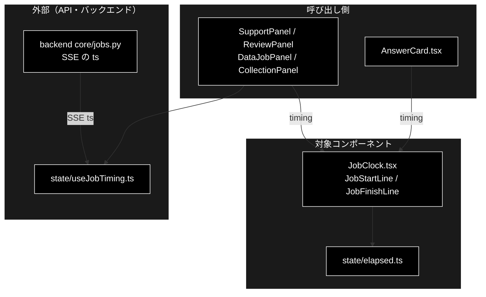
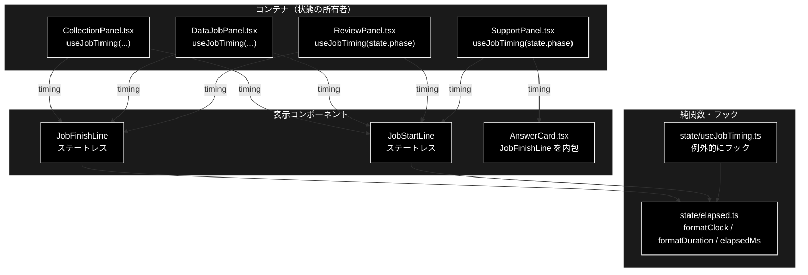
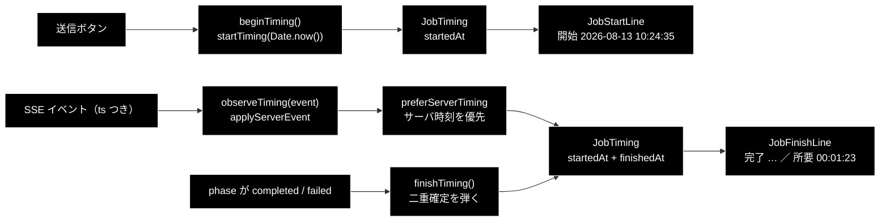
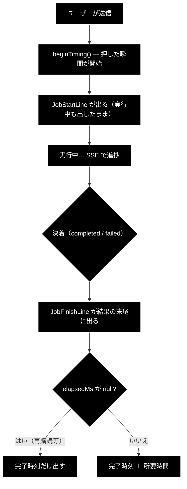

# JobClock.tsx - 実行の開始時刻・完了時刻・所要時間 ドキュメント

**Version 1.1** | 最終更新: 2026-09-24

---

## 目次

- [概要](#概要)
- [1. アーキテクチャ構成図](#1-アーキテクチャ構成図)
- [2. Props インターフェース](#2-props-インターフェース)
- [3. 状態管理](#3-状態管理)
- [4. データフロー・副作用](#4-データフロー副作用)
- [5. ユーザー操作フロー](#5-ユーザー操作フロー)
- [6. 型定義とバックエンド対応](#6-型定義とバックエンド対応)
- [7. スタイル・アクセシビリティ](#7-スタイルアクセシビリティ)
- [8. テスト](#8-テスト)
- [9. 変更履歴](#9-変更履歴)

---

## 概要

| 項目 | 内容 |
|---|---|
| ファイル | `frontend/src/components/JobClock.tsx`（47 行） |
| 種別 | 表示コンポーネント（ステートレス）。**1 ファイルに 2 つ export する** |
| 親 | `SupportPanel` / `ReviewPanel` / `DataJobPanel` / `CollectionPanel` / `AnswerCard` |
| 子 | なし |
| 主な依存 | `../state/elapsed`（`JobTiming` / `elapsedMs` / `formatClock` / `formatDuration`） |
| 対応バックエンド | SSE イベントの `ts`（`backend/app/core/jobs.py`）— 採否は `state/elapsed.ts` が判断 |

### 主な責務

- 実行の**開始時刻**（`JobStartLine`）と**完了時刻＋所要時間**（`JobFinishLine`）を出す。
- **出せない情報は黙って省く。** 推測値を出さない。
- 4 つのタブで共用する（同じ見た目・同じ規則で時刻を出す）。

> ⚠️ **所要時間が出ないことがあるのは仕様である。** タブを離れて戻る再購読や
> リロードでは開始時刻を知らない経路があり、そのとき `elapsedMs()` は `null` を返す。
> `JobFinishLine` は完了時刻だけを出し、**所要の行を出さない**。
> 「00:00:00」や推測値を出すより、無い方がよいという判断（`state/elapsed.ts` のコメント）。
>
> ローカル LLM は 1 周が長く**この経路を踏む機会が多い**ため、
> SSE の `ts`（サーバ時計）からサーバ側の開始・完了時刻を組み立て、
> あればそちらを正とする仕組みが `state/elapsed.ts` にある。

### 各責務対応のモジュール

| # | 責務 | 対応モジュール | 説明 |
|---|---|---|---|
| 1 | 開始・完了時刻と所要時間の表示 | `JobClock.tsx` / `state/elapsed.ts` | `JobStartLine` / `JobFinishLine`、整形は `formatClock` / `formatDuration` |
| 2 | 出せない情報を省く | `state/elapsed.ts` | `elapsedMs` が開始時刻不明なら `null` を返す |
| 3 | 4 タブで共用 | `JobClock.tsx` | Support / Review / データ管理の各パネルと `AnswerCard` から使う |

### 主要機能一覧

| 機能 | 実装 | 説明 |
|---|---|---|
| 開始行 | `JobStartLine` | `timing.startedAt === null` なら `null` を返して**何も描かない** |
| 完了行 | `JobFinishLine` | `timing.finishedAt === null` なら何も描かない |
| 所要時間 | `elapsedMs(timing)` | `null`（両端が揃わない）なら所要の部分だけ省く |
| 機械可読な時刻 | `<time dateTime={isoOf(ms)}>` | 読み上げと将来の集計のために ISO 文字列を付ける |

---

## 1. アーキテクチャ構成図

### 1.1 システム全体での位置づけ



**データフロー**:

1. 各パネルが `useJobTiming` で開始・完了時刻（サーバの `ts` を優先）を保持する
2. `timing` を prop で受け取り、`state/elapsed.ts` の純関数で表示用に整形する
3. 開始時刻が分からない経路では所要時間を出さず、完了時刻だけを出す

### 1.2 コンポーネントツリー図



---

## 2. Props インターフェース

`interface Props` は宣言されておらず、**引数で直接受ける**（どちらも同じ形）。

```typescript
export function JobStartLine({ timing }: { timing: JobTiming }) { /* ... */ }

export function JobFinishLine({ timing }: { timing: JobTiming }) { /* ... */ }
```

| Prop | 型 | 必須 | 既定値 | 説明 |
|---|---|:---:|---|---|
| `timing` | `JobTiming` | ✅ | — | `{ startedAt: number \| null; finishedAt: number \| null }`（エポックミリ秒） |

### コールバックの契約

**なし。** どちらもコールバック props を持たない（純粋な表示）。

### 描画されない条件

| 関数 | `null` を返す条件 | 意味 |
|---|---|---|
| `JobStartLine` | `timing.startedAt === null` | まだ送信していない（または開始時刻を知らない） |
| `JobFinishLine` | `timing.finishedAt === null` | まだ決着していない |
| `JobFinishLine` の所要部分 | `elapsedMs(timing) === null` | 両端が揃っていない。**完了時刻だけ出す** |

---

## 3. 状態管理

### 3.1 ローカル state（`useState`）

**なし。** どちらの関数も完全なステートレスコンポーネントである。

### 3.2 reducer state（`useReducer`）

**なし。** `JobTiming` の生成と更新は親の `useJobTiming()` が持つ。

### 3.3 親から渡る状態（props 由来）

| 値 | 供給元 | 本コンポーネントでの扱い |
|---|---|---|
| `timing` | 親の `useJobTiming(phase)` の第 1 要素 | 読み取りのみ。整形して描くだけ |

> **不変条件**: 時刻の**判断**（開始の打刻・二重確定の防止・サーバ時刻の採否）は
> すべて `state/elapsed.ts` と `state/useJobTiming.ts` にある。
> 本コンポーネントに分岐を足さないこと（CLAUDE.md §6）。

---

## 4. データフロー・副作用

### 4.1 副作用一覧（`useEffect`）

**なし。** `useEffect` を持たない。完了の検知は親の `useJobTiming` が行う。

### 4.2 データフロー図



### 4.3 整形規則（`state/elapsed.ts` から転記）

| 関数 | 規則 |
|---|---|
| `formatClock(ms)` | `2026-08-13 10:24:35`（**ローカル時刻**）。`toLocaleString()` は使わない（ロケールで書式が変わりテストが不安定になるため、桁を自分で組み立てる） |
| `formatDuration(ms)` | `00:01:23`（時:分:秒）。秒未満は切り捨て、**負値は `00:00:00` に倒す**（端末の時計巻き戻しの保険）、100 時間超は時の桁が 3 桁になる |
| `elapsedMs(timing)` | 両端が揃っていなければ `null` |

---

## 5. ユーザー操作フロー

### 5.1 イベントハンドラ一覧

**なし。** クリック可能な要素を持たない（表示専用）。

### 5.2 操作フロー図



> 📌 **開始行は完了後も消さない。** 完了時刻との比較の起点になるため
> （`JobClock.tsx` のコメント）。

---

## 6. 型定義とバックエンド対応

| TS 型（`src/state/elapsed.ts`） | 対応する Python | 定義元 |
|---|---|---|
| `JobTiming` | — （フロント専用の派生値） | — |
| `ServerTimedEvent`（`ts?: number \| null`） | SSE イベントの `ts`（エポック秒） | `backend/app/core/jobs.py` |
| `secondsToMs(ts)` | 秒 → ミリ秒の変換 | — |

> 📌 **再購読では SSE が先頭からリプレイされる**（`stream_events`）。
> そこからサーバ側の開始・完了時刻を組み立て、`preferServerTiming()` が
> クライアント時計より優先する。

---

## 7. スタイル・アクセシビリティ

| 項目 | 内容 |
|---|---|
| スタイル方式 | プレーン CSS（`src/styles.css`） |
| 主要クラス | `.job-clock`（L1218）・`.job-clock-label`（L1228）・`.job-clock-value`（L1238）・`.job-clock-elapsed`（L1244）・`.job-clock-start` / `.job-clock-finish` |
| ダークモード | 未対応 |

### アクセシビリティ・チェック

| 観点 | 状態 |
|---|---|
| 時刻が機械可読か | ✅ `<time dateTime={ISO 文字列}>` を使用 |
| 情報が色のみに依存していないか | ✅ 「開始」「所要」のラベル文字を併用 |
| 更新を支援技術へ通知しているか | ❌ `aria-live` は付けていない（進捗の読み上げは `Timeline` が担当し、二重読み上げを避けるため意図的） |
| ラベルと値が関連づいているか | ❌ `<dl>` ではなく `<p>` ＋ `<span>`。意味づけとしては弱い |

---

## 8. テスト

| テストファイル | 対象 | 実行 |
|---|---|---|
| `src/state/elapsed.test.ts`（**22 件**） | `startTiming` / `finishTiming` / `formatClock` / `formatDuration` / `elapsedMs` | `npm test` |
| `src/state/serverTiming.test.ts`（**16 件**） | `applyServerEvent` / `preferServerTiming` / `secondsToMs` | `npm test` |

> ⚠️ **`serverTiming.test.ts` が検証するのは `elapsed.ts` である**
> （`state/serverTiming.ts` というファイルは**存在しない**）。ファイル名から実装を推測しないこと。

### テスト方針

- 本コンポーネントのレンダリングテストは**無い**（`@testing-library/react` 未導入、
  vitest は `.test.tsx` を収集しない）。
- 整形と判断はすべて `state/elapsed.ts` の純関数にあり、そちらで計 **38 件**が検証している。
  本コンポーネントに残っているのは「null なら描かない」という描画分岐だけで、
  `tsc --noEmit` がガードする。

---

## 9. 変更履歴

| 版 | 日付 | 変更内容 |
|---|---|---|
| 1.0 | 2026-09-20 | 初版作成 |
| 1.1 | 2026-09-24 | `a_react_page_md_format.md` v1.1 に追随（2026-09-24）。概要に「各責務対応のモジュール」（主な責務と 1:1）を追加し、`## 1.` を「アーキテクチャ構成図」として **1.1 システム全体での位置づけ（3 層）** と 1.2 コンポーネントツリー図の 2 枚構成にした。Mermaid の `classDef subgraphStyle` の欠落を補った |
