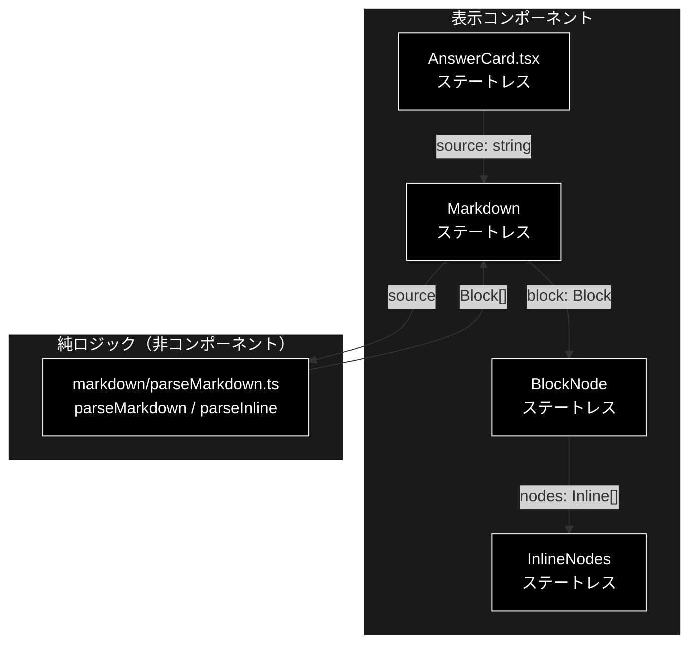
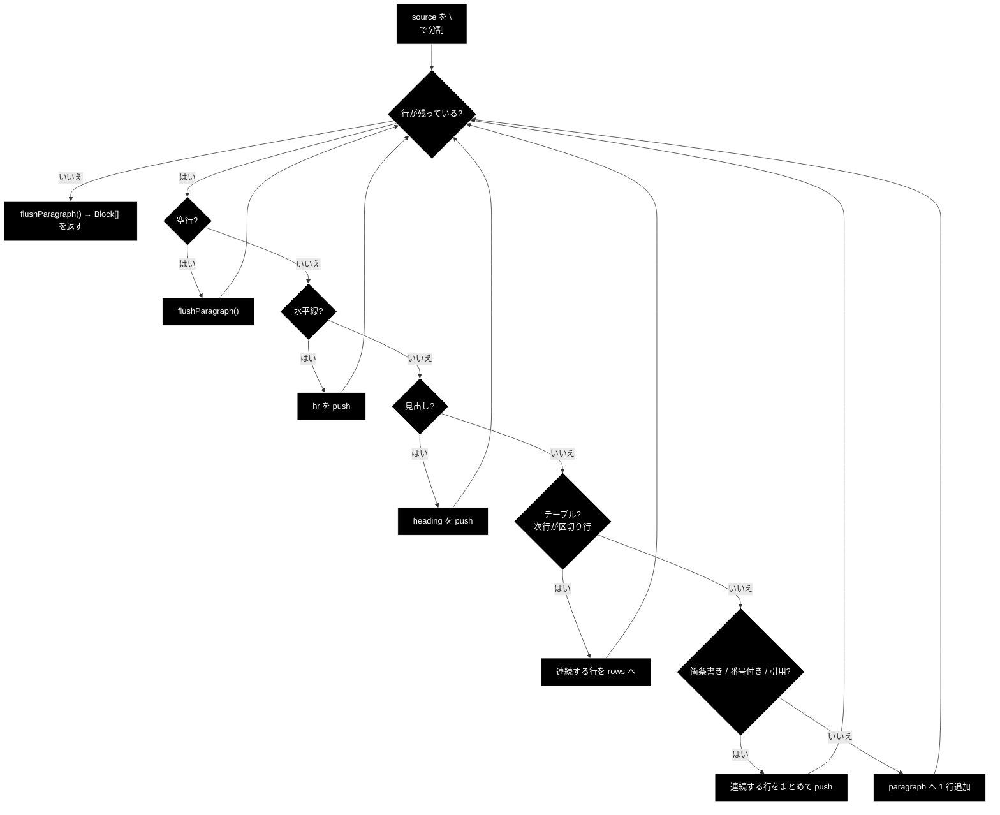
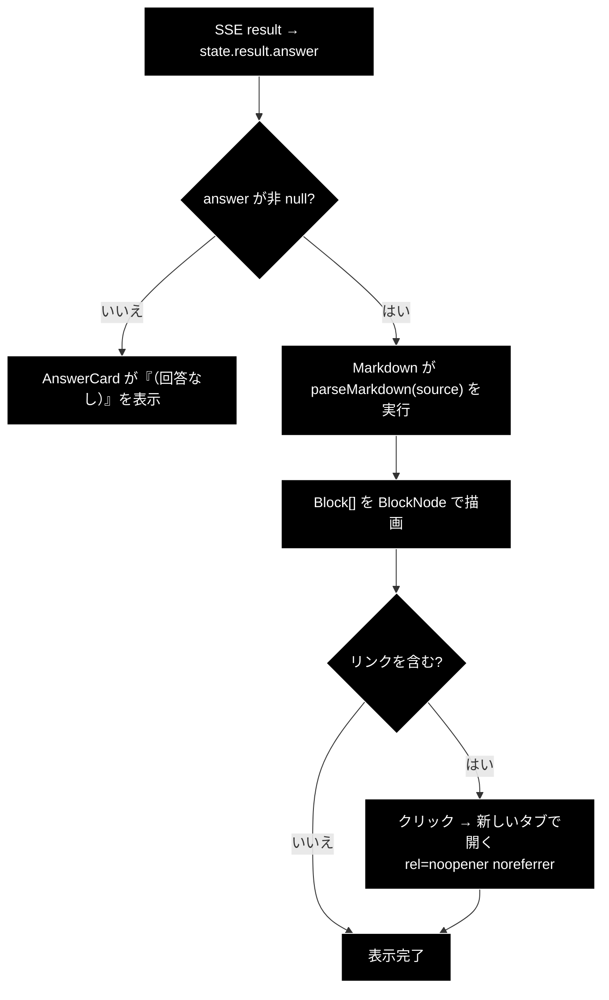

# Markdown.tsx - 依存ライブラリなしの Markdown レンダラ ドキュメント

**Version 1.0** | 最終更新: 2026-08-01

---

## 目次

- [概要](#概要)
- [1. コンポーネントツリー図](#1-コンポーネントツリー図)
- [2. Props インターフェース](#2-props-インターフェース)
- [3. 状態管理](#3-状態管理)
- [4. データフロー・副作用](#4-データフロー副作用)
- [5. API 通信・SSE イベント](#5-api-通信sse-イベント)
- [6. ユーザー操作フロー](#6-ユーザー操作フロー)
- [7. 型定義とバックエンド対応](#7-型定義とバックエンド対応)
- [8. スタイル・アクセシビリティ](#8-スタイルアクセシビリティ)
- [9. テスト](#9-テスト)
- [10. 変更履歴](#10-変更履歴)

---

## 概要

| 項目 | 内容 |
|---|---|
| ファイル | `frontend/src/components/Markdown.tsx`（描画）＋ `frontend/src/markdown/parseMarkdown.ts`（解析） |
| 種別 | `Markdown` / `BlockNode` / `InlineNodes` = 表示コンポーネント（ステートレス）<br>`parseMarkdown` / `parseInline` = 純ロジック（非コンポーネント） |
| 親 | `AnswerCard.tsx`（**唯一の利用箇所**。2 箇所から呼ばれる） |
| 子 | なし（HTML 要素を直接組む） |
| 主な依存 | `react`（`Fragment` のみ）、`../markdown/parseMarkdown` |
| 対応バックエンド | LLM が生成する回答本文（`SupportResult.answer`）。特定の Python 型に対応するものではない |

### 主な責務

**`parseMarkdown.ts`（解析・純関数）**

- Markdown 文字列を**ブロック AST** へ変換する。副作用ゼロで node 環境からテストできる。
- 対応するのは GRACE-Support の回答本文に現れる**サブセット**のみ（下表）。

**`Markdown.tsx`（描画）**

- ブロック AST を React 要素として描画する。`dangerouslySetInnerHTML` を使わない。
- 外部リンクに `target="_blank" rel="noopener noreferrer"` を付ける。
- 表を `.markdown-table-wrap` で包み、横スクロールできるようにする。

### なぜ自前実装なのか

| 選択肢 | 採否 | 理由 |
|---|---|---|
| `react-markdown` 等のライブラリ | ❌ | 依存とバンドルサイズが増える。必要なのは狭いサブセットだけ |
| `dangerouslySetInnerHTML` + `marked` | ❌ | **回答本文は LLM 出力**であり、HTML として解釈させると XSS 経路になる |
| 自前パーサ + React 要素の組み立て | ✅ 採用 | React がテキストノードをエスケープする。解析を純関数に分離してテスト可能 |

> `DocumentView` / `highlight.ts` と**同じ設計方針**（ロジックはデータだけを作り、
> 要素の組み立ては JSX 側）。ロジック側が JSX を返さないので
> `dangerouslySetInnerHTML` を使う余地自体が生まれない。

### 対応する Markdown 記法

| 種別 | 記法 | 正規表現 | AST の `type` |
|---|---|---|---|
| ブロック | 見出し（`#` 〜 `######`） | `HEADING_RE` | `heading`（`level` 1〜6） |
| ブロック | 水平線（`---` / `***` / `___`） | `HR_RE` | `hr` |
| ブロック | 箇条書き（`-` / `*`） | `UL_RE` | `list`（`ordered: false`） |
| ブロック | 番号付きリスト（`1.`） | `OL_RE` | `list`（`ordered: true`） |
| ブロック | 引用（`>`） | `QUOTE_RE` | `blockquote` |
| ブロック | GFM テーブル（`\| ... \|` + 区切り行） | `TABLE_ROW_RE` / `TABLE_SEP_RE` | `table` |
| ブロック | 段落（上記以外） | — | `paragraph` |
| インライン | 太字（`**text**`） | `pattern` の第 1 群 | `bold` |
| インライン | インラインコード（`` `code` ``） | 第 2 群 | `code` |
| インライン | リンク（`[text](url)`） | 第 3 群 | `link` |
| インライン | 上記以外 | — | `text` |

**非対応**（記法として書かれても素のテキストになる）:
コードフェンス（` ``` `）・斜体（`*text*` 単独）・打ち消し（`~~`）・画像（``）・
ネストしたリスト・タスクリスト（`- [ ]`）・脚注・HTML 直書き。

---

## 1. コンポーネントツリー図



> `BlockNode` / `InlineNodes` は `Markdown.tsx` 内のモジュール private コンポーネント
> （export していない）。`Markdown` だけが外部インターフェースである。

---

## 2. Props インターフェース

### 2.1 `Markdown`（export）

```typescript
export function Markdown({ source }: { source: string })
```

| Prop | 型 | 必須 | 既定値 | 説明 |
|---|---|:---:|---|---|
| `source` | `string` | ✅ | — | Markdown 文字列。実際は `SupportResult.answer` |

> `AnswerCard` は `result.answer ? <Markdown source={result.answer} /> : ...` と
> **null チェック済みで渡す**ため、`source` に `null` は来ない。
> ただし `parseMarkdown` 側は `(source ?? '')` で防御しており、
> 万一 `undefined` が来ても空配列を返して落ちない。

### 2.2 `BlockNode`（private）

```typescript
function BlockNode({ block }: { block: Block })
```

| Prop | 型 | 必須 | 既定値 | 説明 |
|---|---|:---:|---|---|
| `block` | `Block` | ✅ | — | 1 ブロック分の AST ノード |

### 2.3 `InlineNodes`（private）

```typescript
function InlineNodes({ nodes }: { nodes: Inline[] })
```

| Prop | 型 | 必須 | 既定値 | 説明 |
|---|---|:---:|---|---|
| `nodes` | `Inline[]` | ✅ | — | インライントークン列 |

### コールバックの契約

コールバック props は**なし**。3 つとも親へ通知しない純表示コンポーネント。

---

## 3. 状態管理

### 3.1 ローカル state（`useState`）

**なし。** `Markdown` / `BlockNode` / `InlineNodes` のいずれも
`useState` / `useReducer` / `useEffect` / `useRef` を持たない。

### 3.2 reducer state（`useReducer`）

**なし。**

### 3.3 親から渡る状態（props 由来）

| 値 | 供給元 | 本コンポーネントでの扱い |
|---|---|---|
| `source` | `AnswerCard` の `result.answer`（`jobReducer` の `state.result`） | 読み取りのみ |

> **不変条件**: `parseMarkdown` は入力文字列を変更しない（`String` は不変）。
> 生成される AST も毎回新しく作られ、キャッシュしない（§4.1）。

---

## 4. データフロー・副作用

### 4.1 副作用一覧（`useEffect`）

**なし。** ただし**レンダリングのたびに `parseMarkdown` を呼び直す**。

```typescript
export function Markdown({ source }: { source: string }) {
  const blocks = parseMarkdown(source);   // ← メモ化していない
  ...
}
```

| 検討事項 | 現状 |
|---|---|
| `useMemo(() => parseMarkdown(source), [source])` | 未導入。回答本文は数千字程度で、SSE 完了後は `source` が変わらないため実測で問題が出ていない。再レンダリングが頻繁になったらここが候補 |

### 4.2 解析（`parseMarkdown`）の構造

行単位の**単一パス走査**。カーソル `i` を進めながらブロックを切り出す。



#### 判定の優先順（上から先に一致した方が勝つ）

1. 空行 → 段落の区切り
2. 水平線（`HR_RE`）
3. 見出し（`HEADING_RE`）
4. テーブル（現在行が `| ... |` **かつ** 次行が区切り行 **かつ** 次行に `-` を含む）
5. 箇条書き（`UL_RE`）
6. 番号付きリスト（`OL_RE`）
7. 引用（`QUOTE_RE`）
8. 段落（それ以外）

> ⚠️ **水平線が箇条書きより先に判定される。** `---` は `UL_RE`（`^\s*[-*]\s+`）に
> **一致しない**（`-` の後に空白＋本文が要る）ので競合しないが、
> **`- - -` は両方に一致しうる**。実測すると `HR_RE` が先に評価されるため
> `[{ type: 'hr' }]` になる（`- -` という 1 項目の箇条書きにはならない）。
> 判定順を入れ替えるとここの挙動が変わる。

> ⚠️ **テーブル判定は「次行」を先読みする。** `TABLE_SEP_RE` は
> `^\s*\|?[\s:|-]*-[\s:|-]*\|?\s*$` と緩いため、`lines[i+1].includes('-')` の
> 追加チェックで空行や `| |` を除外している。この二重チェックが無いと、
> 単なる `| a | b |` の 1 行が誤ってテーブル扱いになる。

### 4.3 インライン解析（`parseInline`）

```typescript
const pattern = /(\*\*([^*]+)\*\*)|(`([^`]+)`)|(\[([^\]]+)\]\(([^)]+)\))/;
```

**1 本の交替（alternation）正規表現**で、太字・コード・リンクのうち
「最初に現れたもの」を切り出し、残りを再帰的でないループで処理する。

| 捕獲群 | 記法 | 生成トークン |
|---|---|---|
| `m[1]` / `m[2]` | `**bold**` | `{ type: 'bold', value: m[2] }` |
| `m[3]` / `m[4]` | `` `code` `` | `{ type: 'code', value: m[4] }` |
| `m[5]` / `m[6]` / `m[7]` | `[text](url)` | `{ type: 'link', value: m[6], href: m[7] }` |

| 挙動 | 説明 |
|---|---|
| ネスト | **非対応**。`**[a](http://x)**` は太字 1 個になり、中の `[a](http://x)` は素のテキストのまま（実測確認済み） |
| 空入力 | `tokens.length > 0 ? tokens : [{ type: 'text', value: '' }]` で**必ず 1 要素以上**返す |
| `[^*]+` / `` [^`]+ `` | 貪欲だが文字クラスで区切り記号を除外しているため、最短一致相当に振る舞う |

> **交替の順序は実質的に効かない。** `pattern.exec` は「最も左で一致した候補」を返すが、
> 3 記法の開始文字（`*` / `` ` `` / `[`）が互いに排他なので、
> **2 つの候補が同じ位置で一致することがない**。したがって常に「最も左にある記法」が勝ち、
> 交替の並び順を入れ替えても結果は変わらない。
>
> 実測（`parseInline` を直接呼んで確認）:
>
> | 入力 | 結果 |
> |---|---|
> | `` `**x**` `` | `[{ type: 'code', value: '**x**' }]` — バッククォートが index 0 なのでコードが勝つ |
> | `**[a](http://x)**` | `[{ type: 'bold', value: '[a](http://x)' }]` — 太字が index 0。**リンクは解析されず素のテキストになる** |

### 4.4 描画（`Markdown.tsx`）

| AST `type` | 生成される要素 | 備考 |
|---|---|---|
| `heading` | `<h1>` 〜 `<h6>` | `` `h${block.level}` `` を型アサーションでタグ名に |
| `hr` | `<hr />` | — |
| `list` | `<ol>` または `<ul>` + `<li>` | `block.ordered` で分岐 |
| `blockquote` | `<blockquote>` + `<p>` × 行数 | 行ごとに段落を作る |
| `table` | `<div className="markdown-table-wrap">` + `<table>` / `<thead>` / `<tbody>` | **ラッパで横スクロール** |
| `paragraph` | `<p>` + 行間に `<br />` | `idx > 0 && <br />` で 2 行目以降にのみ挿入 |
| （既定） | `null` | 未知のブロック型は何も描かない |

| インライン `type` | 生成される要素 |
|---|---|
| `bold` | `<strong>` |
| `code` | `<code>` |
| `link` | `<a target="_blank" rel="noopener noreferrer">` |
| （既定 = `text`） | `<Fragment>`（要素を増やさずテキストのみ） |

> ⚠️ **`href` は検証していない。** `[x](javascript:alert(1))` のような URL が
> LLM 出力に含まれると、そのまま `href` に入る。React は `href` の
> `javascript:` を**警告するが実行は防がない**（バージョンにより挙動が異なる）。
> 現状は回答本文が社内ナレッジと Web 検索結果に由来する前提で許容しているが、
> 堅くするなら `href.startsWith('http')` のチェックを足すのが最小の対策。

> **リンクの `rel="noopener noreferrer"` は必須。** `target="_blank"` だけだと
> 開いた先から `window.opener` 経由で元ページを操作されうる（tabnabbing）。

### 4.5 `key` の付け方

すべて**配列インデックス**（`key={idx}`）を使っている。

| 場所 | `key` |
|---|---|
| `Markdown` のブロック | `idx` |
| `BlockNode` のリスト項目 / 引用行 / 表の行・セル | `idx` / `rIdx` / `cIdx` |
| `InlineNodes` のトークン | `idx` |

> インデックス `key` は一般に「並び替え・挿入がある動的リスト」では避けるべきだが、
> ここでは **AST が `source` から決定的に再生成される**（部分更新が無い）ため問題にならない。
> `source` が変われば全ブロックが作り直される。

### 4.6 データフロー図


---

## 5. API 通信・SSE イベント

**該当なし。** `fetch` / `EventSource` を一切呼ばない。入力は props で受け取る文字列のみ。

---

## 6. ユーザー操作フロー

### 6.1 イベントハンドラ一覧

| 要素 | イベント | ハンドラ | 効果 | 無効化条件 |
|---|---|---|---|---|
| `<a target="_blank">` | `click`（ネイティブ） | **なし** | 新しいタブで外部リンクを開く | なし |
| その他 | — | なし | — | — |

**React のイベントハンドラは 1 つも無い。** 唯一の操作は生成されたリンクのクリックで、
ブラウザのネイティブ動作である。

### 6.2 表示フロー図



---

## 7. 型定義とバックエンド対応

本コンポーネントは**バックエンドのスキーマに直接対応する型を持たない**
（入力は `SupportResult.answer` という単なる `string`）。
AST の型はフロント固有である。

```typescript
export type Inline =
  | { type: 'text'; value: string }
  | { type: 'bold'; value: string }
  | { type: 'code'; value: string }
  | { type: 'link'; value: string; href: string };

export type Block =
  | { type: 'heading'; level: number; inline: Inline[] }
  | { type: 'paragraph'; lines: Inline[][] }
  | { type: 'hr' }
  | { type: 'list'; ordered: boolean; items: Inline[][] }
  | { type: 'blockquote'; lines: Inline[][] }
  | { type: 'table'; header: Inline[][]; rows: Inline[][][] };
```

| 型 | 定義元 | 対応するバックエンド |
|---|---|---|
| `Block` / `Inline` | `src/markdown/parseMarkdown.ts` | なし（フロント固有の AST） |
| （入力） | `SupportResult.answer`（`string \| null`） | `backend/app/core/support_agent.py` |

### 判別可能ユニオン（discriminated union）の効き方

`Block` は `type` フィールドで判別されるユニオンなので、`BlockNode` の `switch` 内では
各 `case` で対応するフィールド（`block.level` / `block.items` / `block.header` 等）に
**型安全にアクセスできる**。

> ⚠️ **`default: return null;` があるため、新しい `Block` 型を追加しても
> `tsc` は網羅漏れを警告しない。** 追加した型は黙って描画されなくなる。
> 網羅性チェックを効かせたいなら `default` で `never` への代入を試みる書き方にする。

### `heading` のタグ生成

```typescript
const Tag = `h${block.level}` as 'h1' | 'h2' | 'h3' | 'h4' | 'h5' | 'h6';
```

`block.level` は `number` 型なので、**型アサーションで narrowing している**。
`HEADING_RE`（`^(#{1,6})\s+`）が 1〜6 に制限しているため実行時は安全だが、
`parseMarkdown` を経由せず `Block` を手で作れば `h7` のような不正なタグを生成できる。

---

## 8. スタイル・アクセシビリティ

| 項目 | 内容 |
|---|---|
| スタイル方式 | プレーン CSS（`src/styles.css`）。CSS-in-JS・Tailwind は不使用 |
| 主要クラス | `.markdown-body`（ルート）, `.markdown-table-wrap`（表のラッパ） |
| 子孫セレクタ | `.markdown-body h1` 〜 `h6` / `p` / `ul` / `ol` / `table` 等を子孫セレクタで整形（`styles.css` に約 26 箇所） |
| 見出しサイズ | `h1: 1.4rem` / `h2: 1.2rem`（下線付き）/ `h3: 1.05rem` / `h4`〜`h6`: `0.95rem` |
| 長い語の折り返し | `.markdown-body { overflow-wrap: anywhere }` — URL などが横にはみ出さない |
| 先頭要素の余白 | `.markdown-body > *:first-child { margin-top: 0 }` |
| ダークモード | 未対応（対応する場合は `prefers-color-scheme` を使う） |

### アクセシビリティ・チェック

| 観点 | 状態 |
|---|---|
| フォーム要素に `label` が対応しているか | 該当なし（フォーム要素を持たない） |
| モーダルにフォーカストラップがあるか | 該当なし |
| 状態表示が色のみに依存していないか（記号併用） | 該当なし（状態表示を持たない） |
| キーボードのみで操作できるか | ✅ 生成される `<a>` はネイティブ要素なので Tab + Enter で到達・実行可 |
| 意味的な HTML を使っているか | ✅ `<strong>` / `<code>` / `<blockquote>` / `<ol>` / `<ul>` / `<table>` / `<thead>` / `<th>` を用途どおりに使用 |
| 表にヘッダセルがあるか | ✅ `<thead>` + `<th>` |
| 表が横スクロールできるか | ✅ `.markdown-table-wrap` で包んでいる |
| 見出し階層が飛んでいないか | ❌ **LLM 出力次第**。`# 見出し` が来れば `<h1>` が生成され、ページの `<h1>`（`App.tsx:34`）と重複する。レベルを制限していない |
| 新しいタブで開くことが事前に伝わるか | ❌ `target="_blank"` のリンクに「新しいタブで開きます」の表示や `aria-label` が無い |
| リンクの `href` が検証されているか | ❌ `javascript:` などのスキームを弾いていない（§4.4） |

> 上記 ❌ は既知の未対応であり、消さずに残す。見出しレベルについては、
> 描画時に `Math.min(block.level + 1, 6)` のようにオフセットするのが最小の対策。

---

## 9. テスト

| テストファイル | 対象 | ケース数 | 実行 |
|---|---|:---:|---|
| `src/markdown/parseMarkdown.test.ts` | `parseInline` / `parseMarkdown` | **10** | `npm test` |
| （`Markdown.tsx` の専用テストなし） | — | — | — |

### テストケースの内訳

| `describe` | `it` | 検証内容 |
|---|---|---|
| `parseInline` | 太字・インラインコード・リンクを分解する | 3 記法が正しいトークンになる |
| `parseInline` | 記法が無ければ 1 つの text になる | 素のテキストの扱い |
| `parseMarkdown` | 見出しをレベル付きで解析する | `level` 1〜6 |
| `parseMarkdown` | 水平線を hr にする | `HR_RE` |
| `parseMarkdown` | 箇条書きをリストにまとめる | 連続行の集約 |
| `parseMarkdown` | 番号付きリストを ordered=true にする | `ordered` フラグ |
| `parseMarkdown` | GFM テーブルをヘッダと行に分解する | ヘッダ + 区切り行 + データ行 |
| `parseMarkdown` | 引用を blockquote にする | `QUOTE_RE` |
| `parseMarkdown` | 段落は空行で区切られ、連続行は同一段落になる | `flushParagraph` の挙動 |
| `parseMarkdown` | 空文字列は空配列を返す | 境界値 |

### テスト方針

- **解析ロジックを純関数として分離してあるため、この系統ではテストが最も充実している。**
  `parseMarkdown.ts` は React に依存せず node 環境で動くので、vitest からそのまま呼べる。
  これが「ロジックを JSX の外へ出す」設計の直接の利点である。
- `Markdown.tsx`（描画側）は `@testing-library/react` 未導入のためテストできず、
  `tsc --noEmit` の型検査でガードしている。AST → 要素の対応は `switch` の
  単純な写像なので、リスクは解析側より低い。
- CI では `npm run lint`（tsc）→ `npm test`（vitest）→ `npm run build` の順に実行され、
  **いずれも blocking**。

### 未カバーの領域

| 項目 | 状態 |
|---|---|
| インライン記法のネスト（`**[link](url)**`） | 未テスト。仕様として非対応 |
| テーブル判定の誤検知（`\| a \| b \|` 単独行） | 未テスト。実測では `paragraph` になり誤検知しないことを確認済みだが、テストケースは無い |
| `- - -` が hr になること | 未テスト（実測確認のみ） |
| 未知の `Block` 型（`default: return null`） | 未テスト（型で到達不能） |
| `href` のスキーム検証 | **未実装のためテストも無い** |

---

## 10. 変更履歴

| 版 | 日付 | 変更内容 |
|---|---|---|
| 1.0 | 2026-08-01 | 初版作成 |
