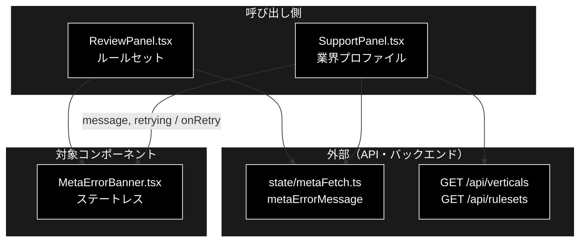
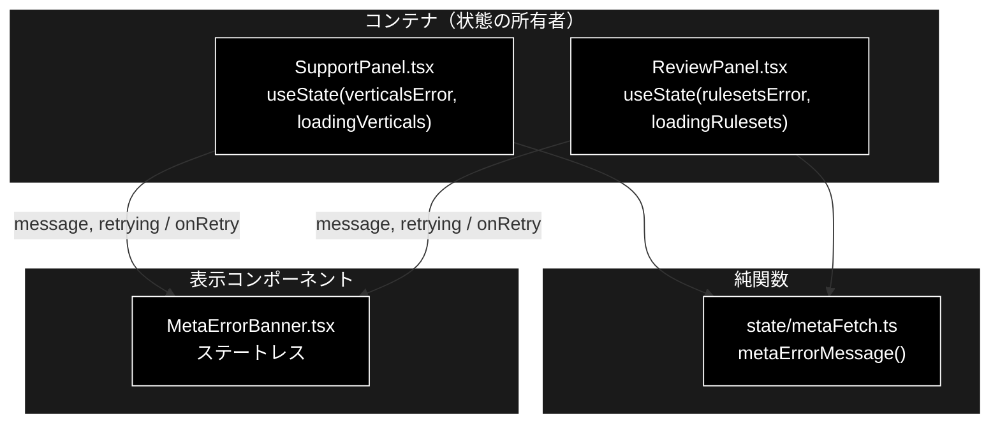
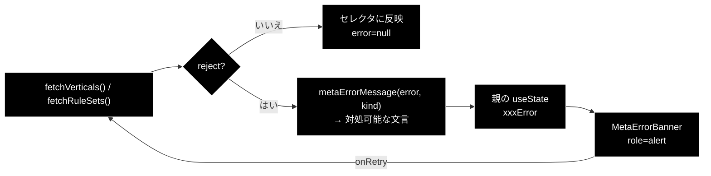
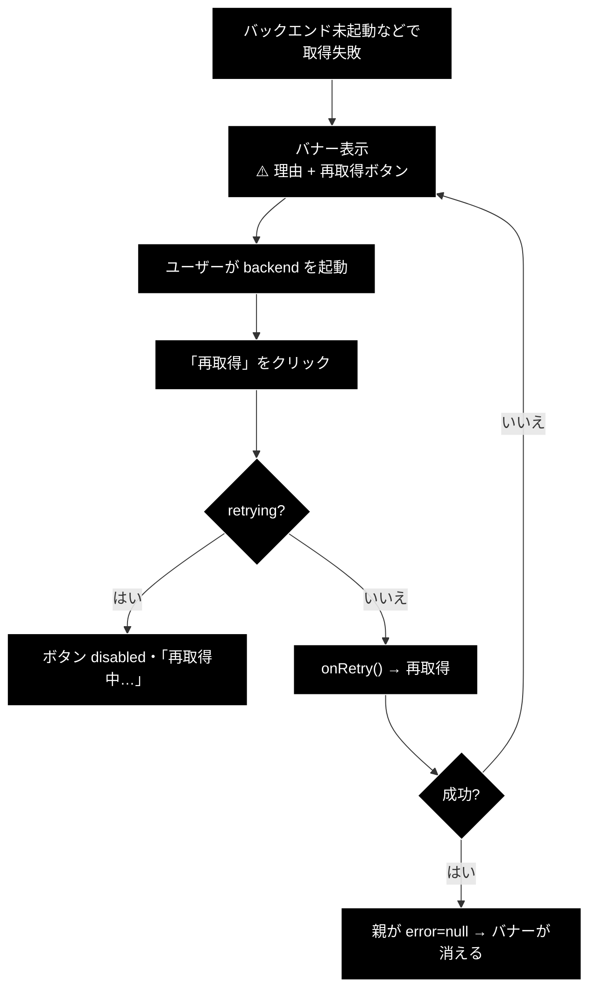

# MetaErrorBanner.tsx - メタ情報の取得失敗バナー ドキュメント

**Version 1.1** | 最終更新: 2026-09-24

---

## 目次

- [概要](#概要)
- [1. アーキテクチャ構成図](#1-アーキテクチャ構成図)
- [2. Props インターフェース](#2-props-インターフェース)
- [3. 状態管理](#3-状態管理)
- [4. データフロー・副作用](#4-データフロー副作用)
- [5. ユーザー操作フロー](#5-ユーザー操作フロー)
- [6. 型定義とバックエンド対応](#6-型定義とバックエンド対応)
- [7. スタイル・アクセシビリティ](#7-スタイルアクセシビリティ)
- [8. テスト](#8-テスト)
- [9. 変更履歴](#9-変更履歴)

---

## 概要

| 項目 | 内容 |
|---|---|
| ファイル | `frontend/src/components/MetaErrorBanner.tsx`（24 行） |
| 種別 | 表示コンポーネント（ステートレス） |
| 親 | `SupportPanel.tsx`（業界プロファイル）／ `ReviewPanel.tsx`（ルールセット） |
| 子 | なし |
| 主な依存 | なし（文言の生成は親が `../state/metaFetch` で行う） |
| 対応バックエンド | `GET /api/verticals` ／ `GET /api/rulesets` の失敗 |

### 主な責務

- 業界プロファイル・ルールセットの取得に失敗したことを、**理由つきで**画面に出す。
- 「再取得」ボタンで、**ページ全体をリロードせずに**復帰できるようにする。
- 再取得中はボタンを無効化し、二重送信を防ぐ。

> **なぜ必要か**: 以前は取得失敗を無言で空配列に倒していた（silent failure）。
> セレクタが空になるだけなので、ユーザーには「機能が壊れている」としか見えなかった。
> 原因はほぼ「バックエンドが起動していない」なので、**理由と復旧手順を出せば自力で直せる**。

### 各責務対応のモジュール

| # | 責務 | 対応モジュール | 説明 |
|---|---|---|---|
| 1 | 失敗理由の表示 | `MetaErrorBanner.tsx` / `state/metaFetch.ts` | 文言は親が `metaErrorMessage` で作って渡す |
| 2 | 再取得ボタン | `MetaErrorBanner.tsx` | `onRetry` を親へ返す |
| 3 | 再取得中の無効化 | `MetaErrorBanner.tsx` | `retrying` で `disabled` |

### 主要機能一覧

| 機能 | 実装 | 説明 |
|---|---|---|
| 理由の表示 | `<span>⚠️ {message}</span>` | 文言は親が `metaErrorMessage()` で作る |
| 再取得 | `onClick={onRetry}` | 親の `loadVerticals()` / `loadRulesets()` を再実行 |
| 二重送信防止 | `disabled={retrying}` | 押下中はラベルが「再取得中…」に変わる |
| 支援技術への通知 | `role="alert"` | 出現した時点で読み上げられる |

---

## 1. アーキテクチャ構成図

### 1.1 システム全体での位置づけ



**データフロー**:

1. 親パネルがメタ情報（業界プロファイル / ルールセット）を取得し、失敗時に `metaErrorMessage` で文言を作る
2. 本コンポーネントが文言と再取得ボタンを表示する
3. 再取得ボタンで親の `onRetry` が呼ばれ、同じ API を取り直す

### 1.2 コンポーネントツリー図



---

## 2. Props インターフェース

```typescript
interface Props {
  message: string;
  onRetry: () => void;
  /** 再取得中はボタンを無効化して二重送信を防ぐ。 */
  retrying?: boolean;
}
```

| Prop | 型 | 必須 | 既定値 | 説明 |
|---|---|:---:|---|---|
| `message` | `string` | ✅ | — | 表示する理由。親が `metaErrorMessage(error, kind)` で生成する |
| `onRetry` | `() => void` | ✅ | — | 再取得ボタンのクリックハンドラ |
| `retrying` | `boolean` | | `false` | 再取得中フラグ。`true` でボタンを `disabled` にしラベルを変える |

### コールバックの契約

| コールバック | 呼ばれる条件 | 親側の責務 |
|---|---|---|
| `onRetry` | 再取得ボタンの `click`（`retrying === false` のとき） | メタ取得を再実行し、`retrying` を立てて／下ろす。成功したらエラーを `null` に戻してバナーを消す |

> ⚠️ **バナーを消すのは親の責務。** 本コンポーネントは `message` が渡っている間は出続ける。
> 親が成功時に `setXxxError(null)` を呼ばないと、復帰してもバナーが残る。

---

## 3. 状態管理

### 3.1 ローカル state（`useState`）

**なし。** 完全なステートレスコンポーネントである。

### 3.2 reducer state（`useReducer`）

**なし。**

### 3.3 親から渡る状態（props 由来）

| 値 | 供給元 | 本コンポーネントでの扱い |
|---|---|---|
| `message` | 親の `useState<string \| null>` ＋ `metaErrorMessage()` | 読み取りのみ |
| `retrying` | 親の `useState<boolean>`（`loadingVerticals` / `loadingRulesets`） | 読み取りのみ。`disabled` の判定に使う |

> **不変条件**: props を変更しない。再取得は `onRetry` で親に依頼する。

---

## 4. データフロー・副作用

### 4.1 副作用一覧（`useEffect`）

**なし。** `useEffect` を持たない。取得と再取得は親が行う。

### 4.2 データフロー図



> 📌 **失敗時に空配列へ倒すこと自体は正しい。** 足りていなかったのは
> 「なぜ空なのか」を伝えることだった（`ReviewPanel.tsx` のコメント参照）。

---

## 5. ユーザー操作フロー

### 5.1 イベントハンドラ一覧

| 要素 | イベント | ハンドラ | 効果 | 無効化条件 |
|---|---|---|---|---|
| 再取得ボタン | `click` | `onRetry` | 親がメタ取得を再実行 | `retrying === true` |

### 5.2 操作フロー図



---

## 6. 型定義とバックエンド対応

本コンポーネントはバックエンド由来の型を直接扱わない（`message` は文字列）。
文言を作る側の対応は次のとおり。

| TS（`src/state/metaFetch.ts`） | 対応 | 定義元 |
|---|---|---|
| `MetaKind`（`'業界プロファイル' \| 'ルールセット'`） | 取得対象の名前 | `GET /api/verticals` ／ `GET /api/rulesets` |
| `metaErrorMessage(error, kind)` | 例外 → 対処可能な 1 行 | — |
| `looksUnreachable(error)` | 「バックエンド未起動」らしさの判定 | — |

---

## 7. スタイル・アクセシビリティ

| 項目 | 内容 |
|---|---|
| スタイル方式 | プレーン CSS（`src/styles.css`）。CSS-in-JS・Tailwind は不使用 |
| 主要クラス | `.warn-banner`（L825）・`.meta-error`（L1204）・`.meta-error button`（L1211） |
| ダークモード | 未対応 |

### アクセシビリティ・チェック

| 観点 | 状態 |
|---|---|
| 出現を支援技術へ伝えているか | ✅ `role="alert"` |
| 状態表示が色のみに依存していないか（記号併用） | ✅ `⚠️` と文言を併用 |
| キーボードのみで再取得できるか | ✅ ネイティブ `<button type="button">` |
| 再取得中であることが伝わるか | ✅ ラベルが「再取得中…」に変わる（`disabled` と併用） |
| ボタンに `aria-label` があるか | ❌ 未設定（可視ラベルで足りているため意図的） |

---

## 8. テスト

| テストファイル | 対象 | 実行 |
|---|---|---|
| `src/state/metaFetch.test.ts`（**10 件**） | 文言生成（`metaErrorMessage` / `looksUnreachable`） | `npm test` |

### テスト方針

- 本コンポーネント自体のレンダリングテストは**無い**。`@testing-library/react` が
  未導入で、vitest の `include` は `src/**/*.test.ts` のみ（`.test.tsx` は収集されない）。
- CLAUDE.md §6 のとおり、**判断は `state/metaFetch.ts` の純関数へ出してある**ため、
  「どんなエラーで何と表示するか」はそちらでテストされている。
  本コンポーネントに残っているのは描画だけで、`tsc --noEmit` がガードする。

---

## 9. 変更履歴

| 版 | 日付 | 変更内容 |
|---|---|---|
| 1.0 | 2026-09-20 | 初版作成（実装は 2026-09-20 に grace_v2 から移植） |
| 1.1 | 2026-09-24 | `a_react_page_md_format.md` v1.1 に追随（2026-09-24）。概要に「各責務対応のモジュール」（主な責務と 1:1）を追加し、`## 1.` を「アーキテクチャ構成図」として **1.1 システム全体での位置づけ（3 層）** と 1.2 コンポーネントツリー図の 2 枚構成にした。Mermaid の `classDef subgraphStyle` の欠落を補った |
