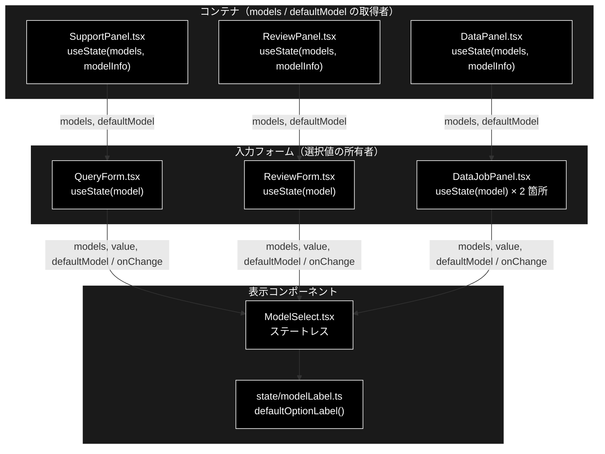
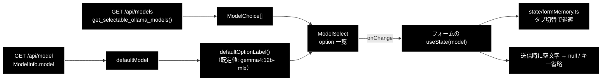
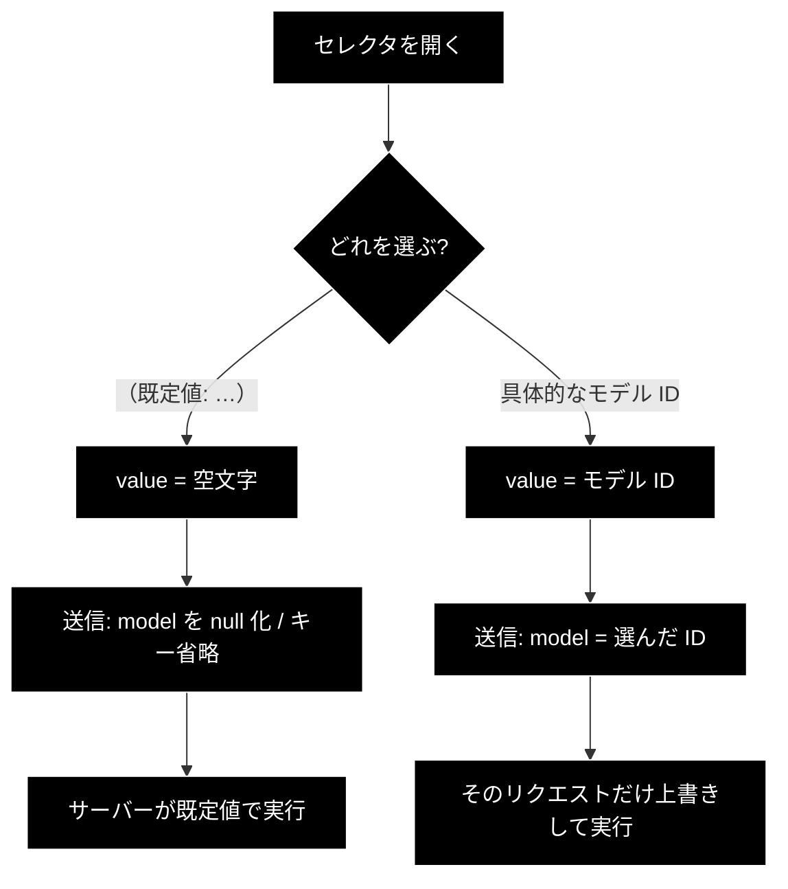

# ModelSelect.tsx - LLM モデルセレクタ ドキュメント

**Version 1.1** | 最終更新: 2026-09-21

---

## 目次

- [概要](#概要)
- [1. コンポーネントツリー図](#1-コンポーネントツリー図)
- [2. Props インターフェース](#2-props-インターフェース)
- [3. 状態管理](#3-状態管理)
- [4. データフロー・副作用](#4-データフロー副作用)
- [5. API 通信](#5-api-通信)
- [6. ユーザー操作フロー](#6-ユーザー操作フロー)
- [7. 型定義とバックエンド対応](#7-型定義とバックエンド対応)
- [8. スタイル・アクセシビリティ](#8-スタイルアクセシビリティ)
- [9. テスト](#9-テスト)
- [10. 変更履歴](#10-変更履歴)

---

## 概要

| 項目 | 内容 |
|---|---|
| ファイル | `frontend/src/components/ModelSelect.tsx`（47 行） |
| 種別 | 表示コンポーネント（ステートレス） |
| 親 | `QueryForm.tsx`（基本版 / GRACE-Support）・`ReviewForm.tsx`（GRACE-Review）・`DataJobPanel.tsx`（チャンキング / Q&A 作成の 2 箇所） |
| 子 | なし |
| 主な依存 | `../state/modelLabel`（`defaultOptionLabel`）・`../types`（`ModelChoice`） |
| 対応バックエンド | `GET /api/models`（`backend/app/api/meta.py::list_models`）／ `GET /api/model`（既定値） |

### 主な責務

- **3 タブ共通**の LLM モデルセレクタを 1 箇所にまとめる（重複実装の防止）。
- 選択肢を `GET /api/models` の結果だけに絞る。
- 未選択（空文字）＝「サーバーの既定値を使う」を表し、**その既定モデル名を画面に出す**。

> ⚠️ **`defaultModel` を渡さないと「（既定値）」としか出ない。**
> 画面がどのモデルで走るかを一切示さない状態になる。実際、ヘッダーが
> `gemma4:12b-mlx` を出している裏でチャンク化だけ別モデル（未 pull）で走り、
> **404 が数千回出るまで誰も気づけなかった**（`state/modelLabel.ts` のコメント）。

> 📌 **姉妹リポジトリ grace_v2 にも同名のファイルがあるが中身は別物。**
> あちらは Anthropic のモデル一覧で単価つきラベルを出す。こちらは Ollama の一覧で、
> `supports_tool_calls` / `notes`（tool calling 対応可否）を持つ。
> **コピーで持ち込まないこと**（CLAUDE.md §5）。

### 主要機能一覧

| 機能 | 実装 | 説明 |
|---|---|---|
| 選択肢の描画 | `models.map(...)` | `ModelChoice.id` をそのまま `value` と表示に使う |
| 未選択の既定ラベル | `defaultOptionLabel(defaultModel ?? '')` | 「（既定値: gemma4:12b-mlx）」／未取得なら「（既定値）」 |
| 実行中の無効化 | `disabled={disabled}` | 親が `running` を渡す |

---

## 1. コンポーネントツリー図



---

## 2. Props インターフェース

```typescript
interface Props {
  models: ModelChoice[];
  value: string;
  onChange: (value: string) => void;
  disabled?: boolean;
  /**
   * サーバーが既定として使うモデル名（`GET /api/model` の `model`）。
   * 渡すと未選択の項目が「（既定値: <名前>）」になり、**何で走るかが見える**。
   * 未取得なら空文字（従来どおり「（既定値）」と出る）。
   */
  defaultModel?: string;
}
```

| Prop | 型 | 必須 | 既定値 | 説明 |
|---|---|:---:|---|---|
| `models` | `ModelChoice[]` | ✅ | — | `GET /api/models` の取得結果。選択肢の実体 |
| `value` | `string` | ✅ | — | 選択中のモデル ID。**空文字は「サーバーの既定値」** |
| `onChange` | `(value: string) => void` | ✅ | — | 選択変更時に親へ ID を返す |
| `disabled` | `boolean` | | `undefined` | `<select>` の `disabled`。親は実行中に `running` を渡す |
| `defaultModel` | `string` | | `''`（`?? ''` で補う） | 既定モデル名。未選択項目のラベルに埋め込む |

### コールバックの契約

| コールバック | 呼ばれる条件 | 親側の責務 |
|---|---|---|
| `onChange` | `<select>` の `change` | ローカル state を更新し、送信時に **空文字なら `null` 化またはキーごと省略**する |

> ⚠️ **空文字の扱いは親（送信側）の責務。** `buildQueryParams` /
> `buildChunkingParams` / `buildQaParams` / `ReviewForm` の `submit` が
> それぞれ `model: model || null` などで処理する。
> ここを忘れると空文字がそのまま API へ飛び、モデル名として解決できない。

---

## 3. 状態管理

### 3.1 ローカル state（`useState`）

**なし。** 選択値は親（各フォーム）が持つ制御コンポーネントである。

### 3.2 reducer state（`useReducer`）

**なし。**

### 3.3 親から渡る状態（props 由来）

| 値 | 供給元 | 本コンポーネントでの扱い |
|---|---|---|
| `models` | パネルの `useState` ＋ `fetchModels()` | 読み取りのみ |
| `value` | フォームの `useState<string>`（初期値は `formMemory` から復元） | 読み取りのみ。変更は `onChange` で依頼 |
| `defaultModel` | パネルの `useState<ModelInfo \| null>` ＋ `fetchModelInfo()` | 読み取りのみ |

---

## 4. データフロー・副作用

### 4.1 副作用一覧（`useEffect`）

**なし。** 取得は親（各パネル）の `useEffect` が行う。

### 4.2 データフロー図



---

## 5. API 通信

本コンポーネント自身は `fetch` を呼ばない。選択肢と既定値は親が取得する。

| 関数 | メソッド | パス | 用途 | 呼び出し元 |
|---|---|---|---|---|
| `fetchModels` | GET | `/api/models` | 選択肢一覧（`ModelChoice[]`） | `SupportPanel` / `ReviewPanel` / `DataPanel` |
| `fetchModelInfo` | GET | `/api/model` | 既定モデル名（`ModelInfo`） | 同上 |

> 📌 **選択肢は `config.py::get_selectable_ollama_models()` で絞り込み済み。**
> Anthropic 系・tool calling 非対応モデル（`phi3` / `gemma2`）は含まれない。
> フロント側でのフィルタリングは行わない。

---

## 6. ユーザー操作フロー

### 6.1 イベントハンドラ一覧

| 要素 | イベント | ハンドラ | 効果 | 無効化条件 |
|---|---|---|---|---|
| モデルセレクタ | `change` | `(e) => onChange(e.target.value)` | 親のローカル state を更新 | `disabled`（親が実行中に `true`） |

### 6.2 操作フロー図



---

## 7. 型定義とバックエンド対応

| TS 型（`src/types.ts`） | 対応する Python | 定義元 |
|---|---|---|
| `ModelChoice`（`id` / `supports_tool_calls` / `notes`） | `ModelChoice` | `backend/app/schemas.py`・`backend/app/api/meta.py::list_models` |
| `ModelInfo`（`provider` / `model` / `light_model` / `heavy_model`） | `ModelInfo` | `backend/app/api/meta.py::model_info` |

> 📌 **`supports_tool_calls` / `notes` は選択肢のラベルへ畳み込んでいる**（2026-09-21）。
> 組み立ては `state/modelLabel.ts::modelOptionLabel`。tool calling 非対応のモデルは
> ReAct 経路で使えないため、**選ぶ前に分かる**必要がある
> （grace_v2 が単価を出しているのと対になる、こちら固有の情報）。
>
> ```
> gemma4:12b-mlx — デフォルト。MLX 版 12B（7.7 GB）。手元の 5 モデルで最も軽い常用機
> gemma2:latest — tool calling 非対応。ReAct には使えない
> ```
>
> `notes` が既に tool calling に触れている場合は**重ねて出さない**
> （`config.py::OllamaConfig.MODEL_CONSTRAINTS` の文言と二重になるため）。
>
> ⚠️ **既定のモデル名をフロントに書かないこと。** 値は必ず API から来る
> （`config.py::get_default_ollama_model()` の解決結果）。フロントに持つと
> 設定を変えたときに画面と実挙動がずれる（`state/modelLabel.ts` のコメント）。

---

## 8. スタイル・アクセシビリティ

| 項目 | 内容 |
|---|---|
| スタイル方式 | プレーン CSS（`src/styles.css`）。専用クラスは持たず、親の `.query-options label` / `select` の規則を継承する |
| 主要クラス | なし（`<label>` ＋ `<select>` のみ） |
| ダークモード | 未対応 |

### アクセシビリティ・チェック

| 観点 | 状態 |
|---|---|
| フォーム要素に `label` が対応しているか | ✅ `<label>` が `<select>` を**内包**している（`htmlFor` 不要） |
| キーボードのみで選択できるか | ✅ ネイティブ `<select>` |
| 既定値が何かを読み上げで伝えられるか | ✅ 未選択項目のラベルに実名が入る |
| 選択肢の制約（tool calling 非対応）が伝わるか | ✅ ラベルへ畳み込んでいる（2026-09-21・`state/modelLabel.ts::modelOptionLabel`）。読み上げでも `notes` まで読まれる |
| `disabled` の理由が伝わるか | ❌ `aria-describedby` 等は未設定（実行中であることは別途バナーが示す） |

---

## 9. テスト

| テストファイル | 対象 | 実行 |
|---|---|---|
| `src/state/modelLabel.test.ts`（**20 件**） | `defaultOptionLabel` / `formatModelLabel` / **`modelOptionLabel`** / 定数 | `npm test` |
| `src/state/queryParams.test.ts`（**27 件**） | 送信時の空文字 → `null` 化 | `npm test` |
| `src/state/dataParams.test.ts`（**38 件**） | 未選択モデルのキー省略 | `npm test` |
| `src/state/formMemory.test.ts`（**13 件**） | タブ切替時のモデル選択の退避・復元 | `npm test` |

### テスト方針

- 本コンポーネントのレンダリングテストは**無い**（`@testing-library/react` 未導入、
  vitest は `.test.tsx` を収集しない）。
- CLAUDE.md §6 のとおり、ラベル生成と送信値の判断は `state/` の純関数へ出してあり、
  そちらで検証されている。本コンポーネントに残っているのは `<select>` の描画だけで、
  `tsc --noEmit` がガードする。

---

## 10. 変更履歴

| 版 | 日付 | 変更内容 |
|---|---|---|
| 1.1 | 2026-09-21 | **`supports_tool_calls` / `notes` を選択肢のラベルへ出した**（`frontend/docs/README.md` §7 の残タスク 4）。API が返しているのに `id` しか出しておらず、tool calling 非対応かどうかを選ぶ前に判断できなかった。組み立ては `state/modelLabel.ts::modelOptionLabel`（**7 ケース**） |
| 1.0 | 2026-09-20 | 初版作成 |
