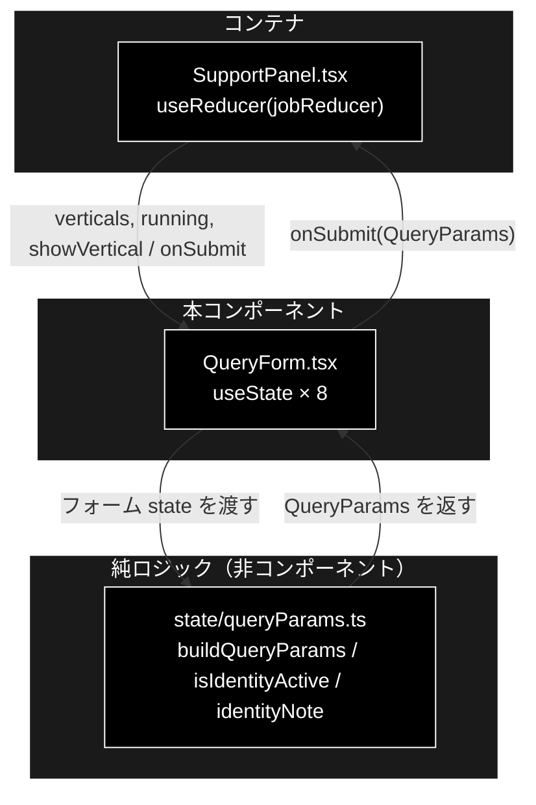
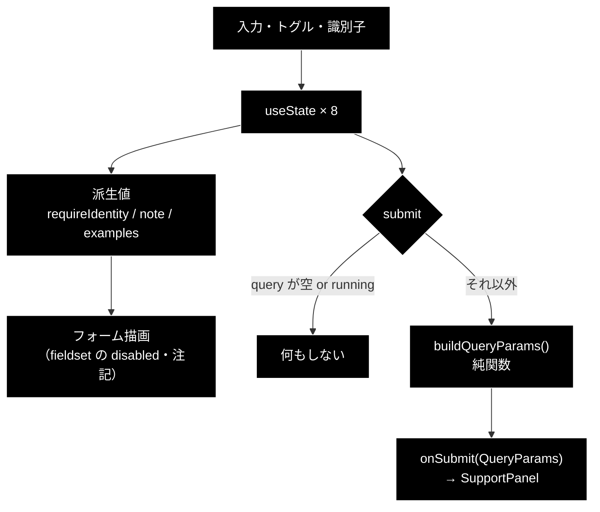
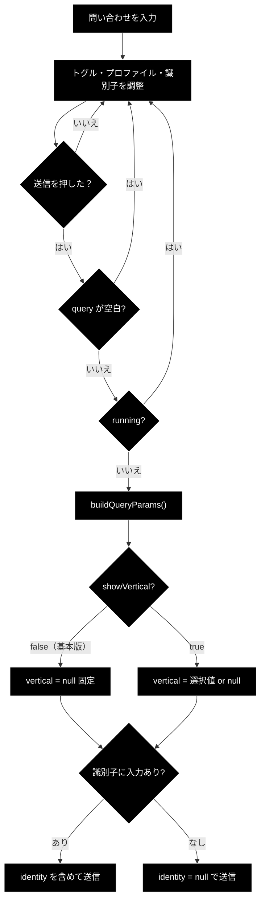

# QueryForm.tsx - 問い合わせ入力フォーム ドキュメント

**Version 1.0** | 最終更新: 2026-08-01

---

## 目次

1. [概要](#概要)
2. [コンポーネントツリー図](#1-コンポーネントツリー図)
3. [Props インターフェース](#2-props-インターフェース)
4. [状態管理](#3-状態管理)
5. [データフロー・副作用](#4-データフロー副作用)
6. [ユーザー操作フロー](#5-ユーザー操作フロー)
7. [型定義とバックエンド対応](#6-型定義とバックエンド対応)
8. [スタイル・アクセシビリティ](#7-スタイルアクセシビリティ)
9. [テスト](#8-テスト)
10. [変更履歴](#9-変更履歴)

---

## 概要

| 項目 | 内容 |
|---|---|
| ファイル | `frontend/src/components/QueryForm.tsx` |
| 種別 | **状態保持コンポーネント**（`useState` × 8。API は呼ばない） |
| 親 | `SupportPanel.tsx` |
| 子 | なし |
| 主な依存 | `../state/queryParams`（`buildQueryParams` / `isIdentityActive` / `identityNote`） |
| 対応バックエンド | `backend/app/schemas.py`（`QueryRequest`）／ `support_actions.py`（`IDENTITY_FIELDS`） |

**CLI（`agent_support_example.py`）の引数と 1:1 に対応する**入力フォーム。
CLI で指定できる項目はすべてここから操作できる。

| CLI 引数 | UI 要素 |
|---|---|
| `query` | 問い合わせ入力 |
| `--vertical` | 業界プロファイル セレクタ（**基本版タブでは出さない**） |
| `--no-web` | Web フォールバック トグル |
| `--no-action` | アクション実行 トグル |
| `--dry-run` / `--no-dry-run` | dry-run トグル |
| `-v` / `--verbose` | 詳細ログ トグル |
| `--identity KEY=VALUE` | 本人確認の識別子（`order_id` / `email`） |

> ⚠️ **判断の要るロジックは本ファイルに置かない。** 基本版での `vertical` 固定・
> 識別子を送るかどうか・状態メッセージは `state/queryParams.ts` の純関数へ出してある
> （vitest 19 件でテスト済み）。ここへ戻すと**テストできなくなる**。

### 主な責務

- 入力値をローカル state に保持し、送信時に `QueryParams` を組み立てて親へ渡す
- `showVertical` に応じて業界プロファイル セレクタと例文チップを出し分ける
- 本人確認の識別子欄を**常時表示**しつつ、**効かない設定では無効化して理由を出す**
- 実行中（`running`）はすべての入力を `disabled` にして二重送信を防ぐ

### 主要機能一覧

| 機能 | 実装 | 説明 |
|---|---|---|
| ペイロード組み立て | `buildQueryParams(state)` | 純関数へ委譲（trim・`vertical` 固定・識別子の有無） |
| 本人確認の有効判定 | `isIdentityActive(showVertical, require_identity)` | 純関数へ委譲 |
| 状態メッセージ | `identityNote(active, dryRun)` | 純関数へ委譲 |
| 例文チップ | `BASIC_EXAMPLES` / `VERTICAL_EXAMPLES` | タブで内容を切り替え |
| 二重送信の防止 | `disabled={running \|\| !query.trim()}` | 送信ボタンの無効化 |

---

## 1. コンポーネントツリー図



---

## 2. Props インターフェース

```typescript
interface Props {
  verticals: VerticalInfo[];
  running: boolean;
  onSubmit: (params: QueryParams) => void;
  /** 業界プロファイル セレクタを出すか。基本版タブでは false（vertical は常に null）。 */
  showVertical?: boolean;
}
```

| Prop | 型 | 必須 | 既定値 | 説明 |
|---|---|:---:|---|---|
| `verticals` | `VerticalInfo[]` | ✅ | — | `/api/verticals` の取得結果。セレクタの選択肢。**基本版では空配列が渡る** |
| `running` | `boolean` | ✅ | — | 実行中フラグ。`true` の間は全入力を `disabled` |
| `onSubmit` | `(params: QueryParams) => void` | ✅ | — | 送信時に親へ `QueryParams` を返す |
| `showVertical` | `boolean` | | `true` | セレクタを出すか。`false` で基本版（`vertical` は常に `null`） |

### コールバックの契約

| コールバック | 呼ばれる条件 | 親側の責務 |
|---|---|---|
| `onSubmit` | フォーム submit **かつ** `query.trim()` が非空 **かつ** `running === false` | 前回購読の解除 → ジョブ起動 → SSE 購読開始 |

---

## 3. 状態管理

### 3.1 ローカル state（`useState`）

| 変数 | 型 | 初期値 | 更新契機 | 説明 |
|---|---|---|---|---|
| `query` | `string` | `''` | `input` の `onChange` | 問い合わせ内容 |
| `vertical` | `string` | `''` | セレクタ変更・例文チップ | 空文字は「プロファイルなし」 |
| `dryRun` | `boolean` | **`true`** | チェックボックス | 既定 ON（副作用のあるアクションを実行しない） |
| `verbose` | `boolean` | `false` | チェックボックス | 詳細ログ |
| `useWeb` | `boolean` | **`true`** | チェックボックス | Web フォールバック |
| `doAction` | `boolean` | **`true`** | チェックボックス | アクション実行 |
| `orderId` | `string` | `''` | 識別子欄 | 本人確認の `order_id` |
| `email` | `string` | `''` | 識別子欄 | 本人確認の `email` |

> 📝 **`dryRun` / `useWeb` / `doAction` の既定 `true` は CLI と一致**させている
> （CLI も `--no-web` / `--no-action` / `--no-dry-run` で**打ち消す**形）。

### 3.2 reducer state（`useReducer`）

**なし。** ジョブ状態は親（`SupportPanel`）が `jobReducer` で持つ。

### 3.3 親から渡る状態（props 由来）

| 値 | 供給元 | 本コンポーネントでの扱い |
|---|---|---|
| `verticals` | `SupportPanel` の `useState` + `fetchVerticals()` | 読み取りのみ。選択中プロファイルの検索に使う |
| `running` | `SupportPanel` の `state.phase === 'running'` | 読み取りのみ。全入力の `disabled` に使う |
| `showVertical` | `SupportPanel` の `variant === 'vertical'` | 読み取りのみ。表示分岐と `buildQueryParams` へ渡す |

> **不変条件**: 本コンポーネントは props を変更しない。親への通知は `onSubmit` のみ。

### 3.4 派生値

| 値 | 導出 | 用途 |
|---|---|---|
| `selected` | `showVertical ? verticals.find((v) => v.id === vertical) : undefined` | 選択中プロファイル |
| `requireIdentity` | `isIdentityActive(showVertical, selected?.require_identity)` | 識別子欄の有効/無効 |
| `note` | `identityNote(requireIdentity, dryRun)` | 識別子欄の下に出す状態メッセージ |
| `examples` | `showVertical ? VERTICAL_EXAMPLES : BASIC_EXAMPLES` | 例文チップの内容 |

---

## 4. データフロー・副作用

### 4.1 副作用一覧（`useEffect`）

**なし。** 本コンポーネントは `useEffect` を持たない。API 取得は親の責務であり、
ここは入力の保持と組み立てだけを行う。

### 4.2 送信ペイロードの組み立て

```tsx
const submit = (e: FormEvent) => {
  e.preventDefault();
  if (!query.trim() || running) return;
  onSubmit(buildQueryParams({
    query, vertical, useWeb, doAction, dryRun, verbose,
    orderId, email, showVertical,
  }));
};
```

`buildQueryParams()`（純関数）が行う判断は 3 つ。

| 判断 | 規則 |
|---|---|
| `query` | `trim()` する |
| `vertical` | **`showVertical=false` なら常に `null`**。true なら空文字を `null` に変換 |
| `identity` | `order_id` / `email` の**どちらかに入力があれば送る**。両方空（`trim` 後）なら `null` |

> ⚠️ **`vertical` の固定が基本版タブの定義そのもの。** ここが壊れると基本版が
> Support と同じ挙動になる。`queryParams.test.ts` の
> 「基本版タブでは vertical を選んでいても常に null にする」がこれを固定している。

### 4.3 本人確認の識別子が「効く条件」

識別子欄は**常時表示**するが、実際に照合される経路は狭い。誤解を防ぐため
`fieldset` の `disabled` と `p.identity-note` で状態を必ず出す。

| 状態 | 欄 | メッセージ |
|---|:--:|---|
| 基本版タブ / `gov` / `saas`（`require_identity=false`） | **disabled** | 現在の設定では本人確認を行いません |
| `ec` ＋ dry-run **ON** | 有効 | dry-run 中はデモ照合のため、入力値は照合に使われません |
| `ec` ＋ dry-run **OFF** | 有効 | `SUPPORT_IDENTITY_FILE` の顧客台帳と照合します（未設定の場合は常に未確認） |

**根拠となるバックエンド実装**:

```python
# core/support_agent.py — require_identity でなければ検証器を作らない
require_identity = bool(profile and profile.require_identity)
identity_verifier = create_identity_verifier(dry_run=dry_run) if require_identity else None
```

```python
# support_actions.py — dry_run=True はデモ照合（required_fields=() で入力値を見ない）
if dry_run:
    return IdentityVerifier(checker=_demo_checker, method="demo", required_fields=())
```

つまり入力値が本当に使われるのは **`ec` ＋ `dry_run=false` ＋ `SUPPORT_IDENTITY_FILE` 設定**
の 1 経路だけ。**照合フィールドは `support_actions.IDENTITY_FIELDS`（`order_id` / `email`）
と一致させること。**

### 4.4 データフロー図



---

## 5. ユーザー操作フロー

### 5.1 イベントハンドラ一覧

| 要素 | イベント | ハンドラ | 効果 | 無効化条件 |
|---|---|---|---|---|
| 問い合わせ入力 | `change` | `setQuery` | ローカル state 更新 | `running` |
| 送信ボタン | `submit` | `submit(e)` | `onSubmit(buildQueryParams(...))` | `running` **または** `query` が空白のみ |
| 業界プロファイル | `change` | `setVertical` | ローカル state 更新 | `running`（**基本版では非表示**） |
| Web フォールバック | `change` | `setUseWeb` | ローカル state 更新 | `running` |
| アクション実行 | `change` | `setDoAction` | ローカル state 更新 | `running` |
| dry-run | `change` | `setDryRun` | ローカル state 更新 | `running` |
| 詳細ログ | `change` | `setVerbose` | ローカル state 更新 | `running` |
| `order_id` / `email` | `change` | `setOrderId` / `setEmail` | ローカル state 更新 | `running` **または** `!requireIdentity`（`fieldset` の `disabled`） |
| 例文チップ | `click` | インライン | `setQuery`（＋ `showVertical` なら `setVertical`） | `running` |

> 📝 **例文チップは基本版では `vertical` を触らない。** `if (showVertical) setVertical(...)`
> としているため、基本版で押しても `vertical` state は `''` のまま。

### 5.2 例文チップの内容

| タブ | 定数 | 中身 |
|---|---|---|
| 基本版 | `BASIC_EXAMPLES`（2 件） | 「パスワードを忘れました」「領収書は発行できますか？」（いずれも `vertical: null`） |
| Support | `VERTICAL_EXAMPLES`（4 件） | 上記 1 件目＋`gov:` 住民票 / `ec:` 返品 / `saas:` 障害 |

### 5.3 操作フロー図



---

## 6. 型定義とバックエンド対応

| TS 型 | 対応する Python | 定義元 |
|---|---|---|
| `QueryParams` | `QueryRequest` | `backend/app/schemas.py` |
| `VerticalInfo` | `VerticalInfo` | `backend/app/schemas.py` |
| `QueryFormState` | — | `frontend/src/state/queryParams.ts`（UI 内部のみ） |
| `IDENTITY_FIELDS`（`queryParams.ts`） | `IDENTITY_FIELDS` | `support_actions.py` |

### 手動同期が必要な定数

| フロント | バックエンド | ズレたときの症状 |
|---|---|---|
| `IDENTITY_FIELDS = ['order_id', 'email']` | `support_actions.IDENTITY_FIELDS` | 送ったキーが照合対象と食い違い、**常に「識別子が不足しています」**になる |

> ⚠️ **バックエンドのスキーマを変えたら `src/types.ts` も必ず追随させる。**
> `frontend` は blocking な CI ゲート（`tsc --noEmit`）なので、型がズレると
> **PR がマージできなくなる**。

---

## 7. スタイル・アクセシビリティ

| 項目 | 内容 |
|---|---|
| スタイル方式 | プレーン CSS（`src/styles.css`） |
| 主要クラス | `.query-form`, `.query-row`, `.query-options`, `.identity-fields`, `.identity-note`, `.query-examples`, `.example-chip` |
| 無効時の見た目 | `.identity-fields:disabled { opacity: 0.55 }` |
| 注記の色 | `.identity-note`（強調）/ `.identity-note.muted`（無効時） |
| ダークモード | 未対応 |

### アクセシビリティ・チェック

| 観点 | 状態 | 補足 |
|---|:--:|---|
| フォーム要素に `label` が対応しているか | ✅ | チェックボックス・セレクタ・識別子欄はすべて `<label>` で囲んでいる |
| 問い合わせ入力に `label` があるか | ❌ | `placeholder` のみ。`<label>` も `aria-label` も無い |
| 識別子欄がグループとして分かるか | ✅ | `<fieldset>` ＋ `<legend>` |
| 無効化の理由が伝わるか | ✅ | `fieldset` の `disabled` と直下の `p.identity-note` に理由を明記 |
| 状態表示が色のみに依存していないか | ✅ | 注記は文言で説明（色は補助） |
| キーボードのみで送信できるか | ✅ | すべて標準フォーム要素 |
| 送信不可の理由が伝わるか | ❌ | 空入力時にボタンが `disabled` になるだけで、理由の提示は無い |

---

## 8. テスト

| テストファイル | 対象 | 件数 | 実行 |
|---|---|---:|---|
| `src/state/queryParams.test.ts` | `buildQueryParams` / `isIdentityActive` / `identityNote` | 19 | `npm test` |

### テスト方針

- **判断を含むロジックは純関数へ出し、それだけをテストする。**
  `@testing-library/react` は未導入のため、`QueryForm` 自体のレンダリングテストは持たない。
- コンポーネント側に残るのは**入力の保持と描画だけ**にして、壊れると困る分岐
  （基本版の `vertical` 固定・識別子の有無・`trim`）を関数側で押さえている。

### 何がテストで守られているか

| 守られている | 守られていない |
|---|---|
| `vertical` の基本版固定 | `fieldset` の `disabled` 条件（描画） |
| 識別子の有無・`trim` | 例文チップのクリック挙動 |
| トグル値の受け渡し | `running` による入力無効化 |
| 状態メッセージの文言 | ラベルと入力の対応（a11y） |

> ⚠️ **描画側の分岐は型検査でも vitest でも捕まらない。** `showVertical &&` の条件や
> `disabled={running || !requireIdentity}` を消しても CI は通る。変更時は
> `ec` を選んで識別子欄が有効化されること、基本版でセレクタが出ないことを
> 実際に画面で確認すること。

---

## 9. 変更履歴

| 版 | 日付 | 変更内容 |
|---|---|---|
| 1.0 | 2026-08-01 | 初版作成。CLI 引数との 1:1 対応、`showVertical` による基本版 / Support の出し分け、識別子欄が「効く条件」（`ec` ＋ dry-run OFF ＋ `SUPPORT_IDENTITY_FILE` の 1 経路のみ）、判断ロジックを `state/queryParams.ts` へ出してテストしている構成を記載 |
