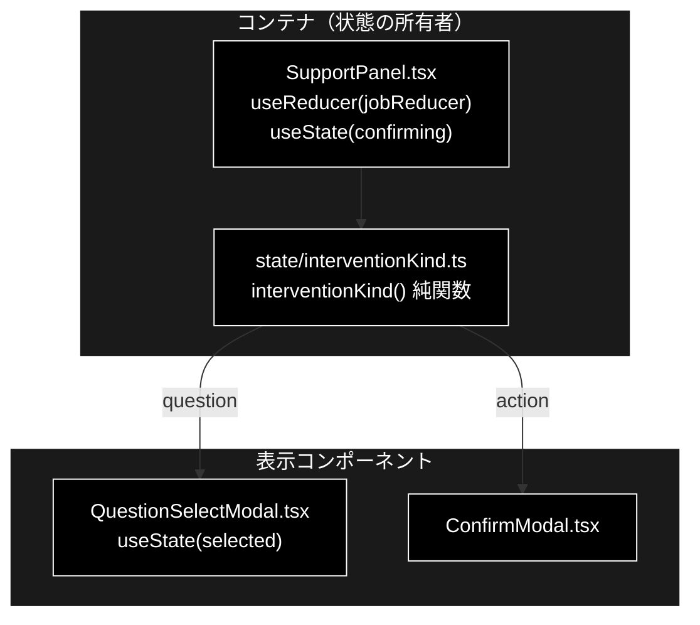

# QuestionSelectModal.tsx - 主質問の選択モーダル ドキュメント

**Version 1.0** | 最終更新: 2026-08-29

---

## 目次

- [概要](#概要)
- [1. コンポーネントツリー図](#1-コンポーネントツリー図)
- [2. Props インターフェース](#2-props-インターフェース)
- [3. 状態管理](#3-状態管理)
- [4. データフロー・副作用](#4-データフロー副作用)
- [5. API 通信・SSE イベント](#5-api-通信sse-イベント)
- [6. ユーザー操作フロー](#6-ユーザー操作フロー)
- [7. 型定義とバックエンド対応](#7-型定義とバックエンド対応)
- [8. スタイル・アクセシビリティ](#8-スタイルアクセシビリティ)
- [9. テスト](#9-テスト)
- [10. 変更履歴](#10-変更履歴)

---

## 概要

| 項目 | 内容 |
|---|---|
| ファイル | `frontend/src/components/QuestionSelectModal.tsx` |
| 種別 | 表示コンポーネント（選択状態のみローカルに保持） |
| 親 | `SupportPanel.tsx` |
| 子 | なし |
| 主な依存 | `../types`（`InterventionInfo`）、`react`（`useState`） |
| 対応バックエンド | `backend/app/core/support_agent.py`（0-(A) の `analyze` ステップ）、`intervention_bridge.py`（`selected_option`） |
| 設計 | `docs/multi_question_handling.md` §0 |

### 主な責務

- 1 つの入力に複数の主質問が含まれるとき、**先に回答する 1 つを利用者に選ばせる**。
- **自動では選ばない。** 勝手に選ぶと、選ばれなかった質問が黙って落ちたのか、そもそも検知されなかったのかを利用者が区別できない。
- 選ばなかった質問が「保留」として結果に出ることを事前に伝える。
- タイムアウト時の挙動（原文のまま 1 回だけ実行）を事前に明示する。
- 送信中（`submitting`）は全操作を `disabled` にして二重送信を防ぐ。

### ConfirmModal との違い

| | `ConfirmModal` | `QuestionSelectModal` |
|---|---|---|
| 目的 | ⑥ アクション実行の承認 | 0-(A) 主質問の選択 |
| 選択肢 | 承認 / 拒否の 2 択 | 主質問の N 択 ＋「選ばずに実行」 |
| 拒否したとき | アクションを実行しない | **原文のまま 1 周する**（escalate にしない） |
| タイムアウト | 実行せず有人対応へ（安全側＝止まる） | 原文のまま 1 周（安全側＝現行動作の維持） |

⚠️ **どちらも同じ `intervention` イベントで届く。** 見分けは
`state/interventionKind.ts::interventionKind()`（純関数）が行う。

---

## 1. コンポーネントツリー図



---

## 2. Props インターフェース

```typescript
interface Props {
  intervention: InterventionInfo;
  submitting: boolean;
  /** approve=true なら selectedOption を採用、false なら原文のまま実行。 */
  onRespond: (approve: boolean, selectedOption: string | null) => void;
}
```

| Prop | 型 | 必須 | 既定値 | 説明 |
|---|---|:---:|---|---|
| `intervention` | `InterventionInfo` | ✅ | — | intervention イベントの `data`。`options` に主質問の一覧が入る |
| `submitting` | `boolean` | ✅ | — | 送信中フラグ。`true` の間はラジオ・両ボタンを `disabled` |
| `onRespond` | `(approve: boolean, selectedOption: string \| null) => void` | ✅ | — | 選択（`true` ＋ 主質問）／選ばずに実行（`false` ＋ `null`）を親へ返す |

⚠️ `ConfirmModal` の `onRespond` は引数 1 つだが、親（`SupportPanel`）の `respond` は
第 2 引数を既定値 `null` にしてあるため**両方から呼べる**。

---

## 3. 状態管理

| 状態 | 型 | 初期値 | 用途 |
|---|---|---|---|
| `selected` | `string` | `options[0] ?? ''` | 選択中の主質問 |

選択中の主質問を保持するだけで、**判断は持たない**（CLAUDE.md §6）。
「どちらのモーダルを出すか」は `state/interventionKind.ts` の純関数が決める。

---

## 4. データフロー・副作用

副作用なし。`onRespond` を通じて親へ返すだけ。

```
バックエンド 0-(A) → intervention イベント（reason=multi_question_selection, options）
  → jobReducer → state.intervention
  → interventionKind() === 'question'
  → QuestionSelectModal 表示 → onRespond(true, 主質問)
  → SupportPanel.respond → POST /api/support/confirm/{job_id}
     { intervention_id, approve: true, selected_option }
  → InterventionBridge.resolve → InterventionResponse.selected_option
  → support_agent が採用クラスタを再構成してパイプライン続行
```

---

## 5. API 通信・SSE イベント

| 方向 | 内容 |
|---|---|
| 受信（SSE） | `intervention` / `status="waiting"`。`data.reason === "multi_question_selection"`、`data.options` に主質問の配列 |
| 送信（親経由） | `POST /api/support/confirm/{job_id}` に `selected_option` を含めて送る |

`selected_option` は**省略可**（既定 `null`）。アクション承認モーダルは送らない。

---

## 6. ユーザー操作フロー

| 操作 | 結果 |
|---|---|
| ラジオで主質問を選ぶ | `selected` が変わる |
| 「この質問に回答する」 | `onRespond(true, selected)` → 選んだ質問を再構成して 1 周 |
| 「選ばずに原文のまま実行」 | `onRespond(false, null)` → **原文のまま 1 周**（escalate にしない） |
| 何もしない（タイムアウト） | バックエンドが原文のまま 1 周する |

---

## 7. 型定義とバックエンド対応

| フロント | バックエンド |
|---|---|
| `InterventionInfo.options` | `InterventionRequest.options`（`support_agent.py` が主質問の一覧を詰める） |
| `InterventionInfo.reason` | `InterventionRequest.reason = "multi_question_selection"` |
| `selected_option` | `ConfirmRequest.selected_option` → `InterventionResponse.selected_option` |

⚠️ 理由の文字列は `state/interventionKind.ts::MULTI_QUESTION_REASON` と
`support_agent.py` の 2 箇所にある。**片方だけ変えるとモーダルが出なくなる。**

---

## 8. スタイル・アクセシビリティ

| 要素 | クラス / 属性 |
|---|---|
| 背景 | `.modal-backdrop`（クリックしても閉じない） |
| ダイアログ | `role="dialog" aria-modal="true" aria-label="回答する質問の選択"` |
| 選択肢 | `<fieldset className="question-options">` ＋ `<legend>`（ラジオ群に見出しを与える） |
| 各選択肢 | `.question-option`（`<label>` で包み、テキストクリックでも選べる） |
| 注記 | `.modal-note` |

---

## 9. テスト

`.test.tsx` は vitest の `include` に含まれないため、コンポーネント自体の
レンダリングテストは無い（CLAUDE.md §6）。判断は純関数側でテストする。

| ファイル | 件数 | 内容 |
|---|---:|---|
| `src/state/interventionKind.test.ts` | 4 | どちらのモーダルを出すかの判定（理由・選択肢の有無・既定はアクション） |

バックエンド側の対応テストは `backend/tests/test_multi_question_pipeline.py`。

---

## 10. 変更履歴

| バージョン | 変更内容 |
|---|---|
| 1.0 | 初版作成（0-(A) 入力・質問分析の主質問選択モーダル） |
