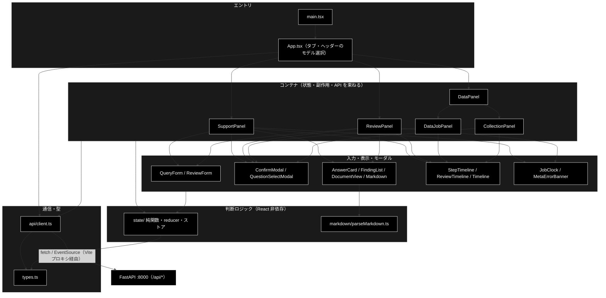
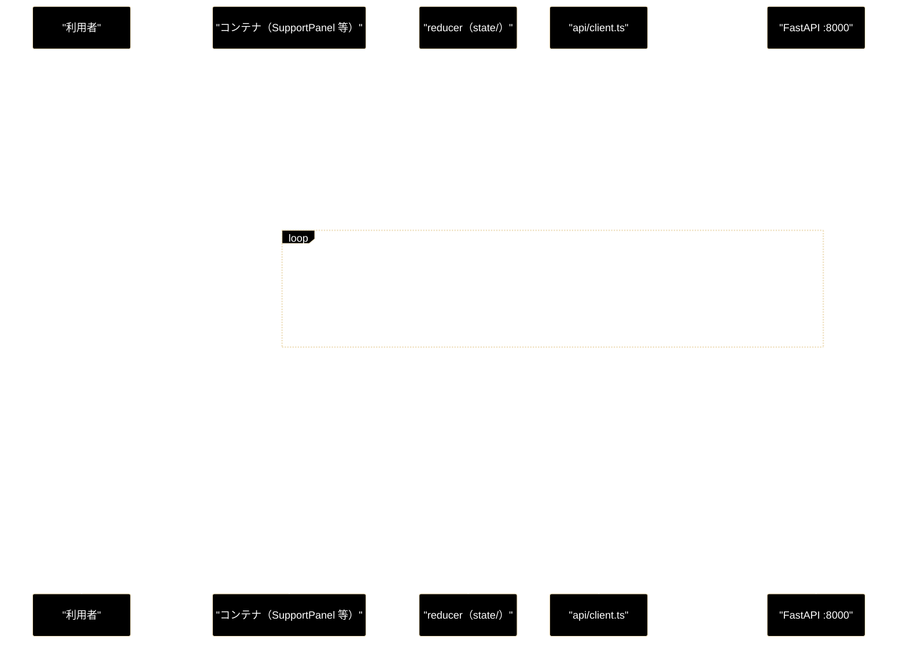

# frontend — 責務・構成・モジュール構造

**Version 2.1** | 最終更新: 2026-09-24

`frontend/`（Vite + React 18 + TypeScript）の**入口文書**である。
前半（§1〜§7）で frontend の責務・構成・モジュール構造・データの流れを説明し、
後半（§8〜§13）で文書一覧・実装カバレッジ・テスト件数などの**棚卸し**を持つ。

> **新しいコンポーネント / `state/` モジュールを足したら、同じコミットで本書の表にも行を足すこと**
> （索引が無かった頃、コンポーネント 5 件の文書欠落が検知されずに残っていた）。

> **関連**: 形式仕様は [`.claude/skills/grace-agent-docs/a_react_page_md_format.md`](../../.claude/skills/grace-agent-docs/a_react_page_md_format.md) ／
> 純関数規約は CLAUDE.md §6 ／ 姉妹リポジトリ（grace_v2）との乖離は CLAUDE.md §5 ／
> バックエンド側の API・パイプライン設計は [`backend/docs/README.md`](../../backend/docs/README.md)

---

## 目次

- [1. frontend の責務](#1-frontend-の責務)
- [2. 技術スタックとビルド構成](#2-技術スタックとビルド構成)
- [3. ディレクトリ構成](#3-ディレクトリ構成)
- [4. レイヤー構造と依存の向き](#4-レイヤー構造と依存の向き)
- [5. 画面構成（コンポーネントツリー）](#5-画面構成コンポーネントツリー)
- [6. バックエンドとの通信](#6-バックエンドとの通信)
- [7. 状態管理の設計方針](#7-状態管理の設計方針)
- [8. 文書一覧](#8-文書一覧)
- [9. 実装カバレッジ](#9-実装カバレッジ)
- [10. state/ 純関数の一覧](#10-state-純関数の一覧)
- [11. テスト件数（実測）](#11-テスト件数実測)
- [12. 検証手順](#12-検証手順)
- [13. 既知の問題・残タスク](#13-既知の問題残タスク)
- [14. 変更履歴](#14-変更履歴)

---

## 1. frontend の責務

GRACE のローカル開発用 Web UI。**唯一のエージェント実行入口**である Web API
（`backend/app/`・FastAPI :8000）を画面から操作する（CLI 入口は 2026-09-20 に削除済み。CLAUDE.md §1）。

### 1.1 やること

| 責務 | 内容 |
|---|---|
| **エージェントの実行と可視化** | 問い合わせ / 文書を送り、SSE で届くステップ進捗をタイムラインとして逐次表示し、最終結果（回答カード / 指摘一覧）を描画する |
| **HITL（Human-In-The-Loop）の窓口** | バックエンドから届く承認待ち（`intervention`）に対し、承認 / 拒否（⑥ アクション・データ削除・`recreate`）や主質問の選択（0-(A)）を利用者に求め、結果を POST で返す |
| **データ準備の操作** | チャンキング → Q/A 作成 → Qdrant 登録 → コレクション管理を、CLI と同じ関数経由で画面から実行する |
| **実行条件の選択** | モデル（ヘッダー）・業界プロファイル / ルールセット・Web フォールバック・アクション実行・dry-run・詳細ログを選ぶ |
| **アクセシビリティ** | tablist の矢印キー移動、モーダルのフォーカストラップ、`aria-live` による進捗の読み上げ、IME 変換中は送信しない等 |

### 1.2 やらないこと（バックエンドの責務）

| やらないこと | 実際の持ち主 |
|---|---|
| LLM 呼び出し・RAG 検索・根拠検証（groundedness）・ゲート判定 | `backend/app/core/support_agent.py` / `review_agent.py`、`grace/` |
| アクションの実行・安全側への倒し方（承認タイムアウト時は実行しない） | `support_actions.py`（`ActionBackend`）・`InterventionBridge` |
| 業界プロファイル / ルールセットの定義 | `backend/app/core/verticals.py` / `rulesets.py`（frontend は `GET` で取得して選ばせるだけ） |
| モデル名の正しさ・選択肢の決定 | `config.py`（`GET /api/model` / `GET /api/models` が返した値をそのまま出す。**frontend でモデル名を変換しない** — CLAUDE.md R1） |
| 永続化 | 無し。frontend はブラウザストレージも使わない（§7.4） |

> frontend は **「決める」のではなく「見せて、選ばせて、返す」** 層である。
> 判断が必要な箇所（送信ペイロードの組み立て・表示文言・キー操作）は
> すべて `state/` の純関数へ出してテスト可能にしている（§7.1）。

---

## 2. 技術スタックとビルド構成

| 項目 | 内容 |
|---|---|
| ランタイム依存 | **`react` / `react-dom` の 2 つだけ**（ルータ・状態管理ライブラリ・Markdown ライブラリ・CSS フレームワークは使わない） |
| 開発依存 | `typescript` 5.6 / `vite` 5.4 / `@vitejs/plugin-react` / `vitest` 2.1 / `@types/react*` |
| 型設定 | `tsconfig.json` — `strict` / `noUnusedLocals` / `noUnusedParameters` / `jsx: react-jsx` / `noEmit` |
| dev サーバ | `vite`（:5173）。**`/api` を `http://127.0.0.1:8000` へプロキシ**（SSE も同経路） |
| テスト | vitest。`environment: 'node'`・`include: ['src/**/*.test.ts']`（**`.test.tsx` は収集されない**・DOM なし） |
| スタイル | `src/styles.css`（1,341 行）1 枚のグローバル CSS |
| エントリ | `index.html`（`lang="ja"`）→ `src/main.tsx` → `<App />`（`React.StrictMode`） |

> ⚠️ **プロキシ先は `localhost` ではなく `127.0.0.1`。** Node 18+ は `localhost` を
> IPv6（`::1`）優先で解決し、IPv4 のみに bind する uvicorn へ繋がらず `/api/*` が全滅する
> （`vite.config.ts` のコメント参照）。

### npm scripts

| script | 実体 | 用途 |
|---|---|---|
| `dev` | `vite` | 開発サーバ（通常は `./run_dev.sh` から backend と同時起動） |
| `lint` | `tsc --noEmit` | 型検査（CI ゲート） |
| `test` | `vitest run` | 単体テスト（CI ゲート） |
| `build` | `tsc --noEmit && vite build` | 本番ビルド（CI ゲート） |
| `preview` | `vite preview` | ビルド結果の確認 |

---

## 3. ディレクトリ構成

```
frontend/
├── index.html                # <div id="root"> と main.tsx の読み込みだけ
├── package.json / tsconfig.json / vite.config.ts
├── docs/                     # 本書 + <Component>.md（§8）
└── src/
    ├── main.tsx              # ReactDOM.createRoot → <App/>（10 行）
    ├── App.tsx               # 4 タブの切替・ヘッダーのモデル選択（168 行）
    ├── types.ts              # API スキーマの型（backend/app/schemas.py と 1:1・421 行）
    ├── styles.css            # グローバル CSS（1,341 行）
    ├── api/
    │   └── client.ts         # fetch / EventSource を包む唯一の通信層（302 行）
    ├── components/           # 19 コンポーネント（.tsx）+ ReviewForm の例文テスト
    ├── state/                # 判断ロジックの純関数・reducer・ストア（21 モジュール）+ テスト
    └── markdown/
        └── parseMarkdown.ts  # 依存なしの Markdown → ブロック AST（250 行）+ テスト
```

| ディレクトリ | 置いてよいもの | 置いてはいけないもの |
|---|---|---|
| `api/` | HTTP / SSE の呼び出し、エラーの `Error` 化 | 画面の状態・判断 |
| `components/` | 入力の保持（`useState`）・副作用（`useEffect`）・描画 | **判断ロジック**（→ `state/`） |
| `state/` | 純関数・reducer・モジュールスコープのストア | JSX・React の型への直接依存（`useJobTiming.ts` のみ例外。§10） |
| `markdown/` | 回答本文の Markdown パーサ（純関数） | React 要素の生成（→ `components/Markdown.tsx`） |
| `types.ts` | バックエンドのスキーマ写し | frontend 独自の UI 状態型（→ 各 `state/*.ts`） |

---

## 4. レイヤー構造と依存の向き

依存は**上から下への一方向**である。`state/` と `markdown/` は React にも `api/` にも依存しないので、
node 環境の vitest からそのまま呼べる。



| 層 | 実体 | `api/client.ts` を呼ぶか |
|---|---|:--:|
| エントリ | `main.tsx` / `App.tsx` | ✅（`fetchModelInfo` / `fetchModels` のみ） |
| コンテナ | `SupportPanel` / `ReviewPanel` / `DataJobPanel` / `CollectionPanel`（`DataPanel` はサブタブの枠のみ） | ✅ |
| 入力・表示・モーダル | 上記以外の 14 コンポーネント | ❌（props で受け取るだけ） |
| 判断ロジック | `state/*` / `markdown/parseMarkdown.ts` | ❌ |
| 通信・型 | `api/client.ts` / `types.ts` | — |

> **API を呼ぶのはコンテナと `App` だけ**である。表示コンポーネントに `fetch` を足さないこと
> （テストできない副作用が末端に散る）。

---

## 5. 画面構成（コンポーネントツリー）

### 5.1 タブ

`App.tsx` が 4 タブを**条件レンダリング（アンマウント方式）**で切り替える。

| タブ id | ラベル | 描画するコンテナ | 通信先 |
|---|---|---|---|
| `basic` | 基本版 | `SupportPanel variant="basic"`（業界プロファイルのセレクタを出さない・`vertical` は常に null） | `/api/support/*` |
| `support` | GRACE-Support | `SupportPanel variant="vertical"`（`gov` / `saas` / `ec` を選ぶ） | `/api/support/*` |
| `review` | GRACE-Review | `ReviewPanel` | `/api/review/*` |
| `data` | データ管理 | `DataPanel`（サブタブ ①〜④） | `/api/chunking` `/api/qa` `/api/qdrant` `/api/data` `/api/files` |

`basic` と `support` は**同じ `SupportPanel`** に `variant` と `key={tab}` を渡しているだけで、
別コンポーネントではない（`key` によりタブ切替で状態が混ざらない）。

### 5.2 ヘッダーのモデル選択

モデルは**ヘッダー（タイトル横）で選ぶ**（2026-09-23 にフォーム内セレクタから移設）。
選択は `App` の state にスロットごとに持つので、タブを切り替えても残る。

| タブ | スロット | パネルへの渡し方 |
|---|---|---|
| 基本版 / GRACE-Support / GRACE-Review | `basic` / `support` / `review`（1 つずつ） | `model` prop |
| データ管理 | `chunking` / `qa`（工程ごとに 2 つ） | `chunkingModel` / `qaModel` prop |

空文字は「サーバーの既定値」を意味し、送信時に null 化される（`state/queryParams.ts` / `dataParams.ts`）。
並べ方・表示値・選択肢の組み立ては `state/headerModel.ts`、ラベルは `state/modelLabel.ts`
（Ollama の `supports_tool_calls` / `notes` を畳み込む。**grace_v2 の同名ファイルとは中身が別物**）。

### 5.3 ツリー

```
App
├── header: モデルセレクタ（スロット 1〜2 個）＋ tablist
└── tabpanel
    ├── SupportPanel（basic / vertical）
    │   ├── MetaErrorBanner        業界プロファイル取得失敗
    │   ├── QueryForm              問い合わせ・オプション
    │   ├── JobClock（開始行）
    │   ├── StepTimeline → Timeline
    │   ├── AnswerCard → Markdown, JobClock（完了行）
    │   ├── ConfirmModal           ⑥ アクションの HITL 承認
    │   └── QuestionSelectModal    0-(A) 主質問の選択
    ├── ReviewPanel
    │   ├── MetaErrorBanner        ルールセット取得失敗
    │   ├── ReviewForm             文書 textarea・ルールセット・オプション
    │   ├── JobClock
    │   ├── ReviewTimeline → Timeline
    │   ├── DocumentView ⇄ FindingList   原文ハイライトと指摘カード（左右 2 ペイン・相互ジャンプ）
    │   └── ConfirmModal           ⑦ アクションの HITL 承認
    └── DataPanel（サブタブ）
        ├── ① チャンキング   DataJobPanel variant=chunking
        ├── ② Q/A 作成      DataJobPanel variant=qa
        ├── ③ Qdrant 登録   DataJobPanel variant=register（recreate 時に ConfirmModal）
        │                     └── Timeline, JobClock, ConfirmModal
        └── ④ コレクション管理 CollectionPanel（削除は ConfirmModal を通すジョブ）
                              └── Timeline, JobClock, ConfirmModal
```

### 5.4 共用部品

| 部品 | 使う側 | 共用の理由 |
|---|---|---|
| `ConfirmModal` | Support / Review / DataJob / Collection の 4 か所 | HITL 承認の UI は 1 つに揃える（承認なしに不可逆操作をさせない） |
| `Timeline` | `StepTimeline` / `ReviewTimeline` / `DataJobPanel` / `CollectionPanel` | マークアップと `aria-live` は共通、ステップ ID 集合とバッジは呼び出し側が渡す |
| `JobClock` | 4 つのコンテナ・`AnswerCard` | 開始 / 完了時刻と所要時間を同じ書式で出す |
| `MetaErrorBanner` | Support / Review | メタ取得失敗を無言で握りつぶさない |
| `state/formMemory.ts` | `QueryForm` / `ReviewForm` | アンマウントで入力が消えないよう退避 |
| `state/submitKey.ts` | `QueryForm` / `ReviewForm` | Ctrl+Enter / ⌘+Enter 送信・IME 変換中は送らない |

---

## 6. バックエンドとの通信

### 6.1 通信方式

`api/client.ts` が**唯一の通信層**である。すべてのジョブは同じ 3 段で動く。

1. **POST でジョブ起動** → `job_id` を受け取る
2. **SSE（`EventSource`）で進捗を購読** — `subscribeStream(jobId, onEvent, onError, kind)` を 3 種（`support` / `review` / `data`）で共用
3. **承認待ちが来たら POST で応答**（`confirm*`）

SSE の 1 イベントは `types.ts::SupportEvent`（`type: 'step' | 'log' | 'intervention' | 'result' | 'error' | 'done'`）で、
**3 種のジョブで形式が同一**。`done` を受けると購読を閉じる。`done` 前の切断だけを
「バックエンドの起動を確認してください」というエラーとして通知する。
HTTP エラーは `requireOk()` が `API エラー (status): body` の `Error` に変換する。



### 6.2 エンドポイント一覧（`api/client.ts` の関数）

| 分類 | 関数 | メソッド・パス |
|---|---|---|
| Support | `startQuery` / `confirmIntervention` | `POST /api/support/query` / `POST /api/support/confirm/{job_id}` |
| Review | `startReview` / `confirmReviewIntervention` | `POST /api/review/submit` / `POST /api/review/confirm/{job_id}` |
| SSE（共用） | `subscribeStream` | `GET /api/{support\|review\|data}/stream/{job_id}` |
| メタ情報 | `fetchVerticals` / `fetchRuleSets` | `GET /api/verticals` / `GET /api/rulesets` |
| モデル | `fetchModelInfo` / `fetchModels` | `GET /api/model` / `GET /api/models` |
| Qdrant 参照 | `fetchQdrantHealth` / `fetchCollections` / `fetchCollectionDetail` / `fetchCollectionPoints` | `GET /api/qdrant/health` / `…/collections` / `…/collections/{name}` / `…/collections/{name}/points?limit=` |
| 入力ファイル | `fetchInputFiles` | `GET /api/files?dir=` |
| データ準備ジョブ | `startChunking` / `startQaGeneration` / `startRegister` / `startDelete` | `POST /api/chunking/run` / `POST /api/qa/generate` / `POST /api/qdrant/register` / `POST /api/qdrant/delete` |
| データ準備（共通） | `confirmDataIntervention` / `fetchDataJobStatus` | `POST /api/data/confirm/{job_id}` / `GET /api/data/result/{job_id}` |

> ⚠️ **バックエンドの API スキーマを変えたら `src/types.ts` も必ず追随させる。**
> Python 側が全部緑でも型エラー 1 個でマージは止まる（CLAUDE.md §4）。

### 6.3 取得失敗時の方針

| 取得対象 | 失敗時 | 理由 |
|---|---|---|
| モデル情報・選択肢（`App`） | **握りつぶす**。既定モデルだけの選択肢に縮退 | サーバーは設定どおりのモデルで走るので機能は失われない |
| 業界プロファイル / ルールセット | **`MetaErrorBanner` で理由と再読み込みボタンを出す**（`state/metaFetch.ts`） | 空のセレクタだけでは「壊れている」としか見えないため |
| ジョブの起動・SSE 切断 | パネルのエラーバナー（`role="alert"`） | 利用者が再実行を判断できるように |

---

## 7. 状態管理の設計方針

### 7.1 判断は `state/` の純関数へ（CLAUDE.md §6）

vitest は node 環境で `.test.ts` しか収集せず、`@testing-library/react` も未導入なので
**コンポーネントのレンダリングテストは書けない**。そのため:

- コンポーネントに残すのは**入力の保持と描画だけ**
- 「どう判断するか」（ペイロード組み立て・表示文言・キー判定・状態遷移）は `state/` の純関数へ出す
- React の型（`KeyboardEvent` 等）に直接依存させず、必要なフィールドだけのインターフェースを受ける

### 7.2 ジョブ状態は reducer 1 本ずつ

| reducer | 使うコンテナ | ステップ ID |
|---|---|---|
| `jobReducer.ts` | `SupportPanel` | 固定 9 個（`analyze` / `profile` / `plan` / `execute` / `confidence` / `gate` / `web` / `no_info` / `action`） |
| `reviewReducer.ts` | `ReviewPanel` | 固定（`REVIEW_STEP_IDS`・backend の `review_agent.py` と 1:1） |
| `dataReducer.ts` | `DataJobPanel` / `CollectionPanel` | **ジョブ種別で変わる**（`stepIdsFor(kind)` — chunking / qa / register / delete） |

3 つとも「SSE イベント列 → ステップ状態・承認待ち・最終結果」を畳み込む**同じ形**だが、
result の型が違うため**無理にジェネリック化しない**方針である（`reviewReducer.ts` 冒頭）。

### 7.3 タブはアンマウント方式 — 失うものと、その補い方

離れたタブの `EventSource` を `useEffect` のクリーンアップで確実に閉じるため、タブ（とデータ管理のサブタブ）は
**アンマウントで切り替える**。副作用として失われる状態は、コンポーネントより長生きする
**モジュールスコープのストア**で補っている。

| 失われるもの | 補うモジュール | 保持するもの |
|---|---|---|
| フォームの入力（`useState`） | `state/formMemory.ts` | `QueryForm` / `ReviewForm` の入力（**モデルは含まない** — ヘッダー側が持つ） |
| 実行中ジョブの `job_id` | `state/activeJobs.ts` | データ準備ジョブの `job_id`。再マウント時に SSE を購読し直し、承認待ちを見失わない |
| モデルの選択 | `App` の state（`headerModel.ts`） | スロットごとの選択。`App` はアンマウントされない |

### 7.4 ブラウザストレージは使わない

`formMemory` / `activeJobs` はどちらも**メモリ上のみ**で、`localStorage` / `sessionStorage` にはしない
（起動直後は既定値から始まるほうが分かりやすい／サーバ再起動で消えたジョブを復元しようとしない）。
ページをリロードすれば初期状態に戻る。

### 7.5 所要時間

`state/useJobTiming.ts` は**例外的なフック**（`Date.now()` の取得と決着検知のみ）で、
整形・比較・サーバ権威タイムスタンプの採否は `state/elapsed.ts` の純関数が受け持つ。
開始時刻を知らない経路（タブを離れて戻った再購読）では所要時間を**推測で出さない**。

---

## 8. 文書一覧

**版は各文書冒頭の `Version`、実装行数は `wc -l` の実測値（2026-09-24）。**

### 8.1 コンテナコンポーネント（状態・副作用・API を束ねる）

| 文書 | 対象 | 実装行数 | 版 | 重要度 |
|---|---|---:|---|:--:|
| `App.md` | `App.tsx` — タブ切替・パネルの振り分け・ヘッダーのモデル選択 | 168 | 1.1 | ★★ |
| `SupportPanel.md` | `components/SupportPanel.tsx` — 基本版 / GRACE-Support 共用 | 190 | 1.5 | ★★★ |
| `ReviewPanel.md` | `components/ReviewPanel.tsx` — GRACE-Review 本体 | 207 | 1.2 | ★★★ |
| `DataPanel.md` | `components/DataPanel.tsx` — データ管理タブの枠（サブタブ） | 107 | 1.3 | ★★ |
| `DataJobPanel.md` | `components/DataJobPanel.tsx` — チャンキング / Q/A 作成 / 登録ジョブ | 728 | 1.5 | ★★★ |
| `CollectionPanel.md` | `components/CollectionPanel.tsx` — コレクション管理 | 416 | 1.1 | ★★ |

### 8.2 入力・モーダル

| 文書 | 対象 | 実装行数 | 版 | 重要度 |
|---|---|---:|---|:--:|
| `QueryForm.md` | `components/QueryForm.tsx` | 272 | 1.6 | ★★★ |
| `ReviewForm.md` | `components/ReviewForm.tsx` | 253 | 1.5 | ★★ |
| `ConfirmModal.md` | `components/ConfirmModal.tsx` — HITL アクション承認 | 142 | 1.1 | ★★ |
| `QuestionSelectModal.md` | `components/QuestionSelectModal.tsx` — 0-(A) 主質問の選択 | 76 | 1.0 | ★★ |

### 8.3 表示コンポーネント

| 文書 | 対象 | 実装行数 | 版 | 重要度 |
|---|---|---:|---|:--:|
| `AnswerCard.md` | `components/AnswerCard.tsx` | 255 | 1.3 | ★★★ |
| `FindingList.md` | `components/FindingList.tsx` | 141 | 1.1 | ★★ |
| `Markdown.md` | `components/Markdown.tsx`（`markdown/parseMarkdown.ts`） | 114 | 1.1 | ★★ |
| `Timeline.md` | `components/Timeline.tsx` | 81 | 1.0 | ★★ |
| `StepTimeline.md` | `components/StepTimeline.tsx` | 45 | 1.0 | ★★ |
| `ReviewTimeline.md` | `components/ReviewTimeline.tsx` | 64 | 1.0 | ★ |
| `DocumentView.md` | `components/DocumentView.tsx` | 62 | 1.1 | ★ |
| `JobClock.md` | `components/JobClock.tsx` — 開始行 / 完了行 | 47 | 1.0 | ★ |
| `MetaErrorBanner.md` | `components/MetaErrorBanner.tsx` — メタ取得失敗の表示 | 24 | 1.0 | ★ |

### 8.4 横断文書

| 文書 | 内容 | 版 | 備考 |
|---|---|---|---|
| `README.md` | 本書（責務・構成・モジュール構造・棚卸し） | 2.1 | — |
| `review_ui.md` | GRACE-Review 画面全体の設計を俯瞰する**横断文書** | 1.2 | 対応する `.tsx` は無い。個別仕様は各 `<Component>.md` が正 |

---

## 9. 実装カバレッジ

`frontend/src/components/*.tsx` は **19 件**、`App.tsx` を加えて **20 件**。
対応する `<Component>.md` も **20 件**で、**欠落は無い**。

> 📌 `main.tsx`（10 行）・`types.ts`（421 行）・`api/client.ts`（302 行）・`styles.css`（1,341 行）には個別文書が無い。
> `types.ts` はバックエンドのスキーマと 1:1 で `backend/docs/` 側が正、
> `api/client.ts` は本書 §6 と各パネル文書の「API 通信」節が実質の記述である。**意図的に持たない。**

> ⚠️ コンポーネントを足した・消したら、同じコミットで `<Component>.md` と本書 §5・§8・§9 を更新すること。
> （実例: `MetaErrorBanner.tsx` は 2026-09-20 の移植時に文書が作られていなかった。
> `ModelSelect.tsx` は 2026-09-23 に文書ごと削除した。）

---

## 10. state/ 純関数の一覧

`state/` は 21 モジュール（テストを除く）。役割で分類する。

| 分類 | モジュール | 行数 | 切り出した判断 |
|---|---|---:|---|
| **reducer** | `jobReducer.ts` | 173 | Support ジョブの状態遷移 |
| | `reviewReducer.ts` | 191 | Review ジョブの状態遷移 |
| | `dataReducer.ts` | 225 | データ準備ジョブの状態遷移（ジョブ種別でステップ ID が変わる） |
| **送信ペイロード** | `queryParams.ts` | 126 | 送信ペイロードの組み立て・基本版の vertical 固定・モデル未選択の null 化 |
| | `dataParams.ts` | 202 | データ準備フォーム → API パラメータ（空欄・トリム・null 化・未選択モデルのキー省略） |
| **モデル選択** | `headerModel.ts` | 128 | ヘッダーのモデルセレクタ（タブごとのスロット・表示値・選択肢・論理層の注記） |
| | `modelLabel.ts` | 45 | 見出し文字列・**選択肢のラベル**（`supports_tool_calls` / `notes` を畳み込む） |
| **ストア** | `formMemory.ts` | 120 | タブ切替時の入力退避と復元（モデルは含まない） |
| | `activeJobs.ts` | 45 | 実行中データジョブの `job_id` 保持（再マウント時の再購読） |
| **表示用の派生値** | `citations.ts` | 105 | 出典文字列（`[社内]` / `[Web]`）の解析 |
| | `highlight.ts` | 89 | 原文を非該当テキストと指摘スパンへ分割（XSS 回避のためデータだけ作る） |
| | `elapsed.ts` | 180 | 所要時間の整形・サーバ権威タイムスタンプの採否 |
| | `documentLimit.ts` | 52 | 文字数上限の判定・表示文言・アナウンス文言 |
| | `metaFetch.ts` | 53 | メタ取得失敗 → 対処可能な文言 |
| | `timelineAnnounce.ts` | 43 | 支援技術へ読み上げる 1 行 |
| | `interventionKind.ts` | 36 | 承認待ちが action（⑥）か question（0-(A)）か |
| **キー操作・a11y** | `submitKey.ts` | 49 | 送信キー（Ctrl+Enter / ⌘+Enter・IME 変換中は送信しない） |
| | `tabKeys.ts` | 49 | タブの矢印キー移動（roving tabindex） |
| | `selectionKeys.ts` | 63 | 指摘の選択キー（Enter / Space・IME 変換中は発火しない）と選択トグル |
| | `focusTrap.ts` | 62 | モーダル内の Tab 移動先（端で巻き戻す） |
| **フック（例外）** | `useJobTiming.ts` | 56 | **判断は持たず** `elapsed.ts` に委ねる。ここに分岐を足さない |

> `markdown/parseMarkdown.ts`（250 行）も同じ方針の純関数（`Markdown.md` が担当）。
>
> 📌 `focusTrap.ts` / `selectionKeys.ts` は 2026-09-24 に **grace_v2 へも移植した**（`ReviewForm` の
> Ctrl+Enter も同時に）。これで `frontend/src/` の**ファイル集合は両リポジトリで一致**したが、
> `modelLabel.ts` / `headerModel.ts` などは**中身が別物**なので、コピーで行き来させないこと（CLAUDE.md §5）。

---

## 11. テスト件数（実測）

**2026-09-24 に `cd frontend && npx vitest run` を実行した実測値。記憶で書かないこと。**

```
Test Files  23 passed (23)
     Tests  337 passed (337)
```

| テストファイル | 件数 |
|---|---:|
| `state/dataParams.test.ts` | 38 |
| `state/dataReducer.test.ts` | 27 |
| `state/queryParams.test.ts` | 27 |
| `state/elapsed.test.ts` | 22 |
| `state/citations.test.ts` | 20 |
| `components/ReviewForm.examples.test.ts` | 17 |
| `state/serverTiming.test.ts` | 16 |
| `state/headerModel.test.ts` | 16 |
| `markdown/parseMarkdown.test.ts` | 16 |
| `state/formMemory.test.ts` | 13 |
| `state/highlight.test.ts` | 13 |
| `state/reviewReducer.test.ts` | 13 |
| `state/focusTrap.test.ts` | 12 |
| `state/tabKeys.test.ts` | 12 |
| `state/documentLimit.test.ts` | 10 |
| `state/metaFetch.test.ts` | 10 |
| `state/submitKey.test.ts` | 10 |
| `state/selectionKeys.test.ts` | 9 |
| `state/timelineAnnounce.test.ts` | 9 |
| `state/modelLabel.test.ts` | 8 |
| `state/activeJobs.test.ts` | 8 |
| `state/jobReducer.test.ts` | 7 |
| `state/interventionKind.test.ts` | 4 |

> ⚠️ `serverTiming.test.ts` が検証するのは `elapsed.ts`（`state/serverTiming.ts` は**存在しない**）。
> ファイル名から実装を推測しないこと。
>
> 📌 テストの無い `state/` モジュールは `useJobTiming.ts`（フック・判断を持たない）のみ。

---

## 12. 検証手順

```bash
cd frontend
npm run lint     # tsc --noEmit
npm test         # vitest run
npm run build    # 本番ビルド
```

3 つとも CI の blocking ゲート（`frontend (tsc + vitest + build)`）に含まれる。
画面で確認するときは、リポジトリ直下で `./run_dev.sh`（backend :8000 + frontend :5173）を起動する。
LLM は Ollama（`ollama serve`）、Embedding は Gemini（`GOOGLE_API_KEY`）、Qdrant の起動が前提（CLAUDE.md §2）。

---

## 13. 既知の問題・残タスク

| # | 内容 | 状態 |
|---|---|:--:|
| 1 | `review_ui.md` が対応する `.tsx` を持たず、命名規則（`<Component>.md`）から外れている | ⚠️ **横断文書**として意図的に置いている（§8.4） |
| 2 | `ConfirmModal` の a11y ❌ 2 件（`Escape` で閉じない・閉じたあとのフォーカス復帰） | ⚠️ **判断のうえで未対応**（`ConfirmModal.md` §8）。実装漏れではない |

**未対応の残タスクは 0 件**。新しく見つけたら、実装との突き合わせのうえでここへ足すこと。

<details>
<summary>完了済み（2026-09-20〜24）</summary>

| 内容 | 完了 |
|---|---|
| `ReviewPanel` / `ReviewForm` / `ModelSelect` / `JobClock` / `MetaErrorBanner` の文書欠落（`ModelSelect` は 2026-09-23 に削除） | 2026-09-20 |
| `frontend/docs` に索引が無く欠落を検知できなかった（本書） | 2026-09-20 |
| `ReviewPanel` / `SupportPanel` のエラーバナーに `role="alert"`、打ち切り警告に `role="status"` | 2026-09-21 |
| `ConfirmModal` のフォーカストラップ（`state/focusTrap.ts`） | 2026-09-21 |
| `DocumentView` / `FindingList` の相互ジャンプをキーボードで操作可能に（`state/selectionKeys.ts`） | 2026-09-21 |
| モデル選択肢に `supports_tool_calls` / `notes` を表示（`state/modelLabel.ts::modelOptionLabel`） | 2026-09-21 |
| `ReviewForm` に Ctrl+Enter / ⌘+Enter 送信（`submitKey.ts` を `QueryForm` と共用） | 2026-09-21 |
| `ReviewForm` のタイトル欄に `.sr-only` ラベル（grace_v2 から移植）。あわせて `review_ui.md` の古い ❌ 4 行を訂正 | 2026-09-24 |

</details>

> 📌 `.running-banner` に `role` を足さないのは**意図的**である。実行中であることは
> `Timeline` の `aria-live` が読み上げており、バナーにも付けると二重読み上げになる。

---

## 14. 変更履歴

| 版 | 日付 | 変更内容 |
|---|---|---|
| 2.1 | 2026-09-24 | **grace_v2 へ a11y 3 点（`focusTrap.ts` / `selectionKeys.ts` / `ReviewForm` の Ctrl+Enter）を移植したのに追随**し、§10 の「grace_v2 に無い」注記を訂正。その突き合わせで見つけた逆方向の差分（`ReviewForm` のタイトル欄の `.sr-only` ラベル）も**同日に移植**し（`ReviewForm.md` 1.5）、`review_ui.md` 1.2 で古い ❌ 4 行を訂正。§8 の版・行数を更新し、§13 の残タスクは 0 件に戻った |
| 2.0 | 2026-09-24 | **棚卸し索引から frontend の入口文書へ再構成**。§1 責務（やること / やらないこと）・§2 技術スタックとビルド構成・§3 ディレクトリ構成・§4 レイヤー構造と依存の向き（Mermaid）・§5 画面構成（タブ・ヘッダーのモデル選択・コンポーネントツリー・共用部品）・§6 バックエンドとの通信（SSE シーケンス図・エンドポイント一覧・取得失敗時の方針）・§7 状態管理の設計方針を新設。§8 の版・行数を実測で更新（`AnswerCard` 1.3/255・`DataJobPanel` 728・`QueryForm` 1.6・`ReviewForm` 1.4・`review_ui` 1.1）。§10 を役割別に分類し `formMemory.ts` の行数を 120 へ。§11 のテスト件数を再実測（**23 ファイル / 337 件**・変化なし）。§13 から削除済みの `ModelSelect` の記述を整理 |
| 1.3 | 2026-09-23 | **モデルの選択を全タブでヘッダーへ移した**（grace_v2 と同じ変更）。`ModelSelect.tsx` / `ModelSelect.md` を削除し、`state/headerModel.ts`（16 件）を追加。`modelLabel.ts` の未使用関数（`formatModelLabel` / `defaultOptionLabel` / `DEFAULT_OPTION_FALLBACK`）を削除。§2 の版・行数を 7 文書ぶん更新し、テスト件数を **23 ファイル / 337 件**（実測）へ更新 |
| 1.2 | 2026-09-21 | **残タスク 4・5（低優先）を完了し、§7 は 0 件になった**。`ModelSelect` が `supports_tool_calls` / `notes` を選択肢へ出すようにし（`modelOptionLabel`・7 ケース追加）、`ReviewForm` の textarea に Ctrl+Enter / ⌘+Enter を付けた（`submitKey.ts` を `QueryForm` と共用）。テストは 326 → **333 件**（実測） |
| 1.1 | 2026-09-21 | **a11y の残タスク 3 件（中優先）を完了**。`state/` 純関数に `selectionKeys.ts` / `focusTrap.ts` を追加（計 20 件）し、テストは 20 ファイル / 305 件 → **22 ファイル / 326 件**（実測）。§2 の Ver 列を 5 文書ぶん更新（`DocumentView` 1.1 / `FindingList` 1.1 / `ConfirmModal` 1.1 / `ReviewPanel` 1.1 / `SupportPanel` **1.4** — 最後の 1 件はヘッダーが 1.0 のまま変更履歴だけ 1.3 まで進んでいたので実態へ揃えた） |
| 1.0 | 2026-09-20 | 初版作成。欠落していた 5 件（`ReviewPanel` / `ReviewForm` / `ModelSelect` / `JobClock` / `MetaErrorBanner`）を新規作成して解消。文書一覧・実装カバレッジ・`state/` 純関数 18 件・テスト件数（`npm test` の実測 20 ファイル / 305 件）・残タスク 5 件を記載 |
