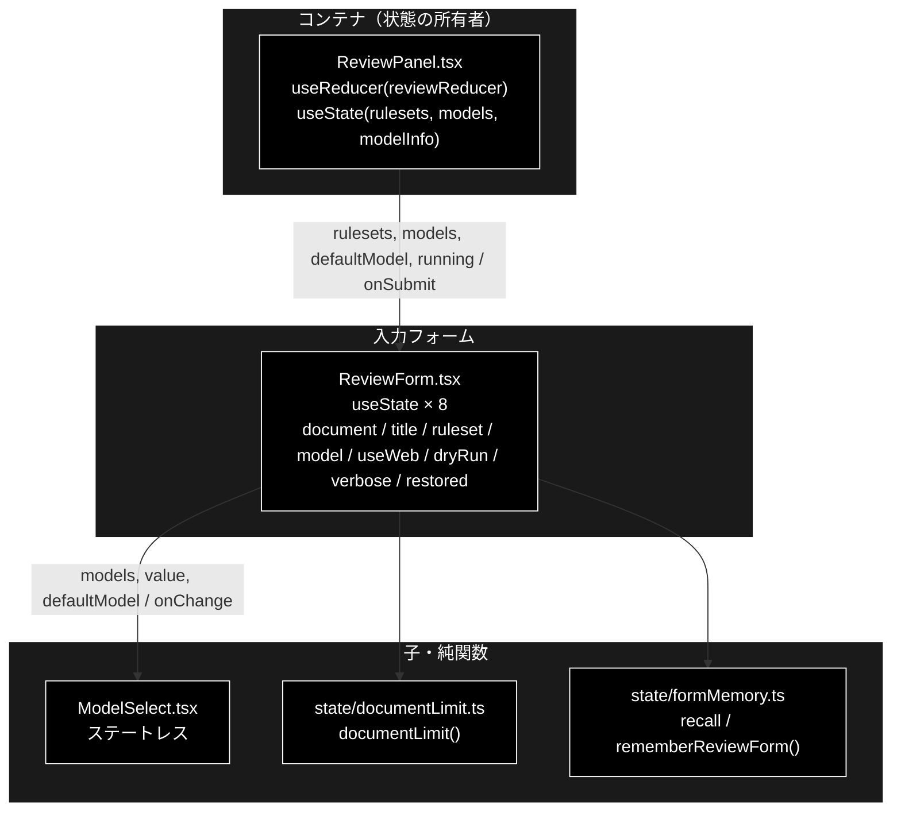
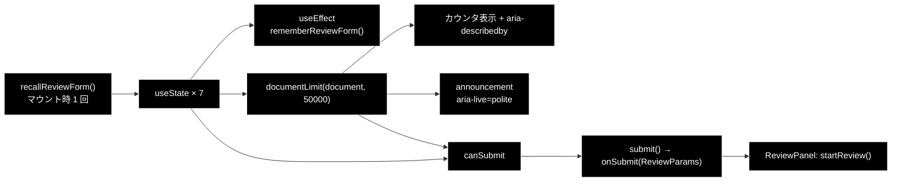
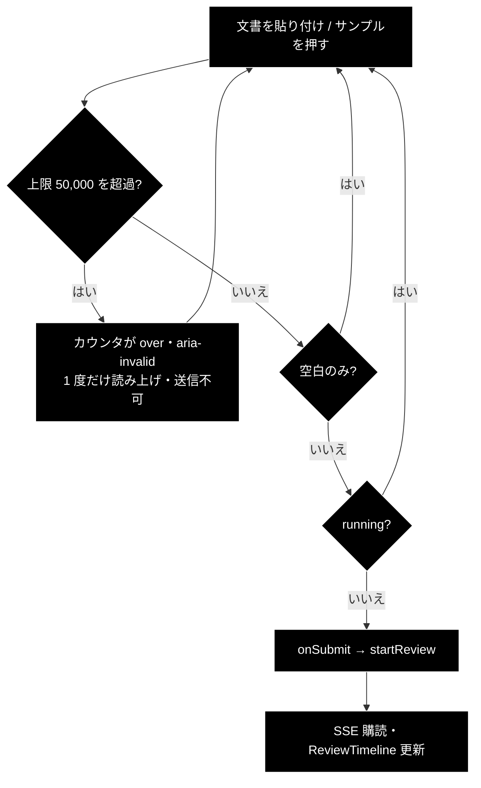

# ReviewForm.tsx - 文書レビューの入力フォーム ドキュメント

**Version 1.1** | 最終更新: 2026-09-21

---

## 目次

- [概要](#概要)
- [1. コンポーネントツリー図](#1-コンポーネントツリー図)
- [2. Props インターフェース](#2-props-インターフェース)
- [3. 状態管理](#3-状態管理)
- [4. データフロー・副作用](#4-データフロー副作用)
- [5. API 通信](#5-api-通信)
- [6. ユーザー操作フロー](#6-ユーザー操作フロー)
- [7. 型定義とバックエンド対応](#7-型定義とバックエンド対応)
- [8. スタイル・アクセシビリティ](#8-スタイルアクセシビリティ)
- [9. テスト](#9-テスト)
- [10. 変更履歴](#10-変更履歴)

---

## 概要

| 項目 | 内容 |
|---|---|
| ファイル | `frontend/src/components/ReviewForm.tsx`（239 行） |
| 種別 | 状態保持コンポーネント（`useState` × 7 ＋ 復元用 1） |
| 親 | `ReviewPanel.tsx` |
| 子 | `ModelSelect.tsx` |
| 主な依存 | `../state/documentLimit`・`../state/formMemory`・`../types` |
| 対応バックエンド | `POST /api/review/submit`（`ReviewRequest`）・`backend/app/schemas.py::MAX_DOCUMENT_CHARS` |

### 主な責務

- 点検する文書（textarea）・タイトル・ルールセット・モデル・実行オプションを受け取る。
- 文字数上限（**50,000**）を超えていないかを判定し、超過中は送信できないようにする。
- 入力内容をタブ切替で失わないよう `formMemory` へ退避する。
- 動作確認用の**入力サンプル 3 種**（`EXAMPLES`）をチップとして提供する。

> ⚠️ **判断の要るロジックはコンポーネントに残していない**（CLAUDE.md §6）。
> 文字数上限の表示文言とアナウンス文言は `state/documentLimit.ts` の純関数、
> 入力の退避・復元は `state/formMemory.ts` にある。

### 主要機能一覧

| 機能 | 実装 | 説明 |
|---|---|---|
| 文書入力 | `<textarea id="review-document" rows={12}>` | `.sr-only` ラベルを `htmlFor` で紐づけ |
| 文字数カウンタ | `documentLimit(document, MAX_DOCUMENT_CHARS)` | `aria-describedby` で textarea に紐づく |
| 上限超過の通知 | `limit.announcement` ＋ `aria-live="polite"` | **超過した瞬間だけ**読み上げる |
| ルールセット選択 | `<select>` ＋ `rulesets.map(...)` | `id（name・N ルール）`の形で表示 |
| モデル選択 | `<ModelSelect>` | 未選択＝サーバーの既定値 |
| 実行オプション | チェックボックス × 3 | Web 裏取り（既定 ON）／ dry-run（既定 OFF）／詳細ログ（既定 OFF） |
| ルールセットの注記 | `selected && <p className="review-ruleset-note">` | 対象法令・常時チェック件数・`notify_th` |
| 入力サンプル | `EXAMPLES.map(...)` チップ | 押すと `document` と `title` を差し替える |

---

## 1. コンポーネントツリー図



---

## 2. Props インターフェース

```typescript
interface Props {
  rulesets: RuleSetInfo[];
  models: ModelChoice[];
  /** サーバーの既定モデル名（`GET /api/model`）。「（既定値）」に実名を出す。 */
  defaultModel?: string;
  running: boolean;
  onSubmit: (params: ReviewParams) => void;
}
```

| Prop | 型 | 必須 | 既定値 | 説明 |
|---|---|:---:|---|---|
| `rulesets` | `RuleSetInfo[]` | ✅ | — | `GET /api/rulesets` の取得結果。セレクタの選択肢 |
| `models` | `ModelChoice[]` | ✅ | — | `GET /api/models` の取得結果。`ModelSelect` へ素通し |
| `defaultModel` | `string` | | `undefined` | 既定モデル名。`ModelSelect` へ素通し |
| `running` | `boolean` | ✅ | — | 実行中フラグ。全入力を `disabled` にし、ボタン表記を「点検中…」に変える |
| `onSubmit` | `(params: ReviewParams) => void` | ✅ | — | 送信時に親へ `ReviewParams` を返す |

### コールバックの契約

| コールバック | 呼ばれる条件 | 親側の責務 |
|---|---|---|
| `onSubmit` | form の `submit` かつ `canSubmit === true`（`document` が空白でない **かつ** 上限超過でない **かつ** `running === false`） | `startReview()` でジョブ起動 → SSE 購読開始 |

### 送信ペイロードの組み立て

```typescript
onSubmit({
  document,
  document_title: title.trim() || '無題',
  ruleset: ruleset || null,
  model: model || null,
  use_web: useWeb,
  do_action: true,
  dry_run: dryRun,
  verbose,
});
```

| フィールド | 変換 | 理由 |
|---|---|---|
| `document_title` | 空白なら `'無題'` | タイトル未入力でも結果の見出しを作れるようにする |
| `ruleset` | 空文字 → `null` | 「未指定」をサーバーの既定解決へ委ねる |
| `model` | 空文字 → `null` | 同上（`ModelSelect` の未選択） |
| `do_action` | 常に `true` | 実行するかは `dry_run` 側で制御する |

---

## 3. 状態管理

### 3.1 ローカル state（`useState`）

初期値はすべて `recallReviewForm()` の戻り値（未退避なら `DEFAULT_REVIEW_FORM`）から取る。

| 変数 | 型 | 初期値 | 更新契機 | 説明 |
|---|---|---|---|---|
| `restored` | `ReviewFormMemory` | `useState(() => recallReviewForm())` | **更新しない** | マウント時に 1 度だけ引く。毎レンダー読み直すと入力中に上書きされる |
| `document` | `string` | `restored.document`（既定 `''`） | textarea の `onChange` / サンプルチップ | 点検する文書 |
| `title` | `string` | `restored.title`（既定 `''`） | input の `onChange` / サンプルチップ | 文書タイトル |
| `ruleset` | `string` | `restored.ruleset`（既定 `'ec_ad'`） | セレクタ変更 | ルールセット ID |
| `model` | `string` | `restored.model`（既定 `''`） | `ModelSelect` の `onChange` | 空文字＝サーバーの既定値 |
| `useWeb` | `boolean` | `restored.useWeb`（既定 `true`） | チェックボックス | **既定 ON**（法改正の裏取り。信頼度を下げる方向にのみ使う） |
| `dryRun` | `boolean` | `restored.dryRun`（既定 `false`） | チェックボックス | **既定 OFF**（ON で起票せずログのみ） |
| `verbose` | `boolean` | `restored.verbose`（既定 `false`） | チェックボックス | 詳細ログ |

#### 派生値（state ではない）

| 値 | 式 | 説明 |
|---|---|---|
| `limit` | `documentLimit(document, MAX_DOCUMENT_CHARS)` | `{ over, label, announcement }` |
| `canSubmit` | `!!document.trim() && !limit.over && !running` | 送信可否 |
| `selected` | `rulesets.find((r) => r.id === ruleset)` | 注記の表示用。見つからなければ注記ごと出さない |

### 3.2 reducer state（`useReducer`）

**なし。** ジョブの状態遷移は親の `reviewReducer` が持つ。

### 3.3 親から渡る状態（props 由来）

| 値 | 供給元 | 本コンポーネントでの扱い |
|---|---|---|
| `rulesets` / `models` / `defaultModel` | `ReviewPanel` の `useState` ＋ 各 fetch | 読み取りのみ |
| `running` | `ReviewPanel` の `state.phase === 'running'` | 読み取りのみ。全入力の `disabled` に使う |

---

## 4. データフロー・副作用

### 4.1 副作用一覧（`useEffect`）

| # | 目的 | 依存配列 | クリーンアップ | 備考 |
|---|---|---|---|---|
| 1 | 入力内容を `formMemory` へ退避 | `[document, title, ruleset, model, useWeb, dryRun, verbose]` | なし | **タブ切替はアンマウント方式**なので、退避しないと入力が消える。モジュールスコープの変数へ書くだけなので解除は不要 |

### 4.2 データフロー図



### 4.3 上限文字数の同期

```typescript
// backend/app/schemas.py の MAX_DOCUMENT_CHARS と一致させる（超過は API が 422）。
const MAX_DOCUMENT_CHARS = 50000;
```

> ⚠️ **バックエンドと手動で同期している定数である。** 片側だけ変えると、
> フロントは通すのに API が 422 を返す（またはその逆）。

---

## 5. API 通信

本コンポーネント自身は `fetch` を呼ばない。`onSubmit` で親へ渡すだけである。

| 関数 | メソッド | パス | 用途 | 呼び出し元 |
|---|---|---|---|---|
| `startReview` | POST | `/api/review/submit` | ジョブ起動 | `ReviewPanel.submit()` |
| `fetchRuleSets` | GET | `/api/rulesets` | 選択肢 | `ReviewPanel.loadRulesets()` |
| `fetchModels` / `fetchModelInfo` | GET | `/api/models` / `/api/model` | モデル選択肢・既定値 | `ReviewPanel` |

---

## 6. ユーザー操作フロー

### 6.1 イベントハンドラ一覧

| 要素 | イベント | ハンドラ | 効果 | 無効化条件 |
|---|---|---|---|---|
| タイトル入力 | `change` | `setTitle` | ローカル state 更新 | `running` |
| 文書 textarea | `change` | `setDocument` | ローカル state 更新 | `running` |
| ルールセット | `change` | `setRuleset` | ローカル state 更新 | `running` |
| モデル | `change` | `setModel`（`ModelSelect` 経由） | ローカル state 更新 | `running` |
| Web 裏取り / dry-run / 詳細ログ | `change` | `setUseWeb` / `setDryRun` / `setVerbose` | ローカル state 更新 | `running` |
| 実行ボタン | `submit` | `submit(e)` | `submitIfReady()` → `onSubmit(params)` | **`!canSubmit`**（空白のみ ／ 上限超過 ／ 実行中） |
| 文書 textarea | `keydown` | `handleKeyDown` | Ctrl+Enter / ⌘+Enter で `submitIfReady()` | `running`（＋`!canSubmit` は `submitIfReady` 内で弾く） |
| サンプルチップ × 3 | `click` | `setDocument` ＋ `setTitle` | 入力を差し替える | `running` |

### 6.2 操作フロー図



### 6.3 入力サンプル（`EXAMPLES`）

**テストから参照するため `export` している**（`ReviewForm.examples.test.ts`）。
「押せば期待どおりの結果が出る」ことに意味があるので、中身を手で書き換えたときに
気付けるようにしてある。

| ラベル | 意図 | 壊してはいけない条件 |
|---|---|---|
| `NG 例（優良誤認・薬機法）` | 景表法・薬機法の指摘を出す | 「業界No.1」「シミが治る」「副作用がない」 |
| `NG 例（表記漏れ・規程不一致）` | 特商法の表記漏れ＋規程不一致を出す | 送料・支払時期方法・引渡時期が**欠けている**こと、返品が **8日**（規程 14日 より短い） |
| `OK 例（指摘 0 件を期待）` | **指摘 0 件**を期待する | 送料（tokusho-01）・お支払い方法（tokusho-02）・発送時期（tokusho-03）をすべて満たし、返品 **14日**（policy-01）。1 項目でも削ると該当ルールが発火する |

> 📌 **2 番目のラベルは以前「OK 例（特商法表記あり）」だった。** 中身は特商法 第11条 が
> 求める 3 項目を欠いており、押すと必ず 4 件の指摘が出るため、**製品の不具合と区別が
> つかない**状態になっていた。ラベルを実態に合わせてある。

---

## 7. 型定義とバックエンド対応

| TS 型（`src/types.ts`） | 対応する Python | 定義元 |
|---|---|---|
| `ReviewParams` | `ReviewRequest` | `backend/app/schemas.py` |
| `RuleSetInfo` | `RuleSetInfo` | `backend/app/schemas.py`・`backend/app/core/rulesets.py` |
| `ModelChoice` | `ModelChoice` | `backend/app/api/meta.py::list_models` |
| `MAX_DOCUMENT_CHARS`（TS の定数） | `MAX_DOCUMENT_CHARS` | `backend/app/schemas.py` |

> ⚠️ **バックエンドのスキーマを変えたら `src/types.ts` も必ず追随させる。**
> `frontend` は blocking な CI ゲート（`tsc --noEmit`）なので、型がズレると
> **PR がマージできなくなる**。

---

## 8. スタイル・アクセシビリティ

| 項目 | 内容 |
|---|---|
| スタイル方式 | プレーン CSS（`src/styles.css`） |
| 主要クラス | `.review-form`（L710）・`.review-row`・`.review-document`・`.review-counter`（L758）／`.over`（L765）・`.review-ruleset-note`・`.query-options`・`.query-examples`・`.example-chip`（L212）・`.sr-only`（L1190） |
| ダークモード | 未対応 |

### アクセシビリティ・チェック

| 観点 | 状態 |
|---|---|
| フォーム要素に `label` が対応しているか | ✅ textarea は `.sr-only` ラベル ＋ `htmlFor="review-document"`。他は `<label>` が内包 |
| 上限超過が支援技術へ伝わるか | ✅ `aria-invalid={limit.over}` ＋ `aria-describedby="review-counter"` ＋ `aria-live="polite"` のライブ領域 |
| 読み上げが繰り返されないか | ✅ **アナウンス文言に長さを含めない**ので、超過したまま入力を続けても再読み上げされない（判定は `state/documentLimit.ts`） |
| 状態表示が色のみに依存していないか | ✅ カウンタの文言に「上限を超えています。分割して実行してください」を含める |
| キーボードのみで送信できるか | ✅ ネイティブ form の `submit` |
| textarea に送信ショートカットがあるか | ✅ **Ctrl+Enter / ⌘+Enter**（2026-09-21）。判定は `QueryForm` と同じ `state/submitKey.ts::isSubmitKey` を共用。placeholder にも明記した |

---

## 9. テスト

| テストファイル | 対象 | 実行 |
|---|---|---|
| `src/components/ReviewForm.examples.test.ts`（**17 件**） | `EXAMPLES` の中身（OK/NG の別・上限内・特商法の必須項目・返品期限） | `npm test` |
| `src/state/documentLimit.test.ts`（**10 件**） | 上限判定・表示文言・アナウンス文言 | `npm test` |
| `src/state/formMemory.test.ts`（**13 件**） | 入力の退避と復元（モデル選択を含む） | `npm test` |
| `src/state/reviewReducer.test.ts`（**13 件**） | 親の状態遷移 | `npm test` |

### テスト方針

- レンダリングテストは**無い**（`@testing-library/react` 未導入、vitest は `.test.tsx` を収集しない）。
- `ReviewForm.examples.test.ts` は**例外的に `components/` に置いたテスト**だが、
  検証対象は `export const EXAMPLES` という**データ**であり JSX ではない。
  サンプルを手で書き換えたときに「OK 例なのに指摘が出る」状態へ退行しないためのガード。
- 判断ロジックは `state/documentLimit.ts` / `state/formMemory.ts` にあり、そちらで検証されている。

---

## 10. 変更履歴

| 版 | 日付 | 変更内容 |
|---|---|---|
| 1.2 | 2026-09-23 | **チェックボックスの既定を変更**: Web 裏取り OFF → ON、dry-run ON → OFF（`DEFAULT_REVIEW_FORM`）。詳細ログは従来どおり OFF。API スキーマ `ReviewRequest` の既定は API 直叩き用で据え置き（UI は常に値を明示送信する） |
| 1.1 | 2026-09-21 | **textarea に送信ショートカット（Ctrl+Enter / ⌘+Enter）を追加**（`frontend/docs/README.md` §7 の残タスク 5）。`QueryForm` と同じ `state/submitKey.ts::isSubmitKey` を共用するので、**IME 変換中は送信しない**挙動も同じ。送信本体を `submitIfReady()` へ切り出し、`submit(e)` とキー操作の両方から呼ぶ形にした（`QueryForm` と同じ構造） |
| 1.0 | 2026-09-20 | 初版作成。2026-09-20 に移植した `documentLimit`（上限超過の a11y 通知）と `formMemory`（入力退避）を反映済み |
