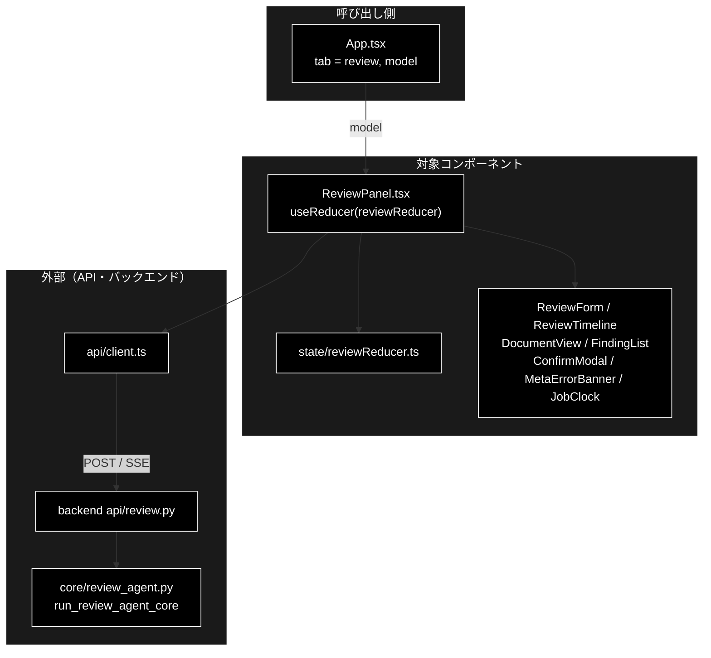
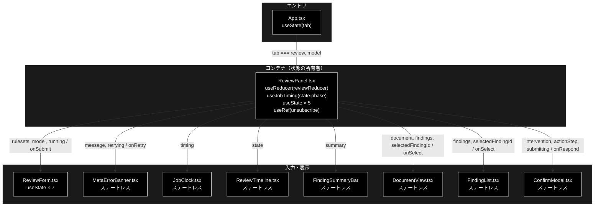
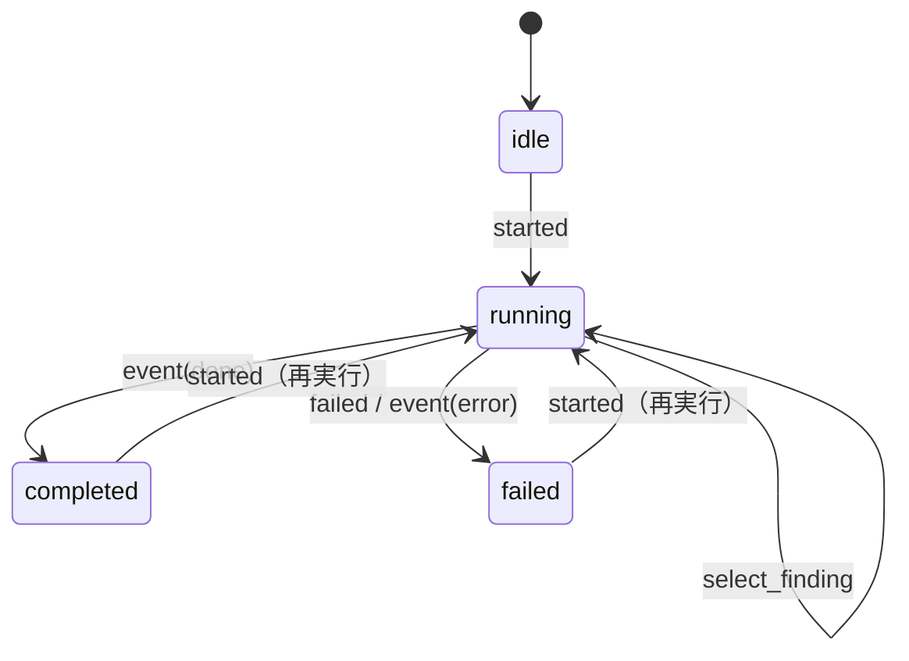
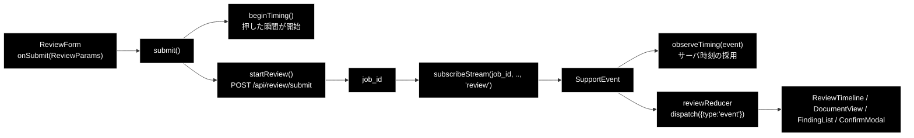
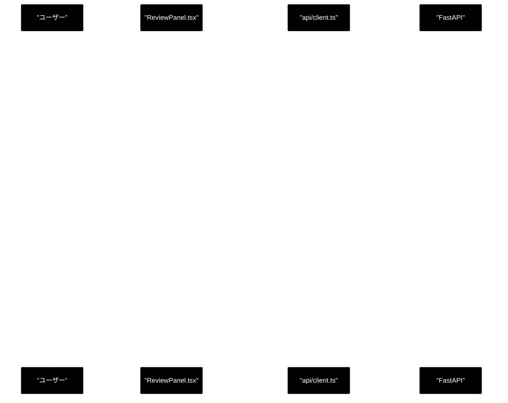
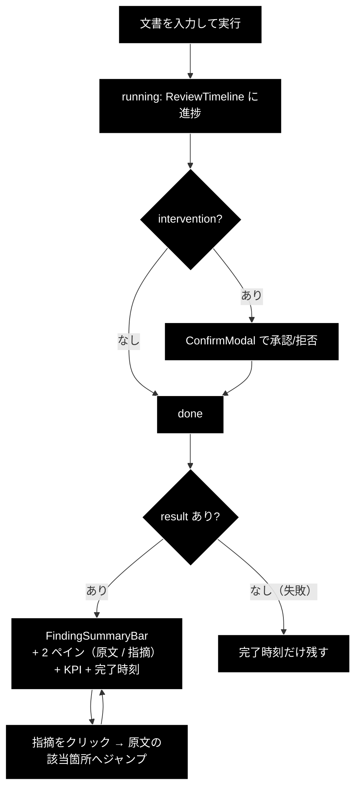

# ReviewPanel.tsx - GRACE-Review タブ本体 ドキュメント

**Version 1.3** | 最終更新: 2026-09-24

---

## 目次

- [概要](#概要)
- [1. アーキテクチャ構成図](#1-アーキテクチャ構成図)
- [2. Props インターフェース](#2-props-インターフェース)
- [3. 状態管理](#3-状態管理)
- [4. データフロー・副作用](#4-データフロー副作用)
- [5. API 通信・SSE イベント](#5-api-通信sse-イベント)
- [6. ユーザー操作フロー](#6-ユーザー操作フロー)
- [7. 型定義とバックエンド対応](#7-型定義とバックエンド対応)
- [8. スタイル・アクセシビリティ](#8-スタイルアクセシビリティ)
- [9. テスト](#9-テスト)
- [10. 変更履歴](#10-変更履歴)

---

## 概要

| 項目 | 内容 |
|---|---|
| ファイル | `frontend/src/components/ReviewPanel.tsx`（213 行） |
| 種別 | **コンテナコンポーネント**（reducer・副作用・API 呼び出しを束ねる） |
| 親 | `App.tsx`（タブ id `review`） |
| 子 | `ReviewForm` / `MetaErrorBanner` / `JobStartLine` / `JobFinishLine` / `ReviewTimeline` / `FindingSummaryBar` / `DocumentView` / `FindingList` / `ConfirmModal` |
| 主な依存 | `../state/reviewReducer`・`../state/metaFetch`・`../state/useJobTiming`・`../api/client` |
| 対応バックエンド | `backend/app/core/review_agent.py::run_review_agent_core`（`REVIEW_STEP_IDS`） |

### 主な責務

- 文書 → 指摘（GRACE-Review）の 1 周を通して駆動する: 起動 → SSE 購読 → HITL 応答 → 結果表示。
- 結果を**原文ハイライト（`DocumentView`）と指摘カード（`FindingList`）の左右 2 ペイン**で見せ、
  選択状態で相互にジャンプできるようにする。
- メタ情報（ルールセット）の取得失敗を silent failure にせず、再取得できるようにする。

> 📌 **通信の形は GRACE-Support と同じ**（POST でジョブ起動 → SSE で進捗 → HITL 応答）。
> 違うのは結果の見せ方だけである（`ReviewPanel.tsx` のコメント）。
> 中核部品（`GroundednessVerifier` / `InterventionBridge` / `ActionBackend`）も
> バックエンド側で Support と共用している。

### 各責務対応のモジュール

| # | 責務 | 対応モジュール | 説明 |
|---|---|---|---|
| 1 | 1 周の駆動 | `ReviewPanel.tsx` / `api/client.ts` / `state/reviewReducer.ts` / `ConfirmModal.tsx` | `startReview` → `subscribeStream` → `confirmReviewIntervention` |
| 2 | 2 ペインの結果表示 | `ReviewPanel.tsx` / `DocumentView.tsx` / `FindingList.tsx` | `selectedFindingId` を両ペインで共有 |
| 3 | メタ情報の取得失敗の通知 | `ReviewPanel.tsx` / `state/metaFetch.ts` / `MetaErrorBanner.tsx` | `fetchRuleSets` の失敗を `metaErrorMessage` で文言化 |

### 主要機能一覧

| 機能 | 実装 | 説明 |
|---|---|---|
| ジョブ起動 | `submit()` → `startReview(params)` | `beginTiming()` を**起動 API を待たずに**打つ |
| SSE 購読 | `subscribeStream(job_id, ..., 'review')` | 第 4 引数でストリーム種別を指定 |
| 購読解除 | `unsubscribeRef.current?.()` | 再送信時とアンマウント時の 2 箇所 |
| HITL 応答 | `respond(approve)` → `confirmReviewIntervention` | `confirming` で二重送信を防ぐ |
| 指摘の選択 | `select(findingId)` → `dispatch({type:'select_finding'})` | 2 ペイン間の相互ジャンプ |
| メタ取得失敗 | `metaErrorMessage()` ＋ `MetaErrorBanner` | 空配列に倒したうえで**理由を出す** |
| 打ち切り警告 | `result.truncated && <div className="warn-banner">` | セグメント／判定回数の上限に達した場合 |
| KPI 表示 | `result.segments_total` ほか | セグメント数・判定回数・検出→採用・抑止／救済／強制 high・使用モデル |

---

## 1. アーキテクチャ構成図

### 1.1 システム全体での位置づけ



**データフロー**:

1. フォームの送信で `startReview` を呼び、`job_id` を受け取る
2. `subscribeStream` で SSE を購読し、イベントを `reviewReducer` へ流して各子コンポーネントへ配る
3. 承認待ちは `ConfirmModal` で処理し、結果は `DocumentView` と `FindingList` の 2 ペインで表示する

### 1.2 コンポーネントツリー図



---

## 2. Props インターフェース

```typescript
export function ReviewPanel({
  model = '',
}: {
  /** ヘッダー（App）で選んだモデル。空文字 = サーバーの既定値。 */
  model?: string;
} = {})
```

| Prop | 型 | 必須 | 既定値 | 説明 |
|---|---|:---:|---|---|
| `model` | `string` | | `''` | ヘッダー（`App`）で選んだモデル。`ReviewForm` へ素通し。空文字はサーバーの既定値 |

タブ切替はアンマウント方式なので、`App.tsx` は `tab === 'review'` のときだけ描画する。

---

## 3. 状態管理

### 3.1 ローカル state（`useState` / `useRef`）

| 変数 | 型 | 初期値 | 更新契機 | 説明 |
|---|---|---|---|---|
| `rulesets` | `RuleSetInfo[]` | `[]` | `loadRulesets()` | `GET /api/rulesets` の結果。**失敗時も空配列に倒す** |
| `confirming` | `boolean` | `false` | `respond()` の前後 | HITL 応答の二重送信防止 |
| `rulesetsError` | `string \| null` | `null` | `loadRulesets()` | **`null` = 失敗していない**。silent failure を出さないため |
| `loadingRulesets` | `boolean` | `false` | `loadRulesets()` の前後 | 再取得中フラグ |
| `unsubscribeRef` | `useRef<(() => void) \| null>` | `null` | `subscribeStream` の戻り値 | 購読解除関数。**state ではない**（再レンダーを起こさない） |

#### フック由来

| 値 | 供給元 | 説明 |
|---|---|---|
| `timing`, `beginTiming`, `observeTiming` | `useJobTiming(state.phase)` | 開始・完了時刻。完了は phase の決着を見て自動で入る |

### 3.2 reducer state（`useReducer`）

`state/reviewReducer.ts`（191 行）が SSE イベント列を畳み込む。**純関数・副作用ゼロ。**

| フィールド | 型 | 初期値 | 説明 |
|---|---|---|---|
| `jobId` | `string \| null` | `null` | 起動中ジョブの ID |
| `phase` | `'idle' \| 'running' \| 'completed' \| 'failed'` | `'idle'` | ジョブ全体の進行状態 |
| `document` | `string` | `''` | 点検対象の原文（ハイライト表示に使う） |
| `documentTitle` | `string` | `''` | 文書タイトル |
| `steps` | `Record[ReviewStepId, ReviewStepState]` | 全 `pending` | **9 ステップ**の個別状態 |
| `intervention` | `InterventionInfo \| null` | `null` | HITL CONFIRM の承認待ち |
| `result` | `ReviewResult \| null` | `null` | 最終結果 |
| `error` | `string \| null` | `null` | エラー文言 |
| `logs` | `string[]` | `[]` | ステップに紐づかないログ |
| `selectedFindingId` | `string \| null` | `null` | 2 ペイン間の選択状態 |

#### ステップ一覧（`REVIEW_STEP_IDS`・9 件）

番号は Support との**対応を示す呼称**であり、実行順とは一致しない。

| id | ラベル |
|---|---|
| `ruleset` | S1 ルールセット適用 |
| `segment` | ① Segment（文書を検査単位へ分割） |
| `retrieve` | ② Retrieve（規程を RAG 検索） |
| `detect` | ③ Detect（二段判定で違反候補を検出） |
| `ground` | ④ Ground（指摘の根拠を検証） |
| `suppress` | ④' Suppress（誤検知抑止 + 救済） |
| `web` | ⑥ Web 裏取り（法改正・ガイドライン更新） |
| `severity` | ⑤ Severity（重大度の確定＋強制 high） |
| `action` | ⑦ Action（レポート → HITL CONFIRM → 実行） |

#### アクション一覧

| アクション | ペイロード | 効果 |
|---|---|---|
| `started` | `jobId`, `document`, `documentTitle` | 状態を初期化し `phase='running'`。原文も保持する |
| `event` | `SupportEvent` | 種別に応じて steps / intervention / result / logs を更新 |
| `confirm_sent` | — | `intervention` をクリア |
| `select_finding` | `findingId` | 2 ペインの選択状態を更新（`null` で解除） |
| `failed` | `message` | `phase='failed'`、`error` を設定 |
| `reset` | — | 初期状態へ戻す |

#### 状態遷移図



### 3.3 親から渡る状態（props 由来）

**なし。** Props を持たない。

---

## 4. データフロー・副作用

### 4.1 副作用一覧（`useEffect`）

| # | 目的 | 依存配列 | クリーンアップ | 備考 |
|---|---|---|---|---|
| 1 | ルールセットの取得 | `[loadRulesets]` | `() => unsubscribeRef.current?.()` | **SSE の購読解除をここで返している。** 返さないとタブを離れたあとも購読が残る。`loadRulesets` は `useCallback(..., [])` なので実質マウント時 1 回 |

> ⚠️ **副作用 1 のクリーンアップは「ルールセット取得」とは無関係な購読解除である。**
> 同じ `useEffect` に同居しているが、`loadRulesets` が安定参照（`useCallback([])`）なので
> 実質アンマウント時のみ走る。ここを触るときは購読解除が漏れないか必ず確認すること。

### 4.2 データフロー図



---

## 5. API 通信・SSE イベント

### 5.1 呼び出す API

| 関数 | メソッド | パス | 用途 |
|---|---|---|---|
| `startReview` | POST | `/api/review/submit` | ジョブ起動。`job_id` を得る |
| `subscribeStream` | GET(SSE) | `/api/review/stream/{job_id}` | ステップ進捗の購読（第 4 引数 `'review'`） |
| `confirmReviewIntervention` | POST | `/api/review/confirm/{job_id}` | HITL CONFIRM への承認/拒否 |
| `fetchRuleSets` | GET | `/api/rulesets` | ルールセット一覧 |

### 5.2 SSE イベント種別（`SupportEvent.type`）

Support と**同じ型**を使う（`src/types.ts`）。

| type | 意味 | 主なフィールド | reducer の扱い |
|---|---|---|---|
| `step` | ステップの開始・終了 | `step`, `status`, `title` | 該当 `ReviewStepState.status` を更新 |
| `log` | 進捗ログ 1 行 | `step`, `message` | 該当ステップの `logs` に追加（step が無ければ全体 `logs` へ） |
| `intervention` | HITL CONFIRM 要求 | `data: InterventionInfo` | `intervention` を設定（モーダル表示） |
| `result` | 最終結果 | `data: ReviewResult` | `result` を設定 |
| `error` | エラー | `message` | `phase='failed'` |
| `done` | 配信終了 | — | `phase='completed'` |

各イベントは `ts`（サーバ時計・エポック秒）を持ち、`observeTiming()` がそこから
サーバ側の開始・完了時刻を組み立てる（再購読でも所要時間が出せる）。

### 5.3 シーケンス図



---

## 6. ユーザー操作フロー

### 6.1 イベントハンドラ一覧

| 要素 | イベント | ハンドラ | 効果 | 無効化条件 |
|---|---|---|---|---|
| `ReviewForm` の実行ボタン | `submit` | `submit(params)` | 購読解除 → `beginTiming()` → `startReview()` → 購読開始 | フォーム側の `canSubmit`（空白／上限超過／実行中） |
| `MetaErrorBanner` の再取得 | `click` | `() => void loadRulesets()` | ルールセットを再取得 | `loadingRulesets` |
| `ConfirmModal` の承認/拒否 | `click` | `respond(approve)` | `confirmReviewIntervention()` | `confirming`（モーダル側で `submitting`） |
| `DocumentView` / `FindingList` の項目 | `click` | `select(findingId)` | 選択状態を更新（2 ペイン相互ジャンプ） | なし |

### 6.2 操作フロー図



> 📌 **失敗して結果が無いときも `JobFinishLine` を出す**（`{!result && <JobFinishLine .../>}`）。
> 決着した事実と所要時間は残す、という方針。

---

## 7. 型定義とバックエンド対応

| TS 型（`src/types.ts`） | 対応する Python | 定義元 |
|---|---|---|
| `ReviewParams` | `ReviewRequest` | `backend/app/schemas.py` |
| `ReviewResult` | `ReviewResult` | `backend/app/core/review_agent.py` |
| `ReviewFinding` / `FindingSummary` / `Segment` | 同名 | `backend/app/core/review_agent.py` |
| `RuleSetInfo` | `RuleSetInfo` | `backend/app/schemas.py`・`backend/app/core/rulesets.py` |
| `InterventionInfo` | intervention イベントの `data` | `backend/app/core/intervention_bridge.py` |
| `SupportEvent` | SSE ペイロード | `backend/app/core/jobs.py` |
| `ReviewStepId`（`src/state/reviewReducer.ts`） | `REVIEW_STEP_IDS` | `backend/app/core/review_agent.py` |

> ⚠️ **ステップは 9 件。** フロントの `REVIEW_STEP_IDS` とバックエンドの
> `REVIEW_STEP_IDS` は**手動で同期**している。片方だけ増やすと、届いたイベントの
> `step` が `isReviewStepId()` で弾かれて**無言で捨てられる**。

---

## 8. スタイル・アクセシビリティ

| 項目 | 内容 |
|---|---|
| スタイル方式 | プレーン CSS（`src/styles.css`） |
| 主要クラス | `.panel-lead`・`.running-banner`・`.error-banner`・`.warn-banner`（L825）・`.review-panes`（L836・L1022 にレスポンシブ）・`.review-action-result`・`.review-kpi` |
| ダークモード | 未対応 |

### アクセシビリティ・チェック

| 観点 | 状態 |
|---|---|
| メタ取得失敗が伝わるか | ✅ `MetaErrorBanner` が `role="alert"` |
| 実行中であることが伝わるか | ✅ `ReviewTimeline` の `aria-live` が読み上げる（`.running-banner` に `role` を足すと**二重読み上げ**になるため意図的に付けない） |
| 打ち切り警告が伝わるか | ✅ `.warn-banner`（`result.truncated`）に `role="status"`（2026-09-21）。**結果と同時に描画されるため `alert` ではなく `status`**（割り込ませず、読み上げ中の内容を奪わない） |
| エラーが伝わるか | ✅ `.error-banner`（`state.error`）に `role="alert"`（2026-09-21） |
| モーダルが支援技術に伝わるか | ✅ `ConfirmModal` が `role="dialog"` ＋ `aria-modal="true"` ＋ `aria-label` |
| モーダルにフォーカストラップがあるか | ✅ `ConfirmModal` に実装済み（2026-09-21・`state/focusTrap.ts`） |
| 2 ペインの選択がキーボードで操作できるか | ✅ `DocumentView` の `<mark>` と `FindingList` の `<li>` がともに `role="button"` ＋ `tabIndex={0}` ＋ Enter / Space（2026-09-21・`state/selectionKeys.ts`） |

> 📌 **❌ の項目は消さずに残す**（仕様書 §10 の規則）。「できていないことが分かっている」
> 状態を保つのが目的で、消すと再発見できない。

---

## 9. テスト

| テストファイル | 対象 | 実行 |
|---|---|---|
| `src/state/reviewReducer.test.ts`（**13 件**） | SSE イベントの畳み込み・ステップ遷移・選択状態 | `npm test` |
| `src/state/metaFetch.test.ts`（**10 件**） | 取得失敗の文言 | `npm test` |
| `src/state/elapsed.test.ts`（**22 件**）／ `src/state/serverTiming.test.ts`（**16 件**） | 所要時間・サーバ時刻の採否 | `npm test` |
| `src/state/highlight.test.ts`（**13 件**） | 原文ハイライトの派生値 | `npm test` |
| `backend/tests/test_review_*.py` | Review コア（バックエンド） | `uv run --no-sync pytest backend/tests -q` |

### テスト方針

- 本コンポーネントのレンダリングテストは**無い**（`@testing-library/react` 未導入、
  vitest は `.test.tsx` を収集しない）。判断は `state/` の純関数へ出してある（CLAUDE.md §6）。
- コンテナとしての結線（購読解除・二重送信防止）は `tsc --noEmit` と
  コードレビューでガードしている。**購読解除の漏れはこのプロジェクトで最も起きやすいバグ**なので、
  §4.1 の表を実装と突き合わせてから触ること。

---

## 10. 変更履歴

| 版 | 日付 | 変更内容 |
|---|---|---|
| 1.3 | 2026-09-24 | `a_react_page_md_format.md` v1.1 に追随（2026-09-24）。概要に「各責務対応のモジュール」（主な責務と 1:1）を追加し、`## 1.` を「アーキテクチャ構成図」として **1.1 システム全体での位置づけ（3 層）** と 1.2 コンポーネントツリー図の 2 枚構成にした。Mermaid の `classDef subgraphStyle` の欠落を補った |
| 1.2 | 2026-09-23 | **モデル選択をヘッダー（`App`）へ移した**（grace_v2 と同じ変更）。`models` / `modelInfo` の state と取得の `useEffect`（副作用 2）を削除し、`model` prop を受け取って `ReviewForm` へ渡すだけにした（Props なし → `model` 1 つ） |
| 1.1 | 2026-09-21 | **a11y 3 件に対応**。`.error-banner` に `role="alert"`、打ち切りの `.warn-banner` に `role="status"` を付与（結果と同時描画なので割り込ませない）。`ConfirmModal` のフォーカストラップ、`DocumentView` / `FindingList` のキーボード操作も入ったため、§8 の ❌ 5 行が ✅ になった |
| 1.0 | 2026-09-20 | 初版作成。2026-09-20 に移植した `metaFetch` ＋ `MetaErrorBanner`（取得失敗の可視化）を反映済み |
