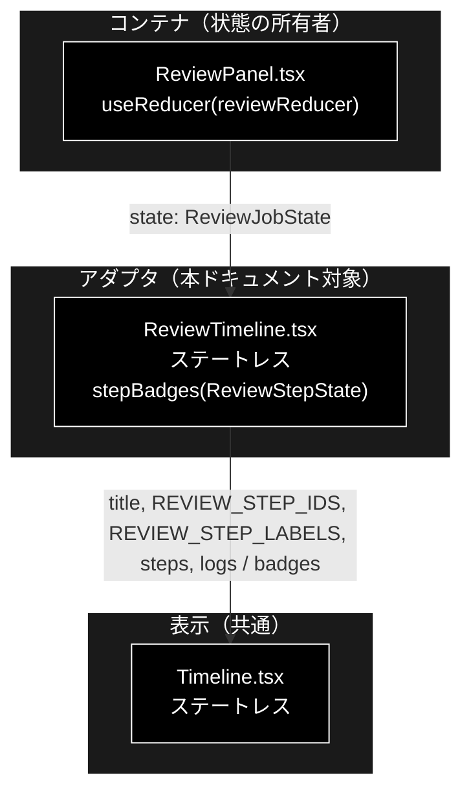
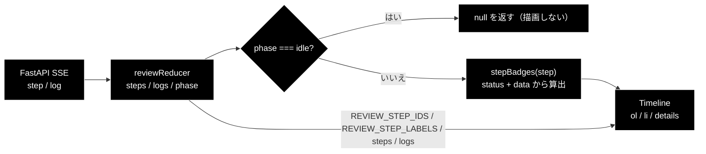
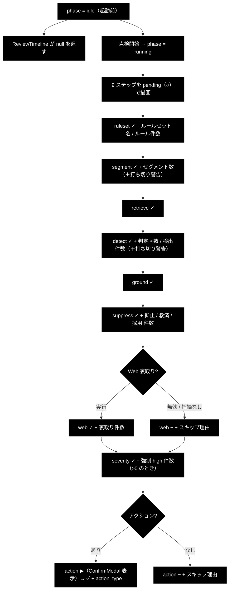

# ReviewTimeline.tsx - GRACE-Review ステップトレース（アダプタ） ドキュメント

**Version 1.0** | 最終更新: 2026-08-01

---

## 目次

- [概要](#概要)
- [1. コンポーネントツリー図](#1-コンポーネントツリー図)
- [2. Props インターフェース](#2-props-インターフェース)
- [3. 状態管理](#3-状態管理)
- [4. データフロー・副作用](#4-データフロー副作用)
- [5. API 通信・SSE イベント](#5-api-通信sse-イベント)
- [6. ユーザー操作フロー](#6-ユーザー操作フロー)
- [7. 型定義とバックエンド対応](#7-型定義とバックエンド対応)
- [8. スタイル・アクセシビリティ](#8-スタイルアクセシビリティ)
- [9. テスト](#9-テスト)
- [10. 変更履歴](#10-変更履歴)

---

## 概要

| 項目 | 内容 |
|---|---|
| ファイル | `frontend/src/components/ReviewTimeline.tsx` |
| 種別 | 表示コンポーネント（ステートレス）。実体は **`Timeline` へのアダプタ** |
| 親 | `ReviewPanel.tsx`（`<ReviewTimeline state={state} />`） |
| 子 | `Timeline.tsx` |
| 主な依存 | `../state/reviewReducer`（`REVIEW_STEP_IDS` / `REVIEW_STEP_LABELS` / `ReviewJobState` / `ReviewStepState`）、`./Timeline` |
| 対応バックエンド | `backend/app/core/review_agent.py`（`REVIEW_STEP_IDS` と各 `step_finished` の `data`） |

### 主な責務

- `phase === 'idle'` のときタイムラインを**描画しない**。
- Review 固有の定数（`REVIEW_STEP_IDS` / `REVIEW_STEP_LABELS`）を `Timeline` へ束ねて渡す。
- **Review 固有の補足バッジを算出する**（`stepBadges`）— 本ファイル唯一の実質的なロジック。

`StepTimeline`（Support 版）と**構造は完全に対称**で、違うのは定数とバッジの中身だけ。
共通化の設計意図は [`Timeline.md`](./Timeline.md) を参照。

### 主要機能一覧

| 機能 | 実装 | 説明 |
|---|---|---|
| 早期リターン | `if (state.phase === 'idle') return null;` | 起動前は何も出さない |
| 定数の受け渡し | `stepIds={REVIEW_STEP_IDS}` / `labels={REVIEW_STEP_LABELS}` | 9 ステップ固定順 |
| バッジ算出 | `stepBadges(step)` | 7 ステップ分の分岐＋全ステップ共通のスキップ理由 |
| 型のダウンキャスト | `badges={(step) => stepBadges(step as ReviewStepState)}` | `TimelineStep` → `ReviewStepState` |

---

## 1. コンポーネントツリー図



---

## 2. Props インターフェース

### 2.1 `ReviewTimeline`

```typescript
export function ReviewTimeline({ state }: { state: ReviewJobState }) { ... }
```

| Prop | 型 | 必須 | 既定値 | 説明 |
|---|---|:---:|---|---|
| `state` | `ReviewJobState` | ✅ | — | `ReviewPanel` の reducer state 全体 |

`state` から使うのは `phase` / `steps` / `logs` の 3 つ。
`jobId` / `document` / `documentTitle` / `selectedFindingId` / `intervention` / `result` /
`error` は**使わない**（親が別のコンポーネントへ配る）。

### 2.2 `Timeline` へ渡す値

```typescript
<Timeline
  title="ステップトレース"
  stepIds={REVIEW_STEP_IDS}
  labels={REVIEW_STEP_LABELS}
  steps={state.steps}
  logs={state.logs}
  badges={(step) => stepBadges(step as ReviewStepState)}
/>
```

| 渡す prop | 値 | 備考 |
|---|---|---|
| `title` | `"ステップトレース"` | **Support 側と同一文字列**（タブで文脈が分かるため区別していない） |
| `stepIds` | `REVIEW_STEP_IDS`（9 件） | `readonly ReviewStepId[]` → `readonly string[]` |
| `labels` | `REVIEW_STEP_LABELS` | `Record<ReviewStepId, string>` → `Record<string, string>` |
| `steps` | `state.steps` | `Record<ReviewStepId, ReviewStepState>` → `Record<string, TimelineStep>` |
| `logs` | `state.logs` | ステップに紐づかないログ |
| `badges` | ラムダで `stepBadges` を包む | `as ReviewStepState` のダウンキャストを含む（[`StepTimeline.md`](./StepTimeline.md) §2.2 と同じ事情） |

### コールバックの契約

`ReviewTimeline` は親へ通知しない（コールバック props なし）。

---

## 3. 状態管理

### 3.1 ローカル state（`useState`）

**なし。** `useState` / `useReducer` / `useEffect` / `useRef` を一切持たない。

### 3.2 reducer state（`useReducer`）

**なし。** `reviewReducer` は親（`ReviewPanel`）が持つ。

### 3.3 親から渡る状態（props 由来）

| 値 | 供給元 | 本コンポーネントでの扱い |
|---|---|---|
| `state.phase` | `reviewReducer` | 読み取りのみ。`'idle'` なら `null` を返す |
| `state.steps` | `reviewReducer`（`step` / `log` イベントの畳み込み） | 読み取りのみ。`Timeline` へ素通し＋`stepBadges` の入力 |
| `state.logs` | `reviewReducer`（`step` を持たない `log` イベント） | 読み取りのみ。`Timeline` へ素通し |

---

## 4. データフロー・副作用

### 4.1 副作用一覧（`useEffect`）

**なし。**

### 4.2 バッジ算出（`stepBadges`）— 本ファイルの中核

| # | ステップ | 条件 | バッジ文言 | 読む `data` キー |
|---|---|---|---|---|
| 0 | **全ステップ共通** | `skipped` かつ `typeof data.reason === 'string'` | `スキップ: {reason}` | `reason` |
| 1 | `ruleset` | `done` かつ `typeof data.name === 'string'` | `{name}` | `name` |
| 2 | `ruleset` | `done` かつ `typeof data.rules === 'number'` | `ルール {rules} 件` | `rules` |
| 3 | `segment` | `done` かつ `typeof data.segments === 'number'` | `{segments} セグメント` | `segments` |
| 4 | `segment` | `done` かつ `data.truncated === true` | `⚠️ 上限で打ち切り` | `truncated` |
| 5 | `detect` | `done` かつ `typeof data.llm_calls === 'number'` | `判定 {llm_calls} 回` | `llm_calls` |
| 6 | `detect` | `done` かつ `typeof data.detected_raw === 'number'` | `検出 {detected_raw} 件` | `detected_raw` |
| 7 | `detect` | `done` かつ `data.truncated === true` | `⚠️ 呼び出し上限で打ち切り` | `truncated` |
| 8 | `suppress` | `done` かつ `typeof data.suppressed === 'number'` | `抑止 {suppressed} 件` | `suppressed` |
| 9 | `suppress` | `done` かつ `typeof data.rescued === 'number' && > 0` | `救済 {rescued} 件` | `rescued` |
| 10 | `suppress` | `done` かつ `typeof data.kept === 'number'` | `採用 {kept} 件` | `kept` |
| 11 | `web` | `done` かつ `typeof data.checked === 'number'` | `裏取り {checked} 件` | `checked` |
| 12 | `severity` | `done` かつ `typeof data.forced_high === 'number' && > 0` | `重大リスク語で high {forced_high} 件` | `forced_high` |
| 13 | `action` | `done` | `{action_type}{dry_run ? '（dry-run）' : ''}` | `action_type` / `dry_run` |

**バッジを持たないステップ**: `retrieve` / `ground`（2 件）。

すべてのキーは `review_agent.py` の `step_finished` / `step_skipped` の呼び出しに実在する
（実コードを grep して確認済み）。

### 4.3 「打ち切り」バッジが 2 箇所ある理由

`truncated` は `segment` と `detect` の**両方**で立ちうる。原因が違うため文言も分けてある。

| ステップ | 文言 | 意味 |
|---|---|---|
| `segment` | `⚠️ 上限で打ち切り` | 文書が大きすぎてセグメント分割の上限に達した |
| `detect` | `⚠️ 呼び出し上限で打ち切り` | LLM 判定の呼び出し回数上限に達した |

> `ReviewPanel` は結果表示側でも `result.truncated` を見て
> 「⚠️ 文書が大きいため途中で打ち切りました（セグメントまたは判定回数の上限）」という
> 警告バナーを出す。**タイムラインのバッジはどちらの上限かを区別できる**ので、
> 分割して再実行する際の手がかりになる。

### 4.4 Support 版との書き方の違い

| 観点 | `StepTimeline`（Support） | `ReviewTimeline`（Review） |
|---|---|---|
| スキップ理由 | **`step.id === 'web'` に限定** | **ステップを問わず出す** |
| 0 件のバッジ | 出す（`抑止 0 件` 等に相当する分岐なし） | `rescued` / `forced_high` は **`> 0` のときだけ**出す |
| 型ガード | `action` だけ型チェック無し | `action` だけ型チェック無し（同じ） |

> ⚠️ **スキップ理由の扱いが非対称。** Review 側の書き方（ステップ非限定）の方が汎用的で、
> バックエンドが新しいステップに `reason` を足しても自動で表示される。
> Support 側は `web` 以外に `reason` を足しても画面に出ない。
> 現状のバックエンドは Support 側で `web` にしか `reason` を渡していないので実害は無いが、
> **揃えるなら Support 側を Review 側に合わせる**のが正しい方向である。

`rescued` / `forced_high` に `> 0` の条件が付いているのは、
**「0 件」というバッジがノイズになる**ため。`suppressed` / `kept` は 0 でも
「抑止されなかった／採用ゼロ」という情報になるので条件を付けていない。

### 4.5 データフロー図



---

## 5. API 通信・SSE イベント

**該当なし。** `fetch` / `EventSource` を呼ばない。SSE の購読は `ReviewPanel` が行う。

Review の SSE は **Support と同じイベント形式**（`SupportEvent` を共用）で、
異なるのは `result` の型（`ReviewResult`）だけ。詳細は
[`review_ui.md`](./review_ui.md) を参照。

---

## 6. ユーザー操作フロー

### 6.1 イベントハンドラ一覧

**イベントハンドラなし。** 操作要素は `Timeline` 側の `<details>` のみ
（[`Timeline.md`](./Timeline.md) §6.1）。

### 6.2 表示フロー図



---

## 7. 型定義とバックエンド対応

| TS 型 | 対応する Python | 定義元 |
|---|---|---|
| `ReviewJobState` | SSE イベント列の畳み込み結果（フロント側の構造） | `src/state/reviewReducer.ts` |
| `ReviewStepState` | 同上（1 ステップ分） | `src/state/reviewReducer.ts` |
| `REVIEW_STEP_IDS` | `REVIEW_STEP_IDS` | `backend/app/core/review_agent.py` |
| `REVIEW_STEP_LABELS` | （フロント固有の表示名） | `src/state/reviewReducer.ts` |

### `REVIEW_STEP_IDS` — 9 件（バックエンドと 1:1）

| # | ID | `REVIEW_STEP_LABELS` の表示名 | バッジ |
|---|---|---|:---:|
| 1 | `ruleset` | S1 ルールセット適用 | 名称 / ルール件数 |
| 2 | `segment` | ① Segment（文書を検査単位へ分割） | セグメント数 / 打ち切り |
| 3 | `retrieve` | ② Retrieve（規程を RAG 検索） | — |
| 4 | `detect` | ③ Detect（二段判定で違反候補を検出） | 判定回数 / 検出件数 / 打ち切り |
| 5 | `ground` | ④ Ground（指摘の根拠を検証） | — |
| 6 | `suppress` | ④' Suppress（誤検知抑止 + 救済） | 抑止 / 救済 / 採用 |
| 7 | `web` | **⑥** Web 裏取り（法改正・ガイドライン更新） | 裏取り件数 / スキップ理由 |
| 8 | `severity` | **⑤** Severity（重大度の確定＋強制 high） | 強制 high 件数 |
| 9 | `action` | ⑦ Action（レポート → HITL CONFIRM → 実行） | action_type（dry-run） |

> ⚠️ **ラベルの番号と並び順が一致していないのは仕様。** 配列の並び（＝画面上の並び＝
> **実行順**）は `web`（⑥）→ `severity`（⑤）である。番号は Support パイプラインとの
> 対応を示す**呼称**にすぎず、`reviewReducer.ts` にもその旨のコメントがある。
>
> ```typescript
> // 番号は Support のパイプラインとの対応を示す呼称。実行順とは一致しない
> // （Support で ④' が ⑤ の後に来るのと同じ）。
> ```
>
> Web 裏取りを先に済ませてから重大度を確定する必要があるため、この順序になっている。

### `step.data` のキー（バックエンドと突合済み）

`review_agent.py` に以下がすべて実在することを確認済み:
`name` / `rules` / `segments` / `truncated` / `llm_calls` / `detected_raw` /
`suppressed` / `rescued` / `kept` / `checked` / `forced_high` / `action_type` / `dry_run` / `reason`。

Review の `step_skipped` は 3 箇所で、うち `reason` 付きは 2 箇所:

```python
step_skipped("ruleset")                                              # reason なし
step_skipped("web", reason="無効" if not use_web else "指摘なし")
step_skipped("action", reason="指摘なし" if do_action else "アクション無効")
```

> ⚠️ **`data` は `Record<string, unknown>` なのでキー名の変更は `tsc` に引っかからない。**
> バックエンドで `detected_raw` を改名するとバッジが**黙って消える**だけで、
> CI は 4 ゲートとも緑のまま通る。

---

## 8. スタイル・アクセシビリティ

| 項目 | 内容 |
|---|---|
| スタイル方式 | **本ファイルは CSS クラスを一切指定しない。** すべて `Timeline` 側 |
| 影響する主要クラス | `.timeline`, `.step-*`, `.badge`（[`Timeline.md`](./Timeline.md) §8 参照） |
| ダークモード | 未対応 |

### アクセシビリティ・チェック

マークアップを持たないため、**評価対象はすべて `Timeline` 側**にある。
本ファイル固有の観点のみを挙げる。

| 観点 | 状態 |
|---|---|
| フォーム要素に `label` が対応しているか | 該当なし |
| モーダルにフォーカストラップがあるか | 該当なし |
| 状態表示が色のみに依存していないか（記号併用） | ✅ バッジは**文字列**（`抑止 3 件` 等）。色に依存しない |
| キーボードのみで操作できるか | 該当なし（操作要素を持たない） |
| 警告が記号のみに依存していないか | ✅ `⚠️ 上限で打ち切り` のように、絵文字に**文言を併記**している |
| 進捗が支援技術に伝わるか | ❌ `aria-live` 未対応（`Timeline` 側の課題） |

---

## 9. テスト

| テストファイル | 対象 | 実行 |
|---|---|---|
| `src/state/reviewReducer.test.ts` | `steps` / `logs` / `phase` を組み立てる側（13 ケース） | `npm test` |
| （コンポーネント本体の専用テストなし） | — | — |

**`stepBadges()` は未テスト。** モジュール private で export されていないため、
現状 vitest から触れない（Support 版と同じ状況）。

### テストを足すなら

`stepBadges` は副作用ゼロの純関数なので、`src/state/` へ切り出せばテストできる。
Review 固有で検証したいのは:

1. スキップ理由が**ステップを問わず**出ること（Support 版との差分）
2. `rescued` / `forced_high` が **0 のときバッジを出さない**こと
3. `suppressed` / `kept` は **0 でもバッジを出す**こと
4. `truncated` が `segment` と `detect` で**別文言**になること

### テスト方針

- **純ロジック（reducer / パーサ）を優先してテストする。** JSX のレンダリングテストは未導入
  （`@testing-library/react` 未導入）。`tsc --noEmit` の型検査でガードしている。
- CI では `npm run lint`（tsc）→ `npm test`（vitest）→ `npm run build` の順に実行され、
  **いずれも blocking**。

---

## 10. 変更履歴

| 版 | 日付 | 変更内容 |
|---|---|---|
| 1.0 | 2026-08-01 | 初版作成 |
