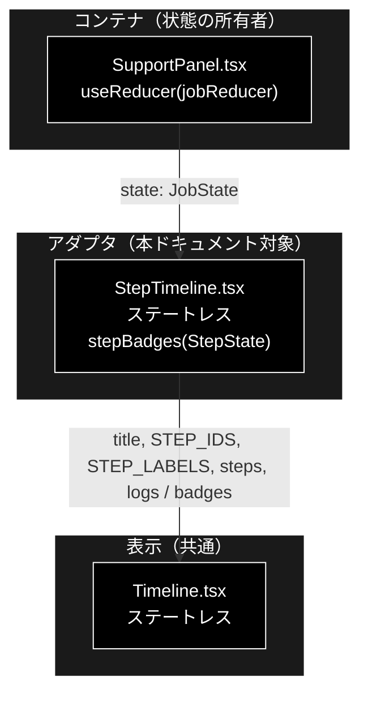
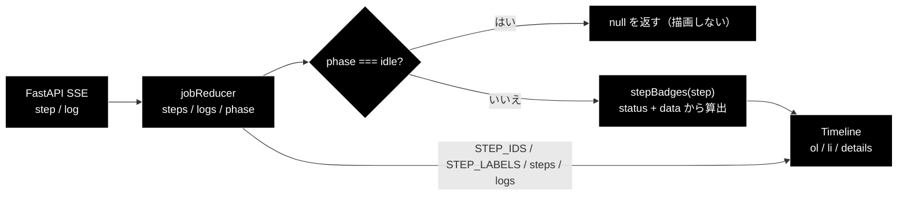
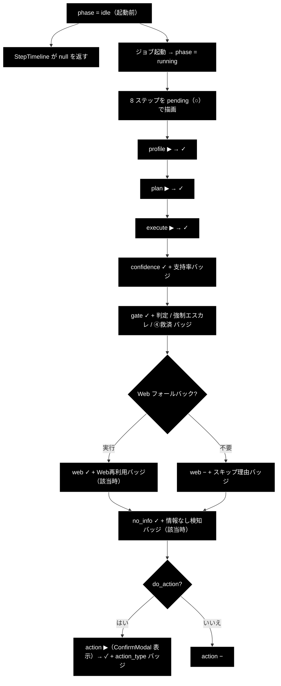

# StepTimeline.tsx - GRACE-Support ステップトレース（アダプタ） ドキュメント

**Version 1.0** | 最終更新: 2026-08-01

---

## 目次

- [概要](#概要)
- [1. コンポーネントツリー図](#1-コンポーネントツリー図)
- [2. Props インターフェース](#2-props-インターフェース)
- [3. 状態管理](#3-状態管理)
- [4. データフロー・副作用](#4-データフロー副作用)
- [5. API 通信・SSE イベント](#5-api-通信sse-イベント)
- [6. ユーザー操作フロー](#6-ユーザー操作フロー)
- [7. 型定義とバックエンド対応](#7-型定義とバックエンド対応)
- [8. スタイル・アクセシビリティ](#8-スタイルアクセシビリティ)
- [9. テスト](#9-テスト)
- [10. 変更履歴](#10-変更履歴)

---

## 概要

| 項目 | 内容 |
|---|---|
| ファイル | `frontend/src/components/StepTimeline.tsx` |
| 種別 | 表示コンポーネント（ステートレス）。実体は **`Timeline` へのアダプタ** |
| 親 | `SupportPanel.tsx`（`<StepTimeline state={state} />`） |
| 子 | `Timeline.tsx` |
| 主な依存 | `../state/jobReducer`（`STEP_IDS` / `STEP_LABELS` / `JobState` / `StepState`）、`./Timeline` |
| 対応バックエンド | `backend/app/core/support_agent.py`（`STEP_IDS` と各 `step_finished` の `data`） |

### 主な責務

- `phase === 'idle'` のときタイムラインを**描画しない**（起動前に空の枠を出さない）。
- Support 固有の定数（`STEP_IDS` / `STEP_LABELS`）を `Timeline` へ束ねて渡す。
- **Support 固有の補足バッジを算出する**（`stepBadges`）— これが本ファイル唯一の実質的なロジック。

**マークアップを一切持たない。** `<ol>` / `<li>` / `<details>` はすべて `Timeline` 側にある。
共通化の設計意図は [`Timeline.md`](./Timeline.md) を参照。

### 主要機能一覧

| 機能 | 実装 | 説明 |
|---|---|---|
| 早期リターン | `if (state.phase === 'idle') return null;` | 起動前は何も出さない |
| 定数の受け渡し | `stepIds={STEP_IDS}` / `labels={STEP_LABELS}` | 8 ステップ固定順 |
| バッジ算出 | `stepBadges(step)` | 6 ステップ分の分岐（下表） |
| 型のダウンキャスト | `badges={(step) => stepBadges(step as StepState)}` | `TimelineStep` → `StepState`（§2.2） |

---

## 1. コンポーネントツリー図



---

## 2. Props インターフェース

### 2.1 `StepTimeline`

インライン型で受けている（`interface Props` は切っていない）。

```typescript
export function StepTimeline({ state }: { state: JobState }) { ... }
```

| Prop | 型 | 必須 | 既定値 | 説明 |
|---|---|:---:|---|---|
| `state` | `JobState` | ✅ | — | `SupportPanel` の reducer state 全体 |

`state` から使うのは `phase` / `steps` / `logs` の 3 つ。
`jobId` / `intervention` / `result` / `error` は**使わない**（親が別のコンポーネントへ配る）。

### 2.2 `Timeline` へ渡す値

```typescript
<Timeline
  title="ステップトレース"
  stepIds={STEP_IDS}
  labels={STEP_LABELS}
  steps={state.steps}
  logs={state.logs}
  badges={(step) => stepBadges(step as StepState)}
/>
```

| 渡す prop | 値 | 備考 |
|---|---|---|
| `title` | `"ステップトレース"` | Review 側と同じ文字列 |
| `stepIds` | `STEP_IDS`（8 件） | `readonly StepId[]` → `readonly string[]` |
| `labels` | `STEP_LABELS` | `Record<StepId, string>` → `Record<string, string>` |
| `steps` | `state.steps` | `Record<StepId, StepState>` → `Record<string, TimelineStep>` |
| `logs` | `state.logs` | ステップに紐づかないログ |
| `badges` | ラムダで `stepBadges` を包む | **`as StepState` のダウンキャストを含む** |

> ⚠️ **`step as StepState` は型検査を迂回している。** `Timeline` は `TimelineStep`
> （`id: string`）で渡してくるが、`stepBadges` は `StepState`（`id: StepId`）を要求するため、
> アサーションで通している。実行時には `stepIds={STEP_IDS}` から来た値しか渡らないので
> 安全だが、**`stepIds` に別の集合を渡すとここが嘘になる**。
> `stepBadges` の引数を `TimelineStep` にすればキャストは消えるが、
> `step.id === 'web'` のような比較で `StepId` の網羅性チェックを失う（トレードオフ）。

### コールバックの契約

`StepTimeline` は親へ通知しない（コールバック props なし）。

---

## 3. 状態管理

### 3.1 ローカル state（`useState`）

**なし。** `useState` / `useReducer` / `useEffect` / `useRef` を一切持たない。

### 3.2 reducer state（`useReducer`）

**なし。** `jobReducer` は親（`SupportPanel`）が持つ。本コンポーネントは
その state を丸ごと受け取って読むだけ。

### 3.3 親から渡る状態（props 由来）

| 値 | 供給元 | 本コンポーネントでの扱い |
|---|---|---|
| `state.phase` | `jobReducer` | 読み取りのみ。`'idle'` なら `null` を返す |
| `state.steps` | `jobReducer`（`step` / `log` イベントの畳み込み） | 読み取りのみ。`Timeline` へ素通し＋`stepBadges` の入力 |
| `state.logs` | `jobReducer`（`step` を持たない `log` イベント） | 読み取りのみ。`Timeline` へ素通し |

---

## 4. データフロー・副作用

### 4.1 副作用一覧（`useEffect`）

**なし。**

### 4.2 バッジ算出（`stepBadges`）— 本ファイルの中核

**すべてのバッジは `step.status` と `step.data` だけから決まる純関数**である。
`data` は SSE の `step` イベントで**置換**されるため、`status === 'done'` を条件にする
バッジは `step_finished` の payload を読むことになる（[`Timeline.md`](./Timeline.md) §4.2）。

| # | ステップ | 条件 | バッジ文言 | 読む `data` キー | バックエンドの発行元 |
|---|---|---|---|---|---|
| 1 | `web` | `done` かつ `data.web_reused === true` | `Web再利用（重複推論を省略）` | `web_reused` | `step_finished("web", web_reused=..., ...)` |
| 2 | `web` | `skipped` かつ `typeof data.reason === 'string'` | `スキップ: {reason}` | `reason` | `step_skipped("web", reason=...)` |
| 3 | `gate` | `done` かつ `data.forced_escalate === true` | `強制エスカレ（'{matched_keyword}'）` | `forced_escalate` / `matched_keyword` | `step_finished("gate", forced_escalate=..., matched_keyword=...)` |
| 4 | `gate` | `done` かつ `data.rescued === true` | `④救済（出典付き・矛盾なし回答を維持）` | `rescued` | `step_finished("gate", rescued=...)` |
| 5 | `gate` | `done` かつ `typeof data.decision === 'string'` | `判定: {decision}` | `decision` | `step_finished("gate", decision=...)` |
| 6 | `no_info` | `done` かつ `data.no_info === true` | `情報なし回答を検知 → escalate` | `no_info` | `step_finished("no_info", no_info=...)` |
| 7 | `confidence` | `done` かつ `typeof data.support_rate === 'number'` | `支持率 {support_rate.toFixed(2)}` | `support_rate` | `step_finished("confidence", support_rate=...)` |
| 8 | `action` | `done` | `{action_type}{dry_run ? '（dry-run）' : ''}` | `action_type` / `dry_run` | `step_finished("action", action_type=..., dry_run=...)` |

**バッジを持たないステップ**: `profile` / `plan` / `execute`（3 件）。
実行の有無だけが分かればよく、補足すべき判定値が無いため。

### 4.3 スキップ理由を出すのが `web` だけである理由

Support の `step_skipped` 呼び出しは 4 箇所あるが、**`reason` を渡しているのは `web` だけ**。

```python
step_skipped("profile")                     # reason なし
step_skipped("web", reason="内部回答で確定" if decision == "answer"
             else ("強制エスカレ" if forced_escalate else "Web フォールバック無効"))
step_skipped("no_info")                     # reason なし
step_skipped("action")                      # reason なし
```

したがって `step.id === 'web'` に限定した実装は現状のバックエンドと整合している。

> ⚠️ **ただし Review 側（`ReviewTimeline`）は `step.id` を問わずスキップ理由を出す。**
> 両者の書き方が違うため、**Support の他ステップに `reason` を足しても画面に出ない**。
> 出したいなら `stepBadges` の条件から `step.id === 'web'` を外す
> （＝Review 側と同じ書き方に揃える）必要がある。

### 4.4 防御的な型チェックの意味

| 書き方 | 意図 |
|---|---|
| `data.web_reused === true` | `undefined` / `false` を弾く。**存在チェックと値チェックを兼ねる** |
| `typeof data.reason === 'string'` | `data` が `Record<string, unknown>` なので、`string` を確認しないと文字列連結できない |
| `typeof data.support_rate === 'number'` | 同上。`.toFixed(2)` を呼ぶ前に必須 |
| `` `${data.action_type}` `` | **チェック無し**。`undefined` なら `"undefined（dry-run）"` と表示される |

> ⚠️ **`action` のバッジだけ型チェックが無い。** `step_finished("action", ...)` は
> 必ず `action_type` を渡すので現状は問題ないが、他のバッジと書き方が揃っていない。
> `data.dry_run` も `? :` の真偽判定なので、`undefined` は「dry-run ではない」と扱われる。

### 4.5 データフロー図



---

## 5. API 通信・SSE イベント

**該当なし。** `fetch` / `EventSource` を呼ばない。SSE の購読は `SupportPanel` が行う。

関係するイベントは `step`（バッジと記号の元）と `log`（折りたたみログの元）の 2 種。
イベント種別の全体像は [`SupportPanel.md`](./SupportPanel.md) を参照。

---

## 6. ユーザー操作フロー

### 6.1 イベントハンドラ一覧

**イベントハンドラなし。** 操作要素は `Timeline` 側の `<details>` のみ
（[`Timeline.md`](./Timeline.md) §6.1）。

### 6.2 表示フロー図



---

## 7. 型定義とバックエンド対応

| TS 型 | 対応する Python | 定義元 |
|---|---|---|
| `JobState` | SSE イベント列の畳み込み結果（フロント側の構造） | `src/state/jobReducer.ts` |
| `StepState` | 同上（1 ステップ分） | `src/state/jobReducer.ts` |
| `STEP_IDS` | `STEP_IDS` | `backend/app/core/support_agent.py` |
| `STEP_LABELS` | （フロント固有の表示名） | `src/state/jobReducer.ts` |

### `STEP_IDS` — 8 件（バックエンドと 1:1）

| # | ID | `STEP_LABELS` の表示名 | バッジ |
|---|---|---|:---:|
| 1 | `profile` | 業界プロファイル適用 | — |
| 2 | `plan` | ① Plan（planner） | — |
| 3 | `execute` | ② Execute（内部RAG → reasoning） | — |
| 4 | `confidence` | ③ Groundedness（根拠検証） | 支持率 |
| 5 | `gate` | ④ 回答ゲート＋強制エスカレ＋救済 | 判定 / 強制エスカレ / ④救済 |
| 6 | `web` | ⑤ Web フォールバック | Web再利用 / スキップ理由 |
| 7 | `no_info` | ④' 情報なし回答検知 | 情報なし検知 |
| 8 | `action` | ⑥ Action（本人確認 → HITL CONFIRM → 実行） | action_type（dry-run） |

> ⚠️ **`no_info`（④'）が `web`（⑤）の後ろにある**のは誤りではない。
> ④' は Web フォールバックの結果に対しても「情報なし回答」を検知する必要があるため、
> 実行順が ⑤ → ④' になっている（`CLAUDE.md` のパイプライン図と一致）。
> 番号順ではなく**実行順**で並べてある。

### `step.data` のキー（バックエンドと突合済み）

本コンポーネントが読むキーはすべて `support_agent.py` の `step_finished` /
`step_skipped` の呼び出しに実在する（§4.2 の表の最右列）。

> ⚠️ **`data` は `Record<string, unknown>` なのでキー名の変更は `tsc` に引っかからない。**
> バックエンドで `support_rate` を改名すると、バッジが**黙って消える**だけで
> CI は 4 ゲートとも緑のまま通る。ここは型検査の外側にある。

---

## 8. スタイル・アクセシビリティ

| 項目 | 内容 |
|---|---|
| スタイル方式 | **本ファイルは CSS クラスを一切指定しない。** すべて `Timeline` 側 |
| 影響する主要クラス | `.timeline`, `.step-*`, `.badge`（[`Timeline.md`](./Timeline.md) §8 参照） |
| ダークモード | 未対応 |

### アクセシビリティ・チェック

マークアップを持たないため、**評価対象はすべて `Timeline` 側**にある。
本ファイル固有の観点のみを挙げる。

| 観点 | 状態 |
|---|---|
| フォーム要素に `label` が対応しているか | 該当なし |
| モーダルにフォーカストラップがあるか | 該当なし |
| 状態表示が色のみに依存していないか（記号併用） | ✅ バッジは**文字列**（`判定: answer` 等）。色に依存しない |
| キーボードのみで操作できるか | 該当なし（操作要素を持たない） |
| バッジ文言が単独で意味を成すか | ✅ `④救済（出典付き・矛盾なし回答を維持）` のように、記号だけでなく説明を含む |
| 進捗が支援技術に伝わるか | ❌ `aria-live` 未対応（`Timeline` 側の課題） |

---

## 9. テスト

| テストファイル | 対象 | 実行 |
|---|---|---|
| `src/state/jobReducer.test.ts` | `steps` / `logs` / `phase` を組み立てる側（7 ケース） | `npm test` |
| （コンポーネント本体の専用テストなし） | — | — |

**`stepBadges()` は未テスト。** モジュール private で export されていないため、
現状 vitest から触れない。

### テストを足すなら

`stepBadges` は**副作用ゼロの純関数**（入力 `StepState` → 出力 `string[]`）なので、
`src/state/` へ切り出して export すればそのままテストできる
（`queryParams.ts` / `highlight.ts` と同じ方式）。検証したいのは:

1. `status !== 'done'` のとき該当バッジが出ないこと（`web` のスキップを除く）
2. `data` のキーが欠けているときバッジが出ないこと（`typeof` ガードが効いているか）
3. `support_rate` が `toFixed(2)` で整形されること
4. `gate` で 3 バッジが同時に出うること（強制エスカレ + 救済 + 判定）

### テスト方針

- **純ロジック（reducer / パーサ）を優先してテストする。** JSX のレンダリングテストは未導入
  （`@testing-library/react` 未導入）。`tsc --noEmit` の型検査でガードしている。
- CI では `npm run lint`（tsc）→ `npm test`（vitest）→ `npm run build` の順に実行され、
  **いずれも blocking**。

---

## 10. 変更履歴

| 版 | 日付 | 変更内容 |
|---|---|---|
| 1.0 | 2026-08-01 | 初版作成 |
